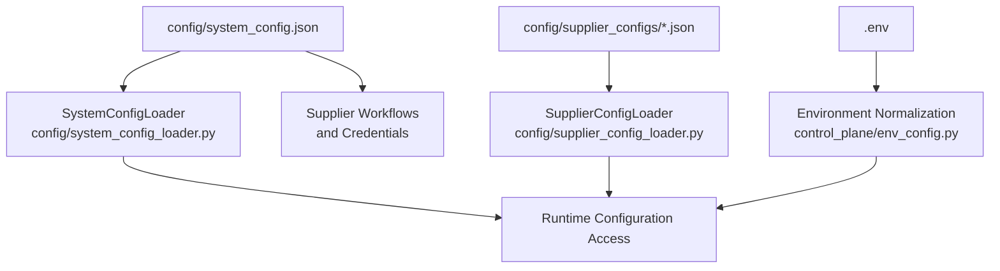
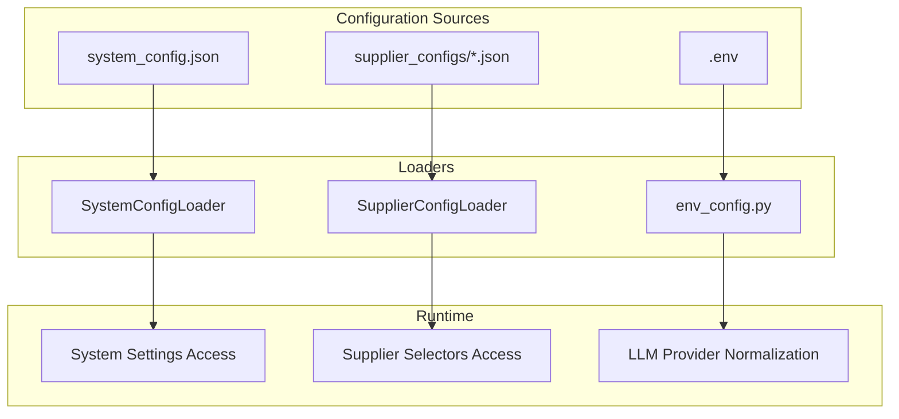
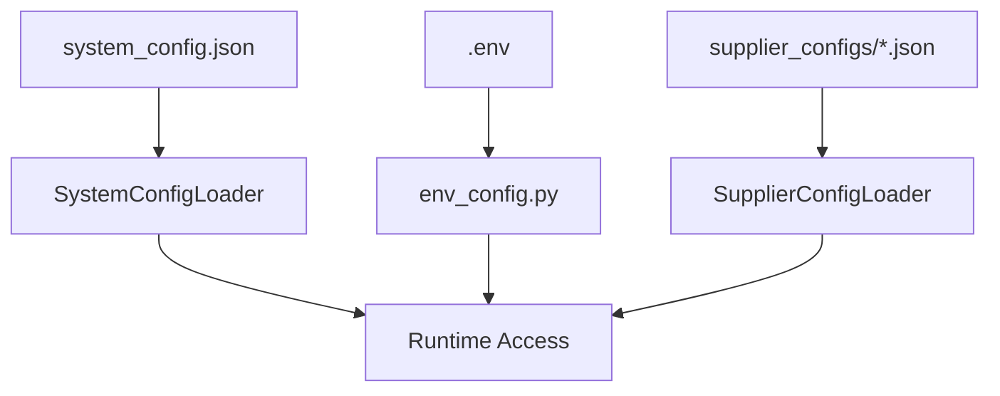

# System Configuration

<cite>
**Referenced Files in This Document**
- [system_config.json](file://config/system_config.json)
- [system_config_loader.py](file://config/system_config_loader.py)
- [supplier_config_loader.py](file://config/supplier_config_loader.py)
- [env_config.py](file://control_plane/env_config.py)
- [CONFIGURATION_GUIDE.md](file://docs/CONFIGURATION_GUIDE.md)
- [toggle_definition_proof.md](file://config/toggle_definition_proof.md)
- [comprehensive_toggle_analysis_report.md](file://config/comprehensive_toggle_analysis_report.md)
- [requirements.txt](file://requirements.txt)
- [clearance_king_system_config_additions.json](file://config/clearance_king_system_config_additions.json)
- [full-first.json](file://config/full-first.json)
- [supplier_config.md](file://config/supplier_config.md)
</cite>

## Table of Contents
1. [Introduction](#introduction)
2. [Project Structure](#project-structure)
3. [Core Components](#core-components)
4. [Architecture Overview](#architecture-overview)
5. [Detailed Component Analysis](#detailed-component-analysis)
6. [Dependency Analysis](#dependency-analysis)
7. [Performance Considerations](#performance-considerations)
8. [Troubleshooting Guide](#troubleshooting-guide)
9. [Conclusion](#conclusion)
10. [Appendices](#appendices)

## Introduction
This document provides comprehensive guidance for configuring the Amazon FBA Agent System. It explains the complete system configuration structure, including pipeline toggles, system settings, processing limits, performance parameters, cache controls, monitoring configurations, environment variables, validation mechanisms, and troubleshooting procedures. It also includes practical configuration profiles for development, testing, and production environments, along with optimization guidance tailored to different supplier types and processing volumes.

## Project Structure
The system uses a centralized configuration approach:
- Primary configuration: config/system_config.json
- Environment variables: .env and runtime environment
- Supplier-specific configurations: config/supplier_configs/*.json
- Configuration loaders: Python modules for system and supplier configs
- Documentation: docs/CONFIGURATION_GUIDE.md

**Diagram sources**
- [system_config.json](file://config/system_config.json#L1-L384)
- [system_config_loader.py](file://config/system_config_loader.py#L1-L87)
- [supplier_config_loader.py](file://config/supplier_config_loader.py#L1-L187)
- [env_config.py](file://control_plane/env_config.py#L1-L45)

**Section sources**
- [system_config.json](file://config/system_config.json#L1-L384)
- [system_config_loader.py](file://config/system_config_loader.py#L1-L87)
- [supplier_config_loader.py](file://config/supplier_config_loader.py#L1-L187)
- [env_config.py](file://control_plane/env_config.py#L1-L45)
- [CONFIGURATION_GUIDE.md](file://docs/CONFIGURATION_GUIDE.md#L1-L749)

## Core Components
The configuration system comprises the following core components:

- System settings: global runtime parameters (e.g., environment, test mode, output roots, browser reuse)
- Processing limits: price filters, product caps, and category constraints
- Performance parameters: concurrency, timeouts, retries, and batching
- Cache controls: TTL, size limits, selective clearing, and validation
- Monitoring: metrics intervals, health checks, and alert thresholds
- Pipeline toggles: hybrid processing modes, batch synchronization, supplier cache control, and extraction progress tracking
- Supplier workflows: per-supplier URLs, categories, authentication, and test product URLs
- Integrations: Keepa, OpenAI, and optional AI features
- Authentication: startup verification, periodic checks, and circuit breaker protection
- Output configuration: base directory, report format, file naming, and retention

**Section sources**
- [system_config.json](file://config/system_config.json#L11-L384)
- [CONFIGURATION_GUIDE.md](file://docs/CONFIGURATION_GUIDE.md#L30-L436)

## Architecture Overview
The configuration architecture integrates static JSON configuration with environment variables and supplier-specific selectors. The SystemConfigLoader centralizes access to system settings, while the SupplierConfigLoader manages per-domain scraping selectors. Environment normalization ensures consistent LLM provider configuration.

**Diagram sources**
- [system_config.json](file://config/system_config.json#L1-L384)
- [system_config_loader.py](file://config/system_config_loader.py#L9-L87)
- [supplier_config_loader.py](file://config/supplier_config_loader.py#L23-L187)
- [env_config.py](file://control_plane/env_config.py#L26-L45)

## Detailed Component Analysis

### System Settings
System settings define the operational profile of the agent:
- Environment: development, testing, production
- Test mode: enables test behaviors
- Output roots: base directories for outputs
- Browser reuse and tab limits: performance and resource management
- Batch sizes: supplier extraction, linking map, financial report, and cycle limits

Configuration examples and defaults are documented in the configuration guide and system config JSON.

**Section sources**
- [system_config.json](file://config/system_config.json#L11-L41)
- [CONFIGURATION_GUIDE.md](file://docs/CONFIGURATION_GUIDE.md#L30-L53)

### Processing Limits
Processing limits control filtering and throughput:
- Price filters: minimum and maximum GBP, midpoint for analysis
- Category and run caps: maximum products per category, per run, and minimum per category
- Category validation: enable validation, minimum products, and timeout

These limits influence extraction and analysis phases and are validated through toggle experiments.

**Section sources**
- [system_config.json](file://config/system_config.json#L48-L61)
- [toggle_definition_proof.md](file://config/toggle_definition_proof.md#L29-L74)
- [comprehensive_toggle_analysis_report.md](file://config/comprehensive_toggle_analysis_report.md#L7-L68)

### Performance Parameters
Performance parameters tune concurrency, timeouts, retries, and batching:
- Concurrency: maximum concurrent requests
- Timeouts: navigation, search input, results wait, selector wait, page load, HTTP request
- Retries: attempts and delay
- Batch sizing: general batch size and rate limiting parameters
- Matching thresholds: title similarity levels

These parameters balance throughput against stability and supplier rate limits.

**Section sources**
- [system_config.json](file://config/system_config.json#L139-L163)
- [CONFIGURATION_GUIDE.md](file://docs/CONFIGURATION_GUIDE.md#L94-L119)

### Cache Controls
Cache controls manage persistence and integrity:
- TTL hours and maximum size in MB
- Selective clear configuration: preserve analyzed products, AI categories, linking map, and failure handling
- Supplier cache control: update frequency, force update on interruption, cache modes (conservative/balanced/aggressive), validation settings

Cache tuning is critical for memory-constrained environments and data integrity.

**Section sources**
- [system_config.json](file://config/system_config.json#L164-L175)
- [system_config.json](file://config/system_config.json#L62-L77)
- [full-first.json](file://config/full-first.json#L209-L220)
- [full-first.json](file://config/full-first.json#L406-L428)

### Monitoring Configuration
Monitoring defines observability:
- Enabled flag, metrics interval, health check interval
- Log level
- Alert thresholds: CPU percent, memory percent, error rate per hour

Monitoring supports proactive system management and troubleshooting.

**Section sources**
- [system_config.json](file://config/system_config.json#L176-L186)
- [full-first.json](file://config/full-first.json#L198-L208)

### Pipeline Toggles
Pipeline toggles govern workflow behavior:
- Hybrid processing: enable, switch timing, processing modes (sequential, chunked, balanced), memory management
- Batch synchronization: enable, synchronize all batch sizes, target batch size, affected settings
- Supplier extraction progress: enable tracking, subcategory and product indexing, recovery modes, progress display, state persistence
- Supplier cache control: enable, update frequency, force update on interruption, cache modes, validation

Toggle integration status and experimental evidence are documented in dedicated reports.

**Section sources**
- [system_config.json](file://config/system_config.json#L43-L127)
- [system_config.json](file://config/system_config.json#L128-L138)
- [system_config.json](file://config/system_config.json#L78-L93)
- [toggle_definition_proof.md](file://config/toggle_definition_proof.md#L27-L494)
- [comprehensive_toggle_analysis_report.md](file://config/comprehensive_toggle_analysis_report.md#L7-L466)

### Supplier Workflows and Credentials
Supplier workflows define per-supplier behavior:
- Workflow keys: supplier name, URL, categories config path, test product URL, authentication flags, workflow type, session persistence
- Credentials: username/password per supplier domain

Supplier-specific selectors are managed via the SupplierConfigLoader.

**Section sources**
- [system_config.json](file://config/system_config.json#L265-L338)
- [system_config.json](file://config/system_config.json#L247-L264)
- [supplier_config_loader.py](file://config/supplier_config_loader.py#L23-L107)
- [clearance_king_system_config_additions.json](file://config/clearance_king_system_config_additions.json#L1-L20)

### Integrations and AI Features
Integrations configure external services:
- Keepa: enable, API key, rate limit
- OpenAI: enable (default disabled)
- AI features: category selection, product matching quality threshold, EAN search, title fallback

Financial calculations rely on Amazon marketplace settings and supplier pricing inclusion of VAT.

**Section sources**
- [system_config.json](file://config/system_config.json#L350-L361)
- [system_config.json](file://config/system_config.json#L208-L246)
- [full-first.json](file://config/full-first.json#L221-L232)

### Authentication Configuration
Authentication protects supplier access:
- Enable/disable, startup verification, consecutive failure threshold, periodic intervals, max consecutive failures, failure delay, minimum products between logins
- Adaptive threshold and circuit breaker settings

**Section sources**
- [system_config.json](file://config/system_config.json#L362-L377)
- [full-first.json](file://config/full-first.json#L468-L488)

### Output Configuration
Output settings control file management:
- Base directory, report format, intermediate result saving, file naming pattern and timestamp format, retention policy (keep days, archive after days)

**Section sources**
- [system_config.json](file://config/system_config.json#L187-L199)
- [full-first.json](file://config/full-first.json#L185-L197)

### Environment Variables
Environment variables override or augment configuration:
- API keys: OpenAI, Keepa
- Browser configuration: debug port, timeouts
- Memory management: thresholds and circuit breaker settings
- Performance tuning: concurrency, timeouts, retries, rate limiting, processing limits
- Supplier authentication: usernames and passwords

Environment normalization ensures consistent LLM provider configuration.

**Section sources**
- [CONFIGURATION_GUIDE.md](file://docs/CONFIGURATION_GUIDE.md#L242-L314)
- [env_config.py](file://control_plane/env_config.py#L26-L45)
- [requirements.txt](file://requirements.txt#L1-L81)

### Configuration Profiles
Profiles tailor configuration for different environments:
- Development: environment=development, test_mode=true, reduced limits, headless=false, log level DEBUG
- Production: environment=production, test_mode=false, higher limits, headless=false, log level INFO
- Testing: environment=testing, test_mode=true, smallest limits, headless=true, log level DEBUG

**Section sources**
- [CONFIGURATION_GUIDE.md](file://docs/CONFIGURATION_GUIDE.md#L438-L495)

### Configuration Validation and Troubleshooting
Validation scripts and checks ensure correctness:
- JSON syntax validation
- Environment readiness checks (Chrome debug port, dependencies, output directories)
- Security checks for sensitive data in .env
- Toggle integration verification and experimental evidence

Troubleshooting guidance covers common issues: Chrome debug port conflicts, configuration file errors, memory configuration problems, and performance optimization recommendations.

**Section sources**
- [CONFIGURATION_GUIDE.md](file://docs/CONFIGURATION_GUIDE.md#L499-L749)
- [toggle_definition_proof.md](file://config/toggle_definition_proof.md#L472-L494)
- [comprehensive_toggle_analysis_report.md](file://config/comprehensive_toggle_analysis_report.md#L427-L466)

## Dependency Analysis
Configuration dependencies span static JSON, environment variables, and supplier-specific selectors. The SystemConfigLoader provides centralized access to system settings, while the SupplierConfigLoader manages per-domain scraping configurations. Environment normalization ensures consistent LLM provider configuration.

**Diagram sources**
- [system_config_loader.py](file://config/system_config_loader.py#L9-L87)
- [supplier_config_loader.py](file://config/supplier_config_loader.py#L23-L187)
- [env_config.py](file://control_plane/env_config.py#L26-L45)

**Section sources**
- [system_config_loader.py](file://config/system_config_loader.py#L1-L87)
- [supplier_config_loader.py](file://config/supplier_config_loader.py#L1-L187)
- [env_config.py](file://control_plane/env_config.py#L1-L45)

## Performance Considerations
Optimizing configuration for different scenarios:
- High-volume processing: increase max_concurrent_requests, batch_size, adjust rate limiting and batch delays, increase supplier extraction batch size and max products per cycle
- Memory-constrained systems: reduce concurrent requests and batch sizes, adjust memory thresholds, enable smart clearing and file-based counting

Best practices include balancing throughput with system resources, respecting supplier rate limits, and monitoring memory usage.

**Section sources**
- [CONFIGURATION_GUIDE.md](file://docs/CONFIGURATION_GUIDE.md#L630-L670)
- [system_config.json](file://config/system_config.json#L139-L163)

## Troubleshooting Guide
Common configuration issues and resolutions:
- Chrome debug port accessibility: ensure port is free and Chrome launched with remote debugging enabled
- Configuration file errors: validate JSON syntax and check for trailing commas or unmatched quotes
- Memory configuration issues: verify system memory and adjust thresholds accordingly
- Toggle integration discrepancies: consult toggle definition proof and comprehensive toggle analysis reports
- Security concerns: avoid committing credentials; use environment variables; sanitize comments

**Section sources**
- [CONFIGURATION_GUIDE.md](file://docs/CONFIGURATION_GUIDE.md#L583-L670)
- [toggle_definition_proof.md](file://config/toggle_definition_proof.md#L1-L494)
- [comprehensive_toggle_analysis_report.md](file://config/comprehensive_toggle_analysis_report.md#L1-L466)

## Conclusion
The Amazon FBA Agent System provides a robust, configurable framework for supplier data extraction and Amazon analysis. By leveraging centralized JSON configuration, environment variables, and supplier-specific selectors, operators can tailor the system to diverse environments and workloads. Proper validation, monitoring, and troubleshooting practices ensure reliable operation across development, testing, and production scenarios.

## Appendices

### Configuration Parameter Reference
- System settings: environment, test_mode, output_root, reuse_browser, max_tabs, batch sizes
- Processing limits: min/max price, product caps, category validation
- Performance: concurrency, timeouts, retries, batch size, rate limiting, matching thresholds
- Cache: TTL, size limits, selective clear, supplier cache control
- Monitoring: intervals, log level, alert thresholds
- Pipeline toggles: hybrid processing, batch synchronization, extraction progress, cache control
- Workflows and credentials: supplier URLs, categories, authentication, test product URLs
- Integrations: Keepa, OpenAI, AI features
- Authentication: thresholds, periodic intervals, circuit breaker
- Output: base_dir, report_format, file naming, retention

**Section sources**
- [system_config.json](file://config/system_config.json#L11-L384)
- [CONFIGURATION_GUIDE.md](file://docs/CONFIGURATION_GUIDE.md#L30-L436)