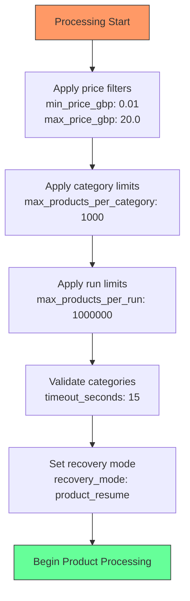
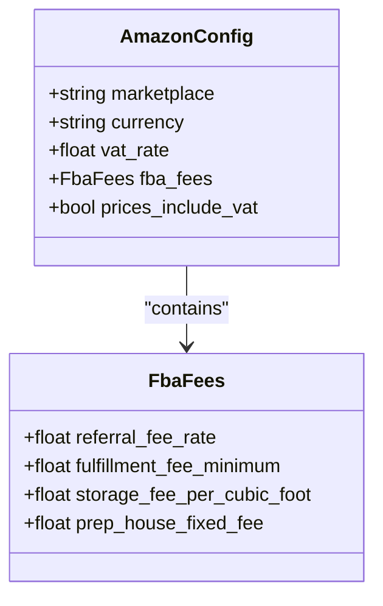
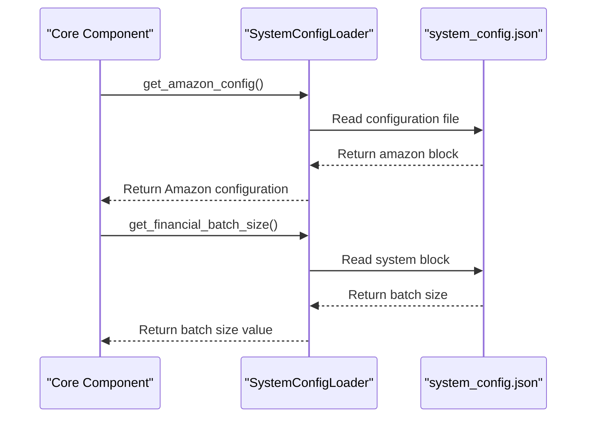

# System Configuration

<cite>
**Referenced Files in This Document**   
- [system_config.json](file://config/system_config.json)
- [system_config_loader.py](file://config/system_config_loader.py)
- [FBA_Financial_calculator.py](file://tools/FBA_Financial_calculator.py)
- [fixed_enhanced_state_manager.py](file://utils/fixed_enhanced_state_manager.py)
</cite>

## Table of Contents
1. [Introduction](#introduction)
2. [Configuration Structure](#configuration-structure)
3. [System Settings](#system-settings)
4. [Processing Limits](#processing-limits)
5. [Performance Configuration](#performance-configuration)
6. [Chrome Browser Settings](#chrome-browser-settings)
7. [Analysis Parameters](#analysis-parameters)
8. [Amazon Marketplace Configuration](#amazon-marketplace-configuration)
9. [Authentication Settings](#authentication-settings)
10. [AI Features](#ai-features)
11. [Configuration Access and Usage](#configuration-access-and-usage)
12. [Component Integration](#component-integration)
13. [Common Configuration Issues](#common-configuration-issues)
14. [Best Practices](#best-practices)

## Introduction
The Amazon FBA Agent System relies on a comprehensive configuration framework defined in system_config.json to govern its behavior across various operational domains. This document details the global settings that control the system's workflow, performance, and integration with external services. The configuration system enables fine-grained control over processing behavior, allowing users to optimize the agent for specific suppliers, market conditions, and hardware environments. Understanding these settings is crucial for effective system operation and troubleshooting.

## Configuration Structure
The system configuration is organized into logical blocks that correspond to different aspects of the agent's functionality. Each top-level configuration block serves a specific purpose and contains parameters that collectively define the behavior of that subsystem. The configuration loader provides accessor methods to retrieve specific configuration sections, enabling components to access only the settings they require. This modular approach enhances maintainability and reduces coupling between system components.

```mermaid
graph TD
Config[system_config.json] --> System[system]
Config --> Limits[processing_limits]
Config --> Performance[performance]
Config --> Chrome[chrome]
Config --> Analysis[analysis]
Config --> Amazon[amazon]
Config --> Auth[authentication]
Config --> AI[ai_features]
Config --> Supplier[supplier]
Config --> Credentials[credentials]
Config --> Workflows[workflows]
Config --> Integrations[integrations]
Config --> Cache[cache]
Config --> Output[output]
Config --> Monitoring[monitoring]
Config --> Hybrid[hybrid_processing]
Config --> Toggles[pipeline_toggles]
style Config fill:#f9f,stroke:#333
style System fill:#bbf,stroke:#333
style Limits fill:#bbf,stroke:#333
style Performance fill:#bbf,stroke:#333
style Chrome fill:#bbf,stroke:#333
style Analysis fill:#bbf,stroke:#333
style Amazon fill:#bbf,stroke:#333
style Auth fill:#bbf,stroke:#333
style AI fill:#bbf,stroke:#333
```

**Diagram sources**
- [system_config.json](file://config/system_config.json#L1-L300)

**Section sources**
- [system_config.json](file://config/system_config.json#L1-L300)

## System Settings
The system configuration block contains fundamental parameters that define the agent's operational characteristics. Key settings include max_products (1000000) which sets the upper limit for products processed, and max_products_per_category (1000) which constrains category-level processing. The reuse_browser setting (true) enables browser instance reuse to improve performance, while headless_probe_seconds (0) controls headless mode behavior. The output_root parameter specifies the base directory for all output files.

Critical pipeline toggles are defined within this block, including separate_supplier_amazon_loops (true) which enables independent processing of supplier and Amazon workflows, and frozen_category_denominator (true) which prevents category product counts from being recalculated during processing. The force_ai_scraping setting (true) ensures AI-based scraping is used even when traditional methods are available.

**Section sources**
- [system_config.json](file://config/system_config.json#L10-L50)

## Processing Limits
The processing_limits configuration block defines boundaries for product processing based on price and quantity. The max_price_gbp parameter (20.0) establishes the upper price threshold for product inclusion, while min_price_gbp (0.01) sets the lower bound. The max_products_per_run (1000000) setting limits the total number of products processed in a single execution cycle.

Category validation is controlled through the category_validation sub-block, which includes a timeout_seconds parameter (15) that determines how long to wait for category validation before proceeding. The recovery_mode setting within supplier_extraction_progress (product_resume) specifies how the system should handle interruptions, determining whether to resume from the last processed product or restart the current category.

**Diagram sources**
- [system_config.json](file://config/system_config.json#L55-L70)
- [fixed_enhanced_state_manager.py](file://utils/fixed_enhanced_state_manager.py#L500-L550)

**Section sources**
- [system_config.json](file://config/system_config.json#L55-L70)

## Performance Configuration
The performance configuration block governs the agent's resource utilization and request handling behavior. The max_concurrent_requests setting (8) controls the number of simultaneous network requests, while request_timeout_seconds (45) defines the maximum time to wait for a response before timing out. The retry_attempts parameter (5) specifies how many times to retry failed requests, with retry_delay_seconds (3) determining the delay between retries.

Rate limiting is configured through the rate_limiting sub-block, which includes rate_limit_delay (1.5 seconds) between requests and batch_delay (8.0 seconds) between processing batches. The timeouts section contains various timeout values for different operations, including navigation_timeout_ms (90000) for page navigation and selector_wait_timeout_ms (45000) for element selection.

**Section sources**
- [system_config.json](file://config/system_config.json#L120-L140)

## Chrome Browser Settings
The chrome configuration block specifies parameters for the Chrome browser instance used by the agent. The debug_port (9222) setting defines the port used for Chrome DevTools Protocol communication, while headless (false) controls whether the browser runs in headless mode. The extensions array lists browser extensions that should be loaded, currently including "Keepa" and "SellerAmp" for enhanced Amazon data collection.

These settings directly impact the browser manager component, which uses this configuration to initialize and control the Chrome instance. The debug_port setting is particularly important for debugging and monitoring browser activity during execution.

**Section sources**
- [system_config.json](file://config/system_config.json#L180-L190)

## Analysis Parameters
The analysis configuration block defines criteria for product profitability assessment. The min_roi_percent (15.0) setting establishes the minimum return on investment percentage for a product to be considered profitable, while min_profit_per_unit (0.25) sets the minimum profit per unit sold. The min_rating (3.0) and min_reviews (5) parameters filter products based on customer feedback quality.

The target_categories array specifies which Amazon categories should be analyzed, including "Home & Kitchen", "Pet Supplies", and "Toys". Products outside these categories are excluded from analysis. The max_sales_rank (500000) parameter filters out products with low sales volume, while min_monthly_sales (1) ensures only products with demonstrated sales history are considered.

**Section sources**
- [system_config.json](file://config/system_config.json#L195-L210)

## Amazon Marketplace Configuration
The amazon configuration block contains settings specific to the Amazon marketplace integration. The marketplace parameter (amazon.co.uk) specifies the target Amazon domain, while currency (GBP) defines the transaction currency. The vat_rate (0.2) setting reflects the UK VAT rate applied to sales.

The fba_fees sub-block contains fee structure information, including referral_fee_rate (0.15) for Amazon's commission, fulfillment_fee_minimum (2.41) as the base FBA fee, and prep_house_fixed_fee (0.55) for preparation services. These values are used by the financial calculator to determine product profitability.

**Diagram sources**
- [system_config.json](file://config/system_config.json#L215-L230)
- [FBA_Financial_calculator.py](file://tools/FBA_Financial_calculator.py#L20-L30)

**Section sources**
- [system_config.json](file://config/system_config.json#L215-L230)

## Authentication Settings
The authentication configuration block manages login behavior and failure handling. The consecutive_failure_threshold (5) parameter determines how many consecutive authentication failures can occur before triggering recovery mode. The circuit_breaker sub-block contains failure_threshold (5) which works in conjunction with consecutive_failure_threshold to prevent repeated login attempts.

The primary_periodic_interval (300 seconds) and secondary_periodic_interval (450 seconds) settings control the frequency of periodic authentication checks. The auth_failure_delay_seconds (60) parameter specifies the delay between authentication attempts after a failure. These settings work together to balance aggressive retry behavior with system stability.

**Section sources**
- [system_config.json](file://config/system_config.json#L270-L290)

## AI Features
The ai_features configuration block controls AI-powered functionality within the agent. The category_selection.enabled setting (false) determines whether AI should be used for category selection. The product_matching sub-block contains quality_threshold ("low") which sets the minimum quality level for product matches, and ean_search_enabled (true) which activates EAN-based product matching.

The title_search_fallback (true) parameter enables title-based matching as a fallback when EAN matching fails. These settings allow the system to adapt its matching strategy based on data availability and quality, improving the success rate of product identification across different suppliers.

**Section sources**
- [system_config.json](file://config/system_config.json#L260-L270)

## Configuration Access and Usage
The SystemConfigLoader class provides methods for accessing configuration values throughout the codebase. The get_system_config() method returns the entire system configuration block, while get_amazon_config() retrieves Amazon-specific settings. The get_financial_batch_size() method provides access to the financial_report_batch_size parameter (50), which controls batch processing for financial calculations.

Components use these accessor methods to retrieve configuration values without direct file access, promoting loose coupling and easier testing. For example, the financial calculator uses get_amazon_config() to obtain VAT and fee information, while the state manager uses get_system_config() to access processing limits and pipeline toggles.

**Diagram sources**
- [system_config_loader.py](file://config/system_config_loader.py#L30-L50)
- [FBA_Financial_calculator.py](file://tools/FBA_Financial_calculator.py#L15-L25)

**Section sources**
- [system_config_loader.py](file://config/system_config_loader.py#L30-L50)

## Component Integration
Configuration values are integrated with core system components to control their behavior. The browser manager uses chrome settings to initialize the Chrome instance, while the financial calculator relies on amazon configuration for fee calculations. The state manager uses processing_limits and system settings to track progress and manage resumption after interruptions.

Pipeline toggles in the system configuration directly affect workflow execution, with separate_supplier_amazon_loops enabling independent processing streams. The hybrid_processing configuration controls the chunked processing mode, alternating between supplier extraction and Amazon analysis based on the chunk_size_categories parameter.

**Section sources**
- [system_config.json](file://config/system_config.json#L10-L290)
- [fixed_enhanced_state_manager.py](file://utils/fixed_enhanced_state_manager.py#L100-L150)
- [FBA_Financial_calculator.py](file://tools/FBA_Financial_calculator.py#L10-L30)

## Common Configuration Issues
Several common configuration issues can impact system performance and reliability. Timeout tuning is critical, as request_timeout_seconds (45) must balance between allowing sufficient time for slow responses and preventing indefinite hangs. Authentication thresholds require careful adjustment, as overly aggressive settings can lead to account lockouts while overly lenient settings may fail to detect genuine authentication problems.

Memory management settings in the hybrid_processing block must be configured according to available system resources. The max_memory_threshold_mb (16384) should be set below the system's physical memory to prevent swapping, while clear_frequency_products (500) controls how often cached data is cleared to free memory.

**Section sources**
- [system_config.json](file://config/system_config.json#L120-L140)
- [system_config.json](file://config/system_config.json#L100-L110)

## Best Practices
For optimal system performance, environment-specific configuration should be used. Development environments should use lower timeout values and smaller batch sizes to facilitate faster testing, while production environments benefit from optimized performance settings. The max_concurrent_requests parameter should be tuned based on network bandwidth and target website restrictions.

Configuration values should be documented and version-controlled to ensure reproducibility. Critical parameters like authentication credentials should be stored securely and not committed to version control. Regular review of configuration settings is recommended to ensure they remain aligned with changing business requirements and market conditions.

**Section sources**
- [system_config.json](file://config/system_config.json#L1-L300)