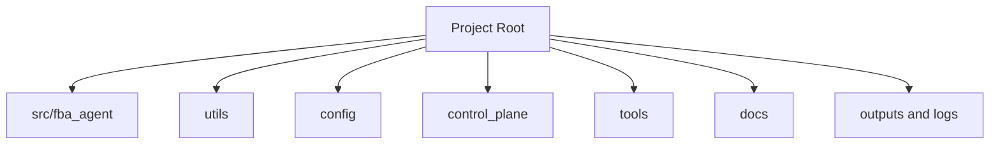
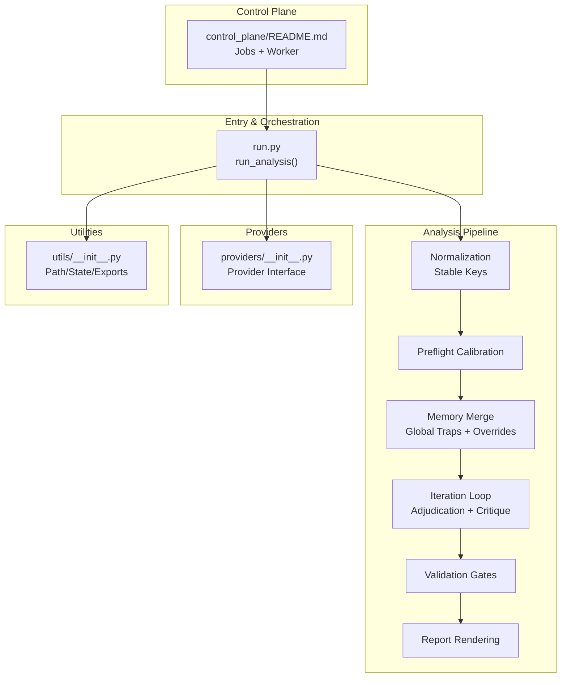
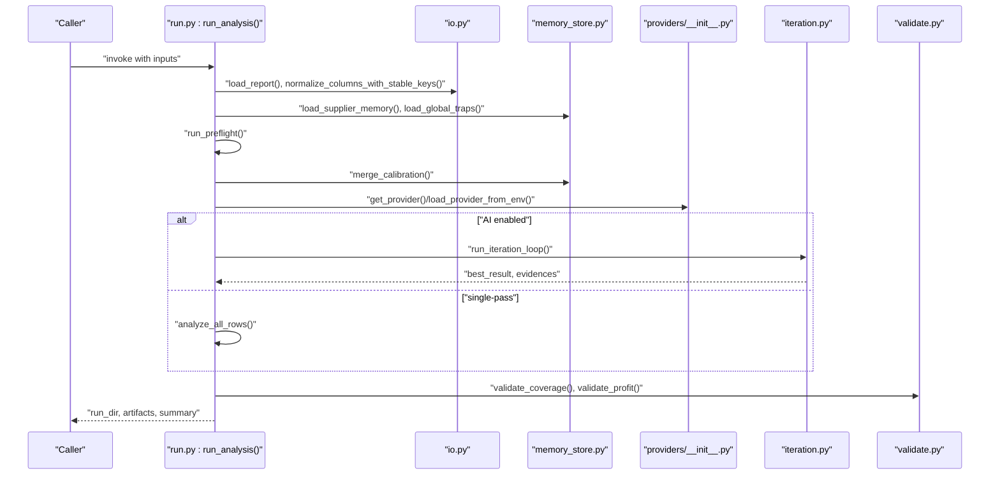
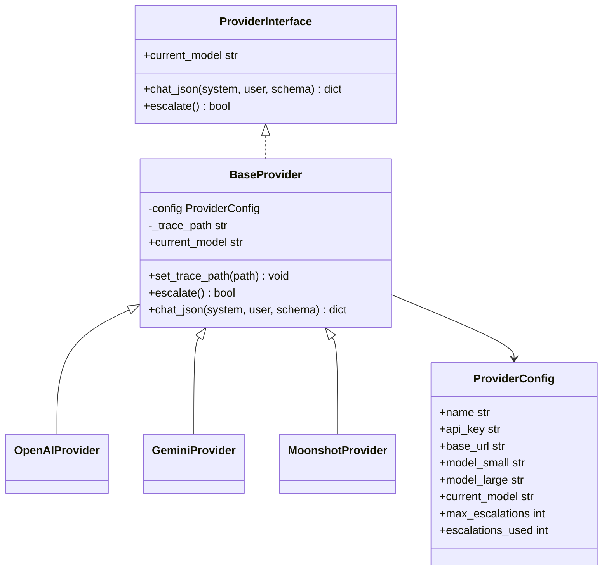
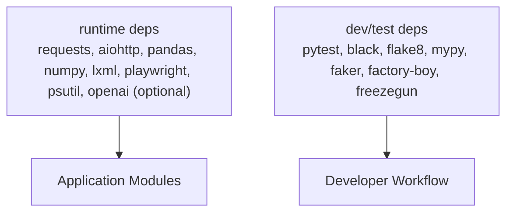

# Contributing & Development

<cite>
**Referenced Files in This Document**
- [README.md](file://README.md)
- [requirements.txt](file://requirements.txt)
- [src/fba_agent/run.py](file://src/fba_agent/run.py)
- [src/fba_agent/providers/__init__.py](file://src/fba_agent/providers/__init__.py)
- [utils/__init__.py](file://utils/__init__.py)
- [control_plane/README.md](file://control_plane/README.md)
</cite>

## Table of Contents
1. [Introduction](#introduction)
2. [Project Structure](#project-structure)
3. [Core Components](#core-components)
4. [Architecture Overview](#architecture-overview)
5. [Detailed Component Analysis](#detailed-component-analysis)
6. [Dependency Analysis](#dependency-analysis)
7. [Performance Considerations](#performance-considerations)
8. [Troubleshooting Guide](#troubleshooting-guide)
9. [Contribution Guidelines](#contribution-guidelines)
10. [Development Workflows](#development-workflows)
11. [Testing Procedures](#testing-procedures)
12. [Code Review and Quality Assurance](#code-review-and-quality-assurance)
13. [Debugging and Profiling](#debugging-and-profiling)
14. [Feature Development and Bug Fixes](#feature-development-and-bug-fixes)
15. [Version Control and Release Practices](#version-control-and-release-practices)
16. [Community Engagement](#community-engagement)
17. [Conclusion](#conclusion)

## Introduction
This document provides comprehensive guidance for contributing to and developing the Amazon FBA Agent System. It covers environment setup, code standards, contribution workflows, architecture, testing, debugging, performance analysis, and release practices. The system emphasizes production-readiness, resumable processing, smart memory management, and file-backed progress tracking.

## Project Structure
The repository is a large, research-driven codebase with multiple packages and analysis artifacts. For development and contribution, focus on:
- Core Python packages under src/
- Utilities and configuration under utils/, config/
- Control plane orchestration under control_plane/
- System entry points and workflow under tools/ and run_* scripts
- Documentation and guides under docs/ and wiki repositories

[No sources needed since this diagram shows conceptual structure, not a direct code mapping]

## Core Components
- Orchestrator and analysis pipeline: [src/fba_agent/run.py](file://src/fba_agent/run.py)
- Unified LLM provider interface: [src/fba_agent/providers/__init__.py](file://src/fba_agent/providers/__init__.py)
- Utility exports and state management: [utils/__init__.py](file://utils/__init__.py)
- Control plane job execution: [control_plane/README.md](file://control_plane/README.md)

**Section sources**
- [README.md](file://README.md#L167-L217)
- [src/fba_agent/run.py](file://src/fba_agent/run.py#L59-L321)
- [src/fba_agent/providers/__init__.py](file://src/fba_agent/providers/__init__.py#L1-L204)
- [utils/__init__.py](file://utils/__init__.py#L1-L29)
- [control_plane/README.md](file://control_plane/README.md#L1-L18)

## Architecture Overview
The system follows a modular, layered architecture:
- Entry points launch workflows that coordinate data ingestion, normalization, calibration, iteration loops, validation, and reporting.
- Providers encapsulate LLM integrations with unified interfaces and model escalation.
- Utilities provide path management, state persistence, and system monitoring.
- Control plane manages deterministic job execution and indexing.

**Diagram sources**
- [src/fba_agent/run.py](file://src/fba_agent/run.py#L59-L321)
- [src/fba_agent/providers/__init__.py](file://src/fba_agent/providers/__init__.py#L1-L204)
- [utils/__init__.py](file://utils/__init__.py#L1-L29)
- [control_plane/README.md](file://control_plane/README.md#L1-L18)

## Detailed Component Analysis

### Analysis Orchestration (run.py)
The run_analysis() function orchestrates the entire pipeline:
- Creates run directories and tracing environment
- Loads and normalizes input data with stable key generation
- Runs preflight calibration and merges calibration with memory and overrides
- Executes either a single-pass or iteration loop with AI features
- Validates outputs, persists artifacts, and renders reports

**Diagram sources**
- [src/fba_agent/run.py](file://src/fba_agent/run.py#L59-L321)
- [src/fba_agent/providers/__init__.py](file://src/fba_agent/providers/__init__.py#L116-L204)

**Section sources**
- [src/fba_agent/run.py](file://src/fba_agent/run.py#L59-L321)

### Provider Interface (providers/__init__.py)
The provider interface unifies OpenAI, Gemini, and Moonshot clients:
- Defines ProviderInterface protocol and BaseProvider ABC
- Supports model escalation and structured JSON responses
- Loads providers from environment variables

**Diagram sources**
- [src/fba_agent/providers/__init__.py](file://src/fba_agent/providers/__init__.py#L1-L204)

**Section sources**
- [src/fba_agent/providers/__init__.py](file://src/fba_agent/providers/__init__.py#L1-L204)

### Utilities Export and State Management
The utils package exposes path management and state management utilities, including a state manager alias.

**Section sources**
- [utils/__init__.py](file://utils/__init__.py#L1-L29)

### Control Plane Job Execution
The control plane provides deterministic job execution and indexing:
- Jobs are JSON files placed under a pending directory
- Worker executes jobs and writes status to a run-specific status file
- Single-run locks prevent concurrent runs
- Per-run merged config uses an environment variable

**Section sources**
- [control_plane/README.md](file://control_plane/README.md#L1-L18)

## Dependency Analysis
Primary runtime dependencies are declared in requirements.txt. Development and testing tools are included for formatting, linting, type checking, and test execution.

**Diagram sources**
- [requirements.txt](file://requirements.txt#L1-L81)

**Section sources**
- [requirements.txt](file://requirements.txt#L1-L81)

## Performance Considerations
- Smart memory management reduces clearing frequency and preserves recent context for debugging.
- File-backed progress tracking ensures accurate resumability and progress counts.
- Browser health management includes circuit breakers and automatic restarts.
- Atomic file operations improve reliability on Windows.

[No sources needed since this section provides general guidance]

## Troubleshooting Guide
- Chrome debug port accessibility and process cleanup
- Memory monitoring via Task Manager or system tools
- Authentication configuration and logs
- Long-running session stability and automatic restarts

**Section sources**
- [README.md](file://README.md#L492-L522)

## Contribution Guidelines
- Development environment setup includes installing core and dev dependencies, running tests, and applying code formatting.
- Code standards emphasize PEP 8 compliance, comprehensive docstrings, unit tests for new features, and documentation updates.
- Versioning and licensing are defined in the repository.

**Section sources**
- [README.md](file://README.md#L559-L586)
- [README.md](file://README.md#L588-L591)

## Development Workflows
- Entry points: run_custom_poundwholesale.py and run_complete_fba_system.py
- Central workflow engine: tools/passive_extraction_workflow_latest.py
- Directly used workflow components include configurable supplier scraper, Amazon Playwright extractor, financial calculator, cache manager, and essential utilities.
- Indirect dependencies include URL cache filter, browser circuit breaker, and configuration loaders.

**Section sources**
- [README.md](file://README.md#L123-L217)

## Testing Procedures
- System tests include Windows compatibility, memory leak fixes, URL pre-filtering efficiency, and indexing integration.
- Expected test results indicate successful platform detection, core imports, and compatibility checks.

**Section sources**
- [README.md](file://README.md#L456-L489)

## Code Review and Quality Assurance
- Code formatting with Black and linting with Flake8
- Static type checking with MyPy
- Unit and integration tests with PyTest and asyncio support
- Coverage reporting with pytest-cov

**Section sources**
- [requirements.txt](file://requirements.txt#L50-L62)

## Debugging and Profiling
- Real-time monitoring commands for debug, health, and progress
- Performance dashboard queries for live system status
- LLM tracing via environment variable for run-level trace logs

**Section sources**
- [README.md](file://README.md#L423-L453)
- [src/fba_agent/run.py](file://src/fba_agent/run.py#L107-L108)

## Feature Development and Bug Fixes
- Follow established patterns: modular orchestration, unified provider interface, atomic file operations, and deterministic control plane jobs
- Integrate with memory and calibration systems for reproducibility
- Add tests and update documentation for new features

[No sources needed since this section provides general guidance]

## Version Control and Release Practices
- Use Git for version control with commit hygiene and descriptive messages
- Maintain changelogs and update documentation for releases
- Tag releases and communicate changes to contributors

[No sources needed since this section provides general guidance]

## Community Engagement
- Encourage participation through documentation, issue triage, and peer reviews
- Provide clear contribution guidelines and onboarding materials
- Foster transparency via shared reports and analysis artifacts

[No sources needed since this section provides general guidance]

## Conclusion
This guide consolidates environment setup, architecture, workflows, testing, debugging, and contribution practices for the Amazon FBA Agent System. By following these guidelines, contributors can develop reliably, maintain high code quality, and collaborate effectively.