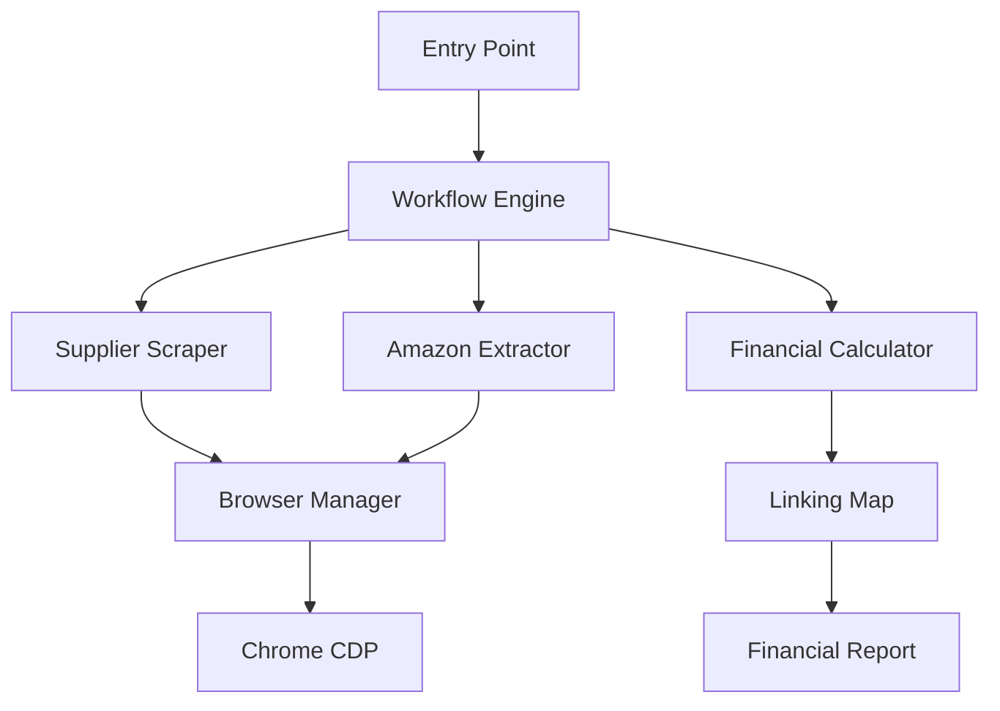
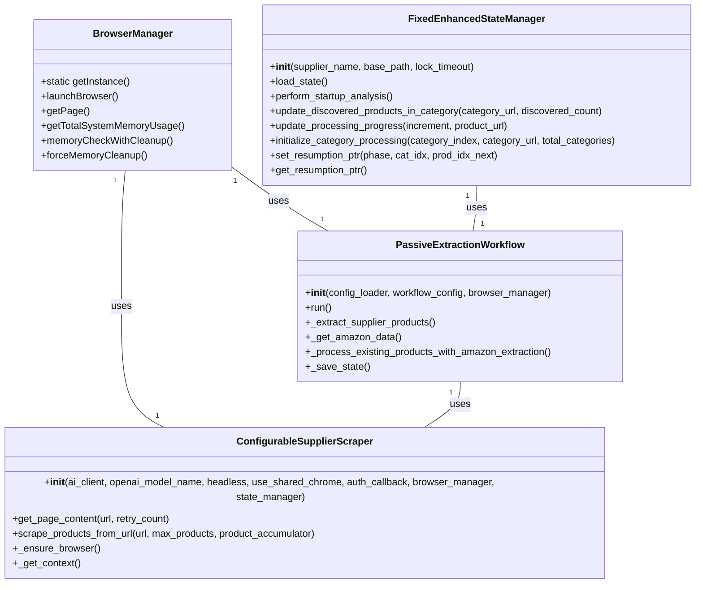
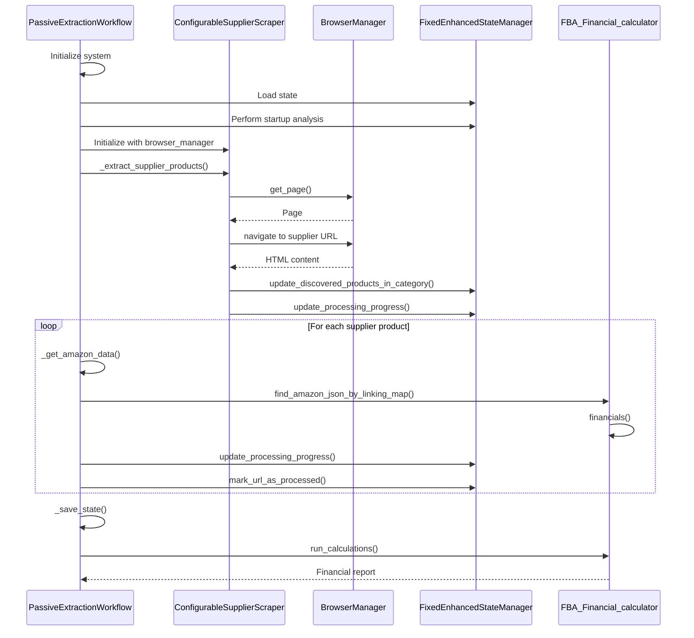
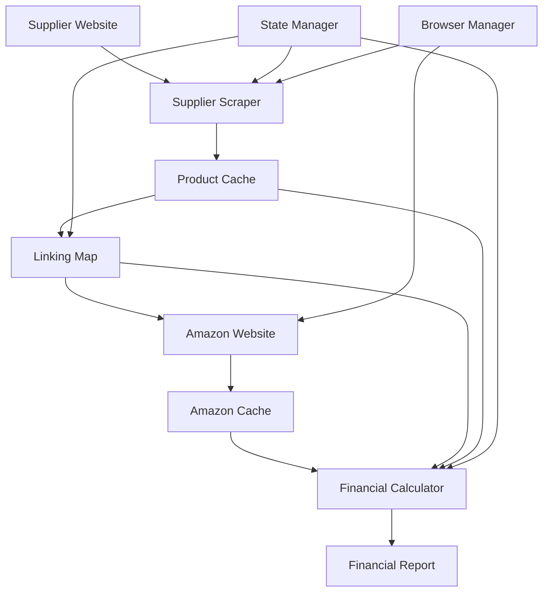
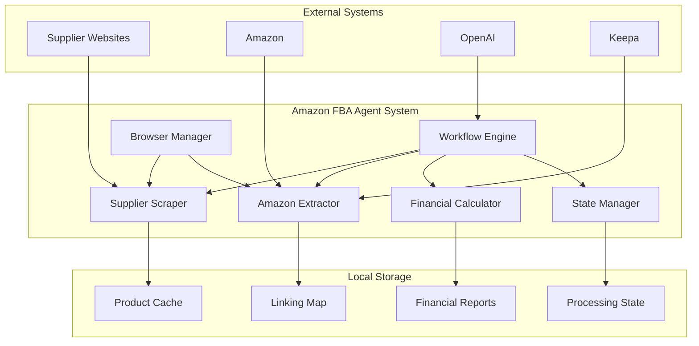

# Core Architecture

<cite>
**Referenced Files in This Document**   
- [passive_extraction_workflow_latest.py](file://tools/passive_extraction_workflow_latest.py)
- [configurable_supplier_scraper.py](file://tools/configurable_supplier_scraper.py)
- [FBA_Financial_calculator.py](file://tools/FBA_Financial_calculator.py)
- [fixed_enhanced_state_manager.py](file://utils/fixed_enhanced_state_manager.py)
- [system_config.json](file://config/system_config.json)
- [README.md](file://README.md)
- [browser_manager.py](file://utils/browser_manager.py)
</cite>

## Table of Contents
1. [Introduction](#introduction)
2. [System Overview](#system-overview)
3. [Core Components](#core-components)
4. [Architectural Patterns](#architectural-patterns)
5. [Component Interactions](#component-interactions)
6. [Data Flow](#data-flow)
7. [Technology Stack](#technology-stack)
8. [Cross-Cutting Concerns](#cross-cutting-concerns)
9. [Configuration and Execution](#configuration-and-execution)
10. [System Context](#system-context)
11. [Conclusion](#conclusion)

## Introduction

The Amazon FBA Agent System is a sophisticated automation platform designed to identify profitable products for Amazon FBA (Fulfillment by Amazon) by systematically scraping supplier websites, extracting Amazon data, and performing financial analysis. This document provides a comprehensive architectural overview of the system's core components, focusing on the main orchestrator pattern implemented in `passive_extraction_workflow_latest.py`. The system employs advanced architectural patterns including Singleton for browser management, Strategy for configurable scraping, State pattern for workflow progression, and Dependency Injection for component coordination. The documentation explains the interactions between key components, data flows, technology stack, and cross-cutting concerns that enable the system to operate efficiently and reliably.

**Section sources**
- [README.md](file://README.md#L0-L616)

## System Overview

The Amazon FBA Agent System v3.7+ is a production-ready automation platform that enables robust, resumable, and highly efficient FBA product sourcing from supplier websites. The system features a centralized orchestrator pattern with `passive_extraction_workflow_latest.py` serving as the main engine that coordinates supplier scraping, Amazon data extraction, and financial analysis. The architecture is designed for marathon session support, allowing 18+ hour processing without cascading failures, and includes comprehensive error handling and state management to ensure reliability.

The system operates through a well-defined workflow that begins with supplier product extraction, followed by Amazon data retrieval and matching, and concludes with financial profitability analysis. Key features include product cache hash optimization for O(1) duplicate prevention, smart memory management with a sliding window approach, and file-based progress tracking for always-accurate resumability. The system supports both Windows and Linux platforms with enhanced memory monitoring and process control, making it suitable for extended automated operations.

**Diagram sources **
- [passive_extraction_workflow_latest.py](file://tools/passive_extraction_workflow_latest.py#L0-L799)
- [README.md](file://README.md#L0-L616)

## Core Components

The Amazon FBA Agent System comprises several core components that work together to achieve its objectives. The main orchestrator, `passive_extraction_workflow_latest.py`, coordinates the entire workflow and serves as the central engine for product sourcing. This component is responsible for initializing the system, loading configurations, managing the workflow state, and coordinating the interactions between other components.

The `configurable_supplier_scraper.py` component handles the extraction of product data from supplier websites using Playwright for robust browser automation. It features anti-bot evasion capabilities and JavaScript support, with configurable selector-based extraction and AI-powered fallbacks. The scraper processes supplier categories in configurable batches, providing critical memory management and stability.

The `FBA_Financial_calculator.py` component performs comprehensive financial analysis on matched products, calculating ROI, net profit, and other key metrics to determine profitability. It integrates with the linking map to associate supplier products with Amazon ASINs and generates detailed financial reports. The `fixed_enhanced_state_manager.py` component provides stateful resume capability, allowing the system to be stopped and resumed without losing work by meticulously tracking the index of the last processed product.

**Section sources**
- [passive_extraction_workflow_latest.py](file://tools/passive_extraction_workflow_latest.py#L0-L799)
- [configurable_supplier_scraper.py](file://tools/configurable_supplier_scraper.py#L0-L799)
- [FBA_Financial_calculator.py](file://tools/FBA_Financial_calculator.py#L0-L589)
- [fixed_enhanced_state_manager.py](file://utils/fixed_enhanced_state_manager.py#L0-L799)

## Architectural Patterns

The Amazon FBA Agent System employs several architectural patterns to achieve its goals of reliability, efficiency, and maintainability. The Singleton pattern is implemented through the `BrowserManager` class, which provides centralized browser management and ensures that all components use a shared browser instance. This prevents resource conflicts and enables consistent browser health monitoring across the system.

The Strategy pattern is used in the `configurable_supplier_scraper.py` component, which allows for configurable scraping through externalized selector configurations. This enables the system to adapt to different supplier websites by loading site-specific selectors from configuration files, making the scraping process flexible and maintainable.

The State pattern is implemented in the `fixed_enhanced_state_manager.py` component, which manages the workflow's progression through different states such as supplier extraction, Amazon analysis, and gap processing. This pattern allows the system to resume interrupted sessions by tracking the current phase and position within the workflow.

Dependency Injection is used throughout the system to coordinate components, with the main workflow engine injecting dependencies such as the browser manager, configuration loader, and state manager into other components. This promotes loose coupling and makes the system more testable and maintainable.

**Diagram sources **
- [passive_extraction_workflow_latest.py](file://tools/passive_extraction_workflow_latest.py#L0-L799)
- [configurable_supplier_scraper.py](file://tools/configurable_supplier_scraper.py#L0-L799)
- [fixed_enhanced_state_manager.py](file://utils/fixed_enhanced_state_manager.py#L0-L799)
- [browser_manager.py](file://utils/browser_manager.py#L0-L175)

## Component Interactions

The components of the Amazon FBA Agent System interact through well-defined interfaces and coordination patterns. The workflow engine (`passive_extraction_workflow_latest.py`) serves as the central orchestrator, initializing and coordinating the other components. It injects dependencies such as the browser manager and state manager into the supplier scraper and other components, establishing the dependency injection pattern.

The supplier scraper (`configurable_supplier_scraper.py`) interacts with the browser manager to obtain browser pages for scraping supplier websites. It uses the centralized browser instance to ensure consistent browser health and memory management. The scraper also communicates with the state manager to update progress and track discovered products, enabling accurate resumption of interrupted sessions.

The financial calculator (`FBA_Financial_calculator.py`) interacts with the linking map to find Amazon data for supplier products and performs financial calculations based on the combined data. It generates financial reports that are used to identify profitable products. The state manager (`fixed_enhanced_state_manager.py`) interacts with all components to track the workflow's progress, manage resumption points, and ensure data consistency.

**Diagram sources **
- [passive_extraction_workflow_latest.py](file://tools/passive_extraction_workflow_latest.py#L0-L799)
- [configurable_supplier_scraper.py](file://tools/configurable_supplier_scraper.py#L0-L799)
- [FBA_Financial_calculator.py](file://tools/FBA_Financial_calculator.py#L0-L589)
- [fixed_enhanced_state_manager.py](file://utils/fixed_enhanced_state_manager.py#L0-L799)

## Data Flow

The data flow in the Amazon FBA Agent System follows a structured pipeline from supplier websites through caching to Amazon matching and profitability analysis. The process begins with the supplier scraper extracting product data from supplier websites and storing it in a product cache. This cache includes information such as product titles, prices, URLs, EANs, and SKUs, which is persisted to disk for reliability.

The extracted supplier products are then processed by the workflow engine, which uses the linking map to find corresponding Amazon products. The linking map serves as a persistent data structure that associates supplier products with Amazon ASINs, enabling efficient lookups and preventing duplicate processing. When a supplier product is matched with an Amazon product, the Amazon data is retrieved and cached locally.

The financial calculator uses the combined supplier and Amazon data to perform profitability analysis, calculating metrics such as ROI, net profit, and breakeven points. The results are stored in financial reports that identify profitable products. Throughout this process, the state manager tracks the workflow's progress and ensures that data is consistently saved to disk, enabling the system to resume from interruptions.

**Diagram sources **
- [passive_extraction_workflow_latest.py](file://tools/passive_extraction_workflow_latest.py#L0-L799)
- [configurable_supplier_scraper.py](file://tools/configurable_supplier_scraper.py#L0-L799)
- [FBA_Financial_calculator.py](file://tools/FBA_Financial_calculator.py#L0-L589)
- [fixed_enhanced_state_manager.py](file://utils/fixed_enhanced_state_manager.py#L0-L799)

## Technology Stack

The Amazon FBA Agent System leverages a modern technology stack to achieve its automation goals. Playwright is used for browser automation, providing robust capabilities for scraping supplier websites and extracting Amazon data. Playwright's support for JavaScript rendering and anti-bot evasion techniques enables the system to handle complex e-commerce websites effectively.

Aiohttp is used for asynchronous HTTP requests, allowing the system to perform multiple operations concurrently and improving overall performance. BeautifulSoup is used for HTML parsing, providing a convenient interface for extracting data from web pages. The system also uses asyncio for asynchronous programming, enabling efficient handling of I/O-bound operations.

The system relies on configuration files in JSON format to define operational parameters and supplier-specific settings. It uses atomic file operations for data persistence, ensuring data integrity even in the event of system interruptions. The system also integrates with external services such as OpenAI for AI-powered features and Keepa for enhanced Amazon data, although these features can be disabled as needed.

**Section sources**
- [passive_extraction_workflow_latest.py](file://tools/passive_extraction_workflow_latest.py#L0-L799)
- [configurable_supplier_scraper.py](file://tools/configurable_supplier_scraper.py#L0-L799)
- [FBA_Financial_calculator.py](file://tools/FBA_Financial_calculator.py#L0-L589)
- [system_config.json](file://config/system_config.json#L0-L299)

## Cross-Cutting Concerns

The Amazon FBA Agent System addresses several cross-cutting concerns to ensure reliability, performance, and maintainability. Error handling is implemented throughout the system, with comprehensive exception handling and retry mechanisms for network requests and browser operations. The system uses a circuit breaker pattern to prevent cascading failures and automatically restart the browser when necessary.

Memory management is a critical concern, addressed through a sliding window approach that clears memory every 500 products while preserving the most recent 100 products for continuity. This approach reduces memory clearing operations by 99% while maintaining processing stability. The system also includes browser health management with circuit breaker protection and automatic restart capabilities.

System monitoring is implemented through logging and telemetry, with detailed logs available for debugging and performance analysis. The system includes real-time monitoring commands and a performance dashboard for tracking key metrics. Security is addressed through secure credential storage in configuration files and the use of environment variables for sensitive information.

**Section sources**
- [passive_extraction_workflow_latest.py](file://tools/passive_extraction_workflow_latest.py#L0-L799)
- [configurable_supplier_scraper.py](file://tools/configurable_supplier_scraper.py#L0-L799)
- [fixed_enhanced_state_manager.py](file://utils/fixed_enhanced_state_manager.py#L0-L799)
- [browser_manager.py](file://utils/browser_manager.py#L0-L175)

## Configuration and Execution

The Amazon FBA Agent System is configured through JSON configuration files and environment variables. The main configuration file, `system_config.json`, defines operational parameters such as maximum products, price limits, performance settings, and authentication options. Supplier-specific configurations are stored in separate JSON files in the `config/supplier_configs` directory, allowing for customized scraping settings for different suppliers.

The system can be executed through entry point scripts such as `run_custom_poundwholesale.py` or `run_complete_fba_system.py`, which initialize the workflow engine and start the extraction process. The workflow engine loads configuration parameters from `system_config.json`, ensuring a single source of truth for operational toggles. The system supports both Windows and Linux platforms, with specific setup instructions provided for each.

Configuration options include toggles for AI features, processing limits, performance settings, and authentication. The system also supports environment variables for API keys and browser configuration, allowing for flexible deployment in different environments. The configuration-driven execution model enables the system to be easily customized for different suppliers and use cases.

**Section sources**
- [system_config.json](file://config/system_config.json#L0-L299)
- [README.md](file://README.md#L0-L616)
- [passive_extraction_workflow_latest.py](file://tools/passive_extraction_workflow_latest.py#L0-L799)

## System Context

The Amazon FBA Agent System operates within a broader context of e-commerce automation and product sourcing. The system interacts with supplier websites to extract product data, Amazon to retrieve pricing and sales information, and local storage to persist data between sessions. It serves as a bridge between supplier inventory and Amazon marketplace data, enabling users to identify profitable products for FBA.

The system's architecture is designed to be modular and extensible, allowing for the addition of new suppliers, integration with additional data sources, and enhancement of financial analysis capabilities. The use of configuration files and dependency injection makes it easy to customize the system for different use cases and requirements.

The system's context also includes operational considerations such as memory usage, processing time, and reliability. The architectural decisions around state management, memory management, and error handling are all designed to support long-running, unattended operations. The system's ability to resume from interruptions and maintain accurate progress tracking makes it suitable for extended automated runs.

**Diagram sources **
- [README.md](file://README.md#L0-L616)
- [passive_extraction_workflow_latest.py](file://tools/passive_extraction_workflow_latest.py#L0-L799)

## Conclusion

The Amazon FBA Agent System demonstrates a sophisticated architectural design that effectively addresses the challenges of e-commerce product sourcing automation. The main orchestrator pattern implemented in `passive_extraction_workflow_latest.py` provides a robust framework for coordinating supplier scraping, Amazon data extraction, and financial analysis. The system's use of architectural patterns such as Singleton, Strategy, State, and Dependency Injection contributes to its reliability, flexibility, and maintainability.

Key technical decisions, including the modular design and configuration-driven execution, enable the system to adapt to different suppliers and use cases while maintaining a consistent operational model. The focus on cross-cutting concerns such as error handling, memory management, and system monitoring ensures that the system can operate reliably over extended periods.

The integration of advanced features like product cache hash optimization, smart memory management, and file-based progress tracking demonstrates a commitment to performance and reliability. These enhancements, combined with the system's ability to resume from interruptions and maintain accurate state, make it a powerful tool for identifying profitable products on Amazon FBA.