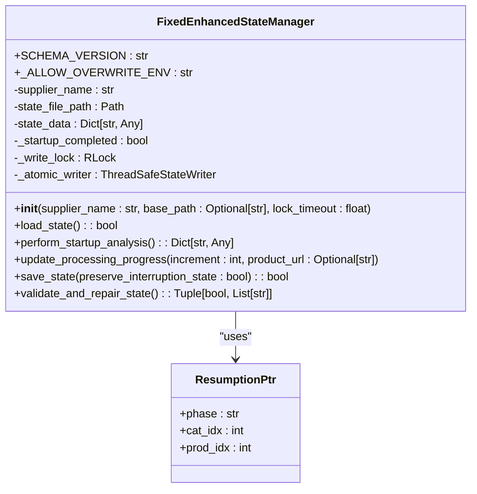
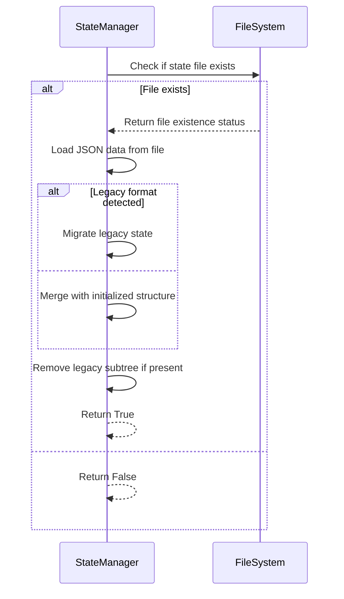
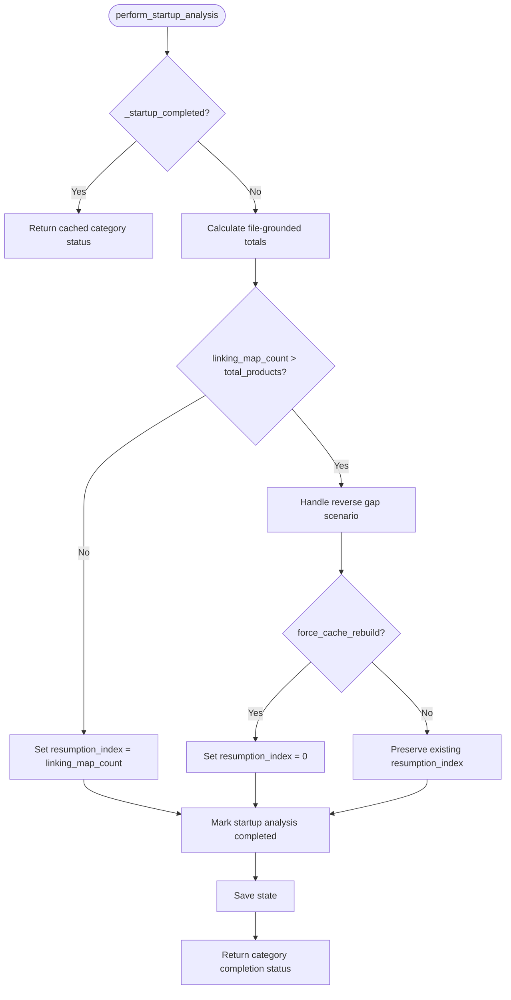
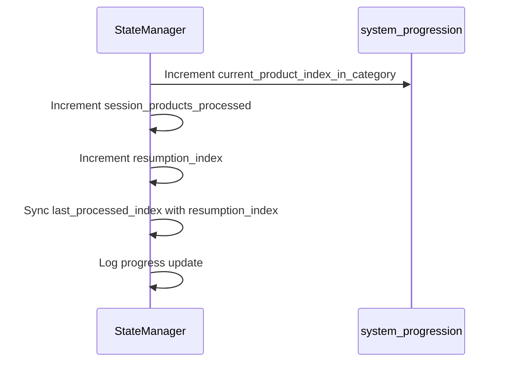
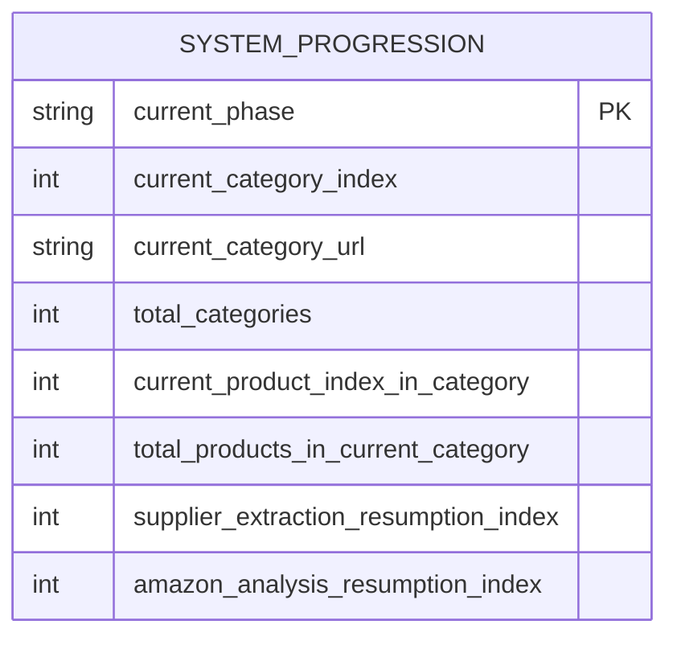
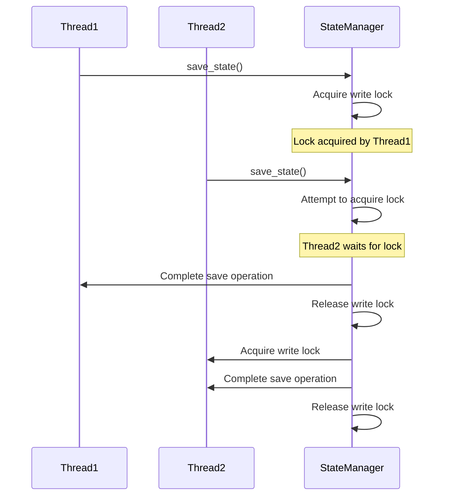
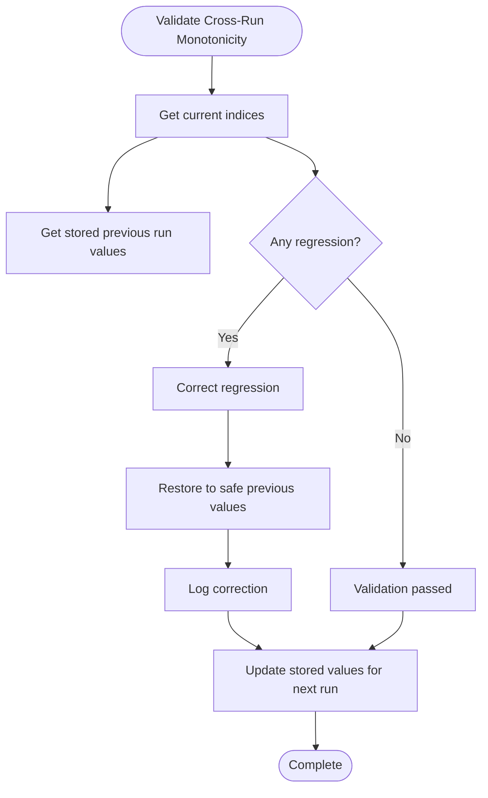
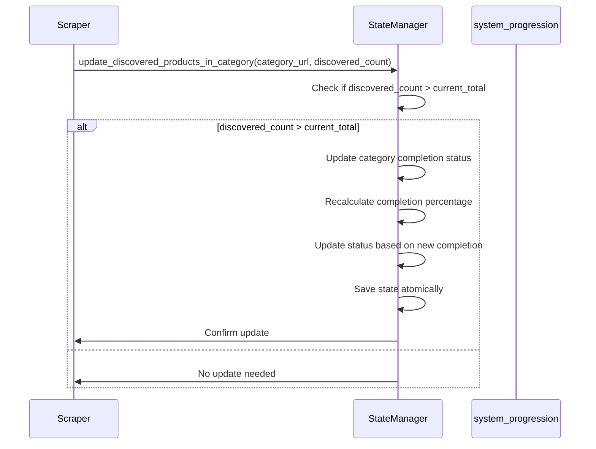
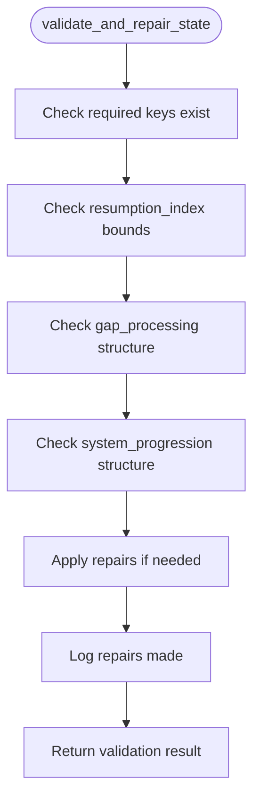

# State Manager

<cite>
**Referenced Files in This Document**   
- [fixed_enhanced_state_manager.py](file://utils/fixed_enhanced_state_manager.py)
</cite>

## Table of Contents
1. [Introduction](#introduction)
2. [Core Architecture](#core-architecture)
3. [Key Methods](#key-methods)
4. [System Progression Structure](#system-progression-structure)
5. [Thread-Safe Operations](#thread-safe-operations)
6. [Cross-Run Monotonicity Guard](#cross-run-monotonicity-guard)
7. [Real-Time Category Total Updates](#real-time-category-total-updates)
8. [State Validation and Repair](#state-validation-and-repair)

## Introduction
The FixedEnhancedStateManager module is a critical component designed to enable resumable processing by accurately tracking the system's progress across interruptions. This document details the architectural improvements and key functionalities that ensure reliable state management, prevent data corruption, and support seamless resumption of processing tasks.

**Section sources**
- [fixed_enhanced_state_manager.py](file://utils/fixed_enhanced_state_manager.py#L99-L2643)

## Core Architecture
The FixedEnhancedStateManager implements a robust state management system with several key architectural fixes:

1. **Separation of resumption_index from progress_index**: This prevents state corruption by maintaining distinct indices for resumption points and current progress tracking.
2. **Thread-safe atomic operations**: Utilizes file locking and atomic write operations to prevent race conditions in multi-threaded environments.
3. **Single source of truth**: The `system_progression` structure serves as the authoritative source for all progression metrics, eliminating redundant and potentially conflicting data.

The state manager initializes with a comprehensive structure that includes schema versioning, supplier identification, and various tracking fields for processing status, performance metrics, and system progression.

**Diagram sources**
- [fixed_enhanced_state_manager.py](file://utils/fixed_enhanced_state_manager.py#L99-L2643)

**Section sources**
- [fixed_enhanced_state_manager.py](file://utils/fixed_enhanced_state_manager.py#L99-L2643)

## Key Methods

### load_state()
The `load_state()` method initializes the state manager by loading existing state from disk. It handles backward compatibility with legacy state formats and performs necessary migrations. When no state file exists, it returns False to indicate a fresh start.

**Diagram sources**
- [fixed_enhanced_state_manager.py](file://utils/fixed_enhanced_state_manager.py#L99-L2643)

### perform_startup_analysis()
This method performs reverse gap detection and category analysis only once at startup. It determines the appropriate resumption index based on file-grounded totals and handles reverse gap scenarios where the linking map count exceeds the cache count.

**Diagram sources**
- [fixed_enhanced_state_manager.py](file://utils/fixed_enhanced_state_manager.py#L99-L2643)

### update_processing_progress()
This method updates both session progress and the resumption index for exact interruption recovery. It ensures that the system can resume from the precise point of interruption by continuously updating the resumption index.

**Diagram sources**
- [fixed_enhanced_state_manager.py](file://utils/fixed_enhanced_state_manager.py#L99-L2643)

**Section sources**
- [fixed_enhanced_state_manager.py](file://utils/fixed_enhanced_state_manager.py#L99-L2643)

## System Progression Structure
The `system_progression` structure tracks the current state of processing with the following key fields:

- **current_phase**: Tracks the current processing phase (e.g., "supplier", "amazon_analysis")
- **current_category_index**: Current category being processed (0-based index)
- **current_category_url**: URL of the current category
- **total_categories**: Total number of categories to process
- **current_product_index_in_category**: Current product index within the category
- **total_products_in_current_category**: Total products in the current category
- **supplier_extraction_resumption_index**: Resumption index for supplier extraction phase
- **amazon_analysis_resumption_index**: Resumption index for Amazon analysis phase

This structure provides a comprehensive view of the system's progression through the processing pipeline.

**Diagram sources**
- [fixed_enhanced_state_manager.py](file://utils/fixed_enhanced_state_manager.py#L99-L2643)

**Section sources**
- [fixed_enhanced_state_manager.py](file://utils/fixed_enhanced_state_manager.py#L99-L2643)

## Thread-Safe Operations
The state manager implements thread-safe atomic operations using file locking to prevent race conditions:

The implementation uses a re-entrant lock (`threading.RLock`) to avoid self-deadlock on nested saves and provides multiple fallback mechanisms for atomic operations, including a thread-safe atomic writer, legacy atomic operations, and a WindowsSaveGuardian fallback.

**Diagram sources**
- [fixed_enhanced_state_manager.py](file://utils/fixed_enhanced_state_manager.py#L99-L2643)

**Section sources**
- [fixed_enhanced_state_manager.py](file://utils/fixed_enhanced_state_manager.py#L99-L2643)

## Cross-Run Monotonicity Guard
The cross-run monotonicity guard prevents regression of resumption pointers by ensuring that indices never decrease between runs:

The guard tracks category index, product index, and resumption index across runs, detecting and correcting any regressions to maintain monotonic progression.

**Diagram sources**
- [fixed_enhanced_state_manager.py](file://utils/fixed_enhanced_state_manager.py#L99-L2643)

**Section sources**
- [fixed_enhanced_state_manager.py](file://utils/fixed_enhanced_state_manager.py#L99-L2643)

## Real-Time Category Total Updates
The state manager supports real-time updates to category totals when the scraper discovers more products than initially expected:

This functionality corrects discrepancies between expected and discovered product counts, ensuring accurate progress tracking.

**Diagram sources**
- [fixed_enhanced_state_manager.py](file://utils/fixed_enhanced_state_manager.py#L99-L2643)

**Section sources**
- [fixed_enhanced_state_manager.py](file://utils/fixed_enhanced_state_manager.py#L99-L2643)

## State Validation and Repair
The state manager includes comprehensive validation and repair capabilities to detect and fix state corruption:

The validation process ensures all required fields exist, resumption indices are within bounds, and necessary structures are present, automatically repairing issues when detected.

**Diagram sources**
- [fixed_enhanced_state_manager.py](file://utils/fixed_enhanced_state_manager.py#L99-L2643)

**Section sources**
- [fixed_enhanced_state_manager.py](file://utils/fixed_enhanced_state_manager.py#L99-L2643)