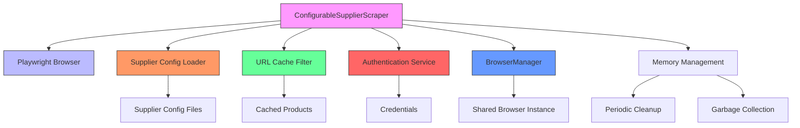
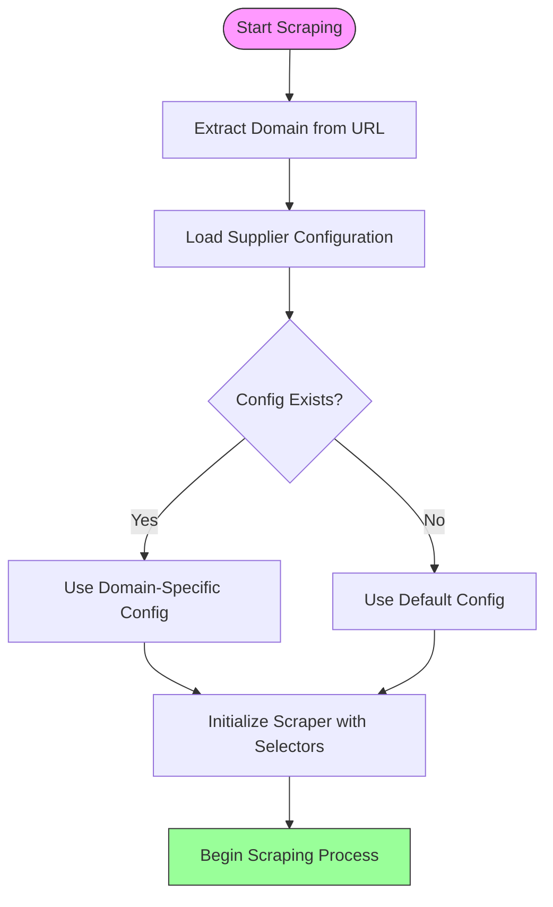
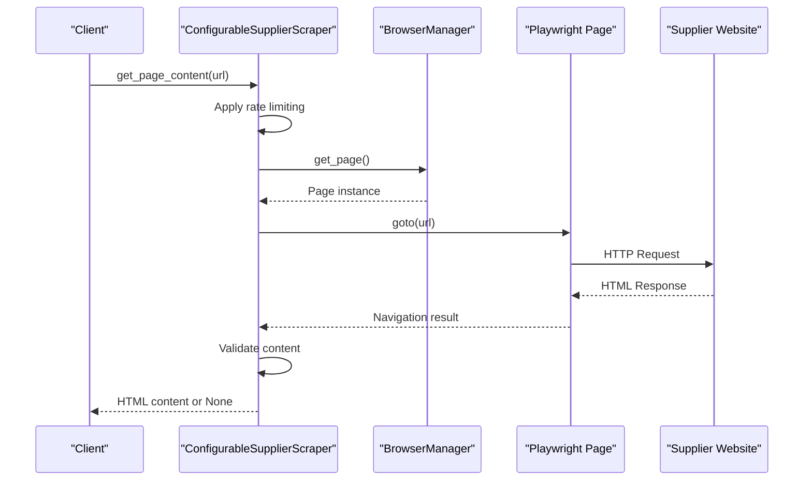
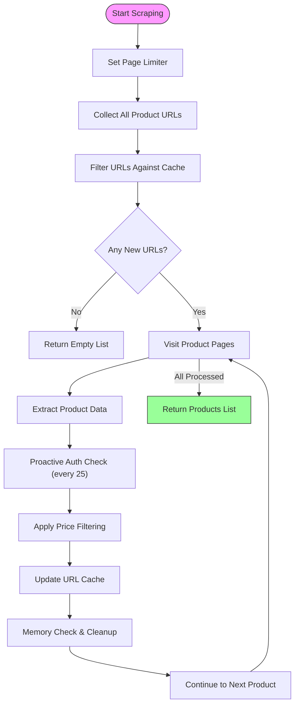
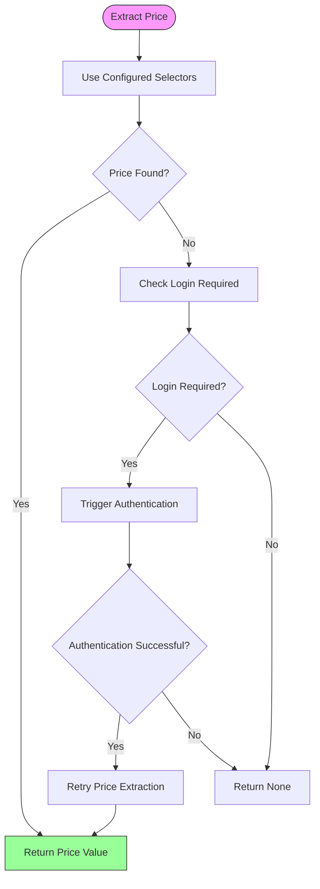
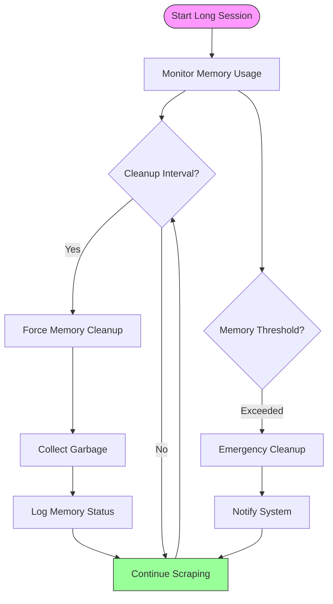
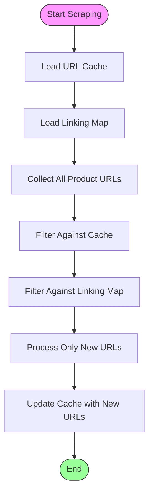
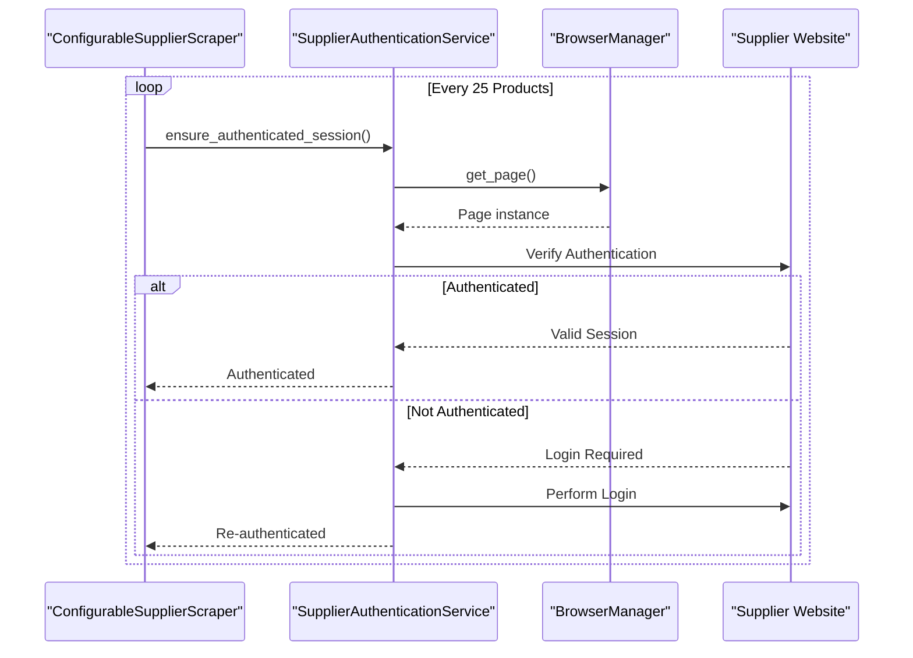

# Supplier Scraper

<cite>
**Referenced Files in This Document**   
- [configurable_supplier_scraper.py](file://tools/configurable_supplier_scraper.py)
- [supplier_config_loader.py](file://config/supplier_config_loader.py)
- [url_cache_filter.py](file://utils/url_cache_filter.py)
- [supplier_authentication_service.py](file://tools/supplier_authentication_service.py)
- [www.poundwholesale.co.uk.json](file://config/supplier_configs/www.poundwholesale.co.uk.json)
</cite>

## Table of Contents
1. [Introduction](#introduction)
2. [Core Components](#core-components)
3. [Architecture Overview](#architecture-overview)
4. [Detailed Component Analysis](#detailed-component-analysis)
5. [Configuration-Driven Design](#configuration-driven-design)
6. [Key Methods and Functionality](#key-methods-and-functionality)
7. [Browser Integration and Anti-Bot Evasion](#browser-integration-and-anti-bot-evasion)
8. [Memory Management and Performance](#memory-management-and-performance)
9. [Conclusion](#conclusion)

## Introduction
The ConfigurableSupplierScraper module is a critical component of the Amazon FBA Agent System, designed for robust web scraping of supplier product data. It leverages Playwright for advanced browser automation with anti-bot evasion capabilities and full JavaScript support. The module features a configuration-driven architecture that enables flexible scraping across multiple suppliers using external selector configurations. It integrates with a centralized BrowserManager for efficient resource sharing, implements proactive authentication checks, and includes sophisticated memory management to support long-running scraping sessions. This document provides a comprehensive analysis of its implementation, design patterns, and key functionalities.

## Core Components

The ConfigurableSupplierScraper module consists of several interconnected components that work together to enable reliable and efficient product data extraction. These include the scraper itself, the supplier configuration loader, URL pre-filtering system, authentication service, and memory management utilities. The scraper uses Playwright for browser automation, while external JSON configuration files define selector strategies for different suppliers. The system employs a centralized BrowserManager to share browser instances across operations, reducing resource consumption and improving performance.

**Section sources**
- [configurable_supplier_scraper.py](file://tools/configurable_supplier_scraper.py#L1-L50)
- [supplier_config_loader.py](file://config/supplier_config_loader.py#L1-L20)
- [url_cache_filter.py](file://utils/url_cache_filter.py#L1-L30)

## Architecture Overview



**Diagram sources**
- [configurable_supplier_scraper.py](file://tools/configurable_supplier_scraper.py#L1-L100)
- [supplier_config_loader.py](file://config/supplier_config_loader.py#L1-L50)
- [url_cache_filter.py](file://utils/url_cache_filter.py#L1-L40)

## Detailed Component Analysis

### ConfigurableSupplierScraper Class Analysis
The ConfigurableSupplierScraper class serves as the central component for supplier data extraction. It implements a configuration-driven approach that allows for flexible scraping across different supplier websites without code changes. The class uses Playwright for browser automation, providing full JavaScript support and anti-bot evasion capabilities through realistic browser fingerprinting and behavior simulation.

```mermaid
classDiagram
class ConfigurableSupplierScraper {
+ai_client : Any
+system_config : Dict[str, Any]
+browser : Browser
+context : BrowserContext
+loaded_selector_configs : Dict[str, Dict[str, Any]]
+supplier_config : Dict[str, Any]
+state_manager : Any
+auth_callback : Callable
+progress_callback : Callable
+last_request_time : float
+rate_limit_delay : float
+openai_model : str
+extraction_targets : Dict[str, List[str]]
+discovery_assistance : Dict[str, Any]
+_session : aiohttp.ClientSession
+__init__(ai_client, openai_model_name, headless, use_shared_chrome, auth_callback, browser_manager, state_manager)
+_load_system_config() Dict[str, Any]
+_get_ai_model_from_config() str
+_get_extraction_targets_from_config() Dict[str, List[str]]
+_get_discovery_assistance_from_config() Dict[str, Any]
+_ensure_browser() Browser
+_get_context() BrowserContext
+_get_session() aiohttp.ClientSession
+get_page_content(url : str, retry_count : int) Optional[str]
+fetch_html(url : str) Optional[str]
+set_progress_callback(callback_func)
+scrape_products_from_url(url : str, max_products : int, product_accumulator : List[Dict[str, Any]]) List[Dict[str, Any]]
+extract_price(soup : BeautifulSoup, html_content : str, url : str) Optional[str]
+_extract_text_by_selector(soup : BeautifulSoup, selectors : List[str]) Optional[str]
+_extract_image_by_selector(soup : BeautifulSoup, selectors : List[str]) Optional[str]
+_set_page_limiter(url : str)
+_collect_all_product_urls(url : str, max_products : int) List[str]
+_apply_price_filtering(products : List[Dict[str, Any]], max_price : float) List[Dict[str, Any]]
}
class BrowserManager {
+browser : Browser
+context : BrowserContext
+pages : List[Page]
+get_instance() BrowserManager
+launch_browser(cdp_port : int)
+get_page() Page
+get_total_system_memory_usage() Dict[str, Any]
+memory_check_with_cleanup(product_count : int) bool
+force_memory_cleanup()
}
ConfigurableSupplierScraper --> BrowserManager : "uses"
ConfigurableSupplierScraper --> "supplier_configs/*.json" : "loads"
ConfigurableSupplierScraper --> "OUTPUTS/cached_products/*.json" : "reads/writes"
ConfigurableSupplierScraper --> "FBA_ANALYSIS/linking_maps/*" : "reads"
```

**Diagram sources**
- [configurable_supplier_scraper.py](file://tools/configurable_supplier_scraper.py#L150-L500)
- [supplier_config_loader.py](file://config/supplier_config_loader.py#L1-L187)

**Section sources**
- [configurable_supplier_scraper.py](file://tools/configurable_supplier_scraper.py#L1-L1000)
- [supplier_config_loader.py](file://config/supplier_config_loader.py#L1-L187)

## Configuration-Driven Design

The ConfigurableSupplierScraper employs a configuration-driven design that separates selector logic from implementation code. This approach allows for easy adaptation to different supplier websites without modifying the core scraping logic. Selector configurations are stored in external JSON files within the `config/supplier_configs/` directory, with each supplier having its own configuration file.

The configuration system uses the `supplier_config_loader.py` module to load selector configurations based on the supplier domain. When a scraping operation is initiated, the scraper extracts the domain from the target URL and loads the corresponding configuration file. If a domain-specific configuration is not found, the system falls back to a default configuration.



**Diagram sources**
- [supplier_config_loader.py](file://config/supplier_config_loader.py#L50-L150)
- [configurable_supplier_scraper.py](file://tools/configurable_supplier_scraper.py#L200-L300)

**Section sources**
- [supplier_config_loader.py](file://config/supplier_config_loader.py#L1-L187)
- [configurable_supplier_scraper.py](file://tools/configurable_supplier_scraper.py#L1-L200)

### Example Configuration File
The configuration for poundwholesale.co.uk demonstrates the structure and capabilities of the selector configuration system:

```json
{
  "supplier_id": "poundwholesale-co-uk",
  "supplier_name": "poundwholesale-co-uk",
  "base_url": "https://www.poundwholesale.co.uk/",
  "field_mappings": {
    "product_item": [
      ".product-item",
      ".product",
      "article"
    ],
    "title": [
      ".product-title",
      ".title",
      "h2 a",
      "h3 a"
    ],
    "price": [
      ".price",
      ".cost",
      "[data-price]",
      ".price-current"
    ],
    "price_login_required": [
      ".login-required",
      ".price-login",
      "a[href*='login']"
    ],
    "url": [
      "a.product-link",
      ".product-item a",
      "h2 a",
      "h3 a"
    ],
    "image": [
      "img.product-image",
      ".product-item img",
      "img"
    ],
    "ean": [
      "[data-ean]",
      "[data-gtin]",
      "meta[itemprop='gtin13']"
    ],
    "barcode": [
      "[data-barcode]",
      "[data-upc]",
      "meta[itemprop='gtin13']"
    ],
    "sku": [
      "[data-sku]",
      ".sku",
      "meta[itemprop='sku']"
    ]
  },
  "pagination": {
    "pattern": "?page={page_num}",
    "next_button_selector": [
      "a.next",
      ".pagination .next a",
      "a[rel='next']"
    ]
  },
  "auto_discovered": true,
  "discovery_timestamp": "2025-07-05T20:51:29.812652",
  "success": true
}
```

This configuration defines multiple selectors for each data field, allowing the scraper to attempt extraction with alternative selectors if the primary ones fail. The system uses a cascading approach, trying selectors in order until successful extraction is achieved.

**Section sources**
- [www.poundwholesale.co.uk.json](file://config/supplier_configs/www.poundwholesale.co.uk.json#L1-L66)

## Key Methods and Functionality

### get_page_content() Method
The `get_page_content()` method is responsible for fetching HTML content from supplier websites using Playwright. It implements robust error handling, rate limiting, and retry logic to ensure reliable page retrieval. The method includes anti-bot evasion techniques such as realistic user agent strings, viewport settings, and human-like delays between requests.



**Diagram sources**
- [configurable_supplier_scraper.py](file://tools/configurable_supplier_scraper.py#L500-L600)

### scrape_products_from_url() Method
The `scrape_products_from_url()` method orchestrates the complete product scraping process. It handles pagination, individual product page visits, data extraction, and filtering. The method implements URL pre-filtering to avoid reprocessing cached products and includes proactive authentication checks every 25 products to maintain session validity.



**Diagram sources**
- [configurable_supplier_scraper.py](file://tools/configurable_supplier_scraper.py#L600-L1000)

### extract_price() Method
The `extract_price()` method handles financial information extraction with special consideration for authentication requirements. It first attempts to extract price information using configured selectors, then checks for login requirements, and can trigger authentication processes when necessary.



**Diagram sources**
- [configurable_supplier_scraper.py](file://tools/configurable_supplier_scraper.py#L1000-L1100)

**Section sources**
- [configurable_supplier_scraper.py](file://tools/configurable_supplier_scraper.py#L500-L1100)

## Browser Integration and Anti-Bot Evasion

The ConfigurableSupplierScraper integrates with a centralized BrowserManager to share browser instances across different components of the system. This approach reduces resource consumption and improves performance by avoiding the overhead of launching multiple browser instances.

```mermaid
classDiagram
class BrowserManager {
+browser : Browser
+context : BrowserContext
+pages : List[Page]
+get_instance() BrowserManager
+launch_browser(cdp_port : int)
+get_page() Page
+get_total_system_memory_usage() Dict[str, Any]
+memory_check_with_cleanup(product_count : int) bool
+force_memory_cleanup()
}
class ConfigurableSupplierScraper {
+browser_manager : BrowserManager
+_ensure_browser() Browser
+_get_context() BrowserContext
}
ConfigurableSupplierScraper --> BrowserManager : "uses"
BrowserManager --> "Chrome CDP" : "connects via"
```

**Diagram sources**
- [configurable_supplier_scraper.py](file://tools/configurable_supplier_scraper.py#L300-L400)
- [supplier_authentication_service.py](file://tools/supplier_authentication_service.py#L1-L50)

The scraper implements several anti-bot evasion techniques:
- Realistic user agent strings and browser fingerprints
- Human-like delays and jitter in request timing
- Randomized viewport sizes and screen resolutions
- Proper HTTP headers mimicking real browser behavior
- JavaScript execution to handle dynamic content
- Session persistence to maintain authentication state

These techniques help the scraper bypass common bot detection mechanisms employed by supplier websites.

**Section sources**
- [configurable_supplier_scraper.py](file://tools/configurable_supplier_scraper.py#L300-L500)

## Memory Management and Performance

The ConfigurableSupplierScraper includes sophisticated memory management techniques to prevent leaks during long scraping sessions. These include periodic cleanup, garbage collection, and proactive memory monitoring.



**Diagram sources**
- [configurable_supplier_scraper.py](file://tools/configurable_supplier_scraper.py#L800-L900)
- [url_cache_filter.py](file://utils/url_cache_filter.py#L100-L150)

The system implements URL pre-filtering to avoid reprocessing cached products, significantly improving efficiency:



**Diagram sources**
- [url_cache_filter.py](file://utils/url_cache_filter.py#L50-L100)
- [configurable_supplier_scraper.py](file://tools/configurable_supplier_scraper.py#L700-L800)

The scraper also performs proactive authentication checks every 25 products to maintain session validity, preventing failures due to expired sessions:



**Diagram sources**
- [configurable_supplier_scraper.py](file://tools/configurable_supplier_scraper.py#L750-L780)
- [supplier_authentication_service.py](file://tools/supplier_authentication_service.py#L1-L50)

**Section sources**
- [configurable_supplier_scraper.py](file://tools/configurable_supplier_scraper.py#L700-L900)
- [url_cache_filter.py](file://utils/url_cache_filter.py#L1-L272)
- [supplier_authentication_service.py](file://tools/supplier_authentication_service.py#L1-L114)

## Conclusion
The ConfigurableSupplierScraper module represents a sophisticated and robust solution for web scraping supplier product data. Its configuration-driven design allows for easy adaptation to different supplier websites, while its integration with Playwright provides advanced browser automation capabilities with anti-bot evasion. The module's use of external selector configurations, centralized browser management, and proactive authentication checks make it highly effective for long-running scraping operations. Additionally, its comprehensive memory management and URL pre-filtering systems ensure efficient resource utilization and prevent redundant processing. This combination of features makes the ConfigurableSupplierScraper a critical component of the Amazon FBA Agent System, enabling reliable and scalable data extraction from supplier websites.