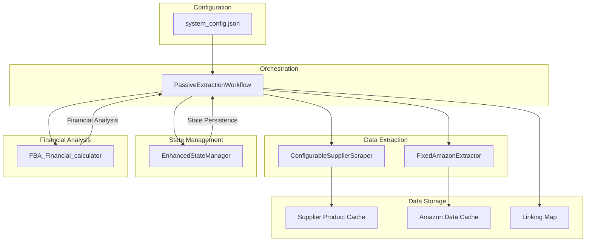
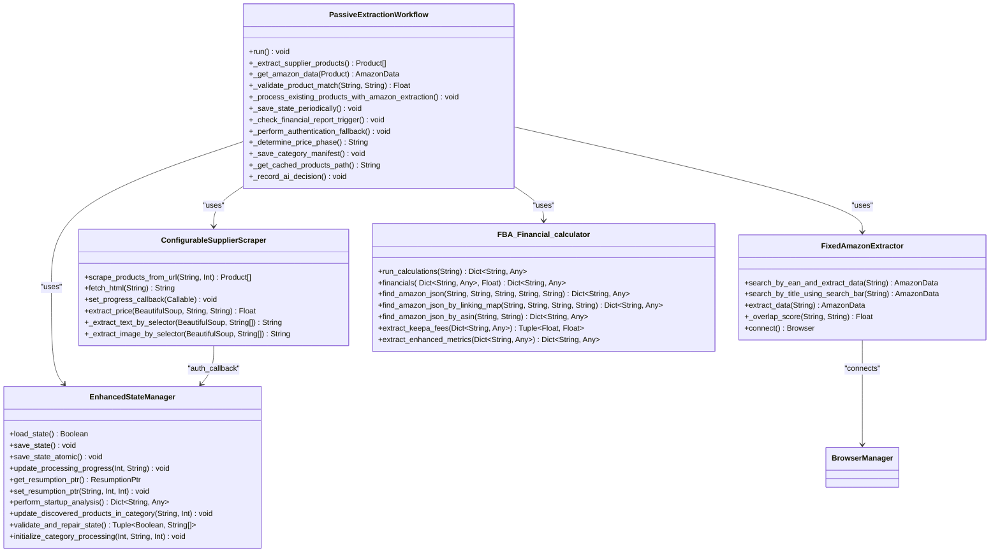
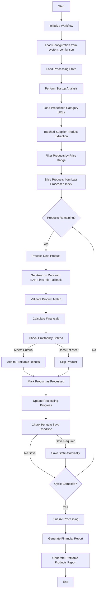
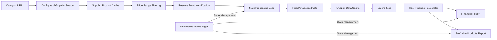
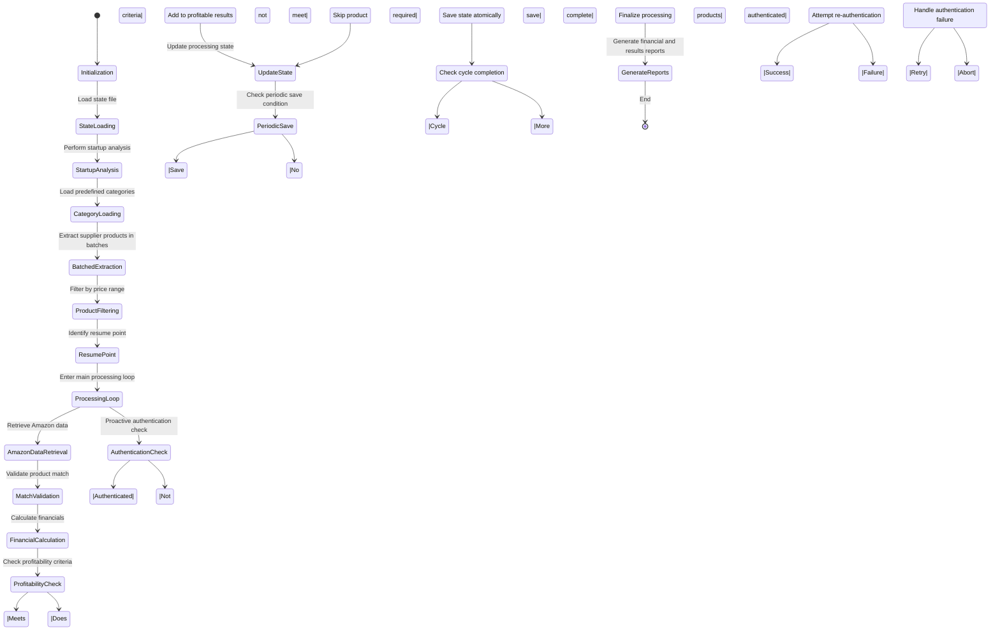
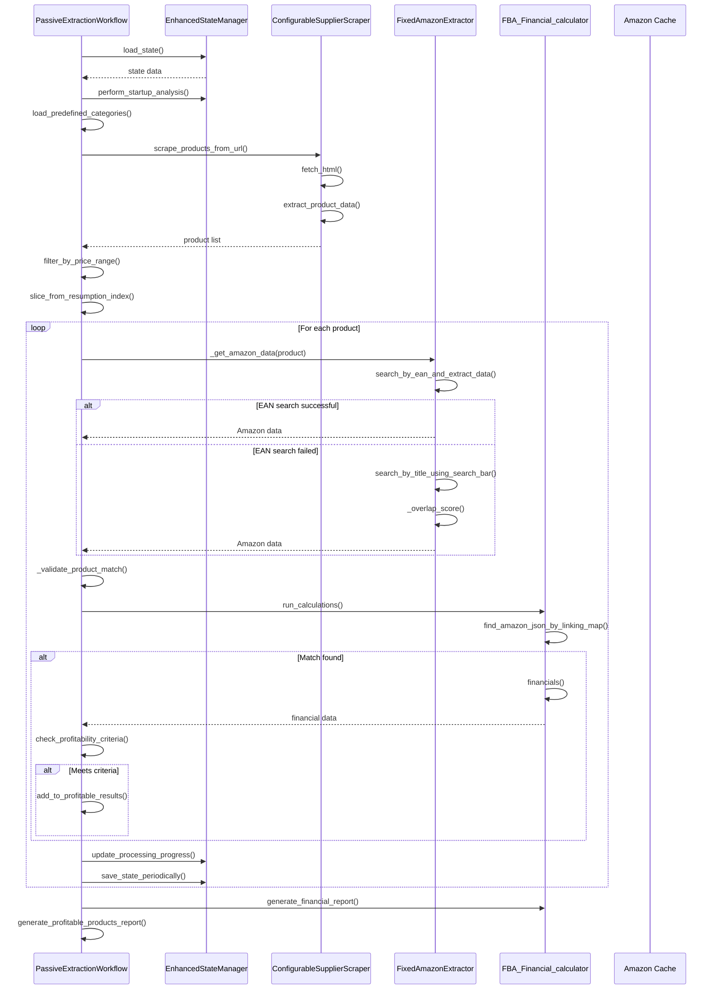
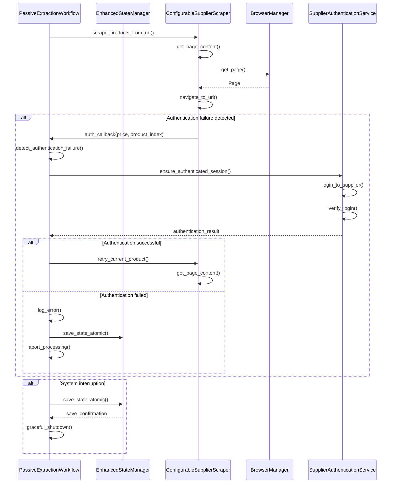

# Workflow Engine

<cite>
**Referenced Files in This Document**   
- [passive_extraction_workflow_latest.py](file://tools/passive_extraction_workflow_latest.py)
- [configurable_supplier_scraper.py](file://tools/configurable_supplier_scraper.py)
- [fixed_enhanced_state_manager.py](file://utils/fixed_enhanced_state_manager.py)
- [FBA_Financial_calculator.py](file://tools/FBA_Financial_calculator.py)
- [system_config_loader.py](file://config/system_config_loader.py)
</cite>

## Table of Contents
1. [Introduction](#introduction)
2. [Core Components](#core-components)
3. [Architecture Overview](#architecture-overview)
4. [Detailed Component Analysis](#detailed-component-analysis)
5. [Data Flow and Processing](#data-flow-and-processing)
6. [Resilience and State Management](#resilience-and-state-management)
7. [Integration Points](#integration-points)
8. [Sequence Diagrams](#sequence-diagrams)
9. [Conclusion](#conclusion)

## Introduction
The PassiveExtractionWorkflow class serves as the central orchestrator of the Amazon FBA Agent System, coordinating the end-to-end process of identifying profitable products for Amazon FBA resale. This workflow integrates supplier data scraping, Amazon product matching, financial analysis, and stateful processing to create a robust product sourcing pipeline. The system is designed to handle complex e-commerce websites with resilience features including stateful resume capability, integrated authentication retry, and atomic data persistence. This documentation provides a comprehensive analysis of the workflow's architecture, execution flow, and integration points.

## Core Components
The PassiveExtractionWorkflow class coordinates several key components to execute the product sourcing workflow. It manages the extraction of supplier products through the ConfigurableSupplierScraper, retrieves Amazon data using the FixedAmazonExtractor, maintains processing state with the EnhancedStateManager, and performs financial calculations through the FBA_Financial_calculator. The workflow is configured through system_config.json, which controls operational parameters such as batch sizes, financial thresholds, and processing limits. The main execution flow begins with initialization and configuration loading, proceeds through batched supplier product extraction, Amazon data retrieval with EAN-first/title-fallback matching, financial calculation, and concludes with state management and report generation.

**Section sources**
- [passive_extraction_workflow_latest.py](file://tools/passive_extraction_workflow_latest.py#L851-L2650)

## Architecture Overview
The PassiveExtractionWorkflow implements a modular, stateful architecture that coordinates multiple specialized components to achieve its product sourcing objectives. The workflow follows a sequential processing model with distinct phases: initialization, supplier data extraction, Amazon data retrieval, financial analysis, and reporting. Each phase is designed with resilience in mind, incorporating error handling, retry mechanisms, and state persistence. The architecture emphasizes separation of concerns, with dedicated components for supplier scraping, Amazon data extraction, state management, and financial calculations. Configuration is centralized in system_config.json, ensuring a single source of truth for operational parameters. The workflow processes supplier categories in configurable batches to manage memory usage and system stability, particularly important when scraping suppliers with extensive product catalogs.

**Diagram sources **
- [passive_extraction_workflow_latest.py](file://tools/passive_extraction_workflow_latest.py#L851-L2650)
- [configurable_supplier_scraper.py](file://tools/configurable_supplier_scraper.py#L1-L3938)
- [fixed_enhanced_state_manager.py](file://utils/fixed_enhanced_state_manager.py#L1-L2412)
- [FBA_Financial_calculator.py](file://tools/FBA_Financial_calculator.py#L1-L590)

## Detailed Component Analysis
The PassiveExtractionWorkflow class implements a comprehensive product sourcing workflow through several key methods that coordinate the extraction, matching, and analysis of supplier and Amazon products. The workflow is designed to be resilient, stateful, and configurable, allowing it to adapt to different supplier websites and processing requirements.

### PassiveExtractionWorkflow Class Analysis
The PassiveExtractionWorkflow class serves as the central orchestrator of the Amazon FBA agent system, coordinating the extraction of supplier products, matching with Amazon listings, and financial analysis to identify profitable resale opportunities. The class is initialized with configuration parameters loaded from system_config.json, which define operational parameters such as batch sizes, financial thresholds, and processing limits. The workflow manages the entire product sourcing pipeline from category URL processing through final report generation, implementing a stateful approach that allows for interruption and resumption of processing.

#### Key Methods of PassiveExtractionWorkflow

**Diagram sources **
- [passive_extraction_workflow_latest.py](file://tools/passive_extraction_workflow_latest.py#L851-L2650)
- [configurable_supplier_scraper.py](file://tools/configurable_supplier_scraper.py#L1-L3938)
- [fixed_enhanced_state_manager.py](file://utils/fixed_enhanced_state_manager.py#L1-L2412)
- [FBA_Financial_calculator.py](file://tools/FBA_Financial_calculator.py#L1-L590)

#### Main Execution Flow

**Diagram sources **
- [passive_extraction_workflow_latest.py](file://tools/passive_extraction_workflow_latest.py#L1970-L2316)
- [passive_extraction_workflow_latest.py](file://tools/passive_extraction_workflow_latest.py#L2318-L2435)
- [passive_extraction_workflow_latest.py](file://tools/passive_extraction_workflow_latest.py#L2437-L2525)

**Section sources**
- [passive_extraction_workflow_latest.py](file://tools/passive_extraction_workflow_latest.py#L851-L2650)

## Data Flow and Processing
The PassiveExtractionWorkflow implements a comprehensive data flow that begins with category URLs and progresses through multiple processing stages to generate financial reports. The workflow starts by loading predefined category URLs from configuration, which serve as the entry points for supplier product extraction. These URLs are processed in batches to manage memory usage and system stability, with the batch size controlled by the supplier_extraction_batch_size parameter in system_config.json. For each category URL, the ConfigurableSupplierScraper extracts product data including title, price, EAN, SKU, and availability, storing this information in a supplier product cache.

After supplier product extraction, the workflow filters products based on the configured price range (MIN_PRICE to MAX_PRICE) and slices the product list to start processing from the last_processed_index provided by the EnhancedStateManager. This enables the workflow to resume interrupted processing without reprocessing already-analyzed products. For each supplier product, the workflow retrieves corresponding Amazon data using a dual-pronged matching strategy: first attempting an EAN-based search, and if that fails, falling back to a title-based search with similarity scoring to ensure rational matches.

The retrieved Amazon data is cached to disk, and a linking map entry is created to permanently associate the supplier product with the matched Amazon ASIN. This linking map serves as a persistent record of product matches, enabling efficient lookups during financial analysis and preventing redundant Amazon searches. The FBA_Financial_calculator then processes the combined supplier and Amazon data to calculate key financial metrics including ROI, net profit, referral fees, FBA fees, and VAT implications. Products that meet the defined profitability criteria (MIN_ROI_PERCENT and MIN_PROFIT_PER_UNIT) are added to the profitable results list, while all processed products contribute to the comprehensive financial report.

**Diagram sources **
- [passive_extraction_workflow_latest.py](file://tools/passive_extraction_workflow_latest.py#L851-L2650)
- [configurable_supplier_scraper.py](file://tools/configurable_supplier_scraper.py#L1-L3938)
- [fixed_enhanced_state_manager.py](file://utils/fixed_enhanced_state_manager.py#L1-L2412)
- [FBA_Financial_calculator.py](file://tools/FBA_Financial_calculator.py#L1-L590)

**Section sources**
- [passive_extraction_workflow_latest.py](file://tools/passive_extraction_workflow_latest.py#L851-L2650)
- [configurable_supplier_scraper.py](file://tools/configurable_supplier_scraper.py#L1-L3938)
- [FBA_Financial_calculator.py](file://tools/FBA_Financial_calculator.py#L1-L590)

## Resilience and State Management
The PassiveExtractionWorkflow incorporates several resilience features to ensure reliable operation in the face of interruptions, authentication failures, and system constraints. The most critical resilience feature is the stateful resume capability provided by the EnhancedStateManager, which meticulously tracks processing progress and allows the workflow to be stopped and resumed without losing work. This is particularly important for long-running scraping tasks that may need to be interrupted for maintenance or due to external factors.

The EnhancedStateManager implements a sophisticated state management system that separates resumption tracking from progress tracking, preventing the common issue of processing state corruption. It maintains multiple indices including resumption_index (where to resume after interruption), progress_index (current progress in the active session), and session_products_processed (products processed in the current session). The state manager performs startup analysis to detect reverse gaps (when the linking map contains more entries than the product cache) and adjusts the resumption point accordingly. It also supports real-time updates to category totals when the scraper discovers more products than initially expected, ensuring accurate progress tracking.

In addition to state management, the workflow incorporates integrated authentication retry capabilities. During supplier product extraction, the ConfigurableSupplierScraper proactively checks authentication status every 25 products and triggers re-authentication if necessary. This prevents the common issue of session timeouts during long scraping sessions. The workflow also implements atomic data persistence, using an atomic write pattern (write to a temporary file, then rename) to ensure data integrity in the event of system crashes. Critical state files, including the linking map and processing state, are saved periodically in configurable batches during the main processing loop, balancing data safety with performance.

**Diagram sources **
- [fixed_enhanced_state_manager.py](file://utils/fixed_enhanced_state_manager.py#L1-L2412)
- [passive_extraction_workflow_latest.py](file://tools/passive_extraction_workflow_latest.py#L851-L2650)
- [configurable_supplier_scraper.py](file://tools/configurable_supplier_scraper.py#L1-L3938)

**Section sources**
- [fixed_enhanced_state_manager.py](file://utils/fixed_enhanced_state_manager.py#L1-L2412)
- [passive_extraction_workflow_latest.py](file://tools/passive_extraction_workflow_latest.py#L851-L2650)

## Integration Points
The PassiveExtractionWorkflow integrates with several key components to achieve its product sourcing objectives. The primary integration points include the ConfigurableSupplierScraper for supplier data extraction, the FixedAmazonExtractor for Amazon data retrieval, the EnhancedStateManager for state management, and the FBA_Financial_calculator for financial analysis. These components are tightly integrated through well-defined interfaces that enable seamless data flow and coordination.

The integration with the ConfigurableSupplierScraper is established during workflow initialization, where the scraper is instantiated with the same AI client and configuration as the workflow. The scraper uses Playwright for robust browser automation with anti-bot evasion and JavaScript support, maintaining backward compatibility with the orchestrator while using an improved Playwright-based approach. The scraper is configured with externalized selector configuration loaded from supplier-specific JSON files, allowing it to adapt to different supplier website structures. During product extraction, the scraper can invoke an authentication callback to evaluate pricing and trigger re-authentication if necessary, creating a feedback loop between data extraction and authentication management.

The integration with the FixedAmazonExtractor enables the workflow to retrieve Amazon product data using a dual-pronged matching strategy. The extractor extends the base AmazonExtractor class, adding EAN search capabilities and enhanced title similarity scoring. It reuses browser pages and avoids unnecessary page creation/closure to maintain extension stability, connecting to the browser through the centralized BrowserManager singleton. This integration ensures that Amazon searches are performed efficiently and reliably, with the extractor handling the complexities of Amazon's dynamic content and anti-bot measures.

State management is handled through integration with the EnhancedStateManager, which provides thread-safe, atomic operations for state persistence. The state manager separates resumption tracking from progress tracking, preventing state corruption and enabling reliable interruption and resumption of processing. It maintains a comprehensive state structure that includes processing progress, category performance metrics, error logs, and user-facing metrics. The workflow updates the state manager throughout processing, with periodic atomic saves ensuring data integrity.

Financial analysis is performed through integration with the FBA_Financial_calculator, which processes the combined supplier and Amazon data to calculate key financial metrics. The calculator uses a linking map to associate supplier products with Amazon ASINs, enabling efficient lookups and preventing redundant Amazon searches. It calculates ROI, net profit, referral fees, FBA fees, and VAT implications based on configurable parameters loaded from system_config.json. The calculator generates comprehensive financial reports in CSV format, sorted by ROI to highlight the most profitable opportunities.

**Section sources**
- [passive_extraction_workflow_latest.py](file://tools/passive_extraction_workflow_latest.py#L851-L2650)
- [configurable_supplier_scraper.py](file://tools/configurable_supplier_scraper.py#L1-L3938)
- [fixed_enhanced_state_manager.py](file://utils/fixed_enhanced_state_manager.py#L1-L2412)
- [FBA_Financial_calculator.py](file://tools/FBA_Financial_calculator.py#L1-L590)
- [system_config_loader.py](file://config/system_config_loader.py#L1-L84)

## Sequence Diagrams
The following sequence diagrams illustrate the main processing loop and error recovery scenarios for the PassiveExtractionWorkflow, highlighting the interactions between key components and the flow of data and control.

### Main Processing Loop

**Diagram sources **
- [passive_extraction_workflow_latest.py](file://tools/passive_extraction_workflow_latest.py#L1970-L2316)
- [fixed_enhanced_state_manager.py](file://utils/fixed_enhanced_state_manager.py#L1-L2412)
- [configurable_supplier_scraper.py](file://tools/configurable_supplier_scraper.py#L1-L3938)
- [FBA_Financial_calculator.py](file://tools/FBA_Financial_calculator.py#L1-L590)

### Error Recovery Scenario

**Diagram sources **
- [passive_extraction_workflow_latest.py](file://tools/passive_extraction_workflow_latest.py#L851-L2650)
- [configurable_supplier_scraper.py](file://tools/configurable_supplier_scraper.py#L1-L3938)
- [fixed_enhanced_state_manager.py](file://utils/fixed_enhanced_state_manager.py#L1-L2412)
- [tools/supplier_authentication_service.py](file://tools/supplier_authentication_service.py)

## Conclusion
The PassiveExtractionWorkflow class serves as a sophisticated orchestrator for the Amazon FBA agent system, integrating multiple specialized components to create a robust product sourcing pipeline. Its architecture emphasizes resilience, statefulness, and configurability, enabling it to handle complex e-commerce websites and long-running scraping tasks. The workflow's key strengths include its stateful resume capability, which allows processing to be interrupted and resumed without data loss; its integrated authentication retry mechanism, which handles session timeouts proactively; and its atomic data persistence, which ensures data integrity in the event of system failures.

The workflow's modular design, with clear separation between data extraction, matching, analysis, and state management components, enables maintainability and extensibility. By centralizing configuration in system_config.json, the workflow provides a single source of truth for operational parameters, making it easy to adjust processing behavior without code changes. The implementation of batched supplier product extraction helps manage memory usage and system stability, particularly important when processing suppliers with extensive product catalogs.

Future enhancements could include expanding the AI-powered category selection capabilities that are currently bypassed in the deterministic mode, implementing more sophisticated product matching algorithms, and adding support for additional e-commerce platforms beyond Amazon. The workflow's architecture provides a solid foundation for these and other enhancements, positioning it as a powerful tool for identifying profitable products in the competitive Amazon FBA marketplace.