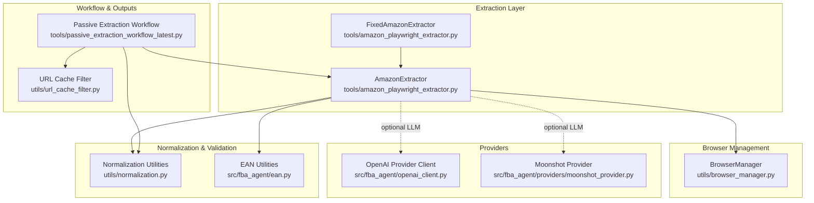
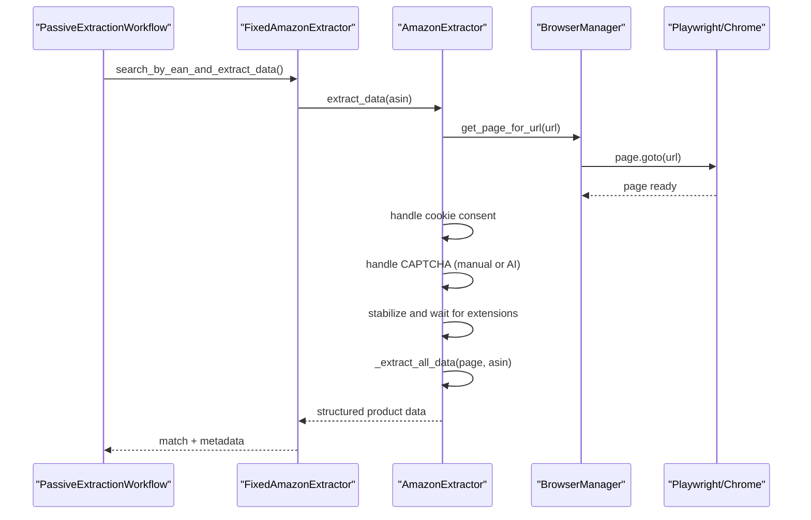
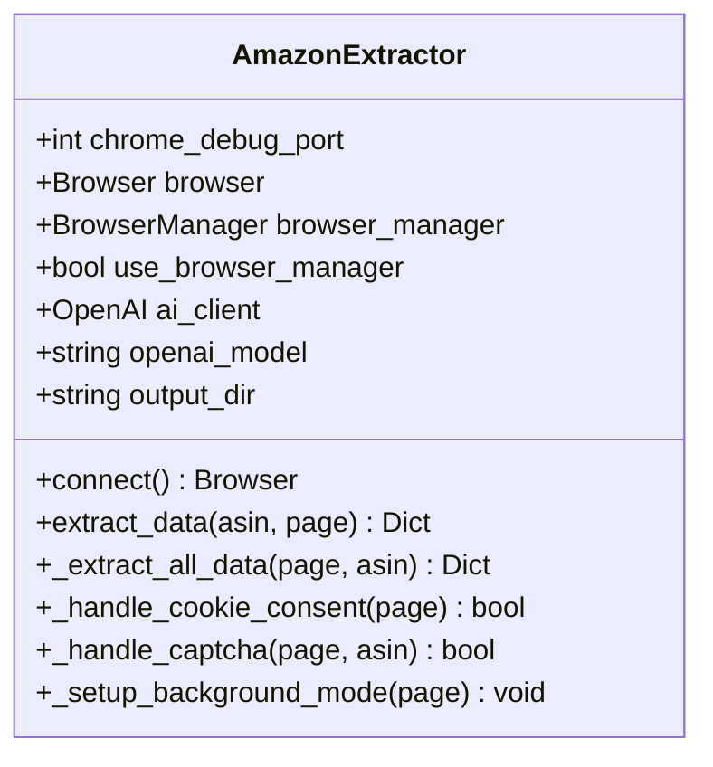
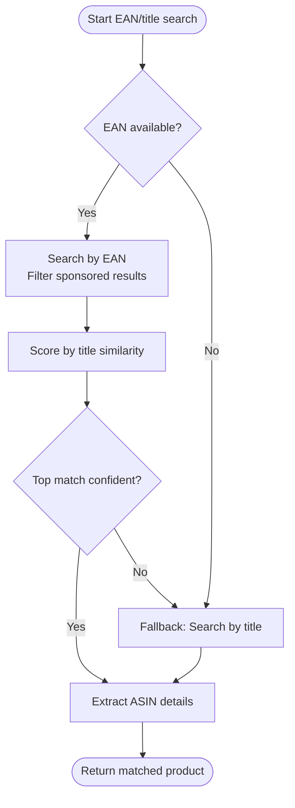
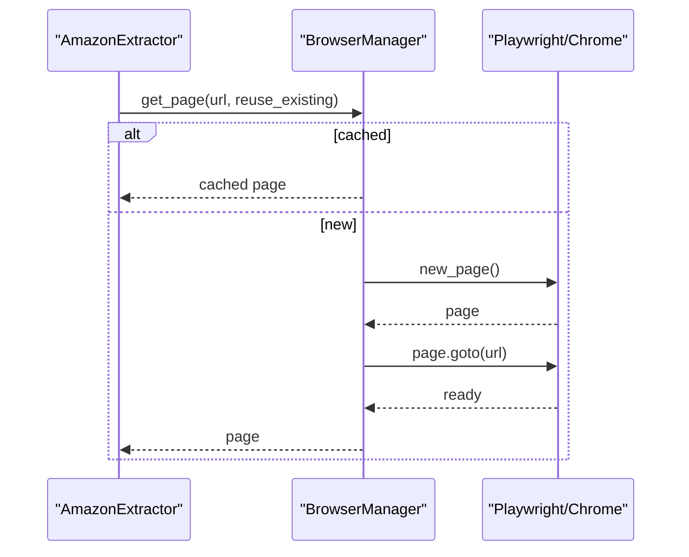
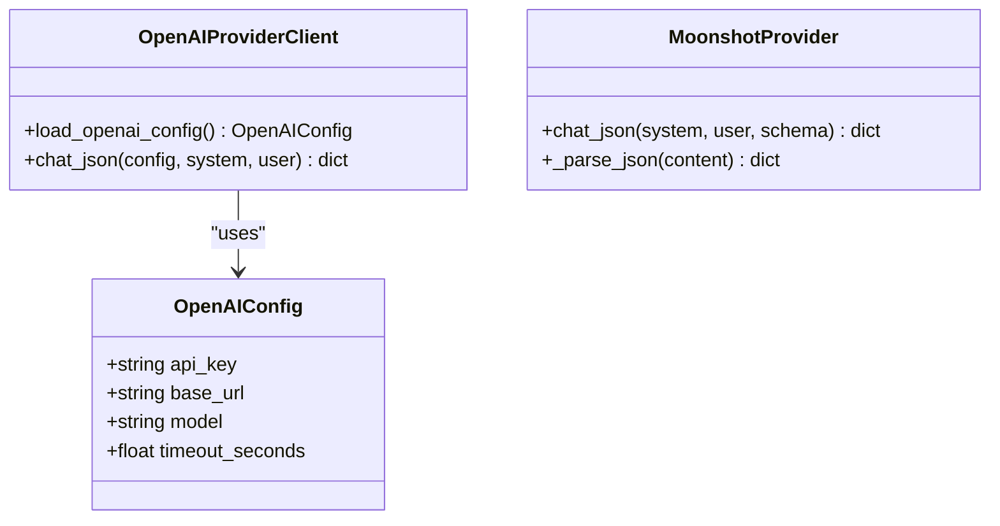
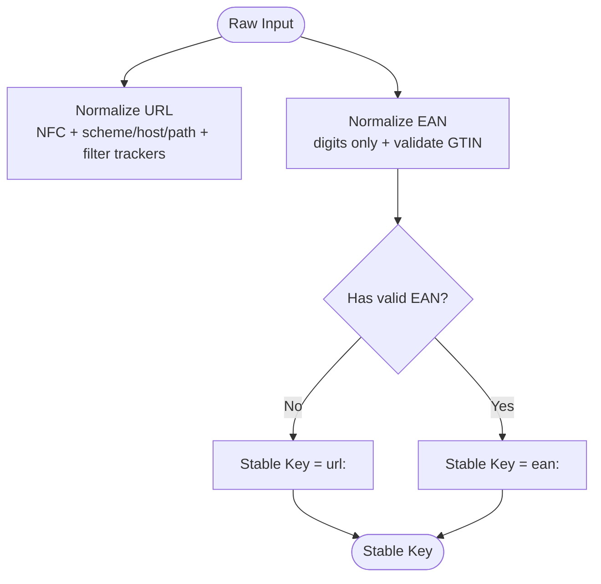
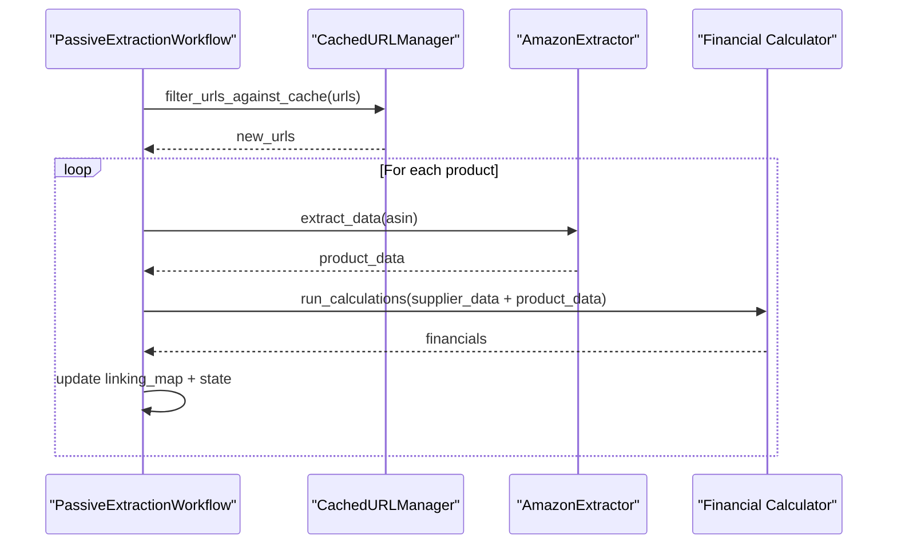
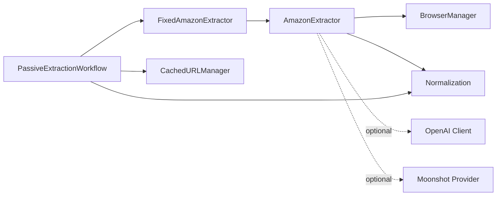

# Amazon Extractor

<cite>
**Referenced Files in This Document**
- [amazon_playwright_extractor.py](file://tools/amazon_playwright_extractor.py)
- [browser_manager.py](file://utils/browser_manager.py)
- [moonshot_provider.py](file://src/fba_agent/providers/moonshot_provider.py)
- [openai_client.py](file://src/fba_agent/openai_client.py)
- [normalization.py](file://utils/normalization.py)
- [passive_extraction_workflow_latest.py](file://tools/passive_extraction_workflow_latest.py)
- [ean.py](file://src/fba_agent/ean.py)
- [url_cache_filter.py](file://utils/url_cache_filter.py)
</cite>

## Table of Contents
1. [Introduction](#introduction)
2. [Project Structure](#project-structure)
3. [Core Components](#core-components)
4. [Architecture Overview](#architecture-overview)
5. [Detailed Component Analysis](#detailed-component-analysis)
6. [Dependency Analysis](#dependency-analysis)
7. [Performance Considerations](#performance-considerations)
8. [Troubleshooting Guide](#troubleshooting-guide)
9. [Conclusion](#conclusion)
10. [Appendices](#appendices)

## Introduction
This document explains the Amazon Extractor component that retrieves product data from Amazon using Playwright-driven Chrome automation. It covers:
- Search result processing and product detail page scraping
- ASIN extraction and validation
- Provider integration for LLM services (OpenAI and Moonshot)
- Data normalization and validation (including EAN matching and product verification)
- Examples of extraction patterns, error handling for rate limits and CAPTCHA, and performance optimization techniques
- Integration with the financial analysis module and linking map generation

## Project Structure
The Amazon Extractor is implemented as a Playwright-based tool integrated with a centralized browser manager and optional LLM providers. It participates in a larger workflow that caches supplier product URLs, matches them to Amazon via EAN/title, persists linking maps, and computes profitability.

**Diagram sources**
- [amazon_playwright_extractor.py](file://tools/amazon_playwright_extractor.py#L63-L122)
- [browser_manager.py](file://utils/browser_manager.py#L35-L120)
- [openai_client.py](file://src/fba_agent/openai_client.py#L30-L131)
- [moonshot_provider.py](file://src/fba_agent/providers/moonshot_provider.py#L10-L83)
- [normalization.py](file://utils/normalization.py#L1-L31)
- [passive_extraction_workflow_latest.py](file://tools/passive_extraction_workflow_latest.py#L136-L173)
- [url_cache_filter.py](file://utils/url_cache_filter.py#L31-L178)

**Section sources**
- [amazon_playwright_extractor.py](file://tools/amazon_playwright_extractor.py#L1-L120)
- [browser_manager.py](file://utils/browser_manager.py#L1-L120)
- [passive_extraction_workflow_latest.py](file://tools/passive_extraction_workflow_latest.py#L1-L120)

## Core Components
- AmazonExtractor: Orchestrates Playwright Chrome connections, navigations, cookie consent, CAPTCHA handling, and comprehensive data extraction from product detail pages. It integrates with a centralized BrowserManager and supports optional AI-assisted diagnostics and fallbacks.
- FixedAmazonExtractor: Extends AmazonExtractor to implement search-by-EAN and search-by-title flows, with sponsored ad filtering and title similarity scoring.
- BrowserManager: Singleton managing a persistent Chrome instance via CDP, with LRU page caching, health checks, and restart capabilities.
- LLM Providers: OpenAI client and Moonshot provider for optional AI-assisted diagnostics and structured JSON extraction.
- Normalization and Validation: URL normalization, EAN normalization/validation, and stable key generation for deduplication and linking.
- Passive Extraction Workflow: Coordinates supplier product ingestion, URL caching/pre-filtering, Amazon matching, linking map generation, and financial analysis.

**Section sources**
- [amazon_playwright_extractor.py](file://tools/amazon_playwright_extractor.py#L63-L122)
- [browser_manager.py](file://utils/browser_manager.py#L35-L120)
- [moonshot_provider.py](file://src/fba_agent/providers/moonshot_provider.py#L10-L83)
- [openai_client.py](file://src/fba_agent/openai_client.py#L30-L131)
- [normalization.py](file://utils/normalization.py#L1-L31)
- [passive_extraction_workflow_latest.py](file://tools/passive_extraction_workflow_latest.py#L136-L173)
- [ean.py](file://src/fba_agent/ean.py#L19-L77)
- [url_cache_filter.py](file://utils/url_cache_filter.py#L31-L178)

## Architecture Overview
The Amazon Extractor relies on a persistent Chrome instance connected via CDP. It uses a centralized BrowserManager to ensure stability and minimize overhead. The extractor navigates to product detail pages, handles anti-automation measures, and extracts structured data. Optional AI features are currently disabled in the extractor, but provider integrations exist for diagnostics and structured JSON extraction.

**Diagram sources**
- [passive_extraction_workflow_latest.py](file://tools/passive_extraction_workflow_latest.py#L2437-L2525)
- [amazon_playwright_extractor.py](file://tools/amazon_playwright_extractor.py#L317-L466)
- [browser_manager.py](file://utils/browser_manager.py#L141-L198)

## Detailed Component Analysis

### AmazonExtractor
- Responsibilities:
  - Connect to Chrome via BrowserManager singleton
  - Navigate to product detail pages with retries and circuit breaker
  - Handle cookie consent and CAPTCHA (manual fallback)
  - Extract comprehensive product data (title, price, images, details, sales rank, ratings, features, description, specifications)
  - Integrate extension data (Keepa/SellerAmp) and consolidate fallbacks
  - Normalize and standardize ASIN fields
- Key behaviors:
  - Background mode setup to prevent browser focus
  - Health checks and page replacement for dead or unresponsive pages
  - Optional AI diagnostic hooks (disabled in current implementation)
  - Robust stabilization waits and extension data waits

**Diagram sources**
- [amazon_playwright_extractor.py](file://tools/amazon_playwright_extractor.py#L63-L122)
- [amazon_playwright_extractor.py](file://tools/amazon_playwright_extractor.py#L317-L466)

**Section sources**
- [amazon_playwright_extractor.py](file://tools/amazon_playwright_extractor.py#L63-L122)
- [amazon_playwright_extractor.py](file://tools/amazon_playwright_extractor.py#L123-L224)
- [amazon_playwright_extractor.py](file://tools/amazon_playwright_extractor.py#L317-L466)
- [amazon_playwright_extractor.py](file://tools/amazon_playwright_extractor.py#L467-L777)

### FixedAmazonExtractor (Search and Match)
- Responsibilities:
  - Search by EAN-first strategy, filter sponsored results, and score best match by title similarity
  - Fallback to title-based search when EAN matching fails
  - Coordinate with AmazonExtractor for ASIN-level extraction
- Integration:
  - Uses AmazonExtractor for detail page extraction
  - Leverages supplier product data and EAN/title heuristics

**Diagram sources**
- [passive_extraction_workflow_latest.py](file://tools/passive_extraction_workflow_latest.py#L625-L795)
- [passive_extraction_workflow_latest.py](file://tools/passive_extraction_workflow_latest.py#L2437-L2525)

**Section sources**
- [passive_extraction_workflow_latest.py](file://tools/passive_extraction_workflow_latest.py#L625-L795)
- [passive_extraction_workflow_latest.py](file://tools/passive_extraction_workflow_latest.py#L2437-L2525)

### BrowserManager
- Responsibilities:
  - Singleton Chrome connection via CDP
  - LRU page caching with single-page mode for stability
  - Health monitoring, periodic restarts, and memory usage tracking
  - Navigation with circuit breaker
- Behavior:
  - Connects to existing Chrome debug instance (no new Chromium launches)
  - Minimizes risk of focus and popup interference
  - Provides fallback to bundled Chromium when necessary

**Diagram sources**
- [browser_manager.py](file://utils/browser_manager.py#L141-L198)
- [browser_manager.py](file://utils/browser_manager.py#L35-L120)

**Section sources**
- [browser_manager.py](file://utils/browser_manager.py#L35-L120)
- [browser_manager.py](file://utils/browser_manager.py#L141-L198)
- [browser_manager.py](file://utils/browser_manager.py#L658-L720)

### LLM Provider Integrations
- OpenAI Provider Client:
  - Loads configuration from environment variables
  - Sends structured chat requests and parses JSON responses
  - Supports tracing to a file for diagnostics
- Moonshot Provider:
  - OpenAI-compatible client configured for Moonshot base URL
  - Enforces strict JSON-only responses
  - Includes automatic escalation on failure

**Diagram sources**
- [openai_client.py](file://src/fba_agent/openai_client.py#L19-L131)
- [moonshot_provider.py](file://src/fba_agent/providers/moonshot_provider.py#L10-L83)

**Section sources**
- [openai_client.py](file://src/fba_agent/openai_client.py#L30-L131)
- [moonshot_provider.py](file://src/fba_agent/providers/moonshot_provider.py#L10-L83)

### Data Normalization and Validation
- URL Normalization:
  - NFC normalization, lowercase host, trailing slash removal, query param filtering (tracking params), and canonical URL construction
- EAN Normalization and Validation:
  - Strips non-digits, validates GTIN lengths and checksums, supports padding for shorter sequences
- Stable Key Generation:
  - EAN-first authority for deduplication; URL fallback; anonymous fallback when neither is present

**Diagram sources**
- [normalization.py](file://utils/normalization.py#L6-L31)
- [ean.py](file://src/fba_agent/ean.py#L19-L77)

**Section sources**
- [normalization.py](file://utils/normalization.py#L1-L31)
- [ean.py](file://src/fba_agent/ean.py#L19-L77)

### Integration with Financial Analysis and Linking Map
- URL Pre-filtering:
  - CachedURLManager loads supplier cache files and linking maps to skip already processed URLs
- Linking Map Generation:
  - Workflow maintains an in-memory linking map associating supplier URLs to matched Amazon ASINs
  - Periodic atomic saves ensure durability
- Financial Analysis:
  - Post-match, the workflow invokes financial calculation routines to evaluate profitability and ROI thresholds

**Diagram sources**
- [url_cache_filter.py](file://utils/url_cache_filter.py#L179-L207)
- [passive_extraction_workflow_latest.py](file://tools/passive_extraction_workflow_latest.py#L136-L173)

**Section sources**
- [url_cache_filter.py](file://utils/url_cache_filter.py#L31-L178)
- [passive_extraction_workflow_latest.py](file://tools/passive_extraction_workflow_latest.py#L136-L173)

## Dependency Analysis
- AmazonExtractor depends on:
  - BrowserManager for persistent Chrome and page lifecycle
  - Normalization utilities for stable keys and URL normalization
  - Optional LLM providers for diagnostics and structured extraction
- FixedAmazonExtractor depends on AmazonExtractor and supplier product data
- Workflow orchestrates URL filtering, matching, linking, and financial evaluation

**Diagram sources**
- [passive_extraction_workflow_latest.py](file://tools/passive_extraction_workflow_latest.py#L136-L173)
- [amazon_playwright_extractor.py](file://tools/amazon_playwright_extractor.py#L63-L122)
- [browser_manager.py](file://utils/browser_manager.py#L35-L120)
- [normalization.py](file://utils/normalization.py#L1-L31)
- [url_cache_filter.py](file://utils/url_cache_filter.py#L31-L178)

**Section sources**
- [passive_extraction_workflow_latest.py](file://tools/passive_extraction_workflow_latest.py#L136-L173)
- [amazon_playwright_extractor.py](file://tools/amazon_playwright_extractor.py#L63-L122)
- [browser_manager.py](file://utils/browser_manager.py#L35-L120)
- [normalization.py](file://utils/normalization.py#L1-L31)
- [url_cache_filter.py](file://utils/url_cache_filter.py#L31-L178)

## Performance Considerations
- Single-page mode and LRU caching reduce overhead and extension reload costs
- Background mode prevents focus-related interruptions and popup triggers
- Stabilization and extension waits balance reliability with throughput
- URL pre-filtering dramatically reduces redundant page loads
- Circuit breaker and health checks mitigate transient failures
- Atomic writes for linking map and state improve crash resilience

[No sources needed since this section provides general guidance]

## Troubleshooting Guide
- CAPTCHA Handling:
  - Manual wait period is applied when AI-assisted solving is not available
  - Ensure the page stabilizes after manual resolution
- Cookie Consent:
  - Automated dismissal of Amazon and generic consent dialogs
- Rate Limits and Anti-Robot Measures:
  - Background mode and minimized focus reduce detection
  - Circuit breaker and retries improve resilience
- Browser Connectivity:
  - Verify Chrome debug port accessibility and correct endpoint selection
  - Use troubleshooting steps for port conflicts and process detection
- Extension Data:
  - Additional wait time accommodates Keepa/SellerAmp loading

**Section sources**
- [amazon_playwright_extractor.py](file://tools/amazon_playwright_extractor.py#L163-L224)
- [browser_manager.py](file://utils/browser_manager.py#L242-L315)
- [browser_manager.py](file://utils/browser_manager.py#L623-L657)

## Conclusion
The Amazon Extractor provides a robust, browser-automation–driven pipeline for retrieving Amazon product data. It integrates tightly with a centralized browser manager, implements resilient navigation and anti-detection strategies, and offers optional LLM-backed diagnostics. Combined with normalization, EAN validation, URL pre-filtering, linking map generation, and financial analysis, it forms a complete ingestion and evaluation pipeline for supplier product discovery.

[No sources needed since this section summarizes without analyzing specific files]

## Appendices

### Extraction Patterns and Examples
- Product Detail Extraction:
  - Title, pricing, images, product details, sales rank, ratings, features, description, specifications
  - Extension data consolidation (Keepa/SellerAmp) with fallbacks
- Search Strategies:
  - EAN-first matching with sponsored ad filtering and title similarity scoring
  - Title-based fallback when EAN matching is inconclusive

**Section sources**
- [amazon_playwright_extractor.py](file://tools/amazon_playwright_extractor.py#L467-L777)
- [passive_extraction_workflow_latest.py](file://tools/passive_extraction_workflow_latest.py#L625-L795)

### Provider Configuration Notes
- Environment variables:
  - OPENAI_API_KEY and related model/base URL variables for OpenAI
  - Provider-specific base URLs for Moonshot
- JSON-only responses:
  - Moonshot provider enforces strict JSON-only replies

**Section sources**
- [openai_client.py](file://src/fba_agent/openai_client.py#L30-L40)
- [moonshot_provider.py](file://src/fba_agent/providers/moonshot_provider.py#L17-L29)