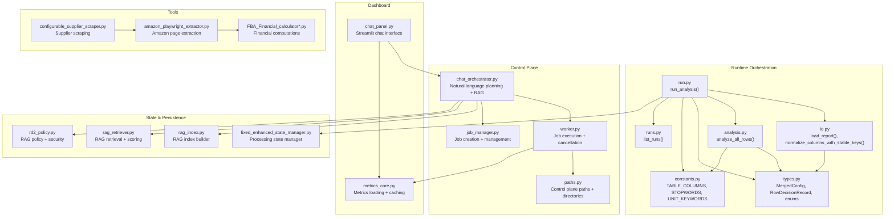
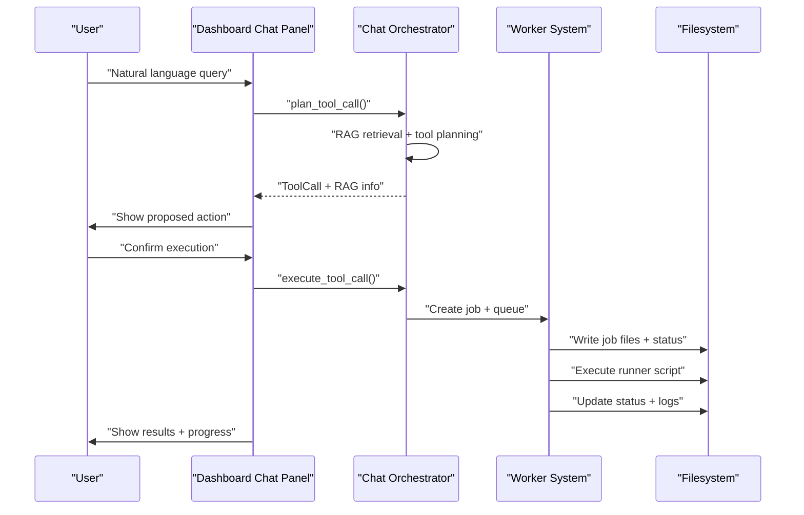
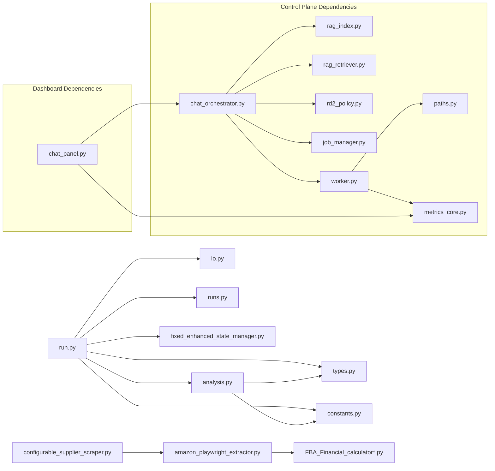

# Core Components

<cite>
**Referenced Files in This Document**
- [run.py](file://src/fba_agent/run.py)
- [analysis.py](file://src/fba_agent/analysis.py)
- [types.py](file://src/fba_agent/types.py)
- [io.py](file://src/fba_agent/io.py)
- [constants.py](file://src/fba_agent/constants.py)
- [runs.py](file://src/fba_agent/runs.py)
- [amazon_playwright_extractor.py](file://tools/amazon_playwright_extractor.py)
- [FBA_Financial_calculator.py](file://tools/FBA_Financial_calculator.py)
- [FBA_Financial_calculator_linking_map_processor.py](file://tools/FBA_Financial_calculator_linking_map_processor.py)
- [fixed_enhanced_state_manager.py](file://utils/fixed_enhanced_state_manager.py)
- [configurable_supplier_scraper.py](file://tools/configurable_supplier_scraper.py)
- [chat_orchestrator.py](file://control_plane/chat_orchestrator.py)
- [worker.py](file://control_plane/worker.py)
- [chat_panel.py](file://dashboard/chat_panel.py)
- [rag_index.py](file://control_plane/rag_index.py)
- [rag_retriever.py](file://control_plane/rag_retriever.py)
- [rd2_policy.py](file://control_plane/rd2_policy.py)
- [paths.py](file://control_plane/paths.py)
- [job_types.py](file://control_plane/job_types.py)
- [job_manager.py](file://control_plane/job_manager.py)
- [metrics_core.py](file://dashboard/metrics_core.py)
</cite>

## Update Summary
**Changes Made**
- Added new Chat Orchestrator system with RAG integration
- Enhanced Worker system with cancellation support and improved monitoring
- Improved Dashboard Chat Panel with better UI components and error handling
- Integrated RAG (Retrieval-Augmented Generation) system for contextual assistance
- Added job management and execution framework

## Table of Contents
1. [Introduction](#introduction)
2. [Project Structure](#project-structure)
3. [Core Components](#core-components)
4. [Architecture Overview](#architecture-overview)
5. [Detailed Component Analysis](#detailed-component-analysis)
6. [Dependency Analysis](#dependency-analysis)
7. [Performance Considerations](#performance-considerations)
8. [Troubleshooting Guide](#troubleshooting-guide)
9. [Conclusion](#conclusion)

## Introduction
This document explains the core components of the Amazon FBA Agent System with a focus on the workflow engine, supplier scraper, Amazon extractor, financial calculator, state manager, and the newly integrated chat orchestrator system. It documents invocation relationships, interfaces, domain models, usage patterns, configuration options, parameters, return values, and practical troubleshooting guidance. The goal is to make the system understandable for newcomers while providing sufficient technical depth for experienced developers.

## Project Structure
The core runtime orchestrates data ingestion, normalization, iterative analysis, validation, and artifact generation. The new chat orchestrator system provides natural language interaction with RAG integration, while the enhanced worker system manages background job execution with cancellation support. Supporting tools implement supplier scraping, Amazon page extraction, financial calculations, and persistent state management.

**Diagram sources**
- [run.py](file://src/fba_agent/run.py#L59-L321)
- [io.py](file://src/fba_agent/io.py#L12-L185)
- [analysis.py](file://src/fba_agent/analysis.py#L348-L418)
- [types.py](file://src/fba_agent/types.py#L27-L168)
- [constants.py](file://src/fba_agent/constants.py#L8-L89)
- [runs.py](file://src/fba_agent/runs.py#L6-L15)
- [chat_orchestrator.py](file://control_plane/chat_orchestrator.py#L1-L941)
- [worker.py](file://control_plane/worker.py#L1-L511)
- [job_manager.py](file://control_plane/job_manager.py#L1-L156)
- [paths.py](file://control_plane/paths.py#L1-L108)
- [chat_panel.py](file://dashboard/chat_panel.py#L1-L440)
- [metrics_core.py](file://dashboard/metrics_core.py#L1-L615)
- [configurable_supplier_scraper.py](file://tools/configurable_supplier_scraper.py)
- [amazon_playwright_extractor.py](file://tools/amazon_playwright_extractor.py)
- [FBA_Financial_calculator.py](file://tools/FBA_Financial_calculator.py)
- [fixed_enhanced_state_manager.py](file://utils/fixed_enhanced_state_manager.py)
- [rag_index.py](file://control_plane/rag_index.py#L1-L174)
- [rag_retriever.py](file://control_plane/rag_retriever.py#L1-L122)
- [rd2_policy.py](file://control_plane/rd2_policy.py#L1-L120)

**Section sources**
- [run.py](file://src/fba_agent/run.py#L59-L321)
- [io.py](file://src/fba_agent/io.py#L12-L185)
- [analysis.py](file://src/fba_agent/analysis.py#L348-L418)
- [types.py](file://src/fba_agent/types.py#L27-L168)
- [constants.py](file://src/fba_agent/constants.py#L8-L89)
- [runs.py](file://src/fba_agent/runs.py#L6-L15)

## Core Components
This section describes the seven core components and their roles, interfaces, and interactions.

- Workflow Engine (orchestration): Central pipeline that loads data, normalizes columns, merges calibration, optionally detects brands via AI, runs iteration loops, validates outputs, generates reports, and persists artifacts and run history.
- Supplier Scraper: Configurable supplier-specific scraping tool used to gather product listings and metadata for downstream matching.
- Amazon Extractor: Playwright-based extractor for Amazon product pages, enabling structured data retrieval for comparison and financial modeling.
- Financial Calculator: Tools that compute profitability metrics, residual inventory estimates, and related KPIs for FBA product analysis.
- State Manager: Persistent state manager responsible for tracking processing progress, resuming work, and coordinating concurrent runs safely.
- **Chat Orchestrator**: Natural language interface that plans tool calls, integrates RAG context, and executes control plane operations with user confirmation.
- **Worker System**: Background job executor that manages workflow runs, product list refreshes, onboarding wizards, and cancellation requests with progress monitoring.
- **Dashboard Chat Panel**: Streamlit-based chat interface that provides natural language interaction, RAG-powered assistance, and real-time job status monitoring.

**Section sources**
- [run.py](file://src/fba_agent/run.py#L59-L321)
- [io.py](file://src/fba_agent/io.py#L12-L185)
- [analysis.py](file://src/fba_agent/analysis.py#L348-L418)
- [types.py](file://src/fba_agent/types.py#L27-L168)
- [constants.py](file://src/fba_agent/constants.py#L8-L89)
- [configurable_supplier_scraper.py](file://tools/configurable_supplier_scraper.py)
- [amazon_playwright_extractor.py](file://tools/amazon_playwright_extractor.py)
- [FBA_Financial_calculator.py](file://tools/FBA_Financial_calculator.py)
- [fixed_enhanced_state_manager.py](file://utils/fixed_enhanced_state_manager.py)
- [chat_orchestrator.py](file://control_plane/chat_orchestrator.py#L1-L941)
- [worker.py](file://control_plane/worker.py#L1-L511)
- [chat_panel.py](file://dashboard/chat_panel.py#L1-L440)

## Architecture Overview
The system follows a staged pipeline with clear separation of concerns, now enhanced with conversational AI capabilities:
- Data ingestion and normalization
- Calibration and memory integration
- Iterative row analysis with optional AI adjudication/critique
- Validation and report generation
- Artifact persistence and run history
- **Chat-based control plane operations with RAG integration**
- **Background job execution with cancellation support**

**Diagram sources**
- [chat_orchestrator.py](file://control_plane/chat_orchestrator.py#L380-L551)
- [worker.py](file://control_plane/worker.py#L259-L502)
- [chat_panel.py](file://dashboard/chat_panel.py#L152-L203)

## Detailed Component Analysis

### Workflow Engine (Orchestration)
The workflow engine is implemented by the orchestration function that coordinates the entire pipeline. It manages:
- Input loading and normalization with stable key generation
- Preflight calibration and memory merging
- Optional AI provider initialization and brand detection
- Iteration loop or single-pass analysis
- Validation and report rendering
- Artifact writing and run history persistence

Key parameters and behavior:
- Inputs: input_path, supplier, runs_dir, memory_dir, skip_browser, overrides_path, fee_rate, max_iterations, enable_ai, provider_name
- Outputs: run directory path; artifacts include coverage ledger CSV, evidence JSONL, run summary JSON, merged calibration JSON, and canonical report MD
- Exceptions: StableKeyCollisionError during normalization; SystemExit on validation failure

Usage pattern:
- Call the orchestration function with desired configuration
- Inspect run_summary.json for diagnostics and validation outcomes
- Use persisted artifacts for auditing and further analysis

Common issues and resolutions:
- Stable key collisions: The system writes a collision report and raises an error; resolve duplicate rows or adjust normalization rules
- Validation failures: Review validation errors in run_summary.json and adjust thresholds or input data
- AI provider failures: The system continues without AI; confirm environment variables and provider availability

**Section sources**
- [run.py](file://src/fba_agent/run.py#L59-L321)
- [io.py](file://src/fba_agent/io.py#L12-L185)

### Supplier Scraper
The supplier scraper is a configurable tool designed to extract supplier product listings and metadata. It supports supplier-specific selectors and authentication helpers, enabling scalable ingestion across multiple suppliers.

Interfaces and usage:
- Accepts supplier-specific configuration and selectors
- Produces structured product data for downstream matching and Amazon extraction
- Integrates with authentication services per supplier

Operational notes:
- Use supplier-specific configuration files to define selectors and pagination behavior
- Coordinate with authentication helpers to maintain session state during scraping

**Section sources**
- [configurable_supplier_scraper.py](file://tools/configurable_supplier_scraper.py)

### Amazon Extractor
The Amazon extractor uses Playwright to navigate Amazon product pages, extract structured data, and support downstream financial modeling and matching.

Interfaces and usage:
- Accepts product URLs or ASINs
- Navigates pages, extracts pricing, titles, variants, and availability signals
- Produces structured records consumable by the financial calculator and analysis pipeline

Operational notes:
- Requires stable network connectivity and appropriate browser setup
- Use with supplier scraper outputs to maximize matching coverage

**Section sources**
- [amazon_playwright_extractor.py](file://tools/amazon_playwright_extractor.py)

### Financial Calculator
The financial calculator computes profitability metrics and residual inventory estimates. Multiple variants exist to support different input formats and workflows.

Interfaces and usage:
- Accepts product data from supplier and Amazon sources
- Computes adjusted profit considering pack quantities and fees
- Supports linking map processing and standalone calculations

Operational notes:
- Ensure input data includes required fields (prices, quantities, EANs)
- Use linking map processor to consolidate matched pairs before final calculations

**Section sources**
- [FBA_Financial_calculator.py](file://tools/FBA_Financial_calculator.py)
- [FBA_Financial_calculator_linking_map_processor.py](file://tools/FBA_Financial_calculator_linking_map_processor.py)

### State Manager
The state manager maintains processing state, enabling resumable and recoverable workflows. It tracks run history, calibration snapshots, and convergence metrics.

Interfaces and usage:
- Persists and loads calibration and run history
- Coordinates concurrent runs and avoids conflicts
- Provides hooks for diagnostics and resumption

Operational notes:
- Ensure atomic writes for state updates
- Monitor run history for regression guard compliance

**Section sources**
- [fixed_enhanced_state_manager.py](file://utils/fixed_enhanced_state_manager.py)

### Chat Orchestrator System
The chat orchestrator provides natural language interaction with the system through a sophisticated tool planning and execution framework. It integrates RAG (Retrieval-Augmented Generation) for contextual assistance and supports both read and write operations.

Key capabilities:
- **Natural language processing**: Parses user queries to determine intent and extract parameters
- **RAG integration**: Retrieves relevant context from system documentation and diagnostics
- **Tool planning**: Maps natural language requests to specific control plane operations
- **Write protection**: Requires explicit user confirmation for potentially destructive operations
- **Context resolution**: Automatically resolves run IDs and supplier domains from context

Supported tools:
- **Read tools**: `ask_clarify`, `query_financial`, `show_status`, `tail_logs`, `show_trace_summary`, `read_processing_state`, `find_cached_products`, `find_linking_entries`, `read_amazon_cache_by_asin`, `read_repo_file`, `list_repo_dir`
- **Write tools**: `enqueue_run`, `cancel_run`, `enqueue_onboarding`, `enqueue_product_list_refresh`

RAG integration features:
- **Index building**: Creates searchable indexes from system documentation and diagnostics
- **Context retrieval**: Uses token overlap scoring to find relevant information
- **Security policy**: Redacts sensitive information and filters blocked content
- **Budget management**: Controls context size and character limits

**Section sources**
- [chat_orchestrator.py](file://control_plane/chat_orchestrator.py#L1-L941)
- [rag_index.py](file://control_plane/rag_index.py#L1-L174)
- [rag_retriever.py](file://control_plane/rag_retriever.py#L1-L122)
- [rd2_policy.py](file://control_plane/rd2_policy.py#L1-L120)

### Enhanced Worker System
The worker system manages background job execution with comprehensive monitoring, cancellation support, and progress tracking. It handles multiple job types including workflow runs, product list refreshes, and onboarding wizards.

Key features:
- **Job lifecycle management**: Handles job creation, execution, completion, and failure states
- **Cancellation support**: Implements graceful cancellation through flag files and process termination
- **Progress monitoring**: Tracks execution progress and updates status files in real-time
- **Timeout handling**: Enforces job timeouts to prevent runaway processes
- **Lock management**: Prevents concurrent execution of conflicting jobs

Job types supported:
- `run_workflow`: Executes supplier-specific workflow scripts
- `run_product_list_refresh`: Refreshes product lists with optional dry-run mode
- `run_onboarding_wizard`: Manages supplier onboarding processes

Status tracking:
- **Queued**: Job created but not yet started
- **Running**: Job currently executing
- **Done**: Job completed successfully
- **Failed**: Job terminated with error
- **Cancelled**: Job cancelled by user request

**Section sources**
- [worker.py](file://control_plane/worker.py#L1-L511)
- [job_types.py](file://control_plane/job_types.py#L1-L9)
- [job_manager.py](file://control_plane/job_manager.py#L1-L156)

### Dashboard Chat Panel
The dashboard chat panel provides a Streamlit-based interface for natural language interaction with the system. It offers enhanced UI components, error handling, and real-time feedback for chat operations.

Key features:
- **Natural language interface**: Accepts conversational queries for system operations
- **Confirmation dialogs**: Requires explicit approval for write operations
- **Parameter extraction**: Automatically parses product limits from natural language
- **RAG integration**: Displays RAG context and sources in chat responses
- **Error handling**: Provides user-friendly error messages and recovery guidance
- **Progress monitoring**: Shows job status and log file locations

UI components:
- **Chat interface**: Streamlit chat message display with tool output expansion
- **RAG controls**: Buttons to refresh system index and build RAG index
- **Confirmation buttons**: Approve or cancel pending tool executions
- **Progress indicators**: Real-time status updates and log file monitoring

**Section sources**
- [chat_panel.py](file://dashboard/chat_panel.py#L1-L440)

## Dependency Analysis
The orchestration layer depends on normalization, analysis, types, constants, and run listing utilities. The new chat orchestrator system integrates with RAG components, job management, and worker systems. The dashboard chat panel depends on the chat orchestrator and metrics system. Tools depend on each other to form end-to-end pipelines. State manager integrates with filesystem for persistence.

**Diagram sources**
- [run.py](file://src/fba_agent/run.py#L59-L321)
- [io.py](file://src/fba_agent/io.py#L12-L185)
- [analysis.py](file://src/fba_agent/analysis.py#L348-L418)
- [types.py](file://src/fba_agent/types.py#L27-L168)
- [constants.py](file://src/fba_agent/constants.py#L8-L89)
- [runs.py](file://src/fba_agent/runs.py#L6-L15)
- [chat_orchestrator.py](file://control_plane/chat_orchestrator.py#L1-L941)
- [worker.py](file://control_plane/worker.py#L1-L511)
- [job_manager.py](file://control_plane/job_manager.py#L1-L156)
- [paths.py](file://control_plane/paths.py#L1-L108)
- [chat_panel.py](file://dashboard/chat_panel.py#L1-L440)
- [metrics_core.py](file://dashboard/metrics_core.py#L1-L615)
- [configurable_supplier_scraper.py](file://tools/configurable_supplier_scraper.py)
- [amazon_playwright_extractor.py](file://tools/amazon_playwright_extractor.py)
- [FBA_Financial_calculator.py](file://tools/FBA_Financial_calculator.py)
- [fixed_enhanced_state_manager.py](file://utils/fixed_enhanced_state_manager.py)
- [rag_index.py](file://control_plane/rag_index.py#L1-L174)
- [rag_retriever.py](file://control_plane/rag_retriever.py#L1-L122)
- [rd2_policy.py](file://control_plane/rd2_policy.py#L1-L120)

**Section sources**
- [run.py](file://src/fba_agent/run.py#L59-L321)
- [io.py](file://src/fba_agent/io.py#L12-L185)
- [analysis.py](file://src/fba_agent/analysis.py#L348-L418)
- [types.py](file://src/fba_agent/types.py#L27-L168)
- [constants.py](file://src/fba_agent/constants.py#L8-L89)
- [runs.py](file://src/fba_agent/runs.py#L6-L15)

## Performance Considerations
- Prefer single-pass analysis when AI features are disabled to reduce overhead
- Use iteration loops judiciously; limit max_iterations to balance accuracy and runtime
- Normalize and deduplicate inputs to minimize stable key collisions
- Persist artifacts atomically to avoid partial reads during concurrent operations
- Cache supplier and Amazon data where feasible to reduce repeated I/O
- **Optimize RAG queries**: Use appropriate top_k values and character limits to balance context quality and performance
- **Monitor worker queue**: Regularly check job status directories to prevent backlog accumulation
- **Implement proper cancellation**: Use cancellation flags to gracefully terminate long-running operations
- **Cache metrics**: Utilize the metrics loader's caching mechanism to reduce file I/O overhead

## Troubleshooting Guide
Common issues and resolutions:
- Stable key collisions: Investigate duplicate rows or ambiguous titles; adjust normalization rules or remove duplicates
- Validation failures: Review validation errors in run_summary.json for validation errors; adjust thresholds or clean inputs
- AI provider failures: Confirm environment variables and provider credentials; disable AI temporarily to isolate issues
- Missing artifacts: Verify filesystem permissions and disk space; ensure atomic write operations complete
- State corruption: Use state manager's diagnostic capabilities and rebuild calibration snapshots
- **Chat interface issues**: Check LLM provider configuration and ensure CONTROL_PLANE_LLM_PROVIDER is set correctly
- **RAG index problems**: Verify system documentation exists in .qoder/repowiki/ and diagnostics are available
- **Worker not executing jobs**: Ensure python -m control_plane worker is running and has proper filesystem permissions
- **Cancellation not working**: Verify cancel flag files are being created in OUTPUTS/CONTROL_PLANE/lock/ directory
- **Dashboard connection issues**: Check Streamlit server is running and port is accessible

**Section sources**
- [run.py](file://src/fba_agent/run.py#L114-L131)
- [io.py](file://src/fba_agent/io.py#L146-L185)
- [chat_panel.py](file://dashboard/chat_panel.py#L394-L404)
- [worker.py](file://control_plane/worker.py#L371-L381)

## Conclusion
The Amazon FBA Agent System's core components form a robust, extensible pipeline for supplier and Amazon data ingestion, matching, and financial analysis. The workflow engine coordinates orchestration, normalization, iteration, validation, and reporting. Supplier scrapers and Amazon extractors provide the data backbone, while financial calculators and the state manager ensure accurate, repeatable, and auditable results.

**The new chat orchestrator system significantly enhances system accessibility** by providing natural language interfaces for complex operations. The integration of RAG (Retrieval-Augmented Generation) ensures users receive contextually relevant assistance while maintaining security through policy enforcement. The enhanced worker system with cancellation support provides reliable background job execution with comprehensive monitoring capabilities.

**The dashboard chat panel delivers an intuitive user experience** with sophisticated parameter extraction, confirmation dialogs for safety, and real-time progress monitoring. Together with the metrics core system, it provides comprehensive visibility into system operations and performance.

By understanding the interfaces, configuration options, and operational patterns documented here, teams can deploy, troubleshoot, and extend the system effectively while leveraging the powerful conversational AI capabilities for enhanced productivity and system management.