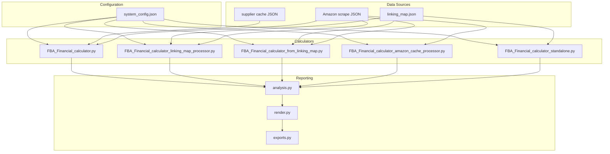
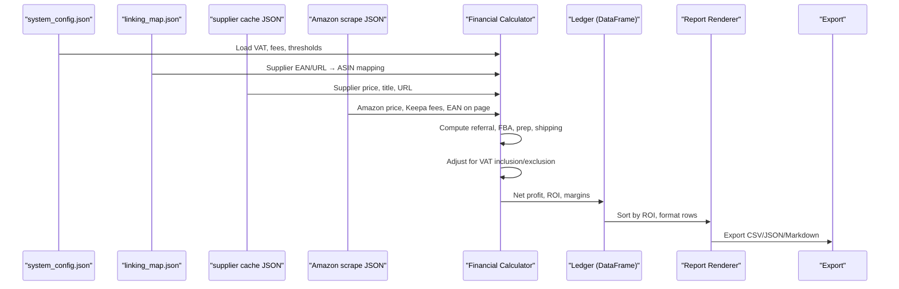
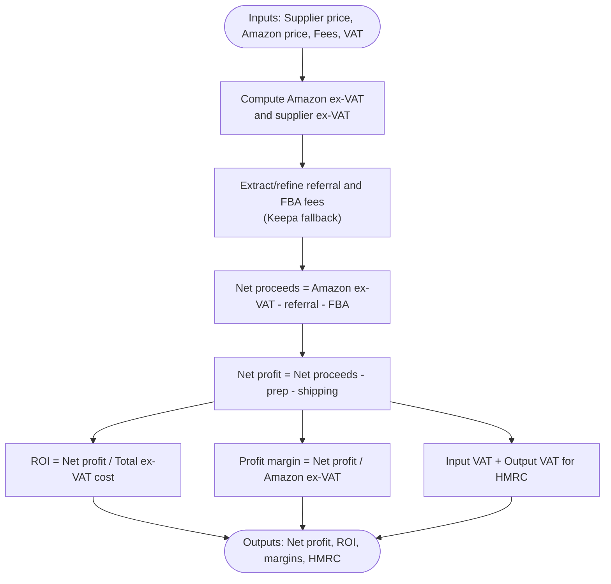
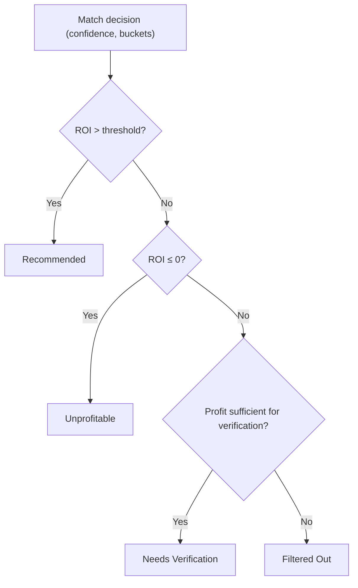
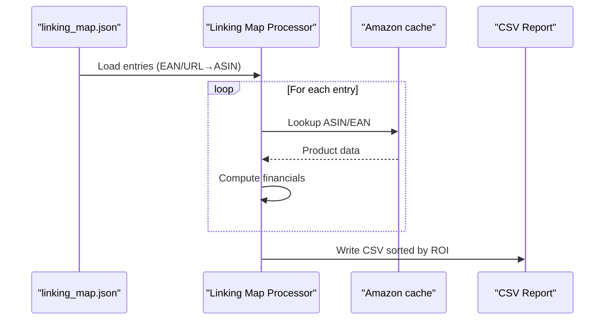
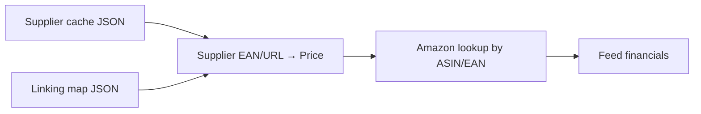
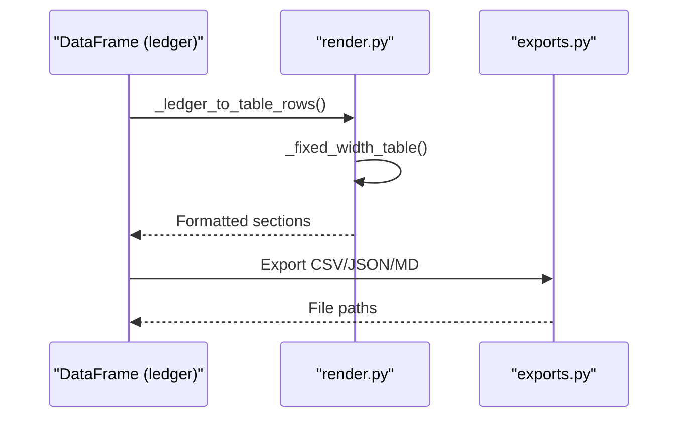
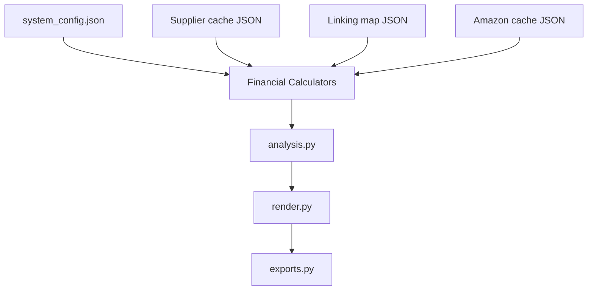

# Financial Calculator

<cite>
**Referenced Files in This Document**
- [FBA_Financial_calculator.py](file://tools/FBA_Financial_calculator.py)
- [FBA_Financial_calculator_linking_map_processor.py](file://tools/FBA_Financial_calculator_linking_map_processor.py)
- [FBA_Financial_calculator_from_linking_map.py](file://tools/FBA_Financial_calculator_from_linking_map.py)
- [FBA_Financial_calculator_amazon_cache_processor.py](file://tools/FBA_Financial_calculator_amazon_cache_processor.py)
- [FBA_Financial_calculator_standalone.py](file://tools/FBA_Financial_calculator_standalone.py)
- [system_config.json](file://config/system_config.json)
- [linking_map.json (poundwholesale)](file://OUTPUTS/FBA_ANALYSIS/linking_maps/poundwholesale.co.uk/linking_map.json)
- [linking_map.json (angelwholesale)](file://LLM_ANALYSIS_PACKAGE/output_files/linking_map.json)
- [poundwholesale.co.uk_products_cache.json](file://OUTPUTS/cached_products/poundwholesale-co-uk_products_cache.json)
- [analysis.py](file://src/fba_agent/analysis.py)
- [render.py](file://src/fba_agent/render.py)
- [exports.py](file://src/fba_agent/exports.py)
</cite>

## Table of Contents
1. [Introduction](#introduction)
2. [Project Structure](#project-structure)
3. [Core Components](#core-components)
4. [Architecture Overview](#architecture-overview)
5. [Detailed Component Analysis](#detailed-component-analysis)
6. [Dependency Analysis](#dependency-analysis)
7. [Performance Considerations](#performance-considerations)
8. [Troubleshooting Guide](#troubleshooting-guide)
9. [Conclusion](#conclusion)
10. [Appendices](#appendices)

## Introduction
This document explains the Financial Calculator component that computes FBA profitability across supplier-product data and Amazon listings. It covers:
- FBA fee calculation methodology (referral, fulfillment, prep, shipping)
- VAT-adjusted pricing and profit margin computations
- ROI analysis and screening thresholds
- Batch financial analysis via linking map processor
- Integration with supplier product caches and Amazon scrape data
- Report generation and export capabilities
- Practical examples, decision criteria, and edge cases

## Project Structure
The Financial Calculator is implemented as multiple tools that share a common financial computation engine and configuration-driven behavior:
- Tools:
  - FBA_Financial_calculator.py: Main calculator using supplier cache + linking map lookups
  - FBA_Financial_calculator_linking_map_processor.py: Processes linking map directly for batch analysis
  - FBA_Financial_calculator_from_linking_map.py: Generates complete financial reports from linking map
  - FBA_Financial_calculator_amazon_cache_processor.py: Matches Amazon cache against supplier data
  - FBA_Financial_calculator_standalone.py: Standalone linking-map-based calculator
- Configuration:
  - system_config.json: Centralized settings for VAT rates, fee defaults, and analysis thresholds
- Data sources:
  - linking_map.json: Supplier-to-Amazon product linkage with prices and metadata
  - supplier cache JSON: Supplier product catalog with EANs/prices
  - Amazon scrape JSON: Product details, pricing, and Keepa-derived fee data
- Reporting:
  - analysis.py, render.py, exports.py: Ledger assembly, formatting, and export

**Diagram sources**
- [FBA_Financial_calculator.py](file://tools/FBA_Financial_calculator.py#L45-L70)
- [FBA_Financial_calculator_linking_map_processor.py](file://tools/FBA_Financial_calculator_linking_map_processor.py#L30-L53)
- [FBA_Financial_calculator_from_linking_map.py](file://tools/FBA_Financial_calculator_from_linking_map.py#L29-L47)
- [FBA_Financial_calculator_amazon_cache_processor.py](file://tools/FBA_Financial_calculator_amazon_cache_processor.py#L30-L53)
- [FBA_Financial_calculator_standalone.py](file://tools/FBA_Financial_calculator_standalone.py#L31-L50)
- [system_config.json](file://config/system_config.json#L233-L246)
- [linking_map.json (poundwholesale)](file://OUTPUTS/FBA_ANALYSIS/linking_maps/poundwholesale.co.uk/linking_map.json#L1-L200)
- [analysis.py](file://src/fba_agent/analysis.py#L40-L345)
- [render.py](file://src/fba_agent/render.py#L98-L167)
- [exports.py](file://src/fba_agent/exports.py#L11-L44)

**Section sources**
- [FBA_Financial_calculator.py](file://tools/FBA_Financial_calculator.py#L1-L712)
- [FBA_Financial_calculator_linking_map_processor.py](file://tools/FBA_Financial_calculator_linking_map_processor.py#L1-L429)
- [FBA_Financial_calculator_from_linking_map.py](file://tools/FBA_Financial_calculator_from_linking_map.py#L1-L408)
- [FBA_Financial_calculator_amazon_cache_processor.py](file://tools/FBA_Financial_calculator_amazon_cache_processor.py#L1-L455)
- [FBA_Financial_calculator_standalone.py](file://tools/FBA_Financial_calculator_standalone.py#L1-L561)
- [system_config.json](file://config/system_config.json#L233-L246)

## Core Components
- Financial computation engine:
  - Computes referral fee, FBA fee, prep fee, shipping fee, net proceeds, net profit, HMRC VAT position, ROI, and profit margin
  - Adjusts supplier price for VAT inclusion/exclusion based on configuration
- Data ingestion:
  - Supplier cache: EAN, price, title, URL
  - Amazon scrape: current price, Keepa-derived fees, EAN on page, URL
  - Linking map: supplier EAN/URL → Amazon ASIN with metadata
- Reporting pipeline:
  - Ledger assembly, sorting by ROI, rendering, and exporting

Key configuration parameters:
- VAT rate, referral fee rate, FBA fee minimum, prep house fixed fee, supplier prices include VAT flag
- Analysis thresholds (e.g., min ROI percent) for screening

**Section sources**
- [FBA_Financial_calculator.py](file://tools/FBA_Financial_calculator.py#L375-L470)
- [FBA_Financial_calculator_linking_map_processor.py](file://tools/FBA_Financial_calculator_linking_map_processor.py#L157-L226)
- [FBA_Financial_calculator_from_linking_map.py](file://tools/FBA_Financial_calculator_from_linking_map.py#L150-L218)
- [FBA_Financial_calculator_amazon_cache_processor.py](file://tools/FBA_Financial_calculator_amazon_cache_processor.py#L122-L190)
- [system_config.json](file://config/system_config.json#L233-L246)

## Architecture Overview
The Financial Calculator supports multiple operational modes:
- Supplier-cache-driven: Uses supplier cache and links to Amazon via linking map
- Linking-map-driven: Processes linking map entries directly for batch analysis
- Amazon-cache-driven: Matches Amazon cache entries to supplier data
- Standalone: Operates on a specific linking map file

**Diagram sources**
- [FBA_Financial_calculator.py](file://tools/FBA_Financial_calculator.py#L472-L665)
- [FBA_Financial_calculator_linking_map_processor.py](file://tools/FBA_Financial_calculator_linking_map_processor.py#L227-L383)
- [FBA_Financial_calculator_from_linking_map.py](file://tools/FBA_Financial_calculator_from_linking_map.py#L219-L361)
- [FBA_Financial_calculator_amazon_cache_processor.py](file://tools/FBA_Financial_calculator_amazon_cache_processor.py#L191-L410)
- [system_config.json](file://config/system_config.json#L208-L246)

## Detailed Component Analysis

### FBA Fee Calculation Methodology
- Referral fee: Configurable rate applied to Amazon price ex-VAT
- FBA fee: Configurable minimum or derived from Keepa product details
- Prep house fee: Fixed amount per item
- Shipping fee: Zero by default in current tools
- VAT handling:
  - Supplier price: Adjusted based on "prices include VAT" setting
  - Amazon price: Converted ex-VAT for economic calculations
  - Input VAT and Output VAT computed for HMRC reconciliation
- Net proceeds: Amazon ex-VAT minus referral and FBA fees minus supplier ex-VAT
- Net profit: Net proceeds minus prep and shipping
- ROI: Net profit divided by total ex-VAT cost (supplier ex-VAT + prep + shipping)
- Profit margin: Net profit divided by Amazon ex-VAT revenue

**Diagram sources**
- [FBA_Financial_calculator.py](file://tools/FBA_Financial_calculator.py#L375-L470)
- [FBA_Financial_calculator_linking_map_processor.py](file://tools/FBA_Financial_calculator_linking_map_processor.py#L157-L226)
- [FBA_Financial_calculator_from_linking_map.py](file://tools/FBA_Financial_calculator_from_linking_map.py#L150-L218)
- [FBA_Financial_calculator_amazon_cache_processor.py](file://tools/FBA_Financial_calculator_amazon_cache_processor.py#L122-L190)

**Section sources**
- [FBA_Financial_calculator.py](file://tools/FBA_Financial_calculator.py#L375-L470)
- [FBA_Financial_calculator_linking_map_processor.py](file://tools/FBA_Financial_calculator_linking_map_processor.py#L157-L226)
- [FBA_Financial_calculator_from_linking_map.py](file://tools/FBA_Financial_calculator_from_linking_map.py#L150-L218)
- [FBA_Financial_calculator_amazon_cache_processor.py](file://tools/FBA_Financial_calculator_amazon_cache_processor.py#L122-L190)
- [system_config.json](file://config/system_config.json#L233-L246)

### Investment Screening and Decision Criteria
- Screening threshold: Minimum ROI percent configured in analysis settings
- Decision buckets:
  - Recommended: High-confidence matches with positive ROI above threshold
  - Audited out: Matches filtered out for capacity mismatch or negative adjusted profit
  - Needs verification: Partial matches with sufficient profit requiring manual review
  - Unrelated/not included: Non-matching or incompatible products
- Profitability breakdown:
  - Good ROI (> threshold)
  - Marginal (≤ threshold, > 0)
  - Unprofitable (≤ 0)

**Diagram sources**
- [analysis.py](file://src/fba_agent/analysis.py#L232-L295)

**Section sources**
- [analysis.py](file://src/fba_agent/analysis.py#L232-L295)
- [system_config.json](file://config/system_config.json#L208-L232)

### Linking Map Processor for Batch Financial Analysis
- Purpose: Process linking map entries directly to generate financial reports for all matched products
- Inputs: Linking map JSON, Amazon cache directory
- Behavior:
  - Iterates linking map entries (supplier EAN/URL → ASIN)
  - Resolves Amazon data by ASIN/EAN
  - Extracts price fields and enhanced metrics
  - Computes financials per entry
  - Sorts by ROI and writes CSV report
- Advantages:
  - Ensures coverage of all linking map entries, even if supplier cache changed
  - Independent of supplier cache freshness

**Diagram sources**
- [FBA_Financial_calculator_linking_map_processor.py](file://tools/FBA_Financial_calculator_linking_map_processor.py#L227-L383)
- [FBA_Financial_calculator_from_linking_map.py](file://tools/FBA_Financial_calculator_from_linking_map.py#L219-L361)

**Section sources**
- [FBA_Financial_calculator_linking_map_processor.py](file://tools/FBA_Financial_calculator_linking_map_processor.py#L227-L383)
- [FBA_Financial_calculator_from_linking_map.py](file://tools/FBA_Financial_calculator_from_linking_map.py#L219-L361)

### Integration with Supplier Product Data
- Supplier cache integration:
  - Loads supplier cache JSON
  - Maps EAN/URL to supplier product price
  - Uses linking map for EAN/URL→ASIN resolution when needed
- Linking map integration:
  - Reads supplier EAN/URL and ASIN mappings
  - Retrieves Amazon data by ASIN/EAN
- Amazon cache integration:
  - Scans amazon_cache directory for JSON files
  - Matches by EAN on page, ASIN, or via linking map
  - Extracts price and enhanced metrics

**Diagram sources**
- [FBA_Financial_calculator.py](file://tools/FBA_Financial_calculator.py#L522-L621)
- [FBA_Financial_calculator_amazon_cache_processor.py](file://tools/FBA_Financial_calculator_amazon_cache_processor.py#L220-L410)

**Section sources**
- [FBA_Financial_calculator.py](file://tools/FBA_Financial_calculator.py#L522-L621)
- [FBA_Financial_calculator_amazon_cache_processor.py](file://tools/FBA_Financial_calculator_amazon_cache_processor.py#L220-L410)
- [linking_map.json (poundwholesale)](file://OUTPUTS/FBA_ANALYSIS/linking_maps/poundwholesale.co.uk/linking_map.json#L1-L200)
- [poundwholesale.co.uk_products_cache.json](file://OUTPUTS/cached_products/poundwholesale-co-uk_products_cache.json#L1-L200)

### Report Generation and Export Capabilities
- Ledger assembly:
  - Rows include supplier/Amazon titles, URLs, EANs, prices, fees, net profit, ROI, margins
  - Sorting by ROI for prioritization
- Rendering:
  - Fixed-width table formatting with sanitized cells
  - Summary counts per bucket and reconciliation
- Export:
  - CSV export of ledger
  - JSON export combining ledger and run summary
  - Markdown report generation

**Diagram sources**
- [render.py](file://src/fba_agent/render.py#L71-L167)
- [exports.py](file://src/fba_agent/exports.py#L11-L44)

**Section sources**
- [render.py](file://src/fba_agent/render.py#L71-L167)
- [exports.py](file://src/fba_agent/exports.py#L11-L44)

## Dependency Analysis
- Configuration-driven:
  - All calculators depend on system_config.json for VAT, fees, and analysis thresholds
- Data dependencies:
  - Supplier cache and linking map for supplier-side data
  - Amazon cache for pricing and fee data
- Internal dependencies:
  - analysis.py provides match decisions and confidence used in reporting
  - render.py and exports.py handle presentation and export

**Diagram sources**
- [system_config.json](file://config/system_config.json#L233-L246)
- [FBA_Financial_calculator.py](file://tools/FBA_Financial_calculator.py#L45-L70)
- [analysis.py](file://src/fba_agent/analysis.py#L40-L345)
- [render.py](file://src/fba_agent/render.py#L98-L167)
- [exports.py](file://src/fba_agent/exports.py#L11-L44)

**Section sources**
- [system_config.json](file://config/system_config.json#L233-L246)
- [FBA_Financial_calculator.py](file://tools/FBA_Financial_calculator.py#L45-L70)
- [analysis.py](file://src/fba_agent/analysis.py#L40-L345)
- [render.py](file://src/fba_agent/render.py#L98-L167)
- [exports.py](file://src/fba_agent/exports.py#L11-L44)

## Performance Considerations
- Batch sizes:
  - Financial report batch size is configurable in system_config.json
- Data locality:
  - Prefer linking map-driven processing to avoid repeated supplier cache reads
- Price extraction robustness:
  - Multiple price field fallbacks reduce missing-price failures
- Sorting and filtering:
  - ROI-based sorting and threshold filtering minimize downstream processing overhead

[No sources needed since this section provides general guidance]

## Troubleshooting Guide
Common issues and resolutions:
- Missing Amazon data:
  - Verify ASIN/EAN filenames and existence in amazon_cache
  - Use linking map to resolve ASIN when direct lookup fails
- Missing supplier price:
  - Confirm EAN/URL mapping in linking map and supplier cache
  - Validate "prices include VAT" configuration
- No price data in Amazon JSON:
  - Check for current_price, price, original_price, amazon_price fields
- No matching records:
  - Ensure linking_map and supplier cache contain overlapping EANs/URLs
  - Validate configuration paths and permissions

**Section sources**
- [FBA_Financial_calculator.py](file://tools/FBA_Financial_calculator.py#L560-L590)
- [FBA_Financial_calculator_linking_map_processor.py](file://tools/FBA_Financial_calculator_linking_map_processor.py#L292-L319)
- [FBA_Financial_calculator_amazon_cache_processor.py](file://tools/FBA_Financial_calculator_amazon_cache_processor.py#L320-L337)

## Conclusion
The Financial Calculator provides a robust, configuration-driven framework for FBA profitability analysis. It integrates supplier product data, Amazon pricing and fee information, and linking maps to compute accurate financial outcomes, support screening decisions, and produce actionable reports. The modular design enables batch processing, flexible data sources, and consistent reporting across suppliers.

[No sources needed since this section summarizes without analyzing specific files]

## Appendices

### Example Scenarios and Calculations
Note: The following examples illustrate methodology and should be validated with actual data.

- Scenario A: Supplier price ex-VAT £1.00, Amazon selling price inc-VAT £12.00
  - Amazon ex-VAT ≈ £10.00 (using 20% VAT)
  - Referral fee ≈ £1.50 (15% of ex-VAT)
  - FBA fee = £2.41 (default)
  - Prep = £0.55, Shipping = £0.00
  - Net proceeds = £10.00 − £1.50 − £2.41 = £6.09
  - Net profit = £6.09 − £0.55 = £5.54
  - Total ex-VAT cost = £1.00 + £0.55 = £1.55
  - ROI = (£5.54 / £1.55) × 100 ≈ 357.4%
  - Profit margin = (£5.54 / £10.00) × 100 = 55.4%

- Scenario B: Supplier price inc-VAT £1.20 (100% VAT included)
  - Supplier ex-VAT = £1.20 / 1.20 = £1.00
  - Input VAT = £0.20
  - Other steps identical to Scenario A
  - Net profit and ROI remain consistent with ex-VAT treatment

- Scenario C: Negative ROI due to high referral fee
  - Same inputs as Scenario A, but referral fee rises to £2.00
  - Net proceeds = £10.00 − £2.00 − £2.41 = £5.59
  - Net profit = £5.59 − £0.55 = £5.04
  - ROI = (£5.04 / £1.55) × 100 ≈ 325.2%
  - Still profitable but lower margin

- Scenario D: Screening decision
  - If configured minimum ROI threshold is 15%, items with ROI > 15% are recommended
  - Items with ROI ≤ 0 are unprofitable and filtered out
  - Items with ROI between thresholds may require verification

**Section sources**
- [FBA_Financial_calculator.py](file://tools/FBA_Financial_calculator.py#L375-L470)
- [system_config.json](file://config/system_config.json#L208-L232)

### Edge Cases and Assumptions
- Keepa fee extraction:
  - If Keepa product details are unavailable, defaults apply
  - Percentage fields are ignored; only numeric fee values are accepted
- VAT handling:
  - "Prices include VAT" determines supplier price conversion
  - Output VAT reflects Amazon’s customer VAT; input VAT reflects supplier and fees
- Price extraction:
  - Multiple fallback fields increase resilience to data inconsistencies
- Linking map completeness:
  - Some entries may lack ASIN or price; these are skipped with warnings
- Reporting:
  - Top-N lists and profitability breakdowns rely on ROI sorting

**Section sources**
- [FBA_Financial_calculator.py](file://tools/FBA_Financial_calculator.py#L394-L410)
- [FBA_Financial_calculator_linking_map_processor.py](file://tools/FBA_Financial_calculator_linking_map_processor.py#L171-L181)
- [FBA_Financial_calculator_amazon_cache_processor.py](file://tools/FBA_Financial_calculator_amazon_cache_processor.py#L135-L145)