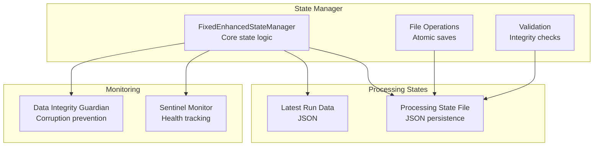
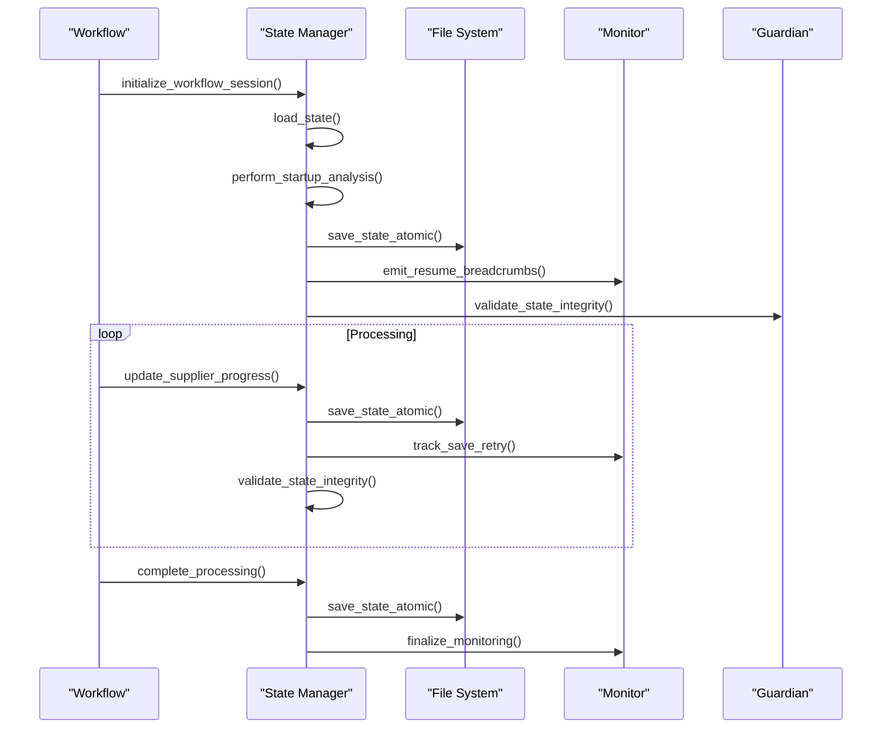
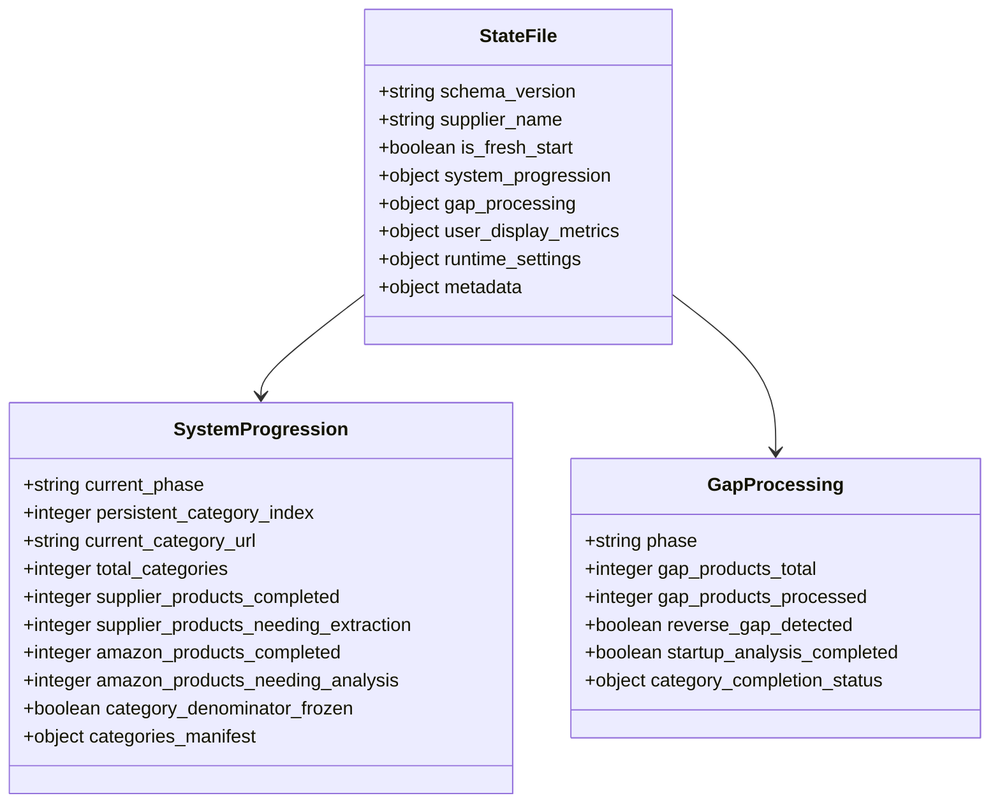
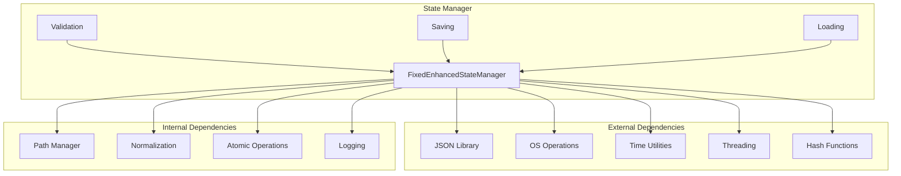

# State Manager

<cite>
**Referenced Files in This Document**
- [fixed_enhanced_state_manager.py](file://utils/fixed_enhanced_state_manager.py)
- [sentinel_monitor.py](file://utils/sentinel_monitor.py)
- [data_integrity_guardian.py](file://utils/data_integrity_guardian.py)
- [poundwholesale_co_uk_processing_state.json](file://processing_states/poundwholesale_co_uk_processing_state.json)
- [11strun.json](file://processing_states/latest/11strun.json)
</cite>

## Table of Contents
1. [Introduction](#introduction)
2. [Project Structure](#project-structure)
3. [Core Components](#core-components)
4. [Architecture Overview](#architecture-overview)
5. [Detailed Component Analysis](#detailed-component-analysis)
6. [Dependency Analysis](#dependency-analysis)
7. [Performance Considerations](#performance-considerations)
8. [Troubleshooting Guide](#troubleshooting-guide)
9. [Conclusion](#conclusion)

## Introduction
This document provides comprehensive technical documentation for the State Manager component, focusing on the fixed_enhanced_state_manager implementation. The State Manager is responsible for tracking processing progress, managing resumption points, and ensuring data integrity across system restarts. It integrates with the sentinel monitor for system health tracking and the data integrity guardian for corruption prevention. The documentation covers state persistence mechanisms, validation checks, recovery procedures, and the relationship with progress callbacks and real-time status updates.

## Project Structure
The State Manager resides in the utils directory and coordinates with processing state files located in processing_states. The sentinel monitor and data integrity guardian are separate utilities that complement the State Manager's capabilities.

**Diagram sources**
- [fixed_enhanced_state_manager.py](file://utils/fixed_enhanced_state_manager.py#L86-L238)
- [poundwholesale_co_uk_processing_state.json](file://processing_states/poundwholesale_co_uk_processing_state.json#L1-L50)
- [sentinel_monitor.py](file://utils/sentinel_monitor.py#L63-L201)
- [data_integrity_guardian.py](file://utils/data_integrity_guardian.py#L1-L6)

**Section sources**
- [fixed_enhanced_state_manager.py](file://utils/fixed_enhanced_state_manager.py#L1-L120)
- [poundwholesale_co_uk_processing_state.json](file://processing_states/poundwholesale_co_uk_processing_state.json#L1-L120)

## Core Components
The State Manager consists of several key components that work together to provide robust state management:

### FixedEnhancedStateManager
The core state manager class that handles all state-related operations including initialization, loading, saving, and validation. It maintains thread safety and provides atomic operations for state persistence.

### Sentinel Monitor
A monitoring utility that tracks suspicious state transitions and provides health indicators for the system. It monitors totals divergence, path variants, and linking map shrinkage.

### Data Integrity Guardian
A utility that ensures data integrity by validating state consistency and preventing corruption during resume calculations.

**Section sources**
- [fixed_enhanced_state_manager.py](file://utils/fixed_enhanced_state_manager.py#L86-L158)
- [sentinel_monitor.py](file://utils/sentinel_monitor.py#L63-L101)
- [data_integrity_guardian.py](file://utils/data_integrity_guardian.py#L1-L6)

## Architecture Overview
The State Manager follows a layered architecture with clear separation of concerns:

**Diagram sources**
- [fixed_enhanced_state_manager.py](file://utils/fixed_enhanced_state_manager.py#L247-L284)
- [fixed_enhanced_state_manager.py](file://utils/fixed_enhanced_state_manager.py#L1170-L1281)
- [sentinel_monitor.py](file://utils/sentinel_monitor.py#L180-L192)

## Detailed Component Analysis

### State Persistence Mechanisms
The State Manager implements comprehensive state persistence through atomic file operations:

#### Atomic Save Operations
The system uses multiple fallback mechanisms for atomic saves:
- Thread-safe atomic writer with file locking
- Legacy atomic operations with timeout handling
- WindowsSaveGuardian fallback for Windows environments
- Basic temp-then-replace fallback

#### State File Format
The processing state files follow a standardized JSON format with the following structure:

**Diagram sources**
- [fixed_enhanced_state_manager.py](file://utils/fixed_enhanced_state_manager.py#L159-L238)
- [poundwholesale_co_uk_processing_state.json](file://processing_states/poundwholesale_co_uk_processing_state.json#L1-L120)

**Section sources**
- [fixed_enhanced_state_manager.py](file://utils/fixed_enhanced_state_manager.py#L1170-L1311)
- [poundwholesale_co_uk_processing_state.json](file://processing_states/poundwholesale_co_uk_processing_state.json#L1-L200)

### Validation Checks and Recovery Procedures
The State Manager implements comprehensive validation and recovery mechanisms:

#### State Integrity Validation
The system performs multiple validation checks:
- Impossible index state detection
- Phase semantic consistency validation
- Resumption pointer validity checks
- Frozen totals consistency verification
- Legacy writer contamination detection

#### Corruption Recovery
Automatic recovery procedures include:
- Index clamping to valid ranges
- Phase contamination remediation
- Progress pointer restoration
- Schema version updates

**Section sources**
- [fixed_enhanced_state_manager.py](file://utils/fixed_enhanced_state_manager.py#L1864-L2085)
- [fixed_enhanced_state_manager.py](file://utils/fixed_enhanced_state_manager.py#L2086-L2249)

### Integration with Sentinel Monitor
The State Manager integrates with the sentinel monitor for system health tracking:

#### Monitoring Capabilities
- Totals divergence detection with threshold alerts
- Path variant tracking for resource consistency
- Linking map shrinkage monitoring
- Save retry tracking for diagnostics

#### Health Indicators
The monitor provides real-time health indicators through logging and metrics collection, helping identify potential issues before they escalate.

**Section sources**
- [sentinel_monitor.py](file://utils/sentinel_monitor.py#L79-L110)
- [sentinel_monitor.py](file://utils/sentinel_monitor.py#L134-L156)

### Data Integrity Guardian Integration
The Data Integrity Guardian provides mandatory startup reconciliation:

#### Startup Validation
- Ensures all resume calculations occur after integrity validation
- Prevents corrupted state from affecting downstream operations
- Provides critical data consistency guarantees

#### Corruption Prevention
- Validates state structure and content
- Prevents legacy writer contamination
- Ensures thread-safe state operations

**Section sources**
- [data_integrity_guardian.py](file://utils/data_integrity_guardian.py#L1-L6)

### Resumption Logic and Error Recovery
The State Manager implements sophisticated resumption logic:

#### Reverse Gap Detection
The system detects and handles reverse gaps where linking map counts exceed cache counts, determining appropriate resumption strategies.

#### Session Cursor Calculation
Uses manifest URLs and completion status to calculate optimal resumption points, ensuring efficient continuation of interrupted workflows.

#### Error Recovery Scenarios
- Index overflow protection with automatic clamping
- Phase transition validation and blocking
- Category index monotonicity enforcement
- Progress pointer synchronization

**Section sources**
- [fixed_enhanced_state_manager.py](file://utils/fixed_enhanced_state_manager.py#L469-L646)
- [fixed_enhanced_state_manager.py](file://utils/fixed_enhanced_state_manager.py#L3064-L3112)

### Progress Callbacks and Real-time Status Updates
The State Manager provides comprehensive progress tracking:

#### Progress Tracking Methods
- Supplier extraction progress updates
- Amazon analysis progress tracking
- Category completion monitoring
- Session-level product processing counts

#### Real-time Status Reporting
- Resume breadcrumbs for audit trails
- Progress indicators for user feedback
- Phase transition notifications
- Completion status updates

**Section sources**
- [fixed_enhanced_state_manager.py](file://utils/fixed_enhanced_state_manager.py#L1027-L1169)
- [fixed_enhanced_state_manager.py](file://utils/fixed_enhanced_state_manager.py#L1312-L1408)

## Dependency Analysis
The State Manager has well-defined dependencies and relationships:

**Diagram sources**
- [fixed_enhanced_state_manager.py](file://utils/fixed_enhanced_state_manager.py#L23-L72)
- [fixed_enhanced_state_manager.py](file://utils/fixed_enhanced_state_manager.py#L1170-L1281)

**Section sources**
- [fixed_enhanced_state_manager.py](file://utils/fixed_enhanced_state_manager.py#L23-L72)

## Performance Considerations
The State Manager is optimized for performance and reliability:

### Thread Safety
- Re-entrant locks prevent deadlocks during concurrent operations
- Atomic operations ensure data consistency
- Debounced saves reduce I/O overhead

### Memory Efficiency
- Lazy loading of state data
- Efficient JSON serialization/deserialization
- Minimal memory footprint during operations

### I/O Optimization
- Atomic file operations prevent partial writes
- Fallback mechanisms ensure operation continuity
- Efficient state merging reduces redundant operations

## Troubleshooting Guide

### Common State Issues
1. **Index Overflow**: Automatic clamping prevents negative or excessive values
2. **Phase Transition Errors**: Validation blocks unsafe phase changes
3. **Category Index Regression**: Monotonic enforcement prevents backward movement
4. **Resumption Point Corruption**: Validation and repair procedures restore integrity

### Diagnostic Tools
- State integrity validation reports detailed corruption patterns
- Resume breadcrumbs provide audit trail visibility
- Monitor logs track system health and performance
- Error recovery procedures automatically apply fixes

### Recovery Procedures
1. Run state integrity validation to identify issues
2. Apply automatic repairs where possible
3. Manually intervene for complex corruption cases
4. Verify system health through monitor diagnostics

**Section sources**
- [fixed_enhanced_state_manager.py](file://utils/fixed_enhanced_state_manager.py#L1864-L2085)
- [sentinel_monitor.py](file://utils/sentinel_monitor.py#L180-L192)

## Conclusion
The State Manager provides a robust, thread-safe solution for processing state management with comprehensive validation, recovery, and monitoring capabilities. Its integration with the sentinel monitor and data integrity guardian ensures system reliability and data consistency across restarts. The implementation demonstrates best practices in state persistence, error handling, and performance optimization while maintaining backward compatibility with existing workflows.