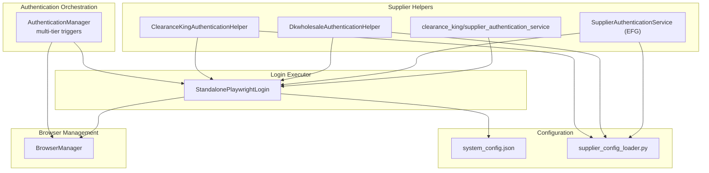
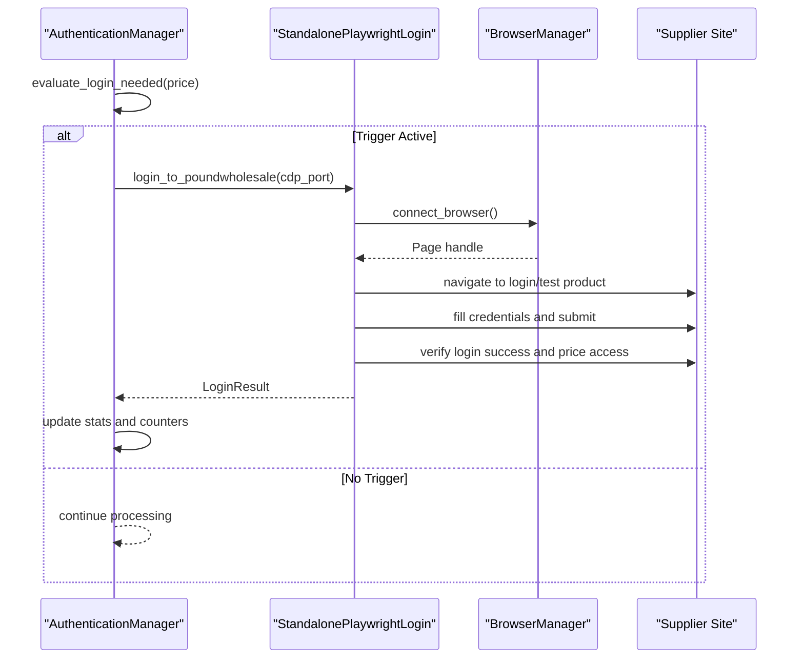
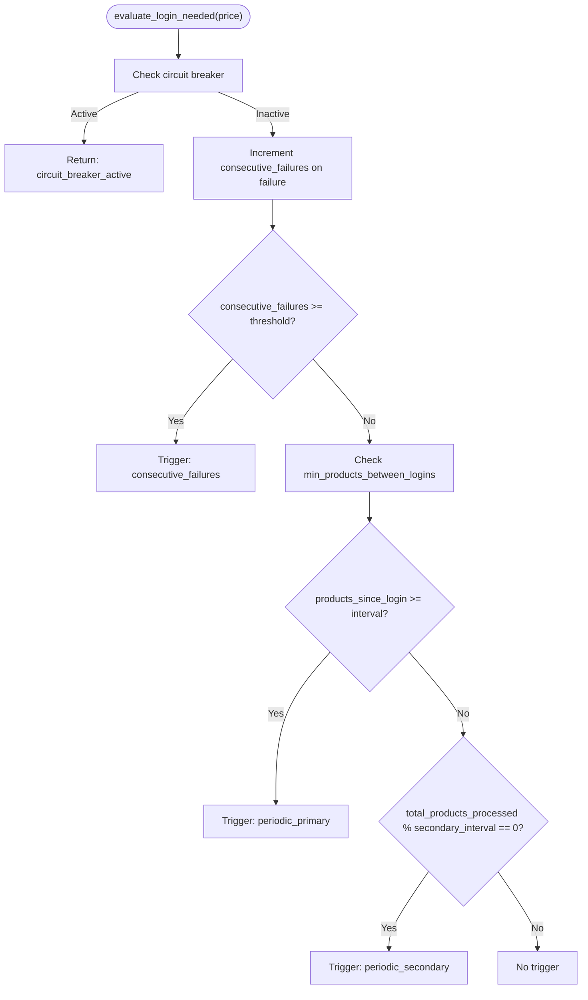
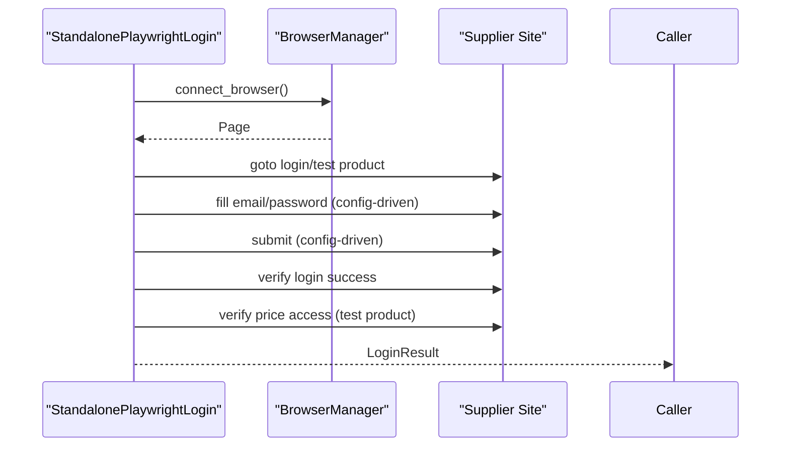
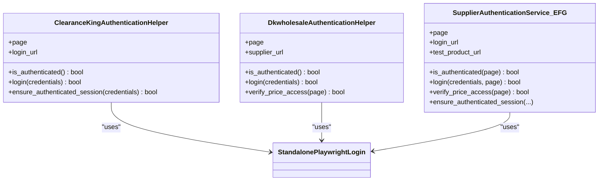
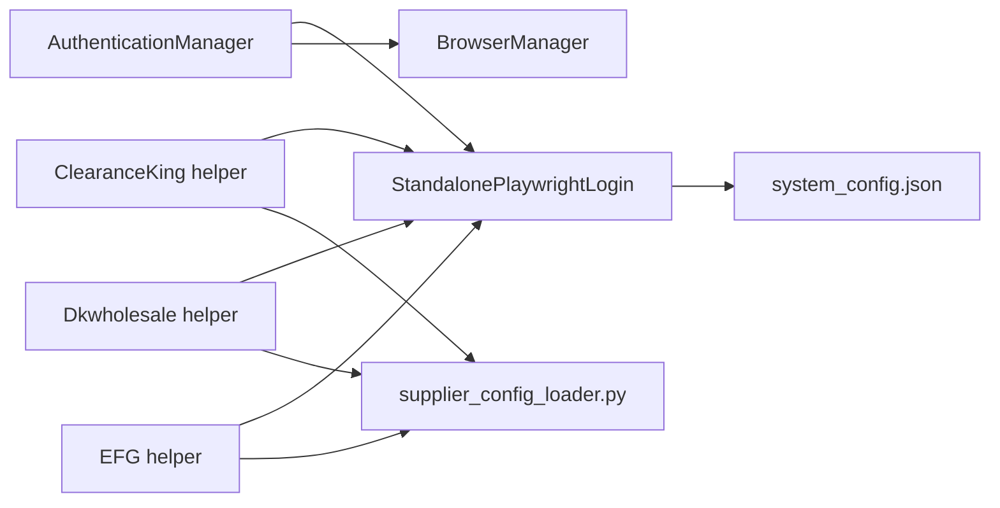

# Authentication Management

<cite>
**Referenced Files in This Document**
- [authentication_manager.py](file://tools/authentication_manager.py)
- [standalone_playwright_login.py](file://tools/standalone_playwright_login.py)
- [clearance_king_authentication_helper.py](file://tools/clearance_king_authentication_helper.py)
- [dkwholesale/supplier_authentication_service.py](file://tools/dkwholesale/supplier_authentication_service.py)
- [efghousewares/supplier_authentication_service.py](file://tools/efghousewares/supplier_authentication_service.py)
- [clearance_king/supplier_authentication_service.py](file://tools/clearance_king/supplier_authentication_service.py)
- [system_config.json](file://config/system_config.json)
- [supplier_config_loader.py](file://config/supplier_config_loader.py)
- [browser_manager.py](file://utils/browser_manager.py)
- [test_authentication_manager.py](file://tests/unit/test_authentication_manager.py)
</cite>

## Table of Contents
1. [Introduction](#introduction)
2. [Project Structure](#project-structure)
3. [Core Components](#core-components)
4. [Architecture Overview](#architecture-overview)
5. [Detailed Component Analysis](#detailed-component-analysis)
6. [Dependency Analysis](#dependency-analysis)
7. [Performance Considerations](#performance-considerations)
8. [Troubleshooting Guide](#troubleshooting-guide)
9. [Conclusion](#conclusion)

## Introduction
This document describes the Authentication Management system for the Amazon FBA Agent System. It explains the multi-tier authentication integration, supplier-specific authentication services, proactive authentication checking mechanisms, and the callback-free login verification workflow. It documents how authentication state is tracked and persisted across long-running supplier scraping sessions, how browser automation and session management integrate with authentication, and outlines security considerations, credential storage, and troubleshooting strategies for authentication failures.

## Project Structure
The Authentication Management system spans several modules:
- Central authentication orchestration and trigger logic
- Supplier-specific authentication helpers
- Standalone login executor for robust authentication
- Configuration-driven selectors and credentials
- Browser lifecycle and session management
- Unit tests validating authentication behavior

**Diagram sources**
- [authentication_manager.py](file://tools/authentication_manager.py#L48-L330)
- [standalone_playwright_login.py](file://tools/standalone_playwright_login.py#L33-L653)
- [clearance_king_authentication_helper.py](file://tools/clearance_king_authentication_helper.py#L25-L233)
- [dkwholesale/supplier_authentication_service.py](file://tools/dkwholesale/supplier_authentication_service.py#L13-L246)
- [efghousewares/supplier_authentication_service.py](file://tools/efghousewares/supplier_authentication_service.py#L20-L258)
- [clearance_king/supplier_authentication_service.py](file://tools/clearance_king/supplier_authentication_service.py#L25-L233)
- [system_config.json](file://config/system_config.json#L362-L377)
- [supplier_config_loader.py](file://config/supplier_config_loader.py#L23-L187)
- [browser_manager.py](file://utils/browser_manager.py#L35-L800)

**Section sources**
- [authentication_manager.py](file://tools/authentication_manager.py#L1-L330)
- [standalone_playwright_login.py](file://tools/standalone_playwright_login.py#L1-L653)
- [system_config.json](file://config/system_config.json#L1-L384)

## Core Components
- AuthenticationManager: Implements multi-tier triggers (startup, consecutive failures, periodic, and adaptive thresholds), maintains statistics, and coordinates login execution via a standalone login executor.
- SupplierAuthenticationService helpers: Provide supplier-specific authentication checks, login flows, and price verification to ensure sessions are not only logged in but also able to access wholesale prices.
- StandalonePlaywrightLogin: Executes robust login flows using Playwright, verifies login success and price access, and supports config-driven selectors and test product URLs.
- BrowserManager: Centralizes browser lifecycle, connection to an existing Chrome instance, and page caching to support long-running supplier sessions.
- Configuration: system_config.json defines authentication thresholds and circuit breaker behavior; supplier_config_loader.py resolves domain-specific selectors and credentials.

Key responsibilities:
- Proactive authentication checks: periodic triggers at configurable intervals.
- Reactive authentication checks: triggered by consecutive price extraction failures.
- Adaptive thresholds: minimum product gap between logins to reduce redundant logins.
- Circuit breaker: protects against repeated authentication failures by temporarily disabling triggers.
- Price verification: mandatory confirmation that logged-in sessions can access wholesale prices.

**Section sources**
- [authentication_manager.py](file://tools/authentication_manager.py#L48-L330)
- [standalone_playwright_login.py](file://tools/standalone_playwright_login.py#L33-L653)
- [browser_manager.py](file://utils/browser_manager.py#L35-L800)
- [system_config.json](file://config/system_config.json#L362-L377)

## Architecture Overview
The authentication system orchestrates login decisions and executes them through a dedicated login executor. Supplier-specific helpers encapsulate site-specific selectors and flows, while configuration modules supply selectors and credentials. BrowserManager provides a persistent Chrome connection and page reuse.

**Diagram sources**
- [authentication_manager.py](file://tools/authentication_manager.py#L97-L221)
- [standalone_playwright_login.py](file://tools/standalone_playwright_login.py#L543-L594)
- [browser_manager.py](file://utils/browser_manager.py#L77-L140)

## Detailed Component Analysis

### AuthenticationManager: Multi-tier Triggers and Circuit Breaker
AuthenticationManager evaluates whether authentication is needed using:
- Consecutive failure detection: increments a counter on failed price extractions and triggers when threshold is met.
- Periodic triggers: primary and secondary intervals to periodically re-authenticate.
- Minimum product gap: avoids redundant logins within a configurable threshold.
- Circuit breaker: disables triggers after repeated failures until cooldown elapses.

It tracks comprehensive statistics (total attempts, successful/failed logins, trigger breakdowns) and exposes a session summary for monitoring.

**Diagram sources**
- [authentication_manager.py](file://tools/authentication_manager.py#L97-L144)

**Section sources**
- [authentication_manager.py](file://tools/authentication_manager.py#L48-L330)
- [test_authentication_manager.py](file://tests/unit/test_authentication_manager.py#L126-L215)

### StandalonePlaywrightLogin: Robust Login Execution
StandalonePlaywrightLogin connects to an existing Chrome instance via CDP, performs login using config-driven selectors, and verifies both login success and price access. It supports:
- Config-driven login/selectors via system_config.json and supplier configs.
- Price verification using a test product URL to confirm active wholesale access.
- Fallbacks for selectors and submission methods.
- Reuse of an existing page to avoid unnecessary CDP connections.

**Diagram sources**
- [standalone_playwright_login.py](file://tools/standalone_playwright_login.py#L98-L594)
- [browser_manager.py](file://utils/browser_manager.py#L77-L140)

**Section sources**
- [standalone_playwright_login.py](file://tools/standalone_playwright_login.py#L33-L653)
- [system_config.json](file://config/system_config.json#L362-L377)

### Supplier-Specific Authentication Services
Supplier helpers encapsulate site-specific selectors and flows. They implement:
- Authentication checks using explicit indicators and price verification.
- Login flows tailored to each supplier’s form structure.
- Optional credential resolution from configuration loaders.

Examples:
- Clearance King helper: uses explicit account/logout indicators and price verification via a test product URL resolved from supplier config.
- Dkwholesale helper: enforces price verification to avoid stale cookie false positives and includes detailed screenshots on failure.
- EFG Housewares helper: robust login with multiple selectors, price verification via a known product URL, and extensive logging.

**Diagram sources**
- [clearance_king_authentication_helper.py](file://tools/clearance_king_authentication_helper.py#L25-L233)
- [dkwholesale/supplier_authentication_service.py](file://tools/dkwholesale/supplier_authentication_service.py#L13-L246)
- [efghousewares/supplier_authentication_service.py](file://tools/efghousewares/supplier_authentication_service.py#L20-L258)
- [standalone_playwright_login.py](file://tools/standalone_playwright_login.py#L33-L653)

**Section sources**
- [clearance_king_authentication_helper.py](file://tools/clearance_king_authentication_helper.py#L25-L233)
- [dkwholesale/supplier_authentication_service.py](file://tools/dkwholesale/supplier_authentication_service.py#L13-L246)
- [efghousewares/supplier_authentication_service.py](file://tools/efghousewares/supplier_authentication_service.py#L20-L258)

### Configuration-Driven Selectors and Credentials
- system_config.json defines:
  - Authentication thresholds and intervals.
  - Circuit breaker parameters.
  - Supplier workflows with test product URLs and authentication requirements.
- supplier_config_loader.py:
  - Loads domain-specific selector configurations.
  - Normalizes domains and extracts credentials for authentication helpers.

These configurations enable robust, extensible authentication flows without hardcoding selectors per supplier.

**Section sources**
- [system_config.json](file://config/system_config.json#L362-L377)
- [supplier_config_loader.py](file://config/supplier_config_loader.py#L23-L187)

### Browser Automation and Session Management
- BrowserManager connects to an existing Chrome instance via CDP, manages a persistent context and page reuse, and provides health checks and restart capabilities.
- Integration with AuthenticationManager:
  - AuthenticationManager invokes a login executor that connects to the shared browser instance.
  - Page reuse reduces overhead and improves reliability for long-running supplier sessions.

**Section sources**
- [browser_manager.py](file://utils/browser_manager.py#L35-L800)
- [authentication_manager.py](file://tools/authentication_manager.py#L146-L221)

## Dependency Analysis
AuthenticationManager depends on:
- StandalonePlaywrightLogin for executing login flows.
- BrowserManager for connecting to Chrome and managing pages.
- system_config.json for thresholds, intervals, and circuit breaker settings.
- Supplier-specific helpers for site-specific checks and flows.

**Diagram sources**
- [authentication_manager.py](file://tools/authentication_manager.py#L48-L330)
- [standalone_playwright_login.py](file://tools/standalone_playwright_login.py#L33-L653)
- [browser_manager.py](file://utils/browser_manager.py#L35-L800)
- [system_config.json](file://config/system_config.json#L362-L377)
- [supplier_config_loader.py](file://config/supplier_config_loader.py#L23-L187)

**Section sources**
- [authentication_manager.py](file://tools/authentication_manager.py#L48-L330)
- [standalone_playwright_login.py](file://tools/standalone_playwright_login.py#L33-L653)
- [browser_manager.py](file://utils/browser_manager.py#L35-L800)
- [system_config.json](file://config/system_config.json#L362-L377)
- [supplier_config_loader.py](file://config/supplier_config_loader.py#L23-L187)

## Performance Considerations
- Minimize redundant logins: the minimum product gap prevents frequent re-authentication.
- Use page reuse: BrowserManager caches pages to reduce navigation overhead.
- Config-driven selectors: reduce brittle selectors and improve resilience across site updates.
- Circuit breaker: prevents cascading failures by pausing triggers after repeated login failures.
- Price verification: avoids costly operations on stale sessions by confirming access to wholesale prices.

[No sources needed since this section provides general guidance]

## Troubleshooting Guide
Common issues and resolutions:
- Chrome debug port not accessible: ensure Chrome is launched with the correct debug flags and user data directory; verify the port is free and reachable.
- Login forms not found: rely on config-driven selectors; verify supplier config contains correct selectors and test product URLs.
- Stale sessions: ensure price verification passes; supplier helpers enforce price access to avoid false-positive authenticated states.
- Frequent authentication failures: check circuit breaker activation and cooldown; adjust thresholds and intervals in system_config.json.
- Supplier-specific selectors failing: use supplier_config_loader to load domain-specific selectors; validate selector correctness and update as needed.

Operational tips:
- Enable detailed logging to trace authentication decisions and outcomes.
- Use session summaries to monitor success rates and trigger breakdowns.
- Save screenshots on login failures for post-mortem analysis.

**Section sources**
- [browser_manager.py](file://utils/browser_manager.py#L302-L315)
- [standalone_playwright_login.py](file://tools/standalone_playwright_login.py#L543-L594)
- [clearance_king_authentication_helper.py](file://tools/clearance_king_authentication_helper.py#L188-L233)
- [dkwholesale/supplier_authentication_service.py](file://tools/dkwholesale/supplier_authentication_service.py#L156-L246)
- [efghousewares/supplier_authentication_service.py](file://tools/efghousewares/supplier_authentication_service.py#L211-L258)
- [system_config.json](file://config/system_config.json#L362-L377)

## Conclusion
The Authentication Management system combines multi-tier triggers, supplier-specific helpers, and a robust login executor to maintain reliable, long-running supplier sessions. It emphasizes proactive and reactive authentication checks, adaptive thresholds, circuit breakers, and mandatory price verification to ensure sessions are both authenticated and capable of accessing wholesale prices. Configuration-driven selectors and credentials, integrated browser management, and comprehensive logging and statistics provide a secure, observable, and maintainable authentication framework.