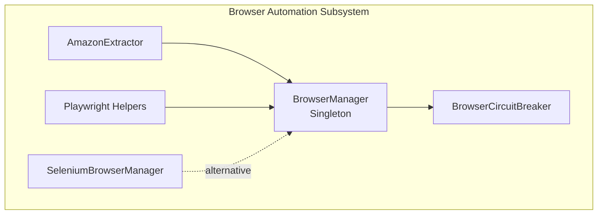
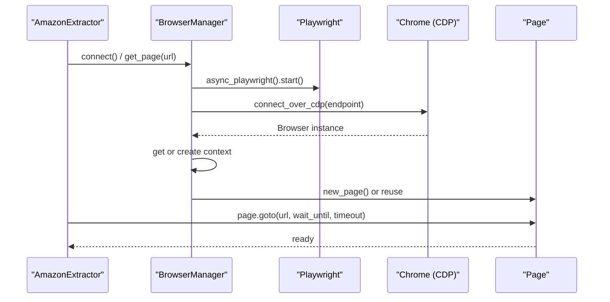
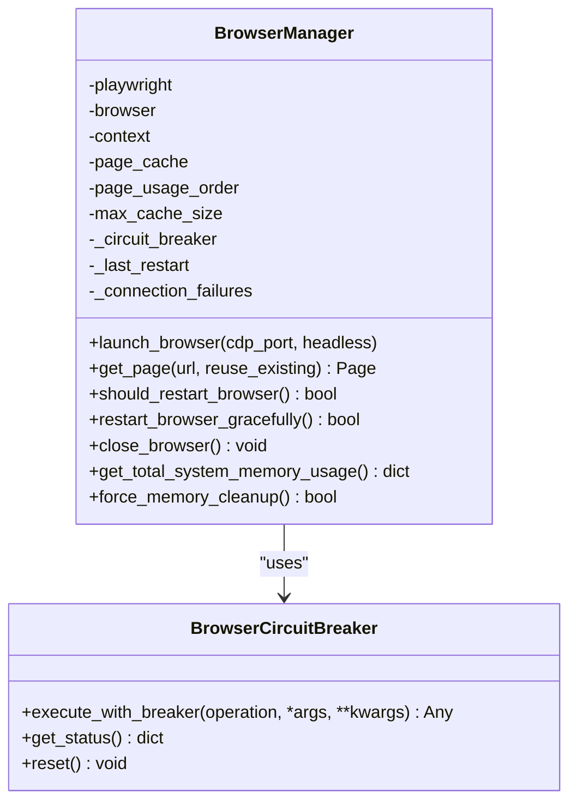
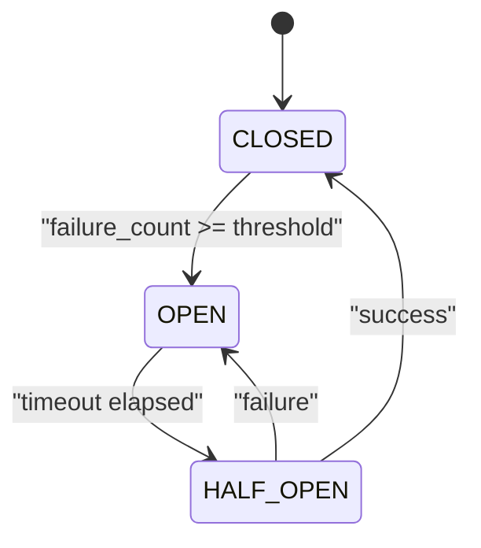
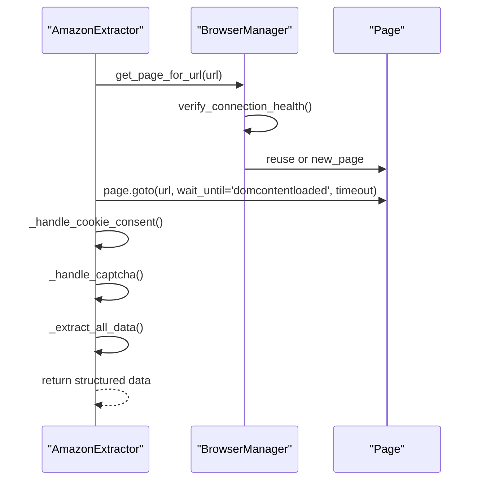
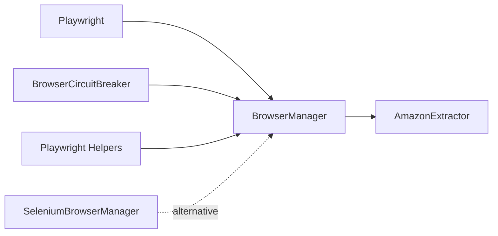

# Browser Automation

<cite>
**Referenced Files in This Document**
- [browser_manager.py](file://utils/browser_manager.py)
- [browser_circuit_breaker.py](file://utils/browser_circuit_breaker.py)
- [amazon_playwright_extractor.py](file://tools/amazon_playwright_extractor.py)
- [playwright_helpers.py](file://tools/legacy_utils/playwright_helpers.py)
- [selenium_browser_manager.py](file://tools/selenium_browser_manager.py)
- [TROUBLESHOOTING.md](file://docs/TROUBLESHOOTING.md)
- [Browser Manager.md](file://wiki-dec-3/3. Core Architecture/3.3. Browser Manager.md)
</cite>

## Table of Contents
1. [Introduction](#introduction)
2. [Project Structure](#project-structure)
3. [Core Components](#core-components)
4. [Architecture Overview](#architecture-overview)
5. [Detailed Component Analysis](#detailed-component-analysis)
6. [Dependency Analysis](#dependency-analysis)
7. [Performance Considerations](#performance-considerations)
8. [Troubleshooting Guide](#troubleshooting-guide)
9. [Conclusion](#conclusion)

## Introduction
This document explains the Browser Automation subsystem powering the Supplier Scraper. It focuses on the Playwright integration, Chrome Debugging Protocol (CDP) connectivity, and centralized browser management via the BrowserManager singleton. It covers browser lifecycle management, context creation with realistic user agents and viewport settings, anti-bot evasion techniques, concrete examples of browser initialization and page navigation with timeout handling, memory management strategies, integration with shared Chrome instances, circuit breaker protection, and rate limiting mechanisms. It also addresses common browser automation issues, debugging approaches, and performance optimization techniques.

## Project Structure
The Browser Automation subsystem is primarily implemented in the utils package and integrated across tools and scrapers:
- Centralized browser management and CDP connectivity: utils/browser_manager.py
- Circuit breaker for resilience: utils/browser_circuit_breaker.py
- Amazon extraction tool leveraging BrowserManager: tools/amazon_playwright_extractor.py
- Legacy helpers for Playwright contexts and CDP: tools/legacy_utils/playwright_helpers.py
- Alternative Selenium-based manager: tools/selenium_browser_manager.py
- Troubleshooting and operational guidance: docs/TROUBLESHOOTING.md
- Architecture diagrams and design notes: wiki-dec-3/3. Core Architecture/3.3. Browser Manager.md

**Diagram sources**
- [browser_manager.py](file://utils/browser_manager.py#L35-L120)
- [browser_circuit_breaker.py](file://utils/browser_circuit_breaker.py#L37-L100)
- [amazon_playwright_extractor.py](file://tools/amazon_playwright_extractor.py#L63-L122)
- [playwright_helpers.py](file://tools/legacy_utils/playwright_helpers.py#L44-L98)
- [selenium_browser_manager.py](file://tools/selenium_browser_manager.py#L17-L78)

**Section sources**
- [browser_manager.py](file://utils/browser_manager.py#L1-L120)
- [browser_circuit_breaker.py](file://utils/browser_circuit_breaker.py#L1-L80)
- [amazon_playwright_extractor.py](file://tools/amazon_playwright_extractor.py#L1-L120)
- [playwright_helpers.py](file://tools/legacy_utils/playwright_helpers.py#L1-L60)
- [selenium_browser_manager.py](file://tools/selenium_browser_manager.py#L1-L40)
- [TROUBLESHOOTING.md](file://docs/TROUBLESHOOTING.md#L111-L145)
- [Browser Manager.md](file://wiki-dec-3/3. Core Architecture/3.3. Browser Manager.md#L168-L187)

## Core Components
- BrowserManager singleton: Centralizes Chrome instance management, CDP connectivity, page caching, health checks, and restart policies. It connects to an existing Chrome debug instance and maintains a persistent context.
- BrowserCircuitBreaker: Implements circuit breaker pattern to protect operations from cascading failures during marathon sessions.
- AmazonExtractor: Uses BrowserManager to obtain pages, performs navigation with timeouts, handles cookie consent and CAPTCHA, and extracts product data.
- Playwright Helpers: Provides standardized async browser/context/page creation and CDP connection utilities.
- SeleniumBrowserManager: Alternative manager using Selenium/undetected-chromedriver for environments where Playwright/CDC is not feasible.

**Section sources**
- [browser_manager.py](file://utils/browser_manager.py#L35-L120)
- [browser_circuit_breaker.py](file://utils/browser_circuit_breaker.py#L37-L100)
- [amazon_playwright_extractor.py](file://tools/amazon_playwright_extractor.py#L63-L122)
- [playwright_helpers.py](file://tools/legacy_utils/playwright_helpers.py#L44-L98)
- [selenium_browser_manager.py](file://tools/selenium_browser_manager.py#L17-L78)

## Architecture Overview
The system integrates Playwright with an existing Chrome instance via CDP. The BrowserManager singleton ensures a single persistent browser and context, enabling shared state across tools. Navigation is protected by the circuit breaker, and memory management proactively cleans up resources to prevent leaks during long-running sessions.

**Diagram sources**
- [browser_manager.py](file://utils/browser_manager.py#L77-L140)
- [amazon_playwright_extractor.py](file://tools/amazon_playwright_extractor.py#L97-L122)

**Section sources**
- [browser_manager.py](file://utils/browser_manager.py#L77-L140)
- [amazon_playwright_extractor.py](file://tools/amazon_playwright_extractor.py#L97-L122)

## Detailed Component Analysis

### BrowserManager Singleton
Responsibilities:
- Launch/connect to Chrome via CDP, preferring an existing persistent instance.
- Manage a page cache with LRU eviction.
- Health checks, memory monitoring, and periodic restarts.
- Graceful restarts and cleanup to preserve session continuity.

Key behaviors:
- CDP endpoint selection supports IPv6/IPv4 for compatibility with Chrome 139+.
- Reuses existing context/pages to minimize overhead.
- Integrates a circuit breaker for navigation operations.
- Proactive memory cleanup and system memory monitoring.

**Diagram sources**
- [browser_manager.py](file://utils/browser_manager.py#L35-L120)
- [browser_circuit_breaker.py](file://utils/browser_circuit_breaker.py#L37-L100)

**Section sources**
- [browser_manager.py](file://utils/browser_manager.py#L35-L120)
- [browser_manager.py](file://utils/browser_manager.py#L77-L140)
- [browser_manager.py](file://utils/browser_manager.py#L848-L938)
- [browser_manager.py](file://utils/browser_manager.py#L979-L1069)

### BrowserCircuitBreaker
The circuit breaker protects operations from repeated failures by transitioning through CLOSED, OPEN, and HALF_OPEN states. It records failures, enforces timeouts, and enables gradual recovery.

**Diagram sources**
- [browser_circuit_breaker.py](file://utils/browser_circuit_breaker.py#L37-L100)

**Section sources**
- [browser_circuit_breaker.py](file://utils/browser_circuit_breaker.py#L37-L100)
- [browser_circuit_breaker.py](file://utils/browser_circuit_breaker.py#L112-L173)

### AmazonExtractor Integration
AmazonExtractor coordinates with BrowserManager to obtain pages, navigate to product URLs, and extract data. It sets up background mode to avoid browser focus, handles cookie consent and CAPTCHA, and applies timeouts and retries.

**Diagram sources**
- [amazon_playwright_extractor.py](file://tools/amazon_playwright_extractor.py#L317-L466)
- [browser_manager.py](file://utils/browser_manager.py#L141-L198)

**Section sources**
- [amazon_playwright_extractor.py](file://tools/amazon_playwright_extractor.py#L63-L122)
- [amazon_playwright_extractor.py](file://tools/amazon_playwright_extractor.py#L317-L466)
- [browser_manager.py](file://utils/browser_manager.py#L141-L198)

### Playwright Helpers and CDP Utilities
Legacy helpers demonstrate standardized patterns for launching browsers, creating contexts, and connecting to Chrome debug ports. These patterns inform the BrowserManager’s CDP integration and context creation.

**Section sources**
- [playwright_helpers.py](file://tools/legacy_utils/playwright_helpers.py#L44-L98)
- [playwright_helpers.py](file://tools/legacy_utils/playwright_helpers.py#L157-L182)

### Selenium-Based Alternative
SeleniumBrowserManager offers an alternative approach using undetected-chromedriver with stealth settings, headless options, and anti-detection measures. While not used by BrowserManager, it complements the ecosystem for environments requiring Selenium.

**Section sources**
- [selenium_browser_manager.py](file://tools/selenium_browser_manager.py#L17-L78)

## Dependency Analysis
- BrowserManager depends on Playwright for CDP connectivity and on BrowserCircuitBreaker for operation protection.
- AmazonExtractor depends on BrowserManager for page provisioning and on the circuit breaker for navigation safety.
- Playwright Helpers provide reusable patterns for context and CDP connection.
- SeleniumBrowserManager is decoupled and serves as an alternate path.

**Diagram sources**
- [browser_manager.py](file://utils/browser_manager.py#L19-L25)
- [browser_circuit_breaker.py](file://utils/browser_circuit_breaker.py#L25-L32)
- [amazon_playwright_extractor.py](file://tools/amazon_playwright_extractor.py#L21-L30)
- [playwright_helpers.py](file://tools/legacy_utils/playwright_helpers.py#L13-L18)
- [selenium_browser_manager.py](file://tools/selenium_browser_manager.py#L15-L16)

**Section sources**
- [browser_manager.py](file://utils/browser_manager.py#L19-L25)
- [browser_circuit_breaker.py](file://utils/browser_circuit_breaker.py#L25-L32)
- [amazon_playwright_extractor.py](file://tools/amazon_playwright_extractor.py#L21-L30)
- [playwright_helpers.py](file://tools/legacy_utils/playwright_helpers.py#L13-L18)
- [selenium_browser_manager.py](file://tools/selenium_browser_manager.py#L15-L16)

## Performance Considerations
- CDP Endpoint Selection: Dual-stack IPv6/IPv4 detection ensures compatibility with modern Chrome versions.
- Page Caching: LRU cache limits and eviction prevent memory growth during long runs.
- Background Mode: Anti-focus strategies reduce UI interference and resource contention.
- Time-Based Restarts: Scheduled restarts mitigate CDP connection degradation.
- Memory Monitoring: System-wide memory checks trigger cleanup proactively.

**Section sources**
- [browser_manager.py](file://utils/browser_manager.py#L273-L301)
- [browser_manager.py](file://utils/browser_manager.py#L200-L208)
- [browser_manager.py](file://utils/browser_manager.py#L22-L23)
- [browser_manager.py](file://utils/browser_manager.py#L885-L938)
- [browser_manager.py](file://utils/browser_manager.py#L940-L978)

## Troubleshooting Guide
Common issues and resolutions:
- Chrome Debug Port Connectivity: Ensure Chrome is launched with the correct debug flags and port. Use IPv6/IPv4 endpoint detection and verify accessibility.
- Circuit Breaker Activation: When operations fail repeatedly, the circuit breaker opens and recovers after a timeout. Monitor logs and allow recovery.
- Memory Pressure and Browser Crashes: Use time-based restarts and proactive cleanup. Monitor Chrome and Python memory usage.
- Authentication Failures: Maintain persistent sessions and re-authenticate when logout is detected.

Operational commands and checks:
- Manual restart of the browser via BrowserManager.
- Inspect circuit breaker status and recovery timers.
- Verify Chrome process and port availability.

**Section sources**
- [browser_manager.py](file://utils/browser_manager.py#L242-L272)
- [browser_manager.py](file://utils/browser_manager.py#L302-L315)
- [browser_manager.py](file://utils/browser_manager.py#L555-L565)
- [browser_manager.py](file://utils/browser_manager.py#L623-L657)
- [TROUBLESHOOTING.md](file://docs/TROUBLESHOOTING.md#L111-L145)

## Conclusion
The Browser Automation subsystem centers on a robust BrowserManager singleton that connects to a persistent Chrome instance via CDP, manages pages efficiently, and safeguards operations with a circuit breaker. Anti-bot evasion and memory management strategies enable long-running, reliable scraping. The integration with AmazonExtractor demonstrates practical navigation, timeout handling, and data extraction patterns. Operational guidance and troubleshooting procedures support continuous, resilient automation.