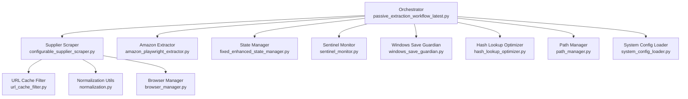
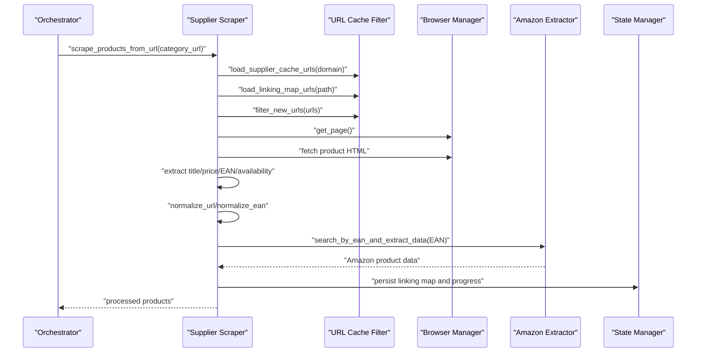
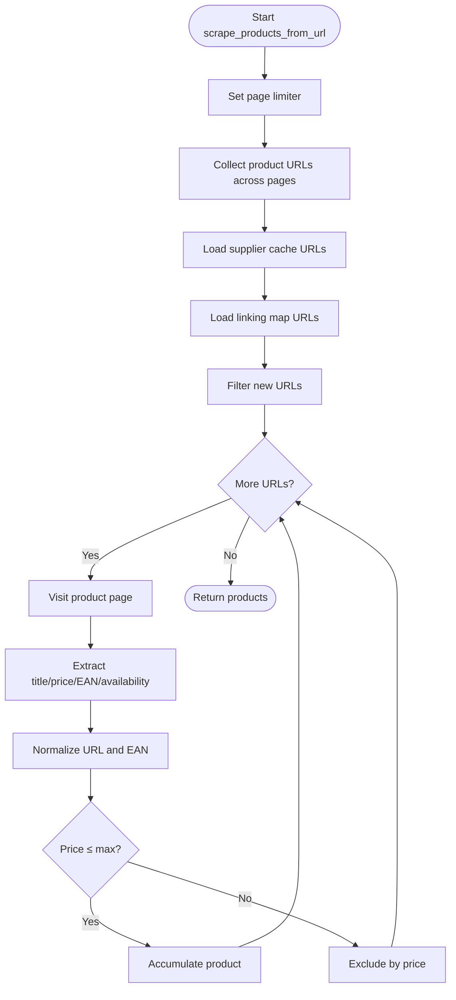
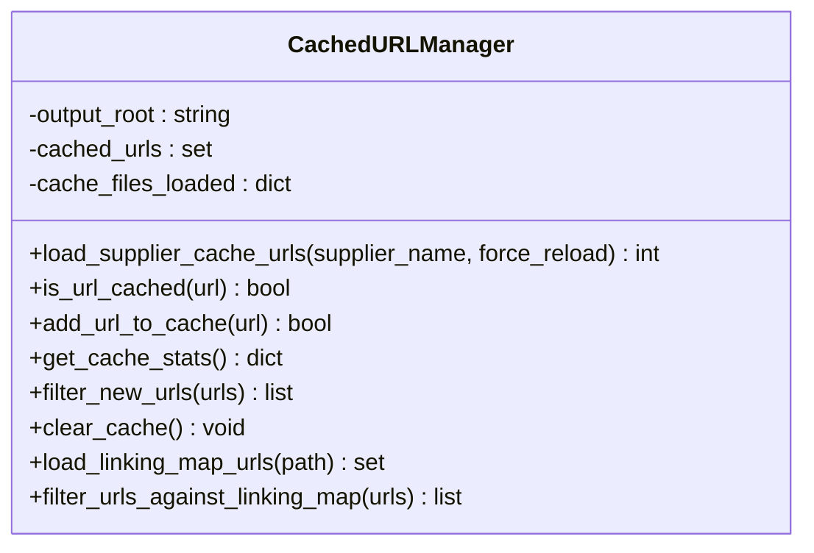
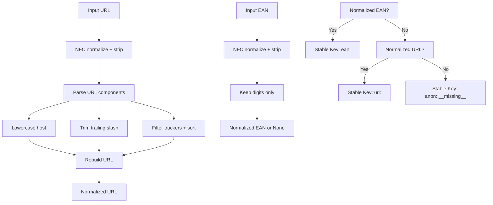
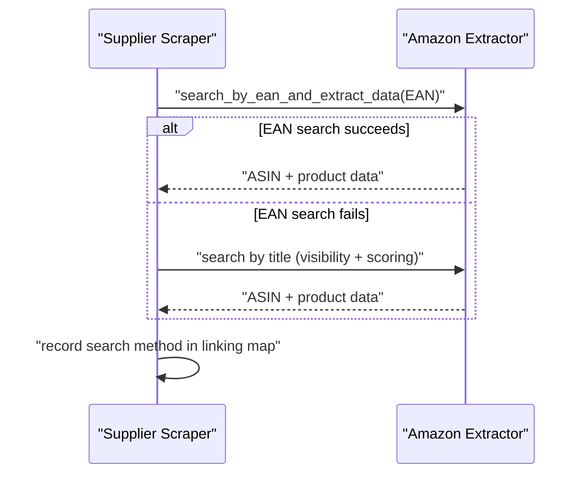
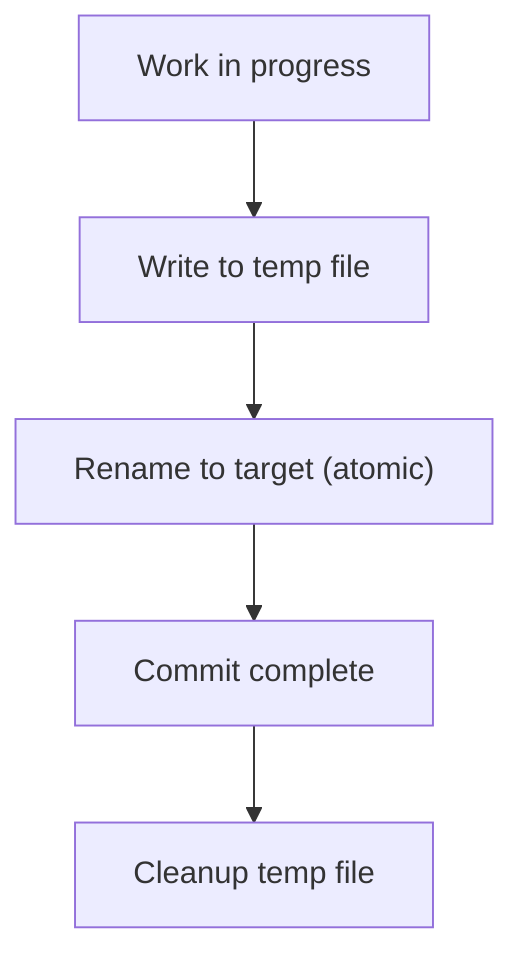
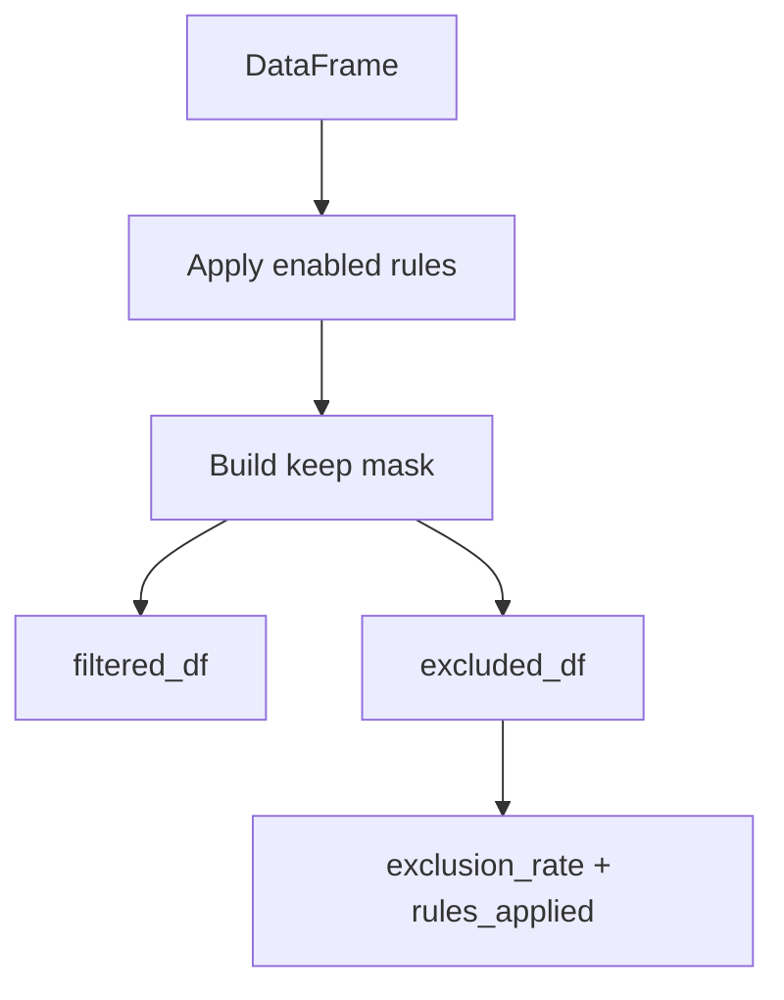
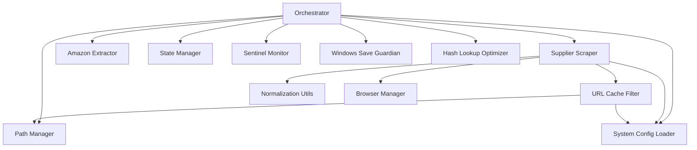

# Data Processing Pipeline

<cite>
**Referenced Files in This Document**
- [passive_extraction_workflow_latest.py](file://tools/passive_extraction_workflow_latest.py)
- [configurable_supplier_scraper.py](file://tools/configurable_supplier_scraper.py)
- [url_cache_filter.py](file://utils/url_cache_filter.py)
- [normalization.py](file://utils/normalization.py)
- [prefilter.py](file://src/fba_agent/prefilter.py)
- [cache_manager.py](file://tools/cache_manager.py)
- [amazon_playwright_extractor.py](file://tools/amazon_playwright_extractor.py)
- [fixed_enhanced_state_manager.py](file://utils/fixed_enhanced_state_manager.py)
- [sentinel_monitor.py](file://utils/sentinel_monitor.py)
- [windows_save_guardian.py](file://utils/windows_save_guardian.py)
- [hash_lookup_optimizer.py](file://utils/hash_lookup_optimizer.py)
- [browser_manager.py](file://utils/browser_manager.py)
- [path_manager.py](file://utils/path_manager.py)
- [system_config_loader.py](file://config/system_config_loader.py)
</cite>

## Table of Contents
1. [Introduction](#introduction)
2. [Project Structure](#project-structure)
3. [Core Components](#core-components)
4. [Architecture Overview](#architecture-overview)
5. [Detailed Component Analysis](#detailed-component-analysis)
6. [Dependency Analysis](#dependency-analysis)
7. [Performance Considerations](#performance-considerations)
8. [Troubleshooting Guide](#troubleshooting-guide)
9. [Conclusion](#conclusion)

## Introduction
This document explains the Data Processing Pipeline within the Supplier Scraper, focusing on how raw supplier product data is extracted, normalized, filtered, and transformed into structured product records for downstream financial analysis. It covers:
- Product data extraction workflow from supplier category pages and product pages
- URL filtering and caching strategies to avoid redundant scraping
- Data normalization techniques for URLs, EANs, and stable keys
- Duplicate elimination and linking map processing
- Integration with URL cache filtering, memory management, and state persistence
- Data quality validation, error handling, and performance considerations for large-scale scraping

## Project Structure
The pipeline spans several modules:
- Orchestrator: tools/passive_extraction_workflow_latest.py coordinates scraping, matching, caching, and reporting
- Supplier scraper: tools/configurable_supplier_scraper.py extracts product metadata from supplier sites
- Amazon extractor: tools/amazon_playwright_extractor.py retrieves Amazon product data
- Utilities: utils/url_cache_filter.py, utils/normalization.py, utils/fixed_enhanced_state_manager.py, utils/sentinel_monitor.py, utils/windows_save_guardian.py, utils/hash_lookup_optimizer.py
- Financial analysis: tools/FBA_Financial_calculator_* integrates with the linking map
- Configuration: config/system_config_loader.py supplies runtime parameters

**Diagram sources**
- [passive_extraction_workflow_latest.py](file://tools/passive_extraction_workflow_latest.py#L1-L120)
- [configurable_supplier_scraper.py](file://tools/configurable_supplier_scraper.py#L1-L120)
- [url_cache_filter.py](file://utils/url_cache_filter.py#L1-L60)
- [normalization.py](file://utils/normalization.py#L1-L31)
- [fixed_enhanced_state_manager.py](file://utils/fixed_enhanced_state_manager.py#L1-L60)
- [sentinel_monitor.py](file://utils/sentinel_monitor.py#L1-L60)
- [windows_save_guardian.py](file://utils/windows_save_guardian.py#L1-L60)
- [hash_lookup_optimizer.py](file://utils/hash_lookup_optimizer.py#L1-L60)
- [browser_manager.py](file://utils/browser_manager.py#L1-L60)
- [path_manager.py](file://utils/path_manager.py#L1-L60)
- [system_config_loader.py](file://config/system_config_loader.py#L1-L60)

**Section sources**
- [passive_extraction_workflow_latest.py](file://tools/passive_extraction_workflow_latest.py#L1-L120)
- [configurable_supplier_scraper.py](file://tools/configurable_supplier_scraper.py#L1-L120)

## Core Components
- Supplier Scraper: Extracts product metadata (title, price, EAN, availability) from supplier category and product pages using Playwright, applies price filtering, and integrates URL pre-filtering to skip previously processed items.
- URL Cache Filter: Loads existing supplier product caches and linking maps to quickly determine which URLs still need processing, using in-memory sets for O(1) lookups.
- Normalization Utilities: Normalize URLs (case, scheme, host, path, query params excluding trackers), normalize EANs (digits only), and compute stable keys combining EAN-first and URL fallback.
- State Manager: Tracks progress, resumes interrupted runs, and persists linking map and indices atomically.
- Sentinel Monitor: Proactively monitors system health and thresholds during long runs.
- Windows Save Guardian: Ensures atomic writes for critical state files.
- Hash Lookup Optimizer: Provides O(1) hash-based lookups to accelerate matching and de-duplication.
- Amazon Extractor: Implements EAN-first search with visibility-based sponsored ad filtering and title similarity validation for robust matching.

**Section sources**
- [configurable_supplier_scraper.py](file://tools/configurable_supplier_scraper.py#L477-L800)
- [url_cache_filter.py](file://utils/url_cache_filter.py#L31-L178)
- [normalization.py](file://utils/normalization.py#L9-L31)
- [fixed_enhanced_state_manager.py](file://utils/fixed_enhanced_state_manager.py#L1-L120)
- [sentinel_monitor.py](file://utils/sentinel_monitor.py#L1-L60)
- [windows_save_guardian.py](file://utils/windows_save_guardian.py#L1-L60)
- [hash_lookup_optimizer.py](file://utils/hash_lookup_optimizer.py#L1-L60)
- [amazon_playwright_extractor.py](file://tools/amazon_playwright_extractor.py#L1-L120)

## Architecture Overview
The pipeline follows a deterministic, stateful workflow:
1. Initialization: Load system configuration, set up paths, instantiate browser manager, and initialize state manager.
2. Supplier scraping: Iterate categories in batches, collect product URLs, pre-filter via cache and linking map, visit product pages, extract metadata, normalize, and apply price filtering.
3. URL pre-filtering: Use CachedURLManager to load supplier cache and linking map, then filter new URLs.
4. Amazon matching: For each supplier product, search by EAN first; if none, fall back to title-based search with visibility filtering and similarity scoring.
5. Caching and linking: Persist Amazon product data to cache and record linking entries associating supplier URL to matched ASIN.
6. Financial analysis: Run profitability calculations using the linking map and persist results.
7. State persistence: Periodically save state and linking map using atomic writes.

**Diagram sources**
- [configurable_supplier_scraper.py](file://tools/configurable_supplier_scraper.py#L513-L780)
- [url_cache_filter.py](file://utils/url_cache_filter.py#L179-L207)
- [amazon_playwright_extractor.py](file://tools/amazon_playwright_extractor.py#L1-L120)
- [fixed_enhanced_state_manager.py](file://utils/fixed_enhanced_state_manager.py#L1-L120)

**Section sources**
- [passive_extraction_workflow_latest.py](file://tools/passive_extraction_workflow_latest.py#L21-L33)
- [configurable_supplier_scraper.py](file://tools/configurable_supplier_scraper.py#L477-L800)

## Detailed Component Analysis

### Supplier Scraper: Extraction and Pre-filtering
- Category pagination and product URL collection are handled with a page limiter and iterative traversal across pages.
- URL pre-filtering is integrated to skip known URLs from supplier cache and linking map, returning “Stub” products for known URLs to preserve list lengths for state tracking.
- On each product page, the scraper extracts title, price, EAN, and availability, normalizes them, and applies price filtering before adding to the accumulator.
- Memory management includes periodic cleanup and garbage collection to prevent leaks during long runs.

**Diagram sources**
- [configurable_supplier_scraper.py](file://tools/configurable_supplier_scraper.py#L477-L800)

**Section sources**
- [configurable_supplier_scraper.py](file://tools/configurable_supplier_scraper.py#L477-L800)

### URL Cache Filter: Efficient Duplicate Detection
- Loads supplier product cache files and linking maps into memory as sets for O(1) lookup.
- Provides methods to add URLs, filter lists, and retrieve statistics.
- Supports clearing cache and reloading when needed.

**Diagram sources**
- [url_cache_filter.py](file://utils/url_cache_filter.py#L31-L207)

**Section sources**
- [url_cache_filter.py](file://utils/url_cache_filter.py#L31-L207)

### Normalization Utilities: Stable Keys and Data Integrity
- URL normalization strips tracking parameters, lowercases scheme/host, trims trailing slashes, and sorts query parameters.
- EAN normalization keeps only digits and returns None for invalid inputs.
- Stable key generation prefers EAN when available; otherwise uses normalized URL; falls back to anonymous marker if neither is present.

**Diagram sources**
- [normalization.py](file://utils/normalization.py#L9-L31)

**Section sources**
- [normalization.py](file://utils/normalization.py#L9-L31)

### Amazon Extractor: EAN-First Matching and Validation
- Searches Amazon by EAN first, leveraging visibility filtering to avoid sponsored results.
- Falls back to title-based search with similarity scoring and visibility checks.
- Records the search method used for linking map provenance.

**Diagram sources**
- [amazon_playwright_extractor.py](file://tools/amazon_playwright_extractor.py#L1-L120)

**Section sources**
- [amazon_playwright_extractor.py](file://tools/amazon_playwright_extractor.py#L1-L120)

### State Persistence and Atomic Writes
- State manager tracks progress and persists linking map and indices.
- Windows Save Guardian ensures atomic writes by writing to a temporary file then renaming, preventing corruption during crashes.
- Sentinel monitor proactively detects anomalies and triggers remediation actions.

**Diagram sources**
- [windows_save_guardian.py](file://utils/windows_save_guardian.py#L1-L60)
- [fixed_enhanced_state_manager.py](file://utils/fixed_enhanced_state_manager.py#L1-L120)
- [sentinel_monitor.py](file://utils/sentinel_monitor.py#L1-L60)

**Section sources**
- [windows_save_guardian.py](file://utils/windows_save_guardian.py#L1-L60)
- [fixed_enhanced_state_manager.py](file://utils/fixed_enhanced_state_manager.py#L1-L120)
- [sentinel_monitor.py](file://utils/sentinel_monitor.py#L1-L60)

### Prefiltering for Data Quality
- Internal prefilter removes obviously unprofitable rows before full analysis, tracking excluded counts and rules applied.
- Useful for reducing downstream computation and improving throughput.

**Diagram sources**
- [prefilter.py](file://src/fba_agent/prefilter.py#L110-L179)

**Section sources**
- [prefilter.py](file://src/fba_agent/prefilter.py#L110-L179)

## Dependency Analysis
Key dependencies and interactions:
- Orchestrator depends on Supplier Scraper, Amazon Extractor, State Manager, Sentinel Monitor, Windows Save Guardian, Hash Lookup Optimizer, Path Manager, and System Config Loader.
- Supplier Scraper depends on URL Cache Filter, Normalization Utilities, Browser Manager, and System Config Loader.
- URL Cache Filter depends on cache and linking map file locations resolved by Path Manager and System Config Loader.
- Amazon Extractor depends on Browser Manager and Playwright for page interactions.

**Diagram sources**
- [passive_extraction_workflow_latest.py](file://tools/passive_extraction_workflow_latest.py#L120-L200)
- [configurable_supplier_scraper.py](file://tools/configurable_supplier_scraper.py#L1-L120)
- [url_cache_filter.py](file://utils/url_cache_filter.py#L1-L60)
- [path_manager.py](file://utils/path_manager.py#L1-L60)
- [system_config_loader.py](file://config/system_config_loader.py#L1-L60)

**Section sources**
- [passive_extraction_workflow_latest.py](file://tools/passive_extraction_workflow_latest.py#L120-L200)
- [configurable_supplier_scraper.py](file://tools/configurable_supplier_scraper.py#L1-L120)

## Performance Considerations
- Batched supplier scraping: Categories are processed in configurable batches to manage memory and stability.
- URL pre-filtering: In-memory sets enable O(1) duplicate detection, dramatically reducing page visits.
- Memory management: Periodic cleanup and garbage collection prevent leaks during long runs.
- Atomic persistence: Reduces I/O contention and prevents partial writes.
- Hash-based lookups: Optimizes matching and de-duplication performance.
- Visibility-based sponsored filtering: Reduces retries and improves reliability on Amazon searches.

[No sources needed since this section provides general guidance]

## Troubleshooting Guide
Common issues and remedies:
- Supplier authentication timeouts: The workflow can detect failures and trigger re-login attempts; ensure credentials are configured and session stability is maintained.
- Browser connectivity: Centralized Browser Manager ensures consistent Chrome sessions; verify remote debugging port and network accessibility.
- Cache corruption: Use Windows Save Guardian for atomic writes; if corruption occurs, rely on state manager’s resume capability and backing up critical files.
- Memory pressure: Monitor system memory via Browser Manager and perform forced cleanup at intervals.
- URL pre-filtering failures: If cache loading fails, the system continues with all URLs; verify cache file paths and permissions.

**Section sources**
- [configurable_supplier_scraper.py](file://tools/configurable_supplier_scraper.py#L329-L467)
- [fixed_enhanced_state_manager.py](file://utils/fixed_enhanced_state_manager.py#L1-L120)
- [windows_save_guardian.py](file://utils/windows_save_guardian.py#L1-L60)
- [browser_manager.py](file://utils/browser_manager.py#L1-L60)

## Conclusion
The Supplier Scraper’s Data Processing Pipeline combines robust supplier extraction, efficient URL pre-filtering, strict normalization, and resilient state persistence to deliver scalable, high-quality product data. By integrating cache-aware URL filtering, visibility-based Amazon matching, and memory-conscious processing, the system achieves reliability and performance for large-scale scraping operations while maintaining data integrity and enabling seamless resumption.