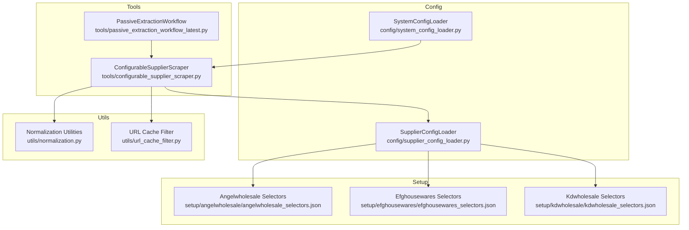
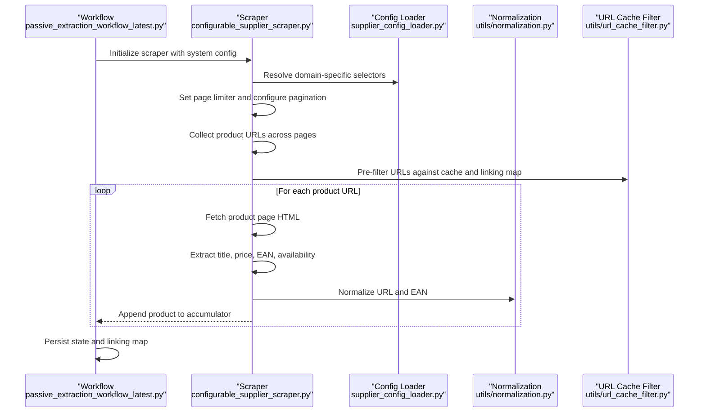
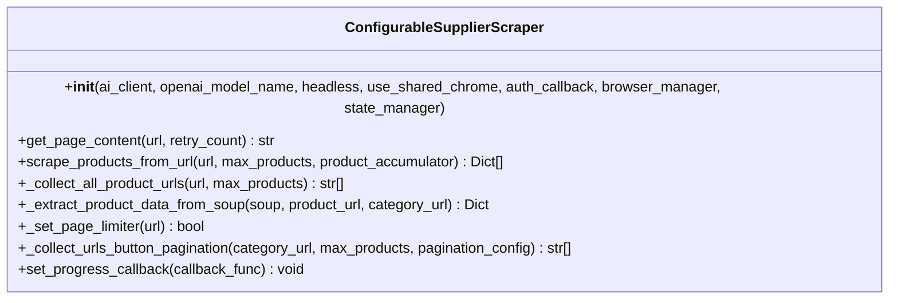
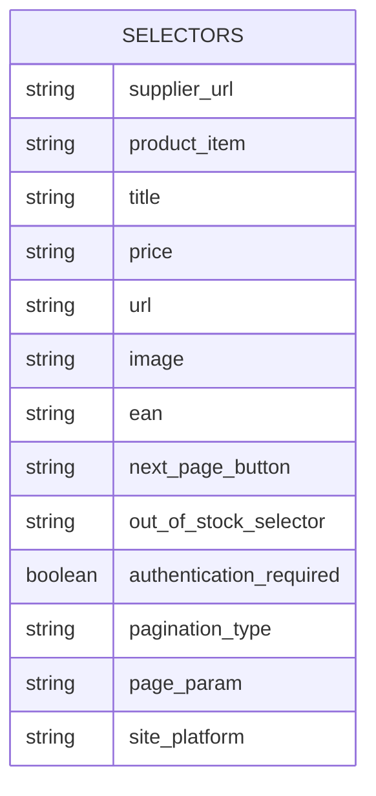
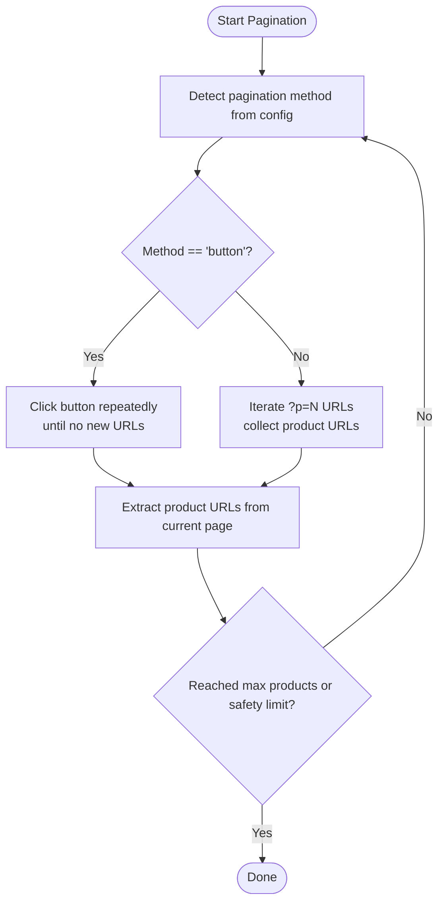
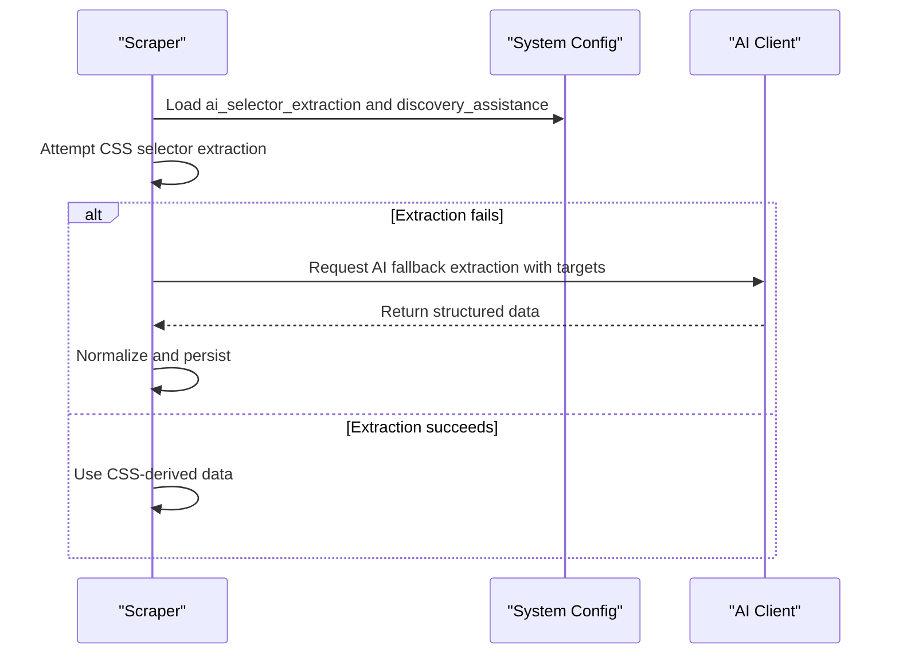
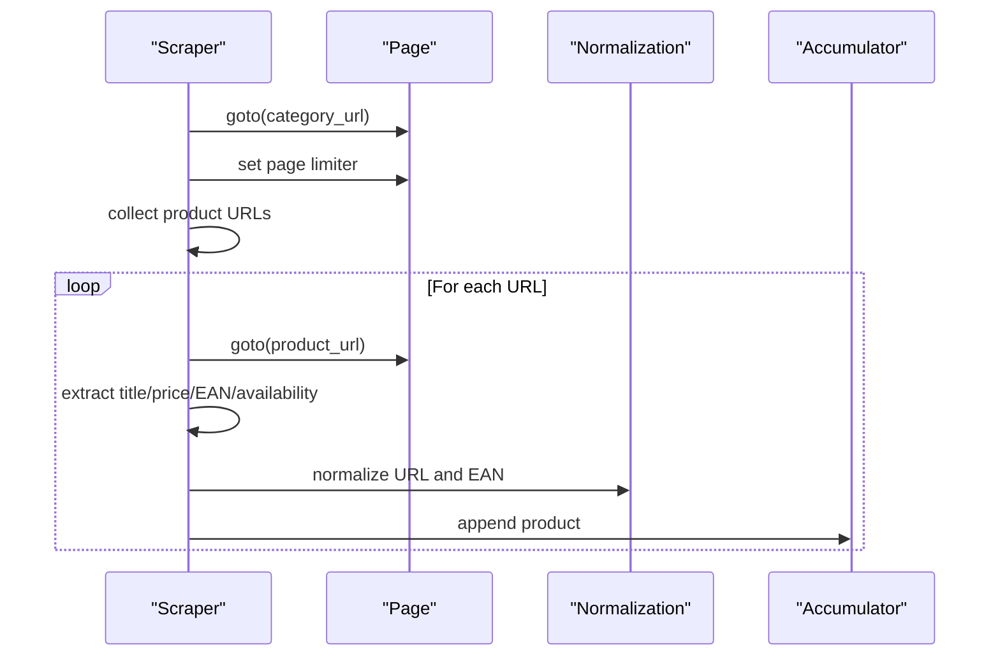
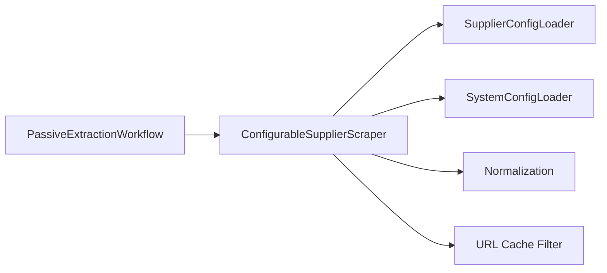

# Selector-Based Extraction

<cite>
**Referenced Files in This Document**
- [configurable_supplier_scraper.py](file://tools/configurable_supplier_scraper.py)
- [passive_extraction_workflow_latest.py](file://tools/passive_extraction_workflow_latest.py)
- [supplier_config_loader.py](file://config/supplier_config_loader.py)
- [system_config_loader.py](file://config/system_config_loader.py)
- [normalization.py](file://utils/normalization.py)
- [url_cache_filter.py](file://utils/url_cache_filter.py)
- [angelwholesale_selectors.json](file://setup/angelwholesale/angelwholesale_selectors.json)
- [efghousewares_selectors.json](file://setup/efghousewares/efghousewares_selectors.json)
- [kdwholesale_selectors.json](file://setup/kdwholesale/kdwholesale_selectors.json)
</cite>

## Table of Contents
1. [Introduction](#introduction)
2. [Project Structure](#project-structure)
3. [Core Components](#core-components)
4. [Architecture Overview](#architecture-overview)
5. [Detailed Component Analysis](#detailed-component-analysis)
6. [Dependency Analysis](#dependency-analysis)
7. [Performance Considerations](#performance-considerations)
8. [Troubleshooting Guide](#troubleshooting-guide)
9. [Conclusion](#conclusion)
10. [Appendices](#appendices)

## Introduction
This document explains the Selector-Based Extraction system that powers automated supplier data collection for Amazon FBA. It covers:
- Externalized selector configuration architecture
- Dynamic selector loading from supplier-specific JSON files
- AI-powered fallback mechanisms
- The extraction pipeline from category pages to individual product pages, including pagination handling, product URL collection, and data extraction patterns
- Examples of selector configuration syntax and extraction target definitions
- Discovery assistance features
- Relationship with normalization utilities, caching strategies, and error recovery mechanisms
- Selector debugging, performance optimization, and multi-supplier compatibility patterns

## Project Structure
The Selector-Based Extraction system spans several modules:
- Tools: Configurable supplier scraper orchestrates browser automation, pagination, URL collection, and product extraction
- Config: Supplier configuration loader resolves domain-specific selector JSON files
- Utils: Normalization utilities and URL cache filter provide deduplication and performance improvements
- Setup: Supplier-specific selector JSON files define extraction targets and pagination behavior
- Workflow: Orchestrator coordinates supplier scraping, caching, and downstream analysis

**Diagram sources**
- [configurable_supplier_scraper.py](file://tools/configurable_supplier_scraper.py#L82-L167)
- [passive_extraction_workflow_latest.py](file://tools/passive_extraction_workflow_latest.py#L141-L142)
- [supplier_config_loader.py](file://config/supplier_config_loader.py#L23-L69)
- [system_config_loader.py](file://config/system_config_loader.py#L9-L87)
- [normalization.py](file://utils/normalization.py#L1-L31)
- [url_cache_filter.py](file://utils/url_cache_filter.py#L31-L224)
- [angelwholesale_selectors.json](file://setup/angelwholesale/angelwholesale_selectors.json#L1-L12)
- [efghousewares_selectors.json](file://setup/efghousewares/efghousewares_selectors.json#L1-L23)
- [kdwholesale_selectors.json](file://setup/kdwholesale/kdwholesale_selectors.json#L1-L14)

**Section sources**
- [configurable_supplier_scraper.py](file://tools/configurable_supplier_scraper.py#L82-L167)
- [supplier_config_loader.py](file://config/supplier_config_loader.py#L23-L69)
- [url_cache_filter.py](file://utils/url_cache_filter.py#L31-L224)

## Core Components
- ConfigurableSupplierScraper: Central orchestrator for supplier scraping with Playwright-backed browser automation, selector-driven extraction, pagination, and AI-assisted fallbacks
- SupplierConfigLoader: Resolves domain-specific selector JSON files and provides normalized domain extraction
- SystemConfigLoader: Supplies system-wide configuration (e.g., AI model, extraction targets, processing limits)
- Normalization Utilities: Normalize URLs and EANs for deduplication and stable keys
- URL Cache Filter: Pre-filters URLs against existing caches to avoid redundant page visits
- Selector JSON Files: Define extraction targets, pagination, authentication, and platform metadata per supplier

**Section sources**
- [configurable_supplier_scraper.py](file://tools/configurable_supplier_scraper.py#L82-L167)
- [supplier_config_loader.py](file://config/supplier_config_loader.py#L23-L69)
- [system_config_loader.py](file://config/system_config_loader.py#L9-L87)
- [normalization.py](file://utils/normalization.py#L1-L31)
- [url_cache_filter.py](file://utils/url_cache_filter.py#L31-L224)

## Architecture Overview
The system follows a layered architecture:
- Configuration Layer: Selector JSON files and system configuration define extraction targets and behavior
- Orchestration Layer: ConfigurableSupplierScraper manages browser lifecycle, pagination, and extraction
- Data Layer: Normalization and caching utilities ensure deduplication and performance
- Workflow Layer: PassiveExtractionWorkflow coordinates supplier scraping and downstream analysis

**Diagram sources**
- [passive_extraction_workflow_latest.py](file://tools/passive_extraction_workflow_latest.py#L141-L142)
- [configurable_supplier_scraper.py](file://tools/configurable_supplier_scraper.py#L477-L880)
- [supplier_config_loader.py](file://config/supplier_config_loader.py#L23-L69)
- [normalization.py](file://utils/normalization.py#L1-L31)
- [url_cache_filter.py](file://utils/url_cache_filter.py#L49-L171)

## Detailed Component Analysis

### ConfigurableSupplierScraper
Responsibilities:
- Browser lifecycle management via BrowserManager
- Selector-driven extraction with dynamic configuration resolution
- Pagination handling (URL-based and button-based)
- Pre-filtering via URL cache and linking map
- Authentication integration and error recovery
- Real-time progress reporting and memory management

Key methods and flows:
- Initialization and configuration loading
- get_page_content with rate limiting and retries
- scrape_products_from_url: orchestrates pagination, URL collection, and product extraction
- _collect_all_product_urls: supports URL and button-based pagination
- _extract_product_data_from_soup: applies domain-aware extraction
- Integration with normalization and URL cache filter

**Diagram sources**
- [configurable_supplier_scraper.py](file://tools/configurable_supplier_scraper.py#L82-L167)
- [configurable_supplier_scraper.py](file://tools/configurable_supplier_scraper.py#L477-L880)
- [configurable_supplier_scraper.py](file://tools/configurable_supplier_scraper.py#L1389-L1526)
- [configurable_supplier_scraper.py](file://tools/configurable_supplier_scraper.py#L1528-L1599)

**Section sources**
- [configurable_supplier_scraper.py](file://tools/configurable_supplier_scraper.py#L82-L167)
- [configurable_supplier_scraper.py](file://tools/configurable_supplier_scraper.py#L477-L880)
- [configurable_supplier_scraper.py](file://tools/configurable_supplier_scraper.py#L1389-L1526)
- [configurable_supplier_scraper.py](file://tools/configurable_supplier_scraper.py#L1528-L1599)

### Selector Configuration Architecture
Supplier-specific selector JSON files define:
- supplier_url: Base URL for the supplier
- product_item: Container for product listings
- title, price, url, image, ean: CSS selectors for extraction
- next_page_button or pagination patterns: Pagination configuration
- authentication_required and login_config: Authentication metadata
- Additional fields: availability, SKU, pagination_type, page_param, site_platform

Examples:
- Angelwholesale: Single-selector fields and LOAD MORE pagination
- Efghousewares: Multi-selector mappings, authentication, and hash-based pagination
- Kdwholesale: Platform-specific selectors and out-of-stock handling

**Diagram sources**
- [angelwholesale_selectors.json](file://setup/angelwholesale/angelwholesale_selectors.json#L1-L12)
- [efghousewares_selectors.json](file://setup/efghousewares/efghousewares_selectors.json#L1-L23)
- [kdwholesale_selectors.json](file://setup/kdwholesale/kdwholesale_selectors.json#L1-L14)

**Section sources**
- [angelwholesale_selectors.json](file://setup/angelwholesale/angelwholesale_selectors.json#L1-L12)
- [efghousewares_selectors.json](file://setup/efghousewares/efghousewares_selectors.json#L1-L23)
- [kdwholesale_selectors.json](file://setup/kdwholesale/kdwholesale_selectors.json#L1-L14)

### Pagination Handling
Two pagination modes are supported:
- URL-based pagination: Iteratively builds ?p=N URLs and collects product URLs
- Button-based pagination: Repeatedly clicks “LOAD MORE” or similar buttons until no new products appear

The scraper detects pagination method from configuration and routes accordingly, with safety limits to prevent infinite loops.

**Diagram sources**
- [configurable_supplier_scraper.py](file://tools/configurable_supplier_scraper.py#L1389-L1526)
- [configurable_supplier_scraper.py](file://tools/configurable_supplier_scraper.py#L1528-L1599)

**Section sources**
- [configurable_supplier_scraper.py](file://tools/configurable_supplier_scraper.py#L1389-L1526)
- [configurable_supplier_scraper.py](file://tools/configurable_supplier_scraper.py#L1528-L1599)

### AI-Powered Fallback Mechanisms
The system integrates AI-assisted extraction targets and discovery assistance:
- Extraction targets: Defined in system configuration and used to guide AI fallback extraction
- Discovery assistance: Enabled via system configuration to assist in selector discovery and validation
- Model selection: AI model name is loaded from system configuration

These features are intended to improve extraction reliability when CSS selectors fail or vary across pages.

**Diagram sources**
- [configurable_supplier_scraper.py](file://tools/configurable_supplier_scraper.py#L223-L241)
- [system_config_loader.py](file://config/system_config_loader.py#L9-L87)

**Section sources**
- [configurable_supplier_scraper.py](file://tools/configurable_supplier_scraper.py#L223-L241)
- [system_config_loader.py](file://config/system_config_loader.py#L9-L87)

### Data Extraction Pipeline
End-to-end flow:
- Load supplier selectors from JSON
- Navigate to category page and set page limiter
- Collect product URLs across pages
- Pre-filter URLs against cache and linking map
- For each URL, fetch product page and extract fields
- Normalize URL and EAN, apply price filtering
- Report progress and persist state

**Diagram sources**
- [configurable_supplier_scraper.py](file://tools/configurable_supplier_scraper.py#L477-L880)
- [normalization.py](file://utils/normalization.py#L1-L31)

**Section sources**
- [configurable_supplier_scraper.py](file://tools/configurable_supplier_scraper.py#L477-L880)
- [normalization.py](file://utils/normalization.py#L1-L31)

### Relationship with Normalization Utilities
Normalization utilities ensure:
- URL normalization removes trackers and standardizes query parameters
- EAN normalization strips non-digit characters
- Stable keys combine EAN-first and URL-based identifiers for deduplication

Integration occurs during product extraction and state persistence.

**Section sources**
- [normalization.py](file://utils/normalization.py#L1-L31)

### Caching Strategies and Error Recovery
Caching and filtering:
- URL Cache Filter pre-filters URLs against supplier product caches and linking maps to avoid redundant visits
- Real-time cache updates occur during extraction
- Memory management and cleanup are integrated to prevent leaks during long runs

Error recovery:
- Rate limiting and exponential backoff for navigation failures
- Authentication checks triggered when price extraction fails
- Robust retry logic and progress callbacks for resumable workflows

**Section sources**
- [url_cache_filter.py](file://utils/url_cache_filter.py#L31-L224)
- [configurable_supplier_scraper.py](file://tools/configurable_supplier_scraper.py#L329-L467)
- [configurable_supplier_scraper.py](file://tools/configurable_supplier_scraper.py#L772-L842)

### Selector Debugging and Multi-Supplier Compatibility
- Selector debugging: Scraper logs detailed warnings and retries; authentication checks help diagnose pricing failures
- Multi-supplier compatibility: Domain-aware selector resolution and per-supplier authentication services enable seamless operation across diverse platforms
- Discovery assistance: System configuration enables AI-assisted selector discovery and validation

**Section sources**
- [configurable_supplier_scraper.py](file://tools/configurable_supplier_scraper.py#L772-L842)
- [supplier_config_loader.py](file://config/supplier_config_loader.py#L72-L106)

## Dependency Analysis
The system exhibits clear separation of concerns:
- ConfigurableSupplierScraper depends on SupplierConfigLoader for selectors and SystemConfigLoader for AI and processing limits
- Normalization utilities are used across extraction and state management
- URL Cache Filter integrates with the scraper to optimize performance
- Workflow orchestrator coordinates scraper execution and state persistence

**Diagram sources**
- [configurable_supplier_scraper.py](file://tools/configurable_supplier_scraper.py#L58-L68)
- [system_config_loader.py](file://config/system_config_loader.py#L9-L87)
- [supplier_config_loader.py](file://config/supplier_config_loader.py#L23-L69)
- [normalization.py](file://utils/normalization.py#L1-L31)
- [url_cache_filter.py](file://utils/url_cache_filter.py#L31-L224)
- [passive_extraction_workflow_latest.py](file://tools/passive_extraction_workflow_latest.py#L141-L142)

**Section sources**
- [configurable_supplier_scraper.py](file://tools/configurable_supplier_scraper.py#L58-L68)
- [system_config_loader.py](file://config/system_config_loader.py#L9-L87)
- [supplier_config_loader.py](file://config/supplier_config_loader.py#L23-L69)
- [normalization.py](file://utils/normalization.py#L1-L31)
- [url_cache_filter.py](file://utils/url_cache_filter.py#L31-L224)
- [passive_extraction_workflow_latest.py](file://tools/passive_extraction_workflow_latest.py#L141-L142)

## Performance Considerations
- Memory management: Periodic garbage collection and forced cleanup during long runs
- URL pre-filtering: Reduces page visits and speeds up extraction
- Page limiter: Controls products per page to reduce DOM parsing overhead
- Rate limiting: Prevents throttling and improves reliability
- Safety limits: Pagination safety limits prevent runaway loops

[No sources needed since this section provides general guidance]

## Troubleshooting Guide
Common issues and resolutions:
- Navigation failures: Scraper retries with exponential backoff and logs HTTP status
- Authentication failures: Triggers authentication checks and recommends manual re-authentication
- Small or invalid HTML responses: Scraper validates content and retries
- Memory pressure: Periodic cleanup and reduced local lists mitigate leaks
- Pagination problems: Switch between URL and button-based methods depending on supplier configuration

**Section sources**
- [configurable_supplier_scraper.py](file://tools/configurable_supplier_scraper.py#L329-L467)
- [configurable_supplier_scraper.py](file://tools/configurable_supplier_scraper.py#L772-L842)
- [configurable_supplier_scraper.py](file://tools/configurable_supplier_scraper.py#L851-L862)

## Conclusion
The Selector-Based Extraction system provides a robust, extensible framework for supplier data collection. By externalizing selector configurations, integrating AI-assisted fallbacks, and implementing strong caching and error recovery, it achieves high reliability and performance across diverse supplier environments. The modular design supports easy onboarding of new suppliers and continuous refinement of extraction logic.

[No sources needed since this section summarizes without analyzing specific files]

## Appendices

### Selector Configuration Syntax and Examples
- Angelwholesale: Single-selector fields and LOAD MORE pagination
- Efghousewares: Multi-selector mappings, authentication, and hash-based pagination
- Kdwholesale: Platform-specific selectors and out-of-stock handling

**Section sources**
- [angelwholesale_selectors.json](file://setup/angelwholesale/angelwholesale_selectors.json#L1-L12)
- [efghousewares_selectors.json](file://setup/efghousewares/efghousewares_selectors.json#L1-L23)
- [kdwholesale_selectors.json](file://setup/kdwholesale/kdwholesale_selectors.json#L1-L14)