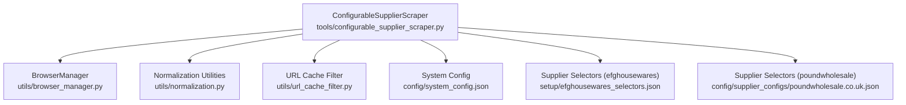
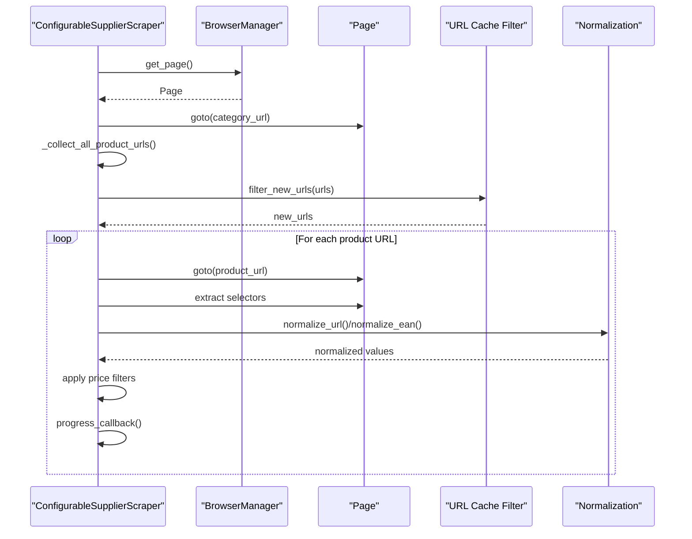
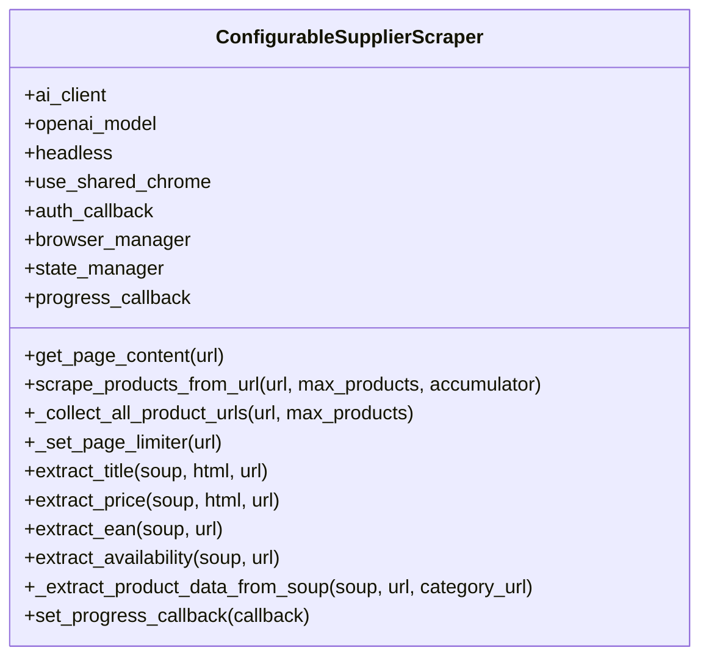
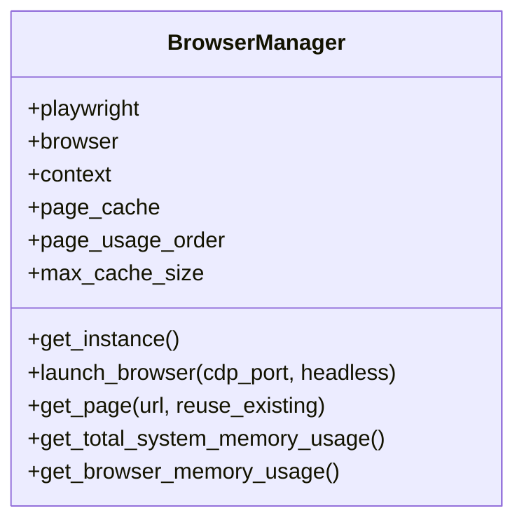
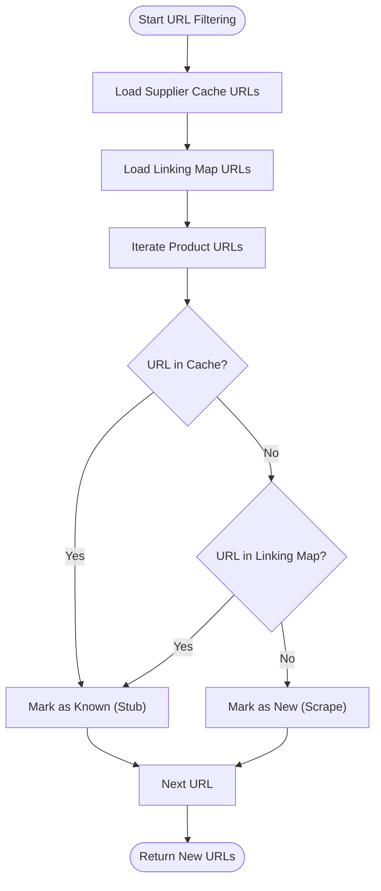
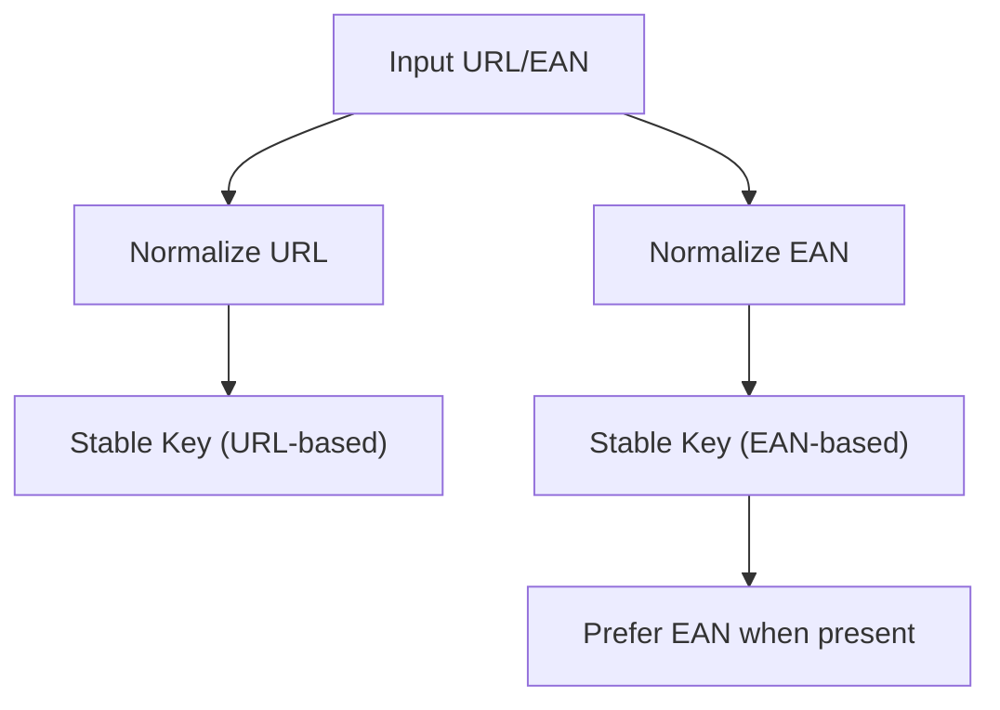
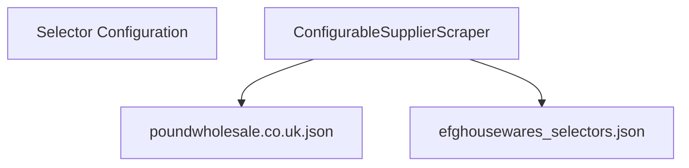
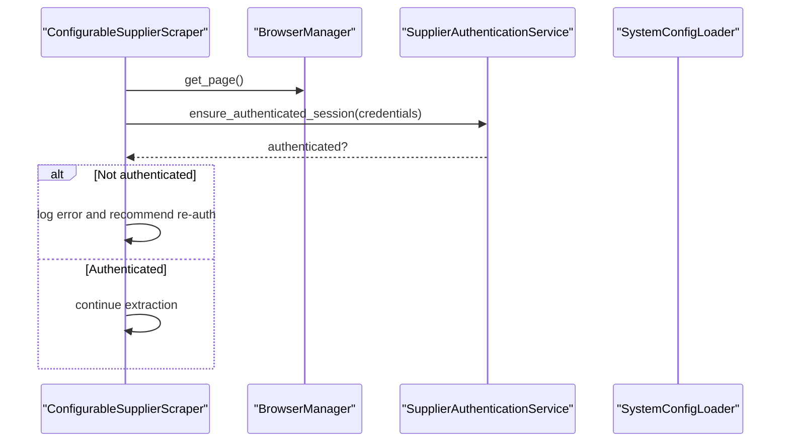
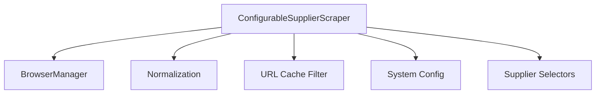

# Supplier Scraper

<cite>
**Referenced Files in This Document**
- [configurable_supplier_scraper.py](file://tools/configurable_supplier_scraper.py)
- [browser_manager.py](file://utils/browser_manager.py)
- [normalization.py](file://utils/normalization.py)
- [url_cache_filter.py](file://utils/url_cache_filter.py)
- [system_config.json](file://config/system_config.json)
- [efghousewares_selectors.json](file://setup/efghousewares_selectors.json)
- [poundwholesale.co.uk.json](file://config/supplier_configs/poundwholesale.co.uk.json)
</cite>

## Table of Contents
1. [Introduction](#introduction)
2. [Project Structure](#project-structure)
3. [Core Components](#core-components)
4. [Architecture Overview](#architecture-overview)
5. [Detailed Component Analysis](#detailed-component-analysis)
6. [Dependency Analysis](#dependency-analysis)
7. [Performance Considerations](#performance-considerations)
8. [Troubleshooting Guide](#troubleshooting-guide)
9. [Conclusion](#conclusion)

## Introduction
This document explains the Supplier Scraper component responsible for extracting product data from supplier websites. It focuses on the ConfigurableSupplierScraper class, which uses Playwright for robust browser automation, selector-based extraction, and AI-powered fallback mechanisms. The document covers the end-to-end pipeline from category pages to individual product pages, including pagination handling, authentication, URL filtering, memory management, normalization, and caching integrations.

## Project Structure
The Supplier Scraper integrates several modules:
- ConfigurableSupplierScraper orchestrates scraping, browser management, and data extraction.
- BrowserManager provides a centralized, singleton Chrome instance with LRU page caching and health monitoring.
- Normalization utilities normalize URLs and EANs for deduplication and stable keys.
- URL cache filter pre-filters URLs to avoid redundant page visits.
- System configuration defines processing limits, timeouts, and extraction targets.
- Supplier-specific selector configurations define how to locate product elements and pagination controls.

**Diagram sources**
- [configurable_supplier_scraper.py](file://tools/configurable_supplier_scraper.py#L82-L167)
- [browser_manager.py](file://utils/browser_manager.py#L35-L70)
- [normalization.py](file://utils/normalization.py#L1-L31)
- [url_cache_filter.py](file://utils/url_cache_filter.py#L31-L48)
- [system_config.json](file://config/system_config.json#L48-L61)
- [efghousewares_selectors.json](file://setup/efghousewares_selectors.json#L1-L23)
- [poundwholesale.co.uk.json](file://config/supplier_configs/poundwholesale.co.uk.json#L1-L137)

**Section sources**
- [configurable_supplier_scraper.py](file://tools/configurable_supplier_scraper.py#L82-L167)
- [browser_manager.py](file://utils/browser_manager.py#L35-L70)
- [normalization.py](file://utils/normalization.py#L1-L31)
- [url_cache_filter.py](file://utils/url_cache_filter.py#L31-L48)
- [system_config.json](file://config/system_config.json#L48-L61)
- [efghousewares_selectors.json](file://setup/efghousewares_selectors.json#L1-L23)
- [poundwholesale.co.uk.json](file://config/supplier_configs/poundwholesale.co.uk.json#L1-L137)

## Core Components
- ConfigurableSupplierScraper: Orchestrates Playwright-based scraping, pagination, product extraction, authentication checks, and progress callbacks. It centralizes selector configuration loading and integrates with BrowserManager for shared Chrome instances.
- BrowserManager: Singleton managing a persistent Chrome instance with LRU page caching, health monitoring, and memory usage tracking. It connects to an existing Chrome debug instance and supports fallbacks.
- Normalization utilities: Normalize URLs and EANs to stable identifiers for deduplication and linking.
- URL cache filter: Pre-filter URLs using in-memory sets to avoid visiting cached or already-processed links.
- System configuration: Defines processing limits, timeouts, batch sizes, and extraction targets for AI fallbacks.

**Section sources**
- [configurable_supplier_scraper.py](file://tools/configurable_supplier_scraper.py#L82-L167)
- [browser_manager.py](file://utils/browser_manager.py#L35-L70)
- [normalization.py](file://utils/normalization.py#L1-L31)
- [url_cache_filter.py](file://utils/url_cache_filter.py#L31-L48)
- [system_config.json](file://config/system_config.json#L48-L61)

## Architecture Overview
The Supplier Scraper follows a layered architecture:
- Orchestration layer: ConfigurableSupplierScraper coordinates scraping tasks.
- Browser layer: BrowserManager provides a shared Chrome instance and manages pages.
- Extraction layer: Selector-based extraction with AI fallbacks for robustness.
- Data layer: Normalization and caching to ensure deduplication and efficiency.

**Diagram sources**
- [configurable_supplier_scraper.py](file://tools/configurable_supplier_scraper.py#L477-L880)
- [browser_manager.py](file://utils/browser_manager.py#L141-L198)
- [url_cache_filter.py](file://utils/url_cache_filter.py#L153-L171)
- [normalization.py](file://utils/normalization.py#L9-L31)

## Detailed Component Analysis

### ConfigurableSupplierScraper
Key responsibilities:
- Playwright initialization and browser lifecycle management via BrowserManager.
- Selector-based extraction with domain-aware configuration loading.
- Pagination handling supporting both URL-based and button-based patterns.
- Authentication integration for multi-tier authentication systems.
- Memory management and cleanup strategies to prevent leaks.
- URL pre-filtering using cache and linking map to reduce redundant visits.
- Progress tracking and state persistence hooks.

Notable methods and flows:
- Initialization and configuration loading:
  - Loads system configuration and extraction targets.
  - Initializes BrowserManager and ensures a connected browser instance.
  - Sets up rate limiting and session management.
- Page retrieval and navigation:
  - Retrieves pages from BrowserManager and navigates with timeouts and retries.
  - Handles rate limits, bot detection signals, and small response validation.
- Pagination collection:
  - Supports URL pagination with configurable next-page selectors.
  - Supports button-based pagination with JavaScript click triggers.
- Product extraction:
  - Extracts title, price, EAN, and availability using selector mappings.
  - Applies price filters and normalization.
  - Emits progress callbacks and accumulates results.
- Authentication checks:
  - Performs periodic authentication verification during long extractions.
  - Triggers authentication when price extraction fails.
- Memory management:
  - Periodic garbage collection and forced cleanup at intervals.
  - Tracks and logs Chrome and system memory usage.

**Diagram sources**
- [configurable_supplier_scraper.py](file://tools/configurable_supplier_scraper.py#L82-L167)
- [configurable_supplier_scraper.py](file://tools/configurable_supplier_scraper.py#L477-L880)
- [configurable_supplier_scraper.py](file://tools/configurable_supplier_scraper.py#L1304-L1326)

**Section sources**
- [configurable_supplier_scraper.py](file://tools/configurable_supplier_scraper.py#L82-L167)
- [configurable_supplier_scraper.py](file://tools/configurable_supplier_scraper.py#L243-L284)
- [configurable_supplier_scraper.py](file://tools/configurable_supplier_scraper.py#L329-L467)
- [configurable_supplier_scraper.py](file://tools/configurable_supplier_scraper.py#L477-L880)
- [configurable_supplier_scraper.py](file://tools/configurable_supplier_scraper.py#L1304-L1326)

### BrowserManager
Key responsibilities:
- Singleton Chrome instance management with persistent context.
- LRU page caching to minimize overhead and maintain stability.
- Health monitoring, memory tracking, and automatic restarts.
- IPv6/IPv4 dual-stack CDP endpoint selection for Chrome 139+ compatibility.
- Circuit breaker for navigation reliability.

**Diagram sources**
- [browser_manager.py](file://utils/browser_manager.py#L35-L70)
- [browser_manager.py](file://utils/browser_manager.py#L141-L198)
- [browser_manager.py](file://utils/browser_manager.py#L658-L800)

**Section sources**
- [browser_manager.py](file://utils/browser_manager.py#L35-L70)
- [browser_manager.py](file://utils/browser_manager.py#L141-L198)
- [browser_manager.py](file://utils/browser_manager.py#L658-L800)

### URL Cache Filter
Key responsibilities:
- Load supplier product caches and linking maps into memory.
- Provide O(1) URL lookup using in-memory sets.
- Filter URLs to only include new ones needing extraction.
- Update caches in real-time as products are processed.

**Diagram sources**
- [url_cache_filter.py](file://utils/url_cache_filter.py#L49-L102)
- [url_cache_filter.py](file://utils/url_cache_filter.py#L179-L206)
- [url_cache_filter.py](file://utils/url_cache_filter.py#L153-L171)

**Section sources**
- [url_cache_filter.py](file://utils/url_cache_filter.py#L31-L48)
- [url_cache_filter.py](file://utils/url_cache_filter.py#L49-L102)
- [url_cache_filter.py](file://utils/url_cache_filter.py#L153-L171)
- [url_cache_filter.py](file://utils/url_cache_filter.py#L179-L206)

### Normalization Utilities
Key responsibilities:
- Normalize URLs to remove tracking parameters and standardize host/path.
- Normalize EANs to digit-only strings for stable identification.
- Provide stable keys combining EAN-first and URL fallback logic.

**Diagram sources**
- [normalization.py](file://utils/normalization.py#L9-L31)

**Section sources**
- [normalization.py](file://utils/normalization.py#L1-L31)

### Selector-Based Extraction and Pagination
Selector configuration examples:
- efghousewares_selectors.json demonstrates field mappings for product items, titles, prices, URLs, images, and pagination selectors.
- poundwholesale.co.uk.json includes extensive field mappings, navigation strategies, pagination patterns, and page limiter configuration.

**Diagram sources**
- [efghousewares_selectors.json](file://setup/efghousewares_selectors.json#L1-L23)
- [poundwholesale.co.uk.json](file://config/supplier_configs/poundwholesale.co.uk.json#L20-L94)

**Section sources**
- [efghousewares_selectors.json](file://setup/efghousewares_selectors.json#L1-L23)
- [poundwholesale.co.uk.json](file://config/supplier_configs/poundwholesale.co.uk.json#L20-L94)
- [poundwholesale.co.uk.json](file://config/supplier_configs/poundwholesale.co.uk.json#L119-L132)

### Authentication Handling
The scraper integrates with supplier-specific authentication services:
- Periodic authentication verification during long extractions.
- On price extraction failure, triggers authentication checks to diagnose session issues.
- Credentials are retrieved from system configuration loaders and passed to per-supplier authentication helpers.

**Diagram sources**
- [configurable_supplier_scraper.py](file://tools/configurable_supplier_scraper.py#L772-L845)
- [configurable_supplier_scraper.py](file://tools/configurable_supplier_scraper.py#L1106-L1179)

**Section sources**
- [configurable_supplier_scraper.py](file://tools/configurable_supplier_scraper.py#L772-L845)
- [configurable_supplier_scraper.py](file://tools/configurable_supplier_scraper.py#L1106-L1179)

### Error Recovery Strategies
- Retry with exponential backoff for transient failures.
- Rate-limiting and bot-detection handling with adaptive waits.
- Validation of HTML content size and presence of essential tags.
- Graceful fallbacks for navigation and page retrieval.
- Authentication checks triggered upon price extraction failures.

**Section sources**
- [configurable_supplier_scraper.py](file://tools/configurable_supplier_scraper.py#L334-L467)
- [configurable_supplier_scraper.py](file://tools/configurable_supplier_scraper.py#L443-L448)

## Dependency Analysis
The Supplier Scraper depends on:
- Centralized browser management via BrowserManager for shared Chrome instances.
- Selector configurations for each supplier to drive extraction.
- System configuration for processing limits, timeouts, and extraction targets.
- Normalization utilities for stable keys and deduplication.
- URL cache filter for pre-filtering and efficiency.

**Diagram sources**
- [configurable_supplier_scraper.py](file://tools/configurable_supplier_scraper.py#L82-L167)
- [browser_manager.py](file://utils/browser_manager.py#L35-L70)
- [normalization.py](file://utils/normalization.py#L1-L31)
- [url_cache_filter.py](file://utils/url_cache_filter.py#L31-L48)
- [system_config.json](file://config/system_config.json#L48-L61)

**Section sources**
- [configurable_supplier_scraper.py](file://tools/configurable_supplier_scraper.py#L82-L167)
- [browser_manager.py](file://utils/browser_manager.py#L35-L70)
- [normalization.py](file://utils/normalization.py#L1-L31)
- [url_cache_filter.py](file://utils/url_cache_filter.py#L31-L48)
- [system_config.json](file://config/system_config.json#L48-L61)

## Performance Considerations
- Memory management: Periodic garbage collection and forced cleanup prevent memory leaks during long scraping sessions.
- Browser efficiency: Shared Chrome instance and LRU page caching reduce overhead.
- URL pre-filtering: In-memory sets enable O(1) duplicate detection and avoid unnecessary page loads.
- Pagination limits: Configurable safety limits prevent excessive clicking or page traversal.
- Rate limiting: Delays between requests mitigate rate limits and bot detection.

[No sources needed since this section provides general guidance]

## Troubleshooting Guide
Common issues and resolutions:
- Chrome debug port accessibility: Ensure Chrome is launched with the correct debug flags and port; verify IPv6/IPv4 endpoint selection.
- Navigation failures: Use circuit breaker and retry logic; validate response content and status codes.
- Authentication expiration: Trigger periodic authentication checks and handle login-required selectors.
- Memory pressure: Monitor Chrome and system memory usage; perform forced cleanup when thresholds are exceeded.

**Section sources**
- [browser_manager.py](file://utils/browser_manager.py#L242-L301)
- [browser_manager.py](file://utils/browser_manager.py#L302-L315)
- [browser_manager.py](file://utils/browser_manager.py#L477-L513)
- [configurable_supplier_scraper.py](file://tools/configurable_supplier_scraper.py#L394-L411)

## Conclusion
The Supplier Scraper provides a robust, scalable solution for extracting product data from supplier websites. By leveraging Playwright, centralized browser management, selector-based extraction, AI fallbacks, URL pre-filtering, normalization, and caching, it achieves high accuracy and efficiency while maintaining strong memory and resource management practices.