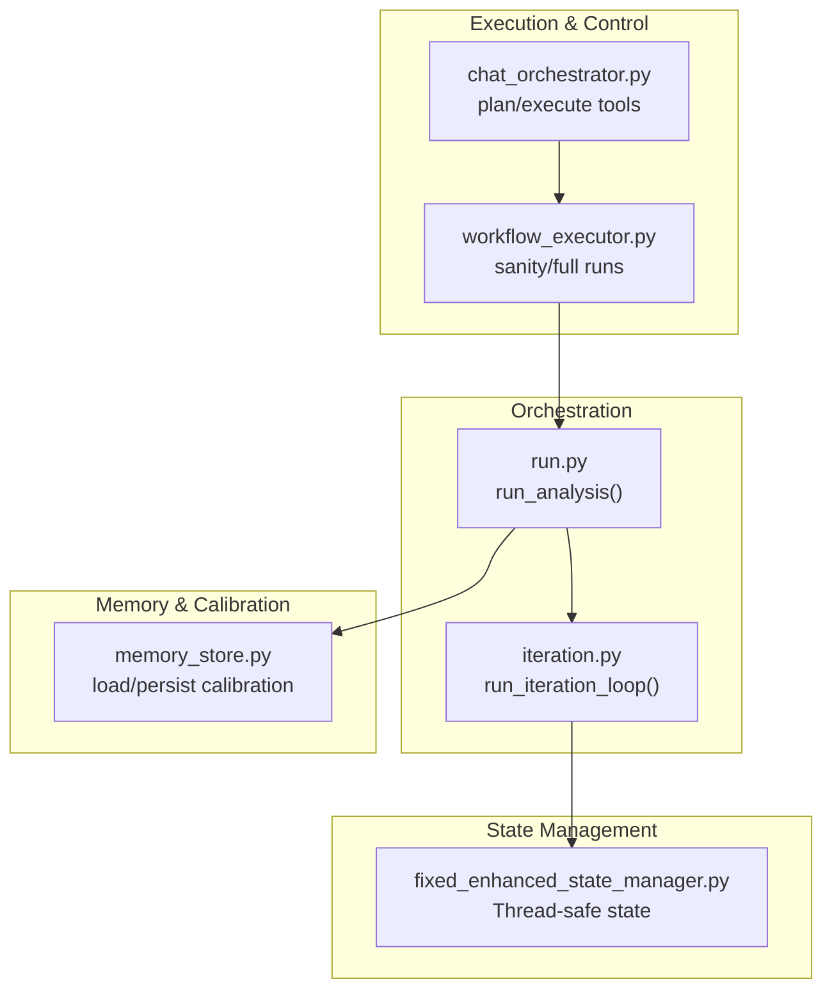
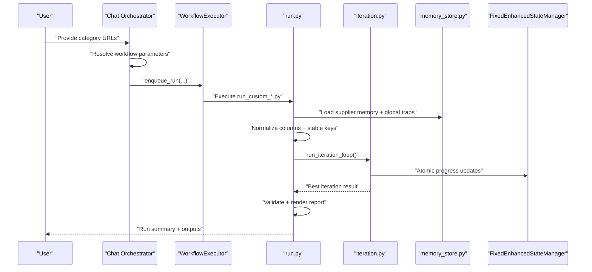
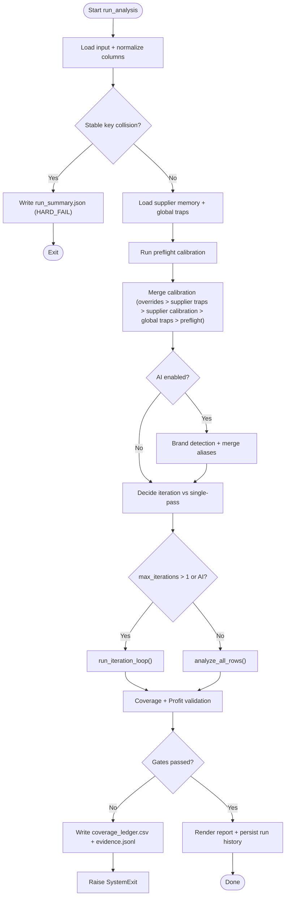
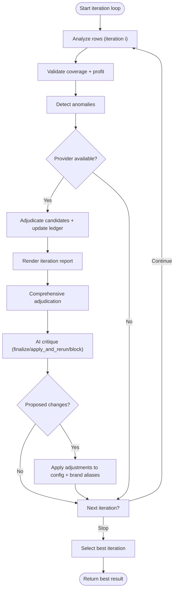
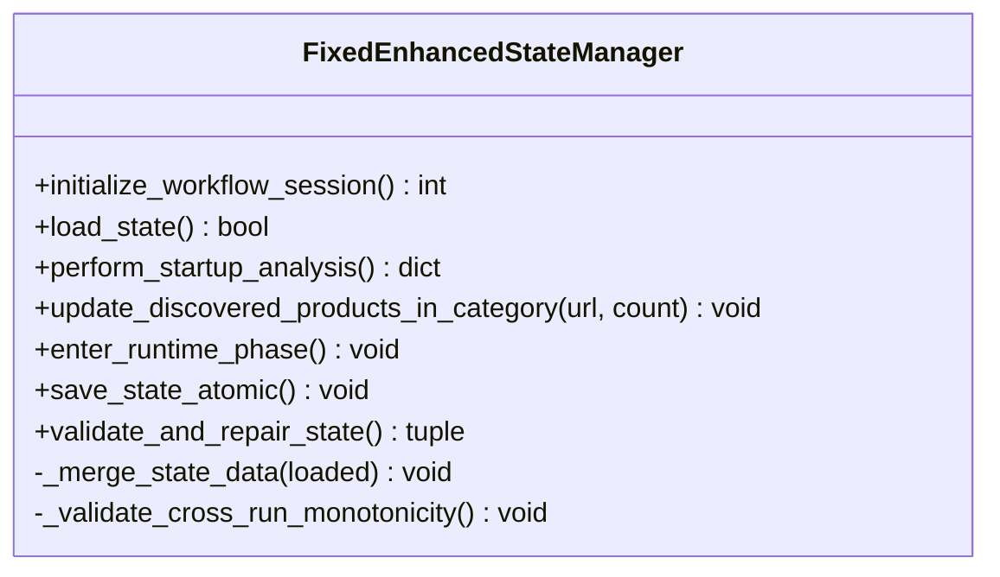
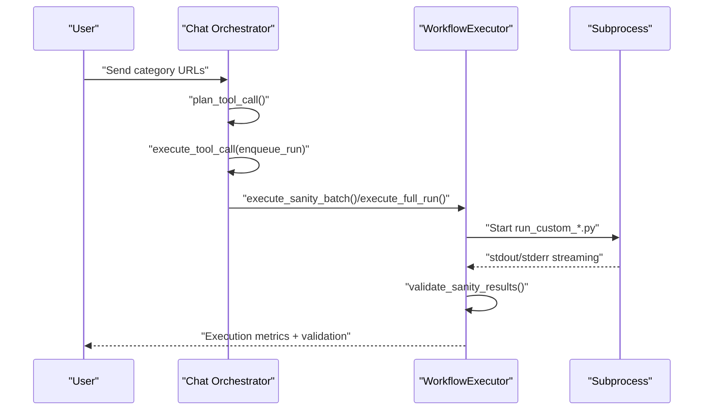
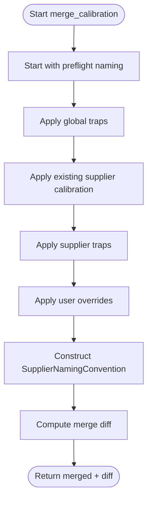
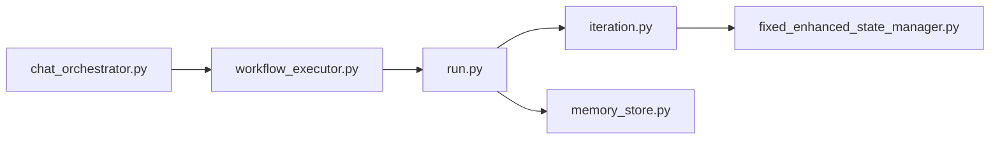

# Workflow Engine

<cite>
**Referenced Files in This Document**
- [run.py](file://src/fba_agent/run.py)
- [iteration.py](file://src/fba_agent/iteration.py)
- [memory_store.py](file://src/fba_agent/memory_store.py)
- [workflow_executor.py](file://ai_enhanced_setup/workflow_executor.py)
- [chat_orchestrator.py](file://control_plane/chat_orchestrator.py)
- [fixed_enhanced_state_manager.py](file://utils/fixed_enhanced_state_manager.py)
- [README.md](file://README.md)
- [NEW_SUPPLIER_WORKFLOW_GUIDE_DEC_29.md](file://NEW_SUPPLIER_WORKFLOW_GUIDE_DEC_29.md)
</cite>

## Table of Contents
1. [Introduction](#introduction)
2. [Project Structure](#project-structure)
3. [Core Components](#core-components)
4. [Architecture Overview](#architecture-overview)
5. [Detailed Component Analysis](#detailed-component-analysis)
6. [Dependency Analysis](#dependency-analysis)
7. [Performance Considerations](#performance-considerations)
8. [Troubleshooting Guide](#troubleshooting-guide)
9. [Conclusion](#conclusion)
10. [Appendices](#appendices)

## Introduction
This document describes the Workflow Engine of the Amazon FBA Agent System. It explains how the system orchestrates supplier scraping, Amazon product matching, and financial analysis, and how it coordinates the main execution loop, state management, and progress tracking. It also documents configuration options, execution parameters, error handling strategies, resumption capabilities, and performance optimization techniques. The goal is to make the workflow understandable for both technical and non-technical readers.

## Project Structure
The Workflow Engine spans several modules:
- Core orchestration and iteration logic
- Memory and calibration management
- State management for resumption and progress
- Control plane and workflow executor for launching and validating runs
- Documentation that outlines the end-to-end workflow

**Diagram sources**
- [run.py](file://src/fba_agent/run.py#L59-L321)
- [iteration.py](file://src/fba_agent/iteration.py#L156-L409)
- [memory_store.py](file://src/fba_agent/memory_store.py#L146-L236)
- [fixed_enhanced_state_manager.py](file://utils/fixed_enhanced_state_manager.py#L86-L120)
- [chat_orchestrator.py](file://control_plane/chat_orchestrator.py#L292-L418)
- [workflow_executor.py](file://ai_enhanced_setup/workflow_executor.py#L30-L52)

**Section sources**
- [README.md](file://README.md#L45-L61)
- [NEW_SUPPLIER_WORKFLOW_GUIDE_DEC_29.md](file://NEW_SUPPLIER_WORKFLOW_GUIDE_DEC_29.md#L81-L115)

## Core Components
- run_analysis: Main orchestration entry point that loads data, normalizes columns, merges calibration, optionally detects brands, runs iteration loop or single-pass analysis, validates outputs, renders reports, persists run history, and handles errors.
- run_iteration_loop: Manages iterative refinement with AI-enabled adjudication and critique, anomaly detection, and regression guard comparisons.
- memory_store: Loads supplier memory, global traps, merges calibration with strict precedence, persists run history and calibration.
- FixedEnhancedStateManager: Thread-safe state manager that tracks resumption and progress across supplier and Amazon phases, reconciles counters, and supports atomic writes.
- WorkflowExecutor: Executes sanity and full runs via subprocess, streams output, validates results against criteria, and returns metrics.
- Chat Orchestrator: Plans tool calls to enqueue runs, resolves workflow parameters from supplier domains, and executes tool actions.

**Section sources**
- [run.py](file://src/fba_agent/run.py#L59-L321)
- [iteration.py](file://src/fba_agent/iteration.py#L156-L409)
- [memory_store.py](file://src/fba_agent/memory_store.py#L146-L236)
- [fixed_enhanced_state_manager.py](file://utils/fixed_enhanced_state_manager.py#L86-L120)
- [workflow_executor.py](file://ai_enhanced_setup/workflow_executor.py#L30-L52)
- [chat_orchestrator.py](file://control_plane/chat_orchestrator.py#L292-L418)

## Architecture Overview
The Workflow Engine coordinates three primary stages:
1) Supplier scraping and extraction
2) Amazon product matching and caching
3) Financial analysis and reporting

It integrates with state management for resumption, with memory/calibration for configuration, and with the control plane for launch and validation.

**Diagram sources**
- [chat_orchestrator.py](file://control_plane/chat_orchestrator.py#L292-L418)
- [workflow_executor.py](file://ai_enhanced_setup/workflow_executor.py#L267-L338)
- [run.py](file://src/fba_agent/run.py#L59-L321)
- [iteration.py](file://src/fba_agent/iteration.py#L156-L409)
- [memory_store.py](file://src/fba_agent/memory_store.py#L146-L236)
- [fixed_enhanced_state_manager.py](file://utils/fixed_enhanced_state_manager.py#L86-L120)

## Detailed Component Analysis

### Main Execution Loop (run_analysis)
The orchestration function coordinates:
- Input parsing and normalization with stable key generation
- Supplier memory and global traps loading
- Preflight calibration and merge with memory layers and overrides
- Optional brand detection using an LLM provider
- Iteration loop or single-pass analysis
- Validation, artifact writing, report rendering, and run history persistence

Key behaviors:
- Stable key collisions are detected and reported with a dedicated summary.
- AI features are conditionally enabled and traced to a file.
- On iteration loop failure, the system falls back to single-pass analysis with validation.

**Diagram sources**
- [run.py](file://src/fba_agent/run.py#L59-L321)
- [iteration.py](file://src/fba_agent/iteration.py#L156-L409)

**Section sources**
- [run.py](file://src/fba_agent/run.py#L59-L321)

### Iteration Loop (run_iteration_loop)
The iteration loop performs:
- Iterative analysis with anomaly detection
- Optional AI adjudication of ambiguous rows
- Comprehensive adjudication across the full report
- AI critique recommending finalize/apply_and_rerun/block
- Applying proposed changes and deciding continuation
- Selecting the best iteration result

**Diagram sources**
- [iteration.py](file://src/fba_agent/iteration.py#L156-L409)

**Section sources**
- [iteration.py](file://src/fba_agent/iteration.py#L156-L409)

### State Management Integration (FixedEnhancedStateManager)
The state manager ensures reliable resumption and progress tracking:
- Authoritative resumption index and progress tracking separated from legacy fields
- Startup analysis reconciles counters using linking map as single source of truth
- Thread-safe atomic writes and cross-run monotonicity validation
- Category progress updates with real-time product discoveries
- Runtime phase gating and session cursor computation

**Diagram sources**
- [fixed_enhanced_state_manager.py](file://utils/fixed_enhanced_state_manager.py#L86-L120)
- [fixed_enhanced_state_manager.py](file://utils/fixed_enhanced_state_manager.py#L247-L284)
- [fixed_enhanced_state_manager.py](file://utils/fixed_enhanced_state_manager.py#L469-L646)
- [fixed_enhanced_state_manager.py](file://utils/fixed_enhanced_state_manager.py#L737-L787)

**Section sources**
- [fixed_enhanced_state_manager.py](file://utils/fixed_enhanced_state_manager.py#L86-L120)
- [fixed_enhanced_state_manager.py](file://utils/fixed_enhanced_state_manager.py#L247-L284)
- [fixed_enhanced_state_manager.py](file://utils/fixed_enhanced_state_manager.py#L469-L646)
- [fixed_enhanced_state_manager.py](file://utils/fixed_enhanced_state_manager.py#L737-L787)

### Control Plane and Execution (Chat Orchestrator + WorkflowExecutor)
- Chat Orchestrator plans tool calls to enqueue runs, infers supplier domain from URLs, resolves workflow keys and runner scripts, and executes read/write tools.
- WorkflowExecutor executes sanity and full runs via subprocess, streams output, validates results against criteria (scraping, cache, linking map, financial CSV, state updates), and returns metrics.

**Diagram sources**
- [chat_orchestrator.py](file://control_plane/chat_orchestrator.py#L292-L418)
- [workflow_executor.py](file://ai_enhanced_setup/workflow_executor.py#L53-L133)
- [workflow_executor.py](file://ai_enhanced_setup/workflow_executor.py#L267-L338)

**Section sources**
- [chat_orchestrator.py](file://control_plane/chat_orchestrator.py#L292-L418)
- [workflow_executor.py](file://ai_enhanced_setup/workflow_executor.py#L53-L133)
- [workflow_executor.py](file://ai_enhanced_setup/workflow_executor.py#L134-L266)
- [workflow_executor.py](file://ai_enhanced_setup/workflow_executor.py#L267-L338)

### Memory and Calibration (memory_store)
- supplier_id_from_name normalizes supplier identifiers.
- load_supplier_memory and load_global_traps assemble memory bundles.
- merge_calibration applies strict precedence: overrides > supplier traps > supplier calibration > global traps > preflight > defaults.
- persist_run_history and persist_calibration maintain run history and naming conventions.

**Diagram sources**
- [memory_store.py](file://src/fba_agent/memory_store.py#L146-L236)

**Section sources**
- [memory_store.py](file://src/fba_agent/memory_store.py#L11-L23)
- [memory_store.py](file://src/fba_agent/memory_store.py#L133-L143)
- [memory_store.py](file://src/fba_agent/memory_store.py#L146-L236)
- [memory_store.py](file://src/fba_agent/memory_store.py#L239-L247)

## Dependency Analysis
The Workflow Engine exhibits clear layering:
- run.py depends on iteration.py for iterative refinement and memory_store.py for calibration and run history.
- iteration.py depends on analysis/validation/anomalies/adjudication/critique modules (referenced via late imports).
- fixed_enhanced_state_manager.py is used by the workflow to manage resumption and progress.
- chat_orchestrator.py depends on control plane tools and resolves workflow parameters.
- workflow_executor.py depends on OUTPUTS directories and runner scripts to validate runs.

**Diagram sources**
- [run.py](file://src/fba_agent/run.py#L59-L321)
- [iteration.py](file://src/fba_agent/iteration.py#L156-L409)
- [memory_store.py](file://src/fba_agent/memory_store.py#L146-L236)
- [fixed_enhanced_state_manager.py](file://utils/fixed_enhanced_state_manager.py#L86-L120)
- [chat_orchestrator.py](file://control_plane/chat_orchestrator.py#L292-L418)
- [workflow_executor.py](file://ai_enhanced_setup/workflow_executor.py#L30-L52)

**Section sources**
- [run.py](file://src/fba_agent/run.py#L59-L321)
- [iteration.py](file://src/fba_agent/iteration.py#L156-L409)
- [memory_store.py](file://src/fba_agent/memory_store.py#L146-L236)
- [fixed_enhanced_state_manager.py](file://utils/fixed_enhanced_state_manager.py#L86-L120)
- [chat_orchestrator.py](file://control_plane/chat_orchestrator.py#L292-L418)
- [workflow_executor.py](file://ai_enhanced_setup/workflow_executor.py#L30-L52)

## Performance Considerations
- Prefer single-pass analysis when AI is disabled to reduce overhead.
- Use max_iterations thoughtfully; each iteration adds processing time and LLM calls.
- Ensure atomic file operations for state and outputs to avoid partial writes and improve reliability.
- Monitor category progress and discovered product counts to adjust batching and resource allocation.
- Stream logs and artifacts incrementally to reduce memory footprint during long runs.

[No sources needed since this section provides general guidance]

## Troubleshooting Guide
Common issues and resolutions:
- Stable key collisions: Detected during normalization; a run_summary.json is written with HARD_FAIL and collision details. Review and resolve column conflicts.
- AI provider failures: Preflight warnings record AI load errors; the system continues without AI features.
- Validation gates failing: Coverage and profit validations produce errors; examine coverage_ledger.csv and evidence.jsonl for insights.
- State corruption or inconsistent counters: The state manager validates and clamps progress; manual intervention may be required if cross-run monotonicity is violated.
- Resumption anomalies: Startup analysis reconciles counters using linking map; ensure linking_map and cache are consistent.
- Sanity batch validation failures: Criteria include product scraping thresholds, cache creation, linking map updates, financial CSV presence, and processing state freshness.

**Section sources**
- [run.py](file://src/fba_agent/run.py#L114-L131)
- [run.py](file://src/fba_agent/run.py#L173-L176)
- [run.py](file://src/fba_agent/run.py#L277-L282)
- [fixed_enhanced_state_manager.py](file://utils/fixed_enhanced_state_manager.py#L382-L418)
- [fixed_enhanced_state_manager.py](file://utils/fixed_enhanced_state_manager.py#L524-L539)
- [workflow_executor.py](file://ai_enhanced_setup/workflow_executor.py#L134-L266)

## Conclusion
The Workflow Engine coordinates supplier scraping, Amazon matching, and financial analysis through a robust orchestration layer, iterative refinement with AI, and resilient state management. It supports deterministic resumption, validation-driven quality gates, and configurable execution modes. By leveraging atomic state writes, strict calibration precedence, and comprehensive validation, it ensures reliable operation across long-running runs.

[No sources needed since this section summarizes without analyzing specific files]

## Appendices

### Configuration Options and Execution Parameters
- run_analysis parameters:
  - input_path: Path to input file (CSV/XLSX)
  - supplier: Supplier name/ID or "auto"
  - runs_dir: Directory for run outputs
  - memory_dir: Directory for memory/learning data
  - skip_browser: Skip browser verification
  - overrides_path: Optional path to overrides file
  - fee_rate: Fee rate for profit calculation
  - max_iterations: Maximum iterations (default 2)
  - enable_ai: Enable AI features (adjudication, critique)
  - provider_name: LLM provider name ("openai", "gemini", "moonshot") or None for auto-detect

- WorkflowExecutor:
  - workspace_root: Root directory of the workspace
  - execute_sanity_batch: Validates configuration with a small product batch
  - validate_sanity_results: Checks six criteria for sanity batch
  - execute_full_run: Runs the full workflow

- Chat Orchestrator:
  - plan_tool_call: Infers supplier domain and resolves workflow parameters
  - execute_tool_call: Enqueues runs with merged system configuration and categories subset

**Section sources**
- [run.py](file://src/fba_agent/run.py#L59-L101)
- [workflow_executor.py](file://ai_enhanced_setup/workflow_executor.py#L42-L52)
- [workflow_executor.py](file://ai_enhanced_setup/workflow_executor.py#L53-L133)
- [workflow_executor.py](file://ai_enhanced_setup/workflow_executor.py#L267-L338)
- [chat_orchestrator.py](file://control_plane/chat_orchestrator.py#L292-L418)

### End-to-End Workflow Phases
- Discovery: Scrape category page and extract product URLs.
- Manifesting: Freeze total product count and save manifest.
- Filtering: Check linking_map and product_cache.
- Extraction: Scrape supplier details for new items.
- Amazon Analysis: Match EAN/title and cache ASIN data.
- Financials: Compute profit/ROI and generate reports.
- Transition: Move to the next category.

**Section sources**
- [NEW_SUPPLIER_WORKFLOW_GUIDE_DEC_29.md](file://NEW_SUPPLIER_WORKFLOW_GUIDE_DEC_29.md#L81-L115)
- [README.md](file://README.md#L45-L61)