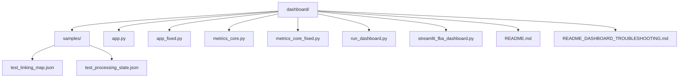
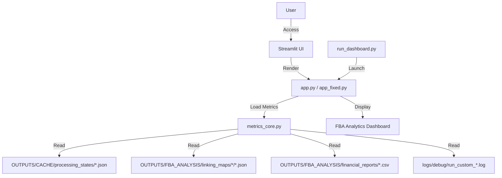
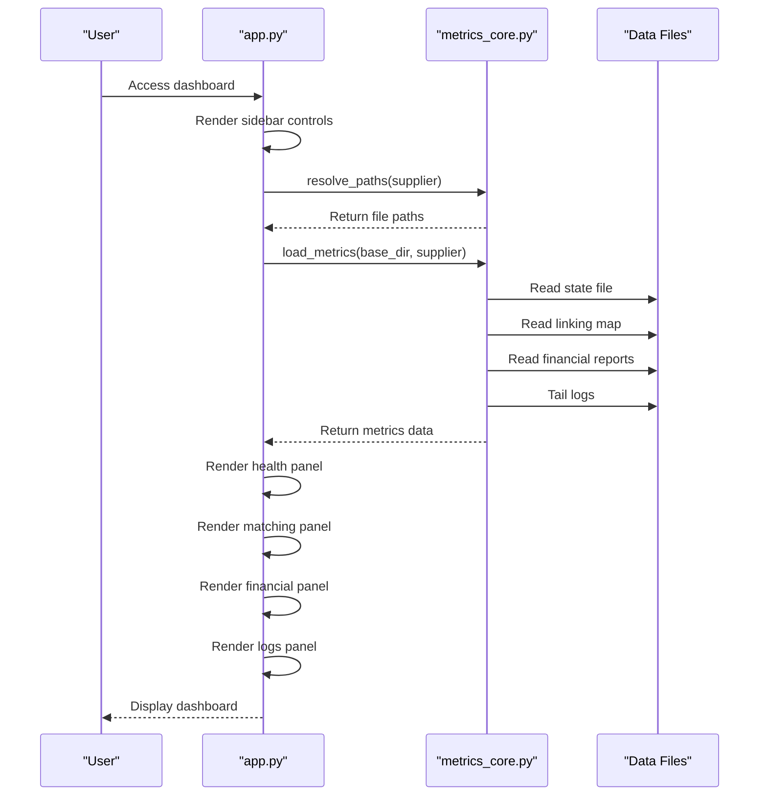
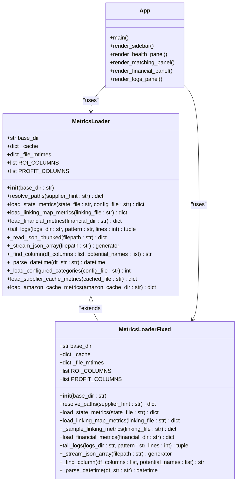
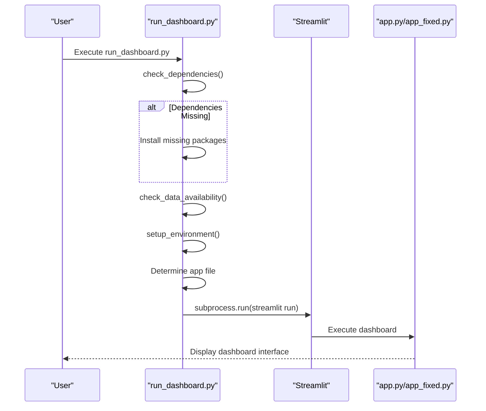
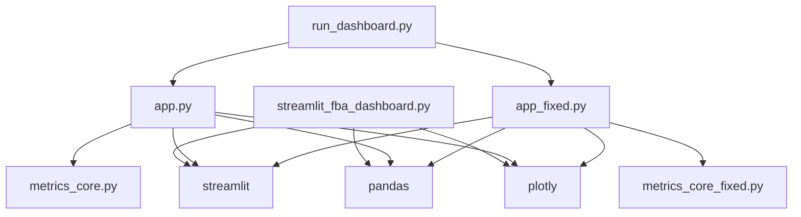

# Dashboard

<cite>
**Referenced Files in This Document**   
- [app.py](file://dashboard/app.py)
- [app_fixed.py](file://dashboard/app_fixed.py)
- [metrics_core.py](file://dashboard/metrics_core.py)
- [metrics_core_fixed.py](file://dashboard/metrics_core_fixed.py)
- [run_dashboard.py](file://dashboard/run_dashboard.py)
- [streamlit_fba_dashboard.py](file://dashboard/streamlit_fba_dashboard.py)
- [README.md](file://dashboard/README.md)
- [README_DASHBOARD_TROUBLESHOOTING.md](file://dashboard/README_DASHBOARD_TROUBLESHOOTING.md)
- [samples/test_processing_state.json](file://dashboard/samples/test_processing_state.json)
- [samples/test_linking_map.json](file://dashboard/samples/test_linking_map.json)
</cite>

## Table of Contents
1. [Introduction](#introduction)
2. [Project Structure](#project-structure)
3. [Core Components](#core-components)
4. [Architecture Overview](#architecture-overview)
5. [Detailed Component Analysis](#detailed-component-analysis)
6. [Dependency Analysis](#dependency-analysis)
7. [Performance Considerations](#performance-considerations)
8. [Troubleshooting Guide](#troubleshooting-guide)
9. [Conclusion](#conclusion)

## Introduction
The FBA Analytics Dashboard is a real-time monitoring system for the Amazon FBA Agent System, providing comprehensive insights into system health, product matching performance, and financial analytics. Built with Streamlit, the dashboard offers a user-friendly interface to visualize key metrics and monitor the processing status of supplier data extraction, Amazon product matching, and financial analysis. The system is designed to handle large datasets efficiently with chunked processing, smart caching, and robust error handling. Multiple versions of the dashboard components exist, including original and fixed versions to address path resolution, timeout, and auto-refresh issues.

## Project Structure
The dashboard component is organized in a dedicated directory with multiple files serving different purposes. The structure includes main application files, core metrics processing modules, launcher scripts, configuration files, and sample data for testing.

**Diagram sources**
- [dashboard](file://dashboard)

**Section sources**
- [dashboard](file://dashboard)

## Core Components
The dashboard consists of several core components that work together to provide real-time monitoring and analytics. The main application files (app.py and app_fixed.py) handle the Streamlit UI rendering and user interaction. The metrics_core.py module contains the core logic for loading and processing metrics from various data sources. The run_dashboard.py script serves as a launcher with dependency checking and environment setup. The streamlit_fba_dashboard.py file provides an alternative dashboard implementation with additional features. The fixed versions (app_fixed.py and metrics_core_fixed.py) address critical issues found in the original implementation, including path resolution problems and performance bottlenecks with large files.

**Section sources**
- [app.py](file://dashboard/app.py#L1-L595)
- [app_fixed.py](file://dashboard/app_fixed.py#L1-L600)
- [metrics_core.py](file://dashboard/metrics_core.py#L1-L615)
- [metrics_core_fixed.py](file://dashboard/metrics_core_fixed.py#L1-L554)
- [run_dashboard.py](file://dashboard/run_dashboard.py#L1-L142)

## Architecture Overview
The dashboard architecture follows a modular design with clear separation of concerns between data processing and UI presentation. The system reads from existing system files without requiring a database, accessing processing state, linking maps, financial reports, and logs from predefined locations. The MetricsLoader class in metrics_core.py handles all file I/O operations with efficient processing for large files. The dashboard uses Streamlit's caching mechanism to prevent unnecessary data reloads, only refreshing when file modification times change. The architecture supports multiple supplier name formats (dotted, underscored, hyphenated) through intelligent path resolution. Error handling is comprehensive, with graceful degradation when files are missing and user-friendly error messages.

**Diagram sources**
- [app.py](file://dashboard/app.py#L1-L595)
- [metrics_core.py](file://dashboard/metrics_core.py#L1-L615)
- [run_dashboard.py](file://dashboard/run_dashboard.py#L1-L142)

## Detailed Component Analysis

### Dashboard Application Analysis
The main dashboard application is implemented in app.py and its fixed version app_fixed.py. These files contain the Streamlit UI code that renders the dashboard interface with various panels for system health, matching performance, financial metrics, and logs. The application uses custom CSS for styling and organizes content into columns and expanders for better user experience. Key functions include render_health_panel, render_matching_panel, render_financial_panel, and render_logs_panel, each responsible for displaying specific metrics. The fixed version includes improved error handling, auto-detection of the base directory, and better supplier name resolution.

#### For API/Service Components:

**Diagram sources**
- [app.py](file://dashboard/app.py#L1-L595)
- [metrics_core.py](file://dashboard/metrics_core.py#L1-L615)

### Metrics Core Analysis
The metrics_core.py module is the backbone of the dashboard's data processing capabilities. It contains the MetricsLoader class that handles all file I/O operations with efficient processing for large files. The module includes methods for loading state metrics, linking map metrics, financial metrics, and log data. It implements chunked JSON parsing to handle large files without memory issues and uses smart caching to prevent unnecessary reloads. The fixed version (metrics_core_fixed.py) includes additional performance optimizations such as file size limits and sampling for very large files. The module also handles various data formats, including JSON arrays, objects, and JSONL.

#### For Object-Oriented Components:

**Diagram sources**
- [metrics_core.py](file://dashboard/metrics_core.py#L1-L615)
- [metrics_core_fixed.py](file://dashboard/metrics_core_fixed.py#L1-L554)
- [app.py](file://dashboard/app.py#L1-L595)

### Dashboard Launcher Analysis
The run_dashboard.py script serves as a launcher for the dashboard with additional functionality beyond simply starting the Streamlit application. It includes dependency checking to ensure required packages are installed, data availability verification to confirm the presence of necessary files, and environment setup. The script attempts to auto-detect the base directory and selects the appropriate dashboard app file (app_fixed.py if available, otherwise app.py). It also handles subprocess execution of Streamlit with proper configuration parameters. This launcher provides a more robust way to start the dashboard compared to direct Streamlit invocation.

#### For API/Service Components:

**Diagram sources**
- [run_dashboard.py](file://dashboard/run_dashboard.py#L1-L142)

## Dependency Analysis
The dashboard components have a clear dependency hierarchy with well-defined interfaces between modules. The main application files (app.py and app_fixed.py) depend on the metrics_core.py module for data loading functionality. The run_dashboard.py launcher script has no direct dependencies on the other dashboard files but orchestrates their execution. The streamlit_fba_dashboard.py file appears to be an alternative implementation with its own dependencies on Streamlit, pandas, and plotly. The fixed versions of the files (app_fixed.py and metrics_core_fixed.py) are designed to be drop-in replacements for their original counterparts, maintaining the same interfaces while improving performance and reliability.

**Diagram sources**
- [run_dashboard.py](file://dashboard/run_dashboard.py#L1-L142)
- [app.py](file://dashboard/app.py#L1-L595)
- [app_fixed.py](file://dashboard/app_fixed.py#L1-L600)
- [metrics_core.py](file://dashboard/metrics_core.py#L1-L615)
- [metrics_core_fixed.py](file://dashboard/metrics_core_fixed.py#L1-L554)
- [streamlit_fba_dashboard.py](file://dashboard/streamlit_fba_dashboard.py#L1-L645)

## Performance Considerations
The dashboard is designed with performance in mind, especially when handling large datasets. The metrics_core.py module implements chunked JSON parsing to process large files without loading them entirely into memory. Smart caching is used to prevent unnecessary file reads, with cache invalidation based on file modification times. The fixed versions include additional performance optimizations such as file size limits and sampling for very large files (e.g., linking maps over 10MB). The dashboard uses Streamlit's built-in caching with a 60-second TTL to balance freshness and performance. For large log files, the system reads only the last N lines to prevent UI lag. The architecture also supports efficient column inference for CSV files, automatically detecting various column name patterns for ROI and profit metrics.

## Troubleshooting Guide
The dashboard includes comprehensive troubleshooting documentation in README_DASHBOARD_TROUBLESHOOTING.md. Common issues include blank pages due to path resolution failures, timeout issues with large JSON files, and auto-refresh loops. The recommended solution is to use the fixed dashboard files (app_fixed.py and metrics_core_fixed.py) which include improved error handling and performance optimizations. The run_dashboard.py launcher script provides dependency checking and data validation before starting the dashboard. When troubleshooting, users should verify the base directory path, check that required data files exist, and ensure the supplier name matches the data directory structure. The dashboard's sidebar includes a diagnostics expander that shows resolved paths and file status, aiding in issue diagnosis.

**Section sources**
- [README_DASHBOARD_TROUBLESHOOTING.md](file://dashboard/README_DASHBOARD_TROUBLESHOOTING.md#L1-L216)
- [run_dashboard.py](file://dashboard/run_dashboard.py#L1-L142)
- [app_fixed.py](file://dashboard/app_fixed.py#L1-L600)

## Conclusion
The FBA Analytics Dashboard provides a comprehensive monitoring solution for the Amazon FBA Agent System, offering real-time insights into system health, product matching performance, and financial analytics. The architecture follows a modular design with clear separation between data processing and UI presentation, enabling efficient development and maintenance. The system handles large datasets effectively through chunked processing and smart caching, while robust error handling ensures graceful degradation when issues occur. Multiple versions of the dashboard components exist, with fixed versions addressing critical issues in the original implementation. The comprehensive troubleshooting documentation and launcher script make the system accessible to users with varying levels of technical expertise.