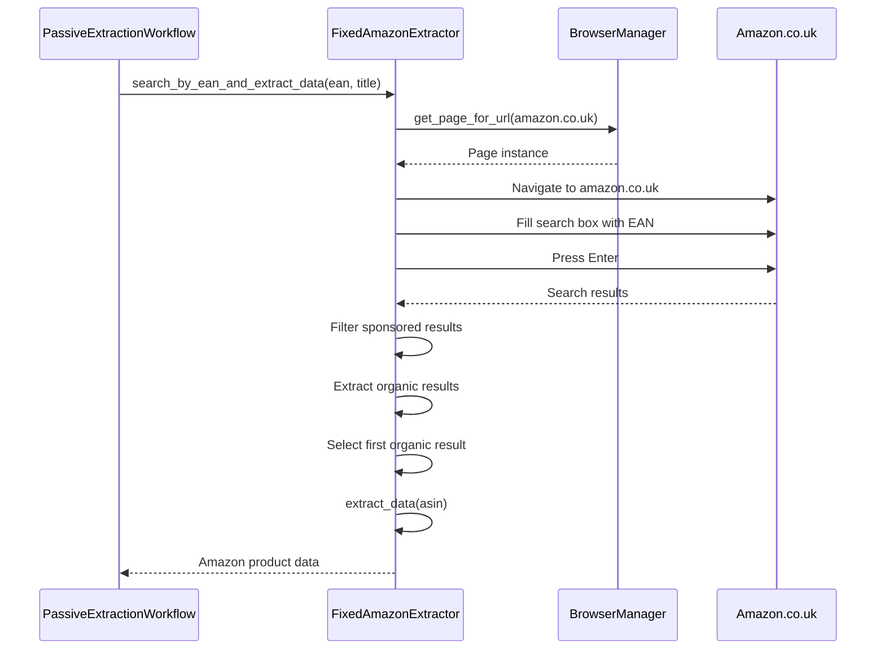
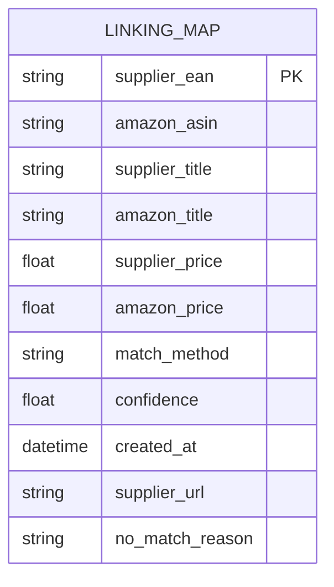
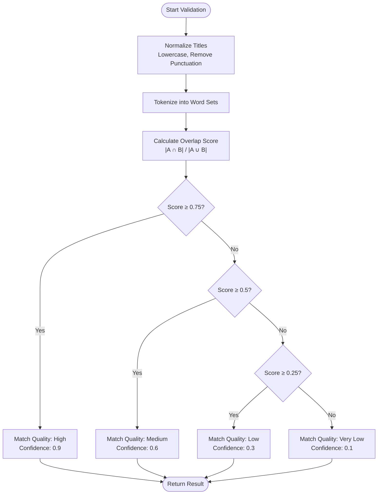

# Amazon Product Matching

<cite>
**Referenced Files in This Document**   
- [passive_extraction_workflow_latest.py](file://tools/passive_extraction_workflow_latest.py)
- [linking_map_test.json](file://OUTPUTS/FBA_ANALYSIS/linking_maps/poundwholesale.co.uk/linking_map_test.json)
- [hash_lookup_methods.py](file://hash_lookup_methods.py)
</cite>

## Table of Contents
1. [Introduction](#introduction)
2. [Core Matching Strategy](#core-matching-strategy)
3. [FixedAmazonExtractor Implementation](#fixedamazonextractor-implementation)
4. [Linking Map and Persistent Associations](#linking-map-and-persistent-associations)
5. [Product Match Validation](#product-match-validation)
6. [Integration with Financial Analysis](#integration-with-financial-analysis)
7. [Common Issues and Solutions](#common-issues-and-solutions)
8. [Performance Optimization Techniques](#performance-optimization-techniques)

## Introduction
The Amazon product matching sub-feature is a critical component of the FBA agent system, responsible for identifying corresponding products on Amazon.co.uk for supplier items from poundwholesale.co.uk. This document details the implementation of the dual-pronged matching strategy, the FixedAmazonExtractor class, and the integration between supplier product extraction, Amazon search, and financial analysis. The system employs sophisticated techniques to ensure accurate product matching while optimizing performance through caching and batch processing.

## Core Matching Strategy
The product matching system implements a dual-pronged approach that prioritizes EAN-based matching and falls back to title similarity scoring when EAN is unavailable. This strategy ensures high-confidence matches while maintaining flexibility for products without standardized identifiers.

The primary matching workflow begins with EAN-based search using the `search_by_ean_and_extract_data` method. When an EAN is present in the supplier product data, the system searches Amazon.co.uk using the EAN as the query parameter. If the EAN search fails or no EAN is available, the system automatically falls back to title-based matching by invoking `search_by_title_using_search_bar` with the supplier product title.

This fallback mechanism is implemented in the `_get_amazon_data` method, which first attempts EAN search and only proceeds to title search if the EAN search returns no valid results. The system records the search method used in the `_search_method_used` field of the product data, providing an audit trail of the matching process.

**Section sources**
- [passive_extraction_workflow_latest.py](file://tools/passive_extraction_workflow_latest.py#L2437-L2525)

## FixedAmazonExtractor Implementation
The FixedAmazonExtractor class extends the base AmazonExtractor to provide specialized functionality for EAN-based product matching on Amazon.co.uk. This class implements the `search_by_ean_and_extract_data` method, which orchestrates the entire EAN search and data extraction process.

The method begins by connecting to the browser through the centralized BrowserManager singleton, ensuring consistent browser state across the application. It then navigates to Amazon.co.uk and inputs the EAN into the search bar, simulating user behavior to avoid detection. The search results are processed using multiple selectors to identify product tiles, with robust error handling to accommodate Amazon's dynamic page structure.

A critical feature of this implementation is the filtering of sponsored results. The system employs a multi-layered detection strategy that examines:
- Visible "Sponsored" text badges
- Aria-label attributes indicating sponsored content
- Data attributes specific to sponsored results
- Known ad-specific CSS classes
- Text content containing ad indicators

Organic results are prioritized, and sponsored products are excluded from consideration. When multiple organic results are found, the system selects the first result based on Amazon's relevance ranking rather than applying title similarity scoring, as EAN matches are considered authoritative.



**Diagram sources**
- [passive_extraction_workflow_latest.py](file://tools/passive_extraction_workflow_latest.py#L625-L795)

**Section sources**
- [passive_extraction_workflow_latest.py](file://tools/passive_extraction_workflow_latest.py#L625-L795)

## Linking Map and Persistent Associations
The linking map in `linking_maps/poundwholesale.co.uk` maintains persistent associations between supplier products and Amazon ASINs, serving as the system's memory for product matching decisions. This JSON file contains entries that map supplier EANs to Amazon ASINs along with metadata about the match.

Each entry in the linking map includes:
- `supplier_ean`: The EAN from the supplier product
- `amazon_asin`: The corresponding ASIN on Amazon.co.uk
- `supplier_title` and `amazon_title`: Product titles for reference and validation
- `supplier_price` and `amazon_price`: Pricing information
- `match_method`: The method used for matching (EAN, title, or none)
- `confidence`: Confidence score of the match
- `created_at`: Timestamp of when the association was created
- `supplier_url`: Source URL of the supplier product

The linking map prevents redundant processing by allowing the system to skip Amazon analysis for products that have already been matched. Before initiating a new search, the system checks the linking map using the HashLookupOptimizer for O(1) performance. If a match exists, the previously retrieved Amazon data is reused, significantly improving processing speed.

For products that cannot be matched, the system creates "no-match" entries with `match_method: "none"` and includes a `no_match_reason` field to document why the matching failed. This prevents infinite reprocessing loops and provides valuable diagnostic information.



**Diagram sources**
- [linking_map_test.json](file://OUTPUTS/FBA_ANALYSIS/linking_maps/poundwholesale.co.uk/linking_map_test.json)

**Section sources**
- [passive_extraction_workflow_latest.py](file://tools/passive_extraction_workflow_latest.py#L2400-L2600)

## Product Match Validation
The system validates product matches using title overlap scoring, particularly in the fallback title-based matching scenario. The `_validate_product_match` function calculates a confidence score based on the word overlap between supplier and Amazon product titles.

The validation process uses configurable thresholds to determine match quality:
- High similarity (≥0.75): High confidence (0.9)
- Medium similarity (≥0.5): Medium confidence (0.6)
- Low similarity (≥0.25): Low confidence (0.3)
- Below threshold: Very low confidence (0.1)

The `_overlap_score` method tokenizes both titles into word sets, normalizes them by removing punctuation and converting to lowercase, then calculates the Jaccard similarity coefficient as the ratio of intersection to union of the word sets. This approach is robust to word order variations and focuses on shared vocabulary.

The validation function returns a comprehensive result object containing the match quality, confidence score, and raw overlap score, which is used to make decisions about whether to accept the match and proceed with financial analysis.



**Diagram sources**
- [passive_extraction_workflow_latest.py](file://tools/passive_extraction_workflow_latest.py#L6470-L6503)

**Section sources**
- [passive_extraction_workflow_latest.py](file://tools/passive_extraction_workflow_latest.py#L6470-L6503)

## Integration with Financial Analysis
The product matching system is tightly integrated with the financial analysis pipeline, forming a critical link between product identification and profitability assessment. Once a product match is validated, the system passes the combined supplier and Amazon data to the FBA_Financial_calculator for ROI and profit margin analysis.

The integration occurs in the main processing loop of the PassiveExtractionWorkflow class, where successful Amazon data retrieval triggers the financial calculation process. The calculator uses Amazon's FBA fee structure, including fulfillment fees, referral fees, and storage costs, to determine net profit and return on investment.

Products that meet the configured profitability criteria (minimum ROI percentage and minimum profit per unit) are added to the list of profitable results, while others are filtered out. This integration ensures that only genuinely profitable products are recommended, aligning the technical matching process with business objectives.

The linking map serves as the bridge between these systems, storing the matched product data in a format that can be easily consumed by the financial analyzer. The atomic write pattern used for updating the linking map ensures data integrity even if the process is interrupted.

**Section sources**
- [passive_extraction_workflow_latest.py](file://tools/passive_extraction_workflow_latest.py#L1970-L2316)

## Common Issues and Solutions
The product matching system addresses several common challenges in e-commerce product matching:

**False Matches**: The system mitigates false matches through sponsored result filtering and title similarity validation. By excluding sponsored products and requiring minimum title overlap, the system reduces the risk of matching to incorrect or irrelevant products.

**Sponsored Product Interference**: The multi-layered sponsored detection system examines text badges, aria-labels, data attributes, CSS classes, and ad indicators to reliably identify and filter sponsored results. This prevents the system from selecting promoted products that may not represent the best organic match.

**Missing EANs**: When EANs are unavailable, the system falls back to title-based matching with similarity scoring. For products without EANs, the system uses a sanitized version of the product title as the filename identifier in the Amazon cache, enabling retrieval and reuse of previously matched data.

**Authentication Issues**: The system includes authentication fallback mechanisms that detect login requirements and trigger re-authentication through the SupplierAuthenticationService. This ensures uninterrupted operation even when supplier site sessions expire.

**State Corruption**: The EnhancedStateManager with atomic write operations prevents state corruption during interruptions. The system can resume from the last processed index, avoiding duplicate processing and data inconsistencies.

**Section sources**
- [passive_extraction_workflow_latest.py](file://tools/passive_extraction_workflow_latest.py#L992-L1020)

## Performance Optimization Techniques
The system employs several performance optimization techniques to handle large product catalogs efficiently:

**O(1) Hash Lookups**: The HashLookupOptimizer enables constant-time lookups in the linking map, replacing linear searches that would scale poorly with large datasets. This optimization provides approximately 3,650x performance improvement for linking map queries.

**Batched Processing**: Supplier products are processed in configurable batches, with periodic saves of the linking map and processing state. This batched approach provides memory management benefits and allows for progress tracking and resumption.

**Cached Data Reuse**: The system extensively caches Amazon product data to avoid redundant API calls and page loads. When a product has been previously matched, the cached data is reused instead of reprocessing.

**Browser Reuse**: The FixedAmazonExtractor reuses existing browser pages through the BrowserManager singleton, maintaining Chrome extension functionality and reducing the overhead of browser initialization.

**Atomic Persistence**: Critical state files are saved using an atomic write pattern (write to temp file, then rename), ensuring data integrity even if the process is interrupted during a save operation.

**Parallelizable Design**: The architecture supports parallel processing of product batches, though the current implementation processes sequentially to maintain state consistency.

```mermaid
graph TD
A[Performance Optimizations] --> B[O(1) Hash Lookups]
A --> C[Batched Processing]
A --> D[Cached Data Reuse]
A --> E[Browser Reuse]
A --> F[Atomic Persistence]
B --> G[HashLookupOptimizer]
C --> H[Batch Size Configuration]
D --> I[Amazon Cache Directory]
E --> J[BrowserManager Singleton]
F --> K[Atomic File Operations]
```

**Diagram sources**
- [hash_lookup_methods.py](file://hash_lookup_methods.py)

**Section sources**
- [passive_extraction_workflow_latest.py](file://tools/passive_extraction_workflow_latest.py#L2400-L2600)