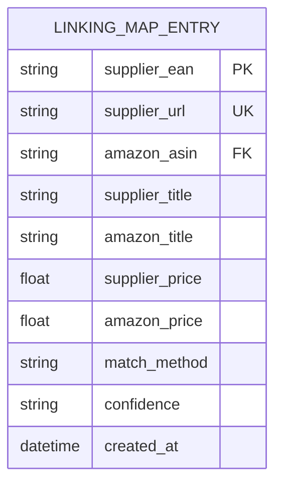
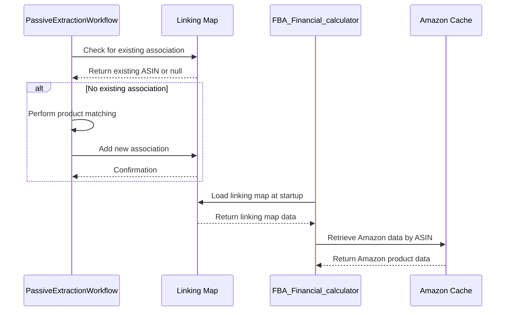
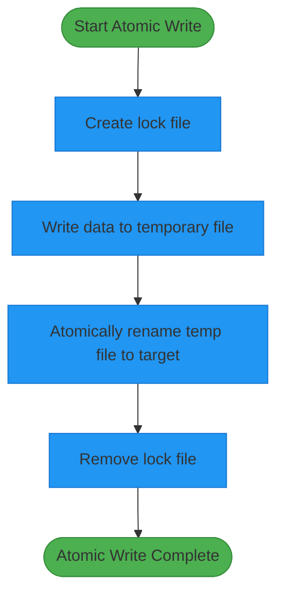
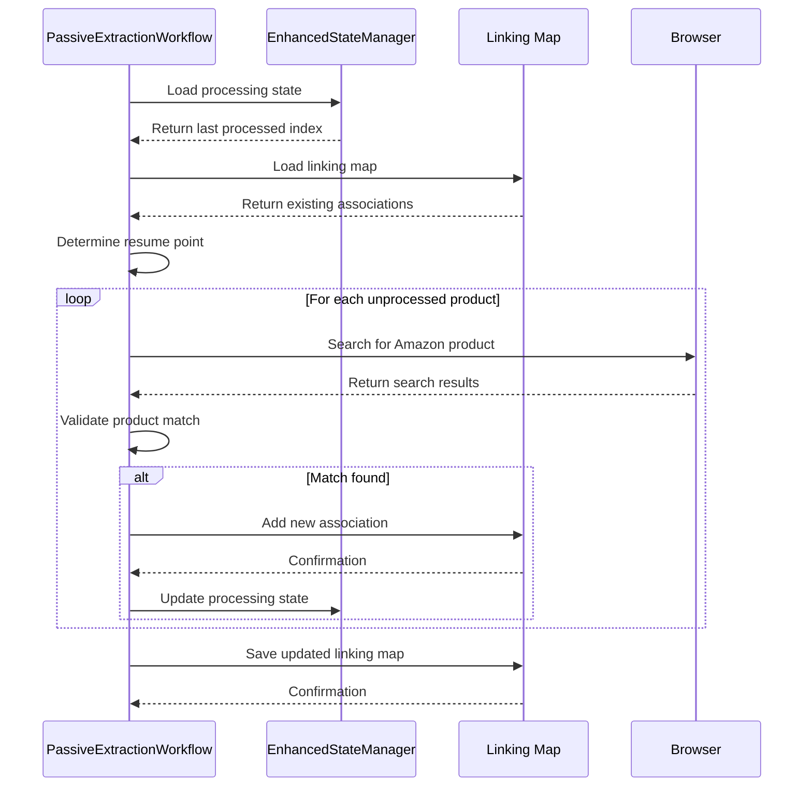
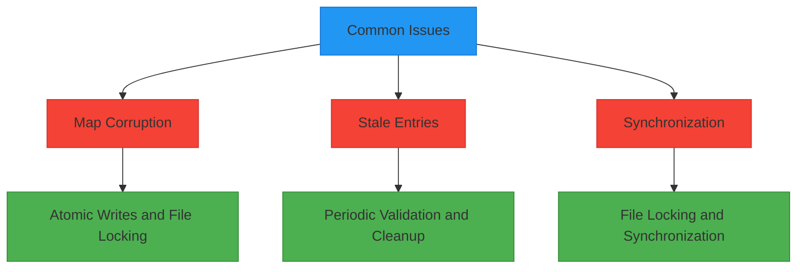
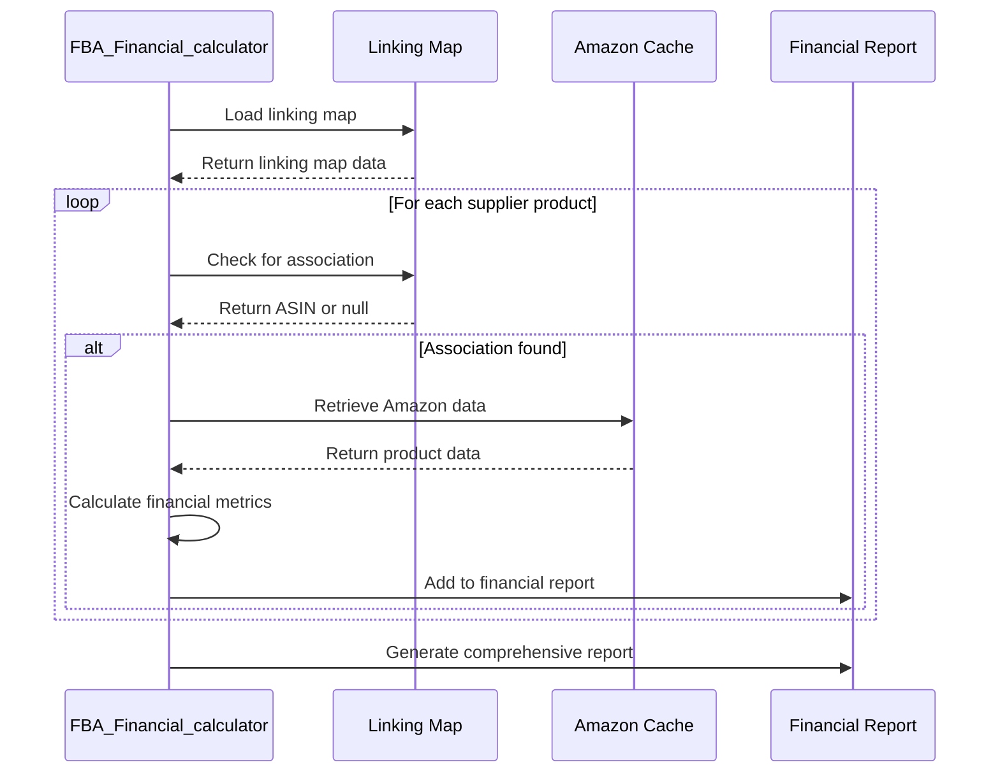

# Linking Map Persistence

<cite>
**Referenced Files in This Document**   
- [FBA_Financial_calculator.py](file://tools/FBA_Financial_calculator.py)
- [passive_extraction_workflow_latest.py](file://tools/passive_extraction_workflow_latest.py)
- [atomic_file_operations.py](file://utils/atomic_file_operations.py)
- [linking_map_test.json](file://OUTPUTS/FBA_ANALYSIS/linking_maps/poundwholesale.co.uk/linking_map_test.json)
- [REFERENCE_linking_map.json](file://OUTPUTS/FBA_ANALYSIS/linking_maps/poundwholesale.co.uk/ARCHIVED/REFERENCE_linking_map.json)
</cite>

## Table of Contents
1. [Introduction](#introduction)
2. [Linking Map Structure and Format](#linking-map-structure-and-format)
3. [Persistent Association Mechanism](#persistent-association-mechanism)
4. [Atomic Write Implementation](#atomic-write-implementation)
5. [Resumable Operations and State Management](#resumable-operations-and-state-management)
6. [Performance Benefits and Lookup Efficiency](#performance-benefits-and-lookup-efficiency)
7. [Common Issues and Solutions](#common-issues-and-solutions)
8. [Integration with Financial Analysis](#integration-with-financial-analysis)
9. [Conclusion](#conclusion)

## Introduction

The linking map persistence mechanism is a critical component of the Amazon FBA Agent System, designed to maintain durable associations between supplier products and Amazon ASINs across processing sessions. This system enables resumable operations, prevents redundant searches, and significantly improves performance by replacing expensive browser operations with O(1) lookups. The linking map serves as a persistent cache that stores the results of product matching operations, allowing the system to resume from where it left off after interruptions and avoid reprocessing previously analyzed products.

**Section sources**
- [passive_extraction_workflow_latest.py](file://tools/passive_extraction_workflow_latest.py#L1-L100)

## Linking Map Structure and Format

The linking map is stored as a JSON file in the `OUTPUTS/FBA_ANALYSIS/linking_maps/poundwholesale.co.uk/` directory. Each entry in the linking map represents a persistent association between a supplier product and an Amazon product. The structure of a linking map entry includes the following fields:

- **supplier_ean**: The EAN (European Article Number) of the supplier product, used as a primary identifier for matching.
- **supplier_url**: The URL of the supplier product page, used as a secondary identifier when EAN matching is not possible.
- **amazon_asin**: The Amazon Standard Identification Number of the matched product, which serves as the key for retrieving Amazon product data.
- **supplier_title**: The title of the supplier product as listed on the supplier's website.
- **amazon_title**: The title of the matched Amazon product for verification and reporting purposes.
- **supplier_price**: The price of the supplier product, used in financial calculations.
- **amazon_price**: The current price of the Amazon product, used for profitability analysis.
- **match_method**: The method used to establish the association (e.g., "EAN", "URL", "title").
- **confidence**: The confidence level of the match ("high", "medium", "low").
- **created_at**: The timestamp when the association was created, in ISO 8601 format.

The linking map is structured as a JSON array of objects, with each object representing a single product association. This format allows for efficient appending of new entries and straightforward parsing by the system components that utilize the linking map.



**Diagram sources**
- [REFERENCE_linking_map.json](file://OUTPUTS/FBA_ANALYSIS/linking_maps/poundwholesale.co.uk/ARCHIVED/REFERENCE_linking_map.json#L1-L10)
- [linking_map_test.json](file://OUTPUTS/FBA_ANALYSIS/linking_maps/poundwholesale.co.uk/linking_map_test.json#L1-L10)

**Section sources**
- [REFERENCE_linking_map.json](file://OUTPUTS/FBA_ANALYSIS/linking_maps/poundwholesale.co.uk/ARCHIVED/REFERENCE_linking_map.json)
- [linking_map_test.json](file://OUTPUTS/FBA_ANALYSIS/linking_maps/poundwholesale.co.uk/linking_map_test.json)

## Persistent Association Mechanism

The persistent association mechanism is implemented through the integration of the linking map with both the `FBA_Financial_calculator.py` module and the `PassiveExtractionWorkflow`. When a supplier product is successfully matched to an Amazon product, an entry is created in the linking map and stored persistently on disk. This entry is then used in subsequent processing sessions to quickly retrieve the Amazon product data without the need for a new search.

The `FBA_Financial_calculator.py` module reads the linking map at startup to populate an in-memory cache, which is used to perform O(1) lookups during financial analysis. When a supplier product is processed, the calculator first checks the linking map for an existing association using either the supplier EAN or URL. If a match is found, the corresponding Amazon ASIN is retrieved, and the Amazon product data is loaded from the local cache. This eliminates the need for a browser-based search, significantly reducing processing time and resource usage.

The `PassiveExtractionWorkflow` updates the linking map during the main processing loop whenever a new product association is established. This update process is designed to be atomic and thread-safe, ensuring data integrity even in the event of system interruptions. The workflow also uses the linking map to prevent redundant searches by checking for existing associations before attempting to match a supplier product.



**Diagram sources**
- [FBA_Financial_calculator.py](file://tools/FBA_Financial_calculator.py#L100-L200)
- [passive_extraction_workflow_latest.py](file://tools/passive_extraction_workflow_latest.py#L2000-L2100)

**Section sources**
- [FBA_Financial_calculator.py](file://tools/FBA_Financial_calculator.py#L50-L300)
- [passive_extraction_workflow_latest.py](file://tools/passive_extraction_workflow_latest.py#L2318-L2525)

## Atomic Write Implementation

The linking map persistence mechanism employs atomic writes to ensure data integrity and prevent corruption in the event of system failures. This is implemented using the `atomic_file_operations.py` module, which provides thread-safe, atomic file operations with cross-platform file locking.

The atomic write process follows a two-step approach:
1. Write the updated linking map data to a temporary file.
2. Atomically rename the temporary file to replace the original linking map file.

This approach ensures that the linking map file is always in a consistent state, as the rename operation is atomic on both Unix and Windows systems. The `atomic_write_json` function in the `AtomicFileOperations` class handles this process, including the creation of a lock file to prevent concurrent access from multiple processes.

The `PassiveExtractionWorkflow` uses this atomic write mechanism to periodically save the linking map during the main processing loop. The save operation is performed in batches, with the batch size controlled by the `linking_map_batch_size` configuration parameter. This balances the need for data durability with the performance overhead of frequent disk operations.



**Diagram sources**
- [atomic_file_operations.py](file://utils/atomic_file_operations.py#L50-L150)
- [passive_extraction_workflow_latest.py](file://tools/passive_extraction_workflow_latest.py#L2500-L2600)

**Section sources**
- [atomic_file_operations.py](file://utils/atomic_file_operations.py)
- [passive_extraction_workflow_latest.py](file://tools/passive_extraction_workflow_latest.py#L2500-L2600)

## Resumable Operations and State Management

The linking map persistence mechanism enables resumable operations by maintaining a complete record of all product associations across processing sessions. When the system is restarted, it loads the linking map from disk and uses it to determine which products have already been processed and which ones require further analysis.

The `PassiveExtractionWorkflow` implements resumable operations by integrating the linking map with the `EnhancedStateManager`. At startup, the workflow loads the linking map and uses it to identify the last processed product, allowing it to resume from that point. This prevents redundant processing of products that have already been matched and analyzed.

The workflow also uses the linking map to manage the state of the processing pipeline. When a product is successfully matched and analyzed, its URL is marked as processed in the state manager, and the association is added to the linking map. This dual tracking ensures that even if the state file is corrupted or lost, the linking map can be used to reconstruct the processing state.

The resumable operations feature is particularly valuable for long-running processing tasks that may be interrupted due to system failures, network issues, or manual intervention. By leveraging the persistent linking map, the system can resume processing without losing progress or duplicating work.



**Diagram sources**
- [passive_extraction_workflow_latest.py](file://tools/passive_extraction_workflow_latest.py#L1970-L2316)
- [FBA_Financial_calculator.py](file://tools/FBA_Financial_calculator.py#L300-L400)

**Section sources**
- [passive_extraction_workflow_latest.py](file://tools/passive_extraction_workflow_latest.py#L1970-L2316)
- [FBA_Financial_calculator.py](file://tools/FBA_Financial_calculator.py#L300-L400)

## Performance Benefits and Lookup Efficiency

The linking map persistence mechanism provides significant performance benefits by enabling O(1) lookups for product associations, eliminating the need for expensive browser-based searches. This optimization reduces processing time and resource usage, allowing the system to analyze a larger number of products in a shorter period.

The performance benefits are particularly evident in scenarios where the system is restarted or interrupted. Without the linking map, the system would need to reprocess all products from the beginning, performing a browser-based search for each one. With the linking map, the system can quickly retrieve the Amazon product data for previously matched products, focusing its resources on new or unmatched products.

The O(1) lookup efficiency is achieved through the use of hash-based data structures in memory. When the linking map is loaded at startup, it is converted into a hash map with the supplier EAN as the key. This allows for constant-time lookups, regardless of the size of the linking map. The hash map is then used throughout the processing session to quickly retrieve product associations.

The performance benefits of the linking map are further enhanced by the atomic write mechanism, which allows for periodic saves without blocking the main processing loop. This ensures that the system can continue processing products while the linking map is being saved in the background.

```mermaid
graph TD
A[Without Linking Map] --> B[Browser Search for Each Product]
B --> C[High Processing Time]
C --> D[High Resource Usage]
D --> E[Slow Analysis]
F[With Linking Map] --> G[O(1) Lookup for Matched Products]
G --> H[Low Processing Time]
H --> I[Low Resource Usage]
I --> J[Fast Analysis]
style A fill:#f44336,stroke:#d32f2f
style B fill:#ff9800,stroke:#f57c00
style C fill:#ff9800,stroke:#f57c00
style D fill:#ff9800,stroke:#f57c00
style E fill:#f44336,stroke:#d32f2f
style F fill:#4CAF50,stroke:#388E3C
style G fill:#8bc34a,stroke:#689f38
style H fill:#8bc34a,stroke:#689f38
style I fill:#8bc34a,stroke:#689f38
style J fill:#4CAF50,stroke:#388E3C
```

**Diagram sources**
- [FBA_Financial_calculator.py](file://tools/FBA_Financial_calculator.py#L200-L300)
- [passive_extraction_workflow_latest.py](file://tools/passive_extraction_workflow_latest.py#L2437-L2525)

**Section sources**
- [FBA_Financial_calculator.py](file://tools/FBA_Financial_calculator.py#L200-L300)
- [passive_extraction_workflow_latest.py](file://tools/passive_extraction_workflow_latest.py#L2437-L2525)

## Common Issues and Solutions

The linking map persistence mechanism is designed to handle several common issues that can arise during long-running processing tasks. These issues include map corruption, stale entries, and synchronization between multiple processing instances.

**Map Corruption**: To prevent map corruption, the system uses atomic writes and file locking. The `atomic_file_operations.py` module ensures that the linking map is always in a consistent state by writing updates to a temporary file and then atomically renaming it to replace the original file. This approach prevents partial writes and ensures that the linking map is not left in an inconsistent state if the system fails during a save operation.

**Stale Entries**: Stale entries in the linking map are handled through periodic validation and cleanup. The system can be configured to revalidate product associations after a certain period or when significant changes are detected in the supplier or Amazon product data. This ensures that the linking map remains accurate and up-to-date.

**Synchronization Between Multiple Instances**: When multiple processing instances are running concurrently, synchronization is achieved through file locking. The `atomic_file_operations.py` module uses lock files to prevent multiple instances from writing to the linking map simultaneously. This ensures that the linking map remains consistent and prevents race conditions.

The system also includes mechanisms for backup and recovery in case of linking map corruption. The `backup_experiment_files` function can be used to create backups of the linking map before major processing runs, allowing for easy recovery if needed.



**Diagram sources**
- [atomic_file_operations.py](file://utils/atomic_file_operations.py#L1-L50)
- [passive_extraction_workflow_latest.py](file://tools/passive_extraction_workflow_latest.py#L100-L200)

**Section sources**
- [atomic_file_operations.py](file://utils/atomic_file_operations.py)
- [passive_extraction_workflow_latest.py](file://tools/passive_extraction_workflow_latest.py#L100-L200)

## Integration with Financial Analysis

The linking map persistence mechanism is tightly integrated with the financial analysis process in the `FBA_Financial_calculator.py` module. When a supplier product is processed, the calculator first checks the linking map for an existing association. If a match is found, the corresponding Amazon ASIN is retrieved, and the Amazon product data is loaded from the local cache.

This integration enables the financial analysis to be performed quickly and efficiently, without the need for a browser-based search. The calculator uses the supplier price from the supplier product data and the Amazon price from the Amazon product data to calculate key financial metrics such as ROI, net profit, and breakeven point.

The linking map also enables the calculator to generate comprehensive financial reports for all cached products, including those that were matched in previous processing sessions. This allows for a complete analysis of the supplier's product catalog, regardless of when the products were processed.

The integration between the linking map and the financial analysis process is a key factor in the system's ability to identify profitable products quickly and accurately. By eliminating the need for redundant searches and enabling O(1) lookups, the linking map significantly improves the performance and efficiency of the financial analysis process.



**Diagram sources**
- [FBA_Financial_calculator.py](file://tools/FBA_Financial_calculator.py#L400-L500)
- [passive_extraction_workflow_latest.py](file://tools/passive_extraction_workflow_latest.py#L2600-L2700)

**Section sources**
- [FBA_Financial_calculator.py](file://tools/FBA_Financial_calculator.py#L400-L500)
- [passive_extraction_workflow_latest.py](file://tools/passive_extraction_workflow_latest.py#L2600-L2700)

## Conclusion

The linking map persistence mechanism is a critical component of the Amazon FBA Agent System, providing durable associations between supplier products and Amazon ASINs across processing sessions. By enabling resumable operations, preventing redundant searches, and improving performance through O(1) lookups, the linking map significantly enhances the efficiency and reliability of the product sourcing workflow.

The implementation of atomic writes ensures data integrity and prevents corruption, while the integration with the financial analysis process enables quick and accurate profitability calculations. The system's ability to handle common issues such as map corruption, stale entries, and synchronization between multiple instances further enhances its robustness and reliability.

Overall, the linking map persistence mechanism is a key enabler of the system's ability to identify profitable products quickly and efficiently, making it an essential component of the Amazon FBA Agent System.