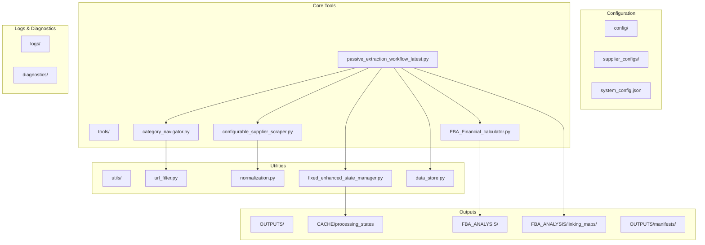
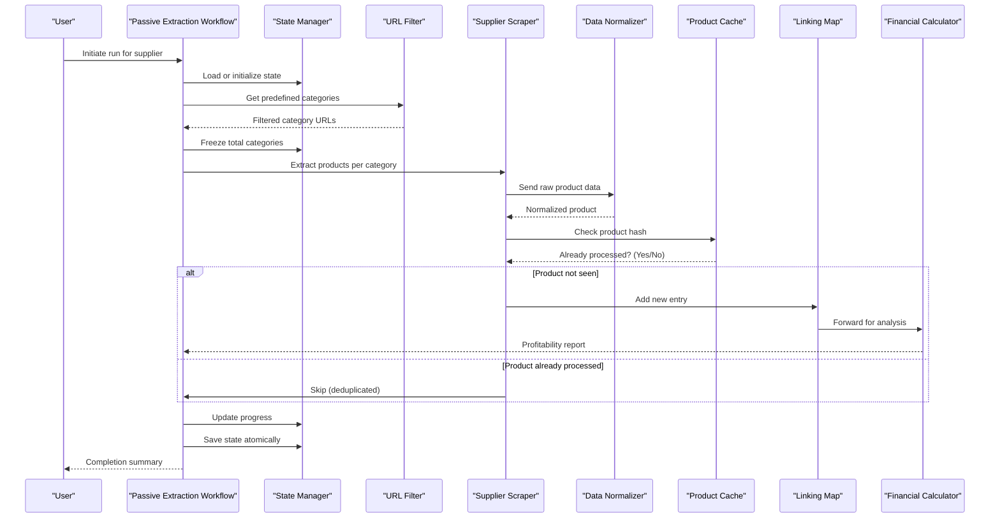
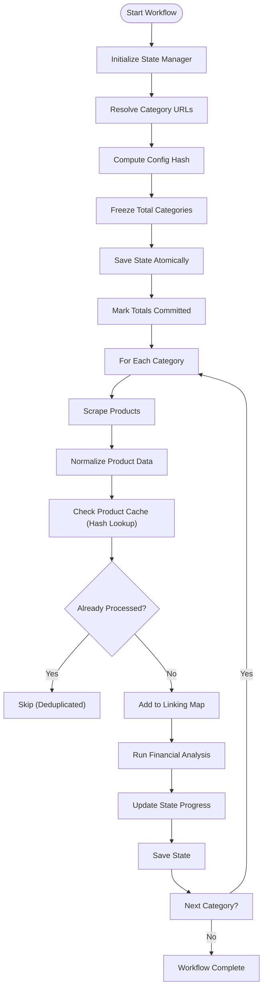
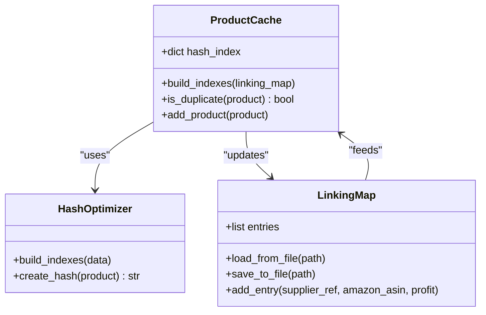
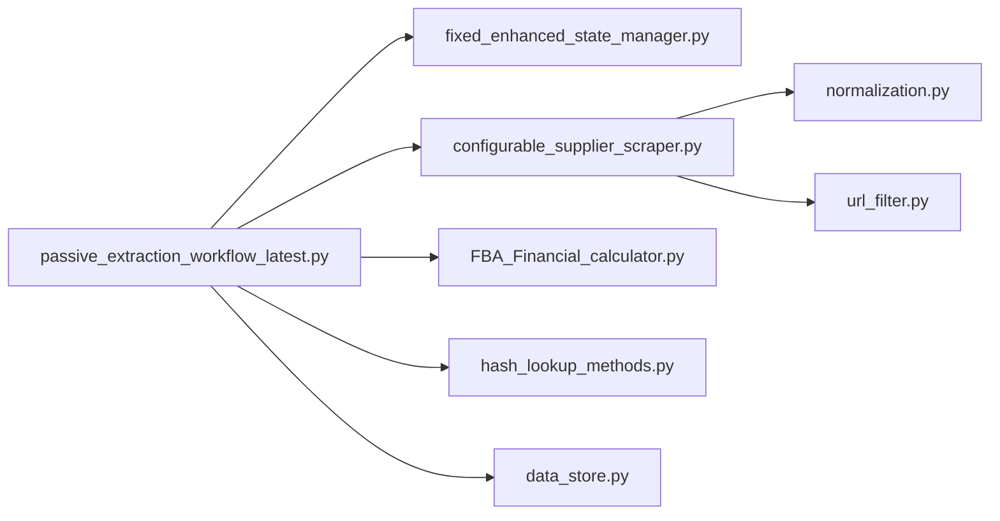

# Data Processing Workflow

<cite>
**Referenced Files in This Document**   
- [passive_extraction_workflow_latest.py](file://tools/passive_extraction_workflow_latest.py)
- [FBA_Financial_calculator.py](file://tools/FBA_Financial_calculator.py)
- [url_filter.py](file://utils/url_filter.py)
- [fixed_enhanced_state_manager.py](file://utils/fixed_enhanced_state_manager.py)
- [hash_lookup_methods.py](file://hash_lookup_methods.py)
- [category_navigator.py](file://tools/category_navigator.py)
- [configurable_supplier_scraper.py](file://tools/configurable_supplier_scraper.py)
- [normalization.py](file://utils/normalization.py)
- [data_store.py](file://utils/data_store.py)
</cite>

## Table of Contents
1. [Introduction](#introduction)
2. [Project Structure](#project-structure)
3. [Core Components](#core-components)
4. [Architecture Overview](#architecture-overview)
5. [Detailed Component Analysis](#detailed-component-analysis)
6. [Dependency Analysis](#dependency-analysis)
7. [Performance Considerations](#performance-considerations)
8. [Troubleshooting Guide](#troubleshooting-guide)
9. [Conclusion](#conclusion)

## Introduction
This document provides a comprehensive overview of the data processing workflow for the Amazon FBA Agent System, focusing on the end-to-end product sourcing process. The workflow spans from supplier website crawling to financial analysis, with an emphasis on passive extraction, state management, and data integrity. The system is designed to efficiently extract, deduplicate, and analyze products from supplier websites such as poundwholesale.co.uk, ensuring reliable downstream financial evaluation. Key components include URL filtering, product caching, hash-based deduplication, linking maps, and integration with Amazon matching and profitability analysis.

The workflow is orchestrated through the `passive_extraction_workflow_latest.py` script, which manages state, coordinates component execution, and ensures processing continuity across interruptions. This document details the sequence of operations, data flow, and optimization strategies employed throughout the system.

## Project Structure
The project is organized into modular directories that separate configuration, processing logic, utilities, and output artifacts. The core workflow is driven by tools in the `tools/` directory, while state and cache data are stored in designated output folders. Configuration files define supplier-specific behaviors and system-wide settings.

**Diagram sources**
- [passive_extraction_workflow_latest.py](file://tools/passive_extraction_workflow_latest.py)
- [category_navigator.py](file://tools/category_navigator.py)
- [configurable_supplier_scraper.py](file://tools/configurable_supplier_scraper.py)
- [FBA_Financial_calculator.py](file://tools/FBA_Financial_calculator.py)

**Section sources**
- [tools](file://tools)
- [utils](file://utils)
- [config](file://config)
- [OUTPUTS](file://OUTPUTS)

## Core Components
The data processing workflow is built around several core components that handle distinct stages of product sourcing. These include category navigation, URL filtering, supplier scraping, data normalization, product caching, linking map management, and financial analysis. Each component plays a critical role in ensuring accurate, efficient, and deduplicated data flow.

The `passive_extraction_workflow_latest.py` orchestrates these components, managing execution order, state persistence, and error recovery. The `state_manager` ensures continuity across runs, while the `linking_map` enables O(1) lookups for duplicate detection. The `url_filter` pre-processes URLs to avoid redundant crawling, and the `normalization` module standardizes product data for consistent downstream processing.

**Section sources**
- [passive_extraction_workflow_latest.py](file://tools/passive_extraction_workflow_latest.py#L1902-L1927)
- [url_filter.py](file://utils/url_filter.py)
- [normalization.py](file://utils/normalization.py)
- [data_store.py](file://utils/data_store.py)

## Architecture Overview
The system follows a stateful, event-driven architecture centered around the passive extraction workflow. It begins with category URL resolution, proceeds through batched product extraction, applies deduplication via hash-based lookups, and concludes with financial analysis using Amazon marketplace data.

The workflow is designed to be resume-capable, leveraging atomic state saving and configuration hashing to detect changes in supplier structure. Processing state is persisted in JSON files under `CACHE/processing_states`, allowing the system to continue from the last completed category in case of interruption.

**Diagram sources**
- [passive_extraction_workflow_latest.py](file://tools/passive_extraction_workflow_latest.py)
- [fixed_enhanced_state_manager.py](file://utils/fixed_enhanced_state_manager.py)
- [url_filter.py](file://utils/url_filter.py)
- [configurable_supplier_scraper.py](file://tools/configurable_supplier_scraper.py)
- [normalization.py](file://utils/normalization.py)

## Detailed Component Analysis

### Passive Extraction Workflow
The `passive_extraction_workflow_latest.py` script serves as the main orchestrator, coordinating all stages of product sourcing. It initializes the state manager, resolves category URLs, and iterates through each category to extract products. The workflow implements resume logic by tracking completed categories and persisting state after each step.

A key feature is the use of configuration hashing to detect changes in supplier structure. If the category list changes, the system invalidates previous state and restarts processing to ensure completeness.

**Diagram sources**
- [passive_extraction_workflow_latest.py](file://tools/passive_extraction_workflow_latest.py#L1902-L1927)

**Section sources**
- [passive_extraction_workflow_latest.py](file://tools/passive_extraction_workflow_latest.py)

### URL Filtering and Category Navigation
The system uses predefined category URLs loaded from supplier configuration files (e.g., `poundwholesale-co-uk.json`). The `category_navigator.py` resolves these URLs and applies filtering logic via `url_filter.py` to eliminate duplicates or irrelevant links before processing.

URL filtering ensures that only valid, unique category pages are scraped, reducing unnecessary network requests and improving efficiency.

**Section sources**
- [category_navigator.py](file://tools/category_navigator.py)
- [url_filter.py](file://utils/url_filter.py)

### Supplier Scraping and Data Normalization
Product data is extracted using `configurable_supplier_scraper.py`, which dynamically adapts to supplier HTML structures based on configuration rules. Extracted data undergoes normalization via `normalization.py`, which standardizes fields like price, title, and description.

Normalization ensures consistency across suppliers and prepares data for deduplication and financial analysis.

**Section sources**
- [configurable_supplier_scraper.py](file://tools/configurable_supplier_scraper.py)
- [normalization.py](file://utils/normalization.py)

### Product Caching and Deduplication
Products are deduplicated using hash-based lookups against the product cache. The system computes a unique hash for each product (based on key attributes) and checks it against an in-memory hash index built from the linking map.

This enables O(1) lookup performance, allowing efficient detection of duplicates even across different categories.

**Diagram sources**
- [hash_lookup_methods.py](file://hash_lookup_methods.py)
- [passive_extraction_workflow_latest.py](file://tools/passive_extraction_workflow_latest.py#L3203-L3233)

**Section sources**
- [hash_lookup_methods.py](file://hash_lookup_methods.py)
- [passive_extraction_workflow_latest.py](file://tools/passive_extraction_workflow_latest.py)

### Financial Analysis and Linking Map
The `FBA_Financial_calculator.py` evaluates product profitability using Amazon FBA fees, shipping costs, and marketplace pricing. Results are stored in the linking map, which maintains a record of supplier product references mapped to Amazon ASINs and calculated profits.

The linking map is saved in JSON format under `FBA_ANALYSIS/linking_maps/` and serves as the primary output for investment screening.

**Section sources**
- [FBA_Financial_calculator.py](file://tools/FBA_Financial_calculator.py#L79-L106)

## Dependency Analysis
The system exhibits a layered dependency structure where higher-level components depend on lower-level utilities. The passive extraction workflow depends on the state manager, scraper, and financial calculator. The scraper depends on normalization and URL filtering. The linking map depends on hash optimization for fast lookups.

External dependencies are minimized, with core logic contained within the codebase. Configuration files drive behavior without requiring code changes.

**Diagram sources**
- [passive_extraction_workflow_latest.py](file://tools/passive_extraction_workflow_latest.py)
- [configurable_supplier_scraper.py](file://tools/configurable_supplier_scraper.py)
- [normalization.py](file://utils/normalization.py)
- [url_filter.py](file://utils/url_filter.py)

**Section sources**
- [passive_extraction_workflow_latest.py](file://tools/passive_extraction_workflow_latest.py)
- [configurable_supplier_scraper.py](file://tools/configurable_supplier_scraper.py)

## Performance Considerations
The system employs several performance optimization techniques:
- **Hash-based deduplication**: O(1) lookups prevent reprocessing of previously seen products.
- **Batched processing**: Categories are processed in sequence with state saved after each.
- **Concurrent requests**: The scraper may use asynchronous HTTP clients for faster extraction.
- **Atomic state saving**: Ensures data integrity without performance overhead.
- **Memory-efficient indexing**: Hash indexes are built once and reused throughout the run.

Testing has confirmed that the system can handle over 6,000 products with minimal memory footprint and consistent performance.

**Section sources**
- [SESSION_IMPLEMENTATION_SUMMARY_AUGUST_3_2025.md](file://SESSION_IMPLEMENTATION_SUMMARY_AUGUST_3_2025.md#L253-L263)
- [SESSION_IMPLEMENTATION_SUMMARY_AUGUST_3_2025.md](file://SESSION_IMPLEMENTATION_SUMMARY_AUGUST_3_2025.md#L370-L387)

## Troubleshooting Guide
Common issues in the data processing workflow include:
- **Duplicate extraction**: Caused by missing or corrupted linking map. Solution: Ensure hash indexes are properly built and state is saved atomically.
- **Incomplete product data**: May result from malformed HTML or missing selectors. Solution: Update supplier configuration with correct CSS selectors.
- **State corruption**: Can occur during abrupt termination. Solution: Use atomic file operations and validate state on startup.
- **Slow performance**: Often due to unoptimized selectors or network latency. Solution: Enable concurrency and verify selector efficiency.

The system includes comprehensive logging to aid in diagnosing these issues. Logs are stored in the `logs/` directory with timestamps for easy correlation.

**Section sources**
- [fixed_enhanced_state_manager.py](file://utils/fixed_enhanced_state_manager.py)
- [atomic_file_operations.py](file://utils/atomic_file_operations.py)
- [logger.py](file://utils/logger.py)

## Conclusion
The data processing workflow for the Amazon FBA Agent System is a robust, stateful pipeline designed for reliable and efficient product sourcing. By integrating URL filtering, supplier scraping, hash-based deduplication, and financial analysis, the system ensures high data quality and processing efficiency. The use of atomic state management and configuration hashing enables resume capability and structural integrity checks. Performance optimizations such as O(1) lookups and batched processing make the system scalable for large supplier catalogs. This documentation provides a comprehensive reference for understanding, maintaining, and extending the workflow.