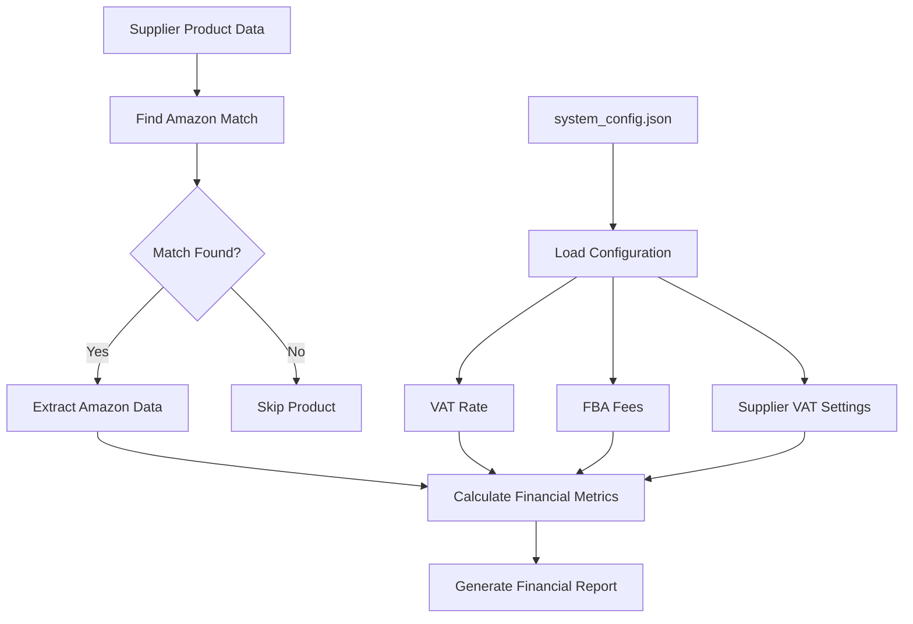
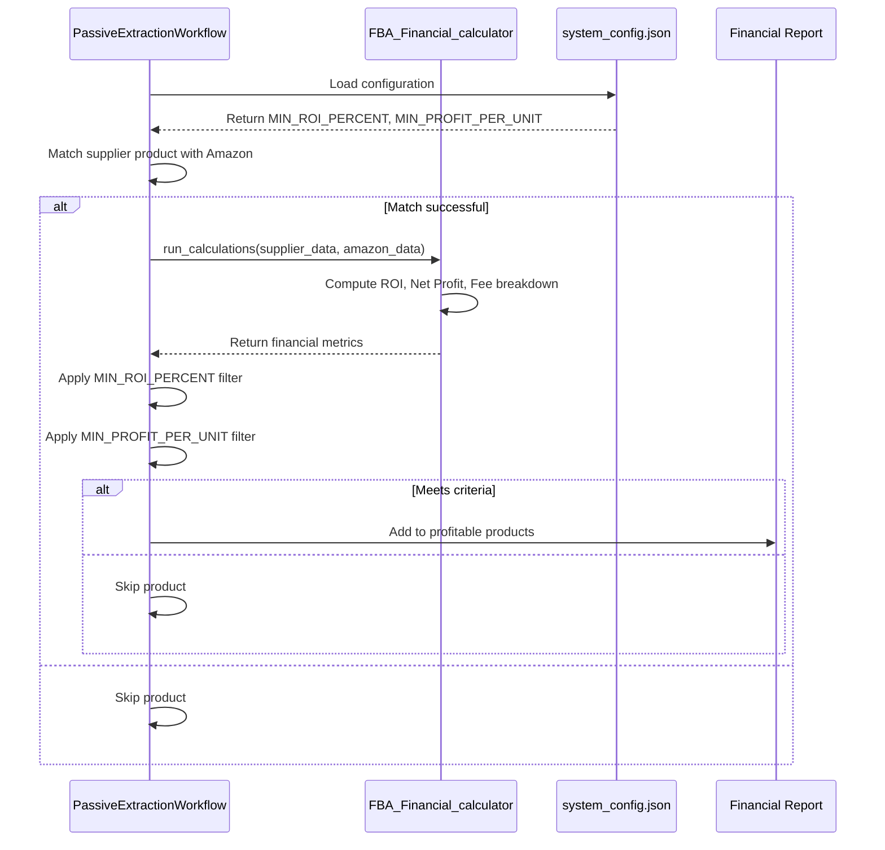
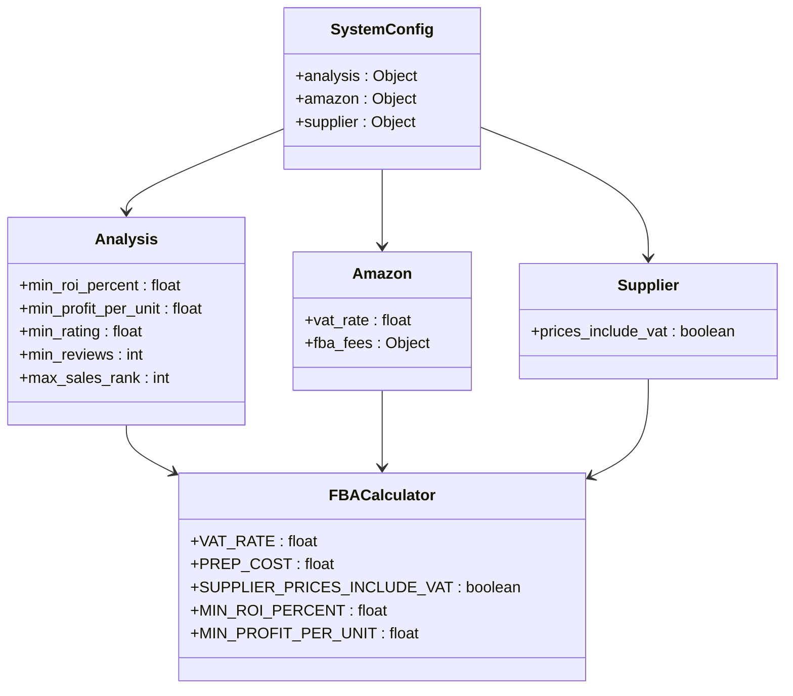
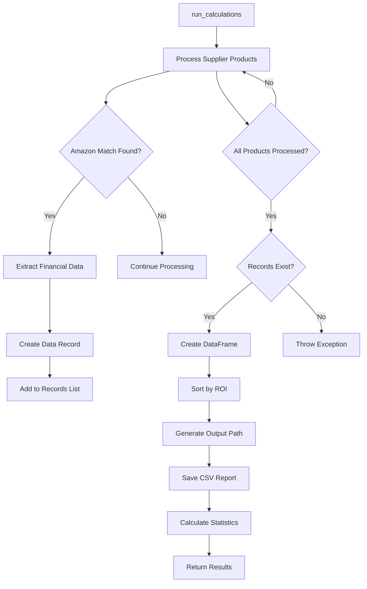
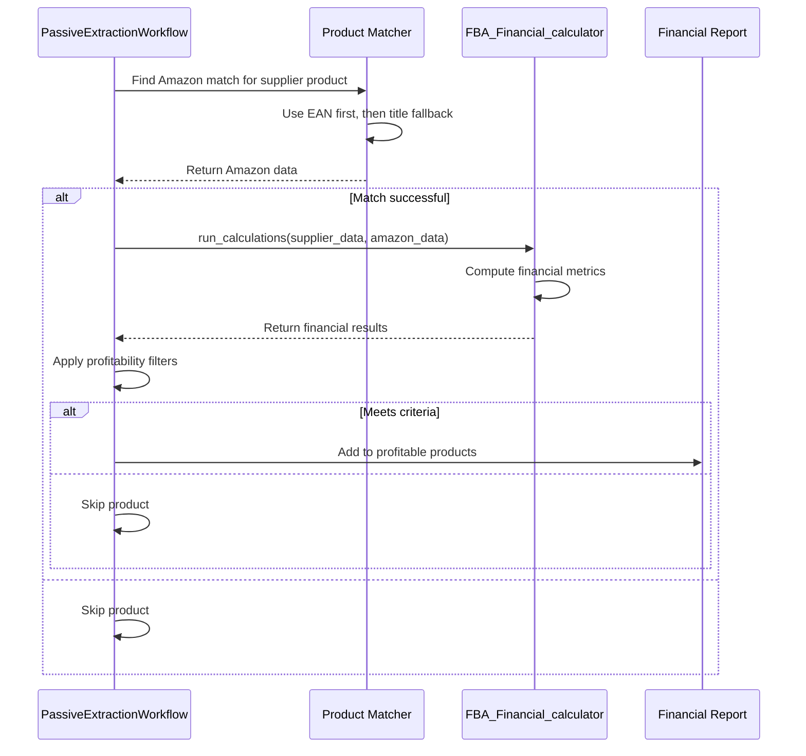
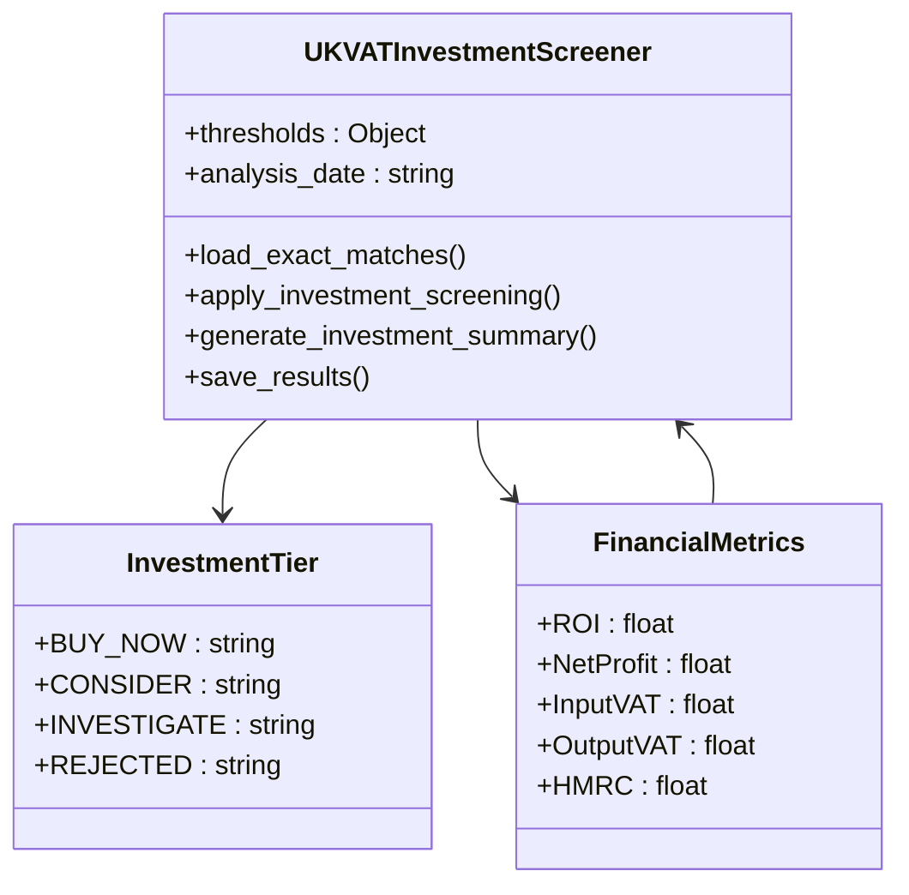

# Financial Analysis Integration

<cite>
**Referenced Files in This Document**   
- [FBA_Financial_calculator.py](file://tools/FBA_Financial_calculator.py)
- [passive_extraction_workflow_latest.py](file://tools/passive_extraction_workflow_latest.py)
- [system_config.json](file://config/system_config.json)
- [UK_VAT_Investment_Screening_Analysis.py](file://OUTPUTS/FBA_ANALYSIS/financial_reports/UK_VAT_Investment_Screening_Analysis.py)
</cite>

## Table of Contents
1. [Introduction](#introduction)
2. [FBA Financial Calculator Implementation](#fba-financial-calculator-implementation)
3. [Profitability Analysis Workflow](#profitability-analysis-workflow)
4. [Configuration and Thresholds](#configuration-and-thresholds)
5. [Financial Report Generation](#financial-report-generation)
6. [Integration with Product Matching](#integration-with-product-matching)
7. [VAT and Tax Handling](#vat-and-tax-handling)
8. [Common Issues and Solutions](#common-issues-and-solutions)
9. [Conclusion](#conclusion)

## Introduction
The financial analysis integration sub-feature is responsible for determining the profitability of matched products for Amazon FBA. This document details the implementation of the FBA_Financial_calculator module and its integration within the PassiveExtractionWorkflow. The system computes key financial metrics such as ROI, net profit, and fee breakdowns by combining supplier cost data with Amazon pricing and FBA fees. The analysis is orchestrated after successful product matching, with configurable thresholds filtering profitable opportunities. The integration between product matching, financial calculation, and reporting creates a comprehensive investment screening system for Amazon FBA product sourcing.

## FBA Financial Calculator Implementation
The FBA_Financial_calculator module implements the core profitability analysis logic, computing financial metrics based on supplier costs, Amazon pricing, and FBA fees. The implementation follows a structured approach to ensure accurate financial calculations.

**Diagram sources**
- [FBA_Financial_calculator.py](file://tools/FBA_Financial_calculator.py#L1-L589)

The financial calculation process begins with loading configuration from system_config.json, which provides essential parameters such as VAT rate, FBA fees, and supplier pricing settings. The calculator uses these parameters to compute key metrics including ROI, net profit, referral fees, and FBA fulfillment fees. The financials function is the core calculation engine, taking supplier and Amazon data as inputs and returning a comprehensive set of financial metrics.

**Section sources**
- [FBA_Financial_calculator.py](file://tools/FBA_Financial_calculator.py#L1-L589)

## Profitability Analysis Workflow
The PassiveExtractionWorkflow orchestrates the financial analysis phase after successful Amazon product matching. The workflow integrates the FBA_Financial_calculator to determine product profitability based on configurable thresholds.

**Diagram sources**
- [passive_extraction_workflow_latest.py](file://tools/passive_extraction_workflow_latest.py#L1-L799)
- [FBA_Financial_calculator.py](file://tools/FBA_Financial_calculator.py#L1-L589)

The workflow begins by loading configuration parameters from system_config.json, including MIN_ROI_PERCENT and MIN_PROFIT_PER_UNIT, which are used to filter profitable products. After a successful product match between supplier and Amazon data, the workflow invokes the run_calculations function from FBA_Financial_calculator with the combined data. The financial calculator computes ROI, net profit, and other metrics, which are then evaluated against the configured thresholds to determine if the product represents a viable investment opportunity.

**Section sources**
- [passive_extraction_workflow_latest.py](file://tools/passive_extraction_workflow_latest.py#L1-L799)
- [FBA_Financial_calculator.py](file://tools/FBA_Financial_calculator.py#L1-L589)

## Configuration and Thresholds
The financial analysis is governed by configuration parameters in system_config.json that affect profitability calculations and reporting. These parameters allow customization of the investment screening criteria.

**Diagram sources**
- [system_config.json](file://config/system_config.json#L1-L300)
- [FBA_Financial_calculator.py](file://tools/FBA_Financial_calculator.py#L1-L589)

Key configuration options include MIN_ROI_PERCENT and MIN_PROFIT_PER_UNIT in the analysis section, which determine the minimum acceptable return on investment and profit per unit. The amazon section contains VAT rate and FBA fee parameters, while the supplier section specifies whether supplier prices include VAT. These configuration values are loaded by the FBA_Financial_calculator at initialization and used throughout the financial calculation process.

**Section sources**
- [system_config.json](file://config/system_config.json#L1-L300)
- [FBA_Financial_calculator.py](file://tools/FBA_Financial_calculator.py#L1-L589)

## Financial Report Generation
The financial analysis generates comprehensive reports in CSV format, providing detailed profitability metrics for matched products. The reporting system is integrated within the FBA_Financial_calculator module.

**Diagram sources**
- [FBA_Financial_calculator.py](file://tools/FBA_Financial_calculator.py#L1-L589)

The run_calculations function processes supplier products, finds Amazon matches, and creates financial records for each matched product. These records include supplier and Amazon product information, enhanced metrics from Keepa data, and calculated financial metrics. The records are converted to a pandas DataFrame, sorted by ROI in descending order, and saved as a CSV file in the supplier-specific financial reports directory. The function returns the DataFrame, statistics about the analysis, and the output file path.

**Section sources**
- [FBA_Financial_calculator.py](file://tools/FBA_Financial_calculator.py#L1-L589)

## Integration with Product Matching
The financial analysis is tightly integrated with the product matching system, creating a seamless workflow from product identification to profitability assessment. The PassiveExtractionWorkflow orchestrates this integration.

**Diagram sources**
- [passive_extraction_workflow_latest.py](file://tools/passive_extraction_workflow_latest.py#L1-L799)
- [FBA_Financial_calculator.py](file://tools/FBA_Financial_calculator.py#L1-L589)

The integration begins with the PassiveExtractionWorkflow calling the product matching system to find an Amazon match for each supplier product. The matching system uses EAN as the primary matching criterion, with title-based matching as a fallback. When a match is found, the workflow invokes the FBA_Financial_calculator with the combined supplier and Amazon data. This integration ensures that only products with confirmed matches undergo financial analysis, maintaining data quality and analysis accuracy.

**Section sources**
- [passive_extraction_workflow_latest.py](file://tools/passive_extraction_workflow_latest.py#L1-L799)
- [FBA_Financial_calculator.py](file://tools/FBA_Financial_calculator.py#L1-L589)

## VAT and Tax Handling
The system implements comprehensive VAT and tax handling, particularly for UK-based operations. The UK_VAT_Investment_Screening_Analysis.py script demonstrates advanced VAT-aware investment screening.

**Diagram sources**
- [UK_VAT_Investment_Screening_Analysis.py](file://OUTPUTS/FBA_ANALYSIS/financial_reports/UK_VAT_Investment_Screening_Analysis.py#L1-L466)

The UK_VAT_Investment_Screener class implements a tiered investment screening system that accounts for VAT implications. It classifies products into BUY_NOW, CONSIDER, INVESTIGATE, and REJECTED tiers based on ROI, net profit, sales data, and brand indicators. The system correctly handles input VAT recovery for supplier costs and output VAT liability for Amazon sales, calculating the net HMRC payment. This sophisticated VAT handling ensures accurate profitability assessment for UK-based Amazon FBA operations.

**Section sources**
- [UK_VAT_Investment_Screening_Analysis.py](file://OUTPUTS/FBA_ANALYSIS/financial_reports/UK_VAT_Investment_Screening_Analysis.py#L1-L466)

## Common Issues and Solutions
The financial analysis system addresses several common issues related to fee estimation, currency conversion, and tax handling through robust implementation and configuration.

### Inaccurate Fee Estimation
The system mitigates inaccurate fee estimation by extracting actual referral and FBA fees from Keepa data when available. The extract_keepa_fees function parses the product details tab data to retrieve precise fee values, falling back to default rates only when Keepa data is unavailable. This approach ensures more accurate financial calculations than relying solely on estimated fees.

### Currency Conversion
Currency conversion issues are prevented by standardizing on GBP as the primary currency for UK Amazon operations. The system configuration specifies "GBP" as the currency, and all financial calculations are performed in this currency. Price data from Amazon is assumed to be in GBP, eliminating the need for currency conversion and associated inaccuracies.

### Tax Handling
Tax handling, particularly UK VAT, is addressed through configurable settings in system_config.json. The vat_rate parameter specifies the current VAT rate, while prices_include_vat indicates whether supplier prices include VAT. The financials function uses these parameters to correctly calculate input VAT, output VAT, and the net HMRC payment, ensuring accurate post-tax profitability assessment.

**Section sources**
- [FBA_Financial_calculator.py](file://tools/FBA_Financial_calculator.py#L1-L589)
- [system_config.json](file://config/system_config.json#L1-L300)
- [UK_VAT_Investment_Screening_Analysis.py](file://OUTPUTS/FBA_ANALYSIS/financial_reports/UK_VAT_Investment_Screening_Analysis.py#L1-L466)

## Conclusion
The financial analysis integration provides a comprehensive system for determining the profitability of matched products for Amazon FBA. The FBA_Financial_calculator module implements robust financial calculations, computing key metrics such as ROI, net profit, and fee breakdowns based on supplier costs, Amazon pricing, and FBA fees. The PassiveExtractionWorkflow orchestrates the analysis phase, applying configurable thresholds like MIN_ROI_PERCENT and MIN_PROFIT_PER_UNIT to filter profitable products. The integration between product matching, financial calculation, and reporting creates a seamless workflow from product identification to investment decision. Advanced features like UK VAT-aware investment screening demonstrate the system's sophistication in handling complex tax implications. Configuration options in system_config.json allow customization of the analysis parameters, making the system adaptable to different business requirements and market conditions.