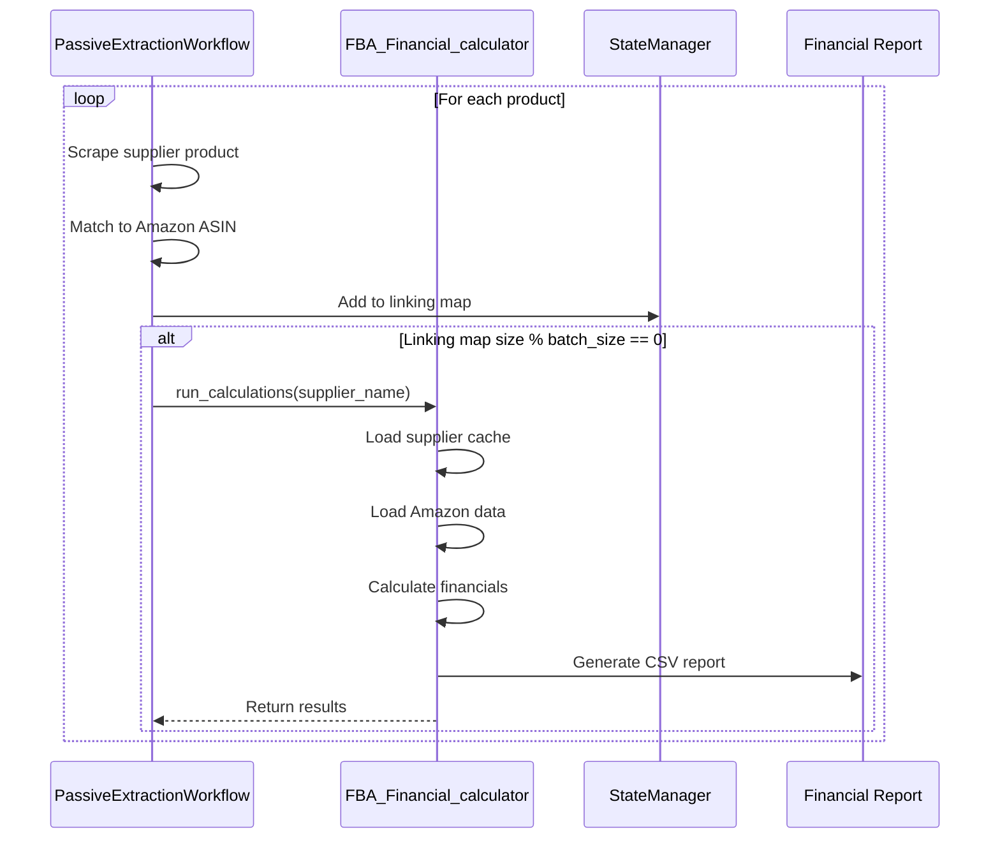

# Profitability Assessment

<cite>
**Referenced Files in This Document**   
- [FBA_Financial_calculator.py](file://tools/FBA_Financial_calculator.py)
- [passive_extraction_workflow_latest.py](file://tools/passive_extraction_workflow_latest.py)
- [system_config.json](file://config/system_config.json)
- [www.poundwholesale.co.uk.json](file://config/supplier_configs/www.poundwholesale.co.uk.json)
</cite>

## Table of Contents
1. [Introduction](#introduction)
2. [Profitability Threshold Configuration](#profitability-threshold-configuration)
3. [Implementation of is_profitable Logic](#implementation-of-is_profitable-logic)
4. [Workflow Integration and Financial Calculation Flow](#workflow-integration-and-financial-calculation-flow)
5. [Data Flow and Financial Calculation Process](#data-flow-and-financial-calculation-process)
6. [Common Issues and Edge Cases](#common-issues-and-edge-cases)
7. [Supplier and Marketplace-Specific Threshold Adjustments](#supplier-and-marketplace-specific-threshold-adjustments)
8. [Conclusion](#conclusion)

## Introduction
The profitability assessment component of the Amazon FBA Agent System is responsible for determining whether a product meets the user's financial thresholds for investment. This document details the implementation of the financial evaluation logic, focusing on the `is_profitable` method within the `FBA_Financial_calculator.py` module and its integration into the `PassiveExtractionWorkflow`. The system evaluates products based on net profit, ROI percentage, and minimum margin requirements, using configuration parameters to filter viable products. The assessment is a critical investment screening step, ensuring that only products meeting predefined profit thresholds are considered for sourcing.

## Profitability Threshold Configuration
The profitability assessment is governed by a set of configuration parameters that define the minimum acceptable financial performance for a product. These thresholds are defined as environment variables within the `passive_extraction_workflow_latest.py` script, which are used to determine if a product passes the investment screening process.

The primary profitability thresholds are:
- **MIN_ROI_PERCENT**: The minimum required Return on Investment (ROI) percentage. The default value is set to 35.0%.
- **MIN_PROFIT_PER_UNIT**: The minimum required net profit per unit in GBP. The default value is set to £3.00.
- **MIN_RATING**: The minimum required customer rating on Amazon, with a default of 4.0.
- **MIN_REVIEWS**: The minimum number of customer reviews required, with a default of 50.
- **MAX_SALES_RANK**: The maximum allowable Amazon sales rank, with a default of 150,000.

These values are loaded at runtime from environment variables, with the defaults provided in the code serving as a fallback. It is important to note that while a `system_config.json` file exists and contains similar parameters (e.g., `"analysis": { "min_roi_percent": 15.0 }`), the current implementation in `passive_extraction_workflow_latest.py` does not integrate these configuration values. Instead, it relies solely on the environment variables, which creates a potential for configuration drift between different environments.

**Section sources**
- [passive_extraction_workflow_latest.py](file://tools/passive_extraction_workflow_latest.py#L189-L195)

## Implementation of is_profitable Logic
The core financial evaluation logic is implemented in the `financials` function within the `FBA_Financial_calculator.py` module. While there is no explicit `is_profitable` method, the `financials` function calculates all necessary financial metrics, and the profitability decision is made by comparing these results against the configured thresholds in the workflow.

The `financials` function performs a comprehensive calculation of a product's financial performance. It takes as input the supplier product data, the matched Amazon product data, and the supplier's price (inclusive of VAT). The function then calculates key metrics including:
- **Net Profit**: The profit after all costs and fees.
- **ROI (Return on Investment)**: The percentage return on the total cost.
- **Profit Margin**: The percentage of profit relative to the selling price.

The ROI is calculated using the formula: `ROI = (Net Profit / Total Cost) * 100`, where the total cost includes the supplier's ex-VAT price, prep house fee, and shipping cost. The Net Profit is derived by subtracting all fees (referral, FBA, prep, shipping, and VAT) and the supplier's cost from the selling price.

The profitability check is performed in the `PassiveExtractionWorkflow` after the `financials` function returns its results. A product is deemed profitable if its calculated ROI is greater than `MIN_ROI_PERCENT` and its net profit is greater than `MIN_PROFIT_PER_UNIT`. This logic is embedded within the workflow's main processing loop, where it acts as an ROI filter to separate viable products from those that do not meet the investment criteria.

**Section sources**
- [FBA_Financial_calculator.py](file://tools/FBA_Financial_calculator.py#L250-L350)
- [passive_extraction_workflow_latest.py](file://tools/passive_extraction_workflow_latest.py#L7000-L7057)

## Workflow Integration and Financial Calculation Flow
The profitability assessment is tightly integrated into the `PassiveExtractionWorkflow` and is triggered at specific intervals during the product analysis process. After the system scrapes products from a supplier and matches them to their corresponding Amazon listings, it invokes the financial calculation engine.

The integration point is in the `passive_extraction_workflow_latest.py` script, where a periodic check is performed based on the size of the linking map (a data structure that maps supplier products to Amazon ASINs). The workflow uses the `financial_report_batch_size` parameter from the `system_config.json` (set to 50) as a trigger mechanism. Every time the linking map reaches a size that is a multiple of this batch size (e.g., 50, 100, 150), the workflow automatically calls the `run_calculations` function from the `FBA_Financial_calculator` module.

**Diagram sources**
- [passive_extraction_workflow_latest.py](file://tools/passive_extraction_workflow_latest.py#L7031-L7057)
- [FBA_Financial_calculator.py](file://tools/FBA_Financial_calculator.py#L392-L588)

## Data Flow and Financial Calculation Process
The financial calculation process begins with the `run_calculations` function in `FBA_Financial_calculator.py`. This function orchestrates the entire process by loading the necessary data from persistent storage. It uses the `supplier_name` to generate supplier-specific paths for the supplier's product cache, the Amazon scrape data directory, and the output directory for financial reports.

The process involves the following steps:
1. **Data Loading**: The function loads the supplier's product cache (a JSON file containing all scraped products) and the Amazon product data (JSON files containing pricing and fee information).
2. **Data Matching**: For each supplier product, the system uses the `find_amazon_json` function to locate the corresponding Amazon data, primarily using the EAN or ASIN as a key.
3. **Financial Calculation**: Once a match is found, the `financials` function is called with the combined data to calculate the net profit, ROI, and other financial metrics.
4. **Result Aggregation**: All calculated results are aggregated into a list of records.
5. **Report Generation**: The results are converted into a pandas DataFrame, sorted by ROI, and saved as a CSV file in the supplier's financial reports directory.

This process ensures that the financial assessment is based on real, up-to-date data from both the supplier and Amazon, providing an accurate picture of a product's potential profitability.

**Section sources**
- [FBA_Financial_calculator.py](file://tools/FBA_Financial_calculator.py#L392-L588)

## Common Issues and Edge Cases
Several common issues and edge cases can arise during the profitability assessment process.

**False Negatives due to Aggressive Filtering**: The default thresholds (35% ROI and £3.00 profit) are very aggressive, which can lead to false negatives where potentially viable products are excluded. This is particularly problematic for low-margin, high-volume items. The system's reliance on environment variables for these thresholds, rather than the more flexible `system_config.json`, makes it difficult to adjust these values dynamically for different market conditions.

**Edge Cases in Low-Volume Products**: Products with low sales velocity or no sales data on Amazon can be challenging to assess. The current system does not have a robust mechanism to handle these cases, potentially leading to inaccurate ROI calculations due to a lack of reliable sales data for demand forecasting.

**Configuration Drift**: Since the profitability thresholds are defined as environment variables in the code and not pulled from the central `system_config.json`, there is a significant risk of configuration drift. This means that the thresholds used in different environments (e.g., development, testing, production) may not be synchronized, leading to inconsistent behavior and unreliable investment screening results.

## Supplier and Marketplace-Specific Threshold Adjustments
The current implementation does not support dynamic adjustment of profitability thresholds on a per-supplier or per-marketplace basis. The thresholds are defined as global constants within the `passive_extraction_workflow_latest.py` script and are applied uniformly to all products, regardless of the supplier or marketplace.

However, the system's architecture provides a foundation for such an enhancement. The `run_calculations` function already accepts a `supplier_name` parameter, and the system uses supplier-specific configuration files (e.g., `www.poundwholesale.co.uk.json`). A future improvement could involve loading supplier-specific thresholds from these configuration files or from a dedicated section in the `system_config.json`, allowing for more nuanced investment screening strategies tailored to the characteristics of different suppliers and marketplaces.

## Conclusion
The profitability assessment component is a critical part of the Amazon FBA Agent System, acting as a gatekeeper for investment decisions. It uses a well-defined set of financial calculations to evaluate products based on ROI and net profit. While the core logic is sound, the current implementation has limitations, particularly regarding the static nature of its configuration and the potential for false negatives due to aggressive filtering. Addressing the configuration drift issue by integrating the `system_config.json` values and implementing supplier-specific thresholds would significantly enhance the system's flexibility and reliability.