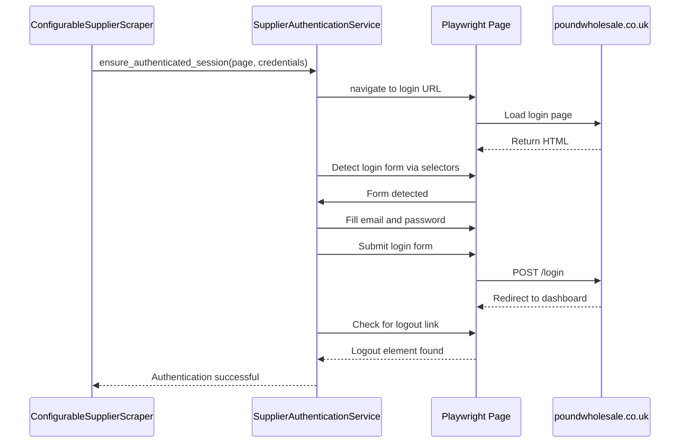
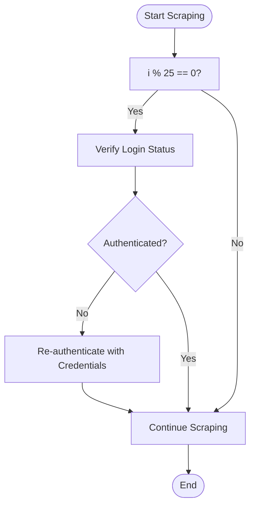

# Authentication Management

<cite>
**Referenced Files in This Document**   
- [supplier_authentication_service.py](file://tools/supplier_authentication_service.py)
- [configurable_supplier_scraper.py](file://tools/configurable_supplier_scraper.py)
- [www.poundwholesale.co.uk.json](file://config/supplier_configs/www.poundwholesale.co.uk.json)
</cite>

## Table of Contents
1. [Introduction](#introduction)
2. [Core Components](#core-components)
3. [Authentication Workflow](#authentication-workflow)
4. [Integration with ConfigurableSupplierScraper](#integration-with-configurablesupplierscraper)
5. [Proactive Authentication and Session Maintenance](#proactive-authentication-and-session-maintenance)
6. [Common Issues and Solutions](#common-issues-and-solutions)
7. [Security Considerations](#security-considerations)

## Introduction
The Authentication Management sub-feature ensures uninterrupted access to supplier websites such as poundwholesale.co.uk by maintaining valid user sessions throughout the scraping workflow. This document details the implementation of the `SupplierAuthenticationService` class, which orchestrates login procedures using Playwright to interact with supplier login forms. The service supports dynamic authentication workflows, including navigation to login pages, detection of form fields via predefined selectors, submission of credentials, and validation of successful login through the presence of logout links or account elements. It integrates seamlessly with the `ConfigurableSupplierScraper` via an `auth_callback` mechanism and retrieves credentials from supplier-specific configuration files. The system performs proactive authentication checks every 25 products to prevent session expiration and pricing failures.

## Core Components

The central component of the authentication system is the `SupplierAuthenticationService` class, located in `tools/supplier_authentication_service.py`. This service manages session authentication for supplier websites, ensuring that the scraper maintains logged-in status during prolonged operations. It uses Playwright to automate browser interactions and supports both legacy and modern constructor patterns for backward compatibility.

The service loads supplier-specific configurations from JSON files in the `config/supplier_configs/` directory, such as `www.poundwholesale.co.uk.json`, which define base URLs, field mappings, and pagination rules. The authentication logic is driven by predefined selectors (`LOGIN_SELECTORS`) that identify login form elements, input fields, and success indicators like logout links.

Credentials are managed through configuration files and loaded dynamically during runtime. The service also supports integration with external login scripts for suppliers requiring custom authentication flows.

**Section sources**
- [supplier_authentication_service.py](file://tools/supplier_authentication_service.py#L20-L47)
- [www.poundwholesale.co.uk.json](file://config/supplier_configs/www.poundwholesale.co.uk.json#L1-L65)

## Authentication Workflow

The authentication workflow implemented by `SupplierAuthenticationService` follows a structured sequence to ensure reliable login:

1. **Navigation to Login Page**: The service navigates to the supplier's login URL using Playwright.
2. **Login Form Detection**: It attempts to detect the login form using a prioritized list of selectors, including text-based triggers like "Sign in" or attribute-based selectors such as `a[href*='/customer/account/login']`.
3. **Credential Submission**: Upon detecting the login form, the service fills in the email and password fields using the provided credentials and submits the form.
4. **Login Validation**: After submission, the service validates successful authentication by checking for the presence of logout links or account-related elements on the page.
5. **Session Reuse**: If already logged in, the service skips re-authentication to avoid unnecessary interactions.

This workflow is encapsulated in the `ensure_authenticated_session` method, which returns a boolean indicating success and the method used (e.g., "already_logged_in", "form_submission").



**Diagram sources**
- [supplier_authentication_service.py](file://tools/supplier_authentication_service.py#L419-L449)
- [configurable_supplier_scraper.py](file://tools/configurable_supplier_scraper.py#L429-L468)

## Integration with ConfigurableSupplierScraper

The `SupplierAuthenticationService` integrates with the `ConfigurableSupplierScraper` through the `auth_callback` mechanism. During product scraping, the scraper periodically invokes the authentication service to verify session validity. This integration is critical for maintaining uninterrupted access, especially on supplier sites that require login to view pricing.

The scraper retrieves credentials from the supplier configuration file using the `SystemConfigLoader`. For example, when processing `poundwholesale.co.uk`, it loads credentials from `poundwholesale-co-uk.json` and passes them to the authentication service.

```mermaid
classDiagram
class ConfigurableSupplierScraper {
+auth_callback : Callable
+scrape_products_from_url(url)
+extract_price(soup, html, url)
}
class SupplierAuthenticationService {
+ensure_authenticated_session(page, credentials)
+check_login_status()
+perform_login()
}
class SystemConfigLoader {
+get_credentials(supplier_domain)
}
ConfigurableSupplierScraper --> SupplierAuthenticationService : uses
ConfigurableSupplierScraper --> SystemConfigLoader : retrieves credentials
SupplierAuthenticationService --> "www.poundwholesale.co.uk.json" : loads config
```

**Diagram sources**
- [configurable_supplier_scraper.py](file://tools/configurable_supplier_scraper.py#L429-L468)
- [supplier_authentication_service.py](file://tools/supplier_authentication_service.py#L20-L47)

**Section sources**
- [configurable_supplier_scraper.py](file://tools/configurable_supplier_scraper.py#L429-L468)
- [supplier_authentication_service.py](file://tools/supplier_authentication_service.py#L20-L47)

## Proactive Authentication and Session Maintenance

To prevent session expiration during long-running scraping tasks, the system implements proactive authentication checks every 25 products. This strategy ensures that pricing data remains accessible and avoids failures due to expired sessions.

Within the `scrape_products_from_url` method of `ConfigurableSupplierScraper`, a counter tracks the number of processed products. At every 25th product, the scraper invokes the `SupplierAuthenticationService` to verify login status. If the session is invalid, it re-authenticates using stored credentials.

This mechanism is crucial for suppliers like poundwholesale.co.uk, where session timeouts can occur after periods of inactivity or after a certain number of requests. The proactive check minimizes disruptions and maintains workflow continuity.



**Diagram sources**
- [configurable_supplier_scraper.py](file://tools/configurable_supplier_scraper.py#L429-L468)

**Section sources**
- [configurable_supplier_scraper.py](file://tools/configurable_supplier_scraper.py#L429-L468)

## Common Issues and Solutions

Several common issues can arise during authentication, and the system includes mechanisms to address them:

- **Login Form Detection Failures**: When standard selectors fail, the service uses fallback triggers such as text-based selectors ("Register or Sign in") or generic login links. This increases robustness across different supplier site layouts.
- **Credential Rejection**: Invalid credentials are logged, and the workflow halts to prevent repeated failed attempts. Users are prompted to verify credentials in the configuration file.
- **Session Expiration**: Proactive authentication checks every 25 products mitigate this issue by re-authenticating before pricing data becomes inaccessible.
- **Dynamic Login Modals**: Some suppliers use JavaScript-driven login modals. The service attempts to trigger these modals using header navigation selectors before form submission.

These solutions ensure reliable authentication across diverse supplier websites with varying login mechanisms.

**Section sources**
- [supplier_authentication_service.py](file://tools/supplier_authentication_service.py#L437-L470)
- [configurable_supplier_scraper.py](file://tools/configurable_supplier_scraper.py#L429-L468)

## Security Considerations

Credential management is handled through supplier configuration files stored in `config/supplier_configs/`. These files contain sensitive information such as email and password, which are loaded at runtime. To enhance security:

- Credentials should be stored using environment variables where possible, though the current implementation uses JSON files.
- Configuration files should be excluded from version control using `.gitignore`.
- File permissions should restrict access to authorized users only.
- Future improvements could include encrypted credential storage or integration with secret management services.

The use of Playwright ensures that credentials are entered directly into form fields without exposure in URLs or logs, maintaining confidentiality during transmission.

**Section sources**
- [www.poundwholesale.co.uk.json](file://config/supplier_configs/www.poundwholesale.co.uk.json#L1-L65)
- [supplier_authentication_service.py](file://tools/supplier_authentication_service.py#L20-L47)