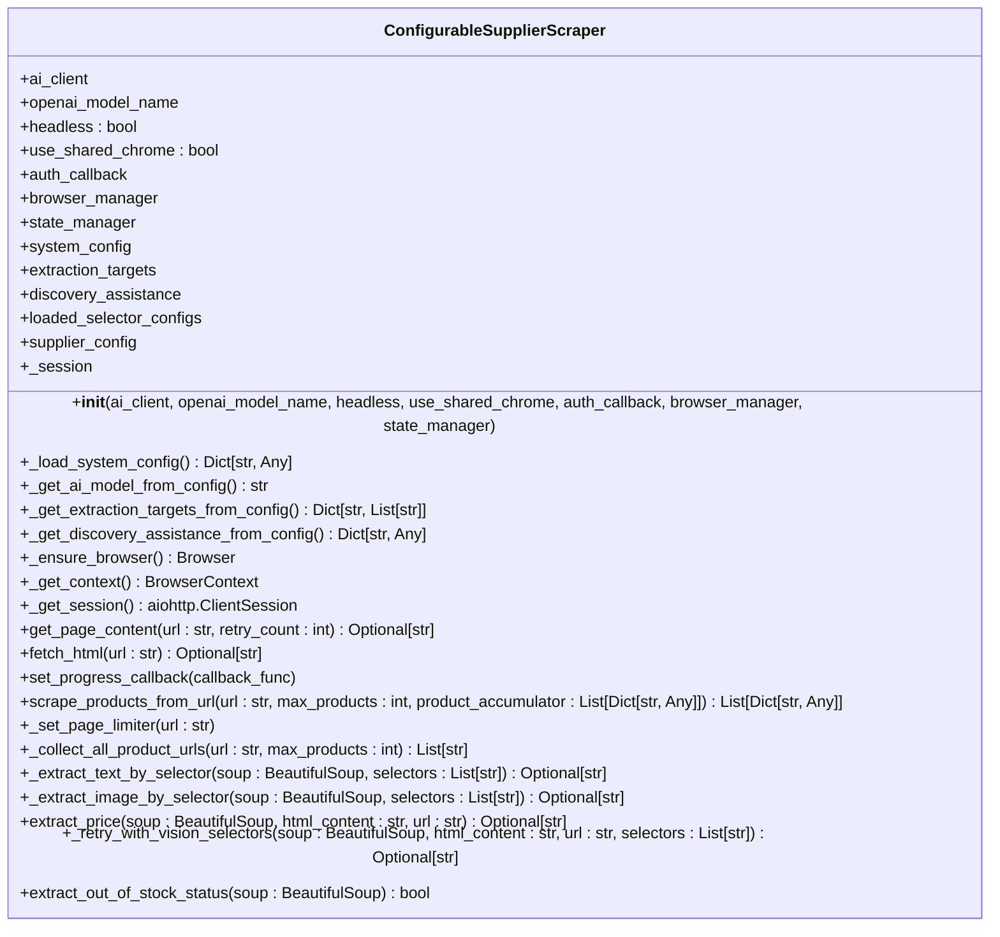
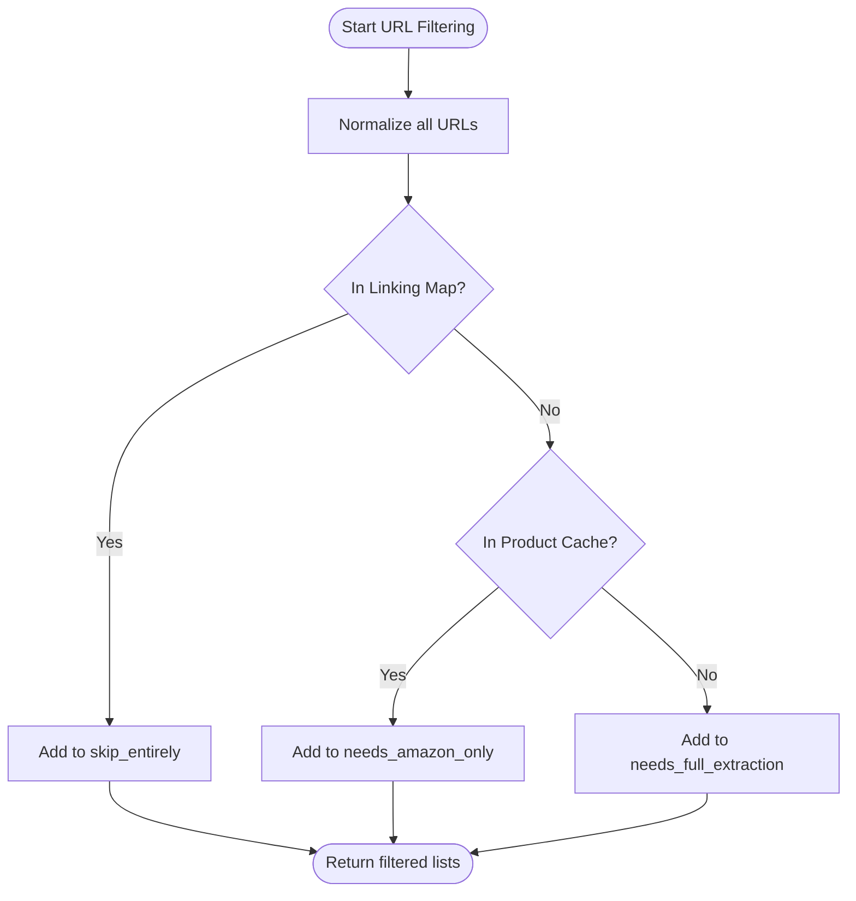
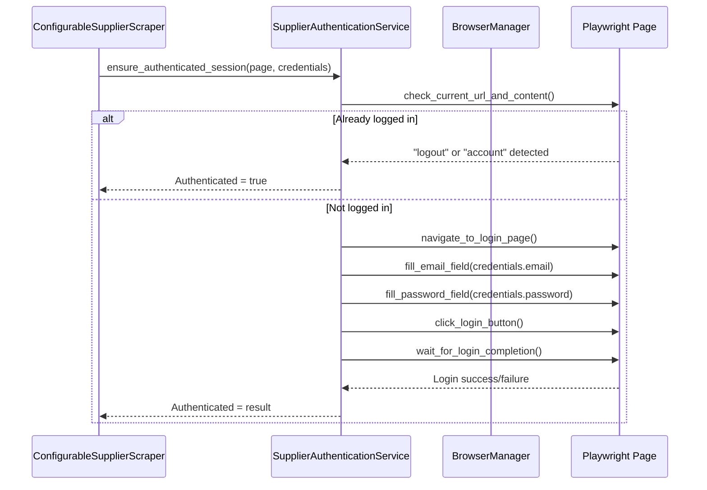
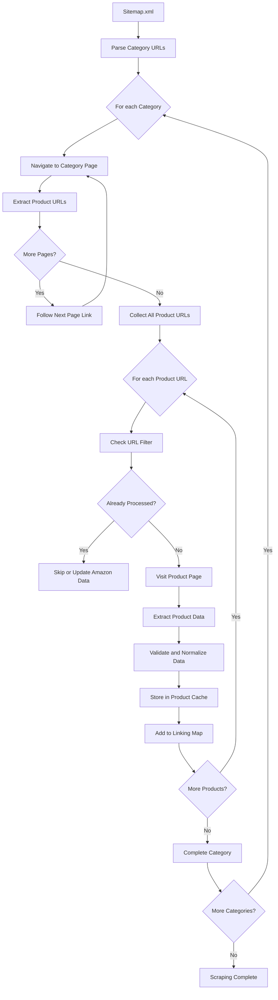

# Supplier Scraping

<cite>
**Referenced Files in This Document**   
- [configurable_supplier_scraper.py](file://tools/configurable_supplier_scraper.py)
- [category_navigator.py](file://tools/category_navigator.py)
- [supplier_authentication_service.py](file://tools/supplier_authentication_service.py)
- [url_filter.py](file://utils/url_filter.py)
- [www.poundwholesale.co.uk.json](file://config/supplier_configs/www.poundwholesale.co.uk.json)
- [poundwholesale_categories.json](file://config/poundwholesale_categories.json)
</cite>

## Table of Contents
1. [Introduction](#introduction)
2. [Core Components Overview](#core-components-overview)
3. [ConfigurableSupplierScraper Implementation](#configurablesupplierscraper-implementation)
4. [CategoryNavigator and Category-First Navigation](#categorynavigator-and-category-first-navigation)
5. [URL Filtering and Processing Logic](#url-filtering-and-processing-logic)
6. [Authentication Handling](#authentication-handling)
7. [Product Data Extraction Process](#product-data-extraction-process)
8. [Integration of Category Discovery and Product Extraction](#integration-of-category-discovery-and-product-extraction)
9. [Error Handling and Common Issues](#error-handling-and-common-issues)
10. [Performance Considerations](#performance-considerations)

## Introduction
The supplier scraping sub-feature is designed to systematically extract product data from supplier websites such as poundwholesale.co.uk. This document details the implementation of the scraping system, focusing on the `ConfigurableSupplierScraper` and `CategoryNavigator` classes that enable robust, stateful navigation and data extraction. The system leverages Playwright and Chrome DevTools Protocol (CDP) for browser automation, ensuring compatibility with dynamic content and anti-bot measures. It implements a category-first navigation strategy, where category URLs are discovered via sitemap.xml parsing before product-level extraction begins. The process includes configurable selectors for product data extraction, URL filtering to avoid redundant processing, and integration with authentication services to maintain valid sessions. This documentation covers the complete workflow from category discovery to product data extraction, including solutions for common challenges like login failures, dynamic content loading, and out-of-stock detection.

## Core Components Overview
The supplier scraping system consists of several key components that work together to extract product data efficiently and reliably. The `ConfigurableSupplierScraper` class serves as the primary interface for extracting product information using configurable selectors and Playwright-based browser automation. It integrates with the `CategoryNavigator` class, which implements a category-first navigation approach by parsing sitemap.xml to discover category URLs systematically. The `SupplierAuthenticationService` ensures that scraping sessions remain authenticated throughout the process, while the `url_filter.py` utility prevents redundant processing by distinguishing between category and product URLs and checking against existing caches. These components work in concert to implement a robust scraping workflow that handles dynamic content, pagination, and stateful navigation through supplier websites.

**Section sources**
- [configurable_supplier_scraper.py](file://tools/configurable_supplier_scraper.py#L1-L3938)
- [category_navigator.py](file://tools/category_navigator.py#L1-L879)
- [supplier_authentication_service.py](file://tools/supplier_authentication_service.py#L1-L114)
- [url_filter.py](file://utils/url_filter.py#L1-L40)

## ConfigurableSupplierScraper Implementation
The `ConfigurableSupplierScraper` class provides a flexible framework for extracting data from supplier websites with externalized selector configuration. It uses Playwright for robust browser automation, enabling full JavaScript support and anti-bot evasion capabilities. The scraper is initialized with an AI client for fallback extraction, headless mode configuration, and optional authentication callbacks. It maintains backward compatibility with the orchestrator while leveraging the improved Playwright-based approach.

The scraper's architecture prioritizes selector-based extraction with AI-powered fallbacks when selectors fail. It features a centralized browser management system through `BrowserManager`, which ensures consistent browser state across different components. The class implements rate limiting between requests to prevent overwhelming the target server and includes retry logic with exponential backoff for handling transient failures.

Key methods include `get_page_content()` for fetching HTML content with anti-bot evasion, `scrape_products_from_url()` for extracting products with pagination support, and `extract_price()` for retrieving price information using configurable selectors. The scraper also implements memory management features to prevent memory leaks during extended scraping sessions, including periodic cleanup of browser contexts and forced memory cleanup at configurable intervals.



**Diagram sources**
- [configurable_supplier_scraper.py](file://tools/configurable_supplier_scraper.py#L1-L3938)

**Section sources**
- [configurable_supplier_scraper.py](file://tools/configurable_supplier_scraper.py#L1-L3938)

## CategoryNavigator and Category-First Navigation
The `CategoryNavigator` class implements a category-first navigation system for PoundWholesale, replacing homepage-based navigation with a structured approach that begins with sitemap-driven category discovery. This strategy ensures comprehensive coverage of the supplier's product catalog by systematically processing each category before extracting individual product data.

The navigator begins by parsing the sitemap.xml file from the supplier's website to extract category URLs. It uses the `parse_sitemap_categories()` method to retrieve and filter URLs, identifying those that represent product categories rather than blog posts, customer pages, or other non-product content. This approach provides a complete map of available categories, enabling batch processing and systematic traversal.

Once categories are discovered, the navigator processes each one to extract product URLs across all paginated pages. The `process_category()` method handles pagination by following "next" links and collecting product URLs from each page. It uses configurable selectors to identify product items and links, with fallback options if the primary selectors fail. The navigator maintains state across pages, ensuring that all products within a category are captured regardless of pagination structure.

```mermaid
sequenceDiagram
participant Navigator as CategoryNavigator
participant Sitemap as Sitemap Parser
participant Browser as BrowserManager
participant Page as Playwright Page
participant Scraper as ConfigurableSupplierScraper
Navigator->>Sitemap : parse_sitemap_categories()
Sitemap-->>Navigator : List of category URLs
Navigator->>Navigator : Limit categories by config
loop For each category
Navigator->>Page : goto(category_url)
Page-->>Navigator : Page loaded
loop While pages exist
Navigator->>Page : extract_product_links()
Page-->>Navigator : List of product URLs
Navigator->>Page : find_next_page()
alt Next page exists
Page-->>Navigator : Next page URL
Navigator->>Page : goto(next_page_url)
else No more pages
break
end
end
Navigator->>Scraper : scrape_products_from_url()
Scraper-->>Navigator : List of product data
end
```

**Diagram sources**
- [category_navigator.py](file://tools/category_navigator.py#L1-L879)

**Section sources**
- [category_navigator.py](file://tools/category_navigator.py#L1-L879)

## URL Filtering and Processing Logic
The URL filtering process is a critical component of the supplier scraping system, designed to optimize efficiency by preventing redundant processing of URLs. The `url_filter.py` module implements a three-tier classification system that determines how each URL should be processed based on its presence in the linking map and product cache.

The filtering logic prioritizes the linking map, which contains fully processed products with both supplier and Amazon data, followed by the product cache, which contains supplier data but may lack Amazon information. URLs are classified into three categories: "skip_entirely" for URLs already in the linking map, "needs_amazon_only" for URLs in the product cache but not the linking map, and "needs_full_extraction" for new URLs that require complete processing.

This filtering process is integrated into the `ConfigurableSupplierScraper` through the `url_cache_filter.py` utility, which loads existing cache URLs and linking map URLs to filter out already-processed products before visiting individual product pages. This optimization significantly reduces the number of page visits required, improving scraping efficiency and reducing load on both the scraper and the target website.



**Diagram sources**
- [url_filter.py](file://utils/url_filter.py#L1-L40)

**Section sources**
- [url_filter.py](file://utils/url_filter.py#L1-L40)

## Authentication Handling
Authentication is managed through the `SupplierAuthenticationService` class, which ensures that scraping sessions remain authenticated when accessing supplier websites that require login. The service integrates with the browser automation system to maintain valid sessions throughout the scraping process, preventing issues such as login failures or session timeouts that could disrupt data extraction.

The authentication process begins with credential retrieval from the system configuration, where supplier-specific credentials are stored securely. The service then uses Playwright to navigate to the supplier's login page and fill in the required fields using configurable selectors. It handles various login form layouts by attempting multiple selector combinations for email, password, and login button elements.

A key feature of the authentication system is proactive session verification, where the scraper checks authentication status at regular intervals (e.g., every 25 products) to prevent pricing failures due to expired sessions. If authentication is found to be invalid, the service automatically re-authenticates using stored credentials, ensuring uninterrupted scraping.



**Diagram sources**
- [supplier_authentication_service.py](file://tools/supplier_authentication_service.py#L1-L114)

**Section sources**
- [supplier_authentication_service.py](file://tools/supplier_authentication_service.py#L1-L114)

## Product Data Extraction Process
The product data extraction process involves visiting individual product pages to retrieve key information such as title, price, EAN/SKU, and availability status. This process is implemented in the `ConfigurableSupplierScraper` class through the `scrape_products_from_url()` method, which orchestrates the extraction workflow.

The extraction begins with pagination handling, where the scraper collects all product URLs from all pages within a category. It then visits each product page individually to extract detailed data using configurable selectors defined in the supplier configuration file. The selectors are specified in JSON format and include multiple options for each data point (title, price, EAN, SKU, etc.), allowing the scraper to adapt to different page layouts.

Price extraction is particularly important and is handled through a dedicated `extract_price()` method that first attempts selector-based extraction and falls back to AI-powered vision if necessary. The method also checks for login-required indicators that might affect price visibility. For EAN/SKU identification, the system analyzes the extracted identifier to determine whether it represents an EAN/barcode (typically 8-14 digits) or a supplier SKU, ensuring accurate data classification.

Out-of-stock status is detected through multiple indicators, including explicit "Out of Stock" text, CSS classes containing "out-of-stock" or "unavailable", and stock status elements with specific keywords. This multi-faceted approach ensures reliable detection of product availability across different supplier websites.

**Section sources**
- [configurable_supplier_scraper.py](file://tools/configurable_supplier_scraper.py#L1-L3938)
- [www.poundwholesale.co.uk.json](file://config/supplier_configs/www.poundwholesale.co.uk.json#L1-L66)

## Integration of Category Discovery and Product Extraction
The integration between category discovery, pagination handling, and product data extraction forms the core workflow of the supplier scraping system. This integrated process begins with sitemap parsing to discover category URLs, followed by systematic processing of each category to extract product URLs across all paginated pages, and concludes with individual product page visits to extract detailed data.

The `CategoryNavigator` initiates the process by parsing the sitemap.xml file to identify all available categories. It then processes each category to collect product URLs, handling pagination by following "next" page links until all pages are exhausted. The collected product URLs are passed to the `ConfigurableSupplierScraper`, which visits each URL to extract product data.

A key aspect of this integration is the "linking map" concept, which tracks the relationship between supplier URLs and Amazon ASINs. As products are processed, their URLs are added to the linking map, preventing redundant processing in future runs. The system also implements a "product cache" that stores supplier data, allowing for efficient updates when only Amazon data needs to be refreshed.

The integration includes several optimization features, such as batch processing of categories with configurable limits, rate limiting between requests to prevent overwhelming the target server, and memory management to prevent leaks during extended scraping sessions. The system also implements state tracking through the `FixedEnhancedStateManager`, allowing scraping to resume from where it left off in case of interruptions.



**Diagram sources**
- [category_navigator.py](file://tools/category_navigator.py#L1-L879)
- [configurable_supplier_scraper.py](file://tools/configurable_supplier_scraper.py#L1-L3938)

**Section sources**
- [category_navigator.py](file://tools/category_navigator.py#L1-L879)
- [configurable_supplier_scraper.py](file://tools/configurable_supplier_scraper.py#L1-L3938)

## Error Handling and Common Issues
The supplier scraping system includes comprehensive error handling mechanisms to address common issues encountered during web scraping. These mechanisms ensure robust operation even in the face of network failures, dynamic content loading, and anti-bot measures.

Login failures are handled through the `SupplierAuthenticationService`, which proactively verifies authentication status at regular intervals and automatically re-authenticates if a session has expired. This prevents the common issue of pricing failures due to expired sessions, which could otherwise result in incomplete or inaccurate data extraction.

Dynamic content loading is addressed through Playwright's built-in waiting mechanisms, which ensure that pages are fully loaded before extraction begins. The scraper uses `wait_for_load_state('networkidle')` to wait for all network requests to complete, ensuring that dynamically loaded content is available for extraction. For particularly slow-loading elements, the system implements targeted waiting using specific selectors.

Out-of-stock detection is implemented through multiple indicators, including explicit text ("Out of Stock"), CSS classes ("out-of-stock", "unavailable"), and stock status elements with specific keywords. This multi-faceted approach ensures reliable detection across different supplier websites with varying implementations.

Rate limiting and bot detection are mitigated through several strategies: implementing configurable delays between requests, adding random jitter to retry intervals, using realistic browser fingerprints and viewport sizes, and leveraging the shared Chrome instance via CDP to maintain consistent browser state. The system also includes circuit breaker patterns to prevent overwhelming the target server during periods of high error rates.

**Section sources**
- [configurable_supplier_scraper.py](file://tools/configurable_supplier_scraper.py#L1-L3938)
- [category_navigator.py](file://tools/category_navigator.py#L1-L879)
- [supplier_authentication_service.py](file://tools/supplier_authentication_service.py#L1-L114)

## Performance Considerations
The supplier scraping system incorporates several performance optimizations to ensure efficient and scalable operation. These considerations address memory management, request rate limiting, parallel processing, and caching strategies.

Memory management is a critical concern, particularly during extended scraping sessions. The system implements periodic memory cleanup through the `BrowserManager`, which monitors memory usage and performs cleanup operations when thresholds are exceeded. The `ConfigurableSupplierScraper` also includes forced memory cleanup at configurable intervals (e.g., every 100 products) to prevent memory leaks.

Rate limiting is implemented to prevent overwhelming the target server and to avoid triggering anti-bot measures. The scraper enforces a configurable delay between requests, with default values set to 1 second. This delay can be adjusted based on the target website's requirements and the system's processing capacity.

Batch processing of categories is supported through configurable limits on the number of categories and products processed per cycle. This allows the system to balance thoroughness with performance, particularly when dealing with suppliers with large product catalogs. The system also supports parallel processing of categories when multiple browser instances are available.

Caching strategies significantly improve performance by eliminating redundant processing. The URL filtering system prevents revisiting already-processed products, while the product cache stores supplier data for efficient updates. The linking map tracks relationships between supplier URLs and Amazon ASINs, enabling targeted updates when only Amazon data needs to be refreshed.

The system also optimizes network usage by reusing the shared Chrome instance via CDP, reducing the overhead of browser startup and teardown. This approach maintains a persistent browser state across multiple scraping operations, improving both performance and reliability.

**Section sources**
- [configurable_supplier_scraper.py](file://tools/configurable_supplier_scraper.py#L1-L3938)
- [category_navigator.py](file://tools/category_navigator.py#L1-L879)