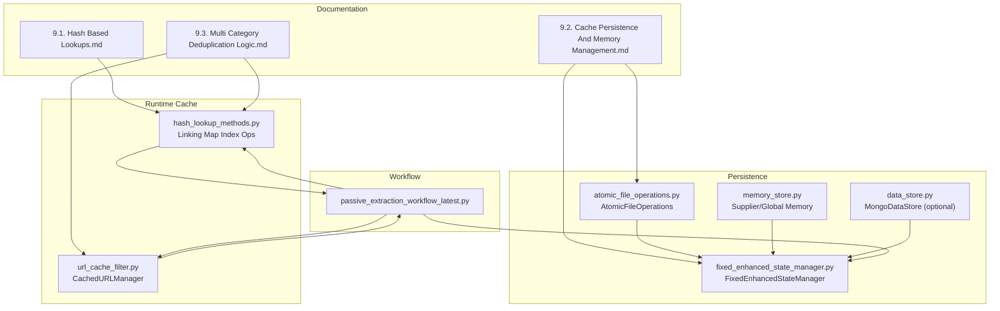
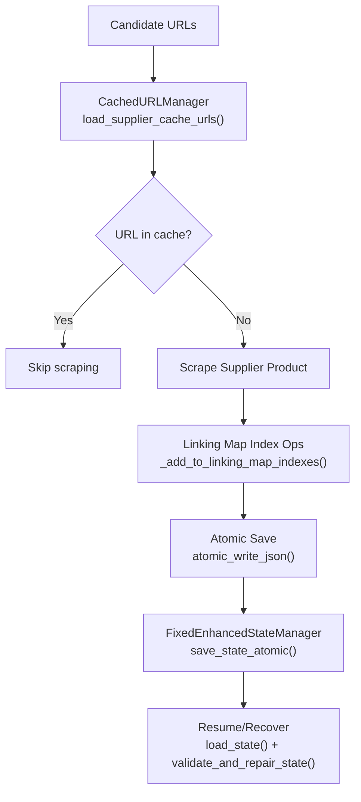
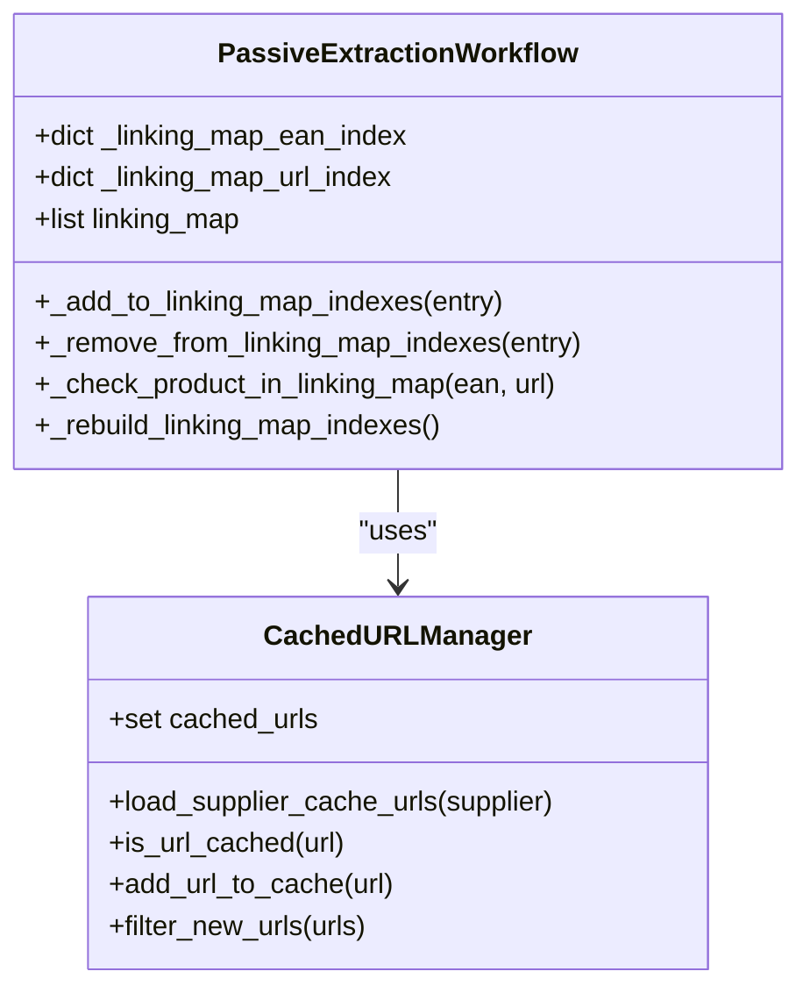
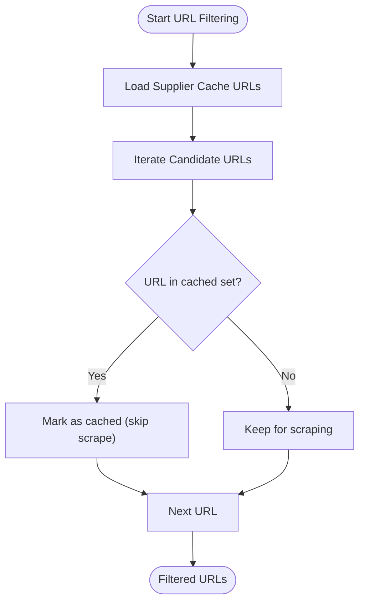
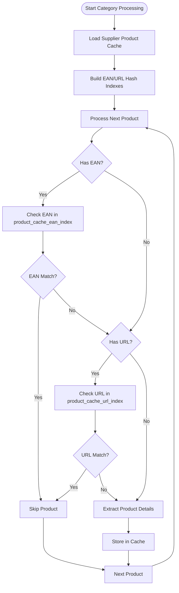
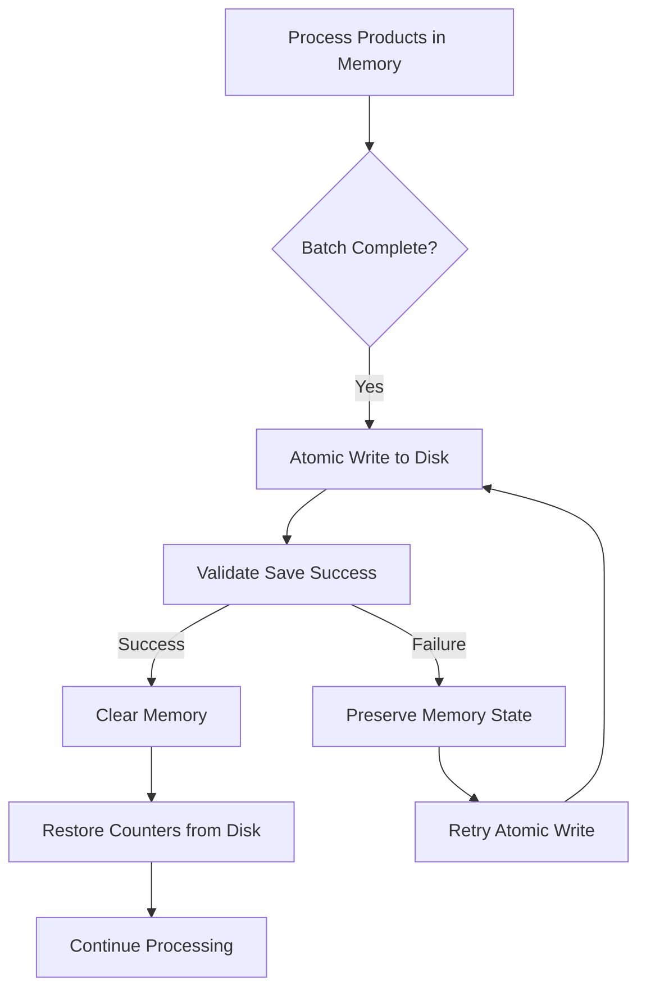
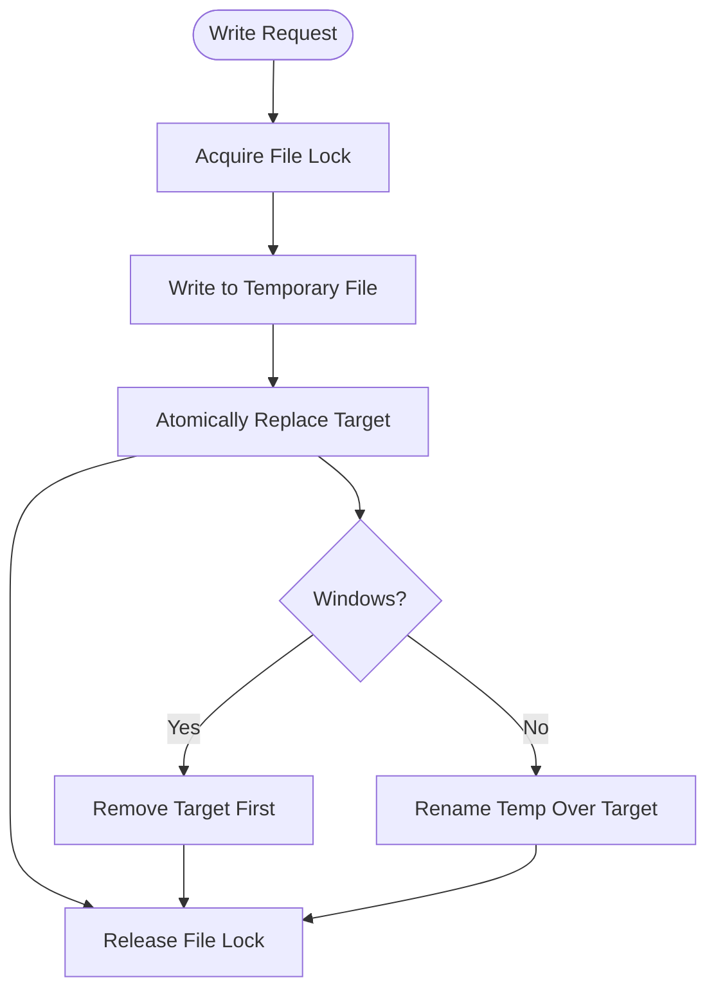
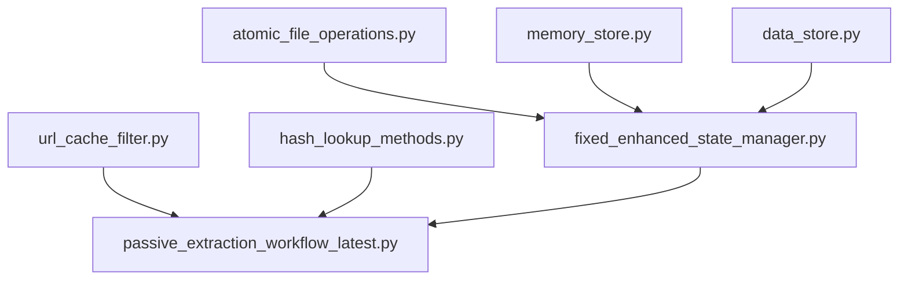

# Cache Management

<cite>
**Referenced Files in This Document**
- [README.md](file://WIKI REPO SEPT17/9. Caching And Deduplication/README.md)
- [9.1. Hash Based Lookups.md](file://WIKI REPO SEPT17/9. Caching And Deduplication/9.1. Hash Based Lookups.md)
- [9.2. Cache Persistence And Memory Management.md](file://WIKI REPO SEPT17/9. Caching And Deduplication/9.2. Cache Persistence And Memory Management.md)
- [9.3. Multi Category Deduplication Logic.md](file://WIKI REPO SEPT17/9. Caching And Deduplication/9.3. Multi Category Deduplication Logic.md)
- [atomic_file_operations.py](file://utils/atomic_file_operations.py)
- [fixed_enhanced_state_manager.py](file://utils/fixed_enhanced_state_manager.py)
- [url_cache_filter.py](file://utils/url_cache_filter.py)
- [hash_lookup_methods.py](file://hash_lookup_methods.py)
- [passive_extraction_workflow_latest.py](file://tools/passive_extraction_workflow_latest.py)
- [memory_store.py](file://src/fba_agent/memory_store.py)
- [data_store.py](file://utils/data_store.py)
</cite>

## Table of Contents
1. [Introduction](#introduction)
2. [Project Structure](#project-structure)
3. [Core Components](#core-components)
4. [Architecture Overview](#architecture-overview)
5. [Detailed Component Analysis](#detailed-component-analysis)
6. [Dependency Analysis](#dependency-analysis)
7. [Performance Considerations](#performance-considerations)
8. [Troubleshooting Guide](#troubleshooting-guide)
9. [Conclusion](#conclusion)
10. [Appendices](#appendices)

## Introduction
This document describes the cache management system used by the Amazon FBA Agent System. It focuses on the cache manager architecture, product caching strategies, persistence mechanisms, and memory optimization techniques. It explains the hash-based lookup system, URL pre-filtering, multi-category deduplication, atomic persistence, and state management integration. It also covers configuration options, performance characteristics, corruption prevention, and troubleshooting.

## Project Structure
The cache and deduplication functionality spans multiple modules:
- Wiki documentation for caching and deduplication
- URL cache filter for pre-filtering
- Hash lookup helpers for linking map optimization
- State manager for persistence and recovery
- Atomic file operations for safe writes
- Memory store for supplier/global memory artifacts
- Data store abstraction for optional persistence backend



**Diagram sources**
- [README.md](file://WIKI REPO SEPT17/9. Caching And Deduplication/README.md#L1-L12)
- [9.1. Hash Based Lookups.md](file://WIKI REPO SEPT17/9. Caching And Deduplication/9.1. Hash Based Lookups.md#L27-L51)
- [9.2. Cache Persistence And Memory Management.md](file://WIKI REPO SEPT17/9. Caching And Deduplication/9.2. Cache Persistence And Memory Management.md#L26-L62)
- [9.3. Multi Category Deduplication Logic.md](file://WIKI REPO SEPT17/9. Caching And Deduplication/9.3. Multi Category Deduplication Logic.md#L29-L51)
- [atomic_file_operations.py](file://utils/atomic_file_operations.py#L17-L93)
- [fixed_enhanced_state_manager.py](file://utils/fixed_enhanced_state_manager.py#L86-L138)
- [url_cache_filter.py](file://utils/url_cache_filter.py#L31-L177)
- [hash_lookup_methods.py](file://hash_lookup_methods.py#L6-L45)
- [passive_extraction_workflow_latest.py](file://tools/passive_extraction_workflow_latest.py#L1-L120)
- [memory_store.py](file://src/fba_agent/memory_store.py#L25-L143)
- [data_store.py](file://utils/data_store.py#L12-L23)

**Section sources**
- [README.md](file://WIKI REPO SEPT17/9. Caching And Deduplication/README.md#L1-L12)

## Core Components
- Hash-based lookup system for O(1) duplicate detection using EAN and URL indexes in the linking map.
- URL cache filter for pre-filtering product URLs against cached supplier product lists.
- Atomic file operations for safe, cross-platform persistence of state and cache data.
- FixedEnhancedStateManager for processing state persistence, validation, recovery, and resumption.
- Memory store for supplier and global memory artifacts (calibration, run history, overrides).
- Data store abstraction for optional MongoDB-backed persistence.

**Section sources**
- [9.1. Hash Based Lookups.md](file://WIKI REPO SEPT17/9. Caching And Deduplication/9.1. Hash Based Lookups.md#L18-L26)
- [9.2. Cache Persistence And Memory Management.md](file://WIKI REPO SEPT17/9. Caching And Deduplication/9.2. Cache Persistence And Memory Management.md#L19-L21)
- [9.3. Multi Category Deduplication Logic.md](file://WIKI REPO SEPT17/9. Caching And Deduplication/9.3. Multi Category Deduplication Logic.md#L20-L27)
- [url_cache_filter.py](file://utils/url_cache_filter.py#L31-L47)
- [atomic_file_operations.py](file://utils/atomic_file_operations.py#L17-L23)
- [fixed_enhanced_state_manager.py](file://utils/fixed_enhanced_state_manager.py#L86-L138)
- [memory_store.py](file://src/fba_agent/memory_store.py#L25-L44)
- [data_store.py](file://utils/data_store.py#L12-L23)

## Architecture Overview
The cache and persistence architecture centers on:
- Pre-filtering stage: URL cache filter checks candidate URLs against cached supplier product lists.
- Linking map stage: Hash indexes enable O(1) checks for EAN and URL presence.
- Persistence stage: Atomic file operations ensure safe writes of state and cache data.
- State management: FixedEnhancedStateManager coordinates resumption, validation, and recovery.



**Diagram sources**
- [url_cache_filter.py](file://utils/url_cache_filter.py#L49-L103)
- [url_cache_filter.py](file://utils/url_cache_filter.py#L153-L171)
- [hash_lookup_methods.py](file://hash_lookup_methods.py#L6-L45)
- [atomic_file_operations.py](file://utils/atomic_file_operations.py#L58-L93)
- [fixed_enhanced_state_manager.py](file://utils/fixed_enhanced_state_manager.py#L285-L329)

## Detailed Component Analysis

### Hash-Based Lookup System
- Purpose: Replace O(n) linear scans with O(1) hash lookups using EAN and URL indexes.
- Implementation: Maintains in-memory dictionaries for EAN and URL, updated atomically when linking map entries change.
- Integration: Used in the passive extraction workflow to quickly detect duplicates before expensive operations.



**Diagram sources**
- [9.1. Hash Based Lookups.md](file://WIKI REPO SEPT17/9. Caching And Deduplication/9.1. Hash Based Lookups.md#L66-L84)
- [hash_lookup_methods.py](file://hash_lookup_methods.py#L6-L45)
- [url_cache_filter.py](file://utils/url_cache_filter.py#L31-L177)

**Section sources**
- [9.1. Hash Based Lookups.md](file://WIKI REPO SEPT17/9. Caching And Deduplication/9.1. Hash Based Lookups.md#L58-L101)
- [hash_lookup_methods.py](file://hash_lookup_methods.py#L6-L45)

### URL Cache Filter
- Purpose: Pre-filter URLs to avoid unnecessary scraping by checking cached supplier product lists.
- Storage: In-memory set of URLs for fast O(1) membership checks.
- Operations: Load cache files, add URLs, filter lists, and monitor statistics.



**Diagram sources**
- [9.1. Hash Based Lookups.md](file://WIKI REPO SEPT17/9. Caching And Deduplication/9.1. Hash Based Lookups.md#L29-L51)
- [url_cache_filter.py](file://utils/url_cache_filter.py#L49-L103)
- [url_cache_filter.py](file://utils/url_cache_filter.py#L153-L171)

**Section sources**
- [9.1. Hash Based Lookups.md](file://WIKI REPO SEPT17/9. Caching And Deduplication/9.1. Hash Based Lookups.md#L105-L127)
- [url_cache_filter.py](file://utils/url_cache_filter.py#L31-L177)

### Multi-Category Deduplication Logic
- Purpose: Prevent duplicate processing across categories by checking both linking map and global product cache.
- Mechanism: Build EAN and URL hash indexes from the supplier’s product cache at startup; check duplicates before extraction.
- Edge cases: URL normalization and graceful fallback when cache is missing or corrupted.



**Diagram sources**
- [9.3. Multi Category Deduplication Logic.md](file://WIKI REPO SEPT17/9. Caching And Deduplication/9.3. Multi Category Deduplication Logic.md#L29-L51)
- [passive_extraction_workflow_latest.py](file://tools/passive_extraction_workflow_latest.py#L7246-L7350)

**Section sources**
- [9.3. Multi Category Deduplication Logic.md](file://WIKI REPO SEPT17/9. Caching And Deduplication/9.3. Multi Category Deduplication Logic.md#L20-L69)
- [passive_extraction_workflow_latest.py](file://tools/passive_extraction_workflow_latest.py#L7246-L7350)

### Cache Persistence and Memory Management
- Persistence: Atomic file operations ensure safe writes and reads; state files include schema versioning and metadata.
- Memory management: Hybrid strategy with periodic disk sync and memory clearing; separate counters for resumption and progress.
- Validation and recovery: State validation, monotonicity guards, and reverse-gap detection to maintain consistency.



**Diagram sources**
- [9.2. Cache Persistence And Memory Management.md](file://WIKI REPO SEPT17/9. Caching And Deduplication/9.2. Cache Persistence And Memory Management.md#L115-L129)
- [atomic_file_operations.py](file://utils/atomic_file_operations.py#L58-L93)
- [fixed_enhanced_state_manager.py](file://utils/fixed_enhanced_state_manager.py#L285-L329)

**Section sources**
- [9.2. Cache Persistence And Memory Management.md](file://WIKI REPO SEPT17/9. Caching And Deduplication/9.2. Cache Persistence And Memory Management.md#L19-L62)
- [9.2. Cache Persistence And Memory Management.md](file://WIKI REPO SEPT17/9. Caching And Deduplication/9.2. Cache Persistence And Memory Management.md#L102-L139)
- [9.2. Cache Persistence And Memory Management.md](file://WIKI REPO SEPT17/9. Caching And Deduplication/9.2. Cache Persistence And Memory Management.md#L140-L150)

### Atomic File Operations
- Provides thread-safe, cross-platform atomic write/read and JSON array append operations.
- Uses temporary files and platform-specific locking to prevent corruption.



**Diagram sources**
- [9.2. Cache Persistence And Memory Management.md](file://WIKI REPO SEPT17/9. Caching And Deduplication/9.2. Cache Persistence And Memory Management.md#L78-L93)
- [atomic_file_operations.py](file://utils/atomic_file_operations.py#L58-L93)

**Section sources**
- [atomic_file_operations.py](file://utils/atomic_file_operations.py#L17-L154)

### State Management Integration
- FixedEnhancedStateManager encapsulates schema versioning, resumption logic, progress tracking, and recovery.
- Integrates with URL cache filter and hash lookup system to coordinate deduplication and persistence.

```mermaid
classDiagram
class FixedEnhancedStateManager {
+str supplier_name
+int resumption_index
+int total_products
+dict gap_processing
+dict system_progression
+load_state() bool
+save_state() void
+validate_and_repair_state() tuple
+update_processing_progress() void
}
class PassiveExtractionWorkflow {
+dict product_cache_ean_index
+dict product_cache_url_index
+FixedEnhancedStateManager state_manager
+_filter_unprocessed_products_with_hash_lookup() list
+_build_product_hash_index() dict
}
class CachedURLManager {
+set cached_urls
+load_supplier_cache_urls() int
+is_url_cached() bool
+filter_new_urls() list
}
PassiveExtractionWorkflow --> FixedEnhancedStateManager : "uses"
PassiveExtractionWorkflow --> CachedURLManager : "uses"
FixedEnhancedStateManager --> "processing_state.json" : "reads/writes"
CachedURLManager --> "supplier_products_cache.json" : "reads"
```

**Diagram sources**
- [9.3. Multi Category Deduplication Logic.md](file://WIKI REPO SEPT17/9. Caching And Deduplication/9.3. Multi Category Deduplication Logic.md#L129-L159)
- [fixed_enhanced_state_manager.py](file://utils/fixed_enhanced_state_manager.py#L86-L138)
- [url_cache_filter.py](file://utils/url_cache_filter.py#L31-L177)

**Section sources**
- [9.3. Multi Category Deduplication Logic.md](file://WIKI REPO SEPT17/9. Caching And Deduplication/9.3. Multi Category Deduplication Logic.md#L120-L169)
- [fixed_enhanced_state_manager.py](file://utils/fixed_enhanced_state_manager.py#L86-L138)

### Memory Store and Data Store Abstractions
- Memory store: Supplies paths and loaders for supplier and global memory artifacts (calibration, run history, overrides).
- Data store: Thin wrapper for optional MongoDB-backed persistence.

**Section sources**
- [memory_store.py](file://src/fba_agent/memory_store.py#L25-L143)
- [data_store.py](file://utils/data_store.py#L12-L23)

## Dependency Analysis
The cache and persistence system exhibits clear separation of concerns:
- URL cache filter depends on supplier cache files and is used by the workflow.
- Hash lookup methods depend on the linking map and are used by the workflow.
- Atomic file operations underpin state persistence.
- State manager coordinates resumption, validation, and recovery.
- Memory store and data store provide complementary persistence mechanisms.



**Diagram sources**
- [url_cache_filter.py](file://utils/url_cache_filter.py#L31-L177)
- [hash_lookup_methods.py](file://hash_lookup_methods.py#L6-L45)
- [atomic_file_operations.py](file://utils/atomic_file_operations.py#L58-L93)
- [fixed_enhanced_state_manager.py](file://utils/fixed_enhanced_state_manager.py#L285-L329)
- [memory_store.py](file://src/fba_agent/memory_store.py#L25-L143)
- [data_store.py](file://utils/data_store.py#L12-L23)
- [passive_extraction_workflow_latest.py](file://tools/passive_extraction_workflow_latest.py#L1-L120)

**Section sources**
- [README.md](file://WIKI REPO SEPT17/9. Caching And Deduplication/README.md#L1-L12)

## Performance Considerations
- Hash-based lookups: Achieve 20–40% performance improvements by replacing linear scans with O(1) operations.
- URL pre-filtering: Reduces unnecessary scraping by checking cached URLs before visiting supplier pages.
- Atomic writes: Minimizes partial-write risks and reduces retries.
- Memory clearing: Balances performance with memory usage by periodically syncing to disk and clearing memory.

**Section sources**
- [9.1. Hash Based Lookups.md](file://WIKI REPO SEPT17/9. Caching And Deduplication/9.1. Hash Based Lookups.md#L113-L127)
- [9.2. Cache Persistence And Memory Management.md](file://WIKI REPO SEPT17/9. Caching And Deduplication/9.2. Cache Persistence And Memory Management.md#L102-L139)

## Troubleshooting Guide
Common issues and remedies:
- Cache file corruption or missing cache files:
  - Use atomic read/write helpers to validate and repair JSON integrity.
  - Fall back to normal processing when caches are unavailable.
- State corruption or inconsistent counters:
  - Use state validation and repair routines to normalize values.
  - Enforce monotonicity across runs to prevent regressions.
- Reverse gap detection:
  - Decide whether to preserve or reset resumption index based on configuration and explicit rebuild flags.
- URL normalization edge cases:
  - Normalize URLs before hashing to avoid false negatives due to case or trailing slash differences.

**Section sources**
- [atomic_file_operations.py](file://utils/atomic_file_operations.py#L141-L151)
- [fixed_enhanced_state_manager.py](file://utils/fixed_enhanced_state_manager.py#L665-L735)
- [fixed_enhanced_state_manager.py](file://utils/fixed_enhanced_state_manager.py#L524-L598)
- [url_cache_filter.py](file://utils/url_cache_filter.py#L113-L117)
- [9.3. Multi Category Deduplication Logic.md](file://WIKI REPO SEPT17/9. Caching And Deduplication/9.3. Multi Category Deduplication Logic.md#L108-L118)

## Conclusion
The cache management system combines hash-based lookups, URL pre-filtering, and robust persistence to achieve high throughput with strong reliability. Atomic file operations and a dedicated state manager ensure data integrity and enable resumable, recoverable workflows. The multi-category deduplication logic complements these mechanisms to eliminate redundant processing across supplier categories.

## Appendices

### Configuration Options and Tunables
- Supplier cache file location and naming:
  - Cache files are located under the cached products directory and named using the supplier name pattern.
- Atomic write behavior:
  - Cross-platform atomic replace with temporary file and locking.
- State schema and metadata:
  - Schema versioning and runtime settings embedded in state files.
- Memory clearing cadence:
  - Configurable intervals for periodic memory clearing and disk sync.

**Section sources**
- [url_cache_filter.py](file://utils/url_cache_filter.py#L60-L62)
- [atomic_file_operations.py](file://utils/atomic_file_operations.py#L58-L93)
- [fixed_enhanced_state_manager.py](file://utils/fixed_enhanced_state_manager.py#L100-L138)
- [9.2. Cache Persistence And Memory Management.md](file://WIKI REPO SEPT17/9. Caching And Deduplication/9.2. Cache Persistence And Memory Management.md#L102-L112)

### Example Operations and Storage Formats
- URL cache filter:
  - Load supplier cache URLs into an in-memory set for O(1) checks.
  - Filter candidate URLs to exclude cached ones.
- Hash lookup methods:
  - Add/remove entries to EAN and URL indexes.
  - Rebuild indexes from the current linking map state.
- Atomic persistence:
  - Write JSON data to a temporary file, then atomically replace the target.
- State persistence:
  - Serialize processing state with schema versioning and metadata.

**Section sources**
- [url_cache_filter.py](file://utils/url_cache_filter.py#L49-L103)
- [url_cache_filter.py](file://utils/url_cache_filter.py#L153-L171)
- [hash_lookup_methods.py](file://hash_lookup_methods.py#L26-L45)
- [atomic_file_operations.py](file://utils/atomic_file_operations.py#L58-L93)
- [fixed_enhanced_state_manager.py](file://utils/fixed_enhanced_state_manager.py#L285-L329)

### Relationships with State Management and Browser Automation
- State management:
  - Coordinates resumption, progress tracking, and recovery.
  - Integrates with URL cache filter and hash lookup system for deduplication.
- Browser automation:
  - URL cache filter reduces unnecessary browser interactions by pre-filtering URLs.
  - Hash-based lookups minimize repeated scraping and matching by detecting duplicates early.

**Section sources**
- [9.3. Multi Category Deduplication Logic.md](file://WIKI REPO SEPT17/9. Caching And Deduplication/9.3. Multi Category Deduplication Logic.md#L142-L159)
- [9.1. Hash Based Lookups.md](file://WIKI REPO SEPT17/9. Caching And Deduplication/9.1. Hash Based Lookups.md#L143-L161)
- [passive_extraction_workflow_latest.py](file://tools/passive_extraction_workflow_latest.py#L1-L120)