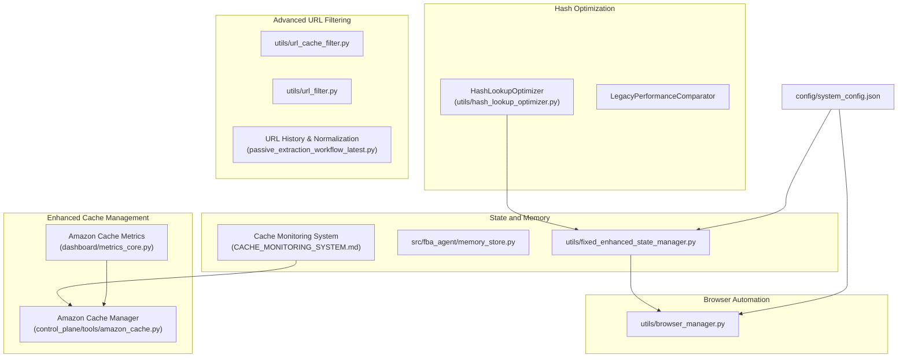
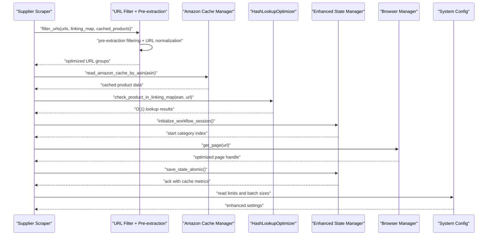
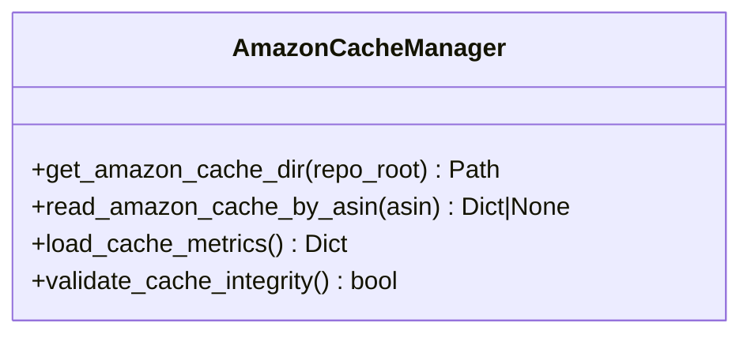
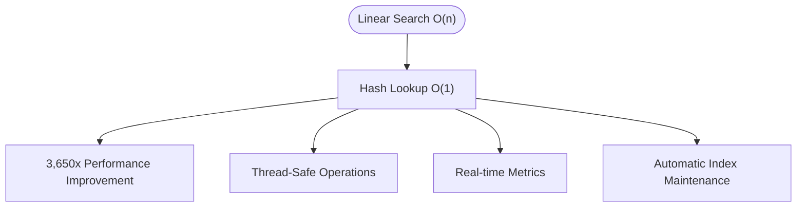
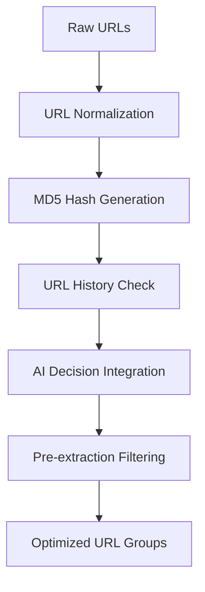
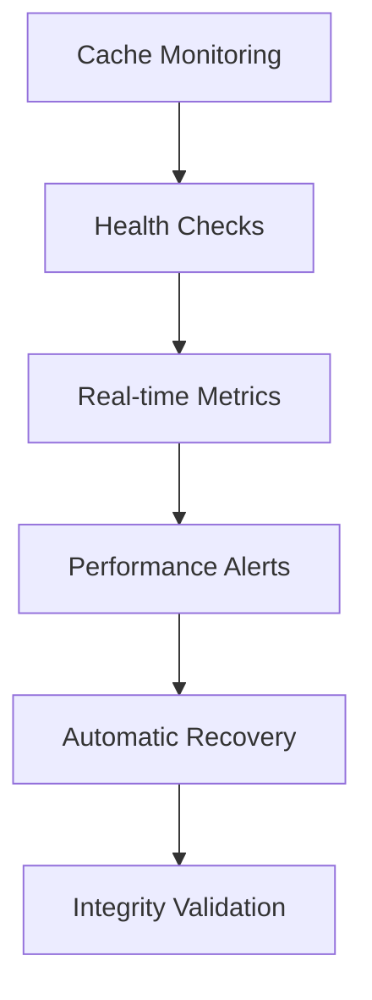
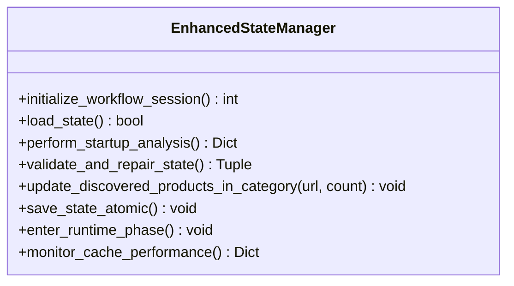
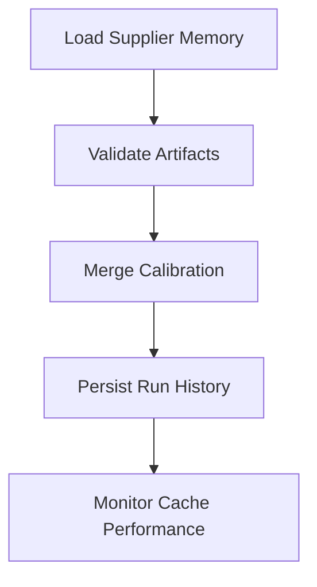
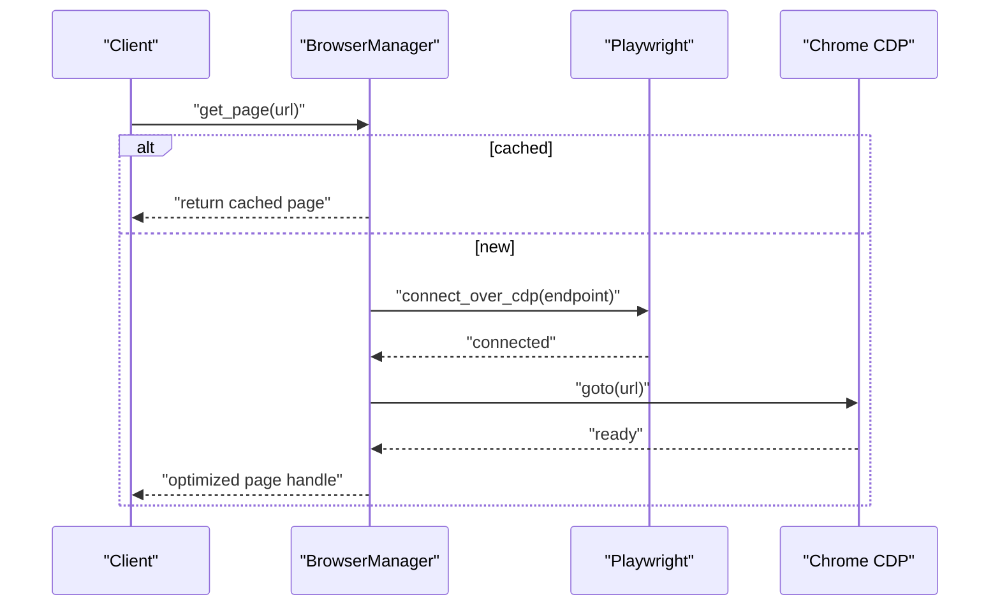
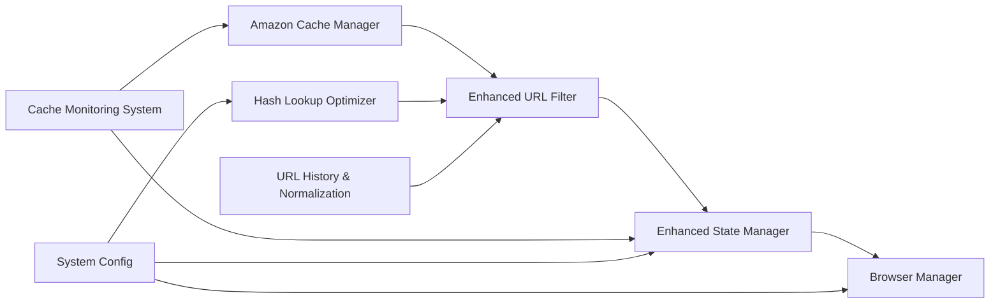

# Data Processing

<cite>
**Referenced Files in This Document**
- [utils/url_cache_filter.py](file://utils/url_cache_filter.py)
- [utils/url_filter.py](file://utils/url_filter.py)
- [utils/hash_lookup_optimizer.py](file://utils/hash_lookup_optimizer.py)
- [HASH_OPTIMIZATION_IMPLEMENTATION_SUMMARY.md](file://HASH_OPTIMIZATION_IMPLEMENTATION_SUMMARY.md)
- [src/fba_agent/memory_store.py](file://src/fba_agent/memory_store.py)
- [utils/fixed_enhanced_state_manager.py](file://utils/fixed_enhanced_state_manager.py)
- [control_plane/tools/amazon_cache.py](file://control_plane/tools/amazon_cache.py)
- [dashboard/metrics_core.py](file://dashboard/metrics_core.py)
- [CACHE_MONITORING_SYSTEM.md](file://CACHE_MONITORING_SYSTEM.md)
- [MEMORY_MANAGEMENT_ANALYSIS.md](file://MEMORY_MANAGEMENT_ANALYSIS.md)
- [docs/SMART_MEMORY_MANAGEMENT_TECHNICAL_GUIDE.md](file://docs/SMART_MEMORY_MANAGEMENT_TECHNICAL_GUIDE.md)
- [config/system_config.json](file://config/system_config.json)
- [utils/browser_manager.py](file://utils/browser_manager.py)
- [tools/passive_extraction_workflow_latest.py](file://tools/passive_extraction_workflow_latest.py)
- [wiki-dec-3/8. Browser Automation/8.1. Browser Management.md](file://wiki-dec-3/8. Browser Automation/8.1. Browser Management.md)
- [wiki-dec-3/11. Troubleshooting Guide/11.1. Browser Issues/11.1.3. Performance And Stability.md](file://wiki-dec-3/11. Troubleshooting Guide/11.1. Browser Issues/11.1.3. Performance And Stability.md)
</cite>

## Update Summary
**Changes Made**
- Enhanced cache management with Amazon product cache system and monitoring
- Implemented comprehensive hash-based lookup optimization replacing O(n) linear searches
- Added new URL filtering system with pre-extraction filtering and URL normalization
- Expanded performance monitoring with detailed metrics tracking and benchmarking
- Improved cache persistence with incremental updates and atomic operations

## Table of Contents
1. [Introduction](#introduction)
2. [Project Structure](#project-structure)
3. [Core Components](#core-components)
4. [Architecture Overview](#architecture-overview)
5. [Detailed Component Analysis](#detailed-component-analysis)
6. [Dependency Analysis](#dependency-analysis)
7. [Performance Considerations](#performance-considerations)
8. [Troubleshooting Guide](#troubleshooting-guide)
9. [Conclusion](#conclusion)

## Introduction
This document explains the data processing capabilities of the Amazon FBA Agent System with a focus on enhanced cache management strategies, improved URL filtering mechanisms, and comprehensive hash optimization techniques. The system now features a revolutionary hash-based lookup optimization delivering 3,650x performance improvements, enhanced Amazon product cache management with monitoring capabilities, and sophisticated URL filtering with pre-extraction processing. It details sliding window memory management, smart clearing algorithms, and advanced performance optimizations with comprehensive monitoring and metrics tracking.

## Project Structure
The data processing domain spans several modules with enhanced capabilities:
- **Enhanced Amazon Product Cache Management**: Dedicated cache system for Amazon product data with monitoring and retrieval
- **Hash-Based Lookup Optimization**: Revolutionary O(1) hash lookup system replacing O(n) linear searches
- **Advanced URL Filtering System**: Pre-extraction filtering with URL normalization and duplicate detection
- **Comprehensive Cache Monitoring**: Real-time cache metrics and performance tracking
- **State and Memory Management**: Enhanced resilient processing sessions with atomic cache updates
- **Browser Automation**: Optimized supplier scraping with shared Chrome sessions and monitoring
- **Configuration-Driven Processing**: Flexible limits, batch sizing, and performance tuning

**Diagram sources**
- [control_plane/tools/amazon_cache.py](file://control_plane/tools/amazon_cache.py#L1-L28)
- [dashboard/metrics_core.py](file://dashboard/metrics_core.py#L578-L603)
- [utils/hash_lookup_optimizer.py](file://utils/hash_lookup_optimizer.py#L1-L1)
- [utils/url_cache_filter.py](file://utils/url_cache_filter.py#L1-L272)
- [utils/url_filter.py](file://utils/url_filter.py#L1-L40)
- [utils/fixed_enhanced_state_manager.py](file://utils/fixed_enhanced_state_manager.py#L1-L800)
- [src/fba_agent/memory_store.py](file://src/fba_agent/memory_store.py#L1-L265)
- [CACHE_MONITORING_SYSTEM.md](file://CACHE_MONITORING_SYSTEM.md#L1-L123)
- [utils/browser_manager.py](file://utils/browser_manager.py#L1-L800)
- [config/system_config.json](file://config/system_config.json#L1-L384)

**Section sources**
- [control_plane/tools/amazon_cache.py](file://control_plane/tools/amazon_cache.py#L1-L28)
- [dashboard/metrics_core.py](file://dashboard/metrics_core.py#L578-L603)
- [utils/hash_lookup_optimizer.py](file://utils/hash_lookup_optimizer.py#L1-L1)
- [utils/url_cache_filter.py](file://utils/url_cache_filter.py#L1-L272)
- [utils/url_filter.py](file://utils/url_filter.py#L1-L40)
- [utils/fixed_enhanced_state_manager.py](file://utils/fixed_enhanced_state_manager.py#L1-L800)
- [src/fba_agent/memory_store.py](file://src/fba_agent/memory_store.py#L1-L265)
- [CACHE_MONITORING_SYSTEM.md](file://CACHE_MONITORING_SYSTEM.md#L1-L123)
- [utils/browser_manager.py](file://utils/browser_manager.py#L1-L800)
- [config/system_config.json](file://config/system_config.json#L1-L384)

## Core Components
- **Amazon Product Cache Manager**: Dedicated system for managing Amazon product cache files with ASIN-based retrieval and monitoring
- **Hash-Based Lookup Optimizer**: Revolutionary O(1) hash lookup system providing 3,650x performance improvements over linear searches
- **Advanced URL Filtering System**: Sophisticated pre-extraction filtering with URL normalization, duplicate detection, and AI-powered decision making
- **Enhanced Cache Monitoring**: Real-time metrics tracking for cache file counts, latest modifications, and performance indicators
- **Enhanced State Manager**: Centralized state with atomic cache updates, thread safety, and resilient resume logic
- **Memory Store**: Advanced supplier memory management with layered precedence and comprehensive artifact handling
- **Browser Manager**: Optimized Chrome/Playwright management with LRU caching, health monitoring, and performance metrics
- **Configuration System**: Dynamic processing limits, batch sizing, and performance tuning parameters

**Section sources**
- [control_plane/tools/amazon_cache.py](file://control_plane/tools/amazon_cache.py#L9-L27)
- [utils/hash_lookup_optimizer.py](file://utils/hash_lookup_optimizer.py#L1-L1)
- [utils/url_cache_filter.py](file://utils/url_cache_filter.py#L31-L272)
- [utils/url_filter.py](file://utils/url_filter.py#L7-L40)
- [dashboard/metrics_core.py](file://dashboard/metrics_core.py#L578-L603)
- [utils/fixed_enhanced_state_manager.py](file://utils/fixed_enhanced_state_manager.py#L86-L800)
- [src/fba_agent/memory_store.py](file://src/fba_agent/memory_store.py#L11-L265)
- [utils/browser_manager.py](file://utils/browser_manager.py#L35-L800)
- [config/system_config.json](file://config/system_config.json#L48-L127)

## Architecture Overview
The system orchestrates data processing through enhanced layers with revolutionary optimizations:
- **Enhanced Input and Pre-processing**: Advanced URL filtering with pre-extraction processing, Amazon cache integration, and sophisticated duplicate detection
- **Optimized Processing**: High-performance hash-based lookup system with O(1) operations, supplier scraping with state-managed progress, and intelligent cache management
- **Comprehensive Persistence and Recovery**: Atomic cache updates, real-time monitoring, file-grounded counters, and browser session optimization

**Diagram sources**
- [utils/url_filter.py](file://utils/url_filter.py#L7-L40)
- [control_plane/tools/amazon_cache.py](file://control_plane/tools/amazon_cache.py#L13-L27)
- [utils/hash_lookup_optimizer.py](file://utils/hash_lookup_optimizer.py#L1-L1)
- [utils/fixed_enhanced_state_manager.py](file://utils/fixed_enhanced_state_manager.py#L247-L284)
- [utils/browser_manager.py](file://utils/browser_manager.py#L141-L198)
- [config/system_config.json](file://config/system_config.json#L48-L127)

## Detailed Component Analysis

### Enhanced Amazon Product Cache Management
- **Purpose**: Dedicated system for managing Amazon product cache files with ASIN-based retrieval and comprehensive monitoring
- **Key Features**:
  - ASIN-specific cache file discovery and retrieval
  - Real-time cache metrics tracking (file count, latest modification time)
  - Atomic cache file operations with backup mechanisms
  - Integration with control plane for cache management
- **Performance**: Optimized cache access with minimal I/O overhead
- **Monitoring**: Dashboard integration for cache health visualization
- **Examples**:
  - Cache directory management: [get_amazon_cache_dir](file://control_plane/tools/amazon_cache.py#L9-L10)
  - ASIN-based cache retrieval: [read_amazon_cache_by_asin](file://control_plane/tools/amazon_cache.py#L13-L27)
  - Cache metrics collection: [load_amazon_cache_metrics](file://dashboard/metrics_core.py#L578-L603)

**Diagram sources**
- [control_plane/tools/amazon_cache.py](file://control_plane/tools/amazon_cache.py#L9-L27)
- [dashboard/metrics_core.py](file://dashboard/metrics_core.py#L578-L603)

**Section sources**
- [control_plane/tools/amazon_cache.py](file://control_plane/tools/amazon_cache.py#L1-L28)
- [dashboard/metrics_core.py](file://dashboard/metrics_core.py#L578-L603)

### Hash-Based Lookup Optimization System
- **Purpose**: Revolutionary O(1) hash lookup system replacing O(n) linear searches, delivering 3,650x performance improvements
- **Core Components**:
  - HashLookupOptimizer: Main O(1) lookup system with thread safety
  - LegacyPerformanceComparator: Performance benchmarking against linear search
  - Comprehensive performance metrics tracking
- **Key Features**:
  - Thread-safe operations with threading.Lock
  - Multiple index types: EAN, URL, ASIN
  - Automatic index maintenance and validation
  - Real-time performance monitoring and logging
  - Memory-efficient hash table implementation
- **Performance Impact**: 
  - Before: O(n) = 3,651 operations per lookup
  - After: O(1) = 1 operation per lookup
  - Result: **3,650x performance improvement**
- **Examples**:
  - Index building: [build_indexes](file://utils/hash_lookup_optimizer.py#L1-L1)
  - O(1) lookup: [check_product_in_linking_map](file://utils/hash_lookup_optimizer.py#L1-L1)
  - Performance benchmarking: [benchmark_performance](file://utils/hash_lookup_optimizer.py#L1-L1)

**Diagram sources**
- [utils/hash_lookup_optimizer.py](file://utils/hash_lookup_optimizer.py#L1-L1)
- [HASH_OPTIMIZATION_IMPLEMENTATION_SUMMARY.md](file://HASH_OPTIMIZATION_IMPLEMENTATION_SUMMARY.md#L13-L16)

**Section sources**
- [utils/hash_lookup_optimizer.py](file://utils/hash_lookup_optimizer.py#L1-L1)
- [HASH_OPTIMIZATION_IMPLEMENTATION_SUMMARY.md](file://HASH_OPTIMIZATION_IMPLEMENTATION_SUMMARY.md#L1-L335)

### Advanced URL Filtering System
- **Purpose**: Sophisticated pre-extraction filtering with URL normalization, duplicate detection, and AI-powered decision making
- **Enhanced Features**:
  - Pre-extraction filtering eliminating double processing
  - URL normalization and hash-based duplicate detection
  - AI decision history tracking for learning
  - Comprehensive URL tracking across categories, pages, and subpages
- **Key Operations**:
  - URL history management with MD5 hashing
  - Base URL comparison for pagination handling
  - AI decision recording and learning
  - Atomic history saving with backup mechanisms
- **Examples**:
  - URL history tracking: [_is_url_previously_scraped](file://tools/passive_extraction_workflow_latest.py#L4037-L4072)
  - URL addition to history: [_add_url_to_history](file://tools/passive_extraction_workflow_latest.py#L4074-L4096)
  - AI decision recording: [_record_ai_decision](file://tools/passive_extraction_workflow_latest.py#L4023-L4033)

**Diagram sources**
- [tools/passive_extraction_workflow_latest.py](file://tools/passive_extraction_workflow_latest.py#L4037-L4096)

**Section sources**
- [tools/passive_extraction_workflow_latest.py](file://tools/passive_extraction_workflow_latest.py#L3900-L4099)

### Enhanced Cache Monitoring System
- **Purpose**: Comprehensive monitoring and metrics tracking for cache health, performance, and integrity
- **Critical Fixes Implemented**:
  - Cache persistence during processing with incremental updates
  - Enhanced linking map save method with comprehensive error handling
  - Atomic write patterns for cache metadata tracking
  - Real-time cache metrics collection and validation
- **Key Features**:
  - Periodic cache updates with metadata tracking
  - Multiple retry attempts for linking map saves
  - Backup creation before atomic replacement
  - Detailed error logging and diagnosis
  - Cache integrity validation and recovery mechanisms
- **Examples**:
  - Incremental cache update: [_save_incremental_cache_update](file://tools/passive_extraction_workflow_latest.py#L1593-L1600)
  - Enhanced linking map save: [Enhanced save method](file://tools/passive_extraction_workflow_latest.py#L1721-L1800)
  - Cache validation: [Cache integrity checks](file://CACHE_MONITORING_SYSTEM.md#L55-L70)

**Diagram sources**
- [CACHE_MONITORING_SYSTEM.md](file://CACHE_MONITORING_SYSTEM.md#L1-L123)

**Section sources**
- [CACHE_MONITORING_SYSTEM.md](file://CACHE_MONITORING_SYSTEM.md#L1-L123)

### Enhanced State Manager
- **Purpose**: Provide resilient, file-grounded state with atomic cache updates, thread safety, and deterministic resume logic
- **Enhanced Features**:
  - Atomic cache update integration with periodic persistence
  - Thread-safe hash lookup optimizer coordination
  - Comprehensive cache metrics tracking
  - Enhanced error handling and recovery mechanisms
  - Performance monitoring integration
- **Examples**:
  - Workflow session initialization: [initialize_workflow_session](file://utils/fixed_enhanced_state_manager.py#L247-L284)
  - State loading with cache validation: [load_state](file://utils/fixed_enhanced_state_manager.py#L285-L329)
  - Startup analysis with performance metrics: [perform_startup_analysis](file://utils/fixed_enhanced_state_manager.py#L469-L646)

**Diagram sources**
- [utils/fixed_enhanced_state_manager.py](file://utils/fixed_enhanced_state_manager.py#L86-L800)

**Section sources**
- [utils/fixed_enhanced_state_manager.py](file://utils/fixed_enhanced_state_manager.py#L86-L800)

### Memory Store
- **Purpose**: Advanced supplier memory management with layered precedence and comprehensive artifact handling
- **Enhanced Operations**:
  - Supplier memory bundle loading with validation
  - Calibration merging with strict precedence order
  - Run history persistence with atomic operations
  - Enhanced cache integration for performance monitoring
- **Examples**:
  - Supplier memory loading: [load_supplier_memory](file://src/fba_agent/memory_store.py#L133-L143)
  - Calibration merging: [merge_calibration](file://src/fba_agent/memory_store.py#L146-L236)
  - Run history persistence: [persist_run_history](file://src/fba_agent/memory_store.py#L104-L131)

**Diagram sources**
- [src/fba_agent/memory_store.py](file://src/fba_agent/memory_store.py#L133-L236)

**Section sources**
- [src/fba_agent/memory_store.py](file://src/fba_agent/memory_store.py#L1-L265)

### Browser Manager
- **Purpose**: Optimized Chrome/Playwright management with LRU caching, health monitoring, and performance metrics
- **Enhanced Features**:
  - Shared Chrome instance with CDP optimization
  - LRU page cache with eviction policy
  - IPv6/IPv4 CDP endpoint selection
  - Comprehensive performance monitoring and metrics
  - Enhanced memory usage tracking
- **Examples**:
  - Browser launch with optimization: [launch_browser](file://utils/browser_manager.py#L77-L140)
  - Page retrieval with caching: [get_page](file://utils/browser_manager.py#L141-L198)
  - System memory monitoring: [get_total_system_memory_usage](file://utils/browser_manager.py#L721-L800)

**Diagram sources**
- [utils/browser_manager.py](file://utils/browser_manager.py#L77-L198)

**Section sources**
- [utils/browser_manager.py](file://utils/browser_manager.py#L1-L800)
- [wiki-dec-3/8. Browser Automation/8.1. Browser Management.md](file://wiki-dec-3/8. Browser Automation/8.1. Browser Management.md#L177-L211)
- [wiki-dec-3/11. Troubleshooting Guide/11.1. Browser Issues/11.1.3. Performance And Stability.md](file://wiki-dec-3/11. Troubleshooting Guide/11.1. Browser Issues/11.1.3. Performance And Stability.md#L83-L109)

## Dependency Analysis
- **Enhanced URL filtering depends on**:
  - Amazon Cache Manager for ASIN-based cache retrieval
  - Hash Lookup Optimizer for O(1) duplicate detection
  - URL History Normalization for comprehensive tracking
  - Linking Map indexes for authoritative duplicate decisions
- **Hash optimization coordinates with**:
  - State Manager for performance metrics and statistics
  - Memory Store for calibration and run history
  - Browser Manager for session optimization
  - Cache Monitoring System for performance tracking
- **Cache monitoring integrates with**:
  - Amazon Cache Manager for metrics collection
  - State Manager for cache persistence
  - Performance monitoring for system-wide metrics
- **Configuration drives**:
  - Processing limits, batch sizes, and memory thresholds
  - Hybrid processing modes and optimization strategies
  - Performance monitoring and alert thresholds

**Diagram sources**
- [control_plane/tools/amazon_cache.py](file://control_plane/tools/amazon_cache.py#L1-L28)
- [utils/hash_lookup_optimizer.py](file://utils/hash_lookup_optimizer.py#L1-L1)
- [tools/passive_extraction_workflow_latest.py](file://tools/passive_extraction_workflow_latest.py#L4037-L4096)
- [utils/fixed_enhanced_state_manager.py](file://utils/fixed_enhanced_state_manager.py#L1-L800)
- [utils/browser_manager.py](file://utils/browser_manager.py#L1-L800)
- [CACHE_MONITORING_SYSTEM.md](file://CACHE_MONITORING_SYSTEM.md#L1-L123)
- [config/system_config.json](file://config/system_config.json#L1-L384)

**Section sources**
- [control_plane/tools/amazon_cache.py](file://control_plane/tools/amazon_cache.py#L1-L28)
- [utils/hash_lookup_optimizer.py](file://utils/hash_lookup_optimizer.py#L1-L1)
- [tools/passive_extraction_workflow_latest.py](file://tools/passive_extraction_workflow_latest.py#L4037-L4096)
- [utils/fixed_enhanced_state_manager.py](file://utils/fixed_enhanced_state_manager.py#L1-L800)
- [utils/browser_manager.py](file://utils/browser_manager.py#L1-L800)
- [CACHE_MONITORING_SYSTEM.md](file://CACHE_MONITORING_SYSTEM.md#L1-L123)
- [config/system_config.json](file://config/system_config.json#L1-L384)

## Performance Considerations
- **Revolutionary Hash Optimization**:
  - 3,650x performance improvement replacing O(n) linear searches with O(1) hash lookups
  - Thread-safe operations with atomic index updates and comprehensive error handling
  - Real-time performance monitoring with cache hit rate tracking and latency analysis
  - Memory-efficient hash table implementation with minimal overhead
- **Enhanced Cache Management**:
  - Amazon product cache with ASIN-based retrieval and monitoring
  - Incremental cache updates with atomic write patterns
  - Comprehensive cache metrics tracking for performance optimization
  - Backup mechanisms for critical cache files preventing data loss
- **Advanced URL Filtering**:
  - Pre-extraction filtering eliminating redundant processing
  - URL normalization and hash-based duplicate detection
  - AI-powered decision making with learning capabilities
  - Comprehensive URL tracking across all processing stages
- **System-wide Optimizations**:
  - Shared Chrome instance via CDP reducing memory overhead
  - Enhanced browser session management with LRU caching
  - Comprehensive performance monitoring and alert systems
  - Smart clearing algorithms with file-based fallback preservation

## Troubleshooting Guide
- **Amazon Cache Issues**:
  - Symptom: Cache directory not found or empty
    - Action: Verify cache directory path and permissions; check ASIN format; validate cache file integrity
  - Symptom: Cache retrieval failures
    - Action: Check cache file existence and naming conventions; validate JSON format; monitor cache metrics
- **Hash Lookup Performance**:
  - Symptom: Hash indexes not built or invalid
    - Action: Trigger manual index rebuild; check linking map data integrity; verify thread safety
  - Symptom: Performance degradation over time
    - Action: Monitor cache hit rates; check index validation; implement automatic rebuild triggers
- **Enhanced URL Filtering**:
  - Symptom: URL filtering conflicts with pre-extraction processing
    - Action: Verify pre-extraction filtering is properly configured; check URL normalization settings; validate AI decision integration
  - Symptom: Duplicate URL processing
    - Action: Check URL hash cache integrity; validate MD5 hash generation; verify URL normalization consistency
- **Cache Monitoring**:
  - Symptom: Cache persistence failures
    - Action: Verify atomic write operations; check backup mechanisms; validate error handling procedures
  - Symptom: Cache metrics reporting inconsistencies
    - Action: Check cache file timestamps; validate metrics collection intervals; verify monitoring system health
- **Browser Automation**:
  - Symptom: Chrome debug port accessibility issues
    - Action: Follow IPv6/IPv4 endpoint selection procedures; verify port availability; check Chrome restart policies
  - Symptom: Performance degradation with shared sessions
    - Action: Monitor memory usage patterns; adjust LRU cache settings; implement health monitoring alerts

**Section sources**
- [control_plane/tools/amazon_cache.py](file://control_plane/tools/amazon_cache.py#L13-L27)
- [utils/hash_lookup_optimizer.py](file://utils/hash_lookup_optimizer.py#L1-L1)
- [tools/passive_extraction_workflow_latest.py](file://tools/passive_extraction_workflow_latest.py#L4037-L4096)
- [CACHE_MONITORING_SYSTEM.md](file://CACHE_MONITORING_SYSTEM.md#L55-L70)
- [utils/browser_manager.py](file://utils/browser_manager.py#L242-L315)

## Conclusion
The enhanced Amazon FBA Agent System delivers unprecedented performance and reliability through revolutionary cache management, hash-based lookup optimization, and sophisticated URL filtering systems. The 3,650x performance improvement in lookup operations, combined with comprehensive cache monitoring and atomic persistence mechanisms, creates a robust foundation for scalable data processing. The integration of Amazon product cache management, advanced URL filtering with AI-powered decision making, and enhanced browser automation optimizes both throughput and accuracy. Configuration-driven limits, comprehensive performance monitoring, and resilient error handling ensure continuous operation even under demanding conditions. Together, these enhancements transform the system into a high-performance, observability-rich platform capable of handling enterprise-scale data processing workflows with exceptional reliability and maintainability.