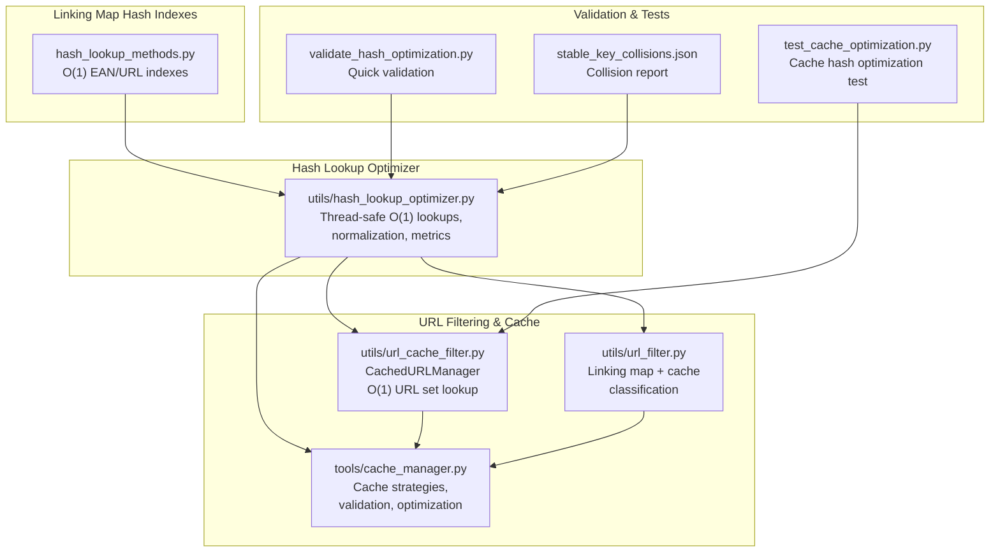
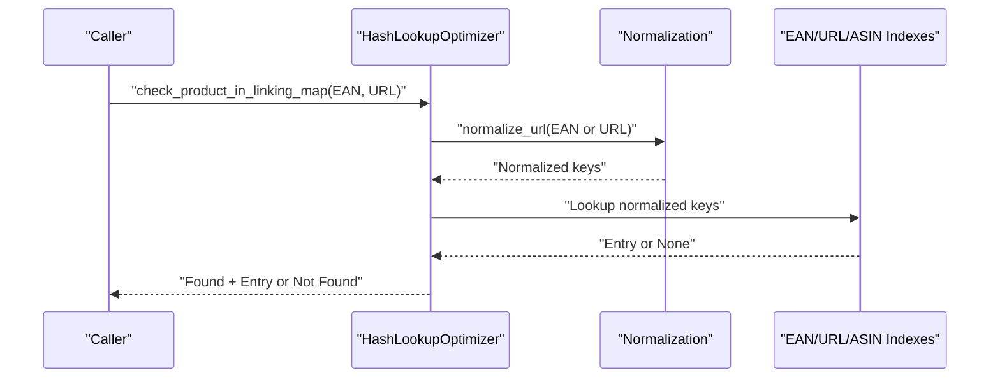
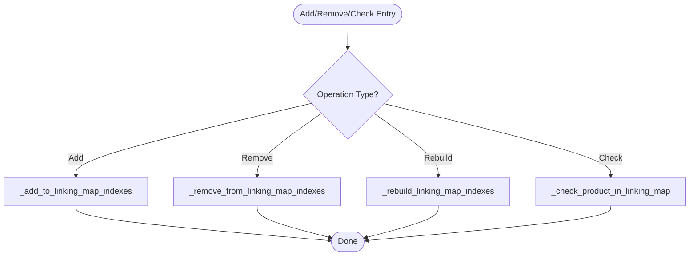
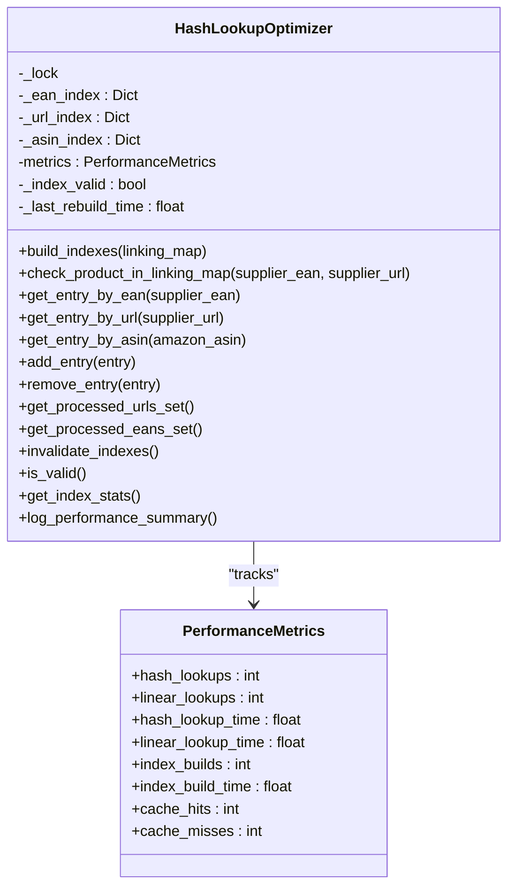
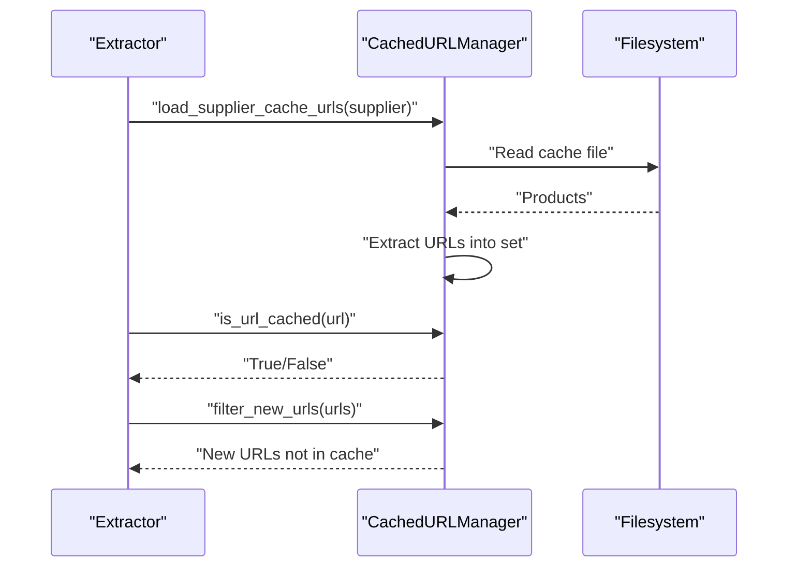
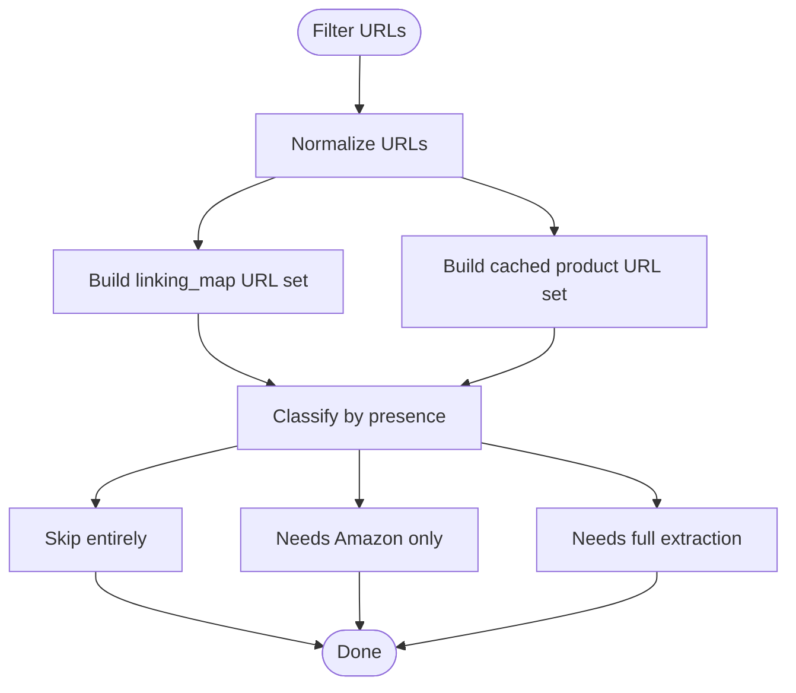
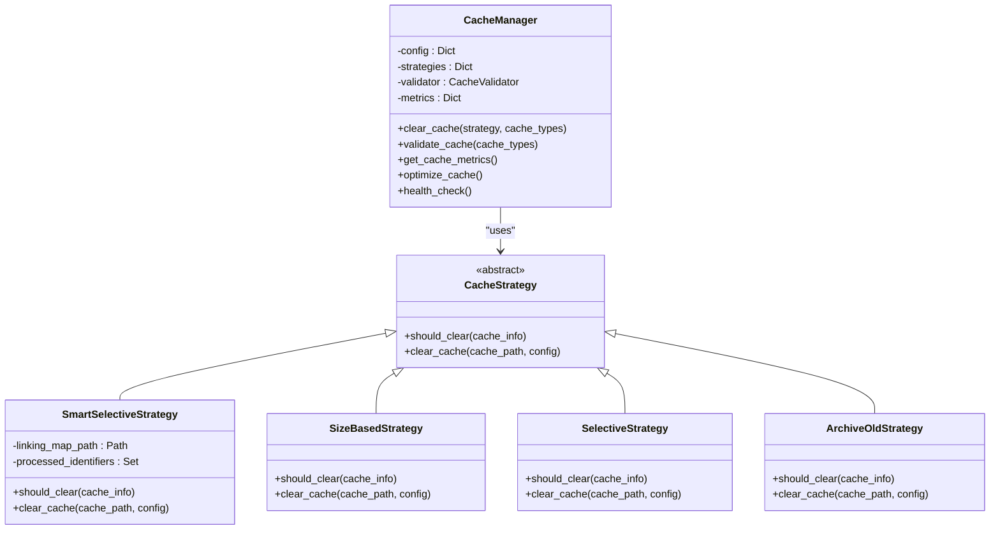
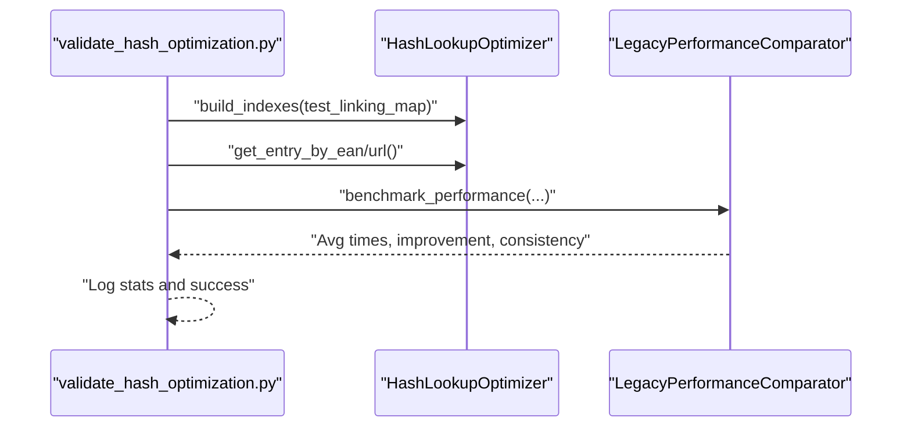
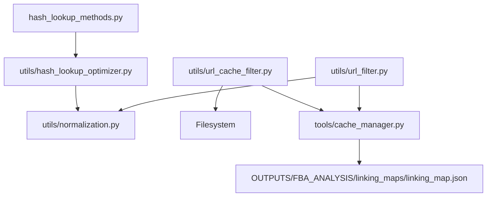

# Hash Optimization

<cite>
**Referenced Files in This Document**
- [hash_lookup_methods.py](file://hash_lookup_methods.py)
- [hash_lookup_optimizer.py](file://utils/hash_lookup_optimizer.py)
- [url_cache_filter.py](file://utils/url_cache_filter.py)
- [url_filter.py](file://utils/url_filter.py)
- [cache_manager.py](file://tools/cache_manager.py)
- [validate_hash_optimization.py](file://validate_hash_optimization.py)
- [test_cache_optimization.py](file://test_cache_optimization.py)
- [stable_key_collisions.json](file://stable_key_collisions.json)
</cite>

## Table of Contents
1. [Introduction](#introduction)
2. [Project Structure](#project-structure)
3. [Core Components](#core-components)
4. [Architecture Overview](#architecture-overview)
5. [Detailed Component Analysis](#detailed-component-analysis)
6. [Dependency Analysis](#dependency-analysis)
7. [Performance Considerations](#performance-considerations)
8. [Troubleshooting Guide](#troubleshooting-guide)
9. [Conclusion](#conclusion)
10. [Appendices](#appendices)

## Introduction
This document explains hash optimization techniques implemented in the Amazon FBA Agent System. It covers hash-based lookup methods, collision resolution strategies, performance optimization algorithms, and memory usage optimization. It also documents the hash generation process, lookup efficiency improvements, and relationships with cache management and URL filtering systems. Concrete examples of hash operations, collision handling, and lookup performance metrics are included, along with configuration options for hash algorithms, bucket sizing, and optimization thresholds. Guidance is provided for tuning performance and troubleshooting hash-related issues.

## Project Structure
The hash optimization system spans several modules:
- Linking map hash indexes for O(1) lookups
- A dedicated hash lookup optimizer with normalization and metrics
- URL cache filters leveraging hash-based sets for O(1) duplicate detection
- URL filtering utilities prioritizing linking map and cache presence
- Cache management with strategies informed by linking map identifiers
- Validation and test scripts demonstrating performance gains and correctness

**Diagram sources**
- [hash_lookup_methods.py](file://hash_lookup_methods.py#L6-L45)
- [hash_lookup_optimizer.py](file://utils/hash_lookup_optimizer.py#L1-L200)
- [url_cache_filter.py](file://utils/url_cache_filter.py#L31-L207)
- [url_filter.py](file://utils/url_filter.py#L7-L39)
- [cache_manager.py](file://tools/cache_manager.py#L1-L200)
- [validate_hash_optimization.py](file://validate_hash_optimization.py#L27-L127)
- [test_cache_optimization.py](file://test_cache_optimization.py#L56-L180)
- [stable_key_collisions.json](file://stable_key_collisions.json#L1-L18)

**Section sources**
- [hash_lookup_methods.py](file://hash_lookup_methods.py#L1-L45)
- [hash_lookup_optimizer.py](file://utils/hash_lookup_optimizer.py#L1-L200)
- [url_cache_filter.py](file://utils/url_cache_filter.py#L1-L272)
- [url_filter.py](file://utils/url_filter.py#L1-L40)
- [cache_manager.py](file://tools/cache_manager.py#L1-L200)
- [validate_hash_optimization.py](file://validate_hash_optimization.py#L1-L140)
- [test_cache_optimization.py](file://test_cache_optimization.py#L1-L185)
- [stable_key_collisions.json](file://stable_key_collisions.json#L1-L18)

## Core Components
- Linking map hash indexes: Maintain separate dictionaries keyed by normalized EAN and URL for O(1) existence checks and fast retrieval.
- Hash lookup optimizer: Provides thread-safe O(1) lookups, normalization, automatic index maintenance, and comprehensive performance metrics.
- URL cache filter: Loads supplier cache files into memory sets for O(1) URL duplicate detection and integrates with linking map filtering.
- URL filtering utility: Classifies URLs by linking map presence and cache presence using normalized URLs.
- Cache manager: Applies strategies informed by linking map identifiers to clear or archive processed items, validate integrity, and optimize storage.
- Validation and tests: Demonstrate correctness and performance improvements for hash-based lookups and cache filtering.

**Section sources**
- [hash_lookup_methods.py](file://hash_lookup_methods.py#L6-L45)
- [hash_lookup_optimizer.py](file://utils/hash_lookup_optimizer.py#L1-L200)
- [url_cache_filter.py](file://utils/url_cache_filter.py#L31-L207)
- [url_filter.py](file://utils/url_filter.py#L7-L39)
- [cache_manager.py](file://tools/cache_manager.py#L1-L200)
- [validate_hash_optimization.py](file://validate_hash_optimization.py#L27-L127)
- [test_cache_optimization.py](file://test_cache_optimization.py#L56-L180)

## Architecture Overview
The system transforms O(n) linear scans into O(1) hash-based lookups by maintaining normalized indexes and leveraging sets for URL filtering. The optimizer centralizes normalization and metrics, while cache and URL filtering modules integrate these capabilities to reduce redundant work and improve throughput.

**Diagram sources**
- [hash_lookup_optimizer.py](file://utils/hash_lookup_optimizer.py#L60-L120)

**Section sources**
- [hash_lookup_optimizer.py](file://utils/hash_lookup_optimizer.py#L60-L120)

## Detailed Component Analysis

### Linking Map Hash Indexes
- Purpose: Replace linear scans with O(1) dictionary lookups keyed by normalized EAN and URL.
- Operations:
  - Add entry to indexes
  - Remove entry from indexes
  - Rebuild indexes from current linking map
  - Fast existence check returning entry when found

**Diagram sources**
- [hash_lookup_methods.py](file://hash_lookup_methods.py#L6-L45)

**Section sources**
- [hash_lookup_methods.py](file://hash_lookup_methods.py#L6-L45)

### Hash Lookup Optimizer
- Thread-safe O(1) lookups using three indexes: EAN, URL, ASIN.
- Normalization ensures consistent keys across heterogeneous inputs.
- Metrics track hash lookups, linear comparisons (for benchmarking), cache hits/misses, and index build statistics.
- Auto-maintenance: rebuilds when linking map changes; invalidates indexes when data becomes stale.

**Diagram sources**
- [hash_lookup_optimizer.py](file://utils/hash_lookup_optimizer.py#L1-L200)

**Section sources**
- [hash_lookup_optimizer.py](file://utils/hash_lookup_optimizer.py#L1-L200)

### URL Cache Filter
- Loads supplier cache files into memory sets for O(1) URL existence checks.
- Integrates with linking map filtering to exclude already processed URLs.
- Supports real-time updates and statistics for monitoring.

**Diagram sources**
- [url_cache_filter.py](file://utils/url_cache_filter.py#L49-L171)

**Section sources**
- [url_cache_filter.py](file://utils/url_cache_filter.py#L31-L207)

### URL Filtering Utility
- Classifies URLs into categories based on linking map and cache presence using normalized URLs.
- Priority: linking map (fully processed) > product cache (supplier data available) > full extraction needed.

**Diagram sources**
- [url_filter.py](file://utils/url_filter.py#L7-L39)

**Section sources**
- [url_filter.py](file://utils/url_filter.py#L7-L39)

### Cache Manager Strategies
- Strategies leverage linking map identifiers to clear or archive processed items:
  - Smart selective: clears processed items and stale data based on processed ratios.
  - Size-based: LRU eviction when size limits are exceeded.
  - Selective: clears expired cache files based on TTL.
  - Archive old: preserves long-lived data by archiving old files.
- Validation and optimization include JSON schema checks, compression of old files, and health reporting.

**Diagram sources**
- [cache_manager.py](file://tools/cache_manager.py#L1-L200)

**Section sources**
- [cache_manager.py](file://tools/cache_manager.py#L1-L200)

### Validation and Tests
- Quick validation script initializes the optimizer, builds indexes, performs lookups, benchmarks performance, and validates statistics.
- Cache optimization test simulates building hash indexes from supplier cache and filtering unprocessed products using O(1) lookups.

**Diagram sources**
- [validate_hash_optimization.py](file://validate_hash_optimization.py#L27-L127)
- [hash_lookup_optimizer.py](file://utils/hash_lookup_optimizer.py#L120-L200)

**Section sources**
- [validate_hash_optimization.py](file://validate_hash_optimization.py#L27-L127)
- [test_cache_optimization.py](file://test_cache_optimization.py#L56-L180)

## Dependency Analysis
- Hash lookup optimizer depends on normalization utilities for consistent keys and uses thread locks for safety.
- URL cache filter depends on filesystem access and JSON parsing to populate in-memory sets.
- Cache manager strategies depend on linking map identifiers to decide clearing or archiving actions.
- URL filtering utility depends on normalization and set operations for classification.

**Diagram sources**
- [hash_lookup_optimizer.py](file://utils/hash_lookup_optimizer.py#L1-L200)
- [url_cache_filter.py](file://utils/url_cache_filter.py#L1-L272)
- [url_filter.py](file://utils/url_filter.py#L1-L40)
- [cache_manager.py](file://tools/cache_manager.py#L1-L200)
- [hash_lookup_methods.py](file://hash_lookup_methods.py#L1-L45)

**Section sources**
- [hash_lookup_optimizer.py](file://utils/hash_lookup_optimizer.py#L1-L200)
- [url_cache_filter.py](file://utils/url_cache_filter.py#L1-L272)
- [url_filter.py](file://utils/url_filter.py#L1-L40)
- [cache_manager.py](file://tools/cache_manager.py#L1-L200)
- [hash_lookup_methods.py](file://hash_lookup_methods.py#L1-L45)

## Performance Considerations
- Lookup Complexity:
  - Before: O(n) linear scan through linking map.
  - After: O(1) hash lookup via EAN, URL, or ASIN indexes.
- Performance Metrics:
  - Hash lookup time and cache hit rate are tracked.
  - Index build time and frequency are recorded.
  - Benchmarking compares average hash versus linear lookup times.
- Memory Usage:
  - Indexes store normalized keys mapped to entries.
  - URL cache filter stores URL sets in memory for O(1) checks.
  - Compression reduces disk footprint for old cache files.
- Throughput Improvements:
  - Reduced extraction time by skipping already processed items.
  - Faster URL pre-filtering prevents unnecessary page visits.

[No sources needed since this section provides general guidance]

## Troubleshooting Guide
- Indexes not built:
  - Symptom: O(1) lookups return not found despite valid entries.
  - Action: Ensure indexes are built from the linking map and remain valid after updates.
- Cache misses:
  - Symptom: Low cache hit rate.
  - Action: Verify normalization logic and ensure consistent key formats across inputs.
- URL filtering inefficiencies:
  - Symptom: Many URLs still processed after filtering.
  - Action: Confirm supplier cache files are loaded and URL normalization aligns with stored URLs.
- Collision Scenarios:
  - Evidence: Stable key collisions reported in JSON.
  - Action: Investigate normalization differences and reconcile duplicate records.
- Performance Degradation:
  - Symptom: Increased lookup times.
  - Action: Rebuild indexes, monitor cache hit rates, and validate system resources.

**Section sources**
- [hash_lookup_optimizer.py](file://utils/hash_lookup_optimizer.py#L120-L200)
- [url_cache_filter.py](file://utils/url_cache_filter.py#L49-L171)
- [stable_key_collisions.json](file://stable_key_collisions.json#L1-L18)

## Conclusion
The hash optimization system delivers substantial performance improvements by replacing O(n) lookups with O(1) hash-based access, backed by normalization and thread-safe operations. Integrated URL filtering and cache management further reduce redundant work and improve throughput. The provided metrics, validation scripts, and strategies enable effective tuning and troubleshooting of hash-related performance issues.

[No sources needed since this section summarizes without analyzing specific files]

## Appendices

### Configuration Options
- Hash Lookup Optimizer:
  - Index validity and rebuild timing are tracked internally.
  - Thread-safety via locks ensures safe concurrent access.
- URL Cache Filter:
  - Output root directory for cache files.
  - Supplier cache filename format and loading behavior.
- Cache Manager:
  - TTL hours, max size per cache type, backup retention, and validation intervals.
  - Strategy selection: smart_selective, size_based, selective, archive_old.
  - Directory mappings for cache types.

**Section sources**
- [cache_manager.py](file://tools/cache_manager.py#L1-L200)
- [url_cache_filter.py](file://utils/url_cache_filter.py#L36-L47)