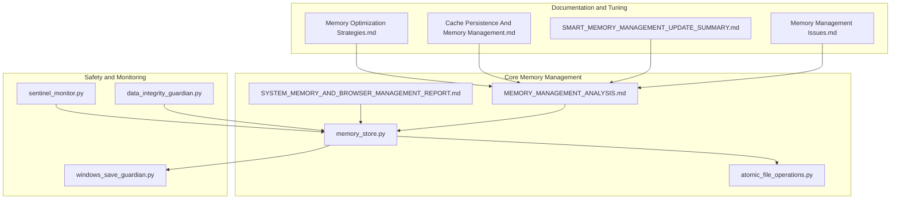
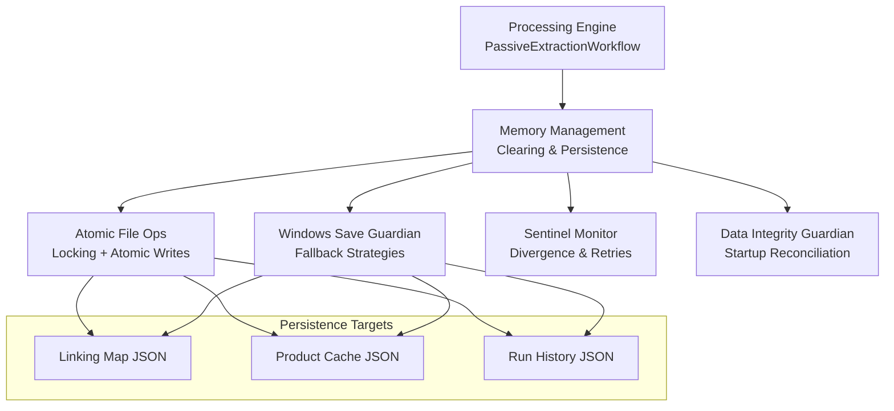
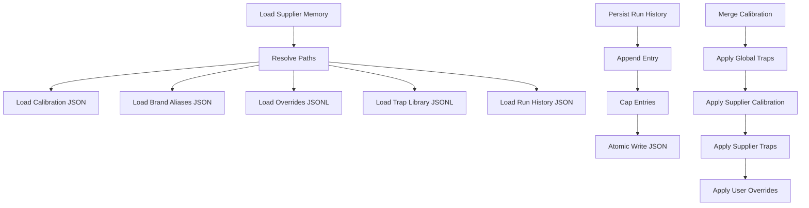
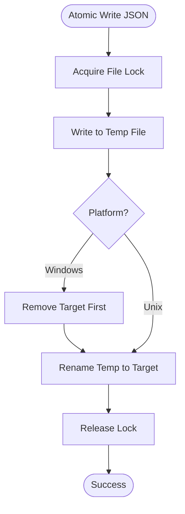
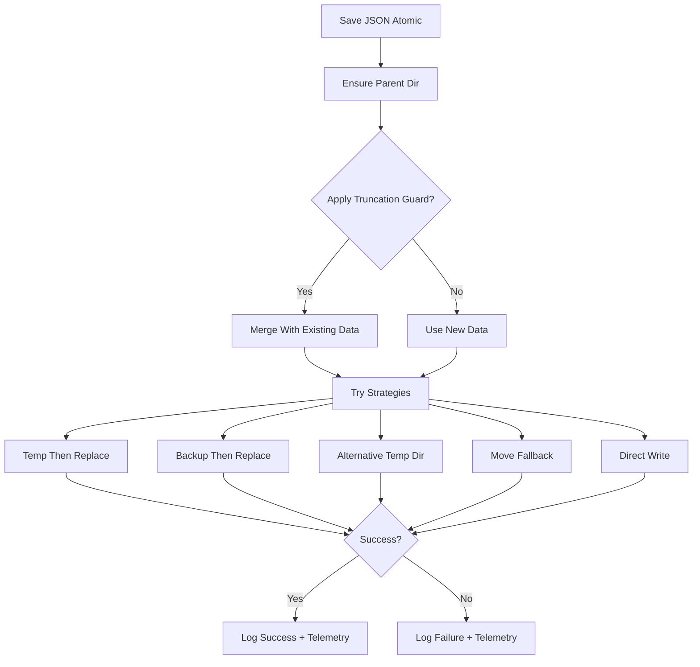
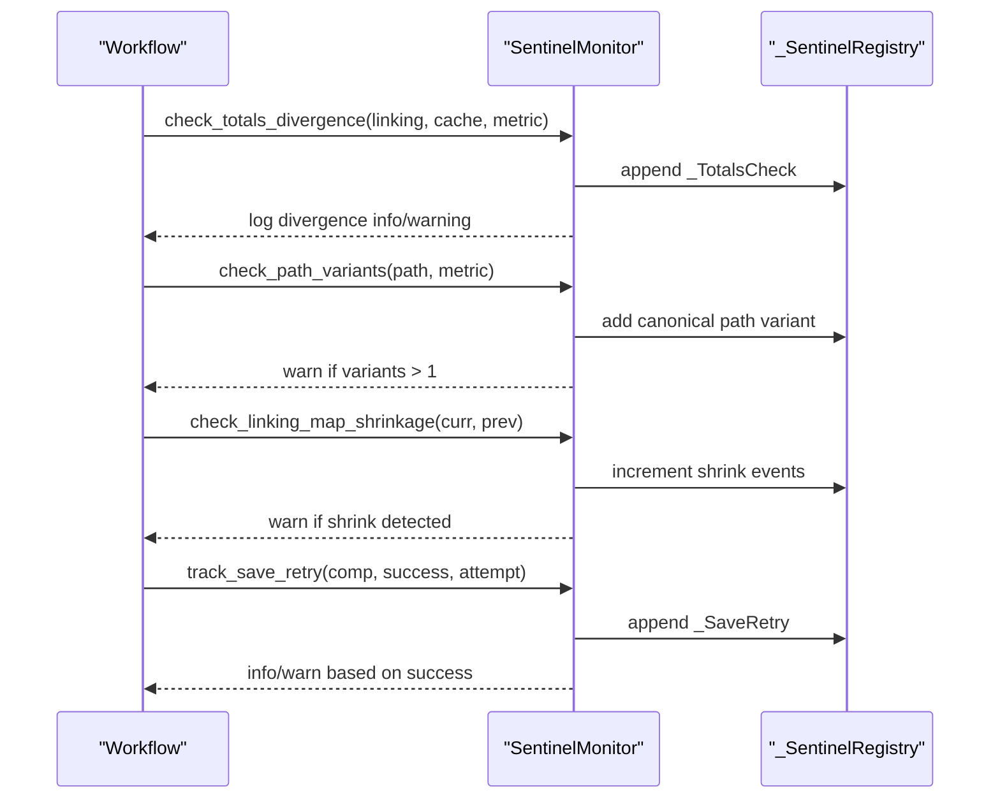
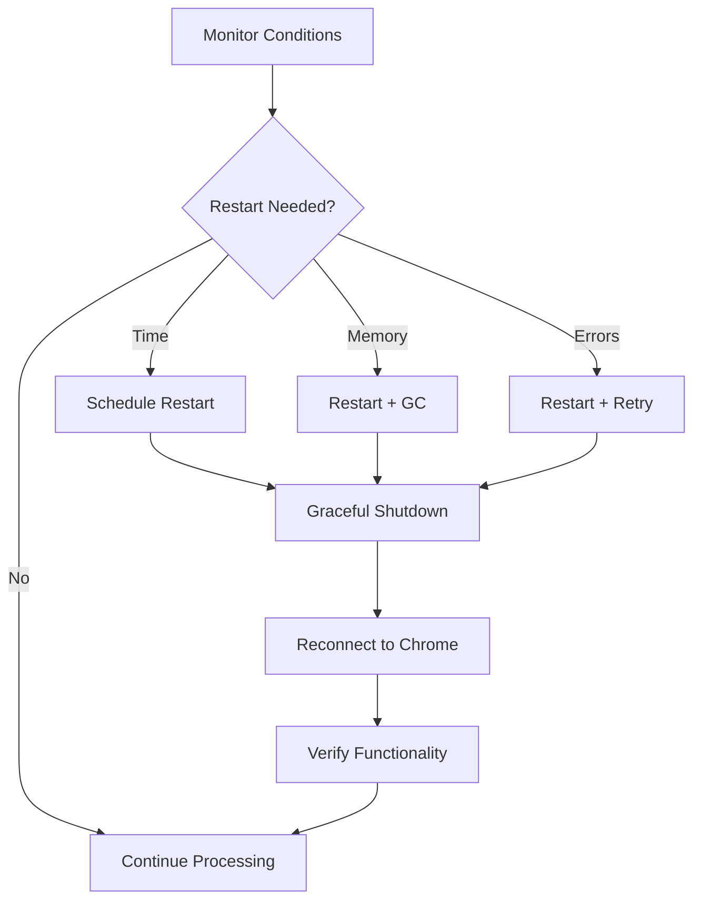
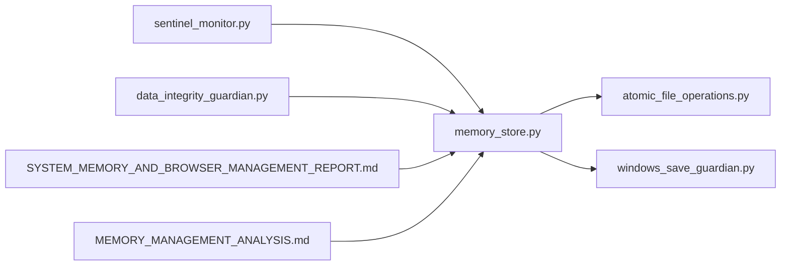

# Memory Management

<cite>
**Referenced Files in This Document**
- [MEMORY_MANAGEMENT_ANALYSIS.md](file://MEMORY_MANAGEMENT_ANALYSIS.md)
- [SYSTEM_MEMORY_AND_BROWSER_MANAGEMENT_REPORT.md](file://SYSTEM_MEMORY_AND_BROWSER_MANAGEMENT_REPORT.md)
- [data_integrity_guardian.py](file://utils/data_integrity_guardian.py)
- [sentinel_monitor.py](file://utils/sentinel_monitor.py)
- [windows_save_guardian.py](file://utils/windows_save_guardian.py)
- [memory_store.py](file://src/fba_agent/memory_store.py)
- [atomic_file_operations.py](file://utils/atomic_file_operations.py)
- [Memory Optimization Strategies.md](file://WIKI REPO SEPT17/11. Troubleshooting Guide/11.2. Memory Management Issues/11.2.2. Memory Optimization Strategies.md)
- [Cache Persistence And Memory Management.md](file://WIKI REPO SEPT17/9. Caching And Deduplication/9.2. Cache Persistence And Memory Management.md)
- [SMART_MEMORY_MANAGEMENT_UPDATE_SUMMARY.md](file://SMART_MEMORY_MANAGEMENT_UPDATE_SUMMARY.md)
- [Memory Management Issues.md](file://repowiki 12 dec & 20 jan/en/content/Troubleshooting Guide/Memory Management Issues/Memory Management Issues.md)
</cite>

## Table of Contents
1. [Introduction](#introduction)
2. [Project Structure](#project-structure)
3. [Core Components](#core-components)
4. [Architecture Overview](#architecture-overview)
5. [Detailed Component Analysis](#detailed-component-analysis)
6. [Dependency Analysis](#dependency-analysis)
7. [Performance Considerations](#performance-considerations)
8. [Troubleshooting Guide](#troubleshooting-guide)
9. [Conclusion](#conclusion)
10. [Appendices](#appendices)

## Introduction
This document provides a comprehensive guide to memory management strategies implemented in the Amazon FBA Agent System. It focuses on the hybrid disk-memory architecture, memory clearing patterns, garbage collection optimization, and resource cleanup procedures. It also covers the Data Integrity Guardian, Sentinel monitoring mechanisms, and Windows Save Protection features. The content explains configuration options for memory thresholds, cleanup intervals, and safety checks, and details relationships with cache management and browser automation components. Practical examples, monitoring techniques, and optimization strategies are included to help prevent memory leaks, monitor performance, and troubleshoot memory-related issues.

## Project Structure
The memory management system spans multiple modules:
- Core memory clearing and persistence logic
- Cross-platform atomic file operations
- Windows-specific atomic save protection
- Runtime sentinel monitoring
- Data integrity reconciliation
- Configuration-driven tuning parameters

**Diagram sources**
- [memory_store.py](file://src/fba_agent/memory_store.py#L1-L265)
- [atomic_file_operations.py](file://utils/atomic_file_operations.py#L1-L189)
- [windows_save_guardian.py](file://utils/windows_save_guardian.py#L1-L609)
- [sentinel_monitor.py](file://utils/sentinel_monitor.py#L1-L201)
- [data_integrity_guardian.py](file://utils/data_integrity_guardian.py#L1-L6)
- [MEMORY_MANAGEMENT_ANALYSIS.md](file://MEMORY_MANAGEMENT_ANALYSIS.md#L1-L230)
- [SYSTEM_MEMORY_AND_BROWSER_MANAGEMENT_REPORT.md](file://SYSTEM_MEMORY_AND_BROWSER_MANAGEMENT_REPORT.md#L1-L246)
- [Memory Optimization Strategies.md](file://WIKI REPO SEPT17/11. Troubleshooting Guide/11.2. Memory Management Issues/11.2.2. Memory Optimization Strategies.md#L19-L48)
- [Cache Persistence And Memory Management.md](file://WIKI REPO SEPT17/9. Caching And Deduplication/9.2. Cache Persistence And Memory Management.md#L180-L200)
- [SMART_MEMORY_MANAGEMENT_UPDATE_SUMMARY.md](file://SMART_MEMORY_MANAGEMENT_UPDATE_SUMMARY.md#L95-L127)
- [Memory Management Issues.md](file://repowiki 12 dec & 20 jan/en/content/Troubleshooting Guide/Memory Management Issues/Memory Management Issues.md#L43-L65)

**Section sources**
- [memory_store.py](file://src/fba_agent/memory_store.py#L1-L265)
- [atomic_file_operations.py](file://utils/atomic_file_operations.py#L1-L189)
- [windows_save_guardian.py](file://utils/windows_save_guardian.py#L1-L609)
- [sentinel_monitor.py](file://utils/sentinel_monitor.py#L1-L201)
- [data_integrity_guardian.py](file://utils/data_integrity_guardian.py#L1-L6)
- [MEMORY_MANAGEMENT_ANALYSIS.md](file://MEMORY_MANAGEMENT_ANALYSIS.md#L1-L230)
- [SYSTEM_MEMORY_AND_BROWSER_MANAGEMENT_REPORT.md](file://SYSTEM_MEMORY_AND_BROWSER_MANAGEMENT_REPORT.md#L1-L246)
- [Memory Optimization Strategies.md](file://WIKI REPO SEPT17/11. Troubleshooting Guide/11.2. Memory Management Issues/11.2.2. Memory Optimization Strategies.md#L19-L48)
- [Cache Persistence And Memory Management.md](file://WIKI REPO SEPT17/9. Caching And Deduplication/9.2. Cache Persistence And Memory Management.md#L180-L200)
- [SMART_MEMORY_MANAGEMENT_UPDATE_SUMMARY.md](file://SMART_MEMORY_MANAGEMENT_UPDATE_SUMMARY.md#L95-L127)
- [Memory Management Issues.md](file://repowiki 12 dec & 20 jan/en/content/Troubleshooting Guide/Memory Management Issues/Memory Management Issues.md#L43-L65)

## Core Components
- Hybrid Memory-Disk Strategy: The system processes data in memory for performance and periodically persists to disk, then clears memory to prevent accumulation. This pattern is enforced with safeguards to ensure disk writes succeed before clearing memory.
- Atomic File Operations: Cross-platform atomic write/read and JSON array append operations with file locking and integrity validation.
- Windows Save Protection: Robust atomic persistence with multiple fallback strategies to handle WinError 5 and file locking issues on Windows.
- Sentinel Monitoring: Runtime monitoring of totals divergence, path variants, linking map shrinkage, and save retry attempts to detect anomalies.
- Data Integrity Guardian: Startup reconciliation and data consistency checks required before resume calculations.
- Browser Restart System: Automatic browser restarts to prevent connection degradation and authentication timeouts.
- Configuration-Driven Tuning: Parameters such as accumulation threshold and continuity window enable balancing memory usage and performance.

**Section sources**
- [MEMORY_MANAGEMENT_ANALYSIS.md](file://MEMORY_MANAGEMENT_ANALYSIS.md#L5-L96)
- [SYSTEM_MEMORY_AND_BROWSER_MANAGEMENT_REPORT.md](file://SYSTEM_MEMORY_AND_BROWSER_MANAGEMENT_REPORT.md#L11-L134)
- [atomic_file_operations.py](file://utils/atomic_file_operations.py#L17-L154)
- [windows_save_guardian.py](file://utils/windows_save_guardian.py#L26-L182)
- [sentinel_monitor.py](file://utils/sentinel_monitor.py#L63-L200)
- [data_integrity_guardian.py](file://utils/data_integrity_guardian.py#L1-L6)

## Architecture Overview
The memory management architecture integrates runtime safeguards and persistence layers to ensure reliability and performance.

**Diagram sources**
- [memory_store.py](file://src/fba_agent/memory_store.py#L104-L131)
- [atomic_file_operations.py](file://utils/atomic_file_operations.py#L58-L126)
- [windows_save_guardian.py](file://utils/windows_save_guardian.py#L86-L182)
- [sentinel_monitor.py](file://utils/sentinel_monitor.py#L79-L177)
- [data_integrity_guardian.py](file://utils/data_integrity_guardian.py#L1-L6)

## Detailed Component Analysis

### Memory Store and Supplier Memory Bundles
The memory store module defines supplier and global memory paths, loads JSON/JSONL files, and persists run history and calibration data using atomic writes.

Key responsibilities:
- Supplier memory paths and global memory paths
- Loading JSON and JSONL files with robust error handling
- Persisting run history with capped entries
- Merging supplier calibration with precedence order
- Persisting calibration with atomic write

**Diagram sources**
- [memory_store.py](file://src/fba_agent/memory_store.py#L25-L143)
- [memory_store.py](file://src/fba_agent/memory_store.py#L104-L131)
- [memory_store.py](file://src/fba_agent/memory_store.py#L146-L236)
- [memory_store.py](file://src/fba_agent/memory_store.py#L239-L247)

**Section sources**
- [memory_store.py](file://src/fba_agent/memory_store.py#L25-L143)
- [memory_store.py](file://src/fba_agent/memory_store.py#L104-L131)
- [memory_store.py](file://src/fba_agent/memory_store.py#L146-L236)
- [memory_store.py](file://src/fba_agent/memory_store.py#L239-L247)

### Atomic File Operations
The atomic file operations module provides:
- Cross-platform file locking via context managers
- Atomic JSON write/read with temporary file and rename semantics
- Atomic JSON array append with read-modify-write and atomic replacement
- Safe backup creation and JSON integrity validation

**Diagram sources**
- [atomic_file_operations.py](file://utils/atomic_file_operations.py#L58-L92)

**Section sources**
- [atomic_file_operations.py](file://utils/atomic_file_operations.py#L17-L154)

### Windows Save Protection
The Windows Save Guardian provides multiple fallback strategies to resolve WinError 5 and file locking issues:
- Anti-truncation guard to prevent accidental data loss
- Merge with existing data for small writes
- Strategy order: alternative temp dir, direct write
- Telemetry logging for each strategy attempt
- Detailed error logging and warnings

**Diagram sources**
- [windows_save_guardian.py](file://utils/windows_save_guardian.py#L86-L182)
- [windows_save_guardian.py](file://utils/windows_save_guardian.py#L266-L479)

**Section sources**
- [windows_save_guardian.py](file://utils/windows_save_guardian.py#L26-L182)
- [windows_save_guardian.py](file://utils/windows_save_guardian.py#L266-L479)

### Sentinel Monitoring Mechanisms
The Sentinel Monitor tracks:
- Totals divergence between linking map and cache counts
- Path variants for the same resource
- Unexpected shrinkage in linking map size
- Save retry attempts with success/failure logs

**Diagram sources**
- [sentinel_monitor.py](file://utils/sentinel_monitor.py#L79-L177)

**Section sources**
- [sentinel_monitor.py](file://utils/sentinel_monitor.py#L63-L200)

### Data Integrity Guardian
The Data Integrity Guardian enforces mandatory startup reconciliation and data consistency checks prior to resume calculations and filtering operations. It ensures that the system starts from a validated state.

**Section sources**
- [data_integrity_guardian.py](file://utils/data_integrity_guardian.py#L1-L6)

### Browser Restart System and Authentication Resilience
The system includes automatic browser restarts to prevent connection degradation and authentication timeouts:
- Time-based restarts every 2.5 hours
- Memory-based restart triggers (Python >3GB)
- Error-based restarts (timeouts, authentication failures)
- Graceful shutdown and reconnection sequence

**Diagram sources**
- [SYSTEM_MEMORY_AND_BROWSER_MANAGEMENT_REPORT.md](file://SYSTEM_MEMORY_AND_BROWSER_MANAGEMENT_REPORT.md#L76-L109)

**Section sources**
- [SYSTEM_MEMORY_AND_BROWSER_MANAGEMENT_REPORT.md](file://SYSTEM_MEMORY_AND_BROWSER_MANAGEMENT_REPORT.md#L76-L134)

## Dependency Analysis
The memory management system exhibits layered dependencies:
- Core memory store depends on atomic file operations for safe persistence
- Windows Save Guardian complements atomic operations with platform-specific fallbacks
- Sentinel monitoring relies on the memory store’s persisted artifacts for validation
- Data integrity guardian coordinates with memory store and workflow to ensure consistent state
- Browser restart system interacts with memory thresholds and authentication services

**Diagram sources**
- [memory_store.py](file://src/fba_agent/memory_store.py#L7-L130)
- [atomic_file_operations.py](file://utils/atomic_file_operations.py#L58-L126)
- [windows_save_guardian.py](file://utils/windows_save_guardian.py#L86-L182)
- [sentinel_monitor.py](file://utils/sentinel_monitor.py#L63-L177)
- [data_integrity_guardian.py](file://utils/data_integrity_guardian.py#L1-L6)
- [MEMORY_MANAGEMENT_ANALYSIS.md](file://MEMORY_MANAGEMENT_ANALYSIS.md#L1-L230)
- [SYSTEM_MEMORY_AND_BROWSER_MANAGEMENT_REPORT.md](file://SYSTEM_MEMORY_AND_BROWSER_MANAGEMENT_REPORT.md#L1-L246)

**Section sources**
- [memory_store.py](file://src/fba_agent/memory_store.py#L1-L265)
- [atomic_file_operations.py](file://utils/atomic_file_operations.py#L1-L189)
- [windows_save_guardian.py](file://utils/windows_save_guardian.py#L1-L609)
- [sentinel_monitor.py](file://utils/sentinel_monitor.py#L1-L201)
- [data_integrity_guardian.py](file://utils/data_integrity_guardian.py#L1-L6)
- [MEMORY_MANAGEMENT_ANALYSIS.md](file://MEMORY_MANAGEMENT_ANALYSIS.md#L1-L230)
- [SYSTEM_MEMORY_AND_BROWSER_MANAGEMENT_REPORT.md](file://SYSTEM_MEMORY_AND_BROWSER_MANAGEMENT_REPORT.md#L1-L246)

## Performance Considerations
- Memory Usage Pattern: The system employs a smart sliding window to cap memory usage by preserving a continuity window while clearing older entries.
- Garbage Collection: Periodic garbage collection is triggered after clearing to reclaim memory.
- Disk I/O: Atomic writes and fallback strategies minimize silent failures and ensure data integrity.
- Browser Restart Performance: Automatic restarts maintain connection health with minimal downtime.

[No sources needed since this section provides general guidance]

## Troubleshooting Guide
Common issues and resolutions:
- Silent Disk Save Failures: Use Windows Save Guardian to apply fallback strategies and log telemetry for diagnostics.
- Totals Divergence: Investigate discrepancies flagged by Sentinel Monitor and reconcile linking map and cache counts.
- Path Variants: Ensure canonical paths are used consistently to avoid variant detection warnings.
- Authentication Failures: Trigger browser restarts proactively to prevent timeouts and ensure resilient authentication.
- Memory Growth: Adjust accumulation threshold and continuity window based on system constraints.

Validation commands and logs to watch:
- Memory clearing with file-based fallback
- Incremental cache updates and linking map save success
- Sentinel warnings for divergence and shrinkage
- Windows Save Guardian telemetry for strategy outcomes

**Section sources**
- [MEMORY_MANAGEMENT_ANALYSIS.md](file://MEMORY_MANAGEMENT_ANALYSIS.md#L185-L212)
- [SYSTEM_MEMORY_AND_BROWSER_MANAGEMENT_REPORT.md](file://SYSTEM_MEMORY_AND_BROWSER_MANAGEMENT_REPORT.md#L167-L228)
- [sentinel_monitor.py](file://utils/sentinel_monitor.py#L79-L177)
- [windows_save_guardian.py](file://utils/windows_save_guardian.py#L63-L84)

## Conclusion
The Amazon FBA Agent System implements a robust hybrid memory management strategy that processes data efficiently in memory while ensuring reliable persistence to disk. The system includes comprehensive safeguards: atomic file operations, Windows-specific save protection, sentinel monitoring, and data integrity checks. Configuration parameters enable tuning for diverse environments, and the browser restart system maintains operational resilience. Together, these components prevent memory leaks, optimize performance, and provide strong observability for troubleshooting.

[No sources needed since this section summarizes without analyzing specific files]

## Appendices

### Configuration Options
- Accumulation Threshold: Controls when memory clearing is triggered (default tuned for 500 products)
- Continuity Window: Preserves recent context during memory clearing (default 100 products)
- Restart Intervals: Time-based browser restarts every 2.5 hours
- Memory Thresholds: Triggers for Python (>3GB) and Node.js (>2GB) restarts
- Save Strategies: Configurable strategy order for Windows atomic saves

**Section sources**
- [Memory Optimization Strategies.md](file://WIKI REPO SEPT17/11. Troubleshooting Guide/11.2. Memory Management Issues/11.2.2. Memory Optimization Strategies.md#L94-L114)
- [SYSTEM_MEMORY_AND_BROWSER_MANAGEMENT_REPORT.md](file://SYSTEM_MEMORY_AND_BROWSER_MANAGEMENT_REPORT.md#L197-L214)
- [SMART_MEMORY_MANAGEMENT_UPDATE_SUMMARY.md](file://SMART_MEMORY_MANAGEMENT_UPDATE_SUMMARY.md#L95-L127)

### Monitoring Techniques
- Memory usage trends and garbage collection events
- Object allocation rate analysis and leak identification
- Sentinel divergence alerts and shrinkage warnings
- Windows Save Guardian telemetry for strategy success/failure
- Browser restart success rates and timing verification

**Section sources**
- [Memory Management Issues.md](file://repowiki 12 dec & 20 jan/en/content/Troubleshooting Guide/Memory Management Issues/Memory Management Issues.md#L43-L65)
- [sentinel_monitor.py](file://utils/sentinel_monitor.py#L180-L191)
- [windows_save_guardian.py](file://utils/windows_save_guardian.py#L63-L84)
- [SYSTEM_MEMORY_AND_BROWSER_MANAGEMENT_REPORT.md](file://SYSTEM_MEMORY_AND_BROWSER_MANAGEMENT_REPORT.md#L167-L182)

### Optimization Strategies
- Tune accumulation threshold and continuity window for memory-constrained environments
- Increase thresholds for high-performance scenarios to minimize clearing frequency
- Use anti-truncation guard and merge strategies for incremental updates
- Implement persistent disk-based indexing and advanced caching for future scalability

**Section sources**
- [Memory Optimization Strategies.md](file://WIKI REPO SEPT17/11. Troubleshooting Guide/11.2. Memory Management Issues/11.2.2. Memory Optimization Strategies.md#L94-L114)
- [Cache Persistence And Memory Management.md](file://WIKI REPO SEPT17/9. Caching And Deduplication/9.2. Cache Persistence And Memory Management.md#L183-L200)
- [windows_save_guardian.py](file://utils/windows_save_guardian.py#L183-L264)