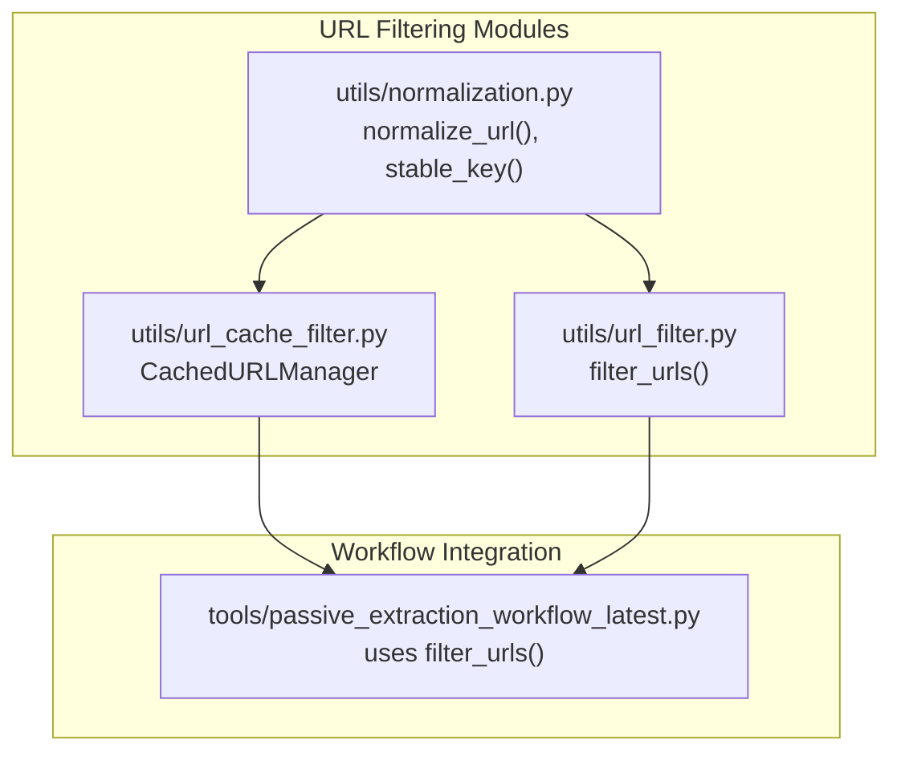
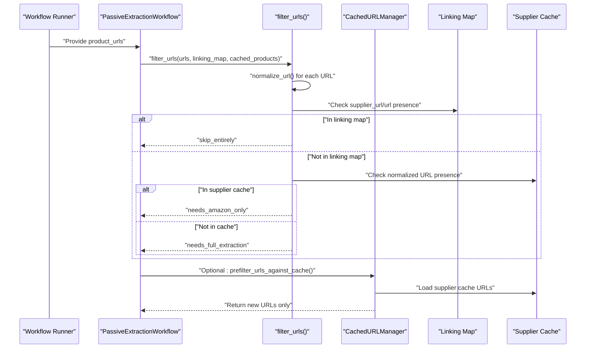
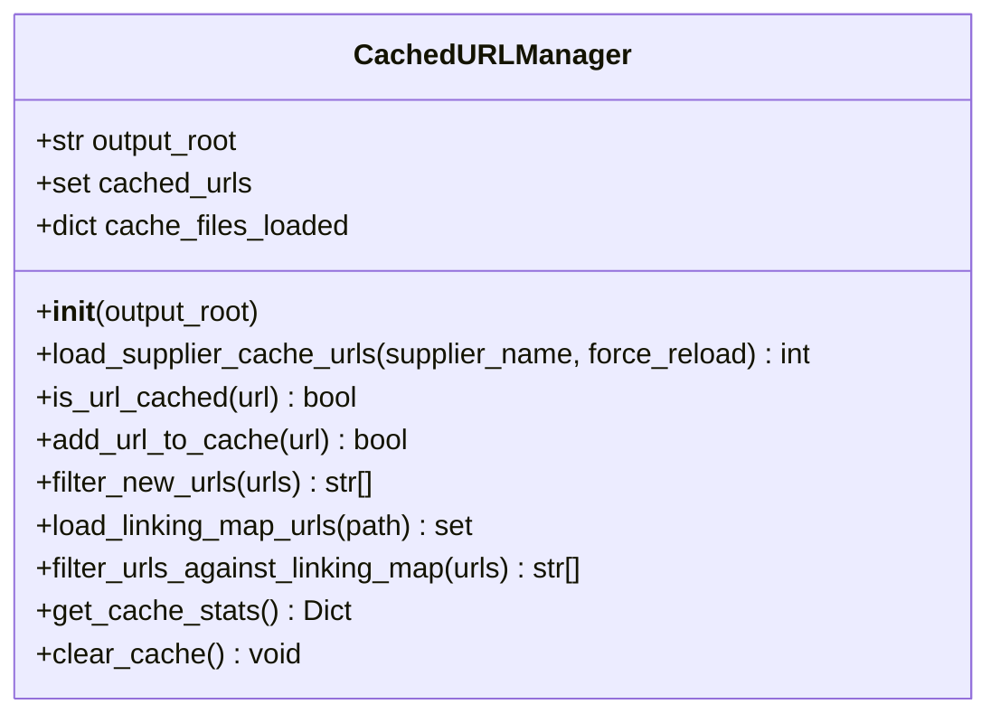
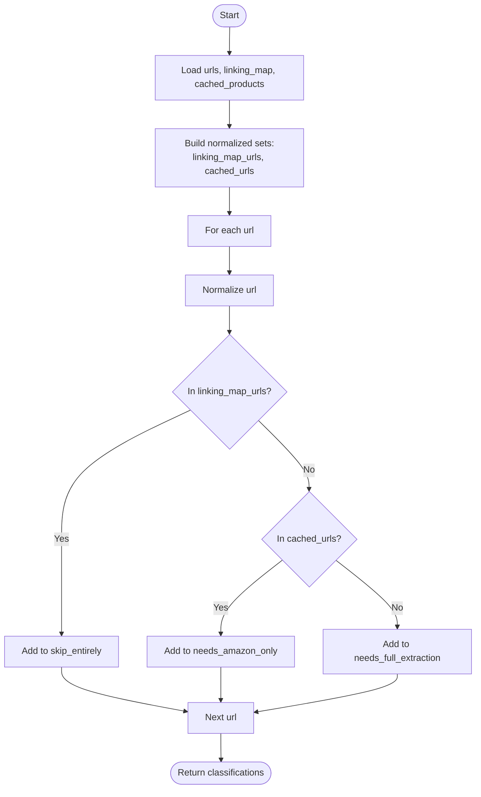
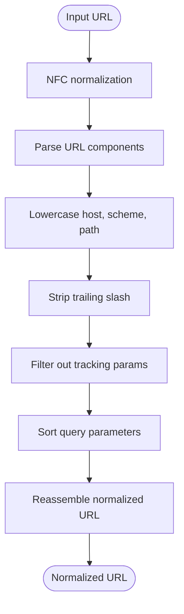
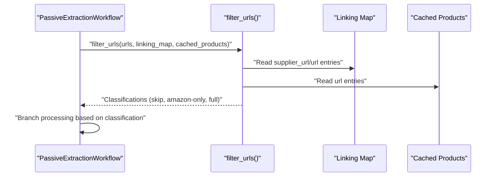
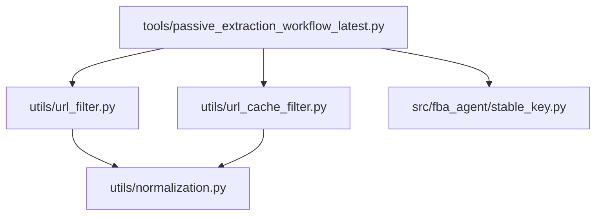

# URL Filtering

<cite>
**Referenced Files in This Document**
- [url_cache_filter.py](file://utils/url_cache_filter.py)
- [url_filter.py](file://utils/url_filter.py)
- [normalization.py](file://utils/normalization.py)
- [passive_extraction_workflow_latest.py](file://tools/passive_extraction_workflow_latest.py)
- [Caching and Deduplication.md](file://repowiki 12 dec & 20 jan\en\content\Caching and Deduplication\Caching and Deduplication.md)
- [Hash Based Lookups.md](file://wiki repo 19 nov\9. Caching And Deduplication\9.1. Hash Based Lookups.md)
- [Data Normalization Optimization.md](file://wiki repo 19 nov\11. Troubleshooting Guide\11.4. Performance Optimization\11.4.4. Data Normalization Optimization.md)
- [Configuration Management.md](file://repowiki 12 dec & 20 jan\en\content\Configuration Management\Configuration Management.md)
- [check_overlap.py](file://check_overlap.py)
- [stable_key.py](file://src/fba_agent/stable_key.py)
</cite>

## Table of Contents
1. [Introduction](#introduction)
2. [Project Structure](#project-structure)
3. [Core Components](#core-components)
4. [Architecture Overview](#architecture-overview)
5. [Detailed Component Analysis](#detailed-component-analysis)
6. [Dependency Analysis](#dependency-analysis)
7. [Performance Considerations](#performance-considerations)
8. [Troubleshooting Guide](#troubleshooting-guide)
9. [Conclusion](#conclusion)
10. [Appendices](#appendices)

## Introduction
This document explains the URL filtering mechanisms used to optimize supplier scraping and product extraction workflows. It covers:
- The URL cache filter implementation for pre-filtering URLs before scraping
- Duplicate URL detection algorithms and filtering strategies
- Hash-based URL comparison and cache lookup optimization
- Integration with supplier product caches and linking maps
- Configuration options affecting filtering behavior
- Practical examples of filter criteria and exclusion patterns
- Performance improvements and troubleshooting guidance

## Project Structure
The URL filtering system spans three primary modules:
- URL cache filter: Loads supplier product caches and filters new URLs
- URL filter: Classifies URLs using linking map and cache presence
- Normalization: Provides canonical URL normalization for consistent comparisons

**Diagram sources**
- [url_cache_filter.py](file://utils/url_cache_filter.py#L1-L272)
- [url_filter.py](file://utils/url_filter.py#L1-L40)
- [normalization.py](file://utils/normalization.py#L1-L31)
- [passive_extraction_workflow_latest.py](file://tools/passive_extraction_workflow_latest.py#L1-L200)

**Section sources**
- [url_cache_filter.py](file://utils/url_cache_filter.py#L1-L272)
- [url_filter.py](file://utils/url_filter.py#L1-L40)
- [normalization.py](file://utils/normalization.py#L1-L31)
- [passive_extraction_workflow_latest.py](file://tools/passive_extraction_workflow_latest.py#L120-L135)

## Core Components
- CachedURLManager: Loads supplier product cache files, stores URLs in an in-memory set, and filters new URLs efficiently using O(1) lookups.
- filter_urls: Classifies URLs into categories based on linking map and cache presence using normalized URLs.
- Normalization utilities: Provide canonical URL normalization and stable composite keys for EAN-first or URL-first matching.

Key capabilities:
- Pre-filtering to avoid redundant scraping
- Linking map-based exclusion for fully processed items
- Supplier cache-based classification for partial extraction
- Stable normalization for robust duplicate detection

**Section sources**
- [url_cache_filter.py](file://utils/url_cache_filter.py#L31-L207)
- [url_filter.py](file://utils/url_filter.py#L7-L39)
- [normalization.py](file://utils/normalization.py#L9-L31)

## Architecture Overview
The filtering pipeline integrates early in the workflow to minimize downstream processing:

**Diagram sources**
- [passive_extraction_workflow_latest.py](file://tools/passive_extraction_workflow_latest.py#L120-L135)
- [url_filter.py](file://utils/url_filter.py#L7-L39)
- [url_cache_filter.py](file://utils/url_cache_filter.py#L226-L246)

## Detailed Component Analysis

### CachedURLManager (URL Cache Filter)
Purpose:
- Load supplier product cache files and maintain an in-memory set of URLs
- Provide O(1) duplicate detection and pre-filtering before scraping
- Optionally integrate with linking maps for additional exclusion

Core methods:
- load_supplier_cache_urls: Reads supplier cache JSON and extracts URLs
- is_url_cached: Checks membership in cached set
- add_url_to_cache: Adds new URLs for real-time updates
- filter_new_urls: Filters input list to return only new URLs
- load_linking_map_urls: Loads URLs from linking map for secondary filtering
- filter_urls_against_linking_map: Excludes URLs present in linking map
- get_cache_stats: Reports cache size and memory estimates

**Diagram sources**
- [url_cache_filter.py](file://utils/url_cache_filter.py#L31-L207)

Operational highlights:
- Memory-efficient storage using a set of URLs
- Lazy loading per supplier cache file
- Optional linking map integration for broader exclusion
- Logging for cache hits, misses, and statistics

**Section sources**
- [url_cache_filter.py](file://utils/url_cache_filter.py#L31-L207)

### URL Classification Filter (filter_urls)
Purpose:
- Classify URLs into categories based on linking map and supplier cache presence
- Normalize URLs to ensure consistent matching across variants

Behavior:
- Build normalized sets from linking_map entries and cached products
- For each input URL: normalize and classify into:
  - skip_entirely: URL present in linking map
  - needs_amazon_only: URL present in supplier cache
  - needs_full_extraction: URL not present in either

**Diagram sources**
- [url_filter.py](file://utils/url_filter.py#L7-L39)

**Section sources**
- [url_filter.py](file://utils/url_filter.py#L7-L39)

### Normalization and Stable Keys
Purpose:
- Provide canonical URL normalization for robust duplicate detection
- Support EAN-first stable keys for authoritative matching

Normalization rules:
- Standardize scheme and hostname
- Remove tracking parameters (e.g., utm_*, gclid, fbclid)
- Sort query parameters
- Strip trailing slashes and fragments

Stable key construction:
- Prefer EAN when available (EAN-first authority)
- Fallback to normalized URL when EAN is missing

**Diagram sources**
- [normalization.py](file://utils/normalization.py#L9-L18)

**Section sources**
- [normalization.py](file://utils/normalization.py#L9-L31)

### Integration in the Workflow
The workflow imports and uses the URL filter to triage URLs before extraction:
- Imports filter_urls from utils.url_filter
- Calls filter_urls with the current batch of URLs, linking map, and cached products
- Uses the returned classification to decide whether to skip, scrape Amazon only, or perform full extraction

**Diagram sources**
- [passive_extraction_workflow_latest.py](file://tools/passive_extraction_workflow_latest.py#L120-L135)
- [url_filter.py](file://utils/url_filter.py#L7-L39)

**Section sources**
- [passive_extraction_workflow_latest.py](file://tools/passive_extraction_workflow_latest.py#L120-L135)
- [url_filter.py](file://utils/url_filter.py#L7-L39)

## Dependency Analysis
Relationships among URL filtering components:

Notes:
- Workflow imports filter_urls and normalization helpers
- CachedURLManager optionally complements filtering by pre-loading supplier caches
- Stable keys support EAN-first matching elsewhere in the system

**Diagram sources**
- [passive_extraction_workflow_latest.py](file://tools/passive_extraction_workflow_latest.py#L120-L135)
- [url_filter.py](file://utils/url_filter.py#L4-L4)
- [url_cache_filter.py](file://utils/url_cache_filter.py#L1-L272)
- [normalization.py](file://utils/normalization.py#L1-L31)
- [stable_key.py](file://src/fba_agent/stable_key.py#L1-L200)

**Section sources**
- [passive_extraction_workflow_latest.py](file://tools/passive_extraction_workflow_latest.py#L120-L135)
- [url_cache_filter.py](file://utils/url_cache_filter.py#L1-L272)
- [url_filter.py](file://utils/url_filter.py#L1-L40)
- [normalization.py](file://utils/normalization.py#L1-L31)
- [stable_key.py](file://src/fba_agent/stable_key.py#L1-L200)

## Performance Considerations
- O(1) hash-based lookups: Both CachedURLManager and filter_urls rely on set-based membership tests for fast duplicate detection.
- Memory efficiency: URL-only caching minimizes memory footprint compared to storing full product records.
- Normalization cost: Normalization is applied once per URL and reused across checks, keeping overhead predictable.
- Batch processing: The workflow processes categories in batches to manage memory and throughput.

Optimization techniques:
- Pre-filter with CachedURLManager to avoid unnecessary scraping
- Use linking map filtering to skip fully processed items
- Normalize URLs centrally to ensure consistent matching

**Section sources**
- [Caching and Deduplication.md](file://repowiki 12 dec & 20 jan\en\content\Caching and Deduplication\Caching and Deduplication.md#L95-L100)
- [Hash Based Lookups.md](file://wiki repo 19 nov\9. Caching And Deduplication\9.1. Hash Based Lookups.md#L82-L96)
- [Data Normalization Optimization.md](file://wiki repo 19 nov\11. Troubleshooting Guide\11.4. Performance Optimization\11.4.4. Data Normalization Optimization.md#L83-L109)

## Troubleshooting Guide
Common scenarios and resolutions:

- Duplicate URLs still being processed
  - Ensure URLs are normalized before comparison. The system uses canonical normalization to handle variants (e.g., different query orders, fragments).
  - Verify that the linking map and supplier cache are consistent and up-to-date.

- Overlap between linking map and cache
  - Use overlap detection to identify items present in both locations, which violates the intended invariant.
  - Correct by removing duplicates from one source or adjusting filtering logic.

- Performance degradation
  - Confirm that CachedURLManager is initialized once and re-used across runs.
  - Monitor cache statistics and consider clearing stale caches if memory pressure occurs.

- Resumption and indexing issues
  - When resuming, ensure that the linking map and cache indexes are rebuilt consistently to avoid missing or duplicate processing.

Configuration references:
- Processing limits and performance parameters influence throughput and memory usage.
- Cache settings control TTL and max size, indirectly affecting filtering performance.

**Section sources**
- [check_overlap.py](file://check_overlap.py#L44-L78)
- [Configuration Management.md](file://repowiki 12 dec & 20 jan\en\content\Configuration Management\Configuration Management.md#L28-L70)

## Conclusion
The URL filtering system combines supplier cache loading, linking map exclusion, and canonical URL normalization to achieve efficient, accurate duplicate detection. By integrating CachedURLManager and filter_urls early in the workflow, the system reduces redundant scraping, improves throughput, and maintains consistency across long-running runs.

## Appendices

### Filter Criteria and Exclusion Patterns
- Linking map priority: Fully processed items are excluded entirely
- Supplier cache presence: Items with available supplier data require only Amazon extraction
- New URLs: Items not present in either source undergo full extraction

**Section sources**
- [url_filter.py](file://utils/url_filter.py#L13-L39)

### Configuration Options Affecting Filtering
- Processing limits: Control batch sizes and concurrency impacting filtering throughput
- Performance: Request timeouts and retry attempts influence scraping reliability
- Cache: TTL and max size settings affect cache freshness and memory usage

**Section sources**
- [Configuration Management.md](file://repowiki 12 dec & 20 jan\en\content\Configuration Management\Configuration Management.md#L28-L70)

### Example Operations
- Pre-filtering new URLs against supplier cache
  - Use CachedURLManager to load supplier cache and filter new URLs
  - Reduce downstream processing by avoiding repeated scrapes

- Two-step classification
  - Apply filter_urls to classify URLs into skip, Amazon-only, or full extraction
  - Branch workflow logic accordingly

**Section sources**
- [url_cache_filter.py](file://utils/url_cache_filter.py#L226-L246)
- [url_filter.py](file://utils/url_filter.py#L7-L39)