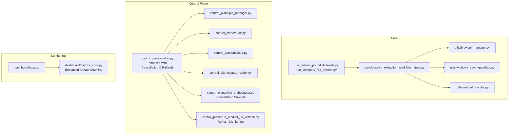
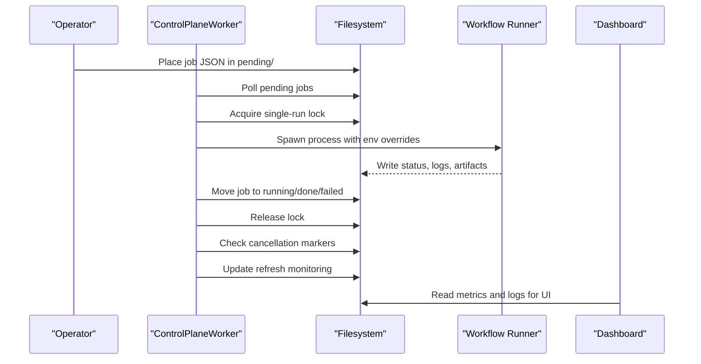
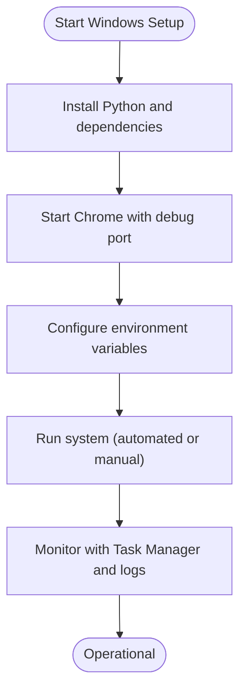
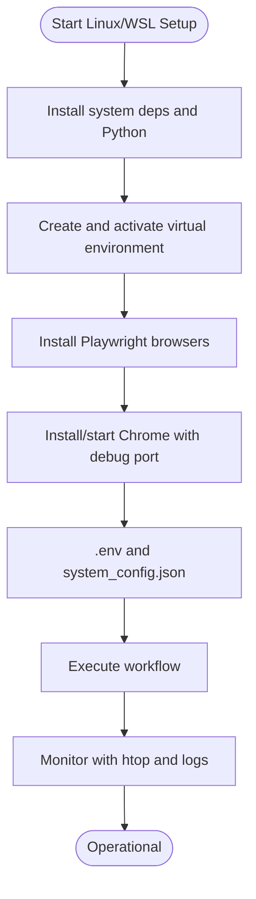
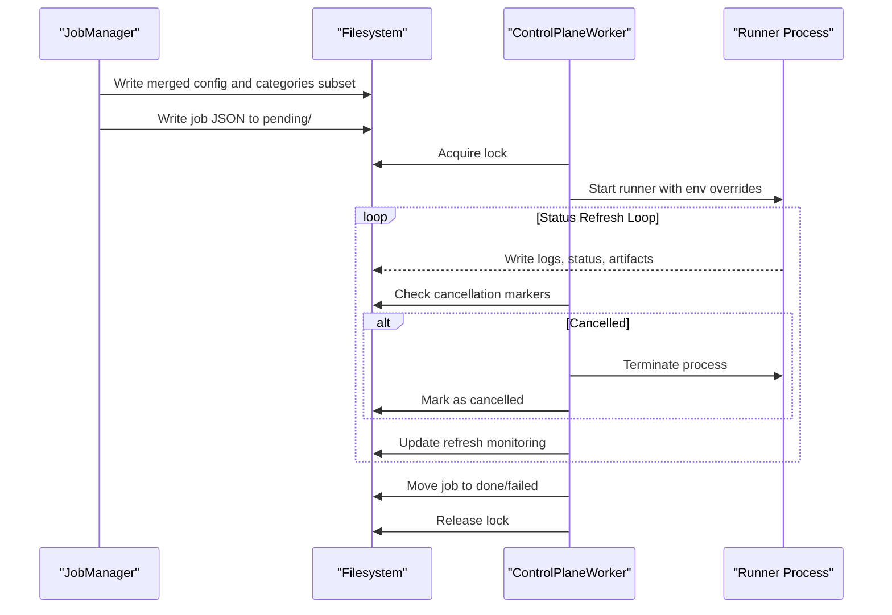
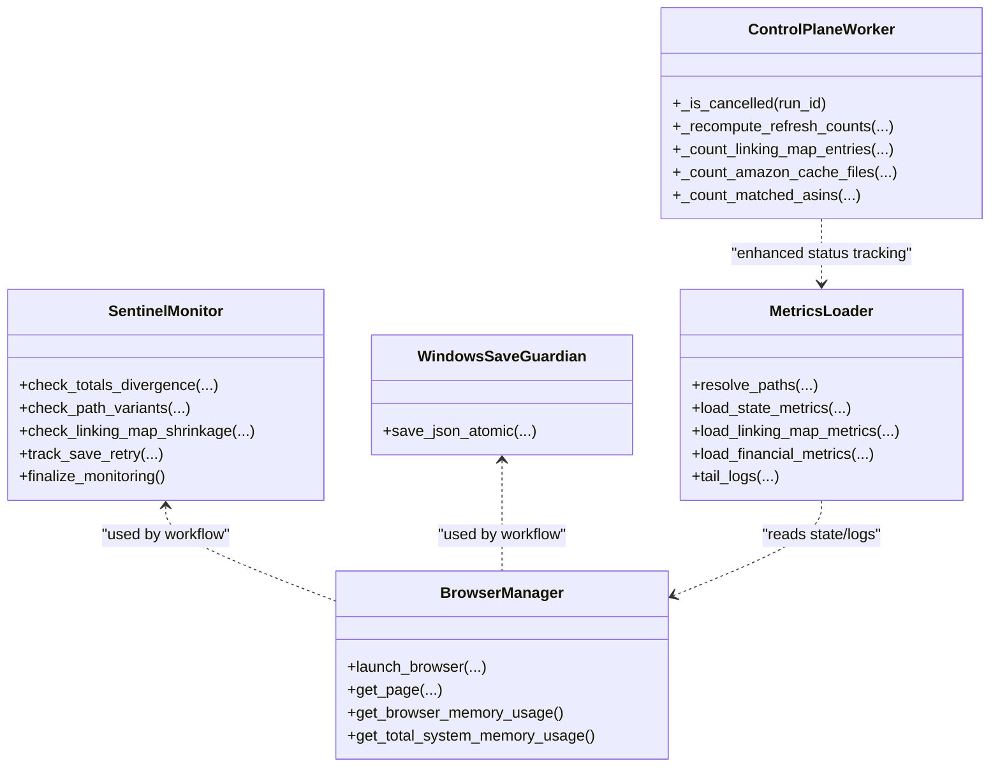
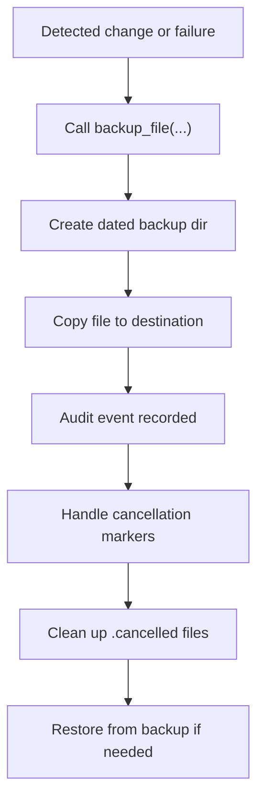
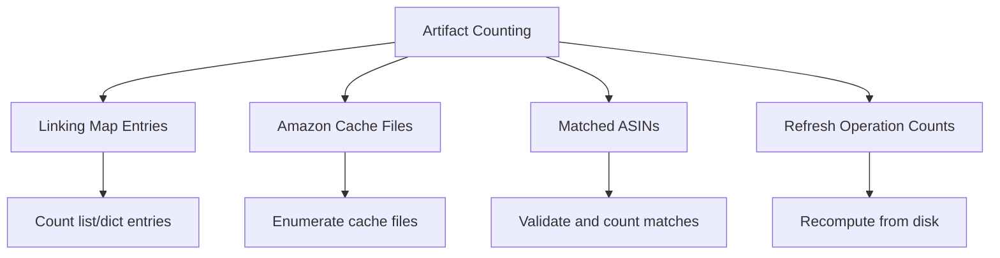
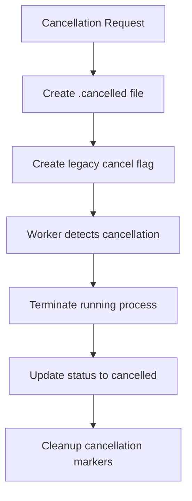
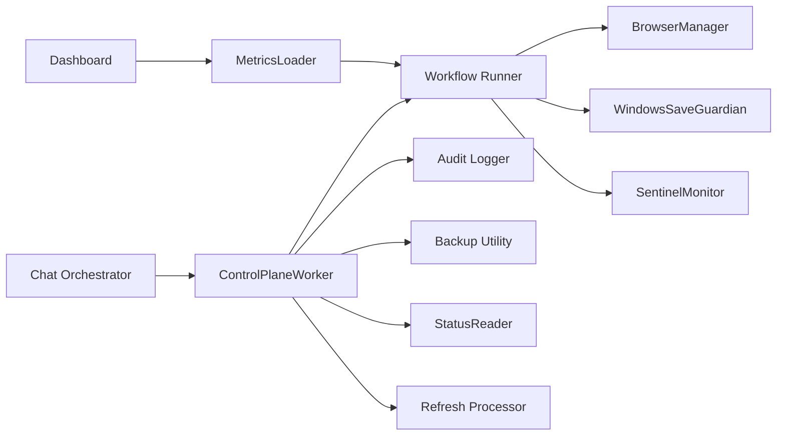

# Deployment & Operations

<cite>
**Referenced Files in This Document**
- [README.md](file://README.md)
- [INSTALLATION_GUIDE.md](file://INSTALLATION_GUIDE.md)
- [WINDOWS_SETUP_GUIDE.md](file://WINDOWS_SETUP_GUIDE.md)
- [control_plane/README.md](file://control_plane/README.md)
- [control_plane/backup.py](file://control_plane/backup.py)
- [control_plane/audit.py](file://control_plane/audit.py)
- [control_plane/job_manager.py](file://control_plane/job_manager.py)
- [control_plane/worker.py](file://control_plane/worker.py)
- [control_plane/status_reader.py](file://control_plane/status_reader.py)
- [control_plane/chat_orchestrator.py](file://control_plane/chat_orchestrator.py)
- [control_plane/job_types.py](file://control_plane/job_types.py)
- [control_plane/run_product_list_refresh.py](file://control_plane/run_product_list_refresh.py)
- [utils/sentinel_monitor.py](file://utils/sentinel_monitor.py)
- [utils/browser_manager.py](file://utils/browser_manager.py)
- [utils/windows_save_guardian.py](file://utils/windows_save_guardian.py)
- [dashboard/metrics_core.py](file://dashboard/metrics_core.py)
- [dashboard/app.py](file://dashboard/app.py)
</cite>

## Update Summary
**Changes Made**
- Enhanced job management with sophisticated cancellation support and automatic detection
- Improved status tracking with refresh monitoring for product list refresh operations
- Added sophisticated artifact counting mechanisms for comprehensive progress monitoring
- Updated control plane orchestration with enhanced worker system capabilities
- Expanded monitoring and diagnostics with refresh-specific metrics and counters

## Table of Contents
1. [Introduction](#introduction)
2. [Project Structure](#project-structure)
3. [Core Components](#core-components)
4. [Architecture Overview](#architecture-overview)
5. [Detailed Component Analysis](#detailed-component-analysis)
6. [Dependency Analysis](#dependency-analysis)
7. [Performance Considerations](#performance-considerations)
8. [Troubleshooting Guide](#troubleshooting-guide)
9. [Conclusion](#conclusion)
10. [Appendices](#appendices)

## Introduction
This document provides comprehensive deployment and operations guidance for the Amazon FBA Agent System. It covers Windows native setup, Linux/WSL configuration, cross-platform deployment considerations, system monitoring, maintenance procedures, operational best practices, validation, performance tuning, scaling, backup/recovery, and security/access control. The content is grounded in the repository's installation guides, operational utilities, control plane, and dashboard components.

**Updated** Enhanced with sophisticated job management capabilities including cancellation support, improved status tracking with refresh monitoring, and advanced artifact counting mechanisms for comprehensive system oversight.

## Project Structure
The system is organized around:
- Core workflow and processing utilities
- Control plane for deterministic job orchestration and safety
- Operational monitoring and dashboards
- Platform-specific setup and utilities

**Diagram sources**
- [README.md](file://README.md#L123-L163)
- [INSTALLATION_GUIDE.md](file://INSTALLATION_GUIDE.md#L1-L587)
- [control_plane/README.md](file://control_plane/README.md#L1-L18)
- [dashboard/app.py](file://dashboard/app.py#L1-L595)

**Section sources**
- [README.md](file://README.md#L123-L163)
- [INSTALLATION_GUIDE.md](file://INSTALLATION_GUIDE.md#L1-L587)
- [control_plane/README.md](file://control_plane/README.md#L1-L18)
- [dashboard/app.py](file://dashboard/app.py#L1-L595)

## Core Components
- Windows native setup and runtime: Automated Windows setup, Chrome debug port configuration, environment variables, and Windows-specific memory management.
- Linux/WSL setup: Dependency installation, Playwright browser setup, Chrome configuration, and WSL-specific tuning.
- Control plane: Deterministic job creation, execution, status tracking, and safety mechanisms (single-run locks) with enhanced cancellation support.
- Monitoring and diagnostics: Sentinel monitoring, browser health management, Windows atomic save persistence, and a Streamlit dashboard for metrics with sophisticated artifact counting.

**Updated** Enhanced with sophisticated cancellation detection mechanisms, refresh monitoring for product list operations, and comprehensive artifact counting for progress tracking.

**Section sources**
- [WINDOWS_SETUP_GUIDE.md](file://WINDOWS_SETUP_GUIDE.md#L1-L341)
- [INSTALLATION_GUIDE.md](file://INSTALLATION_GUIDE.md#L14-L265)
- [control_plane/README.md](file://control_plane/README.md#L1-L18)
- [utils/sentinel_monitor.py](file://utils/sentinel_monitor.py#L1-L201)
- [utils/browser_manager.py](file://utils/browser_manager.py#L1-L800)
- [utils/windows_save_guardian.py](file://utils/windows_save_guardian.py#L1-L609)
- [dashboard/metrics_core.py](file://dashboard/metrics_core.py#L1-L615)
- [dashboard/app.py](file://dashboard/app.py#L1-L595)

## Architecture Overview
The system supports two primary execution modes:
- Direct execution via Python entry points with Chrome automation and local file persistence.
- Controlled execution via the control plane worker that reads jobs from a pending queue, enforces single-run locks, writes status and logs, and provides sophisticated cancellation and refresh monitoring.

**Updated** Enhanced with automatic cancellation detection, refresh operation monitoring, and comprehensive status tracking with artifact counting.

**Diagram sources**
- [control_plane/worker.py](file://control_plane/worker.py#L125-L282)
- [control_plane/job_manager.py](file://control_plane/job_manager.py#L63-L156)
- [dashboard/metrics_core.py](file://dashboard/metrics_core.py#L1-L615)
- [dashboard/app.py](file://dashboard/app.py#L1-L595)

## Detailed Component Analysis

### Windows Native Setup and Execution
- Automated Windows setup installs dependencies, Playwright browsers, creates required directories, and verifies compatibility.
- Chrome must be started with a remote debugging port and user data directory; the system connects to an existing Chrome instance.
- Environment variables support API keys and memory thresholds; optional .env file supports persistent configuration.
- Windows-specific memory monitoring and automatic Chrome restarts mitigate long-running session risks.

**Diagram sources**
- [WINDOWS_SETUP_GUIDE.md](file://WINDOWS_SETUP_GUIDE.md#L1-L341)
- [README.md](file://README.md#L61-L96)

**Section sources**
- [WINDOWS_SETUP_GUIDE.md](file://WINDOWS_SETUP_GUIDE.md#L1-L341)
- [README.md](file://README.md#L61-L96)

### Linux/WSL Configuration
- Install system dependencies, Python virtual environment, and Playwright browsers.
- Install Chrome and configure debug port; WSL-specific memory and X11 forwarding settings can be tuned.
- Run the system with optional supplier selection and configuration overrides.

**Diagram sources**
- [INSTALLATION_GUIDE.md](file://INSTALLATION_GUIDE.md#L143-L265)

**Section sources**
- [INSTALLATION_GUIDE.md](file://INSTALLATION_GUIDE.md#L143-L265)

### Enhanced Control Plane Orchestration
- Job creation: Builds run-specific directories, merged configs, and job payload with override paths.
- Worker execution: Polls pending jobs, enforces single-run lock, spawns runner processes, tails logs, and updates status with sophisticated refresh monitoring.
- Safety: Lock file prevents concurrent runs; status snapshots include resolved paths, progress, artifacts, and last log lines with enhanced cancellation detection.
- Cancellation support: Automatic detection of cancellation markers (.cancelled files and legacy flag files) with graceful termination.

**Updated** Enhanced with sophisticated cancellation detection mechanisms, refresh operation monitoring, and comprehensive artifact counting for progress tracking.

**Diagram sources**
- [control_plane/job_manager.py](file://control_plane/job_manager.py#L63-L156)
- [control_plane/worker.py](file://control_plane/worker.py#L125-L282)

**Section sources**
- [control_plane/README.md](file://control_plane/README.md#L1-L18)
- [control_plane/job_manager.py](file://control_plane/job_manager.py#L63-L156)
- [control_plane/worker.py](file://control_plane/worker.py#L125-L282)

### Enhanced Monitoring and Diagnostics
- Sentinel monitoring: Tracks totals divergence, path variants, linking map shrinkage, and save retries; emits session summaries.
- Browser health management: Connects to existing Chrome, validates CDP endpoints, applies circuit breaker, and periodically restarts to maintain stability.
- Windows atomic save: Provides multiple strategies to persist JSON safely, with telemetry and anti-truncation guard.
- Dashboard: Loads metrics from state, linking maps, financial reports, and logs; presents health, matching, financial, and analytics views with sophisticated artifact counting.
- Refresh monitoring: Enhanced status tracking for product list refresh operations with comprehensive counter updates and path resolution.

**Updated** Enhanced with sophisticated refresh monitoring capabilities, comprehensive artifact counting mechanisms, and improved status tracking with automatic cancellation detection.

**Diagram sources**
- [utils/sentinel_monitor.py](file://utils/sentinel_monitor.py#L63-L201)
- [utils/browser_manager.py](file://utils/browser_manager.py#L35-L800)
- [utils/windows_save_guardian.py](file://utils/windows_save_guardian.py#L26-L609)
- [dashboard/metrics_core.py](file://dashboard/metrics_core.py#L15-L615)
- [control_plane/worker.py](file://control_plane/worker.py#L64-L252)

**Section sources**
- [utils/sentinel_monitor.py](file://utils/sentinel_monitor.py#L1-L201)
- [utils/browser_manager.py](file://utils/browser_manager.py#L1-L800)
- [utils/windows_save_guardian.py](file://utils/windows_save_guardian.py#L1-L609)
- [dashboard/metrics_core.py](file://dashboard/metrics_core.py#L1-L615)
- [dashboard/app.py](file://dashboard/app.py#L1-L595)

### Enhanced Backup and Recovery Procedures
- File backup utility: Copies a file to a dated backup directory under a reason-named subfolder, preserving filename.
- Audit trail: Appends structured events to a timestamped JSONL audit file for tool calls.
- Recovery guidance: Use backup copies to restore persisted files; verify integrity and re-run affected stages.
- Cancellation handling: Automatic cleanup of cancellation markers and graceful termination of running processes.

**Updated** Enhanced with cancellation marker cleanup and improved process termination handling.

**Diagram sources**
- [control_plane/backup.py](file://control_plane/backup.py#L8-L17)
- [control_plane/audit.py](file://control_plane/audit.py#L15-L27)

**Section sources**
- [control_plane/backup.py](file://control_plane/backup.py#L1-L17)
- [control_plane/audit.py](file://control_plane/audit.py#L1-L27)

### Sophisticated Artifact Counting Mechanisms
- Linking map entry counting: Handles both list and dictionary formats for accurate entry counting.
- Amazon cache file enumeration: Counts cache files with proper error handling and fallbacks.
- Matched ASIN counting: Validates and counts successful matches with comprehensive error handling.
- Refresh operation counters: Recomputes counts from authoritative sources at terminal status for accuracy.

**New Section** Added sophisticated artifact counting mechanisms for comprehensive progress monitoring and validation.

**Diagram sources**
- [control_plane/worker.py](file://control_plane/worker.py#L181-L251)

**Section sources**
- [control_plane/worker.py](file://control_plane/worker.py#L181-L251)

### Enhanced Cancellation Support
- Cancellation detection: Automatic detection of both new `.cancelled` files and legacy `cancel_*.flag` files.
- Graceful termination: Terminates running processes and updates status with cancellation metadata.
- Cleanup operations: Removes cancellation markers after processing completion.
- Operator interface: Chat orchestrator provides cancellation capability through tool calls.

**New Section** Added comprehensive cancellation support with automatic detection and graceful termination.

**Diagram sources**
- [control_plane/chat_orchestrator.py](file://control_plane/chat_orchestrator.py#L898-L921)
- [control_plane/worker.py](file://control_plane/worker.py#L64-L73)

**Section sources**
- [control_plane/chat_orchestrator.py](file://control_plane/chat_orchestrator.py#L898-L921)
- [control_plane/worker.py](file://control_plane/worker.py#L64-L73)

## Dependency Analysis
- Workflow-to-utils: The workflow depends on browser management, atomic save, and sentinel monitoring utilities.
- Control plane-to-workflow: The worker spawns the workflow runner with environment overrides and tracks progress via metrics loader with enhanced refresh monitoring.
- Dashboard-to-metrics: The dashboard consumes metrics loader outputs for rendering with sophisticated artifact counting.
- Cancellation integration: Chat orchestrator provides cancellation interface to control plane worker.

**Updated** Enhanced with cancellation support integration and refresh monitoring capabilities.

**Diagram sources**
- [README.md](file://README.md#L167-L217)
- [control_plane/worker.py](file://control_plane/worker.py#L125-L282)
- [dashboard/metrics_core.py](file://dashboard/metrics_core.py#L1-L615)

**Section sources**
- [README.md](file://README.md#L167-L217)
- [control_plane/worker.py](file://control_plane/worker.py#L125-L282)
- [dashboard/metrics_core.py](file://dashboard/metrics_core.py#L1-L615)

## Performance Considerations
- Memory management: Sliding window approach reduces clearing frequency; smart memory clearing preserves recent context; Windows memory monitoring and automatic Chrome restarts improve stability.
- Browser health: Circuit breaker protection, periodic restarts, and dual-stack CDP endpoint detection enhance resilience.
- Atomic persistence: Windows atomic save strategies prevent WinError 5 and truncation; telemetry aids diagnostics.
- Dashboard efficiency: Metrics loader caches and chunked processing reduce overhead for large files with enhanced artifact counting.
- Status refresh optimization: Configurable status refresh intervals balance responsiveness with system load.
- Cancellation efficiency: Rapid cancellation detection minimizes resource waste from abandoned operations.

**Updated** Enhanced with status refresh optimization, cancellation efficiency, and improved artifact counting performance.

**Section sources**
- [README.md](file://README.md#L220-L307)
- [utils/browser_manager.py](file://utils/browser_manager.py#L1-L800)
- [utils/windows_save_guardian.py](file://utils/windows_save_guardian.py#L1-L609)
- [dashboard/metrics_core.py](file://dashboard/metrics_core.py#L1-L615)

## Troubleshooting Guide
- Chrome debug port issues: Kill existing Chrome processes, restart with debug flags, verify localhost accessibility, and check port conflicts.
- Python import and dependency errors: Reinstall requirements and Playwright browsers; ensure correct Python version and environment activation.
- Memory issues: Monitor with Task Manager (Windows) or htop (Linux); rely on automatic memory management and browser restarts.
- Permission errors: Run with appropriate privileges; adjust antivirus exclusions; verify file permissions.
- Long sessions: System automatically handles extended runs; monitor Chrome memory and leverage restart logic.
- Cancellation failures: Verify `.cancelled` file creation and check for proper cleanup of cancellation markers.
- Refresh monitoring issues: Check refresh job configuration and validate artifact counting from authoritative sources.

**Updated** Enhanced with cancellation troubleshooting and refresh monitoring diagnostics.

**Section sources**
- [INSTALLATION_GUIDE.md](file://INSTALLATION_GUIDE.md#L472-L533)
- [WINDOWS_SETUP_GUIDE.md](file://WINDOWS_SETUP_GUIDE.md#L191-L237)
- [README.md](file://README.md#L492-L522)

## Conclusion
The Amazon FBA Agent System provides a robust, cross-platform automation pipeline with strong operational tooling. Windows native support, Linux/WSL compatibility, control plane orchestration with enhanced cancellation support, and comprehensive monitoring enable reliable, scalable deployments. The sophisticated artifact counting mechanisms, refresh monitoring capabilities, and automatic cancellation detection provide operators with comprehensive oversight and control over system operations. Adhering to the setup and operational procedures outlined here ensures smooth day-2 operations, resilient performance, and effective recovery.

**Updated** Enhanced with sophisticated cancellation support, refresh monitoring, and comprehensive artifact counting for improved operational oversight.

## Appendices

### Deployment Validation Checklist
- ✅ Chrome debug port accessible
- ✅ Environment variables configured
- ✅ Dependencies installed and verified
- ✅ Windows compatibility tests pass (if applicable)
- ✅ Control plane single-run lock absent
- ✅ Initial run produces expected outputs and logs
- ✅ Cancellation markers clean and functional
- ✅ Refresh monitoring displays accurate artifact counts

**Updated** Enhanced with cancellation and refresh monitoring validation checks.

**Section sources**
- [INSTALLATION_GUIDE.md](file://INSTALLATION_GUIDE.md#L336-L380)
- [WINDOWS_SETUP_GUIDE.md](file://WINDOWS_SETUP_GUIDE.md#L314-L328)

### Maintenance Schedules
- Daily: Monitor logs and dashboard metrics; verify Chrome memory and system health; check cancellation markers.
- Weekly: Review audit trails and backup integrity; validate configuration drift; verify refresh operation counts.
- Monthly: Reassess performance tuning and capacity planning; rotate logs and cache; validate artifact counting accuracy.

**Updated** Enhanced with cancellation monitoring and refresh operation validation.

**Section sources**
- [control_plane/audit.py](file://control_plane/audit.py#L1-L27)
- [dashboard/app.py](file://dashboard/app.py#L1-L595)

### Security and Access Control
- Limit access to operator accounts with least privilege.
- Store API keys in secure environment variables or secrets manager.
- Restrict filesystem permissions for output directories and logs.
- Use single-run locks to prevent concurrent conflicting runs.
- Monitor cancellation requests and maintain audit trails for all administrative actions.

**Updated** Enhanced with cancellation request monitoring and administrative audit trail requirements.

**Section sources**
- [control_plane/worker.py](file://control_plane/worker.py#L38-L51)
- [INSTALLATION_GUIDE.md](file://INSTALLATION_GUIDE.md#L310-L333)