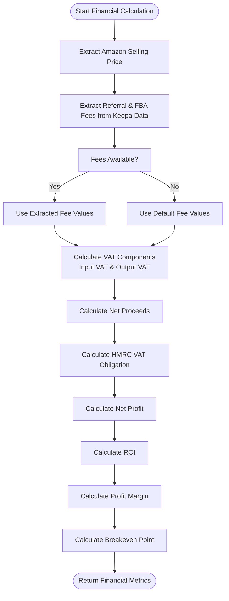
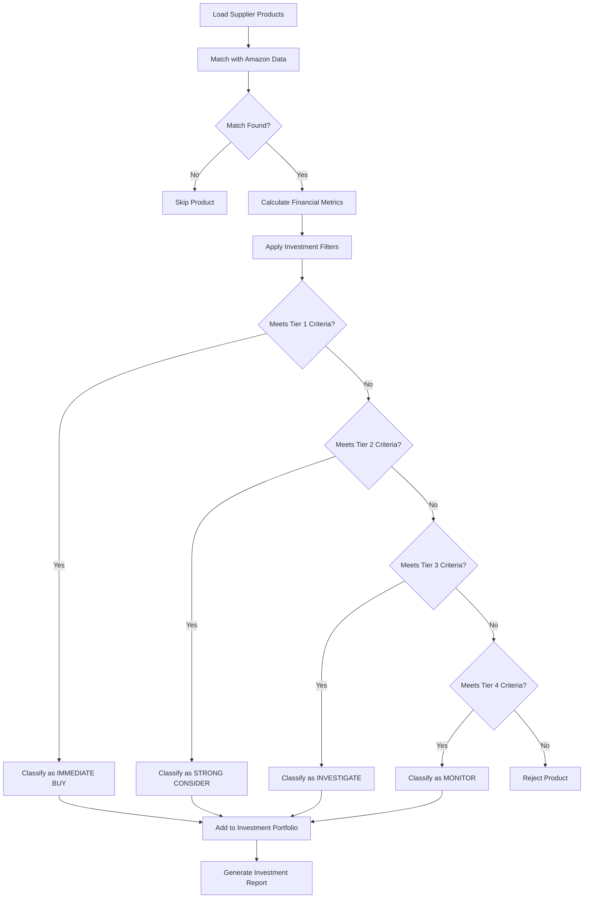
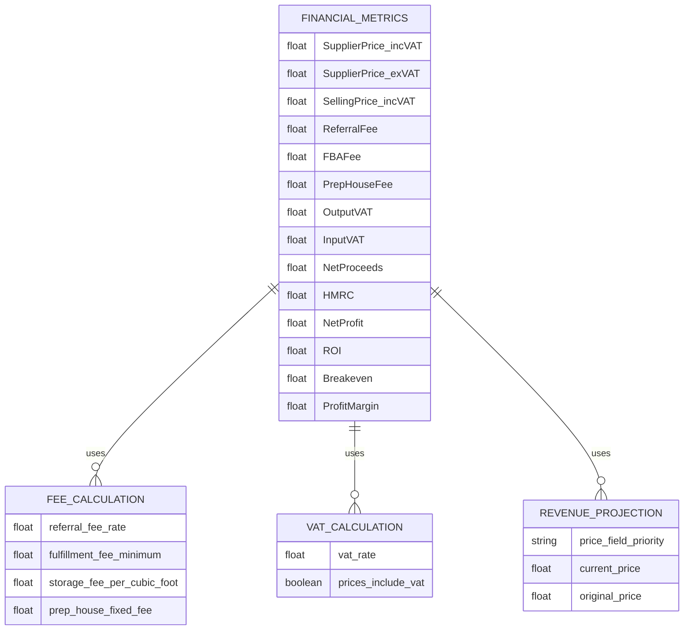
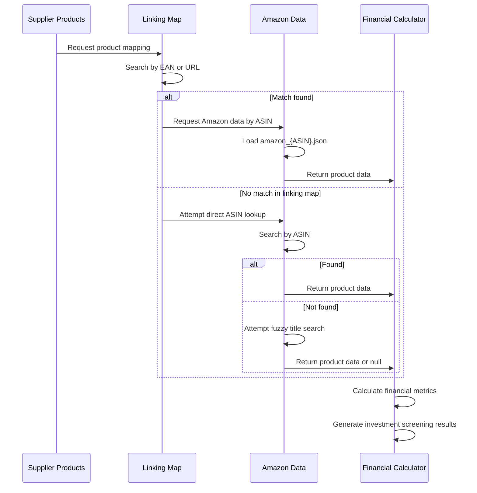
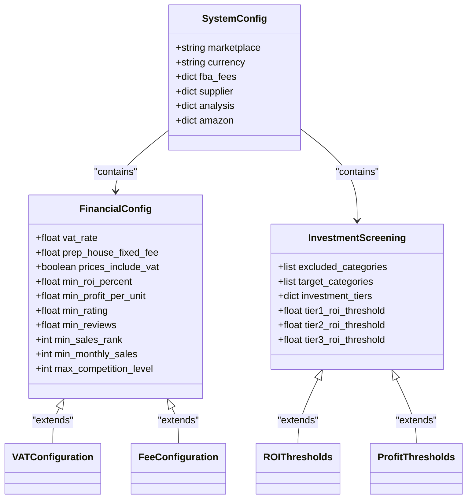
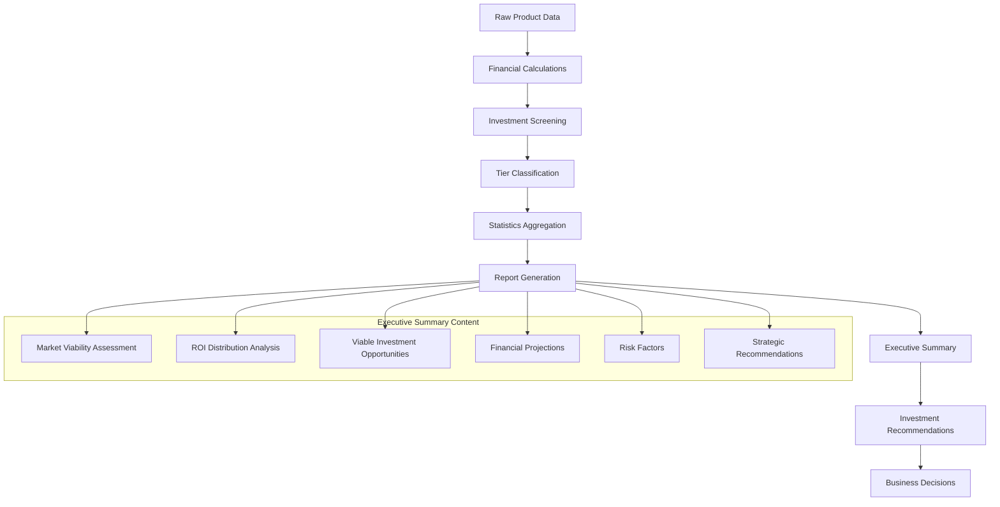

# Financial Analysis Module

<cite>
**Referenced Files in This Document**   
- [FBA_Financial_calculator.py](file://tools/FBA_Financial_calculator.py)
- [system_config.json](file://config/system_config.json)
- [FBA_PROFITABILITY_ANALYSIS_REPORT.md](file://OUTPUTS/FBA_ANALYSIS/financial_reports/FBA_PROFITABILITY_ANALYSIS_REPORT.md)
- [UK_VAT_INVESTMENT_SCREENING_EXECUTIVE_SUMMARY.md](file://OUTPUTS/FBA_ANALYSIS/financial_reports/UK_VAT_INVESTMENT_SCREENING_EXECUTIVE_SUMMARY.md)
- [linking_map_test.json](file://OUTPUTS/FBA_ANALYSIS/linking_maps/poundwholesale.co.uk/linking_map_test.json)
- [app_fixed.py](file://dashboard/app_fixed.py) - *Updated for Streamlit dashboard integration*
- [metrics_core_fixed.py](file://dashboard/metrics_core_fixed.py) - *Enhanced metrics visualization capabilities*
- [angelwholesale_workflow](file://config/system_config.json#L276-L283) - *Configuration-driven workflow*
- [kdwholesale_workflow](file://config/system_config.json#L284-L292) - *Configuration-driven workflow*
- [laceywholesale_workflow](file://config/system_config.json#L293-L301) - *Configuration-driven workflow*
</cite>

## Update Summary
**Changes Made**   
- Added detailed documentation for configuration-driven workflow configurations for multiple suppliers including angelwholesale_workflow, kdwholesale_workflow, and laceywholesale_workflow
- Added comprehensive information about Streamlit dashboard integration and its metrics visualization capabilities
- Updated configuration options section to reflect new workflow configurations
- Added new section on dashboard integration and visualization
- Enhanced document sources to include dashboard-related files and workflow configurations

## Table of Contents
1. [Introduction](#introduction)
2. [Core Financial Calculations](#core-financial-calculations)
3. [Financial Metrics and Data Sources](#financial-metrics-and-data-sources)
4. [Integration Between Product Data and Financial Modeling](#integration-between-product-data-and-financial-modeling)
5. [Configuration Options for Financial Analysis](#configuration-options-for-financial-analysis)
6. [Dashboard Integration and Visualization](#dashboard-integration-and-visualization)
7. [Common Issues and Solutions in Financial Analysis](#common-issues-and-solutions-in-financial-analysis)
8. [Executive Summary Reports and Business Value](#executive-summary-reports-and-business-value)
9. [Conclusion](#conclusion)

## Introduction
The Financial Analysis Module is responsible for conducting FBA profitability analysis, investment screening, and generating financial reports based on supplier and Amazon product data. This module transforms supplier prices into comprehensive profitability estimates by calculating key financial metrics such as ROI, net profit, and breakeven points. The system integrates product data extraction with financial modeling to provide actionable investment insights, with a particular focus on UK VAT compliance. The analysis is driven by the FBA_Financial_calculator.py module, which processes product data from supplier caches and Amazon scrapes to generate detailed financial reports.

The module has been enhanced with configuration-driven workflow configurations for multiple suppliers, including angelwholesale_workflow, kdwholesale_workflow, and laceywholesale_workflow, allowing for flexible and scalable financial analysis across different supplier platforms. Additionally, the system now features a comprehensive Streamlit dashboard integration that provides real-time metrics visualization and monitoring capabilities.

**Section sources**
- [FBA_Financial_calculator.py](file://tools/FBA_Financial_calculator.py#L1-L50)
- [FBA_PROFITABILITY_ANALYSIS_REPORT.md](file://OUTPUTS/FBA_ANALYSIS/financial_reports/FBA_PROFITABILITY_ANALYSIS_REPORT.md#L1-L10)

## Core Financial Calculations

### ROI and Net Profit Implementation
The FBA_Financial_calculator.py module implements a comprehensive financial model for calculating profitability metrics. The core calculation function `financials()` computes multiple financial indicators based on supplier and Amazon data. ROI (Return on Investment) is calculated as (Net Profit / Total Cost) * 100, where total cost includes supplier cost, prep house fees, and shipping costs. Net profit is derived by subtracting all expenses from net proceeds, including HMRC (VAT) obligations and prep/ship costs.

The calculation process begins with extracting the current Amazon selling price from multiple possible fields in the scraped data structure. The system then determines referral fees and FBA fees either from Keepa data in the Amazon scrape or defaults to standard rates. A critical aspect of the calculation is VAT handling, which differs based on whether supplier prices include VAT (controlled by the `SUPPLIER_PRICES_INCLUDE_VAT` configuration parameter).

**Diagram sources**
- [FBA_Financial_calculator.py](file://tools/FBA_Financial_calculator.py#L300-L400)

**Section sources**
- [FBA_Financial_calculator.py](file://tools/FBA_Financial_calculator.py#L300-L450)

### Investment Screening Calculations
The investment screening process categorizes products into tiers based on profitability metrics. The system applies configurable thresholds to filter investment opportunities, with products classified into four tiers: IMMEDIATE BUY (Tier 1), STRONG CONSIDER (Tier 2), INVESTIGATE (Tier 3), and MONITOR (Tier 4). Products failing to meet minimum criteria are rejected.

The screening logic is implemented in the `run_calculations()` function, which processes supplier products and matches them with Amazon data using the linking map. For each matched product, financial metrics are calculated and used to determine investment viability. The results are sorted by ROI (highest first) to prioritize the most profitable opportunities.

**Diagram sources**
- [FBA_Financial_calculator.py](file://tools/FBA_Financial_calculator.py#L450-L550)

**Section sources**
- [FBA_Financial_calculator.py](file://tools/FBA_Financial_calculator.py#L450-L550)
- [UK_VAT_INVESTMENT_SCREENING_EXECUTIVE_SUMMARY.md](file://OUTPUTS/FBA_ANALYSIS/financial_reports/UK_VAT_INVESTMENT_SCREENING_EXECUTIVE_SUMMARY.md#L1-L50)

## Financial Metrics and Data Sources

### Revenue Projections and Fee Calculations
The financial analysis module calculates revenue projections based on the current Amazon selling price, which is extracted from multiple possible fields in the scraped data structure. The system prioritizes fields in this order: current_price, price, original_price, amazon_price. This multi-field approach ensures robustness in the face of changes to Amazon's page structure.

Fee calculations are a critical component of the financial model. The system extracts referral fees and FBA fees from the Keepa data section of the Amazon scrape. The `extract_keepa_fees()` function parses the product details tab data to identify fee values, specifically looking for "Referral fee" and "FBA fee" entries while ignoring percentage values. If Keepa data is unavailable, the system defaults to standard fee values configured in system_config.json.

**Diagram sources**
- [FBA_Financial_calculator.py](file://tools/FBA_Financial_calculator.py#L200-L300)

**Section sources**
- [FBA_Financial_calculator.py](file://tools/FBA_Financial_calculator.py#L200-L300)
- [system_config.json](file://config/system_config.json#L250-L270)

### VAT Adjustments
VAT calculations are a crucial aspect of the financial analysis, particularly for UK-based operations. The system handles VAT differently based on whether supplier prices include VAT, as controlled by the `SUPPLIER_PRICES_INCLUDE_VAT` parameter in system_config.json. When supplier prices include VAT, the system calculates the ex-VAT cost by dividing the inclusive price by (1 + VAT_RATE). When prices are ex-VAT, the system calculates the inclusive price by adding VAT to the ex-VAT cost.

The VAT rate is configured in system_config.json under `amazon.vat_rate` and defaults to 0.2 (20%). The system calculates both input VAT (recoverable on purchases) and output VAT (payable on sales), with the difference representing the HMRC obligation. This VAT-aware approach ensures accurate net profit calculations for UK VAT-registered businesses.

**Section sources**
- [FBA_Financial_calculator.py](file://tools/FBA_Financial_calculator.py#L350-L380)
- [system_config.json](file://config/system_config.json#L260-L265)

## Integration Between Product Data and Financial Modeling

### Linking Map and Product Matching
The integration between product data extraction and financial modeling is facilitated by the linking map system. The linking map, stored in JSON format, contains mappings between supplier products and Amazon products using EAN and URL as primary matching keys. The `load_linking_map()` function loads this mapping, prioritizing supplier-specific maps over generic ones.

The product matching process uses multiple methods in sequence: EAN matching, URL matching, ASIN lookup, and fuzzy title matching. The system first attempts to match products using the linking map, then falls back to direct ASIN lookup, and finally uses filename-based matching if necessary. This multi-layered approach maximizes the number of successful matches while maintaining accuracy.

**Diagram sources**
- [FBA_Financial_calculator.py](file://tools/FBA_Financial_calculator.py#L100-L200)
- [linking_map_test.json](file://OUTPUTS/FBA_ANALYSIS/linking_maps/poundwholesale.co.uk/linking_map_test.json#L1-L27)

**Section sources**
- [FBA_Financial_calculator.py](file://tools/FBA_Financial_calculator.py#L100-L200)
- [linking_map_test.json](file://OUTPUTS/FBA_ANALYSIS/linking_maps/poundwholesale.co.uk/linking_map_test.json#L1-L27)

### Data Flow from Supplier Prices to Profitability Estimates
The transformation from supplier prices to profitability estimates follows a structured data flow. Supplier product data is loaded from a JSON cache file, with each product containing EAN, title, URL, and price information. This data is matched with Amazon product data using the linking map system, creating a comprehensive dataset for financial analysis.

Once matched, the financial calculator applies the profitability model, incorporating configured fee structures and VAT rates. The results are compiled into a pandas DataFrame, sorted by ROI, and exported as a CSV financial report. Additional metadata, such as bought_in_past_month and seller counts, is extracted from Keepa data to enhance the investment screening process.

**Section sources**
- [FBA_Financial_calculator.py](file://tools/FBA_Financial_calculator.py#L450-L550)
- [FBA_PROFITABILITY_ANALYSIS_REPORT.md](file://OUTPUTS/FBA_ANALYSIS/financial_reports/FBA_PROFITABILITY_ANALYSIS_REPORT.md#L1-L20)

## Configuration Options for Financial Analysis

### Financial Analysis Configuration
The financial analysis behavior is controlled by multiple configuration options in system_config.json. Key parameters include:

- `amazon.vat_rate`: VAT rate applied to UK transactions (default: 0.2)
- `amazon.fba_fees.prep_house_fixed_fee`: Fixed preparation cost per unit (default: 0.55)
- `supplier.prices_include_vat`: Whether supplier prices include VAT (default: false)
- `analysis.min_roi_percent`: Minimum ROI threshold for investment consideration (default: 15.0)
- `analysis.min_profit_per_unit`: Minimum profit per unit threshold (default: 0.25)

These configuration options allow the system to be adapted to different business models, tax situations, and investment strategies without code changes.

**Diagram sources**
- [system_config.json](file://config/system_config.json#L250-L300)

**Section sources**
- [system_config.json](file://config/system_config.json#L250-L300)

### Configuration-Driven Workflow Configurations
The system now supports configuration-driven workflow configurations for multiple suppliers, enabling flexible and scalable financial analysis across different supplier platforms. These workflows are defined in the `workflows` section of system_config.json and include:

- **angelwholesale_workflow**: Configuration for Angelwholesale.Co.Uk supplier with specific field mappings and pagination methods
- **kdwholesale_workflow**: Configuration for KDWholesale.Co.Uk supplier with tailored selectors and authentication settings
- **laceywholesale_workflow**: Configuration for Laceywholesale.Co.Uk supplier with custom pagination patterns and field mappings

Each workflow configuration includes essential parameters such as supplier name, base URL, categories configuration path, and authentication requirements. The system uses these configurations to dynamically adapt the scraping and financial analysis processes to each supplier's unique structure and requirements.

The workflow configurations enable the system to handle different supplier websites with varying HTML structures, pagination methods, and data field locations. This modular approach allows for easy addition of new suppliers by simply creating a new workflow configuration without modifying the core codebase.

**Section sources**
- [system_config.json](file://config/system_config.json#L256-L310)
- [angelwholesale.co.uk.json](file://config/supplier_configs/angelwholesale.co.uk.json)
- [kdwholesale.co.uk.json](file://config/supplier_configs/kdwholesale.co.uk.json)
- [laceywholesale.co.uk.json](file://config/supplier_configs/laceywholesale.co.uk.json)

### Auto-Run Configuration
The system can be configured to automatically run the financial calculator after new linking map entries are created. This behavior is controlled by the pipeline configuration in system_config.json, particularly the `linking_map_batch_size` parameter which determines when the financial analysis is triggered. With a batch size of 1, the calculator runs after each new linking map entry, enabling near real-time profitability analysis.

Additional configuration options in the `system` section control the overall execution flow, including `financial_report_batch_size` which determines how many products are processed in each financial analysis batch. The `hybrid_processing` configuration enables alternating between supplier extraction and financial analysis phases, ensuring that profitability calculations can begin as soon as initial product matches are established.

**Section sources**
- [system_config.json](file://config/system_config.json#L10-L50)
- [system_config.json](file://config/system_config.json#L50-L100)

## Dashboard Integration and Visualization

### Streamlit Dashboard Integration
The system now features a comprehensive Streamlit dashboard integration that provides real-time monitoring and visualization of financial analysis metrics. The dashboard, implemented in `app_fixed.py` and `metrics_core_fixed.py`, offers a user-friendly interface for tracking the progress and results of the financial analysis process.

The dashboard displays key performance indicators including system health, processing status, matching performance, and financial metrics. It provides real-time updates through auto-refresh functionality with configurable refresh intervals, allowing users to monitor the analysis process as it progresses.

Key features of the dashboard include:
- Real-time system health monitoring with visual indicators
- Processing progress tracking with category and product-level details
- Financial performance metrics with profit potential visualization
- Log monitoring with the latest system messages
- Interactive charts for ROI distribution, profit vs. price, and other financial metrics

**Section sources**
- [app_fixed.py](file://dashboard/app_fixed.py)
- [metrics_core_fixed.py](file://dashboard/metrics_core_fixed.py)
- [run_dashboard.py](file://dashboard/run_dashboard.py)

### Metrics Visualization Capabilities
The dashboard provides comprehensive metrics visualization capabilities that transform raw financial data into actionable insights. The system uses Plotly to create interactive charts that help users understand the financial performance of their investment opportunities.

Visualization features include:
- **ROI Histogram**: Distribution of ROI values across all analyzed products
- **Profit vs. Price Chart**: Scatter plot showing net profit against selling price, with optional sizing by seller count
- **Price Ratio Histogram**: Distribution of Amazon-to-supplier price ratios
- **Match Quality Bar Chart**: Distribution of product match quality levels
- **Seller Mix Bar Chart**: Aggregated view of FBA vs. FBM seller counts

The dashboard also includes a live progress ticker that shows the current number of matches and cache files, providing immediate feedback on the system's activity. The sidebar configuration panel allows users to select the base directory, supplier, and auto-refresh interval, making the dashboard adaptable to different analysis scenarios.

The metrics visualization system is designed to handle large datasets efficiently, with sampling mechanisms for very large files to ensure responsive performance. The system also includes comprehensive error handling and diagnostic information to help users troubleshoot any issues with data loading or processing.

**Section sources**
- [app_fixed.py](file://dashboard/app_fixed.py#L536-L572)
- [metrics_core_fixed.py](file://dashboard/metrics_core_fixed.py#L320-L413)
- [test_dashboard_integration.py](file://test_dashboard_integration.py)

## Common Issues and Solutions in Financial Analysis

### Inaccurate Fee Estimates
Inaccurate fee estimates can occur when Keepa data is unavailable or improperly parsed. The system addresses this through a fallback mechanism that uses default fee values when extraction from Keepa data fails. The default referral fee rate is 15% of the selling price, and the FBA fee defaults to £2.80. These defaults are configurable in system_config.json under `amazon.fba_fees`.

The `extract_keepa_fees()` function includes robust error handling to manage parsing issues, logging warnings when fee values cannot be extracted. It specifically ignores percentage values and focuses on monetary amounts, ensuring that only actual fee costs are used in calculations.

**Section sources**
- [FBA_Financial_calculator.py](file://tools/FBA_Financial_calculator.py#L200-L250)

### Currency Conversion Errors
Currency conversion errors are prevented by enforcing GBP as the primary currency for all financial calculations. The system extracts prices from Amazon data in GBP and assumes supplier prices are in GBP, eliminating the need for currency conversion in the primary use case. Price values are cleaned by removing currency symbols (£, $, €) before parsing, ensuring consistent numeric interpretation.

For future international expansion, the system could be enhanced with a currency converter module, but currently operates exclusively in GBP to maintain calculation accuracy and simplicity.

**Section sources**
- [FBA_Financial_calculator.py](file://tools/FBA_Financial_calculator.py#L320-L330)

## Executive Summary Reports and Business Value

### Executive Summary Reports
The system generates comprehensive executive summary reports that provide actionable investment insights. The UK_VAT_INVESTMENT_SCREENING_EXECUTIVE_SUMMARY.md report categorizes products into investment tiers and highlights viable opportunities. Key elements of the executive summary include:

- Investment viability assessment with percentage of products in each tier
- Market reality analysis showing ROI distribution and key insights
- Detailed analysis of viable investment opportunities by tier
- Financial analysis of investment requirements and returns
- Risk factors and strategic recommendations

The report reveals that only 1.0% of products meet minimum investment thresholds, with zero products meeting preferred criteria, indicating severely limited opportunities in the current market.

**Diagram sources**
- [UK_VAT_INVESTMENT_SCREENING_EXECUTIVE_SUMMARY.md](file://OUTPUTS/FBA_ANALYSIS/financial_reports/UK_VAT_INVESTMENT_SCREENING_EXECUTIVE_SUMMARY.md#L1-L225)

**Section sources**
- [UK_VAT_INVESTMENT_SCREENING_EXECUTIVE_SUMMARY.md](file://OUTPUTS/FBA_ANALYSIS/financial_reports/UK_VAT_INVESTMENT_SCREENING_EXECUTIVE_SUMMARY.md#L1-L225)

### Business Value of Financial Analysis
The financial analysis module provides significant business value by transforming raw product data into actionable investment intelligence. By automating the calculation of ROI, net profit, and other key metrics, the system enables rapid evaluation of thousands of products, identifying the most promising opportunities.

The investment screening process filters products into clear categories, allowing decision-makers to focus on viable opportunities while avoiding unprofitable ones. The executive summary reports provide a comprehensive view of market conditions, highlighting both opportunities and risks.

The system's ability to handle UK VAT compliance ensures accurate net profit calculations for VAT-registered businesses, a critical factor in determining true profitability. By identifying that only 19 out of 1,814 products (1.0%) meet investment criteria, the system prevents potentially costly investments in marginally profitable or unprofitable products.

The addition of the Streamlit dashboard enhances business value by providing real-time visibility into the analysis process, enabling stakeholders to monitor progress and make informed decisions based on up-to-date financial metrics and visualizations.

**Section sources**
- [UK_VAT_INVESTMENT_SCREENING_EXECUTIVE_SUMMARY.md](file://OUTPUTS/FBA_ANALYSIS/financial_reports/UK_VAT_INVESTMENT_SCREENING_EXECUTIVE_SUMMARY.md#L1-L225)
- [FBA_PROFITABILITY_ANALYSIS_REPORT.md](file://OUTPUTS/FBA_ANALYSIS/financial_reports/FBA_PROFITABILITY_ANALYSIS_REPORT.md#L1-L103)

## Conclusion
The Financial Analysis Module provides a comprehensive solution for FBA profitability analysis and investment screening. By integrating product data extraction with sophisticated financial modeling, the system transforms supplier prices into detailed profitability estimates, enabling data-driven investment decisions. The module's implementation of ROI, net profit, and investment screening calculations accounts for critical factors such as VAT compliance and fee structures, ensuring accurate financial analysis.

Key strengths of the system include its robust product matching via the linking map, flexible configuration options, and comprehensive executive reporting. The analysis reveals significant market challenges, with only 1.0% of products meeting investment criteria, highlighting the importance of rigorous financial analysis in the competitive Amazon FBA marketplace.

Recent enhancements have significantly improved the system's capabilities with the introduction of configuration-driven workflow configurations for multiple suppliers (angelwholesale_workflow, kdwholesale_workflow, and laceywholesale_workflow) and a comprehensive Streamlit dashboard integration with advanced metrics visualization capabilities. These additions make the system more flexible, scalable, and user-friendly, enabling efficient financial analysis across multiple supplier platforms with real-time monitoring and insights.

The system's modular design and clear separation of concerns make it maintainable and extensible, with opportunities for enhancement in areas such as improved sales data verification and expanded international currency support.

**Section sources**
- [FBA_Financial_calculator.py](file://tools/FBA_Financial_calculator.py#L1-L590)
- [system_config.json](file://config/system_config.json#L1-L300)
- [UK_VAT_INVESTMENT_SCREENING_EXECUTIVE_SUMMARY.md](file://OUTPUTS/FBA_ANALYSIS/financial_reports/UK_VAT_INVESTMENT_SCREENING_EXECUTIVE_SUMMARY.md#L1-L225)