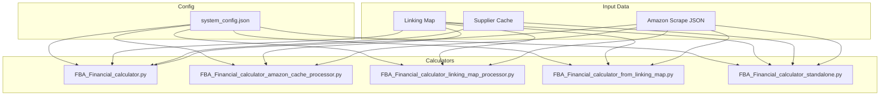
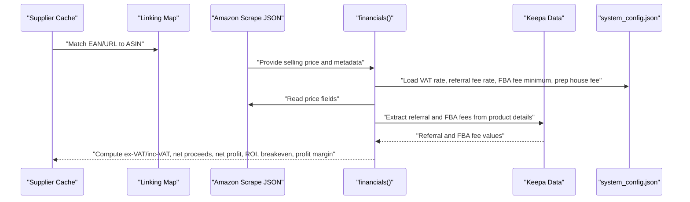
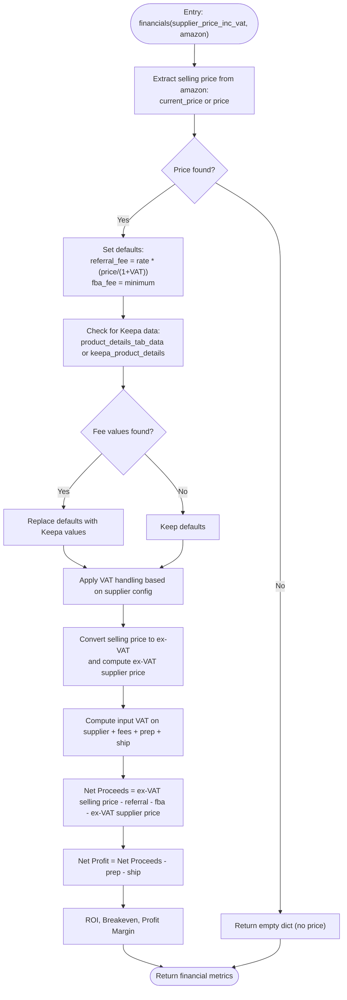
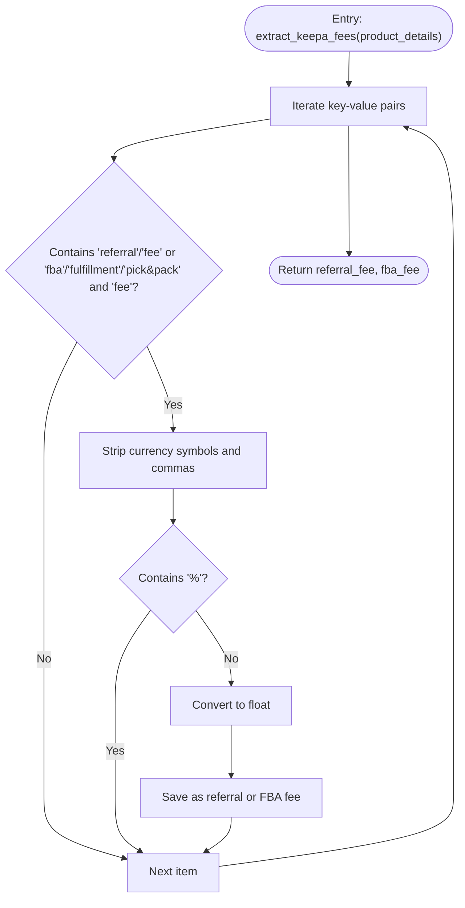
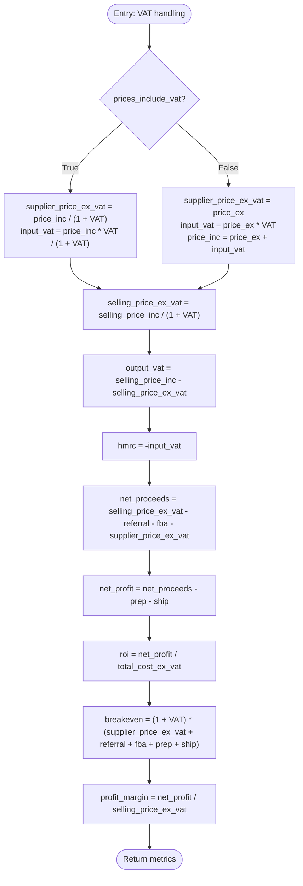
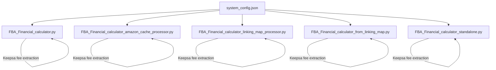

# FBA Fee Calculation

<cite>
**Referenced Files in This Document**
- [FBA_Financial_calculator.py](file://tools/FBA_Financial_calculator.py)
- [FBA_Financial_calculator_amazon_cache_processor.py](file://tools/FBA_Financial_calculator_amazon_cache_processor.py)
- [FBA_Financial_calculator_linking_map_processor.py](file://tools/FBA_Financial_calculator_linking_map_processor.py)
- [FBA_Financial_calculator_from_linking_map.py](file://tools/FBA_Financial_calculator_from_linking_map.py)
- [FBA_Financial_calculator_standalone.py](file://tools/FBA_Financial_calculator_standalone.py)
- [system_config.json](file://config/system_config.json)
- [amazon_playwright_extractor.py](file://tools/amazon_playwright_extractor.py)
</cite>

## Table of Contents
1. [Introduction](#introduction)
2. [Project Structure](#project-structure)
3. [Core Components](#core-components)
4. [Architecture Overview](#architecture-overview)
5. [Detailed Component Analysis](#detailed-component-analysis)
6. [Dependency Analysis](#dependency-analysis)
7. [Performance Considerations](#performance-considerations)
8. [Troubleshooting Guide](#troubleshooting-guide)
9. [Conclusion](#conclusion)

## Introduction
This document explains the FBA fee calculation methodology implemented across multiple financial calculators in the system. It covers the complete fee structure (referral fees, FBA fulfillment fees, prep house fees, and shipping costs), the financials() function implementation, how fees are extracted from Keepa data, fallback mechanisms, and VAT handling. It also documents how missing fee data is handled, default values applied, and common edge cases and error conditions in fee extraction.

## Project Structure
The FBA financial calculation logic is implemented in several Python scripts under the tools directory, each designed for different input sources and workflows:
- FBA_Financial_calculator.py: Core financials() function and end-to-end processing pipeline using supplier cache and linking map.
- FBA_Financial_calculator_amazon_cache_processor.py: Processes all Amazon cache files and matches with supplier prices.
- FBA_Financial_calculator_linking_map_processor.py: Uses linking map as the primary data source to generate financial reports.
- FBA_Financial_calculator_from_linking_map.py: Generates financial reports using linking map entries directly.
- FBA_Financial_calculator_standalone.py: Standalone processor using a specific linking map file and supplier cache.

**Diagram sources**
- [FBA_Financial_calculator.py](file://tools/FBA_Financial_calculator.py#L45-L74)
- [FBA_Financial_calculator_amazon_cache_processor.py](file://tools/FBA_Financial_calculator_amazon_cache_processor.py#L30-L52)
- [FBA_Financial_calculator_linking_map_processor.py](file://tools/FBA_Financial_calculator_linking_map_processor.py#L30-L52)
- [FBA_Financial_calculator_from_linking_map.py](file://tools/FBA_Financial_calculator_from_linking_map.py#L29-L46)
- [FBA_Financial_calculator_standalone.py](file://tools/FBA_Financial_calculator_standalone.py#L31-L52)

**Section sources**
- [FBA_Financial_calculator.py](file://tools/FBA_Financial_calculator.py#L1-L120)
- [system_config.json](file://config/system_config.json#L233-L246)

## Core Components
This section focuses on the financials() function and supporting helpers that implement the fee extraction and computation logic.

- financials() function:
  - Purpose: Computes net proceeds, net profit, ROI, breakeven, and profit margin based on Amazon selling price, supplier price, referral fee, FBA fee, prep house fee, and shipping cost.
  - Inputs:
    - supplier_price_inc_vat: Supplier price including VAT (or ex-VAT depending on configuration).
    - amazon: Amazon product data dictionary containing price and optional Keepa fee data.
  - Key steps:
    - Extract Amazon selling price from multiple possible fields.
    - Compute default referral fee and FBA fee using configuration values.
    - Extract actual referral and FBA fees from Keepa product details tab data if available.
    - Apply VAT handling based on supplier pricing configuration (prices_include_vat).
    - Compute ex-VAT and inc-VAT values consistently.
    - Calculate net proceeds, net profit, ROI, breakeven, and profit margin.

- extract_keepa_fees():
  - Purpose: Parses Keepa product details tab data to extract referral fee and FBA fee values.
  - Behavior:
    - Iterates through key-value pairs in Keepa product details.
    - Skips percentage values and currency symbols.
    - Converts numeric strings to floats and returns referral and FBA fee values.

- VAT handling:
  - supplier_prices_include_vat flag determines whether supplier price is ex-VAT or inc-VAT.
  - When true: supplier_price_ex_vat = supplier_price_inc_vat / (1 + VAT_RATE); input_vat = supplier_price_inc_vat * VAT_RATE / (1 + VAT_RATE).
  - When false: supplier_price_ex_vat = supplier_price_inc_vat; input_vat = supplier_price_ex_vat * VAT_RATE; supplier_price_inc_vat = supplier_price_ex_vat + input_vat.
  - Amazon selling price is converted to ex-VAT for economic calculations: amazon_price_ex_vat = selling_price_inc_vat / (1 + VAT_RATE).
  - Output VAT reflects VAT collected from customer sales.

- Defaults and fallbacks:
  - Referral fee rate and FBA fee minimum are loaded from system configuration.
  - If Keepa product details are missing or do not contain fee values, defaults are used.
  - Prep house fixed fee and shipping cost are configurable with defaults.

- Ex-VAT vs inc-VAT computations:
  - Economic calculations (net proceeds, net profit, ROI, breakeven) are performed using ex-VAT values.
  - Output VAT and HMRC reflect VAT implications for supplier input and Amazon output.

**Section sources**
- [FBA_Financial_calculator.py](file://tools/FBA_Financial_calculator.py#L375-L470)
- [FBA_Financial_calculator.py](file://tools/FBA_Financial_calculator.py#L264-L312)
- [system_config.json](file://config/system_config.json#L233-L246)

## Architecture Overview
The financial calculation architecture integrates configuration-driven defaults, Amazon scrape data, and Keepa extension data to compute accurate fee structures and profitability metrics.

**Diagram sources**
- [FBA_Financial_calculator.py](file://tools/FBA_Financial_calculator.py#L375-L470)
- [FBA_Financial_calculator.py](file://tools/FBA_Financial_calculator.py#L264-L312)
- [system_config.json](file://config/system_config.json#L233-L246)

## Detailed Component Analysis

### Financials Function Implementation
The financials() function orchestrates fee extraction and computation. It supports multiple input sources for Amazon price and uses Keepa data for precise fee extraction when available.

**Diagram sources**
- [FBA_Financial_calculator.py](file://tools/FBA_Financial_calculator.py#L375-L470)

**Section sources**
- [FBA_Financial_calculator.py](file://tools/FBA_Financial_calculator.py#L375-L470)

### Fee Extraction from Keepa Data
The extract_keepa_fees() function parses Keepa product details to locate referral and FBA fee values, skipping percentage entries and currency symbols.

**Diagram sources**
- [FBA_Financial_calculator.py](file://tools/FBA_Financial_calculator.py#L264-L312)

**Section sources**
- [FBA_Financial_calculator.py](file://tools/FBA_Financial_calculator.py#L264-L312)

### VAT Handling and Supplier Price Configurations
The system supports two supplier price modes:
- prices_include_vat = true: Supplier price is treated as inc-VAT; ex-VAT supplier price is computed and input VAT is derived accordingly.
- prices_include_vat = false: Supplier price is treated as ex-VAT; input VAT is computed from ex-VAT supplier price; inc-VAT supplier price is recomputed.

**Diagram sources**
- [FBA_Financial_calculator.py](file://tools/FBA_Financial_calculator.py#L414-L454)

**Section sources**
- [FBA_Financial_calculator.py](file://tools/FBA_Financial_calculator.py#L414-L454)
- [system_config.json](file://config/system_config.json#L244-L246)

### Mathematical Formulas Used
- Default referral fee (ex-VAT): referral_fee = referral_fee_rate × (selling_price_inc / (1 + VAT))
- Default FBA fee: fba_fee = fulfillment_fee_minimum
- Net proceeds (ex-VAT): net_proceeds = selling_price_ex_vat − referral_fee − fba_fee − supplier_price_ex_vat
- Net profit: net_profit = net_proceeds − prep_house_fee − shipping_cost
- ROI: roi = (net_profit / total_cost_ex_vat) × 100
- Breakeven (inc-VAT): breakeven = (1 + VAT) × (supplier_price_ex_vat + referral_fee + fba_fee + prep_house_fee + shipping_cost)
- Profit margin: profit_margin = (net_profit / selling_price_ex_vat) × 100

Where:
- selling_price_ex_vat = selling_price_inc / (1 + VAT)
- total_cost_ex_vat = supplier_price_ex_vat + prep_house_fee + shipping_cost

**Section sources**
- [FBA_Financial_calculator.py](file://tools/FBA_Financial_calculator.py#L391-L454)

### Concrete Examples
Note: The following examples illustrate scenarios conceptually. Replace placeholder values with actual inputs from your data.

- Scenario A: Supplier prices include VAT
  - supplier_price_inc_vat = 10.00 GBP
  - selling_price_inc_vat = 15.00 GBP
  - VAT_RATE = 0.20
  - referral_fee_rate_default = 0.15
  - fba_fee_default = 2.41
  - prep_house_fee = 0.55
  - shipping_cost = 0.00
  - supplier_price_ex_vat ≈ 8.33 GBP
  - referral_fee ≈ 1.50 GBP (based on default rate applied to ex-VAT selling price)
  - net_proceeds ≈ 5.17 GBP
  - net_profit ≈ 4.62 GBP
  - roi ≈ 55.4%
  - breakeven ≈ 12.00 GBP (inc-VAT)

- Scenario B: Supplier prices ex-VAT
  - supplier_price_ex_vat = 10.00 GBP
  - selling_price_inc_vat = 15.00 GBP
  - VAT_RATE = 0.20
  - referral_fee_rate_default = 0.15
  - fba_fee_default = 2.41
  - prep_house_fee = 0.55
  - shipping_cost = 0.00
  - supplier_price_inc_vat = 12.00 GBP
  - selling_price_ex_vat = 12.50 GBP
  - referral_fee ≈ 1.25 GBP (based on default rate applied to ex-VAT selling price)
  - net_proceeds ≈ 8.75 GBP
  - net_profit ≈ 8.20 GBP
  - roi ≈ 68.0%
  - breakeven ≈ 15.00 GBP (inc-VAT)

- Scenario C: Keepa provides explicit fees
  - Keepa product details include referral fee = 1.00 GBP and FBA fee = 2.80 GBP
  - Use these values instead of defaults
  - Recompute net proceeds, net profit, ROI, and breakeven using the provided fees

- Scenario D: Missing fee data
  - If Keepa product details are absent or do not contain fee values, defaults are used
  - Ensure fallbacks are logged and validated

**Section sources**
- [FBA_Financial_calculator.py](file://tools/FBA_Financial_calculator.py#L391-L454)
- [system_config.json](file://config/system_config.json#L233-L246)

### How Missing Fee Data Is Handled and Default Values Are Applied
- If Keepa product details are missing or do not contain fee values, defaults are applied:
  - referral_fee = referral_fee_rate_default × (selling_price_inc / (1 + VAT))
  - fba_fee = fulfillment_fee_minimum
- Logging:
  - The calculators log warnings when price data is missing or when fee extraction fails, aiding diagnosis and validation.

**Section sources**
- [FBA_Financial_calculator.py](file://tools/FBA_Financial_calculator.py#L391-L410)
- [FBA_Financial_calculator.py](file://tools/FBA_Financial_calculator.py#L576-L583)

### Common Edge Cases and Error Conditions
- No selling price found:
  - financials() returns an empty dictionary and logs a warning.
- No Amazon data for a given EAN/ASIN:
  - The processors skip the product and increment counters for missing matches.
- No price data in Amazon JSON:
  - Logging indicates missing fields and continues processing.
- Invalid or malformed Keepa fee values:
  - Parsing exceptions are caught; values are skipped and defaults are used.
- Linking map inconsistencies:
  - Missing supplier price or ASIN in linking map entries leads to skipped entries and appropriate counters.

**Section sources**
- [FBA_Financial_calculator.py](file://tools/FBA_Financial_calculator.py#L382-L387)
- [FBA_Financial_calculator.py](file://tools/FBA_Financial_calculator.py#L576-L583)
- [FBA_Financial_calculator_amazon_cache_processor.py](file://tools/FBA_Financial_calculator_amazon_cache_processor.py#L316-L336)
- [FBA_Financial_calculator_linking_map_processor.py](file://tools/FBA_Financial_calculator_linking_map_processor.py#L316-L318)
- [FBA_Financial_calculator_from_linking_map.py](file://tools/FBA_Financial_calculator_from_linking_map.py#L292-L295)

## Dependency Analysis
The calculators depend on configuration values and data sources as follows:

**Diagram sources**
- [system_config.json](file://config/system_config.json#L233-L246)
- [FBA_Financial_calculator.py](file://tools/FBA_Financial_calculator.py#L264-L312)
- [FBA_Financial_calculator_amazon_cache_processor.py](file://tools/FBA_Financial_calculator_amazon_cache_processor.py#L54-L78)
- [FBA_Financial_calculator_linking_map_processor.py](file://tools/FBA_Financial_calculator_linking_map_processor.py#L89-L113)
- [FBA_Financial_calculator_from_linking_map.py](file://tools/FBA_Financial_calculator_from_linking_map.py#L48-L73)
- [FBA_Financial_calculator_standalone.py](file://tools/FBA_Financial_calculator_standalone.py#L232-L265)

**Section sources**
- [system_config.json](file://config/system_config.json#L233-L246)
- [FBA_Financial_calculator.py](file://tools/FBA_Financial_calculator.py#L264-L312)

## Performance Considerations
- Data source selection:
  - Prefer linking map-based processing for completeness and to avoid reliance on current supplier cache state.
- Price field precedence:
  - The calculators check multiple price fields in order; early success short-circuits further checks.
- Keepa fee extraction:
  - Parsing is linear over the product details dictionary; ensure Keepa data is present for accurate fee extraction.
- Logging overhead:
  - Extensive logging aids debugging but can impact performance in large-scale runs; adjust log levels as needed.

## Troubleshooting Guide
- Missing Amazon price:
  - Verify that the Amazon scrape JSON contains a valid price field. The calculators log missing fields and titles for diagnosis.
- Missing Keepa fee data:
  - Confirm that Keepa extension data is present in the scrape JSON. If absent, defaults are used.
- Supplier price mode mismatch:
  - Ensure supplier configuration (prices_include_vat) matches the supplier’s pricing model to avoid incorrect VAT computations.
- Linking map mismatches:
  - Validate EAN/URL mappings and ASIN resolution. Use linking map processor to ensure all entries are considered.

**Section sources**
- [FBA_Financial_calculator.py](file://tools/FBA_Financial_calculator.py#L576-L583)
- [FBA_Financial_calculator_amazon_cache_processor.py](file://tools/FBA_Financial_calculator_amazon_cache_processor.py#L316-L336)
- [system_config.json](file://config/system_config.json#L244-L246)

## Conclusion
The FBA fee calculation system provides robust, configuration-driven financial modeling with strong fallbacks and VAT-aware computations. By leveraging Keepa data for precise fee extraction and applying defaults when necessary, it supports reliable profitability analysis across diverse supplier and Amazon price scenarios. The calculators are modular and can be adapted to different input sources, ensuring flexibility and maintainability.