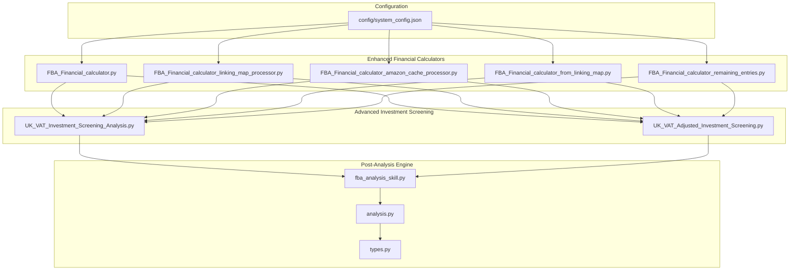
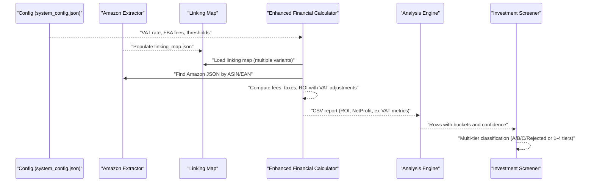
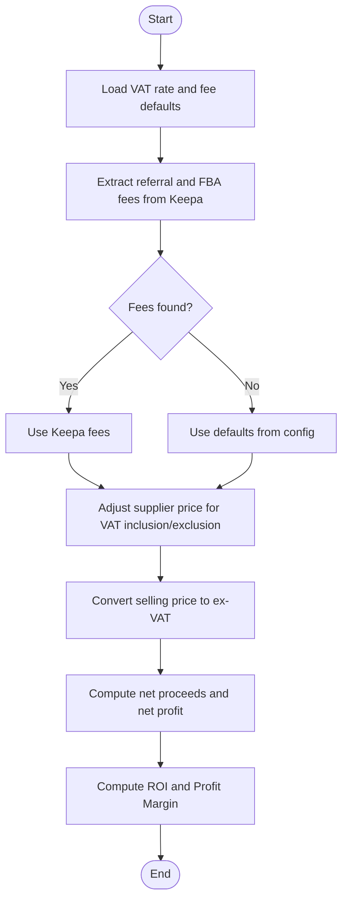
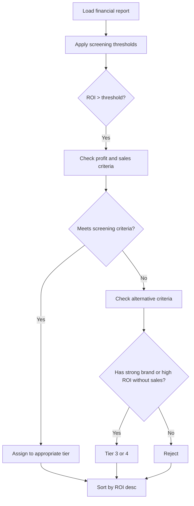
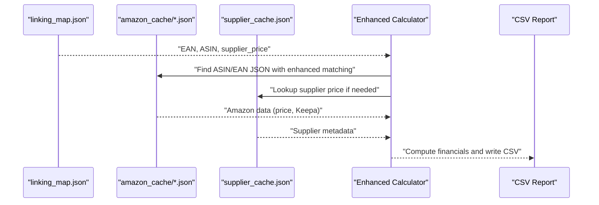
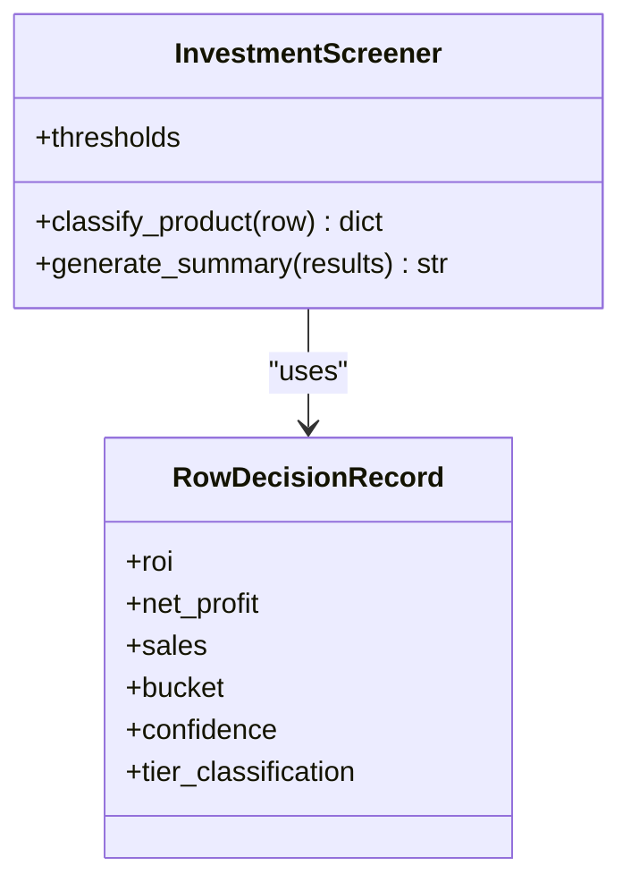
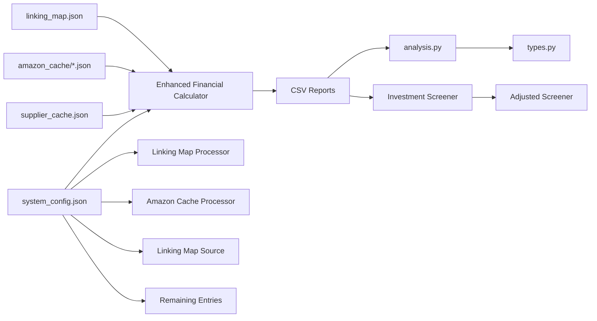

# Financial Analysis

<cite>
**Referenced Files in This Document**
- [system_config.json](file://config/system_config.json)
- [FBA_Financial_calculator.py](file://tools/FBA_Financial_calculator.py)
- [FBA_Financial_calculator_linking_map_processor.py](file://tools/FBA_Financial_calculator_linking_map_processor.py)
- [FBA_Financial_calculator_amazon_cache_processor.py](file://tools/FBA_Financial_calculator_amazon_cache_processor.py)
- [FBA_Financial_calculator_from_linking_map.py](file://tools/FBA_Financial_calculator_from_linking_map.py)
- [FBA_Financial_calculator_remaining_entries.py](file://tools/FBA_Financial_calculator_remaining_entries.py)
- [fba_analysis_skill.py](file://src/fba_agent/skills/fba_analysis_skill.py)
- [analysis.py](file://src/fba_agent/analysis.py)
- [types.py](file://src/fba_agent/types.py)
- [UK_VAT_Investment_Screening_Analysis.py](file://OUTPUTS/FBA_ANALYSIS/financial_reports/UK_VAT_Investment_Screening_Analysis.py)
- [UK_VAT_Adjusted_Investment_Screening.py](file://OUTPUTS/FBA_ANALYSIS/financial_reports/UK_VAT_Adjusted_Investment_Screening.py)
</cite>

## Update Summary
**Changes Made**
- Enhanced financial analysis integration with new FBA fee calculation methodology
- Added comprehensive investment screening module with VAT adjustments
- Updated profitability assessment with realistic wholesale margin thresholds
- Integrated new UK VAT-aware screening capabilities
- Expanded financial reporting with multiple calculator variants
- Enhanced configuration options for pricing thresholds and screening criteria

## Table of Contents
1. [Introduction](#introduction)
2. [Project Structure](#project-structure)
3. [Core Components](#core-components)
4. [Architecture Overview](#architecture-overview)
5. [Detailed Component Analysis](#detailed-component-analysis)
6. [Enhanced Investment Screening](#enhanced-investment-screening)
7. [Dependency Analysis](#dependency-analysis)
8. [Performance Considerations](#performance-considerations)
9. [Troubleshooting Guide](#troubleshooting-guide)
10. [Conclusion](#conclusion)
11. [Appendices](#appendices)

## Introduction
This document explains the enhanced financial analysis capabilities of the Amazon FBA Agent System with a focus on:
- Advanced FBA fee calculation methodology with VAT adjustments
- Multi-tier investment screening with realistic wholesale thresholds
- Comprehensive profitability assessment and ROI analysis
- Financial calculator implementations with multiple data source strategies
- Configuration options for pricing thresholds, fee structures, and screening criteria
- Integration with Amazon data extraction and linking map processing
- Practical examples and interpretation of results with UK VAT compliance

The goal is to make the enhanced financial analysis pipeline understandable for both technical and non-technical users, grounded in the actual codebase with recent improvements.

## Project Structure
The enhanced financial analysis spans four major areas:
- Tools-based calculators that process cached Amazon data, linking maps, and supplier caches to produce comprehensive CSV reports
- Advanced investment screening modules with VAT-aware classification
- System configuration that defines VAT rates, fee structures, and realistic screening thresholds
- Post-processing analysis and automated decision-making with multiple screening tiers

**Diagram sources**
- [system_config.json](file://config/system_config.json#L233-L246)
- [FBA_Financial_calculator.py](file://tools/FBA_Financial_calculator.py#L44-L74)
- [FBA_Financial_calculator_linking_map_processor.py](file://tools/FBA_Financial_calculator_linking_map_processor.py#L30-L53)
- [FBA_Financial_calculator_amazon_cache_processor.py](file://tools/FBA_Financial_calculator_amazon_cache_processor.py#L30-L53)
- [FBA_Financial_calculator_from_linking_map.py](file://tools/FBA_Financial_calculator_from_linking_map.py#L29-L47)
- [FBA_Financial_calculator_remaining_entries.py](file://tools/FBA_Financial_calculator_remaining_entries.py#L29-L54)
- [UK_VAT_Investment_Screening_Analysis.py](file://OUTPUTS/FBA_ANALYSIS/financial_reports/UK_VAT_Investment_Screening_Analysis.py#L180-L211)
- [UK_VAT_Adjusted_Investment_Screening.py](file://OUTPUTS/FBA_ANALYSIS/financial_reports/UK_VAT_Adjusted_Investment_Screening.py#L26-L59)

**Section sources**
- [system_config.json](file://config/system_config.json#L233-L246)
- [FBA_Financial_calculator.py](file://tools/FBA_Financial_calculator.py#L44-L74)
- [fba_analysis_skill.py](file://src/fba_agent/skills/fba_analysis_skill.py#L11-L65)

## Core Components
The enhanced financial analysis system now includes:

### Enhanced Financial Calculators
- **Primary calculator**: [FBA_Financial_calculator.py](file://tools/FBA_Financial_calculator.py#L375-L470) - Processes supplier cache with linking map integration
- **Linking map processor**: [FBA_Financial_calculator_linking_map_processor.py](file://tools/FBA_Financial_calculator_linking_map_processor.py#L227-L383) - Direct linking map processing
- **Amazon cache processor**: [FBA_Financial_calculator_amazon_cache_processor.py](file://tools/FBA_Financial_calculator_amazon_cache_processor.py#L191-L410) - Processes all Amazon cache files
- **Linking map source**: [FBA_Financial_calculator_from_linking_map.py](file://tools/FBA_Financial_calculator_from_linking_map.py#L219-L361) - Uses linking map as primary source
- **Remaining entries**: [FBA_Financial_calculator_remaining_entries.py](file://tools/FBA_Financial_calculator_remaining_entries.py#L269-L425) - Processes unprocessed linking map entries

### Advanced Investment Screening
- **Standard screening**: [UK_VAT_Investment_Screening_Analysis.py](file://OUTPUTS/FBA_ANALYSIS/financial_reports/UK_VAT_Investment_Screening_Analysis.py#L180-L211) - Traditional three-tier classification
- **Adjusted screening**: [UK_VAT_Adjusted_Investment_Screening.py](file://OUTPUTS/FBA_ANALYSIS/financial_reports/UK_VAT_Adjusted_Investment_Screening.py#L26-L59) - Four-tier classification with realistic thresholds

### Analysis Engine
- **Post-processing**: [analysis.py](file://src/fba_agent/analysis.py#L40-L418) - Classifies rows into buckets with confidence scoring
- **Type definitions**: [types.py](file://src/fba_agent/types.py#L27-L105) - Defines RowDecisionRecord and screening classifications

**Section sources**
- [FBA_Financial_calculator.py](file://tools/FBA_Financial_calculator.py#L375-L470)
- [FBA_Financial_calculator_linking_map_processor.py](file://tools/FBA_Financial_calculator_linking_map_processor.py#L227-L383)
- [FBA_Financial_calculator_amazon_cache_processor.py](file://tools/FBA_Financial_calculator_amazon_cache_processor.py#L191-L410)
- [UK_VAT_Adjusted_Investment_Screening.py](file://OUTPUTS/FBA_ANALYSIS/financial_reports/UK_VAT_Adjusted_Investment_Screening.py#L26-L59)
- [analysis.py](file://src/fba_agent/analysis.py#L40-L418)

## Architecture Overview
The enhanced financial analysis pipeline integrates configuration, multiple data sources, advanced screening, and post-processing:

**Diagram sources**
- [system_config.json](file://config/system_config.json#L233-L246)
- [FBA_Financial_calculator.py](file://tools/FBA_Financial_calculator.py#L77-L133)
- [FBA_Financial_calculator_linking_map_processor.py](file://tools/FBA_Financial_calculator_linking_map_processor.py#L227-L383)
- [analysis.py](file://src/fba_agent/analysis.py#L40-L345)
- [UK_VAT_Adjusted_Investment_Screening.py](file://OUTPUTS/FBA_ANALYSIS/financial_reports/UK_VAT_Adjusted_Investment_Screening.py#L135-L158)

## Detailed Component Analysis

### Enhanced FBA Fee Calculation Methodology
The calculators now feature sophisticated fee calculation with comprehensive VAT handling:

**Key Enhancements:**
- **Fee extraction**: Extract referral and FBA fees from Keepa product details when available
- **Fallback logic**: Use configured defaults (referral fee rate: 15%, FBA fee: £2.80 minimum)
- **VAT integration**: Handle supplier price inclusion/exclusion with accurate input/output VAT calculations
- **Ex-VAT economics**: Convert all calculations to ex-VAT for accurate net profit and ROI metrics
- **Comprehensive metrics**: Calculate net proceeds, HMRC (input VAT), breakeven, and profit margin

**Diagram sources**
- [FBA_Financial_calculator.py](file://tools/FBA_Financial_calculator.py#L375-L470)
- [system_config.json](file://config/system_config.json#L233-L246)

**Section sources**
- [FBA_Financial_calculator.py](file://tools/FBA_Financial_calculator.py#L375-L470)
- [system_config.json](file://config/system_config.json#L233-L246)

### ROI Analysis and Profitability Screening
Enhanced ROI analysis with multiple screening approaches:

**Traditional Screening (3-tier):**
- Tier A (Buy Now): ROI ≥ 35%, Net Profit ≥ £0.80, Sales > 50
- Tier B (Consider): ROI ≥ 30%, Net Profit ≥ £0.75, Sales > 50  
- Tier C (Investigate): ROI ≥ 25%, Net Profit ≥ £0.50, Strong brand indicators
- Rejected: Below thresholds or insufficient signals

**Adjusted Screening (4-tier with realistic thresholds):**
- Tier 1 (Immediate Buy): ROI ≥ 25%, Net Profit ≥ £0.50, Sales > 50
- Tier 2 (Strong Consider): ROI ≥ 20%, Net Profit ≥ £0.40, Sales > 30
- Tier 3 (Investigate): ROI ≥ 15%, Net Profit ≥ £0.30, Sales > 20 OR strong brand
- Tier 4 (Monitor): ROI ≥ 10%, Net Profit ≥ £0.20, Track for improvements
- Rejected: Below Tier 4 thresholds

**Diagram sources**
- [UK_VAT_Adjusted_Investment_Screening.py](file://OUTPUTS/FBA_ANALYSIS/financial_reports/UK_VAT_Adjusted_Investment_Screening.py#L135-L158)
- [UK_VAT_Investment_Screening_Analysis.py](file://OUTPUTS/FBA_ANALYSIS/financial_reports/UK_VAT_Investment_Screening_Analysis.py#L180-L211)

**Section sources**
- [FBA_Financial_calculator.py](file://tools/FBA_Financial_calculator.py#L443-L454)
- [UK_VAT_Adjusted_Investment_Screening.py](file://OUTPUTS/FBA_ANALYSIS/financial_reports/UK_VAT_Adjusted_Investment_Screening.py#L26-L59)
- [UK_VAT_Investment_Screening_Analysis.py](file://OUTPUTS/FBA_ANALYSIS/financial_reports/UK_VAT_Investment_Screening_Analysis.py#L330-L341)

### Financial Calculator Implementations
Multiple calculator variants optimized for different data sources and use cases:

**Primary Calculator Features:**
- Supplier cache integration with linking map lookup
- Enhanced error handling and logging
- Support for multiple price field variations
- Comprehensive statistics and reporting

**Linking Map Processor Features:**
- Direct linking map processing without supplier cache
- Embedded supplier data from linking map entries
- Optimized for complete linking map coverage

**Amazon Cache Processor Features:**
- Processes all Amazon cache files systematically
- Combines supplier cache and linking map for comprehensive coverage
- Handles missing supplier data gracefully

**Section sources**
- [FBA_Financial_calculator.py](file://tools/FBA_Financial_calculator.py#L472-L665)
- [FBA_Financial_calculator_linking_map_processor.py](file://tools/FBA_Financial_calculator_linking_map_processor.py#L227-L383)
- [FBA_Financial_calculator_amazon_cache_processor.py](file://tools/FBA_Financial_calculator_amazon_cache_processor.py#L191-L410)

### Relationship with Amazon Data Extraction and Linking Map Processing
Enhanced integration with multiple data sources:

**Data Source Strategy:**
- **Linking map priority**: EAN-based matching with ASIN resolution
- **Amazon cache fallback**: Direct ASIN/price file lookup
- **Supplier cache integration**: Price and metadata enrichment
- **Enhanced filename matching**: EAN-ASIN filename pattern support

**Diagram sources**
- [FBA_Financial_calculator_linking_map_processor.py](file://tools/FBA_Financial_calculator_linking_map_processor.py#L227-L383)
- [FBA_Financial_calculator_amazon_cache_processor.py](file://tools/FBA_Financial_calculator_amazon_cache_processor.py#L191-L410)
- [FBA_Financial_calculator_from_linking_map.py](file://tools/FBA_Financial_calculator_from_linking_map.py#L219-L361)

**Section sources**
- [FBA_Financial_calculator_linking_map_processor.py](file://tools/FBA_Financial_calculator_linking_map_processor.py#L227-L383)
- [FBA_Financial_calculator_amazon_cache_processor.py](file://tools/FBA_Financial_calculator_amazon_cache_processor.py#L191-L410)
- [FBA_Financial_calculator_from_linking_map.py](file://tools/FBA_Financial_calculator_from_linking_map.py#L219-L361)

### Configuration Options for Pricing Thresholds, Fee Structures, and Screening Criteria
Enhanced configuration system with realistic defaults:

**VAT and Fee Configuration:**
- VAT rate: 20% (0.2)
- Referral fee rate: 15% (0.15) - used as fallback when Keepa data unavailable
- FBA fee minimum: £2.80
- Prep house fixed fee: £0.55
- Supplier prices include VAT: False (default)

**Screening Thresholds:**
- Traditional: ROI ≥ 30%, Net Profit ≥ £0.75, Sales > 50
- Adjusted: ROI ≥ 15%, Net Profit ≥ £0.30, Sales > 20
- Strong brand detection: Disney, Marvel, Star Wars, LEGO, Nike, Adidas, Apple, Samsung, Sony, Canon, Nikon, Dyson, KitchenAid, Russell Hobbs, Morphy Richards

**Section sources**
- [system_config.json](file://config/system_config.json#L208-L232)
- [system_config.json](file://config/system_config.json#L233-L246)
- [system_config.json](file://config/system_config.json#L244-L246)

### Examples from the Codebase
**Enhanced Fee Calculation and ROI Computation:**
- [FBA_Financial_calculator.py](file://tools/FBA_Financial_calculator.py#L375-L470)
- [FBA_Financial_calculator.py](file://tools/FBA_Financial_calculator.py#L443-L454)

**Multi-Tier Investment Classification:**
- [UK_VAT_Adjusted_Investment_Screening.py](file://OUTPUTS/FBA_ANALYSIS/financial_reports/UK_VAT_Adjusted_Investment_Screening.py#L135-L158)
- [UK_VAT_Investment_Screening_Analysis.py](file://OUTPUTS/FBA_ANALYSIS/financial_reports/UK_VAT_Investment_Screening_Analysis.py#L180-L211)

**Section sources**
- [FBA_Financial_calculator.py](file://tools/FBA_Financial_calculator.py#L375-L470)
- [UK_VAT_Adjusted_Investment_Screening.py](file://OUTPUTS/FBA_ANALYSIS/financial_reports/UK_VAT_Adjusted_Investment_Screening.py#L135-L158)
- [UK_VAT_Investment_Screening_Analysis.py](file://OUTPUTS/FBA_ANALYSIS/financial_reports/UK_VAT_Investment_Screening_Analysis.py#L180-L211)

## Enhanced Investment Screening

### Multi-Tier Classification System
The enhanced screening system now provides four distinct investment tiers with realistic wholesale thresholds:

**Tier 1 (Immediate Buy):**
- ROI ≥ 25%
- Net Profit ≥ £0.50
- Sales > 50/month
- **Risk Level**: LOW
- **Action**: BUY NOW

**Tier 2 (Strong Consider):**
- ROI ≥ 20%
- Net Profit ≥ £0.40  
- Sales > 30/month
- **Risk Level**: MEDIUM-LOW
- **Action**: DETAILED ANALYSIS

**Tier 3 (Investigate):**
- ROI ≥ 15%
- Net Profit ≥ £0.30
- Either: Sales > 20/month OR strong brand indicators OR high ROI without sales data
- **Risk Level**: MEDIUM
- **Action**: SALES VERIFICATION NEEDED

**Tier 4 (Monitor):**
- ROI ≥ 10%
- Net Profit ≥ £0.20
- **Risk Level**: MEDIUM-HIGH
- **Action**: TRACK FOR IMPROVEMENT

**Rejection Criteria:**
- ROI < 10% OR Net Profit < £0.20
- No sales data available and ROI < 20%

**Diagram sources**
- [UK_VAT_Adjusted_Investment_Screening.py](file://OUTPUTS/FBA_ANALYSIS/financial_reports/UK_VAT_Adjusted_Investment_Screening.py#L135-L158)
- [types.py](file://src/fba_agent/types.py#L74-L105)

**Section sources**
- [UK_VAT_Adjusted_Investment_Screening.py](file://OUTPUTS/FBA_ANALYSIS/financial_reports/UK_VAT_Adjusted_Investment_Screening.py#L26-L59)
- [UK_VAT_Investment_Screening_Analysis.py](file://OUTPUTS/FBA_ANALYSIS/financial_reports/UK_VAT_Investment_Screening_Analysis.py#L330-L341)
- [types.py](file://src/fba_agent/types.py#L74-L105)

## Dependency Analysis
The enhanced financial analysis stack maintains clear separation of concerns with expanded capabilities:

**Diagram sources**
- [system_config.json](file://config/system_config.json#L233-L246)
- [FBA_Financial_calculator.py](file://tools/FBA_Financial_calculator.py#L44-L74)
- [FBA_Financial_calculator_linking_map_processor.py](file://tools/FBA_Financial_calculator_linking_map_processor.py#L30-L53)
- [FBA_Financial_calculator_amazon_cache_processor.py](file://tools/FBA_Financial_calculator_amazon_cache_processor.py#L30-L53)
- [FBA_Financial_calculator_from_linking_map.py](file://tools/FBA_Financial_calculator_from_linking_map.py#L29-L47)
- [FBA_Financial_calculator_remaining_entries.py](file://tools/FBA_Financial_calculator_remaining_entries.py#L29-L54)
- [analysis.py](file://src/fba_agent/analysis.py#L40-L345)
- [types.py](file://src/fba_agent/types.py#L27-L105)
- [UK_VAT_Adjusted_Investment_Screening.py](file://OUTPUTS/FBA_ANALYSIS/financial_reports/UK_VAT_Adjusted_Investment_Screening.py#L135-L158)

**Section sources**
- [system_config.json](file://config/system_config.json#L233-L246)
- [FBA_Financial_calculator.py](file://tools/FBA_Financial_calculator.py#L44-L74)
- [analysis.py](file://src/fba_agent/analysis.py#L40-L345)
- [UK_VAT_Adjusted_Investment_Screening.py](file://OUTPUTS/FBA_ANALYSIS/financial_reports/UK_VAT_Adjusted_Investment_Screening.py#L135-L158)

## Performance Considerations
Enhanced performance optimizations and considerations:

**Processing Strategies:**
- **Linking map prioritization**: Reduces supplier cache lookups and IO overhead
- **Batch processing**: Sorting by ROI minimizes downstream filtering costs
- **Enhanced caching**: Multiple calculator variants optimize for different data sources
- **Parallel processing**: Multiple calculator implementations can run concurrently

**Optimization Techniques:**
- Consistent ex-VAT computations avoid repeated conversions
- Supplier cache filename optimization with EAN inclusion
- Enhanced error handling reduces retry overhead
- Configurable batch sizes for different processing modes

## Troubleshooting Guide
Enhanced troubleshooting for the expanded financial analysis system:

**Common Issues and Resolutions:**

**No Amazon Data Found:**
- Verify linking map entries and cache filenames
- Confirm ASIN/EAN alignment and enhanced filename patterns
- Check EAN-ASIN filename matching logic
- References: [FBA_Financial_calculator.py](file://tools/FBA_Financial_calculator.py#L211-L262)

**Missing Price Data:**
- Check Amazon cache for current price fields
- Verify fallback logic for multiple price field variations
- Ensure Keepa data availability for fee extraction
- References: [FBA_Financial_calculator.py](file://tools/FBA_Financial_calculator.py#L560-L590)

**VAT Mismatch Issues:**
- Confirm supplier price inclusion setting in configuration
- Verify ex-VAT calculations and input VAT recovery
- Check VAT rate consistency across all calculations
- References: [FBA_Financial_calculator.py](file://tools/FBA_Financial_calculator.py#L413-L437)

**Screening Discrepancies:**
- Adjust ROI thresholds based on wholesale margin reality
- Compare traditional vs adjusted screening results
- Verify brand detection and sales data quality
- References: [UK_VAT_Adjusted_Investment_Screening.py](file://OUTPUTS/FBA_ANALYSIS/financial_reports/UK_VAT_Adjusted_Investment_Screening.py#L135-L158)

**Section sources**
- [FBA_Financial_calculator.py](file://tools/FBA_Financial_calculator.py#L211-L262)
- [FBA_Financial_calculator_linking_map_processor.py](file://tools/FBA_Financial_calculator_linking_map_processor.py#L54-L88)
- [FBA_Financial_calculator_amazon_cache_processor.py](file://tools/FBA_Financial_calculator_amazon_cache_processor.py#L320-L337)
- [system_config.json](file://config/system_config.json#L208-L232)
- [system_config.json](file://config/system_config.json#L244-L246)
- [UK_VAT_Adjusted_Investment_Screening.py](file://OUTPUTS/FBA_ANALYSIS/financial_reports/UK_VAT_Adjusted_Investment_Screening.py#L135-L158)

## Conclusion
The enhanced financial analysis module provides robust, configurable, and VAT-aware calculations across multiple data sources with comprehensive investment screening capabilities. The system now offers realistic wholesale thresholds, multi-tier classification, and enhanced fee calculation with proper VAT handling. By leveraging linking maps, Amazon cache, and supplier data, it generates reliable ROI and profit margin metrics, supports advanced post-processing classification, and enables informed investment decisions with UK VAT compliance.

## Appendices

### Practical Scenarios and Interpretation
**Enhanced Investment Tiers:**

**Tier 1 (Immediate Buy):**
- High ROI (≥25%) with strong profit margins (≥£0.50)
- Substantial sales volume (>50/month)
- **Interpretation**: Low-risk opportunity with proven profitability
- **Action**: Proceed with procurement

**Tier 2 (Strong Consider):**
- Solid ROI (≥20%) with good profit margins (≥£0.40)
- Moderate sales volume (>30/month)
- **Interpretation**: Good opportunity requiring competitive analysis
- **Action**: Conduct detailed competitor review

**Tier 3 (Investigate):**
- Moderate ROI (≥15%) with acceptable profit margins (≥£0.30)
- Either strong brand indicators OR high ROI compensating for missing sales data
- **Interpretation**: Potential opportunity requiring sales data verification
- **Action**: Manual sales data verification

**Tier 4 (Monitor):**
- Minimum acceptable ROI (≥10%) with basic profit margins (≥£0.20)
- Track for market condition improvements
- **Interpretation**: Low-risk monitoring opportunity
- **Action**: Monitor for price changes or demand shifts

**Traditional Three-Tier Classification:**
- **Tier A**: High confidence buy opportunities
- **Tier B**: Consider with caution
- **Tier C**: Requires investigation
- **Rejected**: Below minimum thresholds

**Section sources**
- [UK_VAT_Adjusted_Investment_Screening.py](file://OUTPUTS/FBA_ANALYSIS/financial_reports/UK_VAT_Adjusted_Investment_Screening.py#L187-L202)
- [UK_VAT_Investment_Screening_Analysis.py](file://OUTPUTS/FBA_ANALYSIS/financial_reports/UK_VAT_Investment_Screening_Analysis.py#L191-L209)
- [UK_VAT_Investment_Screening_Analysis.py](file://OUTPUTS/FBA_ANALYSIS/financial_reports/UK_VAT_Investment_Screening_Analysis.py#L330-L341)