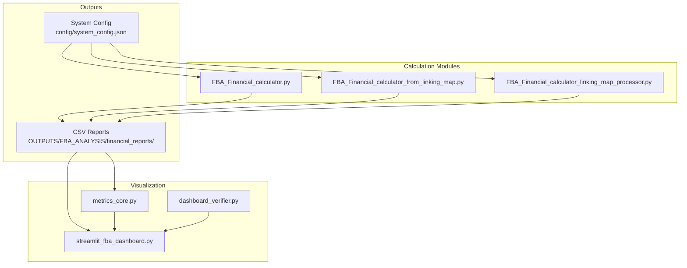
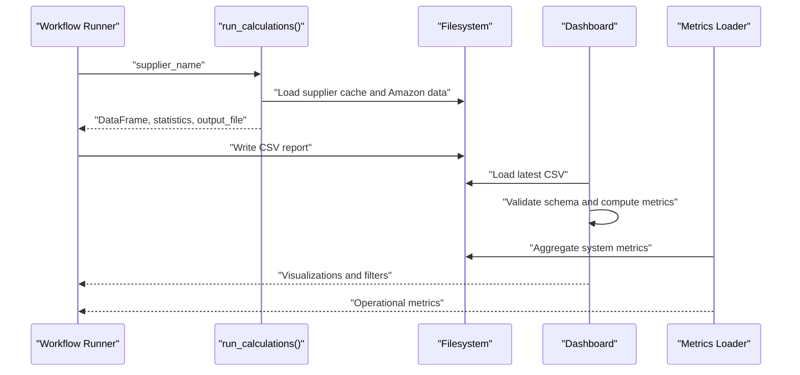
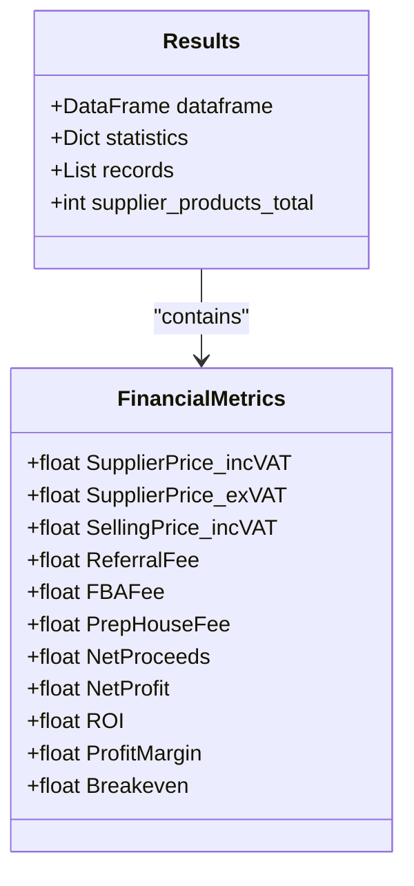
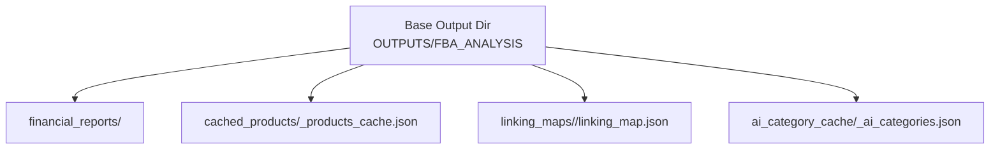
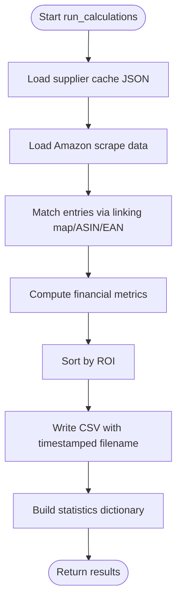
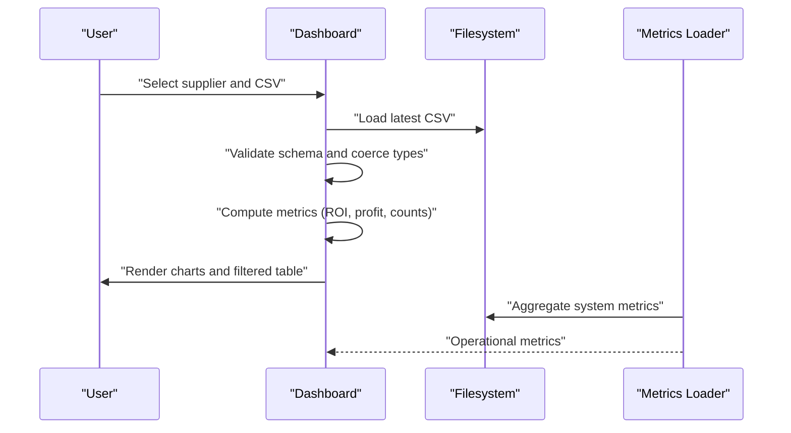
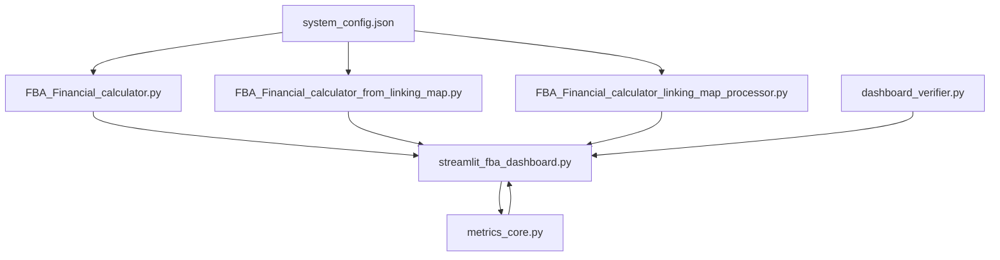

# Financial Reporting

<cite>
**Referenced Files in This Document**
- [FBA_Financial_calculator.py](file://tools/FBA_Financial_calculator.py)
- [FBA_Financial_calculator_from_linking_map.py](file://tools/FBA_Financial_calculator_from_linking_map.py)
- [FBA_Financial_calculator_linking_map_processor.py](file://tools/FBA_Financial_calculator_linking_map_processor.py)
- [streamlit_fba_dashboard.py](file://dashboard/streamlit_fba_dashboard.py)
- [metrics_core.py](file://dashboard/metrics_core.py)
- [dashboard_verifier.py](file://ai_enhanced_setup/dashboard_verifier.py)
- [system_config.json](file://config/system_config.json)
- [fba_financial_report_20251208_151904.csv](file://OUTPUTS/FBA_ANALYSIS/financial_reports/angelwholesale-co-uk/fba_financial_report_20251208_151904.csv)
- [generate_final_report_md.py](file://tools/generate_final_report_md.py)
</cite>

## Table of Contents
1. [Introduction](#introduction)
2. [Project Structure](#project-structure)
3. [Core Components](#core-components)
4. [Architecture Overview](#architecture-overview)
5. [Detailed Component Analysis](#detailed-component-analysis)
6. [Dependency Analysis](#dependency-analysis)
7. [Performance Considerations](#performance-considerations)
8. [Troubleshooting Guide](#troubleshooting-guide)
9. [Conclusion](#conclusion)
10. [Appendices](#appendices)

## Introduction
This document explains the financial reporting capabilities of the Amazon FBA Agent System. It covers the report generation process, CSV output formatting, statistical summaries, supplier-specific reporting, directory organization, customization and filtering options, export formats, validation and quality checks, and integration with the dashboard visualization for decision-making workflows.

## Project Structure
The financial reporting pipeline centers around three calculation modules and integrates with a dashboard and metrics loader:
- Calculation modules generate financial reports from supplier caches and Amazon scrape data
- The dashboard loads the latest CSV and renders analytics
- Metrics loader aggregates system-wide metrics for operational visibility
- Configuration defines thresholds and system behavior

**Diagram sources**
- [FBA_Financial_calculator.py](file://tools/FBA_Financial_calculator.py#L1-L712)
- [FBA_Financial_calculator_from_linking_map.py](file://tools/FBA_Financial_calculator_from_linking_map.py#L1-L408)
- [FBA_Financial_calculator_linking_map_processor.py](file://tools/FBA_Financial_calculator_linking_map_processor.py#L1-L429)
- [system_config.json](file://config/system_config.json#L1-L384)
- [streamlit_fba_dashboard.py](file://dashboard/streamlit_fba_dashboard.py#L1-L645)
- [metrics_core.py](file://dashboard/metrics_core.py#L1-L615)
- [dashboard_verifier.py](file://ai_enhanced_setup/dashboard_verifier.py#L1-L223)

**Section sources**
- [FBA_Financial_calculator.py](file://tools/FBA_Financial_calculator.py#L1-L712)
- [FBA_Financial_calculator_from_linking_map.py](file://tools/FBA_Financial_calculator_from_linking_map.py#L1-L408)
- [FBA_Financial_calculator_linking_map_processor.py](file://tools/FBA_Financial_calculator_linking_map_processor.py#L1-L429)
- [system_config.json](file://config/system_config.json#L1-L384)
- [streamlit_fba_dashboard.py](file://dashboard/streamlit_fba_dashboard.py#L1-L645)
- [metrics_core.py](file://dashboard/metrics_core.py#L1-L615)
- [dashboard_verifier.py](file://ai_enhanced_setup/dashboard_verifier.py#L1-L223)

## Core Components
- Financial calculation engines:
  - run_calculations(): Processes supplier cache entries and Amazon data to produce a DataFrame, statistics dictionary, and file path
  - run_calculations_from_linking_map(): Uses linking map as the primary data source for complete coverage
  - run_calculations_linking_map_processor(): Direct linking map processing without supplier cache dependency
- Dashboard and metrics:
  - streamlit_fba_dashboard.py: Loads CSV, validates schema, computes metrics, and renders charts
  - metrics_core.py: Aggregates system metrics from multiple sources
  - dashboard_verifier.py: Cross-validates dashboard metrics against file-grounded data
- Configuration:
  - system_config.json: Defines thresholds (e.g., min ROI), VAT rates, and fee defaults used in calculations

Key outputs:
- CSV files named fba_financial_report_<supplier>_<timestamp>.csv
- Statistics dictionary with counts, profitability breakdown, and file paths
- Dashboard metrics for operational monitoring

**Section sources**
- [FBA_Financial_calculator.py](file://tools/FBA_Financial_calculator.py#L472-L664)
- [FBA_Financial_calculator_from_linking_map.py](file://tools/FBA_Financial_calculator_from_linking_map.py#L219-L360)
- [FBA_Financial_calculator_linking_map_processor.py](file://tools/FBA_Financial_calculator_linking_map_processor.py#L227-L382)
- [streamlit_fba_dashboard.py](file://dashboard/streamlit_fba_dashboard.py#L130-L214)
- [metrics_core.py](file://dashboard/metrics_core.py#L331-L424)
- [system_config.json](file://config/system_config.json#L208-L246)

## Architecture Overview
The system orchestrates financial reporting across supplier-specific workflows and presents insights via a dashboard.

**Diagram sources**
- [FBA_Financial_calculator.py](file://tools/FBA_Financial_calculator.py#L472-L664)
- [streamlit_fba_dashboard.py](file://dashboard/streamlit_fba_dashboard.py#L130-L214)
- [metrics_core.py](file://dashboard/metrics_core.py#L331-L424)

## Detailed Component Analysis

### run_calculations() Output Structure
The function returns a structured dictionary:
- dataframe: Pandas DataFrame with columns including EAN, ASIN, SupplierTitle, AmazonTitle, URLs, enhanced metrics, and financial metrics (SupplierPrice_incVAT, SellingPrice_incVAT, NetProfit, ROI, ProfitMargin, etc.)
- statistics: Dictionary with counts (processed, found_matches, generated_calculations), output_file path, and profitability breakdown (profitable_count, marginal_count, unprofitable_count, top_5_by_roi)
- records: Raw list of rows used to construct the DataFrame
- supplier_products_total: Total entries in the supplier cache

**Diagram sources**
- [FBA_Financial_calculator.py](file://tools/FBA_Financial_calculator.py#L472-L664)

**Section sources**
- [FBA_Financial_calculator.py](file://tools/FBA_Financial_calculator.py#L472-L664)

### CSV Output Formatting and Statistical Summaries
- CSV naming: fba_financial_report_<normalized_supplier>_<YYYYMMDD_HHMMSS>.csv
- Columns include supplier identifiers, product metadata, enhanced metrics (e.g., bought_in_past_month, fba_seller_count, fbm_seller_count, total_offer_count), pricing and tax fields, and financial outcomes
- Statistical summaries:
  - Profitability breakdown by ROI threshold (default 30%)
  - Top 5 items by ROI
  - Counts for profitable, marginal, and unprofitable items

Example CSV structure (headers):
- EAN, EAN_OnPage, ASIN, SupplierTitle, AmazonTitle, SupplierURL, AmazonURL, bought_in_past_month, fba_seller_count, fbm_seller_count, total_offer_count, SupplierPrice_incVAT, SupplierPrice_exVAT, SellingPrice_incVAT, ReferralFee, FBAFee, PrepHouseFee, OutputVAT, InputVAT, NetProceeds, HMRC, NetProfit, ROI, Breakeven, ProfitMargin

**Section sources**
- [FBA_Financial_calculator.py](file://tools/FBA_Financial_calculator.py#L628-L664)
- [fba_financial_report_20251208_151904.csv](file://OUTPUTS/FBA_ANALYSIS/financial_reports/angelwholesale-co-uk/fba_financial_report_20251208_151904.csv#L1-L181)

### Supplier-Specific Reporting and Directory Organization
- Supplier-specific paths are normalized (dots to hyphens) to ensure consistent directory naming
- Outputs are organized under OUTPUTS/FBA_ANALYSIS/financial_reports/<normalized_supplier>
- Additional supplier-specific directories include cached_products, linking_maps, and ai_category_cache

**Diagram sources**
- [FBA_Financial_calculator.py](file://tools/FBA_Financial_calculator.py#L16-L36)

**Section sources**
- [FBA_Financial_calculator.py](file://tools/FBA_Financial_calculator.py#L16-L36)

### Report Generation Process
- run_calculations():
  - Loads supplier cache and Amazon scrape data
  - Matches supplier entries to Amazon listings via linking map and ASIN/EAN
  - Computes financial metrics using system-configured VAT and fee defaults
  - Sorts by ROI and writes CSV with timestamped filename
  - Returns DataFrame, statistics, and file path

- run_calculations_from_linking_map():
  - Uses linking_map.json as the primary source for all entries
  - Processes supplier_price, ASIN, and EAN directly from the linking map
  - Writes a complete report with profitability breakdown

- run_calculations_linking_map_processor():
  - Processes linking map entries without supplier cache dependency
  - Builds DataFrame and computes statistics similarly

**Diagram sources**
- [FBA_Financial_calculator.py](file://tools/FBA_Financial_calculator.py#L472-L664)

**Section sources**
- [FBA_Financial_calculator.py](file://tools/FBA_Financial_calculator.py#L472-L664)
- [FBA_Financial_calculator_from_linking_map.py](file://tools/FBA_Financial_calculator_from_linking_map.py#L219-L360)
- [FBA_Financial_calculator_linking_map_processor.py](file://tools/FBA_Financial_calculator_linking_map_processor.py#L227-L382)

### Dashboard Integration and Decision-Making Workflows
- Dashboard loads the latest CSV from supplier-specific directory, validates schema, and computes metrics
- Provides filtering by ROI, profit, MatchQuality, and categorical attributes
- Exports filtered datasets as CSV for downstream analysis

**Diagram sources**
- [streamlit_fba_dashboard.py](file://dashboard/streamlit_fba_dashboard.py#L130-L214)
- [metrics_core.py](file://dashboard/metrics_core.py#L331-L424)

**Section sources**
- [streamlit_fba_dashboard.py](file://dashboard/streamlit_fba_dashboard.py#L130-L214)
- [metrics_core.py](file://dashboard/metrics_core.py#L331-L424)

### Report Customization, Filtering, and Export Formats
- Customization:
  - Thresholds (e.g., min ROI percent) configured in system_config.json
  - VAT and fee defaults applied during financial computations
- Filtering:
  - Dashboard supports ROI, profit, profitability, and MatchQuality filters
  - Manual override logic for curated reporting (example script demonstrates manual KEEP/DROP decisions)
- Export formats:
  - CSV export from dashboard
  - Markdown reports with curated tables and summaries (example script)

**Section sources**
- [system_config.json](file://config/system_config.json#L208-L246)
- [streamlit_fba_dashboard.py](file://dashboard/streamlit_fba_dashboard.py#L558-L611)
- [generate_final_report_md.py](file://tools/generate_final_report_md.py#L1-L184)

### Validation, Quality Checks, and Error Handling
- CSV validation:
  - Dashboard scans supplier-specific and parent directories for valid CSVs with essential columns
  - Validates headers and skips empty files
- Data quality alerts:
  - Flags extreme ROI values (>1000%) as suspicious
  - Adds MatchQuality badges based on ROI thresholds
- Metrics verification:
  - dashboard_verifier compares dashboard metrics against file-grounded data for cross-validation
- Calculation safeguards:
  - Ensures Amazon data directory exists and is a directory
  - Raises exceptions for missing supplier cache or empty matching results

**Section sources**
- [streamlit_fba_dashboard.py](file://dashboard/streamlit_fba_dashboard.py#L89-L128)
- [streamlit_fba_dashboard.py](file://dashboard/streamlit_fba_dashboard.py#L185-L201)
- [dashboard_verifier.py](file://ai_enhanced_setup/dashboard_verifier.py#L51-L205)
- [FBA_Financial_calculator.py](file://tools/FBA_Financial_calculator.py#L504-L516)
- [FBA_Financial_calculator.py](file://tools/FBA_Financial_calculator.py#L619-L621)

## Dependency Analysis
The financial reporting system depends on configuration, filesystem organization, and dashboard metrics aggregation.

**Diagram sources**
- [system_config.json](file://config/system_config.json#L1-L384)
- [FBA_Financial_calculator.py](file://tools/FBA_Financial_calculator.py#L1-L712)
- [FBA_Financial_calculator_from_linking_map.py](file://tools/FBA_Financial_calculator_from_linking_map.py#L1-L408)
- [FBA_Financial_calculator_linking_map_processor.py](file://tools/FBA_Financial_calculator_linking_map_processor.py#L1-L429)
- [streamlit_fba_dashboard.py](file://dashboard/streamlit_fba_dashboard.py#L1-L645)
- [metrics_core.py](file://dashboard/metrics_core.py#L1-L615)
- [dashboard_verifier.py](file://ai_enhanced_setup/dashboard_verifier.py#L1-L223)

**Section sources**
- [system_config.json](file://config/system_config.json#L1-L384)
- [FBA_Financial_calculator.py](file://tools/FBA_Financial_calculator.py#L1-L712)
- [FBA_Financial_calculator_from_linking_map.py](file://tools/FBA_Financial_calculator_from_linking_map.py#L1-L408)
- [FBA_Financial_calculator_linking_map_processor.py](file://tools/FBA_Financial_calculator_linking_map_processor.py#L1-L429)
- [streamlit_fba_dashboard.py](file://dashboard/streamlit_fba_dashboard.py#L1-L645)
- [metrics_core.py](file://dashboard/metrics_core.py#L1-L615)
- [dashboard_verifier.py](file://ai_enhanced_setup/dashboard_verifier.py#L1-L223)

## Performance Considerations
- Large CSV handling:
  - Dashboard sampling mode for files >50MB
  - Metrics loader uses dtype-str for safe inference and targeted numeric conversion
- Batch processing:
  - Financial report batch size configurable in system_config.json
- Memory management:
  - Metrics loader caches parsed files keyed by modification time
- Sorting and filtering:
  - CSV sorting by ROI performed server-side during generation
  - Dashboard filtering client-side for interactive exploration

[No sources needed since this section provides general guidance]

## Troubleshooting Guide
Common issues and resolutions:
- Missing Amazon data directory:
  - run_calculations() raises explicit errors if the Amazon scrape directory is missing or invalid
- Empty matching results:
  - run_calculations() raises an exception when no matching records are found; verify supplier cache and linking map
- Dashboard CSV validation failures:
  - Ensure CSV contains essential columns and is not empty; dashboard skips zero-sized files
- Extreme ROI values:
  - Dashboard flags ROI >1000% as suspicious; investigate potential wrong Amazon matches
- Metrics mismatch:
  - Use dashboard_verifier to cross-check dashboard metrics against file-grounded data

**Section sources**
- [FBA_Financial_calculator.py](file://tools/FBA_Financial_calculator.py#L504-L516)
- [FBA_Financial_calculator.py](file://tools/FBA_Financial_calculator.py#L619-L621)
- [streamlit_fba_dashboard.py](file://dashboard/streamlit_fba_dashboard.py#L89-L128)
- [streamlit_fba_dashboard.py](file://dashboard/streamlit_fba_dashboard.py#L185-L201)
- [dashboard_verifier.py](file://ai_enhanced_setup/dashboard_verifier.py#L51-L205)

## Conclusion
The financial reporting system provides robust, supplier-specific CSV generation, comprehensive statistical summaries, and integrated dashboard visualization. It supports customization via configuration, rigorous validation and quality checks, and flexible filtering for decision-making workflows. The modular design enables multiple calculation pathways and seamless integration with operational metrics.

## Appendices

### Example Report and Statistical Breakdown
- Example CSV: OUTPUTS/FBA_ANALYSIS/financial_reports/angelwholesale-co-uk/fba_financial_report_20251208_151904.csv
- Statistical breakdown includes:
  - Profitable, marginal, and unprofitable counts
  - Top 5 items by ROI
  - Total rows, average ROI, and total potential profit

**Section sources**
- [fba_financial_report_20251208_151904.csv](file://OUTPUTS/FBA_ANALYSIS/financial_reports/angelwholesale-co-uk/fba_financial_report_20251208_151904.csv#L1-L181)
- [FBA_Financial_calculator.py](file://tools/FBA_Financial_calculator.py#L633-L664)