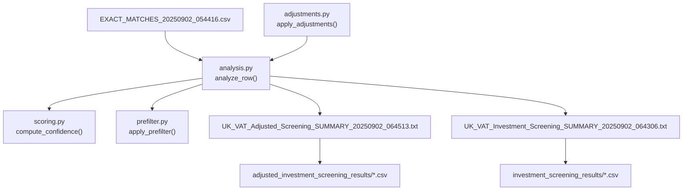
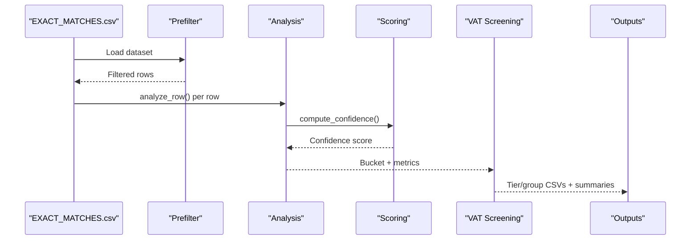
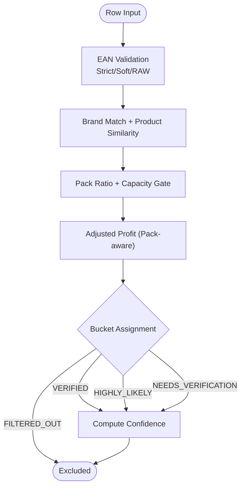
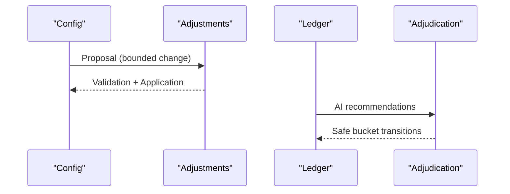
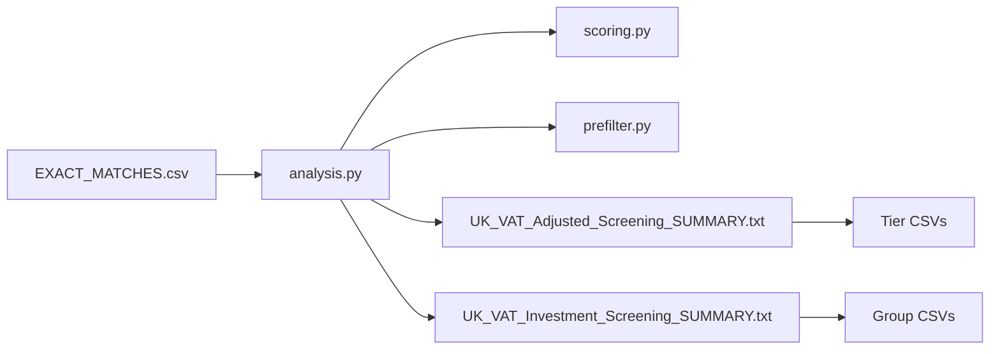

# Investment Screening

<cite>
**Referenced Files in This Document**
- [adjustments.py](file://src/fba_agent/adjustments.py)
- [scoring.py](file://src/fba_agent/scoring.py)
- [prefilter.py](file://src/fba_agent/prefilter.py)
- [analysis.py](file://src/fba_agent/analysis.py)
- [UK_VAT_Adjusted_Screening_SUMMARY_20250902_064513.txt](file://UK_VAT_Adjusted_Screening_SUMMARY_20250902_064513.txt)
- [UK_VAT_Investment_Screening_SUMMARY_20250902_064306.txt](file://UK_VAT_Investment_Screening_SUMMARY_20250902_064306.txt)
- [EXACT_MATCHES_20250902_054416.csv](file://OUTPUTS/FBA_ANALYSIS/financial_reports/poundwholesale-co-uk/test analysis/EXACT_MATCHES_20250902_054416.csv)
- [VIABLE_PRODUCTS_ACTION_LIST.csv](file://OUTPUTS/FBA_ANALYSIS/financial_reports/poundwholesale-co-uk/test analysis/VIABLE_PRODUCTS_ACTION_LIST.csv)
- [UK_VAT_Adjusted_Screening_TIER_3_INVESTIGATE_20250902_064513.csv](file://OUTPUTS/FBA_ANALYSIS/financial_reports/poundwholesale-co-uk/adjusted_investment_screening_results/UK_VAT_Adjusted_Screening_TIER_3_INVESTIGATE_20250902_064513.csv)
- [UK_VAT_Adjusted_Screening_TIER_4_MONITOR_20250902_064513.csv](file://OUTPUTS/FBA_ANALYSIS/financial_reports/poundwholesale-co-uk/adjusted_investment_screening_results/UK_VAT_Adjusted_Screening_TIER_4_MONITOR_20250902_064513.csv)
- [UK_VAT_Adjusted_Screening_REJECTED_20250902_064513.csv](file://OUTPUTS/FBA_ANALYSIS/financial_reports/poundwholesale-co-uk/adjusted_investment_screening_results/UK_VAT_Adjusted_Screening_REJECTED_20250902_064513.csv)
- [UK_VAT_Investment_Screening_GROUP_C_INVESTIGATE_20250902_064306.csv](file://OUTPUTS/FBA_ANALYSIS/financial_reports/poundwholesale-co-uk/investment_screening_results/UK_VAT_Investment_Screening_GROUP_C_INVESTIGATE_20250902_064306.csv)
- [UK_VAT_Investment_Screening_REJECTED_20250902_064306.csv](file://OUTPUTS/FBA_ANALYSIS/financial_reports/poundwholesale-co-uk/investment_screening_results/UK_VAT_Investment_Screening_REJECTED_20250902_064306.csv)
</cite>

## Table of Contents
1. [Introduction](#introduction)
2. [Project Structure](#project-structure)
3. [Core Components](#core-components)
4. [Architecture Overview](#architecture-overview)
5. [Detailed Component Analysis](#detailed-component-analysis)
6. [Dependency Analysis](#dependency-analysis)
7. [Performance Considerations](#performance-considerations)
8. [Troubleshooting Guide](#troubleshooting-guide)
9. [Conclusion](#conclusion)
10. [Appendices](#appendices)

## Introduction
This document explains the investment screening process used to evaluate products for Amazon FBA investment. It covers screening criteria (minimum ROI thresholds, profitability analysis, recommendation tiers), the screening algorithm (based on financial metrics, market indicators, and risk factors), integration with VAT-adjusted calculations, statistical analysis of outcomes, methodology across product categories and market conditions, and the automated decision-making process with manual override capabilities.

## Project Structure
The screening pipeline integrates several modules:
- Pre-filtering to remove obviously unprofitable rows before detailed analysis
- Matching and bucketing logic to classify products into buckets (VERIFIED, HIGHLY_LIKELY, NEEDS_VERIFICATION, FILTERED_OUT)
- Confidence scoring to quantify match quality
- Threshold-based investment classification with VAT-aware adjustments
- Outputs that categorize products into tiers or groups and provide actionable recommendations

**Diagram sources**
- [analysis.py](file://src/fba_agent/analysis.py#L40-L345)
- [scoring.py](file://src/fba_agent/scoring.py#L7-L58)
- [prefilter.py](file://src/fba_agent/prefilter.py#L110-L167)
- [UK_VAT_Adjusted_Screening_SUMMARY_20250902_064513.txt](file://UK_VAT_Adjusted_Screening_SUMMARY_20250902_064513.txt#L1-L139)
- [UK_VAT_Investment_Screening_SUMMARY_20250902_064306.txt](file://UK_VAT_Investment_Screening_SUMMARY_20250902_064306.txt#L1-L95)
- [EXACT_MATCHES_20250902_054416.csv](file://OUTPUTS/FBA_ANALYSIS/financial_reports/poundwholesale-co-uk/test analysis/EXACT_MATCHES_20250902_054416.csv)

**Section sources**
- [analysis.py](file://src/fba_agent/analysis.py#L40-L345)
- [scoring.py](file://src/fba_agent/scoring.py#L7-L58)
- [prefilter.py](file://src/fba_agent/prefilter.py#L110-L167)
- [UK_VAT_Adjusted_Screening_SUMMARY_20250902_064513.txt](file://UK_VAT_Adjusted_Screening_SUMMARY_20250902_064513.txt#L1-L139)
- [UK_VAT_Investment_Screening_SUMMARY_20250902_064306.txt](file://UK_VAT_Investment_Screening_SUMMARY_20250902_064306.txt#L1-L95)

## Core Components
- Pre-filtering: Excludes rows with non-positive sales or net profit early, reducing downstream computation.
- Matching and bucketing: Determines whether a product pair is a match and assigns a bucket (VERIFIED, HIGHLY_LIKELY, NEEDS_VERIFICATION, FILTERED_OUT) based on EAN, brand/product similarity, pack ratios, and capacity gates.
- Confidence scoring: Computes a numeric confidence score reflecting match quality and supporting evidence.
- Investment screening: Applies ROI, net profit, and sales thresholds to assign screening tiers/groups and recommendations.
- VAT-aware adjustments: Revises thresholds to reflect realistic wholesale margins and UK VAT obligations, ensuring ROI and profit figures are net of VAT where applicable.
- Manual overrides: Provides mechanisms to safely adjust thresholds and apply adjudication recommendations to ledgers.

**Section sources**
- [prefilter.py](file://src/fba_agent/prefilter.py#L41-L94)
- [analysis.py](file://src/fba_agent/analysis.py#L186-L304)
- [scoring.py](file://src/fba_agent/scoring.py#L7-L58)
- [UK_VAT_Adjusted_Screening_SUMMARY_20250902_064513.txt](file://UK_VAT_Adjusted_Screening_SUMMARY_20250902_064513.txt#L25-L47)
- [UK_VAT_Investment_Screening_SUMMARY_20250902_064306.txt](file://UK_VAT_Investment_Screening_SUMMARY_20250902_064306.txt#L20-L37)
- [adjustments.py](file://src/fba_agent/adjustments.py#L38-L93)

## Architecture Overview
The screening architecture comprises three stages:
1) Data ingestion and pre-filtering
2) Matching, bucketing, and confidence scoring
3) Investment classification and recommendation

**Diagram sources**
- [prefilter.py](file://src/fba_agent/prefilter.py#L110-L167)
- [analysis.py](file://src/fba_agent/analysis.py#L40-L345)
- [scoring.py](file://src/fba_agent/scoring.py#L7-L58)
- [UK_VAT_Adjusted_Screening_SUMMARY_20250902_064513.txt](file://UK_VAT_Adjusted_Screening_SUMMARY_20250902_064513.txt#L1-L139)
- [UK_VAT_Investment_Screening_SUMMARY_20250902_064306.txt](file://UK_VAT_Investment_Screening_SUMMARY_20250902_064306.txt#L1-L95)

## Detailed Component Analysis

### Screening Criteria and Thresholds
- Minimum ROI thresholds are adjusted to reflect realistic wholesale margins:
  - Tier 2 (Strong Consider): ROI ≥ 20%, Net Profit ≥ £0.40, Sales > 30/month
  - Tier 3 (Investigate): ROI ≥ 15%, Net Profit ≥ £0.30, Sales > 20/month OR strong brand OR high ROI without sales data
  - Tier 4 (Monitor): ROI ≥ 10%, Net Profit ≥ £0.20
- Original thresholds (30–35% ROI) were unrealistic and excluded 99.8% of products; adjusted thresholds reveal viable opportunities previously hidden.
- VAT perspective: All calculations maintain a UK VAT-registered business perspective, with input VAT recoverable and output VAT payable to HMRC.

**Section sources**
- [UK_VAT_Adjusted_Screening_SUMMARY_20250902_064513.txt](file://UK_VAT_Adjusted_Screening_SUMMARY_20250902_064513.txt#L9-L47)
- [UK_VAT_Investment_Screening_SUMMARY_20250902_064306.txt](file://UK_VAT_Investment_Screening_SUMMARY_20250902_064306.txt#L20-L37)

### Screening Algorithm
The algorithm evaluates each product row using:
- EAN matching (strict, soft, and raw string fallback) to establish identity
- Brand and product similarity to confirm compatibility
- Pack ratio and capacity gate to assess variant consistency
- Adjusted profit accounting for pack splits/bundles
- Bucket assignment:
  - VERIFIED: Strong EAN match or other strong evidence
  - HIGHLY_LIKELY: Moderate evidence with acceptable capacity fit
  - NEEDS_VERIFICATION: Partial evidence with sufficient profit for manual review
  - FILTERED_OUT: Incompatible brands, capacity mismatch, or non-positive adjusted profit

Confidence scoring aggregates signals such as brand match, product similarity, variant tolerance, pack ratio, and EAN quality.

**Diagram sources**
- [analysis.py](file://src/fba_agent/analysis.py#L40-L304)
- [scoring.py](file://src/fba_agent/scoring.py#L7-L58)

**Section sources**
- [analysis.py](file://src/fba_agent/analysis.py#L40-L304)
- [scoring.py](file://src/fba_agent/scoring.py#L7-L58)

### Recommendation Generation
Recommendations are derived from bucket assignments and thresholds:
- Tiers/groups with sufficient ROI and profit thresholds are recommended for action (e.g., Investigate, Monitor)
- Manual actions include verifying sales data, competitor analysis, and small-quantity testing
- Risk management emphasizes starting small quantities, focusing on verified sales data, and monitoring price/competitor changes

**Section sources**
- [UK_VAT_Adjusted_Screening_SUMMARY_20250902_064513.txt](file://UK_VAT_Adjusted_Screening_SUMMARY_20250902_064513.txt#L108-L127)
- [UK_VAT_Investment_Screening_SUMMARY_20250902_064306.txt](file://UK_VAT_Investment_Screening_SUMMARY_20250902_064306.txt#L73-L79)

### Integration with VAT Adjustment Calculations
- Thresholds are adjusted to reflect realistic wholesale margins and UK VAT obligations
- Input VAT on supplier purchases is recoverable; output VAT on Amazon sales is payable
- ROI and net profit are computed from ex-VAT supplier cost, reflecting post-VAT, post-fee returns
- VAT corrections address systematic input VAT errors in original datasets

**Section sources**
- [UK_VAT_Adjusted_Screening_SUMMARY_20250902_064513.txt](file://UK_VAT_Adjusted_Screening_SUMMARY_20250902_064513.txt#L129-L136)
- [UK_VAT_Investment_Screening_SUMMARY_20250902_064306.txt](file://UK_VAT_Investment_Screening_SUMMARY_20250902_064306.txt#L54-L61)

### Statistical Analysis of Screening Outcomes
- Market reality shows most products fall in 10–25% ROI range, consistent with typical wholesale margins
- Sales data coverage is low (13.8%), representing a significant risk factor
- Brand premium does not substantially increase ROI in this dataset
- Adjusted thresholds reveal viable opportunities previously hidden by unrealistic expectations

**Section sources**
- [UK_VAT_Adjusted_Screening_SUMMARY_20250902_064513.txt](file://UK_VAT_Adjusted_Screening_SUMMARY_20250902_064513.txt#L78-L106)

### Methodology for Different Product Categories and Market Conditions
- Categories with consistent demand patterns and verified sales data should be prioritized
- Seasonal factors and supplier renegotiations can influence margins and should be monitored
- Brand detection supports identification of premium categories, though ROI premiums are modest in this dataset

**Section sources**
- [UK_VAT_Adjusted_Screening_SUMMARY_20250902_064513.txt](file://UK_VAT_Adjusted_Screening_SUMMARY_20250902_064513.txt#L123-L127)

### Automated Decision-Making and Manual Override Capabilities
- Automated decision-making:
  - Pre-filtering excludes non-positive sales/net-profit rows
  - Matching and bucketing are rule-driven with thresholds for capacity and profitability
  - Confidence scoring quantifies match quality
- Manual overrides:
  - Threshold adjustments are permitted within bounded deltas (±0.05) and require safety flags
  - Adjudication recommendations can upgrade/downgrade buckets with safe transitions
  - Batch adjudication corrections apply to ledgers with partial row matching and safety checks

**Diagram sources**
- [adjustments.py](file://src/fba_agent/adjustments.py#L38-L93)
- [adjustments.py](file://src/fba_agent/adjustments.py#L212-L288)
- [adjustments.py](file://src/fba_agent/adjustments.py#L291-L378)

**Section sources**
- [adjustments.py](file://src/fba_agent/adjustments.py#L38-L93)
- [adjustments.py](file://src/fba_agent/adjustments.py#L212-L288)
- [adjustments.py](file://src/fba_agent/adjustments.py#L291-L378)

## Dependency Analysis
The screening pipeline depends on:
- Data inputs (exact matches CSV) processed by analysis and prefilter modules
- Scoring module to quantify match quality
- VAT-aware summaries to derive thresholds and recommendations
- Outputs mapping to tier/group CSVs and summaries

**Diagram sources**
- [analysis.py](file://src/fba_agent/analysis.py#L40-L345)
- [scoring.py](file://src/fba_agent/scoring.py#L7-L58)
- [prefilter.py](file://src/fba_agent/prefilter.py#L110-L167)
- [UK_VAT_Adjusted_Screening_SUMMARY_20250902_064513.txt](file://UK_VAT_Adjusted_Screening_SUMMARY_20250902_064513.txt#L1-L139)
- [UK_VAT_Investment_Screening_SUMMARY_20250902_064306.txt](file://UK_VAT_Investment_Screening_SUMMARY_20250902_064306.txt#L1-L95)

**Section sources**
- [analysis.py](file://src/fba_agent/analysis.py#L40-L345)
- [scoring.py](file://src/fba_agent/scoring.py#L7-L58)
- [prefilter.py](file://src/fba_agent/prefilter.py#L110-L167)
- [UK_VAT_Adjusted_Screening_SUMMARY_20250902_064513.txt](file://UK_VAT_Adjusted_Screening_SUMMARY_20250902_064513.txt#L1-L139)
- [UK_VAT_Investment_Screening_SUMMARY_20250902_064306.txt](file://UK_VAT_Investment_Screening_SUMMARY_20250902_064306.txt#L1-L95)

## Performance Considerations
- Pre-filtering reduces dataset size by excluding non-positive sales/net-profit rows, lowering downstream computational load.
- Confidence scoring uses lightweight heuristics (brand/product similarity, pack ratio, EAN quality) to avoid heavy ML inference.
- Threshold adjustments are bounded to prevent instability; adjudication updates are applied with safety checks to avoid unsafe transitions.

[No sources needed since this section provides general guidance]

## Troubleshooting Guide
Common issues and resolutions:
- Non-positive sales or net profit: Rows are excluded by pre-filtering; verify data sources and recalculation of net profit.
- EAN mismatches: Use strict, soft, and raw string fallback logic; ensure EAN normalization is consistent.
- Capacity mismatch: Review capacity gates and pack ratios; adjust expectations for bundle/split scenarios.
- Low sales data coverage: Focus on products with verified sales data; monitor for improved coverage over time.
- Threshold realism: If thresholds appear too strict, consider bounded threshold adjustments and VAT-aware recalibration.

**Section sources**
- [prefilter.py](file://src/fba_agent/prefilter.py#L41-L94)
- [analysis.py](file://src/fba_agent/analysis.py#L54-L84)
- [adjustments.py](file://src/fba_agent/adjustments.py#L85-L91)

## Conclusion
The investment screening process combines robust pre-filtering, precise matching and bucketing, confidence scoring, and VAT-aware thresholds to deliver actionable recommendations. Adjusted thresholds reflect realistic wholesale margins, while manual override mechanisms enable safe, bounded tuning and adjudication-driven corrections. Outputs provide clear tier/group classifications and guidance for manual verification and risk management.

[No sources needed since this section summarizes without analyzing specific files]

## Appendices

### Concrete Examples of Screening Results
- Tier 3 (Investigate) and Tier 4 (Monitor) outputs demonstrate products meeting adjusted thresholds for ROI and profit, with varied sales volumes and brand indicators.
- Group C (Investigate) output highlights products with strong ROI and missing sales data, flagged for manual verification.

**Section sources**
- [UK_VAT_Adjusted_Screening_TIER_3_INVESTIGATE_20250902_064513.csv](file://OUTPUTS/FBA_ANALYSIS/financial_reports/poundwholesale-co-uk/adjusted_investment_screening_results/UK_VAT_Adjusted_Screening_TIER_3_INVESTIGATE_20250902_064513.csv)
- [UK_VAT_Adjusted_Screening_TIER_4_MONITOR_20250902_064513.csv](file://OUTPUTS/FBA_ANALYSIS/financial_reports/poundwholesale-co-uk/adjusted_investment_screening_results/UK_VAT_Adjusted_Screening_TIER_4_MONITOR_20250902_064513.csv)
- [UK_VAT_Investment_Screening_GROUP_C_INVESTIGATE_20250902_064306.csv](file://OUTPUTS/FBA_ANALYSIS/financial_reports/poundwholesale-co-uk/investment_screening_results/UK_VAT_Investment_Screening_GROUP_C_INVESTIGATE_20250902_064306.csv)

### Product Categorization and Recommendations
- Tiers/groups are assigned based on ROI, net profit, and sales thresholds; recommendations emphasize manual verification for partial matches and small-quantity testing for moderate opportunities.
- Risk management includes monitoring price changes, supplier negotiations, and seasonal demand.

**Section sources**
- [UK_VAT_Adjusted_Screening_SUMMARY_20250902_064513.txt](file://UK_VAT_Adjusted_Screening_SUMMARY_20250902_064513.txt#L108-L127)
- [UK_VAT_Investment_Screening_SUMMARY_20250902_064306.txt](file://UK_VAT_Investment_Screening_SUMMARY_20250902_064306.txt#L73-L79)