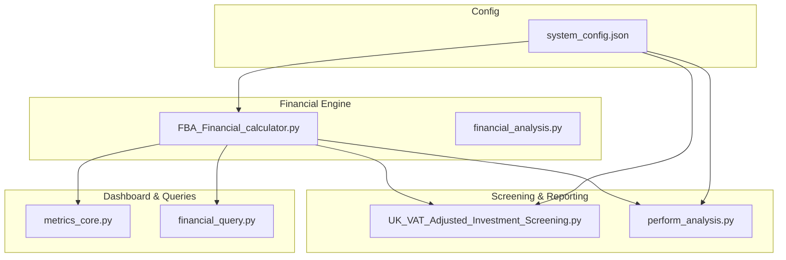
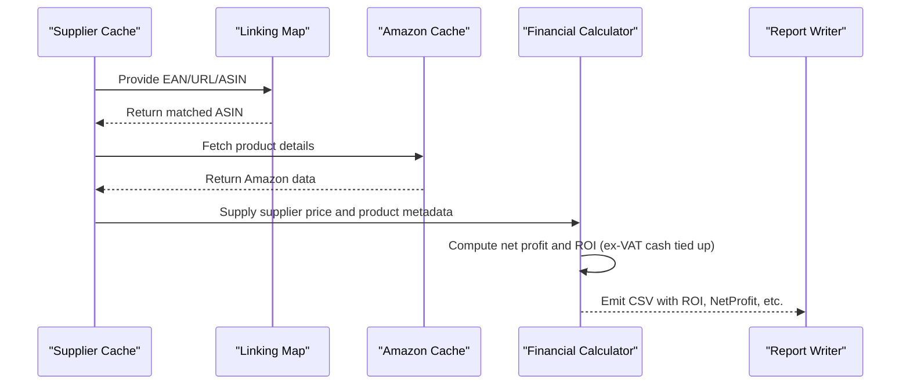
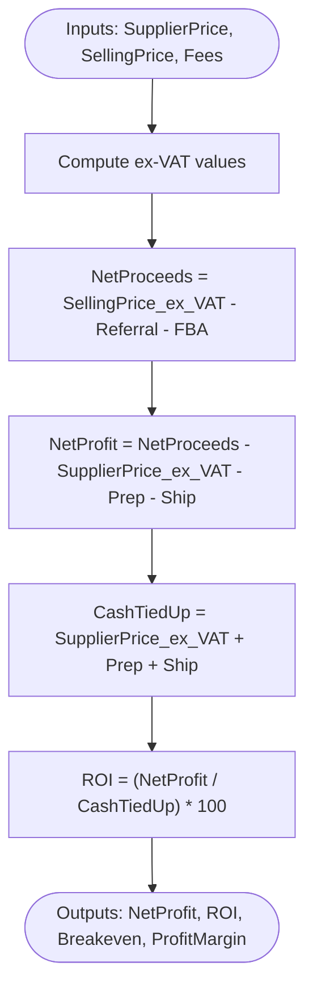
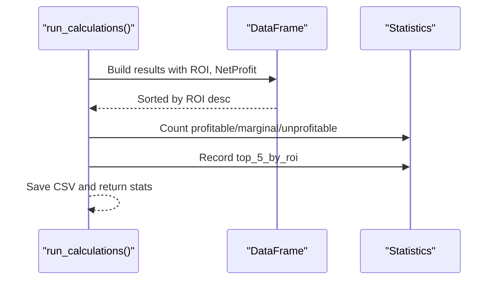
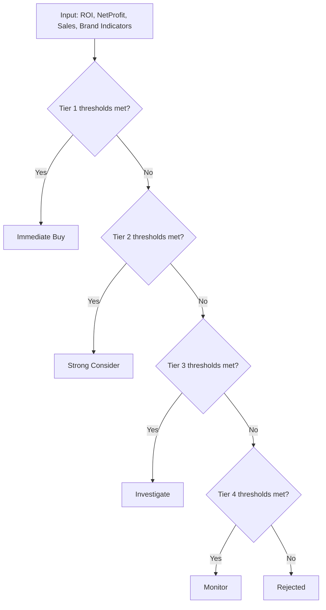
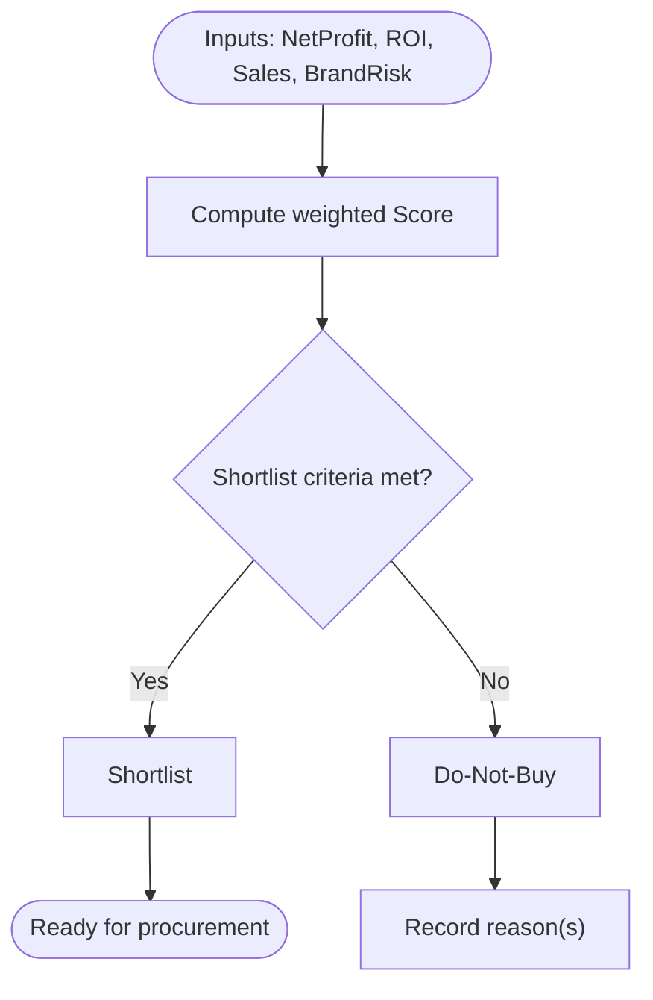
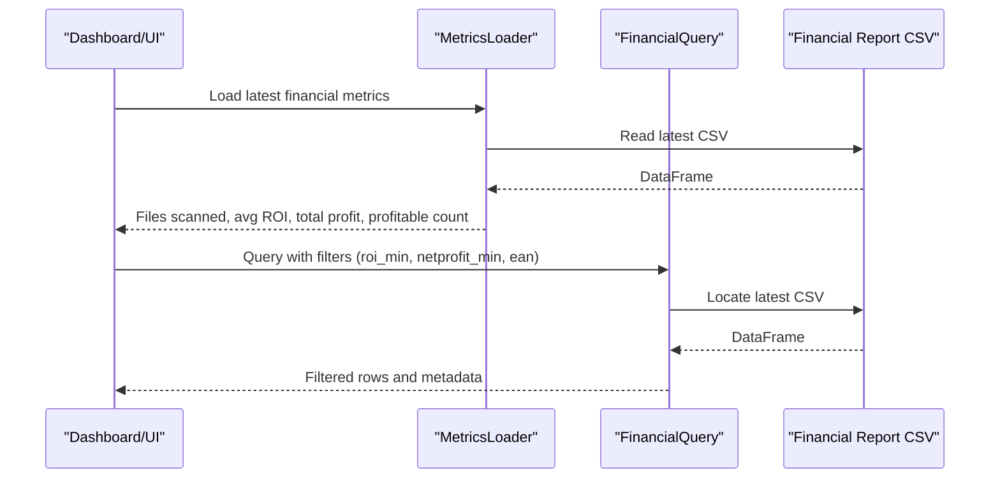
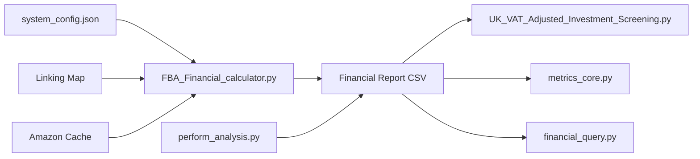

# ROI Analysis

<cite>
**Referenced Files in This Document**
- [FBA_Financial_calculator.py](file://tools/FBA_Financial_calculator.py)
- [UK_VAT_Adjusted_Investment_Screening.py](file://OUTPUTS/FBA_ANALYSIS/financial_reports/UK_VAT_Adjusted_Investment_Screening.py)
- [perform_analysis.py](file://perform_analysis.py)
- [financial_query.py](file://control_plane/financial_query.py)
- [metrics_core.py](file://dashboard/metrics_core.py)
- [system_config.json](file://config/system_config.json)
- [Investment Screening.md](file://repowiki 12 dec & 20 jan/en/content/Financial Analysis Module/Investment Screening.md)
- [financial_analysis.py](file://RESERACH/REPORT/part 8 jan/OC/finan ana/financial_analysis.py)
</cite>

## Table of Contents
1. [Introduction](#introduction)
2. [Project Structure](#project-structure)
3. [Core Components](#core-components)
4. [Architecture Overview](#architecture-overview)
5. [Detailed Component Analysis](#detailed-component-analysis)
6. [Dependency Analysis](#dependency-analysis)
7. [Performance Considerations](#performance-considerations)
8. [Troubleshooting Guide](#troubleshooting-guide)
9. [Conclusion](#conclusion)
10. [Appendices](#appendices)

## Introduction
This document explains the ROI analysis capabilities of the Amazon FBA Agent System with a focus on:
- Return on investment calculation methodology (net profit, cost basis, ROI percentage)
- Threshold configuration and profitability categorization
- Statistical breakdown of profitable vs unprofitable products
- The run_calculations() function’s role in generating ROI statistics
- Interpretation guidelines and decision-making frameworks
- Examples across product scenarios, price points, and fee structures
- How ROI is computed on ex-VAT cash tied up and the impact of pricing strategies

## Project Structure
ROI analysis spans multiple modules:
- Financial calculation engine that computes net profit and ROI
- Investment screening with configurable thresholds
- Dashboard and query utilities for ROI statistics
- Configuration management for thresholds and system-wide parameters

**Diagram sources**
- [FBA_Financial_calculator.py](file://tools/FBA_Financial_calculator.py#L472-L664)
- [UK_VAT_Adjusted_Investment_Screening.py](file://OUTPUTS/FBA_ANALYSIS/financial_reports/UK_VAT_Adjusted_Investment_Screening.py#L26-L59)
- [perform_analysis.py](file://perform_analysis.py#L16-L134)
- [metrics_core.py](file://dashboard/metrics_core.py#L331-L424)
- [financial_query.py](file://control_plane/financial_query.py#L41-L100)
- [system_config.json](file://config/system_config.json#L208-L246)

**Section sources**
- [Investment Screening.md](file://repowiki 12 dec & 20 jan/en/content/Financial Analysis Module/Investment Screening.md#L22-L140)

## Core Components
- Financial calculator: Computes net profit and ROI using ex-VAT cash tied up and applies VAT-aware fee logic.
- Investment screener: Applies tiered thresholds to classify products and generate summaries.
- Analysis orchestrator: Builds a composite score and shortlists products based on ROI, profit, velocity, competition, and brand risk.
- Metrics loader/query: Loads latest financial report and exposes ROI/profit filters for dashboards and external tools.
- Configuration: Centralizes thresholds and fee parameters.

**Section sources**
- [FBA_Financial_calculator.py](file://tools/FBA_Financial_calculator.py#L375-L470)
- [UK_VAT_Adjusted_Investment_Screening.py](file://OUTPUTS/FBA_ANALYSIS/financial_reports/UK_VAT_Adjusted_Investment_Screening.py#L160-L283)
- [perform_analysis.py](file://perform_analysis.py#L72-L134)
- [metrics_core.py](file://dashboard/metrics_core.py#L331-L424)
- [system_config.json](file://config/system_config.json#L208-L246)

## Architecture Overview
The ROI pipeline integrates supplier data, Amazon marketplace data, and configuration-driven thresholds to produce actionable insights.

**Diagram sources**
- [FBA_Financial_calculator.py](file://tools/FBA_Financial_calculator.py#L534-L664)

## Detailed Component Analysis

### Financial Calculation Engine
The financial engine computes:
- Net proceeds: selling price ex-VAT minus referral fee and FBA fee
- Net profit: net proceeds minus supplier cost ex-VAT and prep/ship costs
- ROI: net profit divided by ex-VAT cash tied up (supplier cost ex-VAT plus prep and ship)
- Breakeven shelf price (inc-VAT) and profit margin

Key implementation details:
- VAT handling: supplier price inclusion depends on configuration; all fee computations are ex-VAT for economic consistency
- Cost basis: ex-VAT cash tied up = supplier price ex-VAT + prep cost + shipping cost
- ROI formula: (net profit / ex-VAT cash tied up) × 100

**Diagram sources**
- [FBA_Financial_calculator.py](file://tools/FBA_Financial_calculator.py#L375-L470)

**Section sources**
- [FBA_Financial_calculator.py](file://tools/FBA_Financial_calculator.py#L375-L470)

### run_calculations() Function and Statistics
The run_calculations() function orchestrates:
- Loading supplier cache and Amazon data
- Matching supplier products to Amazon via linking map
- Computing financial metrics per product
- Sorting by ROI and writing CSV
- Aggregating statistics including counts for profitable, marginal, and unprofitable categories

Profitability thresholds used in statistics:
- Profitable: ROI > configured minimum (default 30.0%)
- Marginal: ROI between 0 and configured minimum
- Unprofitable: ROI ≤ 0

Top 5 by ROI are recorded for executive reporting.

**Diagram sources**
- [FBA_Financial_calculator.py](file://tools/FBA_Financial_calculator.py#L622-L664)

**Section sources**
- [FBA_Financial_calculator.py](file://tools/FBA_Financial_calculator.py#L622-L664)
- [Investment Screening.md](file://repowiki 12 dec & 20 jan/en/content/Financial Analysis Module/Investment Screening.md#L88-L110)

### ROI Threshold Configuration and Profitability Categorization
Two complementary threshold systems exist:

1) System-wide analysis thresholds (used in statistics and reporting)
- Configurable minimum ROI percentage (default 15.0% in configuration)
- Used to categorize products in run_calculations() statistics

2) UK VAT-adjusted screening thresholds (used for tiered investment decisions)
- Tier 1 Immediate Buy: ROI ≥ 25%, NetProfit ≥ £0.50, Sales > 50
- Tier 2 Strong Consider: ROI ≥ 20%, NetProfit ≥ £0.40, Sales > 30
- Tier 3 Investigate: ROI ≥ 15%, NetProfit ≥ £0.30, Sales > 20 OR strong brand OR high ROI without sales
- Tier 4 Monitor: ROI ≥ 10%, NetProfit ≥ £0.20

**Diagram sources**
- [UK_VAT_Adjusted_Investment_Screening.py](file://OUTPUTS/FBA_ANALYSIS/financial_reports/UK_VAT_Adjusted_Investment_Screening.py#L160-L283)

**Section sources**
- [system_config.json](file://config/system_config.json#L208-L215)
- [UK_VAT_Adjusted_Investment_Screening.py](file://OUTPUTS/FBA_ANALYSIS/financial_reports/UK_VAT_Adjusted_Investment_Screening.py#L32-L58)

### Profitability Scoring and Decisioning Framework
The analysis orchestrator builds a weighted score combining:
- ROI (up to 35%)
- Net Profit (up to 25%)
- Sales Velocity (High=20, Medium=10, Low=0; up to 20%)
- Competition (fixed 10%)
- Brand Risk (Low=10, Unknown=7, Medium=3, High=0; up to 10%)

Filters:
- Shortlist: NetProfit > 0 AND ROI ≥ 20% AND BrandRisk ≠ High
- Do-not-buy: NetProfit ≤ 0 OR ROI < 20 OR BrandRisk == High
- Backlog: BrandRisk ∈ {Unknown, Medium} with next actions

**Diagram sources**
- [perform_analysis.py](file://perform_analysis.py#L72-L134)

**Section sources**
- [perform_analysis.py](file://perform_analysis.py#L72-L134)

### Dashboard and Query Utilities
- Metrics loader loads the latest financial report and computes:
  - Rows scanned
  - Profitable count (NetProfit > 0)
  - Average ROI and total profit
- Financial query resolves supplier-specific paths, finds the latest CSV, and filters by ROI and profit thresholds

**Diagram sources**
- [metrics_core.py](file://dashboard/metrics_core.py#L331-L424)
- [financial_query.py](file://control_plane/financial_query.py#L41-L100)

**Section sources**
- [metrics_core.py](file://dashboard/metrics_core.py#L331-L424)
- [financial_query.py](file://control_plane/financial_query.py#L41-L100)

## Dependency Analysis
- Financial calculator depends on:
  - System configuration for VAT rate, referral fee rate, and prep/ship defaults
  - Linking map for supplier–Amazon matching
  - Amazon cache for product details
- Investment screener depends on:
  - Financial report CSV for ROI and NetProfit
  - Brand heuristics and sales data parsing
- Dashboard/query utilities depend on:
  - Latest CSV discovery and column detection
  - Supplier path resolution

**Diagram sources**
- [system_config.json](file://config/system_config.json#L233-L246)
- [FBA_Financial_calculator.py](file://tools/FBA_Financial_calculator.py#L77-L132)
- [metrics_core.py](file://dashboard/metrics_core.py#L331-L424)
- [financial_query.py](file://control_plane/financial_query.py#L25-L100)
- [UK_VAT_Adjusted_Investment_Screening.py](file://OUTPUTS/FBA_ANALYSIS/financial_reports/UK_VAT_Adjusted_Investment_Screening.py#L61-L158)

**Section sources**
- [system_config.json](file://config/system_config.json#L233-L246)
- [FBA_Financial_calculator.py](file://tools/FBA_Financial_calculator.py#L77-L132)

## Performance Considerations
- Large CSV processing: Metrics loader reads only the latest CSV and uses numeric coercion with error handling to avoid parsing overhead.
- Column detection: Flexible column name matching reduces brittle assumptions across datasets.
- Batch processing: Financial report batch size and supplier extraction batch sizes are configurable to balance throughput and memory usage.

[No sources needed since this section provides general guidance]

## Troubleshooting Guide
Common issues and resolutions:
- Missing Amazon data: The financial calculator logs when price fields are absent and skips the product; ensure linking map and Amazon cache are populated.
- No matching records: run_calculations raises an exception if no matches are found; verify supplier cache and linking map integrity.
- Sales data gaps: The adjusted screener flags missing sales data; consider manual verification or alternative signals.
- Column mismatches: Financial query and metrics loader normalize column names; confirm ROI and profit columns exist or are detectable.

**Section sources**
- [FBA_Financial_calculator.py](file://tools/FBA_Financial_calculator.py#L522-L530)
- [financial_query.py](file://control_plane/financial_query.py#L41-L100)
- [metrics_core.py](file://dashboard/metrics_core.py#L331-L424)

## Conclusion
The ROI analysis system combines precise financial computation (ex-VAT cash tied up), configurable thresholds, and practical screening tiers to support data-driven investment decisions. run_calculations() delivers ROI statistics and top performers, while the UK VAT-adjusted screener provides actionable tiers aligned with wholesale realities. The dashboard and query utilities enable rapid filtering and monitoring of ROI trends.

[No sources needed since this section summarizes without analyzing specific files]

## Appendices

### ROI Calculation Methodology and Examples
- Net profit: Selling price ex-VAT minus referral fee, FBA fee, supplier cost ex-VAT, prep cost, and shipping cost.
- ROI: Net profit divided by ex-VAT cash tied up (supplier cost ex-VAT + prep + ship).
- Example scenarios (conceptual):
  - Scenario A: Low supplier cost and competitive pricing yield higher ROI on ex-VAT cash tied up.
  - Scenario B: High prep/ship costs reduce ROI despite acceptable net profit.
  - Scenario C: Price promotions increase sales volume but may compress margins; ROI depends on ex-VAT cash tied up.

Impact of pricing strategies:
- Ex-VAT cash tied up matters more than nominal margin when prep/ship costs are high.
- VAT-inclusive supplier pricing requires conversion to ex-VAT for accurate ROI comparisons.

**Section sources**
- [FBA_Financial_calculator.py](file://tools/FBA_Financial_calculator.py#L375-L470)

### Decision-Making Frameworks
- Tiered screening (UK VAT-adjusted):
  - Immediate Buy: Strong ROI, profit, and sales
  - Strong Consider: Meets lower thresholds; warrant deeper analysis
  - Investigate: Meets minimums with mitigating factors (brand or high ROI)
  - Monitor: Minimal thresholds; watch for changes
- Composite scoring:
  - Shortlist: Positive profit, targeted ROI threshold, low brand risk
  - Do-not-buy: Non-positive profit, low ROI, or high brand risk
  - Backlog: Unknown/medium risk requiring further checks

**Section sources**
- [UK_VAT_Adjusted_Investment_Screening.py](file://OUTPUTS/FBA_ANALYSIS/financial_reports/UK_VAT_Adjusted_Investment_Screening.py#L160-L283)
- [perform_analysis.py](file://perform_analysis.py#L72-L134)