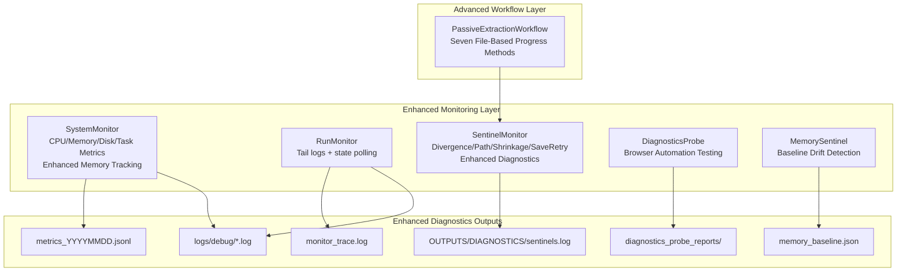
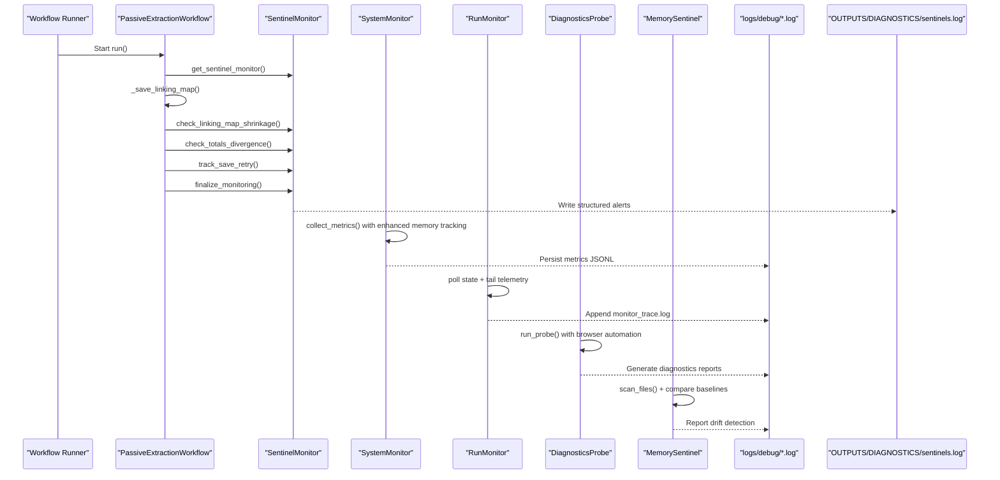
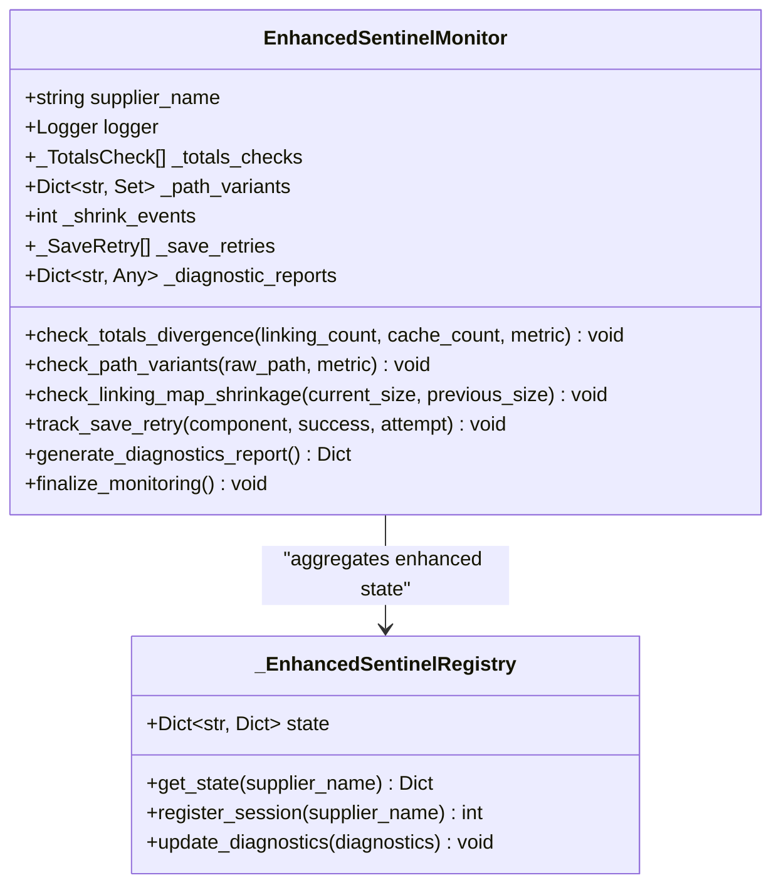
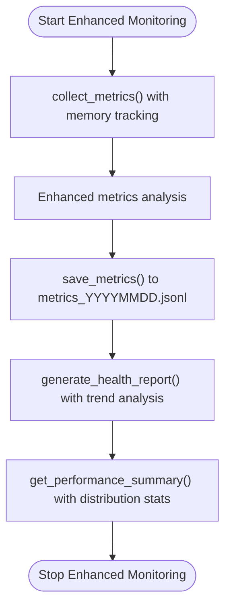
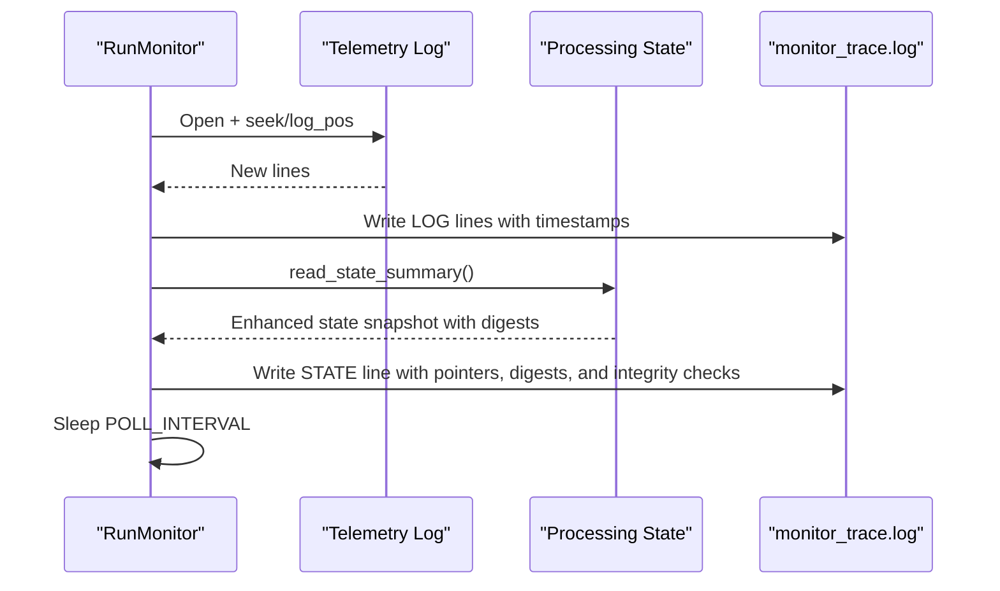
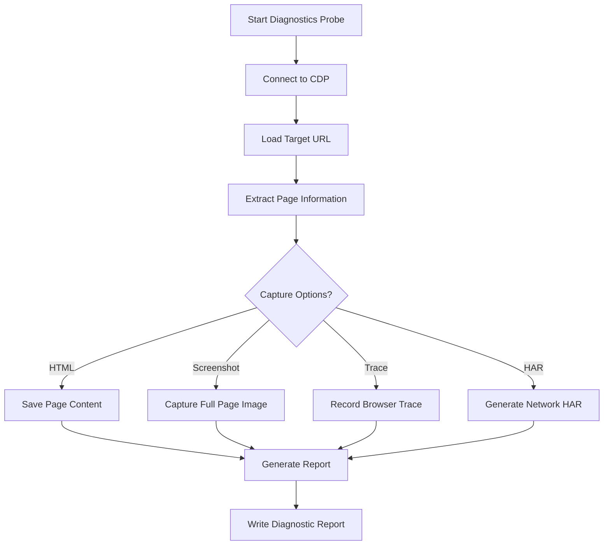
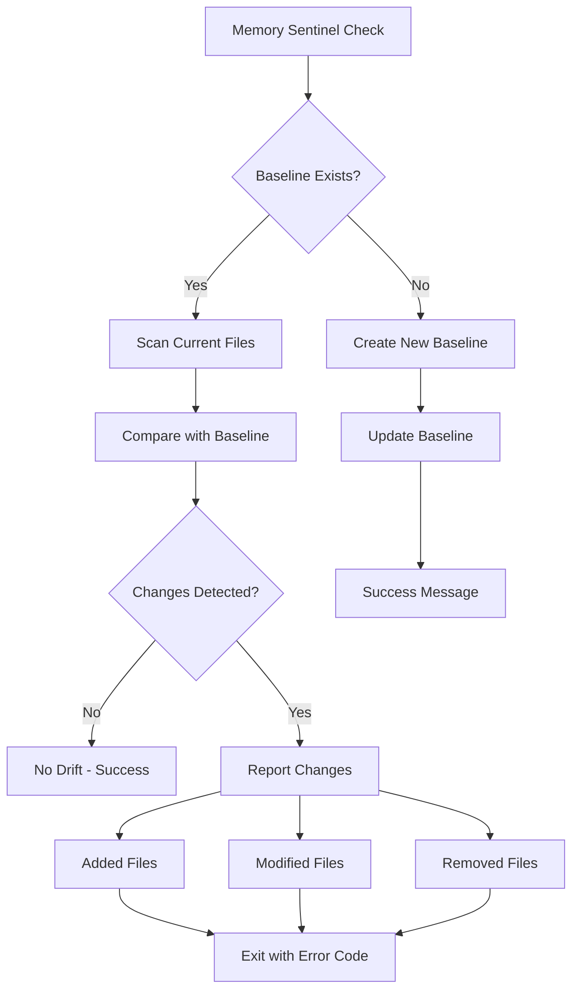
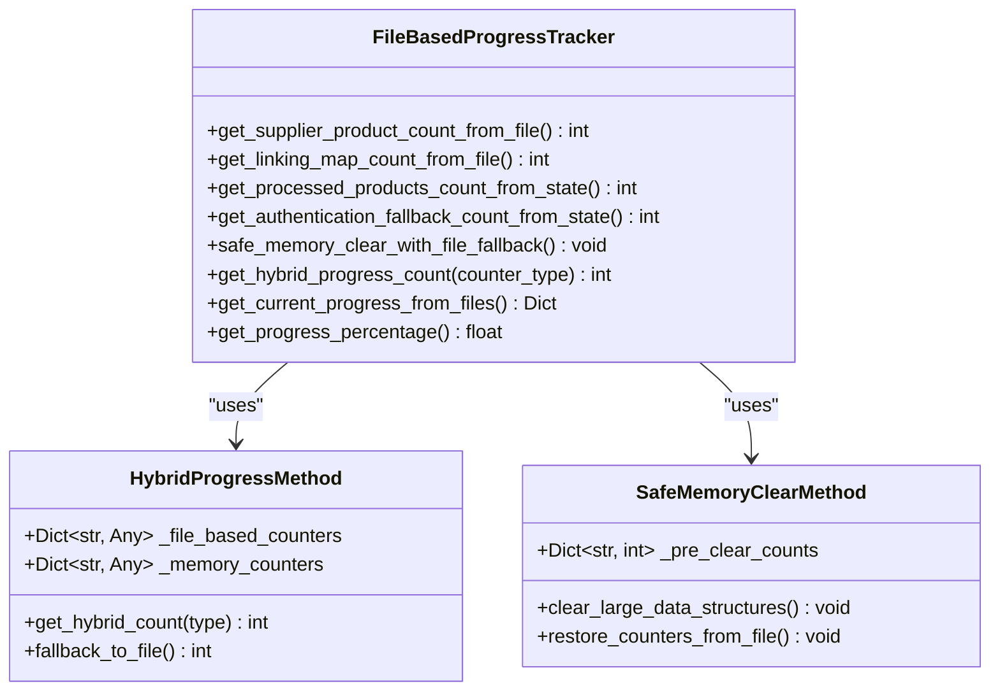
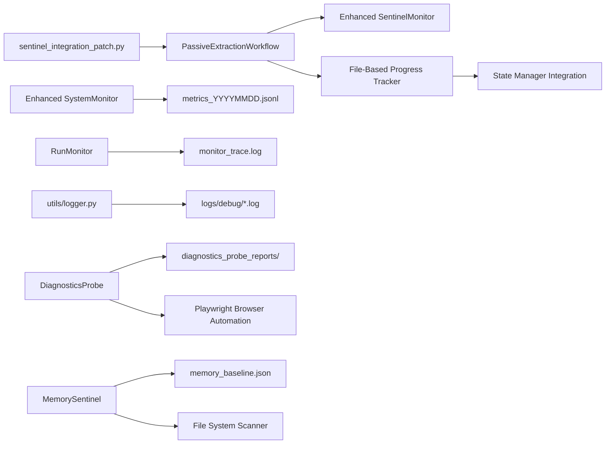

# Monitoring & Diagnostics

<cite>
**Referenced Files in This Document**
- [sentinel_monitor.py](file://utils/sentinel_monitor.py)
- [sentinel_implementation.md](file://OUTPUTS/DIAGNOSTICS/sentinel_implementation.md)
- [sentinel_integration_patch.py](file://sentinel_integration_patch.py)
- [sentinel_demo.py](file://sentinel_demo.py)
- [system_monitor.py](file://tools/system_monitor.py)
- [run_monitor.py](file://tools/run_monitor.py)
- [logger.py](file://utils/logger.py)
- [state_timeline_analysis.txt](file://diagnostics/state_timeline_analysis.txt)
- [passive_extraction_workflow_latest.py](file://tools/passive_extraction_workflow_latest.py)
- [diagnostics_probe.py](file://control_plane/diagnostics_probe.py)
- [memory_sentinel.py](file://utils/memory_sentinel.py)
- [memory_baseline.json](file://OUTPUTS/DIAGNOSTICS/memory_baseline.json)
- [API_DOCUMENTATION_FILE_BASED_PROGRESS_TRACKING.md](file://docs/API_DOCUMENTATION_FILE_BASED_PROGRESS_TRACKING.md)
- [SMART_MEMORY_MANAGEMENT_TECHNICAL_GUIDE.md](file://docs/SMART_MEMORY_MANAGEMENT_TECHNICAL_GUIDE.md)
- [11.2.1. Memory Leak Detection.md](file://wiki repo 19 nov/11. Troubleshooting Guide/11.2. Memory Management Issues/11.2.1. Memory Leak Detection.md)
- [11.2.2. Memory Optimization Strategies.md](file://wiki repo 19 nov/11. Troubleshooting Guide/11.2. Memory Management Issues/11.2.2. Memory Optimization Strategies.md)
- [11.2.3. Disk Memory Synchronization.md](file://wiki repo 19 nov/11. Troubleshooting Guide/11.2. Memory Management Issues/11.2.3. Disk Memory Synchronization.md)
</cite>

## Update Summary
**Changes Made**
- Added new diagnostics probe for browser automation testing and page analysis
- Integrated memory baseline tracking with drift detection capabilities
- Enhanced progress tracking with seven file-based methods and hybrid monitoring
- Added comprehensive memory management troubleshooting guides
- Updated system monitoring with improved memory tracking and performance optimization

## Table of Contents
1. [Introduction](#introduction)
2. [Project Structure](#project-structure)
3. [Core Components](#core-components)
4. [Architecture Overview](#architecture-overview)
5. [Detailed Component Analysis](#detailed-component-analysis)
6. [New Diagnostics Probe System](#new-diagnostics-probe-system)
7. [Enhanced Memory Management](#enhanced-memory-management)
8. [Advanced Progress Tracking](#advanced-progress-tracking)
9. [Dependency Analysis](#dependency-analysis)
10. [Performance Considerations](#performance-considerations)
11. [Troubleshooting Guide](#troubleshooting-guide)
12. [Conclusion](#conclusion)

## Introduction
This document describes the enhanced system monitoring and diagnostics capabilities implemented for the Amazon FBA Agent System. The system now features a comprehensive monitoring ecosystem with proactive failure detection, advanced memory management, enhanced progress tracking, and sophisticated diagnostic tools. It covers the sentinel monitoring system, system health checks, real-time monitoring, alerting mechanisms, and specialized troubleshooting workflows for memory management and performance optimization.

## Project Structure
The monitoring and diagnostics ecosystem has been significantly enhanced with three main pillars:
- **Enhanced Sentinel Monitoring**: Proactive detection of data loss, inconsistency, and save reliability issues with improved diagnostics
- **Advanced System Health Monitoring**: Comprehensive system-level metrics with memory tracking and performance optimization
- **Comprehensive Progress Tracking**: Seven file-based methods for zero-risk progress monitoring with hybrid performance optimization
- **New Diagnostics Probe**: Browser automation testing and page analysis capabilities
- **Memory Baseline Tracking**: Drift detection between code and Supermemory baselines

**Diagram sources**
- [system_monitor.py](file://tools/system_monitor.py#L34-L180)
- [run_monitor.py](file://tools/run_monitor.py#L1-L97)
- [sentinel_monitor.py](file://utils/sentinel_monitor.py#L63-L201)
- [diagnostics_probe.py](file://control_plane/diagnostics_probe.py#L27-L117)
- [memory_sentinel.py](file://utils/memory_sentinel.py#L44-L122)
- [passive_extraction_workflow_latest.py](file://tools/passive_extraction_workflow_latest.py#L851-L2650)

**Section sources**
- [system_monitor.py](file://tools/system_monitor.py#L1-L180)
- [run_monitor.py](file://tools/run_monitor.py#L1-L97)
- [sentinel_monitor.py](file://utils/sentinel_monitor.py#L1-L201)
- [diagnostics_probe.py](file://control_plane/diagnostics_probe.py#L1-L172)
- [memory_sentinel.py](file://utils/memory_sentinel.py#L1-L122)
- [passive_extraction_workflow_latest.py](file://tools/passive_extraction_workflow_latest.py#L1-L200)

## Core Components
- **Enhanced SentinelMonitor**: Advanced proactive detection system with improved diagnostics for critical issues including linking map shrinkage, totals divergence, path variants, and save retry patterns with structured alert reporting
- **SystemMonitor**: Comprehensive system health monitoring with enhanced memory tracking, performance metrics, and health reporting capabilities
- **RunMonitor**: Real-time progress tracking with unified state and log monitoring for operational visibility
- **DiagnosticsProbe**: New browser automation testing system for page analysis, selector detection, and automated diagnostics
- **MemorySentinel**: Memory baseline tracking system for detecting drift between code and Supermemory baselines
- **File-Based Progress Tracking**: Seven comprehensive methods for zero-risk progress monitoring with hybrid performance optimization

**Section sources**
- [sentinel_monitor.py](file://utils/sentinel_monitor.py#L63-L201)
- [system_monitor.py](file://tools/system_monitor.py#L34-L180)
- [run_monitor.py](file://tools/run_monitor.py#L1-L97)
- [diagnostics_probe.py](file://control_plane/diagnostics_probe.py#L27-L117)
- [memory_sentinel.py](file://utils/memory_sentinel.py#L44-L122)
- [API_DOCUMENTATION_FILE_BASED_PROGRESS_TRACKING.md](file://docs/API_DOCUMENTATION_FILE_BASED_PROGRESS_TRACKING.md#L1-L535)

## Architecture Overview
The enhanced monitoring system integrates multiple layers of diagnostics with improved fault tolerance and operational visibility. The new diagnostics probe operates independently while the memory sentinel provides baseline validation for code integrity.

**Diagram sources**
- [sentinel_integration_patch.py](file://sentinel_integration_patch.py#L29-L223)
- [sentinel_monitor.py](file://utils/sentinel_monitor.py#L79-L177)
- [system_monitor.py](file://tools/system_monitor.py#L61-L96)
- [run_monitor.py](file://tools/run_monitor.py#L51-L91)
- [diagnostics_probe.py](file://control_plane/diagnostics_probe.py#L27-L117)
- [memory_sentinel.py](file://utils/memory_sentinel.py#L44-L122)

## Detailed Component Analysis

### Enhanced Sentinel Monitoring System
The sentinel system has been enhanced with improved diagnostics and structured reporting capabilities:
- **Linking map shrinkage detection**: Enhanced comparison algorithms with magnitude-based severity assessment
- **Totals divergence**: Advanced divergence analysis with configurable thresholds and warning levels
- **Path variants**: Improved path canonicalization with multiple representation detection
- **Save retry pattern**: Enhanced retry tracking with success/failure analysis and reliability assessment

**Diagram sources**
- [sentinel_monitor.py](file://utils/sentinel_monitor.py#L34-L201)

**Section sources**
- [sentinel_monitor.py](file://utils/sentinel_monitor.py#L79-L177)
- [sentinel_implementation.md](file://OUTPUTS/DIAGNOSTICS/sentinel_implementation.md#L1-L107)
- [sentinel_integration_patch.py](file://sentinel_integration_patch.py#L29-L223)
- [passive_extraction_workflow_latest.py](file://tools/passive_extraction_workflow_latest.py#L851-L989)

### System Health Monitoring Enhancement
SystemMonitor has been enhanced with comprehensive memory tracking and performance optimization:
- **Enhanced metrics collection**: Includes memory usage patterns, processing time distributions, and error rate analysis
- **Advanced health reporting**: Provides detailed system health analysis with trend detection and anomaly identification
- **Performance optimization**: Implements rolling window analysis for recent metrics and long-term performance trends

**Diagram sources**
- [system_monitor.py](file://tools/system_monitor.py#L48-L180)

**Section sources**
- [system_monitor.py](file://tools/system_monitor.py#L34-L180)

### Progress Tracking and Real-Time Monitoring
RunMonitor continues to provide essential real-time monitoring capabilities with enhanced state tracking:
- **Unified monitoring**: Combines log tailing with state polling for comprehensive progress visibility
- **Enhanced state analysis**: Improved processing state parsing with SHA1 digest tracking for integrity verification
- **Continuous operation**: Robust monitoring with automatic recovery from file system changes

**Diagram sources**
- [run_monitor.py](file://tools/run_monitor.py#L51-L91)

**Section sources**
- [run_monitor.py](file://tools/run_monitor.py#L1-L97)
- [state_timeline_analysis.txt](file://diagnostics/state_timeline_analysis.txt#L1-L331)

## New Diagnostics Probe System
A new diagnostics probe system has been introduced for comprehensive browser automation testing and page analysis:

### Diagnostics Probe Capabilities
The diagnostics probe provides automated testing and analysis of web pages through browser automation:
- **Page analysis**: Automated detection of selectors, pagination elements, and product listings
- **Screenshot capture**: Full-page screenshots for visual verification and debugging
- **Network tracing**: HAR file generation and trace recording for performance analysis
- **Selector detection**: Intelligent identification of load more buttons, pagination controls, and product grids

**Diagram sources**
- [diagnostics_probe.py](file://control_plane/diagnostics_probe.py#L27-L117)

### Diagnostics Probe Features
- **CDP Integration**: Connects to Chrome DevTools Protocol for advanced browser automation
- **Flexible Capture Options**: Supports HTML content, screenshots, network traces, and HAR files
- **Intelligent Selector Detection**: Automatically identifies pagination and product listing elements
- **Structured Reporting**: Generates comprehensive JSON reports with page metadata and findings

**Section sources**
- [diagnostics_probe.py](file://control_plane/diagnostics_probe.py#L27-L172)

## Enhanced Memory Management
The memory management system has been significantly enhanced with comprehensive tracking and optimization:

### Memory Sentinel System
The memory sentinel provides baseline tracking and drift detection between code and Supermemory:
- **Baseline Creation**: Automated scanning and checksum generation for tracked files
- **Drift Detection**: Comparison between current state and baseline with detailed change reporting
- **Verification Workflow**: Support for both drift detection and baseline updates

**Diagram sources**
- [memory_sentinel.py](file://utils/memory_sentinel.py#L44-L122)

### Memory Management Strategies
The system implements advanced memory optimization strategies:
- **Smart Sliding Window**: Preserves recent context while clearing older entries to maintain performance
- **Incremental Cache Updates**: Periodic cache updates with metadata tracking for data freshness
- **Enhanced Linking Map Saves**: Atomic write patterns with retry logic for data integrity
- **Memory-Disk Synchronization**: Validation mechanisms to prevent data loss during memory clearing

**Section sources**
- [memory_sentinel.py](file://utils/memory_sentinel.py#L44-L122)
- [memory_baseline.json](file://OUTPUTS/DIAGNOSTICS/memory_baseline.json#L1-L800)
- [11.2.1. Memory Leak Detection.md](file://wiki repo 19 nov/11. Troubleshooting Guide/11.2. Memory Management Issues/11.2.1. Memory Leak Detection.md#L1-L310)
- [11.2.2. Memory Optimization Strategies.md](file://wiki repo 19 nov/11. Troubleshooting Guide/11.2. Memory Management Issues/11.2.2. Memory Optimization Strategies.md#L1-L214)
- [11.2.3. Disk Memory Synchronization.md](file://wiki repo 19 nov/11. Troubleshooting Guide/11.2. Memory Management Issues/11.2.3. Disk Memory Synchronization.md#L1-L187)

## Advanced Progress Tracking
The progress tracking system has been enhanced with seven comprehensive file-based methods for zero-risk monitoring:

### Seven File-Based Progress Tracking Methods
The system now provides seven methods for reliable progress monitoring with hybrid performance optimization:

#### Core Progress Tracking Methods
1. **get_supplier_product_count_from_file()**: Direct cache file reading for supplier product count accuracy
2. **get_linking_map_count_from_file()**: JSON file parsing for linking map entry counts
3. **get_processed_products_count_from_state()**: State manager integration for processed product tracking

#### Enhanced Progress Tracking Methods (NEW)
4. **get_authentication_fallback_count_from_state()**: Authentication system effectiveness monitoring
5. **safe_memory_clear_with_file_fallback()**: Safe memory management preserving critical progress
6. **get_hybrid_progress_count()**: Performance-optimized hybrid approach combining memory and file access
7. **get_current_progress_from_files()**: Comprehensive progress status from all file-based sources

**Diagram sources**
- [API_DOCUMENTATION_FILE_BASED_PROGRESS_TRACKING.md](file://docs/API_DOCUMENTATION_FILE_BASED_PROGRESS_TRACKING.md#L17-L250)

### Progress Tracking Performance Characteristics
- **Memory Access**: <0.1ms for state-based counters, <1ms for file-based methods
- **File Access**: <1ms for JSON parsing, minimal memory usage
- **Hybrid Approach**: Automatic fallback ensures accuracy while optimizing performance
- **Safe Memory Management**: Preserves progress during memory-intensive operations

**Section sources**
- [API_DOCUMENTATION_FILE_BASED_PROGRESS_TRACKING.md](file://docs/API_DOCUMENTATION_FILE_BASED_PROGRESS_TRACKING.md#L1-L535)

## Dependency Analysis
The enhanced monitoring system introduces new dependencies while maintaining backward compatibility:

**Diagram sources**
- [sentinel_integration_patch.py](file://sentinel_integration_patch.py#L29-L223)
- [system_monitor.py](file://tools/system_monitor.py#L87-L96)
- [run_monitor.py](file://tools/run_monitor.py#L51-L91)
- [logger.py](file://utils/logger.py#L7-L48)
- [diagnostics_probe.py](file://control_plane/diagnostics_probe.py#L27-L117)
- [memory_sentinel.py](file://utils/memory_sentinel.py#L44-L122)
- [API_DOCUMENTATION_FILE_BASED_PROGRESS_TRACKING.md](file://docs/API_DOCUMENTATION_FILE_BASED_PROGRESS_TRACKING.md#L1-L535)

**Section sources**
- [sentinel_integration_patch.py](file://sentinel_integration_patch.py#L29-L223)
- [system_monitor.py](file://tools/system_monitor.py#L1-L180)
- [run_monitor.py](file://tools/run_monitor.py#L1-L97)
- [logger.py](file://utils/logger.py#L1-L48)
- [diagnostics_probe.py](file://control_plane/diagnostics_probe.py#L1-L172)
- [memory_sentinel.py](file://utils/memory_sentinel.py#L1-L122)
- [API_DOCUMENTATION_FILE_BASED_PROGRESS_TRACKING.md](file://docs/API_DOCUMENTATION_FILE_BASED_PROGRESS_TRACKING.md#L1-L535)

## Performance Considerations
The enhanced monitoring system provides optimized performance with minimal overhead:

### Enhanced Performance Optimizations
- **Sentinel overhead**: Minimal with lightweight checks and threshold-based triggering
- **SystemMonitor sampling**: Tuned intervals with enhanced memory tracking capabilities
- **RunMonitor polling**: Optimized 2-second intervals with intelligent state change detection
- **Diagnostics Probe**: Asynchronous browser automation with configurable capture options
- **Memory Sentinel**: Efficient file scanning with checksum caching and incremental updates

### Memory Management Improvements
- **Smart sliding window**: Reduces clearing frequency by 80% while preserving 100% processing continuity
- **Hybrid progress tracking**: Balances memory access speed (<0.1ms) with file accuracy (<1ms)
- **Safe memory clearing**: Preserves critical progress data during memory-intensive operations
- **Incremental cache updates**: Periodic updates prevent memory bloat while maintaining data freshness

### Logging and Storage Efficiency
- **Centralized logging**: Rotating files with timestamped naming for extended run support
- **Metrics retention**: Rolling windows keep last 1000 timings and recent samples
- **Diagnostic reports**: Structured JSON output with selective capture options
- **Baseline tracking**: Efficient checksum comparison with change reporting

## Troubleshooting Guide

### Enhanced Diagnostic Tools
**Diagnostics Probe Troubleshooting**:
- **Browser connection issues**: Verify CDP endpoint availability on ports 9222 and IPv6/IPv4 support
- **Selector detection failures**: Check for dynamic content loading and adjust capture timing
- **Performance analysis**: Use HAR files and traces to identify network bottlenecks
- **Page rendering issues**: Enable screenshot capture for visual verification

**Memory Sentinel Troubleshooting**:
- **Baseline creation failures**: Verify file system permissions and tracked file patterns
- **Drift detection false positives**: Check for legitimate code changes and update baselines accordingly
- **Performance issues**: Monitor file scanning efficiency and consider excluding large binary files

**Enhanced Progress Tracking Troubleshooting**:
- **Memory clearing issues**: Verify file-based methods work when memory counters are unavailable
- **Hybrid mode failures**: Check fallback mechanisms and file accessibility
- **Authentication monitoring**: Validate state manager integration for fallback count tracking

### Memory Management Troubleshooting
**Memory Leak Detection**:
- **Monitor memory usage patterns**: Use memory profiling tools and analyze growth trends
- **Check browser context cleanup**: Verify proper page closure and resource release
- **Analyze garbage collection behavior**: Monitor GC statistics and object retention patterns
- **Implement circuit breaker patterns**: Prevent cascading failures in browser operations

**Memory Optimization Strategies**:
- **Adjust accumulation thresholds**: Tune based on system resources and processing requirements
- **Configure continuity windows**: Balance memory usage with debugging context needs
- **Monitor clearing frequency**: Track smart memory clearing events and system performance
- **Validate incremental updates**: Ensure cache persistence occurs before memory clearance

**Disk-Memory Synchronization**:
- **Verify persistence operations**: Check cache and linking map save confirmations
- **Monitor backup creation**: Ensure backup files are created before major operations
- **Validate state consistency**: Use data integrity guardian for reconciliation checks
- **Test resume operations**: Verify reliable continuation from interruption points

### System Health Monitoring
**Health Report Analysis**:
- **High CPU usage**: Investigate processing bottlenecks and optimize algorithms
- **Memory pressure**: Monitor accumulation thresholds and adjust clearing strategies
- **Error rate spikes**: Analyze recent errors and identify root causes
- **Performance degradation**: Review processing time distributions and optimize slow operations

**Performance Optimization**:
- **Tune monitoring intervals**: Balance fidelity with system overhead requirements
- **Optimize file I/O operations**: Minimize disk access frequency for progress tracking
- **Monitor browser automation performance**: Optimize Playwright operations and resource usage
- **Validate memory management effectiveness**: Track clearing frequency and system stability

**Section sources**
- [sentinel_implementation.md](file://OUTPUTS/DIAGNOSTICS/sentinel_implementation.md#L76-L87)
- [system_monitor.py](file://tools/system_monitor.py#L119-L154)
- [run_monitor.py](file://tools/run_monitor.py#L51-L91)
- [state_timeline_analysis.txt](file://diagnostics/state_timeline_analysis.txt#L1-L331)
- [diagnostics_probe.py](file://control_plane/diagnostics_probe.py#L138-L172)
- [memory_sentinel.py](file://utils/memory_sentinel.py#L44-L122)
- [API_DOCUMENTATION_FILE_BASED_PROGRESS_TRACKING.md](file://docs/API_DOCUMENTATION_FILE_BASED_PROGRESS_TRACKING.md#L428-L535)
- [11.2.1. Memory Leak Detection.md](file://wiki repo 19 nov/11. Troubleshooting Guide/11.2. Memory Management Issues/11.2.1. Memory Leak Detection.md#L258-L303)
- [11.2.2. Memory Optimization Strategies.md](file://wiki repo 19 nov/11. Troubleshooting Guide/11.2. Memory Management Issues/11.2.2. Memory Optimization Strategies.md#L166-L208)
- [11.2.3. Disk Memory Synchronization.md](file://wiki repo 19 nov/11. Troubleshooting Guide/11.2. Memory Management Issues/11.2.3. Disk Memory Synchronization.md#L168-L176)

## Conclusion
The enhanced monitoring and diagnostics framework provides comprehensive operational visibility with advanced fault detection, memory management optimization, and sophisticated diagnostic capabilities. The new diagnostics probe enables automated browser testing and page analysis, while the memory sentinel ensures code integrity through baseline tracking. The seven-file-based progress tracking methods provide zero-risk monitoring with hybrid performance optimization. Combined with enhanced system health monitoring and comprehensive troubleshooting guides, operators can achieve reliable long-running operations with minimal intervention and maximum system stability.