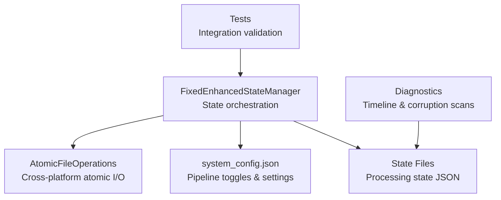
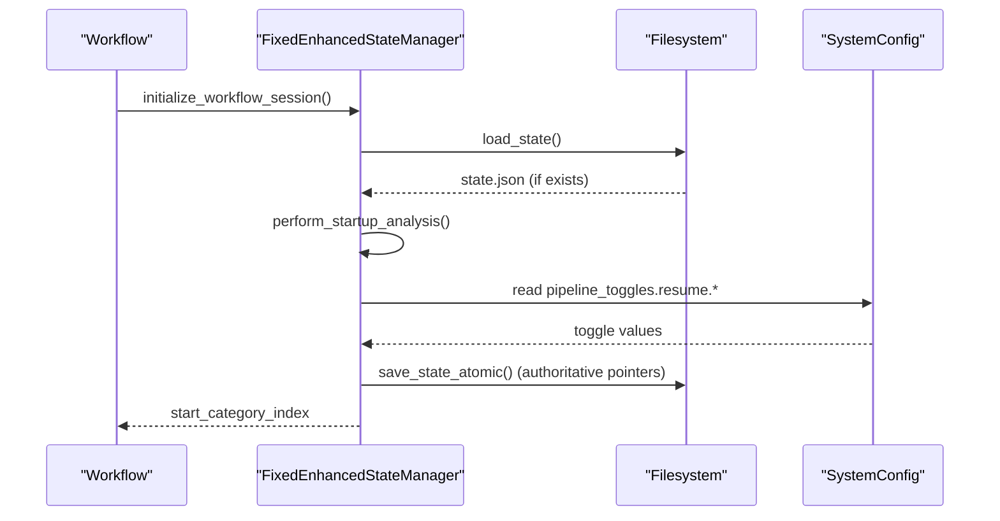
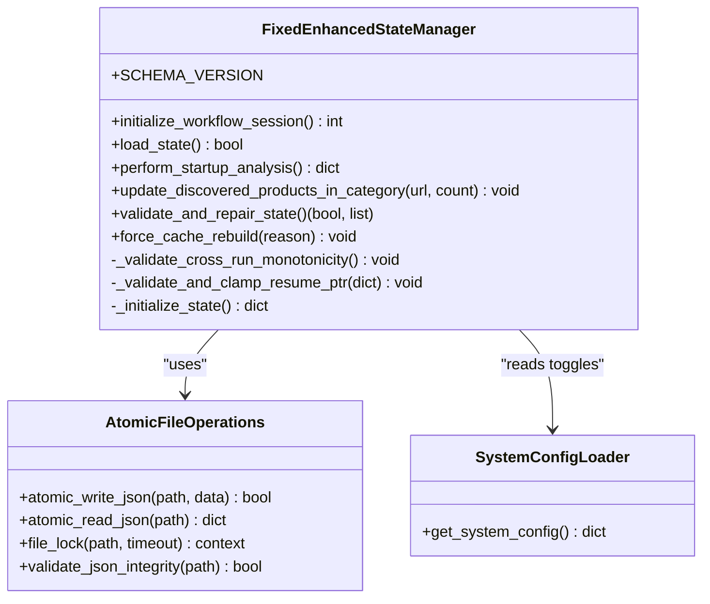
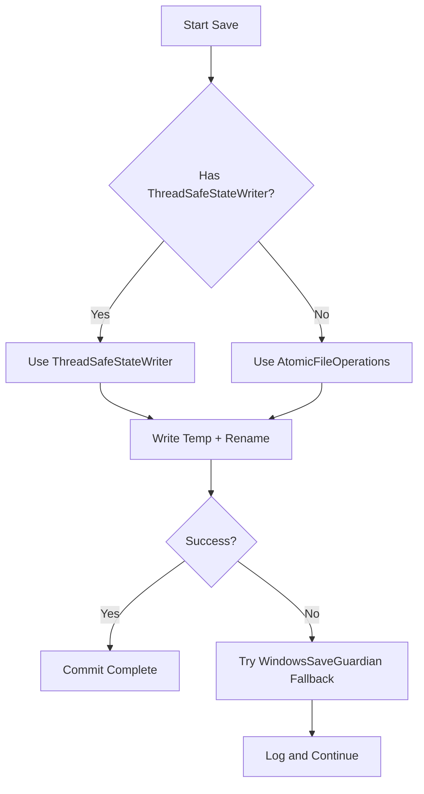
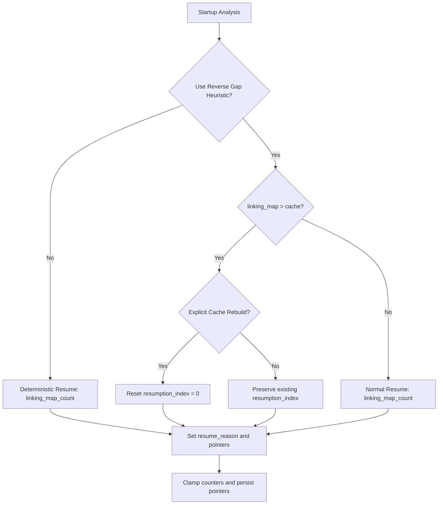
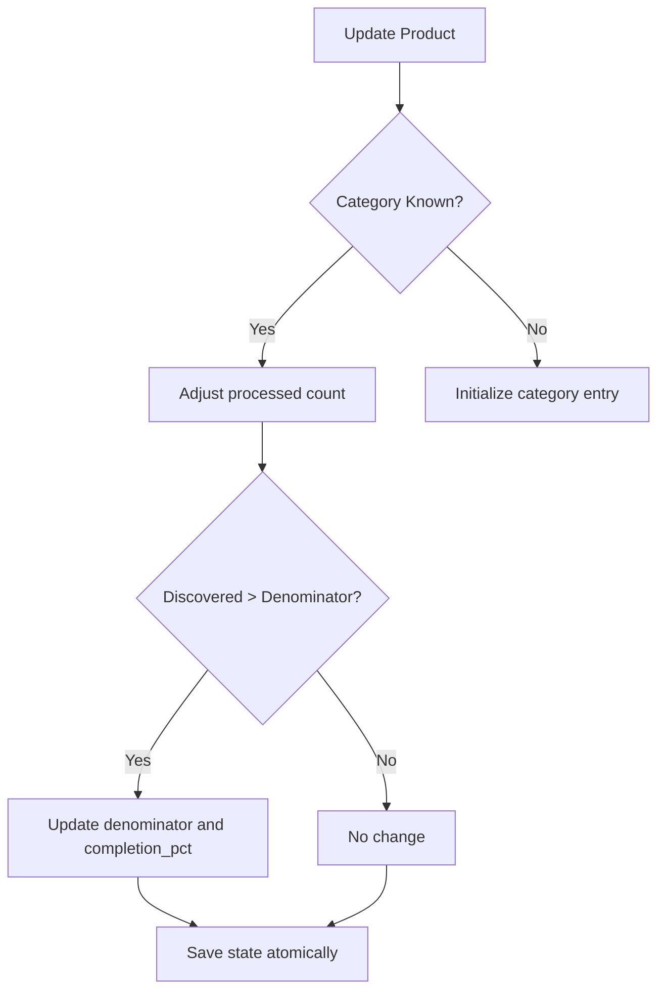
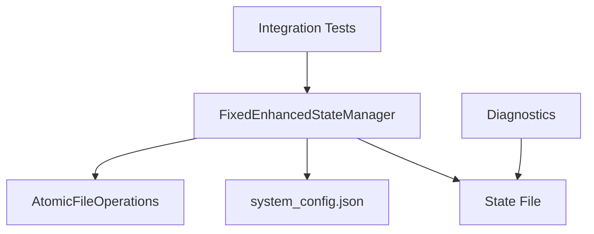

# Progress Tracking

<cite>
**Referenced Files in This Document**
- [fixed_enhanced_state_manager.py](file://utils/fixed_enhanced_state_manager.py)
- [atomic_file_operations.py](file://utils/atomic_file_operations.py)
- [system_config.json](file://config/system_config.json)
- [poundwholesale_co_uk_processing_state.json](file://OUTPUTS/CACHE/poundwholesale_co_uk_processing_state.json)
- [enhanced_category_tracking.json](file://LLM_ANALYSIS_PACKAGE/state_files/enhanced_category_tracking.json)
- [state_timeline_analysis.txt](file://diagnostics/state_timeline_analysis.txt)
- [quick_corruption_scan.py](file://diagnostics_output/quick_corruption_scan.py)
- [test_processing_state_tracking.py](file://testing/integration_fixes/test_processing_state_tracking.py)
- [git_checkpoint.py](file://tools/git_checkpoint.py)
- [state.py](file://control_plane/tools/state.py)
</cite>

## Table of Contents
1. [Introduction](#introduction)
2. [Project Structure](#project-structure)
3. [Core Components](#core-components)
4. [Architecture Overview](#architecture-overview)
5. [Detailed Component Analysis](#detailed-component-analysis)
6. [Dependency Analysis](#dependency-analysis)
7. [Performance Considerations](#performance-considerations)
8. [Troubleshooting Guide](#troubleshooting-guide)
9. [Conclusion](#conclusion)
10. [Appendices](#appendices)

## Introduction
This document explains the progress tracking and state management systems that power reliable, resumable processing workflows. It focuses on the enhanced state manager implementation, processing state persistence, and resume capability mechanisms. It documents state file formats, tracking metrics, recovery procedures, configuration options, and relationships with caching systems. Practical examples demonstrate state inspection, progress analysis, and resumption workflows, along with troubleshooting guidance for state corruption and performance best practices.

## Project Structure
The progress tracking system centers around a robust state manager with atomic persistence, configuration-driven behavior, and diagnostic tooling. Key areas:
- State manager implementation and atomic file operations
- System configuration controlling resume behavior and persistence
- State files produced during processing
- Diagnostic logs and scans for progress timelines and corruption detection
- Tests validating state tracking behavior

**Diagram sources**
- [fixed_enhanced_state_manager.py](file://utils/fixed_enhanced_state_manager.py#L86-L138)
- [atomic_file_operations.py](file://utils/atomic_file_operations.py#L17-L154)
- [system_config.json](file://config/system_config.json#L1-L384)
- [poundwholesale_co_uk_processing_state.json](file://OUTPUTS/CACHE/poundwholesale_co_uk_processing_state.json#L1-L120)
- [state_timeline_analysis.txt](file://diagnostics/state_timeline_analysis.txt#L1-L331)
- [quick_corruption_scan.py](file://diagnostics_output/quick_corruption_scan.py#L1-L159)
- [test_processing_state_tracking.py](file://testing/integration_fixes/test_processing_state_tracking.py#L1-L50)

**Section sources**
- [fixed_enhanced_state_manager.py](file://utils/fixed_enhanced_state_manager.py#L86-L138)
- [atomic_file_operations.py](file://utils/atomic_file_operations.py#L17-L154)
- [system_config.json](file://config/system_config.json#L1-L384)
- [poundwholesale_co_uk_processing_state.json](file://OUTPUTS/CACHE/poundwholesale_co_uk_processing_state.json#L1-L120)
- [state_timeline_analysis.txt](file://diagnostics/state_timeline_analysis.txt#L1-L331)
- [quick_corruption_scan.py](file://diagnostics_output/quick_corruption_scan.py#L1-L159)
- [test_processing_state_tracking.py](file://testing/integration_fixes/test_processing_state_tracking.py#L1-L50)

## Core Components
- FixedEnhancedStateManager: Orchestrates loading, validating, and persisting processing state; separates resumption pointers from progress tracking; performs startup analysis; enforces monotonicity and cross-run high-water marks; integrates with configuration toggles.
- AtomicFileOperations: Provides cross-platform file locking and atomic JSON write/read operations to prevent corruption and race conditions.
- System configuration: Controls resume behavior, frozen denominators, progress display, and state persistence intervals.
- State files: Persisted JSON artifacts containing schema version, timing, counters, progress, and category completion status.
- Diagnostics: Timeline logs and corruption scanners assist in progress analysis and detecting file integrity issues.
- Tests: Validate phase separation, category progression, and real-time denominator updates.

**Section sources**
- [fixed_enhanced_state_manager.py](file://utils/fixed_enhanced_state_manager.py#L86-L138)
- [atomic_file_operations.py](file://utils/atomic_file_operations.py#L17-L154)
- [system_config.json](file://config/system_config.json#L78-L93)
- [poundwholesale_co_uk_processing_state.json](file://OUTPUTS/CACHE/poundwholesale_co_uk_processing_state.json#L1-L120)
- [state_timeline_analysis.txt](file://diagnostics/state_timeline_analysis.txt#L1-L331)
- [test_processing_state_tracking.py](file://testing/integration_fixes/test_processing_state_tracking.py#L1-L50)

## Architecture Overview
The system implements a two-phase initialization pattern: load-and-analyze followed by authoritative resume selection. Atomic file operations ensure safe concurrent access. Configuration toggles govern resume heuristics and persistence behavior.

**Diagram sources**
- [fixed_enhanced_state_manager.py](file://utils/fixed_enhanced_state_manager.py#L247-L283)
- [fixed_enhanced_state_manager.py](file://utils/fixed_enhanced_state_manager.py#L469-L645)
- [system_config.json](file://config/system_config.json#L4-L10)

**Section sources**
- [fixed_enhanced_state_manager.py](file://utils/fixed_enhanced_state_manager.py#L247-L283)
- [fixed_enhanced_state_manager.py](file://utils/fixed_enhanced_state_manager.py#L469-L645)
- [system_config.json](file://config/system_config.json#L4-L10)

## Detailed Component Analysis

### FixedEnhancedStateManager
- Responsibilities:
  - Initialize state structure with schema version and metadata
  - Load and migrate legacy state formats
  - Validate cross-run monotonicity and clamp progress
  - Perform startup analysis to determine resume strategy
  - Separate resumption pointer from progress tracking
  - Update category totals with real-time discoveries
  - Enforce thread-safe atomic writes with file locking
- Key behaviors:
  - Authoritative start position determined by persistent category index and session cursor
  - Reverse gap detection policy controlled by configuration toggle
  - Cross-run high-water mark validation prevents regressions
  - Real-time category denominator updates supported

**Diagram sources**
- [fixed_enhanced_state_manager.py](file://utils/fixed_enhanced_state_manager.py#L86-L138)
- [atomic_file_operations.py](file://utils/atomic_file_operations.py#L17-L154)

**Section sources**
- [fixed_enhanced_state_manager.py](file://utils/fixed_enhanced_state_manager.py#L86-L138)
- [fixed_enhanced_state_manager.py](file://utils/fixed_enhanced_state_manager.py#L247-L283)
- [fixed_enhanced_state_manager.py](file://utils/fixed_enhanced_state_manager.py#L469-L645)
- [atomic_file_operations.py](file://utils/atomic_file_operations.py#L17-L154)

### Atomic Persistence and Concurrency Control
- Cross-platform file locking prevents simultaneous writes
- Atomic JSON write uses temporary files and atomic rename
- Validates JSON integrity and supports safe backup creation
- Provides fallbacks for environments without native atomic operations

**Diagram sources**
- [atomic_file_operations.py](file://utils/atomic_file_operations.py#L58-L93)
- [fixed_enhanced_state_manager.py](file://utils/fixed_enhanced_state_manager.py#L121-L124)

**Section sources**
- [atomic_file_operations.py](file://utils/atomic_file_operations.py#L58-L93)
- [atomic_file_operations.py](file://utils/atomic_file_operations.py#L128-L151)
- [fixed_enhanced_state_manager.py](file://utils/fixed_enhanced_state_manager.py#L121-L124)

### State File Format and Fields
State files are JSON documents with the following structure and semantics:
- Schema and metadata: schema_version, created_at, last_updated, supplier_name, metadata.version, metadata.thread_safety, metadata.atomic_operations
- Progress and counters: resumption_index, progress_index, total_products, successful_products, processing_status, is_fresh_start
- System progression: system_progression.current_phase, persistent_category_index, current_category_url, total_categories, supplier_products_* and amazon_products_* counters
- Gap processing: gap_processing.phase, gap_products_total, gap_products_processed, reverse_gap_detected, startup_analysis_completed
- User display metrics: user_display_metrics.total_products, successful_products, progress_count, session_products_processed
- Category completion: gap_processing.category_completion_status[url] with extracted, processed, completion_pct, status
- Frozen denominators: frozen_category_denominators

Example fields visible in a typical state file:
- Fields include schema_version, created_at, last_updated, supplier_name, resumption_index, total_products, successful_products, processing_status, is_fresh_start, system_progression, gap_processing, user_display_metrics, category_completion_status, metadata.

**Section sources**
- [poundwholesale_co_uk_processing_state.json](file://OUTPUTS/CACHE/poundwholesale_co_uk_processing_state.json#L1-L120)
- [poundwholesale_co_uk_processing_state.json](file://OUTPUTS/CACHE/poundwholesale_co_uk_processing_state.json#L42-L800)

### Resume Capability Mechanisms
- Deterministic resume: when reverse gap heuristic disabled, resume uses linking_map-derived counts as authoritative resume index
- Reverse gap detection: when linking_map exceeds cache, system decides whether to reset or preserve resume index based on explicit cache rebuild flag and current resumption_index
- Startup gating: pointer fields are only persisted after startup analysis completes
- Cross-run monotonicity: validates that progress never decreases across runs using a high-water mark
- Clamping: clamps completed counters to denominators to prevent invalid states

**Diagram sources**
- [fixed_enhanced_state_manager.py](file://utils/fixed_enhanced_state_manager.py#L524-L598)
- [fixed_enhanced_state_manager.py](file://utils/fixed_enhanced_state_manager.py#L419-L467)
- [fixed_enhanced_state_manager.py](file://utils/fixed_enhanced_state_manager.py#L610-L645)

**Section sources**
- [fixed_enhanced_state_manager.py](file://utils/fixed_enhanced_state_manager.py#L524-L598)
- [fixed_enhanced_state_manager.py](file://utils/fixed_enhanced_state_manager.py#L419-L467)
- [fixed_enhanced_state_manager.py](file://utils/fixed_enhanced_state_manager.py#L610-L645)

### Tracking Metrics and Progress Analysis
- System progression counters: supplier_products_needing_extraction, supplier_products_completed, amazon_products_needing_analysis, amazon_products_completed
- Category-level completion: category_completion_status[url] with extracted, processed, completion_pct, status
- User display metrics: progress_count, session_products_processed
- Real-time updates: update_discovered_products_in_category adjusts category totals and recalculates completion percentages
- Validation: validate_and_repair_state aligns counters and repairs inconsistencies

**Diagram sources**
- [fixed_enhanced_state_manager.py](file://utils/fixed_enhanced_state_manager.py#L737-L787)

**Section sources**
- [fixed_enhanced_state_manager.py](file://utils/fixed_enhanced_state_manager.py#L737-L787)
- [test_processing_state_tracking.py](file://testing/integration_fixes/test_processing_state_tracking.py#L6-L27)

### Configuration Options for State Persistence and Recovery
Key configuration controls affecting state persistence and resume behavior:
- Pipeline toggles:
  - resume.use_reverse_gap_heuristic: enable/disable reverse gap heuristic
  - resume_abs_index_math, frozen_category_denominator, invariant_warn_on_resume: influence resume math and denominator handling
- Supplier extraction progress:
  - recovery_mode: product_resume
  - state_persistence.save_on_category_completion, save_on_product_batch, batch_save_frequency
  - progress_display.show_subcategory_progress, show_product_progress, update_frequency_products
- Hybrid processing:
  - process_existing_gap_first, chunked mode, memory management settings
- Monitoring:
  - metrics_interval, health_check_interval

These settings govern when and how state is saved, how progress is displayed, and how recovery decisions are made.

**Section sources**
- [system_config.json](file://config/system_config.json#L4-L10)
- [system_config.json](file://config/system_config.json#L78-L93)
- [system_config.json](file://config/system_config.json#L94-L127)
- [system_config.json](file://config/system_config.json#L176-L186)

### Examples: State Inspection, Progress Analysis, Resumption Workflows
- Inspecting state:
  - Load and parse the state file; examine system_progression, gap_processing, and user_display_metrics
  - Example path: [poundwholesale_co_uk_processing_state.json](file://OUTPUTS/CACHE/poundwholesale_co_uk_processing_state.json#L1-L120)
- Progress analysis:
  - Use timeline logs to track resumption_index and last_processed_index changes over time
  - Example path: [state_timeline_analysis.txt](file://diagnostics/state_timeline_analysis.txt#L1-L331)
- Resumption workflow:
  - Call initialize_workflow_session to load state, perform startup analysis, and receive the authoritative start category index
  - Example path: [fixed_enhanced_state_manager.py](file://utils/fixed_enhanced_state_manager.py#L247-L283)
- Validation and tests:
  - Integration tests validate phase separation and category progression
  - Example path: [test_processing_state_tracking.py](file://testing/integration_fixes/test_processing_state_tracking.py#L1-L50)

**Section sources**
- [poundwholesale_co_uk_processing_state.json](file://OUTPUTS/CACHE/poundwholesale_co_uk_processing_state.json#L1-L120)
- [state_timeline_analysis.txt](file://diagnostics/state_timeline_analysis.txt#L1-L331)
- [fixed_enhanced_state_manager.py](file://utils/fixed_enhanced_state_manager.py#L247-L283)
- [test_processing_state_tracking.py](file://testing/integration_fixes/test_processing_state_tracking.py#L1-L50)

### Relationship with Caching Systems
- Linking map as single source of truth: startup analysis reconciles counters using linking_map counts
- Category completion status reflects cache-backed progress per URL
- Frozen category denominators support stable denominator handling across runs
- Supplier cache control toggles integrity verification and backup behavior
- Hybrid processing memory management includes file-based counting and safe clearing

**Section sources**
- [fixed_enhanced_state_manager.py](file://utils/fixed_enhanced_state_manager.py#L483-L523)
- [system_config.json](file://config/system_config.json#L62-L77)
- [system_config.json](file://config/system_config.json#L94-L127)
- [enhanced_category_tracking.json](file://LLM_ANALYSIS_PACKAGE/state_files/enhanced_category_tracking.json#L1-L131)

## Dependency Analysis
The state manager depends on atomic file operations for safe persistence and system configuration for behavior toggles. Tests validate expected behavior, while diagnostics provide external signals for progress and integrity.

**Diagram sources**
- [fixed_enhanced_state_manager.py](file://utils/fixed_enhanced_state_manager.py#L103-L147)
- [atomic_file_operations.py](file://utils/atomic_file_operations.py#L17-L154)
- [system_config.json](file://config/system_config.json#L1-L384)
- [poundwholesale_co_uk_processing_state.json](file://OUTPUTS/CACHE/poundwholesale_co_uk_processing_state.json#L1-L120)
- [test_processing_state_tracking.py](file://testing/integration_fixes/test_processing_state_tracking.py#L1-L50)

**Section sources**
- [fixed_enhanced_state_manager.py](file://utils/fixed_enhanced_state_manager.py#L103-L147)
- [atomic_file_operations.py](file://utils/atomic_file_operations.py#L17-L154)
- [system_config.json](file://config/system_config.json#L1-L384)
- [poundwholesale_co_uk_processing_state.json](file://OUTPUTS/CACHE/poundwholesale_co_uk_processing_state.json#L1-L120)
- [test_processing_state_tracking.py](file://testing/integration_fixes/test_processing_state_tracking.py#L1-L50)

## Performance Considerations
- Atomic operations minimize time spent in transitional states and reduce memory overhead by using temporary files and atomic replacement
- Thread-safe re-entrant locks prevent deadlocks during nested saves
- Configuration-driven persistence intervals balance durability and throughput
- Sliding window memory management keeps essential state in memory and writes only validated structures
- Cross-platform file locking ensures correctness without significant overhead

[No sources needed since this section provides general guidance]

## Troubleshooting Guide
- State corruption detection:
  - Cross-run monotonicity validation prevents regressions; errors require manual intervention
  - validate_and_repair_state can align counters and repair common issues
- Integrity scanning:
  - Binary/ZIP signature detection and encoding checks help identify corrupted files
  - High-risk files (authentication_manager.py, cache_manager.py, path_manager.py) flagged for attention
- Recovery procedures:
  - force_cache_rebuild resets resumption index and forces cache rebuild when explicitly requested
  - Reverse gap policy preserves or resets resume index depending on explicit rebuild flag
- Checkpointing:
  - Git checkpoint helper automates branch creation, committing, and pushing for backup and collaboration

**Section sources**
- [fixed_enhanced_state_manager.py](file://utils/fixed_enhanced_state_manager.py#L419-L467)
- [fixed_enhanced_state_manager.py](file://utils/fixed_enhanced_state_manager.py#L665-L735)
- [quick_corruption_scan.py](file://diagnostics_output/quick_corruption_scan.py#L1-L159)
- [fixed_enhanced_state_manager.py](file://utils/fixed_enhanced_state_manager.py#L647-L664)
- [git_checkpoint.py](file://tools/git_checkpoint.py#L1-L300)

## Conclusion
The progress tracking and state management system provides a robust, resumable framework for long-running workflows. Through atomic persistence, configuration-driven resume policies, real-time category updates, and comprehensive diagnostics, it ensures accurate progress tracking, reliable recovery, and operational visibility. Adhering to the recommended practices and using the included tools will help maintain system integrity and performance.

[No sources needed since this section summarizes without analyzing specific files]

## Appendices

### Appendix A: Key Methods and Paths
- Initialization and resume: [initialize_workflow_session](file://utils/fixed_enhanced_state_manager.py#L247-L283)
- Startup analysis: [perform_startup_analysis](file://utils/fixed_enhanced_state_manager.py#L469-L645)
- Atomic save: [atomic_write_json](file://utils/atomic_file_operations.py#L58-L93)
- State validation: [validate_and_repair_state](file://utils/fixed_enhanced_state_manager.py#L665-L735)
- Force cache rebuild: [force_cache_rebuild](file://utils/fixed_enhanced_state_manager.py#L647-L664)

**Section sources**
- [fixed_enhanced_state_manager.py](file://utils/fixed_enhanced_state_manager.py#L247-L283)
- [fixed_enhanced_state_manager.py](file://utils/fixed_enhanced_state_manager.py#L469-L645)
- [atomic_file_operations.py](file://utils/atomic_file_operations.py#L58-L93)
- [fixed_enhanced_state_manager.py](file://utils/fixed_enhanced_state_manager.py#L665-L735)
- [fixed_enhanced_state_manager.py](file://utils/fixed_enhanced_state_manager.py#L647-L664)