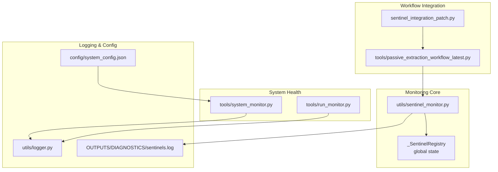
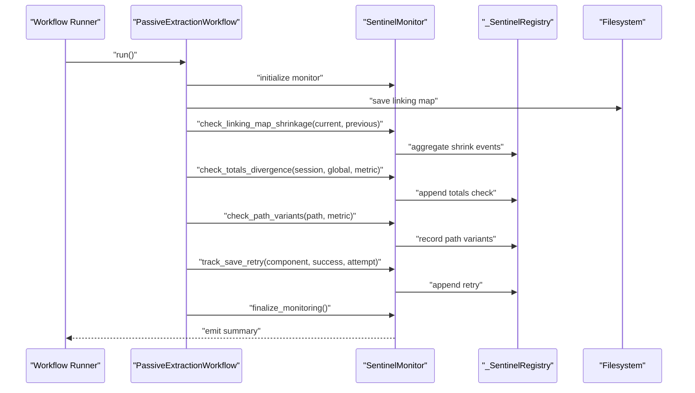
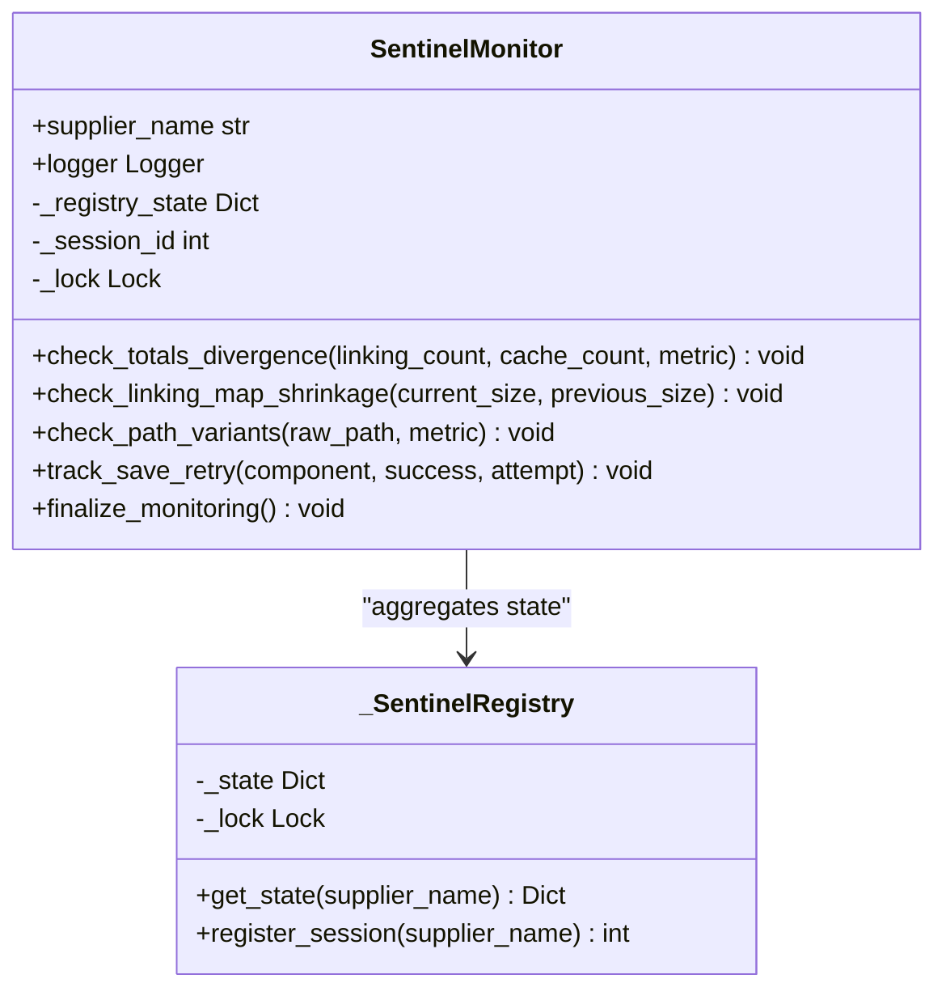
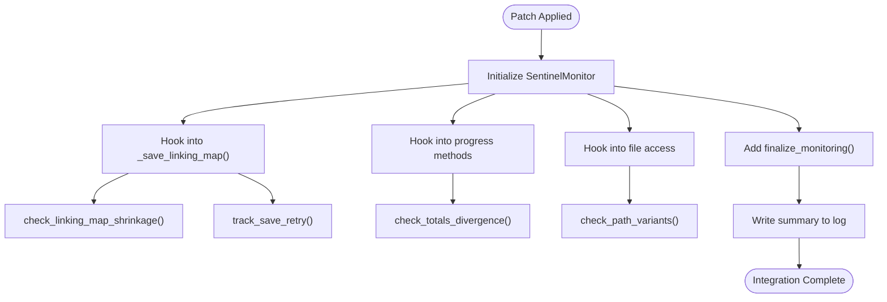
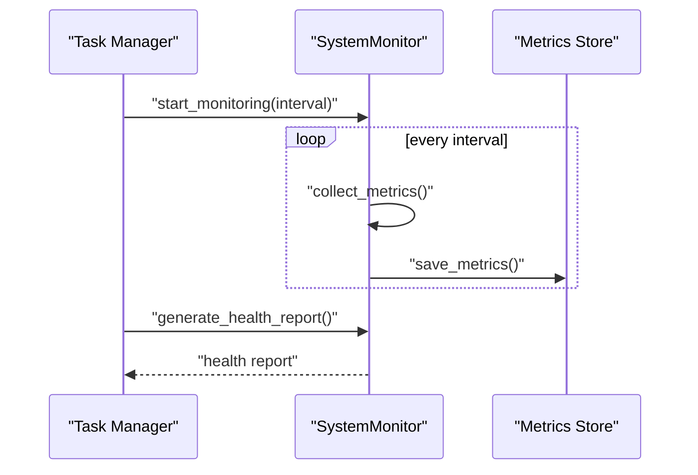
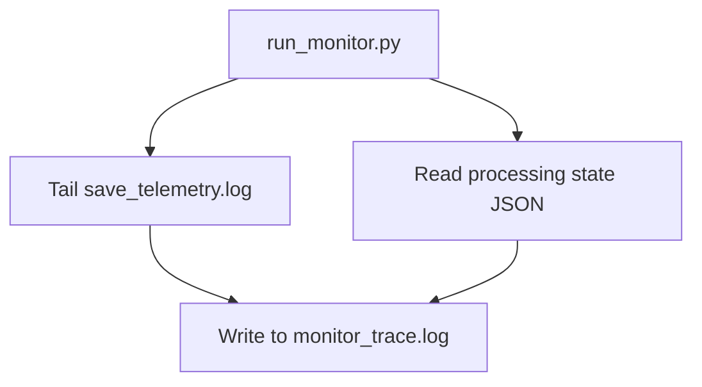
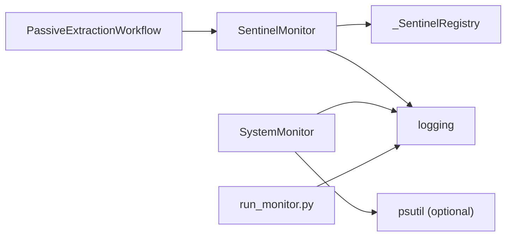

# System Monitoring

<cite>
**Referenced Files in This Document**
- [sentinel_implementation.md](file://OUTPUTS/DIAGNOSTICS/sentinel_implementation.md)
- [sentinel_monitor.py](file://utils/sentinel_monitor.py)
- [sentinel_integration_patch.py](file://sentinel_integration_patch.py)
- [passive_extraction_workflow_latest.py](file://tools/passive_extraction_workflow_latest.py)
- [test_sentinel_effectiveness.py](file://testing/integration_fixes/test_sentinel_effectiveness.py)
- [run_monitor.py](file://tools/run_monitor.py)
- [system_monitor.py](file://tools/system_monitor.py)
- [logger.py](file://utils/logger.py)
- [system_config.json](file://config/system_config.json)
</cite>

## Table of Contents
1. [Introduction](#introduction)
2. [Project Structure](#project-structure)
3. [Core Components](#core-components)
4. [Architecture Overview](#architecture-overview)
5. [Detailed Component Analysis](#detailed-component-analysis)
6. [Dependency Analysis](#dependency-analysis)
7. [Performance Considerations](#performance-considerations)
8. [Troubleshooting Guide](#troubleshooting-guide)
9. [Conclusion](#conclusion)
10. [Appendices](#appendices)

## Introduction
This document explains the sentinel monitoring system and broader system monitoring capabilities implemented for the Amazon FBA Agent System. It covers real-time state tracking, divergence detection, performance metrics, sentinel registry and session tracking, and global state aggregation across suppliers. It also documents configuration options, alert triggers, diagnostic logging, integration with the workflow engine, and practical examples of monitoring commands and analysis. Guidance on performance impact and best practices is included to minimize monitoring overhead.

## Project Structure
The monitoring system spans several modules:
- Sentinel monitoring core: utilities and registry for cross-session aggregation
- Workflow integration: sentinel hooks embedded into the main workflow
- System health monitoring: runtime system metrics collection and reporting
- Diagnostic logging: structured sentinel logs and auxiliary telemetry
- Configuration: monitoring-related toggles and thresholds

**Diagram sources**
- [sentinel_monitor.py](file://utils/sentinel_monitor.py#L34-L77)
- [passive_extraction_workflow_latest.py](file://tools/passive_extraction_workflow_latest.py#L90-L95)
- [sentinel_integration_patch.py](file://sentinel_integration_patch.py#L29-L223)
- [system_monitor.py](file://tools/system_monitor.py#L34-L180)
- [run_monitor.py](file://tools/run_monitor.py#L51-L97)
- [logger.py](file://utils/logger.py#L7-L48)
- [system_config.json](file://config/system_config.json#L176-L186)

**Section sources**
- [sentinel_monitor.py](file://utils/sentinel_monitor.py#L1-L201)
- [sentinel_integration_patch.py](file://sentinel_integration_patch.py#L1-L268)
- [passive_extraction_workflow_latest.py](file://tools/passive_extraction_workflow_latest.py#L1-L200)
- [system_monitor.py](file://tools/system_monitor.py#L1-L180)
- [run_monitor.py](file://tools/run_monitor.py#L1-L97)
- [logger.py](file://utils/logger.py#L1-L48)
- [system_config.json](file://config/system_config.json#L176-L186)

## Core Components
- SentinelMonitor: runtime monitor that tracks suspicious state transitions and writes structured alerts to the diagnostic log. It maintains per-session and global state for aggregation across runs.
- _SentinelRegistry: thread-safe global registry aggregating metrics across sessions and suppliers.
- Integration patch: injects sentinel monitoring into the workflow’s critical methods (linking map save, progress tracking, path access, save retries).
- SystemMonitor: collects system-level metrics (CPU, memory, disk, active tasks, error count) and generates health reports.
- run_monitor: tail-mode monitor that streams log and state changes to a trace file for external analysis.
- Logger: centralized logging setup for runs and diagnostics.

**Section sources**
- [sentinel_monitor.py](file://utils/sentinel_monitor.py#L63-L201)
- [sentinel_integration_patch.py](file://sentinel_integration_patch.py#L29-L223)
- [system_monitor.py](file://tools/system_monitor.py#L34-L180)
- [run_monitor.py](file://tools/run_monitor.py#L51-L97)
- [logger.py](file://utils/logger.py#L7-L48)

## Architecture Overview
The sentinel system is integrated into the main workflow to continuously monitor critical operations. It records divergence between in-memory and persisted state, detects shrinking linking maps, tracks save retry patterns, and monitors path variants. Global state is aggregated per supplier via the registry, enabling cross-session trend analysis.

**Diagram sources**
- [sentinel_monitor.py](file://utils/sentinel_monitor.py#L63-L192)
- [sentinel_integration_patch.py](file://sentinel_integration_patch.py#L81-L215)
- [passive_extraction_workflow_latest.py](file://tools/passive_extraction_workflow_latest.py#L82-L152)

## Detailed Component Analysis

### SentinelMonitor and Registry
- Responsibilities:
  - Compare session totals vs global totals and emit divergence alerts.
  - Detect shrinking linking maps and record shrink events.
  - Track path variants to surface filesystem naming inconsistencies.
  - Record save retry attempts and outcomes.
  - Aggregate per-session metrics into a global registry for cross-session analysis.
- Thread-safety: Uses locks around shared state to protect concurrent updates.
- Aggregation: Maintains counts of sessions, totals checks, path variants, shrink events, and save retries per supplier.

**Diagram sources**
- [sentinel_monitor.py](file://utils/sentinel_monitor.py#L34-L77)
- [sentinel_monitor.py](file://utils/sentinel_monitor.py#L63-L192)

**Section sources**
- [sentinel_monitor.py](file://utils/sentinel_monitor.py#L34-L201)

### Workflow Integration (Patch)
- Integration points:
  - Imports sentinel monitor and initializes it in the workflow constructor.
  - Hooks into linking map save to detect shrinkage and track save retries.
  - Adds divergence checks in progress tracking methods.
  - Monitors path variants during file access.
  - Finalizes monitoring at the end of the run.
- Backup and verification: The patch script backs up the workflow file and verifies sentinel additions.

**Diagram sources**
- [sentinel_integration_patch.py](file://sentinel_integration_patch.py#L29-L223)
- [passive_extraction_workflow_latest.py](file://tools/passive_extraction_workflow_latest.py#L82-L152)

**Section sources**
- [sentinel_integration_patch.py](file://sentinel_integration_patch.py#L1-L268)
- [passive_extraction_workflow_latest.py](file://tools/passive_extraction_workflow_latest.py#L1-L200)

### System Health Monitoring
- SystemMonitor collects CPU, memory, disk usage, active tasks, error counts, and processing metrics asynchronously at a configurable interval.
- Generates health reports and performance summaries with thresholds for CPU/memory and error rates.
- Integrates with logging for centralized diagnostics.

**Diagram sources**
- [system_monitor.py](file://tools/system_monitor.py#L48-L180)

**Section sources**
- [system_monitor.py](file://tools/system_monitor.py#L1-L180)

### Diagnostic Telemetry and Trace
- run_monitor tails the save telemetry log and state file, streaming both to a trace file for external analysis.
- Provides a lightweight way to correlate system progress with sentinel alerts.

**Diagram sources**
- [run_monitor.py](file://tools/run_monitor.py#L51-L97)

**Section sources**
- [run_monitor.py](file://tools/run_monitor.py#L1-L97)

### Logging and Configuration
- Centralized logger sets up file and console handlers with timestamps and levels.
- System configuration enables monitoring, sets metrics intervals, health check intervals, and alert thresholds.

**Section sources**
- [logger.py](file://utils/logger.py#L7-L48)
- [system_config.json](file://config/system_config.json#L176-L186)

## Dependency Analysis
- SentinelMonitor depends on:
  - _SentinelRegistry for global aggregation
  - Python stdlib logging for alert emission
- Workflow integration depends on:
  - SentinelMonitor for runtime checks
  - Filesystem for linking map persistence and verification
- SystemMonitor depends on:
  - Optional psutil for system metrics
  - Logging for error and metrics persistence

**Diagram sources**
- [sentinel_monitor.py](file://utils/sentinel_monitor.py#L63-L192)
- [system_monitor.py](file://tools/system_monitor.py#L13-L18)
- [run_monitor.py](file://tools/run_monitor.py#L1-L13)

**Section sources**
- [sentinel_monitor.py](file://utils/sentinel_monitor.py#L1-L201)
- [system_monitor.py](file://tools/system_monitor.py#L1-L180)
- [run_monitor.py](file://tools/run_monitor.py#L1-L97)

## Performance Considerations
- Sentinel checks are lightweight:
  - Simple arithmetic comparisons and basic filesystem checks
  - Minimal allocations and no heavy I/O outside save operations
- Registry access is protected by locks but scoped to short critical sections
- SystemMonitor sampling interval is configurable; lower intervals increase overhead
- Recommendations:
  - Keep metrics_interval and health_check_interval at sensible defaults (e.g., minutes)
  - Avoid excessive logging verbosity in production
  - Use structured logs to enable efficient post-run analysis

[No sources needed since this section provides general guidance]

## Troubleshooting Guide
- Verify sentinel integration:
  - Use the integration patch to apply sentinel hooks and confirm they are present in the workflow file
- Validate sentinel effectiveness:
  - Run the sentinel test suite to simulate scenarios and confirm alert emissions
- Inspect sentinel logs:
  - Monitor the diagnostic sentinel log for structured entries and summaries
- Correlate with system telemetry:
  - Use the run monitor to stream logs and state changes for external analysis
- Adjust thresholds:
  - Tune monitoring thresholds in configuration based on observed operational behavior

**Section sources**
- [sentinel_integration_patch.py](file://sentinel_integration_patch.py#L225-L251)
- [test_sentinel_effectiveness.py](file://testing/integration_fixes/test_sentinel_effectiveness.py#L318-L373)
- [sentinel_implementation.md](file://OUTPUTS/DIAGNOSTICS/sentinel_implementation.md#L43-L75)
- [run_monitor.py](file://tools/run_monitor.py#L51-L97)

## Conclusion
The sentinel monitoring system provides proactive detection of silent failures, divergence between in-memory and persisted state, and save reliability issues. It integrates seamlessly with the workflow, aggregates global state across sessions and suppliers, and produces structured diagnostic logs suitable for automated alerting and dashboards. Complemented by system-level health monitoring and diagnostic telemetry, the system offers comprehensive observability with minimal performance overhead when tuned appropriately.

[No sources needed since this section summarizes without analyzing specific files]

## Appendices

### Monitoring Thresholds and Alert Triggers
- Linking Map Shrinkage:
  - CRITICAL: shrinkage >5%
  - WARNING: shrinkage >1%
- Session/Global Totals Divergence:
  - WARNING: divergence >10%
- Save Retry Pattern:
  - INFO: successful save on attempt N
  - ERROR: repeated failures recorded for a component
- Path Variant Detection:
  - WARNING: multiple canonical forms detected for the same metric

**Section sources**
- [sentinel_implementation.md](file://OUTPUTS/DIAGNOSTICS/sentinel_implementation.md#L10-L31)
- [sentinel_monitor.py](file://utils/sentinel_monitor.py#L94-L109)
- [sentinel_monitor.py](file://utils/sentinel_monitor.py#L144-L155)
- [sentinel_monitor.py](file://utils/sentinel_monitor.py#L166-L177)

### Configuration Options for Monitoring
- Monitoring toggles and thresholds:
  - Enable/disable monitoring
  - Metrics interval and health check interval
  - Log level
  - CPU/memory thresholds and error rate thresholds

**Section sources**
- [system_config.json](file://config/system_config.json#L176-L186)

### Practical Examples
- Apply integration patch:
  - python sentinel_integration_patch.py
- Run sentinel test suite:
  - python testing/integration_fixes/test_sentinel_effectiveness.py
- Monitor sentinel alerts:
  - tail -f OUTPUTS/DIAGNOSTICS/sentinels.log
- Stream telemetry and state:
  - python tools/run_monitor.py

**Section sources**
- [sentinel_integration_patch.py](file://sentinel_integration_patch.py#L58-L79)
- [test_sentinel_effectiveness.py](file://testing/integration_fixes/test_sentinel_effectiveness.py#L68-L75)
- [run_monitor.py](file://tools/run_monitor.py#L51-L97)