# Troubleshooting & Support

<cite>
**Referenced Files in This Document**
- [docs/TROUBLESHOOTING.md](file://docs/TROUBLESHOOTING.md)
- [utils/browser_manager.py](file://utils/browser_manager.py)
- [utils/browser_circuit_breaker.py](file://utils/browser_circuit_breaker.py)
- [utils/windows_save_guardian.py](file://utils/windows_save_guardian.py)
- [config/system_config.json](file://config/system_config.json)
- [diagnostics/state_timeline_analysis.txt](file://diagnostics/state_timeline_analysis.txt)
- [diagnostics_output/scan_report.txt](file://diagnostics_output/scan_report.txt)
- [diagnostics_output/workflow_files.json](file://diagnostics_output/workflow_files.json)
- [memories/comprehensive_state_corruption_analysis.md](file://memories/comprehensive_state_corruption_analysis.md)
- [memories/critical_workflow_failure_investigation.md](file://memories/critical_workflow_failure_investigation.md)
- [memories/Session_Context_Summary_Chrome_CDP_Issues_Aug29_2025.md](file://memories/Session_Context_Summary_Chrome_CDP_Issues_Aug29_2025.md)
- [CHROME_CDP_CONNECTIVITY_TROUBLESHOOTING_REPORT.md](file://CHROME_CDP_CONNECTIVITY_TROUBLESHOOTING_REPORT.md)
- [chrome_cdp_diagnostic.py](file://chrome_cdp_diagnostic.py)
- [chrome_cdp_diagnostic_fix.py](file://chrome_cdp_diagnostic_fix.py)
- [chrome_cdp_final_fix.py](file://chrome_cdp_final_fix.py)
- [chrome_quick_fix.py](file://chrome_quick_fix.py)
</cite>

## Table of Contents
1. [Introduction](#introduction)
2. [Project Structure](#project-structure)
3. [Core Components](#core-components)
4. [Architecture Overview](#architecture-overview)
5. [Detailed Component Analysis](#detailed-component-analysis)
6. [Dependency Analysis](#dependency-analysis)
7. [Performance Considerations](#performance-considerations)
8. [Troubleshooting Guide](#troubleshooting-guide)
9. [Diagnostic Report Generation](#diagnostic-report-generation)
10. [State Timeline Analysis](#state-timeline-analysis)
11. [Correlation Techniques](#correlation-techniques)
12. [Windows-Specific Issues](#windows-specific-issues)
13. [Chrome DevTools Protocol Problems](#chrome-devtools-protocol-problems)
14. [Memory Management Challenges](#memory-management-challenges)
15. [Escalation Procedures](#escalation-procedures)
16. [Support Ticket Preparation Guidelines](#support-ticket-preparation-guidelines)
17. [Conclusion](#conclusion)

## Introduction
This document provides comprehensive troubleshooting and support guidance for the Amazon FBA Agent System. It covers systematic approaches to diagnosing common issues including browser connectivity problems, state corruption, and performance bottlenecks. It explains diagnostic tools, log analysis techniques, and error pattern recognition. Step-by-step troubleshooting workflows are included for supplier authentication failures, cache corruption, and workflow interruptions. The document also details diagnostic report generation, state timeline analysis, and correlation techniques. Solutions for Windows-specific issues, Chrome DevTools Protocol problems, and memory management challenges are addressed, along with escalation procedures and support ticket preparation guidelines.

## Project Structure
The troubleshooting and diagnostics ecosystem centers around several key areas:
- Centralized browser management with health monitoring and circuit breakers
- Windows-specific atomic file persistence safeguards
- Comprehensive configuration management
- Diagnostic artifacts and timelines
- Chrome CDP connectivity and connectivity fixes

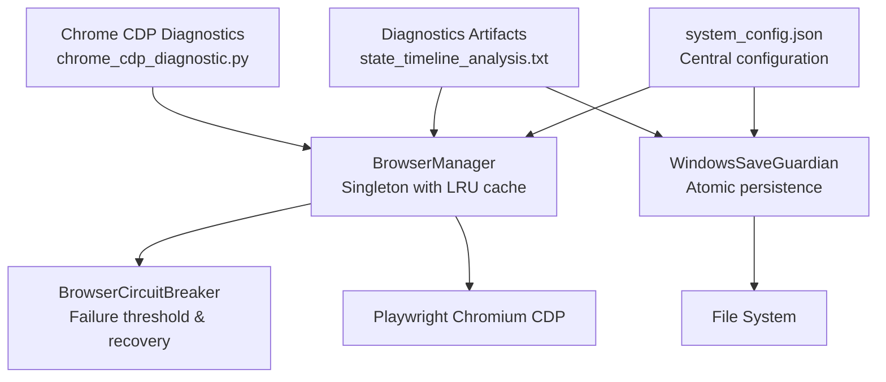

**Diagram sources**
- [utils/browser_manager.py](file://utils/browser_manager.py#L35-L200)
- [utils/browser_circuit_breaker.py](file://utils/browser_circuit_breaker.py#L37-L192)
- [utils/windows_save_guardian.py](file://utils/windows_save_guardian.py#L26-L200)
- [config/system_config.json](file://config/system_config.json#L1-L384)
- [diagnostics/state_timeline_analysis.txt](file://diagnostics/state_timeline_analysis.txt#L1-L331)
- [chrome_cdp_diagnostic.py](file://chrome_cdp_diagnostic.py#L1-L200)

**Section sources**
- [utils/browser_manager.py](file://utils/browser_manager.py#L1-L200)
- [utils/browser_circuit_breaker.py](file://utils/browser_circuit_breaker.py#L1-L200)
- [utils/windows_save_guardian.py](file://utils/windows_save_guardian.py#L1-L200)
- [config/system_config.json](file://config/system_config.json#L1-L384)
- [diagnostics/state_timeline_analysis.txt](file://diagnostics/state_timeline_analysis.txt#L1-L331)
- [chrome_cdp_diagnostic.py](file://chrome_cdp_diagnostic.py#L1-L200)

## Core Components
- BrowserManager: Singleton browser manager with LRU page caching, health monitoring, and CDP connection orchestration. It enforces single-tab usage and integrates a circuit breaker for navigation operations.
- BrowserCircuitBreaker: Implements circuit breaker pattern for browser operations with configurable failure thresholds and recovery timeouts.
- WindowsSaveGuardian: Provides atomic file persistence with multiple fallback strategies to address Windows-specific file locking and access issues.
- system_config.json: Central configuration governing pipeline toggles, system behavior, performance tuning, monitoring, and supplier-specific settings.

**Section sources**
- [utils/browser_manager.py](file://utils/browser_manager.py#L35-L200)
- [utils/browser_circuit_breaker.py](file://utils/browser_circuit_breaker.py#L37-L192)
- [utils/windows_save_guardian.py](file://utils/windows_save_guardian.py#L26-L200)
- [config/system_config.json](file://config/system_config.json#L1-L384)

## Architecture Overview
The system employs a layered architecture with clear separation of concerns:
- Configuration-driven behavior via system_config.json
- Browser lifecycle management through BrowserManager and Playwright CDP
- Robust persistence safeguards via WindowsSaveGuardian
- Health monitoring and resilience via BrowserCircuitBreaker
- Diagnostic artifact generation for state and workflow analysis

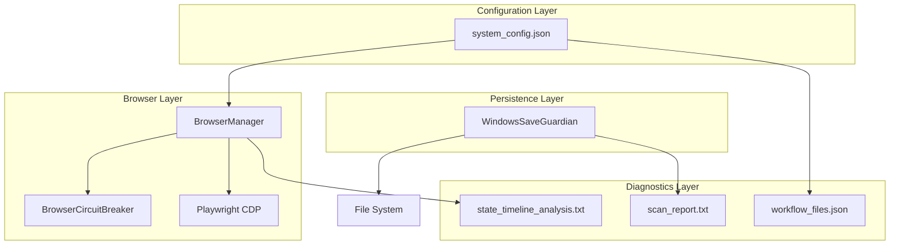

**Diagram sources**
- [config/system_config.json](file://config/system_config.json#L1-L384)
- [utils/browser_manager.py](file://utils/browser_manager.py#L35-L200)
- [utils/browser_circuit_breaker.py](file://utils/browser_circuit_breaker.py#L37-L192)
- [utils/windows_save_guardian.py](file://utils/windows_save_guardian.py#L26-L200)
- [diagnostics/state_timeline_analysis.txt](file://diagnostics/state_timeline_analysis.txt#L1-L331)
- [diagnostics_output/scan_report.txt](file://diagnostics_output/scan_report.txt#L1-L79)
- [diagnostics_output/workflow_files.json](file://diagnostics_output/workflow_files.json#L1-L800)

## Detailed Component Analysis

### Browser Connectivity and CDP Issues
Common symptoms include Chrome debug port accessibility failures, connection timeouts, and browser instability. The troubleshooting guide provides platform-specific steps to kill existing Chrome processes, start Chrome with the debug port, and verify connectivity.

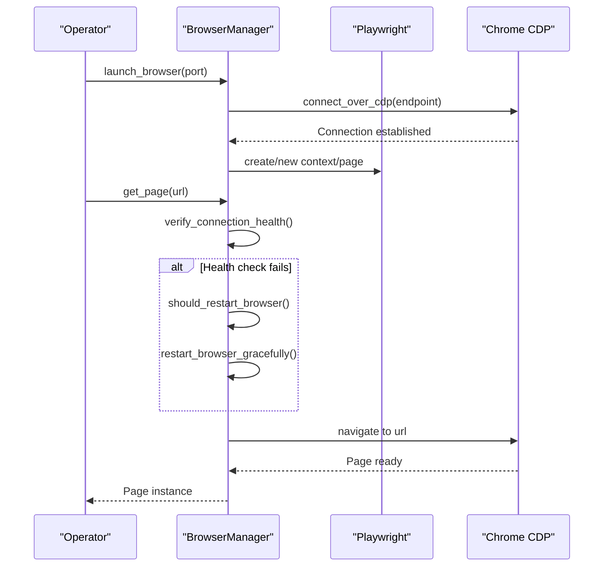

**Diagram sources**
- [utils/browser_manager.py](file://utils/browser_manager.py#L77-L198)
- [docs/TROUBLESHOOTING.md](file://docs/TROUBLESHOOTING.md#L46-L90)

**Section sources**
- [utils/browser_manager.py](file://utils/browser_manager.py#L77-L198)
- [docs/TROUBLESHOOTING.md](file://docs/TROUBLESHOOTING.md#L46-L90)

### Authentication Failures
Supplier authentication failures can lead to repeated login attempts and fallback to no-price processing. The guide outlines verifying credentials, testing manual login, and resetting authentication state.

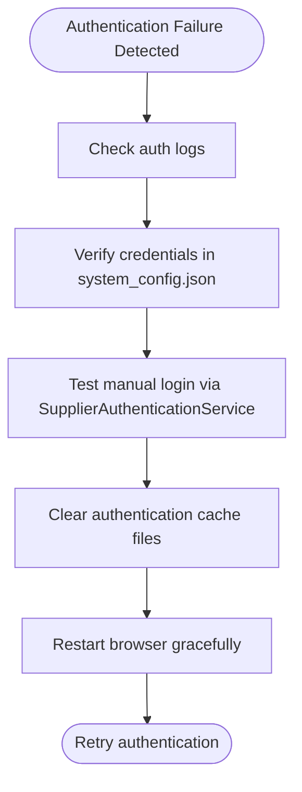

**Diagram sources**
- [docs/TROUBLESHOOTING.md](file://docs/TROUBLESHOOTING.md#L261-L360)

**Section sources**
- [docs/TROUBLESHOOTING.md](file://docs/TROUBLESHOOTING.md#L261-L360)

### Cache Corruption and State Integrity
Cache corruption and state inconsistencies can cause workflow interruptions and incorrect resume indices. The state timeline analysis and memory artifacts help identify anomalies.

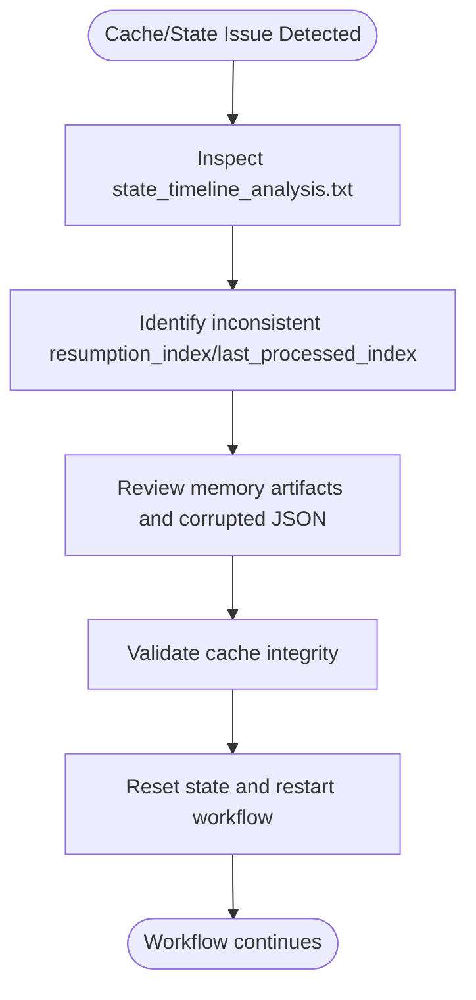

**Diagram sources**
- [diagnostics/state_timeline_analysis.txt](file://diagnostics/state_timeline_analysis.txt#L1-L331)
- [memories/comprehensive_state_corruption_analysis.md](file://memories/comprehensive_state_corruption_analysis.md#L1-L38)
- [memories/critical_workflow_failure_investigation.md](file://memories/critical_workflow_failure_investigation.md#L1-L75)

**Section sources**
- [diagnostics/state_timeline_analysis.txt](file://diagnostics/state_timeline_analysis.txt#L1-L331)
- [memories/comprehensive_state_corruption_analysis.md](file://memories/comprehensive_state_corruption_analysis.md#L1-L38)
- [memories/critical_workflow_failure_investigation.md](file://memories/critical_workflow_failure_investigation.md#L1-L75)

### Performance Bottlenecks
Performance issues often stem from insufficient concurrency, network latency, or missing hash optimization. The guide provides configuration tuning and monitoring steps.

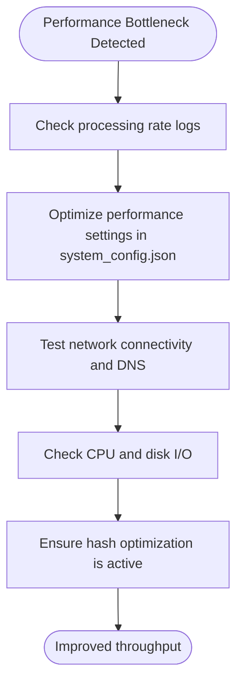

**Diagram sources**
- [docs/TROUBLESHOOTING.md](file://docs/TROUBLESHOOTING.md#L561-L685)
- [config/system_config.json](file://config/system_config.json#L139-L163)

**Section sources**
- [docs/TROUBLESHOOTING.md](file://docs/TROUBLESHOOTING.md#L561-L685)
- [config/system_config.json](file://config/system_config.json#L139-L163)

## Dependency Analysis
The system relies on configuration-driven behavior and diagnostic artifacts to maintain reliability. Key dependencies include:
- BrowserManager depends on Playwright CDP and BrowserCircuitBreaker
- WindowsSaveGuardian depends on filesystem operations and telemetry logging
- Diagnostic outputs depend on workflow file discovery and audit scanning

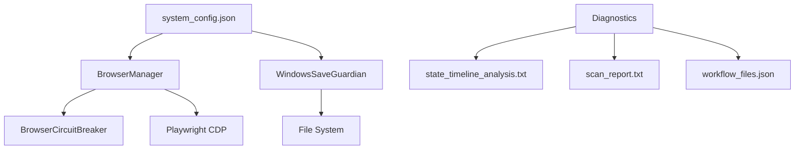

**Diagram sources**
- [config/system_config.json](file://config/system_config.json#L1-L384)
- [utils/browser_manager.py](file://utils/browser_manager.py#L35-L200)
- [utils/browser_circuit_breaker.py](file://utils/browser_circuit_breaker.py#L37-L192)
- [utils/windows_save_guardian.py](file://utils/windows_save_guardian.py#L26-L200)
- [diagnostics/state_timeline_analysis.txt](file://diagnostics/state_timeline_analysis.txt#L1-L331)
- [diagnostics_output/scan_report.txt](file://diagnostics_output/scan_report.txt#L1-L79)
- [diagnostics_output/workflow_files.json](file://diagnostics_output/workflow_files.json#L1-L800)

**Section sources**
- [config/system_config.json](file://config/system_config.json#L1-L384)
- [utils/browser_manager.py](file://utils/browser_manager.py#L35-L200)
- [utils/browser_circuit_breaker.py](file://utils/browser_circuit_breaker.py#L37-L192)
- [utils/windows_save_guardian.py](file://utils/windows_save_guardian.py#L26-L200)
- [diagnostics/state_timeline_analysis.txt](file://diagnostics/state_timeline_analysis.txt#L1-L331)
- [diagnostics_output/scan_report.txt](file://diagnostics_output/scan_report.txt#L1-L79)
- [diagnostics_output/workflow_files.json](file://diagnostics_output/workflow_files.json#L1-L800)

## Performance Considerations
- Tune concurrency and timeouts in system_config.json to balance throughput and stability.
- Monitor processing rates and adjust batch sizes accordingly.
- Enable hash optimization to reduce redundant extractions.
- Use circuit breaker settings to prevent cascading failures during extended runs.

[No sources needed since this section provides general guidance]

## Troubleshooting Guide
This section consolidates step-by-step workflows for common issues.

### Supplier Authentication Failures
1. Verify credentials in system_config.json.
2. Test manual login using SupplierAuthenticationService.
3. Clear authentication cache and restart the browser.
4. Check authentication logs for circuit breaker activation and wait for recovery or reset manually.

**Section sources**
- [docs/TROUBLESHOOTING.md](file://docs/TROUBLESHOOTING.md#L261-L360)

### Cache Corruption
1. Inspect state_timeline_analysis.txt for inconsistent indices.
2. Review memory artifacts and corrupted JSON files.
3. Validate cache integrity and reset state if necessary.
4. Restart workflow from clean state.

**Section sources**
- [diagnostics/state_timeline_analysis.txt](file://diagnostics/state_timeline_analysis.txt#L1-L331)
- [memories/comprehensive_state_corruption_analysis.md](file://memories/comprehensive_state_corruption_analysis.md#L1-L38)
- [memories/critical_workflow_failure_investigation.md](file://memories/critical_workflow_failure_investigation.md#L1-L75)

### Workflow Interruptions
1. Check processing logs for bottlenecks and slow operations.
2. Adjust performance settings in system_config.json.
3. Validate network connectivity and DNS resolution.
4. Monitor CPU and disk I/O resources.

**Section sources**
- [docs/TROUBLESHOOTING.md](file://docs/TROUBLESHOOTING.md#L561-L685)
- [config/system_config.json](file://config/system_config.json#L139-L163)

## Diagnostic Report Generation
Diagnostic reports summarize workflow file discovery, import graphs, and health checks. The scan report highlights broken files and severity levels, aiding rapid triage.

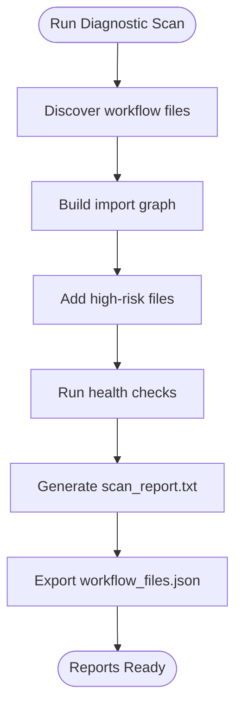

**Diagram sources**
- [diagnostics_output/scan_report.txt](file://diagnostics_output/scan_report.txt#L1-L79)
- [diagnostics_output/workflow_files.json](file://diagnostics_output/workflow_files.json#L1-L800)

**Section sources**
- [diagnostics_output/scan_report.txt](file://diagnostics_output/scan_report.txt#L1-L79)
- [diagnostics_output/workflow_files.json](file://diagnostics_output/workflow_files.json#L1-L800)

## State Timeline Analysis
State timeline analysis tracks resumption indices, last processed indices, and successful product counts across time intervals. Inconsistent values indicate potential state corruption or interruption points.

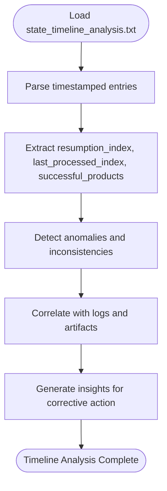

**Diagram sources**
- [diagnostics/state_timeline_analysis.txt](file://diagnostics/state_timeline_analysis.txt#L1-L331)

**Section sources**
- [diagnostics/state_timeline_analysis.txt](file://diagnostics/state_timeline_analysis.txt#L1-L331)

## Correlation Techniques
Correlate diagnostic outputs with configuration settings and runtime logs:
- Cross-reference workflow files with import dependencies.
- Correlate state timeline anomalies with authentication and browser logs.
- Use configuration toggles to isolate problematic subsystems.

**Section sources**
- [diagnostics_output/workflow_files.json](file://diagnostics_output/workflow_files.json#L1-L800)
- [config/system_config.json](file://config/system_config.json#L1-L384)

## Windows-Specific Issues
Windows-specific issues commonly involve file locking and access denials. The WindowsSaveGuardian provides atomic persistence with multiple fallback strategies and detailed telemetry logging.

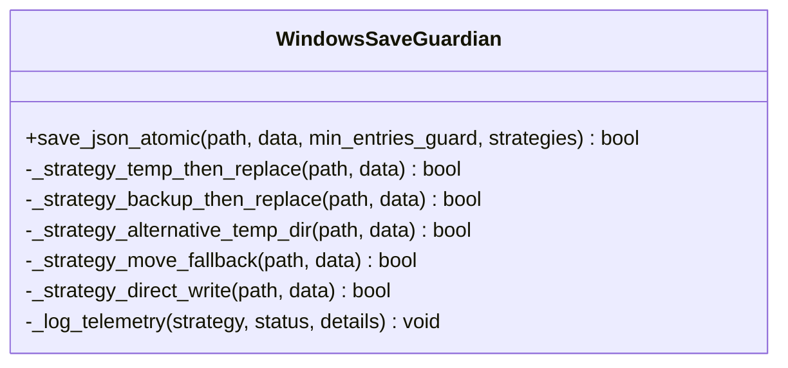

**Diagram sources**
- [utils/windows_save_guardian.py](file://utils/windows_save_guardian.py#L26-L200)

**Section sources**
- [utils/windows_save_guardian.py](file://utils/windows_save_guardian.py#L26-L200)

## Chrome DevTools Protocol Problems
Chrome CDP connectivity issues can prevent browser automation. The troubleshooting guide provides platform-specific steps to resolve port accessibility and connection failures. Dedicated diagnostic scripts assist in identifying and resolving CDP-related problems.

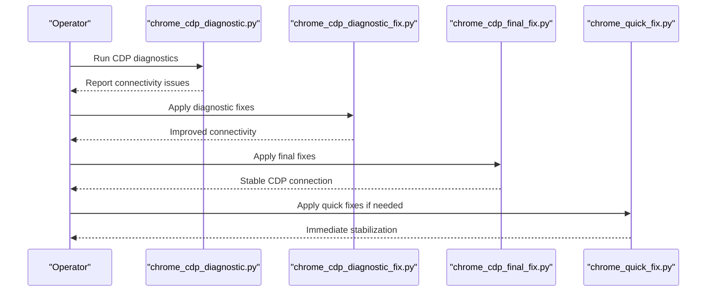

**Diagram sources**
- [CHROME_CDP_CONNECTIVITY_TROUBLESHOOTING_REPORT.md](file://CHROME_CDP_CONNECTIVITY_TROUBLESHOOTING_REPORT.md#L1-L126)
- [chrome_cdp_diagnostic.py](file://chrome_cdp_diagnostic.py#L1-L200)
- [chrome_cdp_diagnostic_fix.py](file://chrome_cdp_diagnostic_fix.py#L1-L200)
- [chrome_cdp_final_fix.py](file://chrome_cdp_final_fix.py#L1-L200)
- [chrome_quick_fix.py](file://chrome_quick_fix.py#L1-L200)

**Section sources**
- [docs/TROUBLESHOOTING.md](file://docs/TROUBLESHOOTING.md#L46-L90)
- [CHROME_CDP_CONNECTIVITY_TROUBLESHOOTING_REPORT.md](file://CHROME_CDP_CONNECTIVITY_TROUBLESHOOTING_REPORT.md#L1-L126)
- [chrome_cdp_diagnostic.py](file://chrome_cdp_diagnostic.py#L1-L200)
- [chrome_cdp_diagnostic_fix.py](file://chrome_cdp_diagnostic_fix.py#L1-L200)
- [chrome_cdp_final_fix.py](file://chrome_cdp_final_fix.py#L1-L200)
- [chrome_quick_fix.py](file://chrome_quick_fix.py#L1-L200)

## Memory Management Challenges
Memory management involves balancing browser memory usage and system memory consumption. The system includes automatic browser restarts and WSL memory management, with manual intervention options when thresholds are exceeded.

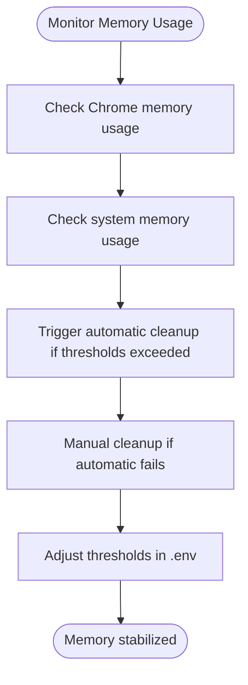

**Diagram sources**
- [docs/TROUBLESHOOTING.md](file://docs/TROUBLESHOOTING.md#L158-L258)

**Section sources**
- [docs/TROUBLESHOOTING.md](file://docs/TROUBLESHOOTING.md#L158-L258)

## Escalation Procedures
Escalation procedures ensure timely resolution of critical issues:
- Document the problem comprehensively with diagnostic reports and state timelines.
- Include configuration snapshots and recent log excerpts.
- Provide reproducible steps and expected vs. actual outcomes.
- Tag relevant stakeholders and attach supporting artifacts.

[No sources needed since this section provides general guidance]

## Support Ticket Preparation Guidelines
Prepare support tickets with:
- Clear problem statement and impact assessment.
- Diagnostic reports and state timeline analysis.
- Configuration files and recent changes.
- Logs highlighting error patterns and timestamps.
- Screenshots or recordings if applicable.
- Proposed mitigation steps and requested assistance.

[No sources needed since this section provides general guidance]

## Conclusion
This troubleshooting and support documentation equips operators with systematic methodologies to diagnose and resolve common issues across browser connectivity, authentication, cache integrity, performance, and platform-specific environments. By leveraging diagnostic reports, state timeline analysis, and configuration-driven controls, teams can efficiently identify root causes, implement targeted fixes, and maintain system reliability.