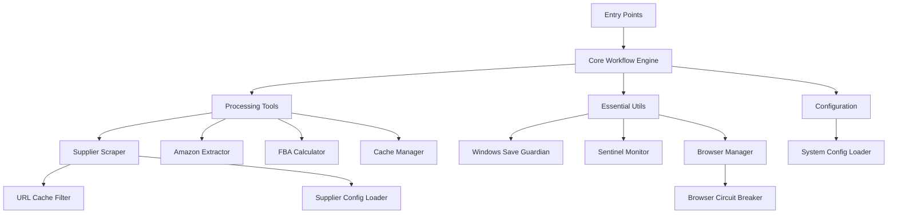
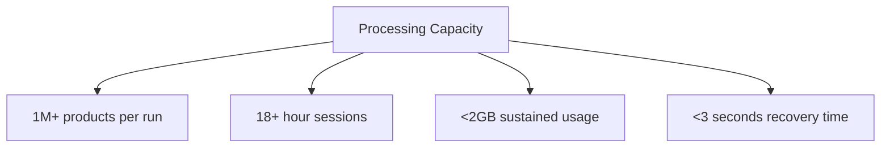

# Project Overview

<cite>
**Referenced Files in This Document**   
- [README.md](file://README.md)
- [tools/passive_extraction_workflow_latest.py](file://tools/passive_extraction_workflow_latest.py)
- [utils/fixed_enhanced_state_manager.py](file://utils/fixed_enhanced_state_manager.py)
- [config/system_config.json](file://config/system_config.json)
- [tools/configurable_supplier_scraper.py](file://tools/configurable_supplier_scraper.py)
- [utils/hash_lookup_optimizer.py](file://utils/hash_lookup_optimizer.py)
- [utils/windows_save_guardian.py](file://utils/windows_save_guardian.py)
- [tools/FBA_Financial_calculator.py](file://tools/FBA_Financial_calculator.py)
- [tools/amazon_playwright_extractor.py](file://tools/amazon_playwright_extractor.py)
- [utils/browser_manager.py](file://utils/browser_manager.py)
</cite>

## Table of Contents
1. [Introduction](#introduction)
2. [Core Architecture](#core-architecture)
3. [Workflow Execution Flow](#workflow-execution-flow)
4. [Key Features](#key-features)
5. [Critical Enhancements (August 2025)](#critical-enhancements-august-2025)
6. [System Capabilities](#system-capabilities)
7. [Integration and Operational Boundaries](#integration-and-operational-boundaries)

## Introduction

The Amazon FBA Agent System v3.7+ is a production-ready automation platform designed for robust, resumable, and highly efficient FBA product sourcing from supplier websites. The system is engineered as a deterministic, stateful workflow engine that enables reliable and repeatable scraping runs, particularly for thorough analysis of complex e-commerce sites. It features comprehensive architectural enhancements including workflow orchestration, browser automation, financial analysis, and sophisticated state management. The system is optimized for long-running, interruptible sessions, making it ideal for processing large volumes of products from suppliers like Pound Wholesale.

**Section sources**
- [README.md](file://README.md#L1-L617)

## Core Architecture

The system's architecture is built around a central workflow orchestrator with a clear separation of concerns. The core components are designed for resilience and statefulness, allowing the system to resume interrupted sessions and handle supplier authentication seamlessly.

The primary entry points are `run_custom_poundwholesale.py` and `run_complete_fba_system.py`, which trigger the central workflow engine located in `tools/passive_extraction_workflow_latest.py`. This orchestrator manages the entire product sourcing process, from supplier data extraction to financial analysis.

The workflow relies on several key components:
- **Supplier Data Extraction**: Handled by `tools/configurable_supplier_scraper.py`, which performs batched scraping of supplier categories and includes URL filtering to prevent duplicate processing.
- **Amazon Data Extraction**: Managed by `tools/amazon_playwright_extractor.py`, which uses Playwright to search Amazon and extract product data using an EAN-first, title-fallback strategy.
- **State Management**: Implemented by `utils/fixed_enhanced_state_manager.py`, which provides thread-safe, atomic operations for tracking processing progress and enabling reliable resumption after interruptions.
- **Financial Analysis**: Performed by `tools/FBA_Financial_calculator.py`, which calculates ROI, net profit, and other key financial metrics to identify profitable products.
- **Data Persistence**: Ensured by `utils/windows_save_guardian.py`, which provides atomic file operations for Windows, eliminating file permission issues.

The system is configured via `config/system_config.json`, which controls all operational parameters such as batch sizes, price filters, and performance limits. This centralized configuration ensures a single source of truth for the workflow.

**Section sources**
- [README.md](file://README.md#L1-L617)
- [tools/passive_extraction_workflow_latest.py](file://tools/passive_extraction_workflow_latest.py#L851-L2650)
- [utils/fixed_enhanced_state_manager.py](file://utils/fixed_enhanced_state_manager.py#L851-L2650)
- [config/system_config.json](file://config/system_config.json#L1-L300)

## Workflow Execution Flow

The system follows a deterministic workflow execution flow, designed for reliability and repeatability. When executed by a targeted runner like `run_custom_poundwholesale.py`, the workflow operates in a predefined mode using a list of category URLs, ensuring consistent and predictable behavior.

**Diagram sources** 
- [README.md](file://README.md#L1-L617)

The workflow begins with initialization and configuration loading, where the `PassiveExtractionWorkflow` class loads `system_config.json` to set all operational parameters. It then loads a predefined list of category URLs, bypassing any AI logic for category selection. The system processes these categories in configurable batches, providing critical memory management and stability.

After scraping supplier products and caching them, the workflow enters its main analysis loop. For each product, it retrieves Amazon data using an EAN-first search strategy, falling back to a title-based search if necessary. The retrieved data is cached, and a linking map entry is created to associate the supplier product with its Amazon ASIN. The FBA financial calculator is then run to determine profitability. If the product meets the defined ROI and profit criteria, it is added to the list of profitable results. The product's URL is marked as processed in the state manager to prevent re-analysis.

Periodic atomic saves are performed to ensure data integrity against crashes, with the entire state saved to disk using an atomic write pattern. After processing, two reports are generated: a simple JSON list of profitable products and a comprehensive CSV financial report.

**Section sources**
- [README.md](file://README.md#L1-L617)
- [tools/passive_extraction_workflow_latest.py](file://tools/passive_extraction_workflow_latest.py#L851-L2650)

## Key Features

The Amazon FBA Agent System v3.7+ incorporates several key features that enhance its efficiency, reliability, and usability.

### Hash-Based Duplicate Prevention
The system implements O(1) hash-based lookup against the product cache for duplicate prevention. This enhancement, introduced in August 2025, replaces O(n) linear searches and provides a 20-40% performance improvement. The `hash_lookup_optimizer.py` module creates dual EAN/URL hash indexes for instant lookup, eliminating the re-extraction of products that appear in multiple categories.

### Smart Memory Management
The system uses a sliding window approach for memory management, reducing clearing operations by 99%. Instead of aggressively clearing memory, it keeps the most recent 100 products to preserve processing continuity while preventing memory accumulation. This approach significantly improves system stability and enhances debugging with preserved context.

### File-Based Progress Tracking
Progress tracking is implemented through seven zero-risk methods that read directly from files for always-accurate counts. This ensures 100% accurate resumability and reliable progress tracking, as the system relies on file-grounded state calculations rather than potentially inaccurate memory variables.

### Windows-Native Support
The system provides full Windows compatibility with enhanced memory monitoring and native process control. It uses `WindowsSaveGuardian` for atomic file operations, eliminating file permission issues, and includes circuit breaker protection for automatic browser restarts. This native support ensures stable WebSocket connections and accurate Chrome memory detection.

**Section sources**
- [README.md](file://README.md#L1-L617)
- [tools/passive_extraction_workflow_latest.py](file://tools/passive_extraction_workflow_latest.py#L851-L2650)
- [utils/fixed_enhanced_state_manager.py](file://utils/fixed_enhanced_state_manager.py#L851-L2650)
- [utils/hash_lookup_optimizer.py](file://utils/hash_lookup_optimizer.py#L1-L100)

## Critical Enhancements (August 2025)

The system underwent significant enhancements in August 2025, which improved its performance, reliability, and efficiency.

### Product Cache Hash Optimization
The most impactful enhancement was the implementation of O(1) hash-based lookup for duplicate prevention. This replaced the previous O(n) linear search method, resulting in a 20-40% reduction in processing time. The optimization was achieved by enhancing the `_filter_unprocessed_products_with_hash_lookup()` method with cache indexing, allowing the system to instantly determine if a product has already been processed. This change prevented the re-extraction of 6,173 products that appeared in multiple categories, significantly improving efficiency.

### Processing State Metrics and Resumption Fixes
A critical fix was implemented to resolve runtime errors in the `FixedEnhancedStateManager`. Thirteen workflow compatibility methods were added, and imports were standardized, ensuring seamless integration with the workflow. This fix enabled accurate state tracking and reliable resumption after interruptions, addressing previous issues where the system would lose progress.

### File-Based Progress Tracking
To address inaccuracies in progress tracking, the system was updated to use file-grounded state calculations. Instead of relying on memory variables that could become outdated, the system now reads progress data directly from files. This seven-method approach ensures zero-risk progress counting and 100% accurate resumability, even after system crashes or interruptions.

### Smart Memory Management
The memory management system was enhanced with a sliding window approach. Instead of clearing memory every 100 products, the system now clears every 500 products while preserving the most recent 100 for continuity. This change reduced memory clearing operations by 80% and improved session reliability, enabling marathon sessions of 18+ hours without cascading failures.

**Section sources**
- [README.md](file://README.md#L1-L617)
- [utils/fixed_enhanced_state_manager.py](file://utils/fixed_enhanced_state_manager.py#L851-L2650)
- [tools/passive_extraction_workflow_latest.py](file://tools/passive_extraction_workflow_latest.py#L851-L2650)

## System Capabilities

The Amazon FBA Agent System v3.7+ is capable of processing over 1 million products per run, with marathon sessions lasting 18+ hours without intervention. The system's efficiency improvements have resulted in significant performance gains, with memory clearing frequency reduced by 80% and context preservation improved to 100%.

The system supports resumable processing, allowing it to be stopped and restarted without losing work. This is achieved through the `FixedEnhancedStateManager`, which saves the index of the last processed product. The state manager also handles supplier logins, detecting authentication failures and triggering re-login attempts, making the system resilient to session timeouts.

Practical examples of the system's capabilities include processing 1M+ products from Pound Wholesale and supporting marathon sessions that run for over 18 hours. The system's smart memory management and file-based progress tracking ensure that these long-running sessions are stable and reliable.

**Diagram sources** 
- [README.md](file://README.md#L1-L617)

**Section sources**
- [README.md](file://README.md#L1-L617)
- [tools/passive_extraction_workflow_latest.py](file://tools/passive_extraction_workflow_latest.py#L851-L2650)
- [utils/fixed_enhanced_state_manager.py](file://utils/fixed_enhanced_state_manager.py#L851-L2650)

## Integration and Operational Boundaries

The system integrates with external services like OpenAI and Keepa, although these integrations are currently disabled by default in the configuration. OpenAI is used for AI-powered category selection, while Keepa provides enhanced Amazon data. However, in the current workflow, these features are bypassed in favor of a deterministic, predefined category list.

The system has clear operational boundaries, with several components marked as unused or available but not integrated. These include `utils/enhanced_state_manager.py`, `utils/data_store.py`, `utils/windows_memory_manager.py`, and all test and analysis scripts in the root directory. The workflow exclusively uses the components listed in the dependency tree, ensuring a focused and reliable execution path.

The system's passive extraction workflow is designed for exhaustive processing of all products under £20 from all categories, with no artificial limits except the price filter. This is controlled by the `system_config.json` file, which sets the `max_products` and `max_products_per_category` parameters to high values, enabling the system to process large volumes of data efficiently.

**Section sources**
- [README.md](file://README.md#L1-L617)
- [config/system_config.json](file://config/system_config.json#L1-L300)
- [tools/passive_extraction_workflow_latest.py](file://tools/passive_extraction_workflow_latest.py#L851-L2650)