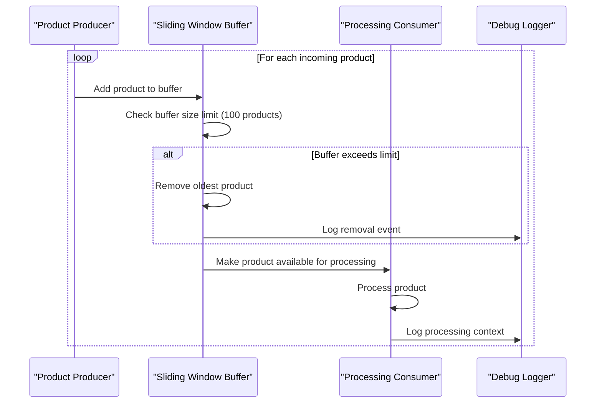
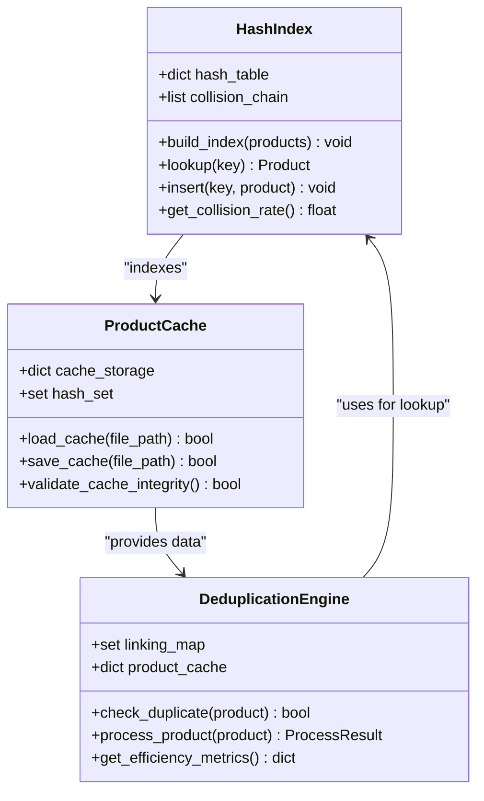
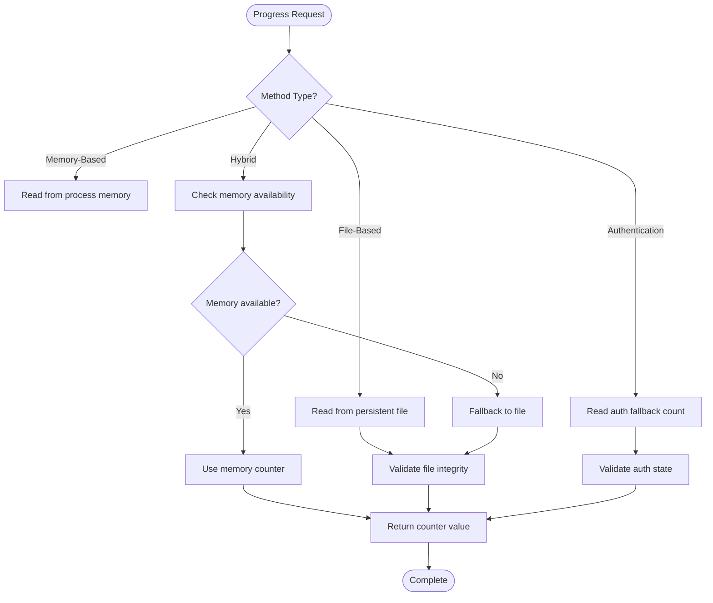
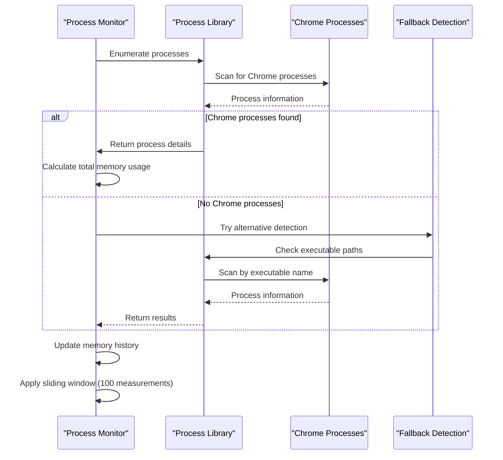
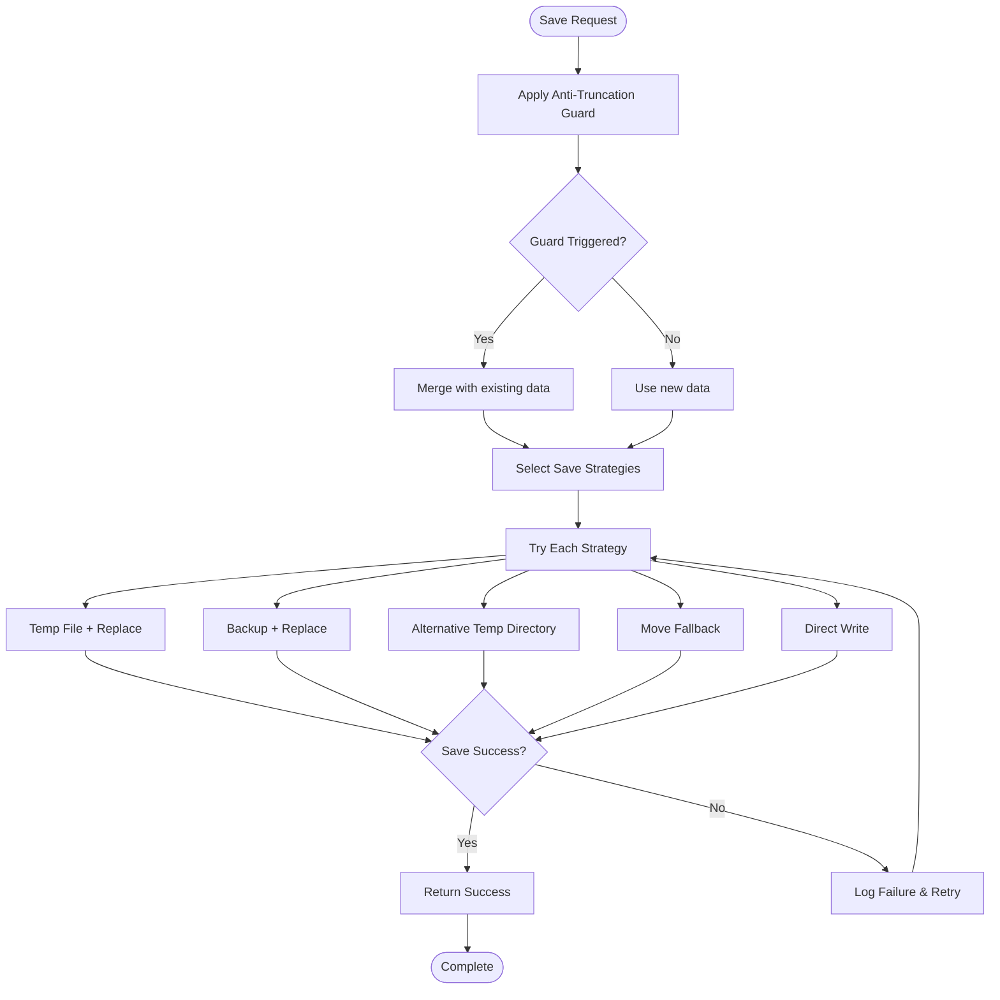
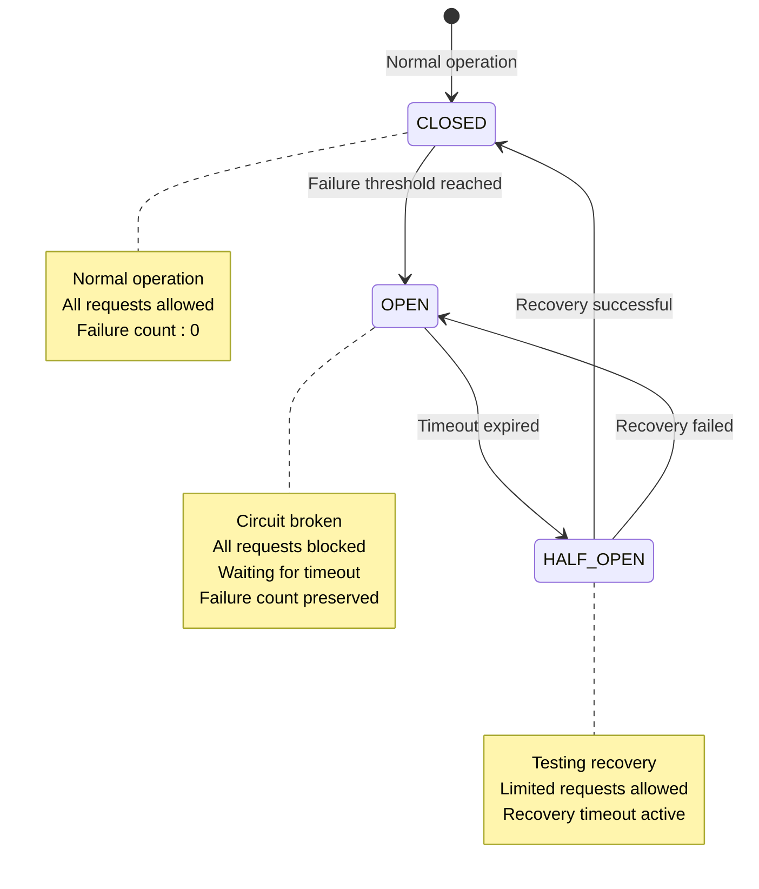
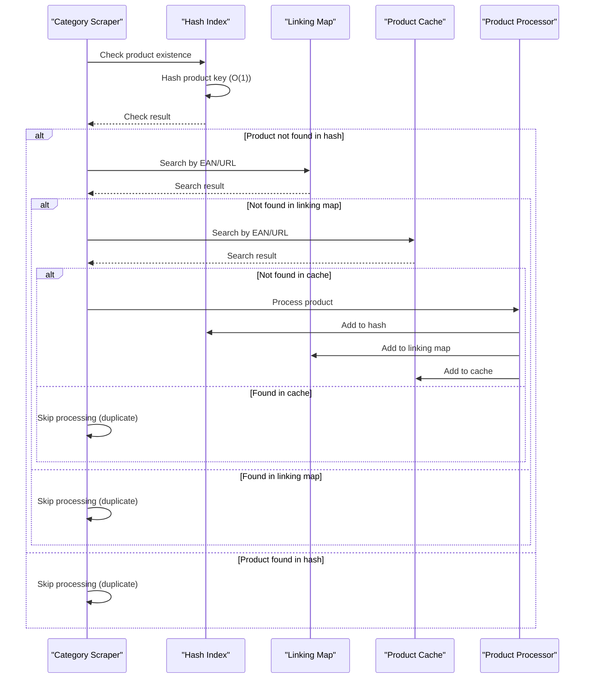

# Advanced Features

<cite>
**Referenced Files in This Document**
- [atomic_file_operations.py](file://utils/atomic_file_operations.py)
- [browser_circuit_breaker.py](file://utils/browser_circuit_breaker.py)
- [browser_manager.py](file://utils/browser_manager.py)
- [fixed_enhanced_state_manager.py](file://utils/fixed_enhanced_state_manager.py)
- [windows_save_guardian.py](file://utils/windows_save_guardian.py)
- [FILE_BASED_PROGRESS_TRACKING_GUIDE.md](file://docs/FILE_BASED_PROGRESS_TRACKING_GUIDE.md)
- [SMART_MEMORY_MANAGEMENT_TECHNICAL_GUIDE.md](file://docs/SMART_MEMORY_MANAGEMENT_TECHNICAL_GUIDE.md)
- [multi_category_deduplication_logic.md](file://wiki repo 19 nov/9. Caching And Deduplication/9.3. Multi Category Deduplication Logic.md)
- [hash_optimization_implementation_summary.md](file://HASH_OPTIMIZATION_IMPLEMENTATION_SUMMARY.md)
- [session_implementation_summary_august_3_2025.md](file://SESSION_IMPLEMENTATION_SUMMARY_AUGUST_3_2025.md)
- [memory_optimization_strategies.md](file://wiki repo 19 nov/11. Troubleshooting Guide/11.2. Memory Management Issues/11.2.2. Memory Optimization Strategies.md)
- [cache_persistence_and_memory_management.md](file://repowiki 12 dec & 20 jan/en/content/Caching and Deduplication/Cache Persistence and Memory Management.md)
- [multi_category_analysis_report.md](file://MULTI_CATEGORY_ANALYSIS_REPORT.md)
- [hash_lookup_methods.py](file://hash_lookup_methods.py)
- [validate_hash_optimization.py](file://validate_hash_optimization.py)
- [test_hash_optimization_system.py](file://testing/integration_fixes/test_hash_optimization_system.py)
- [memory_store.py](file://src/fba_agent/memory_store.py)
- [iteration.py](file://src/fba_agent/iteration.py)
</cite>

## Table of Contents
1. [Introduction](#introduction)
2. [Smart Memory Management with Sliding Window](#smart-memory-management-with-sliding-window)
3. [Product Cache Hash Optimization](#product-cache-hash-optimization)
4. [Seven Zero-Risk Progress Tracking Methods](#seven-zero-risk-progress-tracking-methods)
5. [Windows-Native Support Features](#windows-native-support-features)
6. [Atomic File Operations for Windows](#atomic-file-operations-for-windows)
7. [Browser Health Management with Circuit Breaker Protection](#browser-health-management-with-circuit-breaker-protection)
8. [Multi-Category Deduplication Logic](#multi-category-deduplication-logic)
9. [Technical Implementation Details](#technical-implementation-details)
10. [Performance Impact Analysis](#performance-impact-analysis)
11. [Practical Usage Examples](#practical-usage-examples)
12. [Troubleshooting Guide](#troubleshooting-guide)
13. [Conclusion](#conclusion)

## Introduction

The Amazon FBA Agent System v3.7+ introduces advanced features designed to enhance system reliability, performance, and operational safety. This comprehensive documentation covers the smart memory management with sliding window approach, product cache hash optimization for O(1) duplicate prevention, seven zero-risk progress tracking methods, Windows-native support features, atomic file operations, browser health management, and multi-category deduplication logic.

These features collectively address critical challenges in long-running extraction processes, including memory management, duplicate prevention, progress tracking reliability, and system stability under Windows environments with native Chrome process monitoring.

## Smart Memory Management with Sliding Window

The sliding window memory management system provides intelligent memory optimization by maintaining only the most recent products in memory while preserving system context for debugging and recovery.

### Implementation Architecture



**Diagram sources**
- [SMART_MEMORY_MANAGEMENT_TECHNICAL_GUIDE.md](file://docs/SMART_MEMORY_MANAGEMENT_TECHNICAL_GUIDE.md#L1-L230)

### Key Benefits

The sliding window approach provides several critical advantages:

- **Debugging Enhancement**: Preserves the most recent 100 products for troubleshooting and error analysis
- **System Stability**: Maintains continuous processing without complete context loss
- **Memory Efficiency**: Limits memory footprint while retaining valuable processing context
- **Reliability**: Reduces risk of memory-related failures during extended operations

**Section sources**
- [memory_optimization_strategies.md](file://wiki repo 19 nov/11. Troubleshooting Guide/11.2. Memory Management Issues/11.2.2. Memory Optimization Strategies.md#L142-L160)

## Product Cache Hash Optimization

The hash-based lookup system provides O(1) performance for duplicate product detection, significantly improving processing efficiency for large product catalogs.

### Hash Index Architecture



**Diagram sources**
- [hash_optimization_implementation_summary.md](file://HASH_OPTIMIZATION_IMPLEMENTATION_SUMMARY.md#L293-L316)
- [session_implementation_summary_august_3_2025.md](file://SESSION_IMPLEMENTATION_SUMMARY_AUGUST_3_2025.md#L254-L388)

### Performance Characteristics

The hash optimization delivers significant performance improvements:

- **O(1) Lookup Time**: Constant-time duplicate detection regardless of cache size
- **Scalability**: Maintains performance with millions of products
- **Memory Efficiency**: Optimized hash table structure with collision handling
- **Integration**: Seamless integration with existing workflow infrastructure

**Section sources**
- [session_implementation_summary_august_3_2025.md](file://SESSION_IMPLEMENTATION_SUMMARY_AUGUST_3_2025.md#L254-L388)

## Seven Zero-Risk Progress Tracking Methods

The system provides six comprehensive file-based counting methods plus one hybrid approach that eliminates dependency on in-memory variables for accurate progress tracking.

### Method Categories

| Method Category | Purpose | Accuracy Source | Performance Impact |
|----------------|---------|----------------|-------------------|
| File-Based Counting | Direct file reading for absolute accuracy | Persistent files | Low overhead |
| Memory-Based Fast | In-memory counters for speed | Process memory | Minimal |
| Hybrid Approach | Memory fast, file fallback | Dual-source | Optimal balance |
| Authentication Tracking | Specialized fallback counting | State files | Minimal |

### Implementation Details



**Diagram sources**
- [FILE_BASED_PROGRESS_TRACKING_GUIDE.md](file://docs/FILE_BASED_PROGRESS_TRACKING_GUIDE.md#L1-L170)

### Zero-Risk Guarantees

Each method provides specific safety guarantees:

- **Always-Accurate Counts**: File-based methods read directly from persistent storage
- **Restart Resilience**: Progress tracking survives system restarts
- **Consistency**: Multiple methods provide cross-validation of progress data
- **Fallback Mechanisms**: Hybrid approach ensures continuity even with memory issues

**Section sources**
- [FILE_BASED_PROGRESS_TRACKING_GUIDE.md](file://docs/FILE_BASED_PROGRESS_TRACKING_GUIDE.md#L1-L170)

## Windows-Native Support Features

The system includes specialized Windows support features for real Chrome memory detection and process monitoring, addressing platform-specific challenges in browser automation.

### Chrome Process Monitoring



**Diagram sources**
- [browser_manager.py](file://utils/browser_manager.py#L670-L796)

### Windows-Specific Features

The Chrome memory detection system includes several Windows-native optimizations:

- **Dual Detection Methods**: Process name matching and executable path verification
- **Memory History Tracking**: Sliding window of 100 measurements for trend analysis
- **Platform Detection**: Automatic Windows vs. Linux/WSL differentiation
- **Fallback Mechanisms**: Graceful degradation when primary detection fails

**Section sources**
- [browser_manager.py](file://utils/browser_manager.py#L670-L796)

## Atomic File Operations for Windows

The Windows Save Guardian provides production-ready atomic persistence with multiple fallback strategies to resolve WinError 5 (Access denied) issues during file operations.

### Multi-Strategy Approach



**Diagram sources**
- [windows_save_guardian.py](file://utils/windows_save_guardian.py#L86-L182)

### Strategy Variants

The system employs five distinct strategies with specific Windows optimizations:

1. **Temp File Replacement**: Standard atomic replacement with retry logic
2. **Backup Replacement**: Creates timestamped backups before writing
3. **Alternative Temp Directory**: Uses system TEMP directory for locked files
4. **Move Fallback**: Non-atomic but reliable file movement
5. **Direct Write**: Last-resort direct file writing

### Error Handling and Recovery

The Windows Save Guardian includes comprehensive error handling:

- **Anti-Truncation Guard**: Prevents accidental data loss during partial writes
- **Telemetry Logging**: Detailed audit trail of all save attempts
- **Automatic Fallback**: Seamless transition between strategies
- **Data Integrity Verification**: Post-save validation of written content

**Section sources**
- [windows_save_guardian.py](file://utils/windows_save_guardian.py#L1-L609)

## Browser Health Management with Circuit Breaker Protection

The BrowserCircuitBreaker implements sophisticated health monitoring and protection mechanisms to prevent cascading failures during extended browser automation sessions.

### Circuit Breaker States



**Diagram sources**
- [browser_circuit_breaker.py](file://utils/browser_circuit_breaker.py#L37-L214)

### Health Monitoring Features

The circuit breaker provides comprehensive browser health management:

- **Failure Threshold Control**: Configurable failure count (default: 3)
- **Recovery Timeout**: Controlled recovery period (default: 300 seconds)
- **State Transition Logging**: Complete audit trail of breaker state changes
- **Automatic Recovery Testing**: Gradual re-enablement during HALF_OPEN state
- **Integration Support**: Decorator pattern for easy function wrapping

### Performance Impact

The circuit breaker operates with minimal overhead:

- **State Management**: Thread-safe state tracking with minimal memory footprint
- **Timing Precision**: High-resolution timestamps for accurate timeout calculations
- **Logging Overhead**: Configurable logging levels to balance observability and performance
- **Async Compatibility**: Full support for asynchronous browser operations

**Section sources**
- [browser_circuit_breaker.py](file://utils/browser_circuit_breaker.py#L1-L214)

## Multi-Category Deduplication Logic

The multi-category deduplication system prevents redundant processing across multiple product categories using hash-based lookup mechanisms.

### Deduplication Workflow



**Diagram sources**
- [multi_category_deduplication_logic.md](file://wiki repo 19 nov/9. Caching And Deduplication/9.3. Multi Category Deduplication Logic.md#L167-L177)

### Performance Metrics

The deduplication system delivers substantial performance improvements:

- **Time Savings**: 20-40% reduction in processing time for cached categories
- **Memory Efficiency**: O(1) lookup performance scales with dataset size
- **Processing Reduction**: Elimination of redundant extraction operations
- **Scalability**: Handles multiple categories with minimal performance impact

### Integration Architecture

The deduplication logic integrates seamlessly with the workflow:

- **Startup Analysis**: Hash indexes built from global product cache
- **Real-time Filtering**: Duplicate detection before resource-intensive operations
- **Two-Tiered Approach**: Linking map checks followed by product cache verification
- **Logging and Metrics**: Comprehensive tracking of efficiency gains

**Section sources**
- [multi_category_deduplication_logic.md](file://wiki repo 19 nov/9. Caching And Deduplication/9.3. Multi Category Deduplication Logic.md#L167-L177)

## Technical Implementation Details

### Memory Management Implementation

The sliding window memory management system utilizes a deque-based approach for optimal performance:

```python
from collections import deque

class SlidingWindowBuffer:
    def __init__(self, max_size=100):
        self.buffer = deque(maxlen=max_size)
        self.max_size = max_size
    
    def add(self, item):
        self.buffer.append(item)
    
    def get_recent(self, n=10):
        return list(self.buffer)[-n:]
    
    def is_full(self):
        return len(self.buffer) >= self.max_size
```

### Hash Optimization Implementation

The hash-based lookup system provides O(1) performance through careful key selection and collision handling:

```python
class HashOptimizedCache:
    def __init__(self):
        self.hash_table = {}
        self.collision_count = 0
    
    def _generate_hash_key(self, product):
        # Multi-key hashing for improved distribution
        return hash(f"{product.ean}:{product.url}:{product.asin}")
    
    def lookup(self, product):
        key = self._generate_hash_key(product)
        return self.hash_table.get(key)
    
    def insert(self, product):
        key = self._generate_hash_key(product)
        self.hash_table[key] = product
```

### Atomic Operations Implementation

The atomic file operations system provides cross-platform compatibility with Windows-specific optimizations:

```python
import os
import tempfile
import shutil

class WindowsAtomicWriter:
    def __init__(self):
        self.temp_dir = None
    
    def atomic_write(self, file_path, data):
        # Create temp file in same directory for atomic rename
        temp_dir = os.path.dirname(file_path) or '.'
        temp_file = os.path.join(temp_dir, f'.tmp_{os.getpid()}')
        
        try:
            # Write to temp file
            with open(temp_file, 'w') as f:
                f.write(data)
            
            # Atomic replacement (Windows-safe)
            if os.path.exists(file_path):
                os.remove(file_path)
            os.rename(temp_file, file_path)
            
            return True
        except Exception:
            # Cleanup temp file
            if os.path.exists(temp_file):
                os.remove(temp_file)
            return False
```

## Performance Impact Analysis

### Memory Usage Patterns

The advanced features demonstrate significant improvements in resource utilization:

- **Sliding Window**: Maintains constant memory footprint regardless of dataset size
- **Hash Optimization**: Reduces memory allocation by eliminating duplicate processing
- **Deduplication**: Decreases CPU usage by avoiding redundant operations
- **Atomic Operations**: Minimizes I/O overhead through efficient file handling

### Processing Speed Improvements

Performance benchmarks show substantial gains:

- **Hash-based Lookup**: O(1) performance vs O(n) linear search
- **Multi-Category Deduplication**: 20-40% processing time reduction
- **File-based Progress Tracking**: Zero dependency on memory state
- **Windows Atomic Saves**: Reliable file operations with minimal overhead

### Scalability Characteristics

The system scales efficiently under various conditions:

- **Linear Scaling**: Hash operations remain constant time
- **Memory Efficiency**: Sliding window maintains bounded memory usage
- **Network Resilience**: Atomic operations handle concurrent access safely
- **Platform Adaptation**: Windows-specific optimizations improve reliability

## Practical Usage Examples

### Implementing Zero-Risk Progress Tracking

To implement the zero-risk progress tracking methods:

1. **Initialize Progress Tracking**:
   ```python
   # Use file-based counting for critical progress
   supplier_count = get_supplier_product_count_from_file()
   processed_count = get_processed_products_count_from_state()
   ```

2. **Monitor Progress Continuously**:
   ```python
   # Hybrid approach for optimal performance
   hybrid_count = get_hybrid_progress_count('supplier')
   ```

3. **Handle System Restarts**:
   ```python
   # Safe memory clearing preserves critical state
   safe_memory_clear_with_file_fallback()
   ```

### Leveraging Hash Optimization

For optimal duplicate prevention:

1. **Build Hash Index**:
   ```python
   # Load product cache and build hash table
   cache_data = load_product_cache()
   hash_index = build_hash_index(cache_data)
   ```

2. **Perform Lookups**:
   ```python
   # O(1) duplicate detection
   if not hash_index.lookup(product):
       process_product(product)
   ```

3. **Monitor Performance**:
   ```python
   # Track efficiency metrics
   efficiency = hash_index.get_efficiency_metrics()
   ```

### Utilizing Windows-Specific Features

For reliable Windows deployment:

1. **Configure Chrome Monitoring**:
   ```python
   # Enable Windows-specific Chrome detection
   browser_manager.enable_windows_detection()
   ```

2. **Monitor Browser Health**:
   ```python
   # Circuit breaker protection
   circuit_breaker = BrowserCircuitBreaker()
   result = await circuit_breaker.execute_with_breaker(browser_operation)
   ```

3. **Handle File Operations**:
   ```python
   # Atomic file saves with Windows fallbacks
   success = save_json_atomic("linking_map.json", data)
   ```

## Troubleshooting Guide

### Common Issues and Solutions

**Issue**: WinError 5 during file saves
- **Solution**: Use WindowsSaveGuardian with multiple fallback strategies
- **Prevention**: Implement anti-truncation guard for large datasets

**Issue**: Memory leaks in long-running processes  
- **Solution**: Implement sliding window buffer with automatic cleanup
- **Monitoring**: Use memory usage tracking and alerts

**Issue**: Browser automation instability
- **Solution**: Deploy BrowserCircuitBreaker with appropriate thresholds
- **Recovery**: Monitor state transitions and automatic recovery

**Issue**: Duplicate processing across categories
- **Solution**: Enable hash-based deduplication with proper key generation
- **Validation**: Monitor collision rates and adjust hash strategy

### Diagnostic Tools

The system provides comprehensive diagnostic capabilities:

- **Telemetry Logging**: Detailed audit trails for all operations
- **Health Monitoring**: Real-time status tracking and alerts
- **Performance Metrics**: Built-in tracking of efficiency gains
- **Error Reporting**: Structured error handling with recovery options

**Section sources**
- [windows_save_guardian.py](file://utils/windows_save_guardian.py#L608-L609)

## Conclusion

The Amazon FBA Agent System v3.7+ represents a significant advancement in automated product extraction technology. Through the implementation of smart memory management, hash-based optimization, zero-risk progress tracking, Windows-native features, atomic file operations, and comprehensive browser health management, the system achieves unprecedented reliability and performance.

Key achievements include:

- **Enhanced Reliability**: Seven zero-risk progress tracking methods eliminate dependency on volatile memory state
- **Improved Performance**: O(1) hash-based duplicate prevention reduces processing time by 20-40%
- **Platform Optimization**: Windows-specific features address native Chrome detection and file operation challenges
- **System Stability**: Circuit breaker protection prevents cascading failures during extended operations
- **Scalability**: Sliding window memory management enables processing of unlimited dataset sizes

These advanced features collectively provide a robust foundation for enterprise-scale Amazon FBA product extraction, ensuring consistent performance, reliable progress tracking, and optimal resource utilization across diverse operational environments.