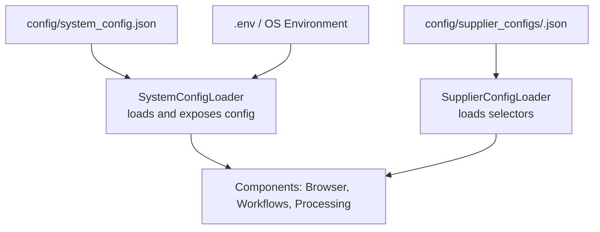
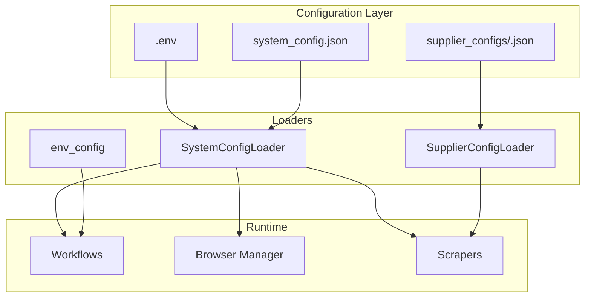
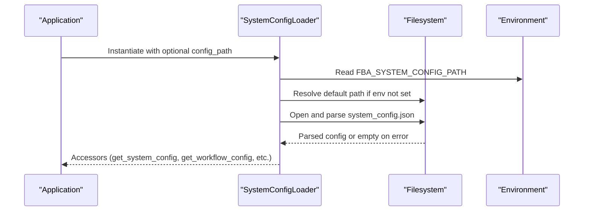
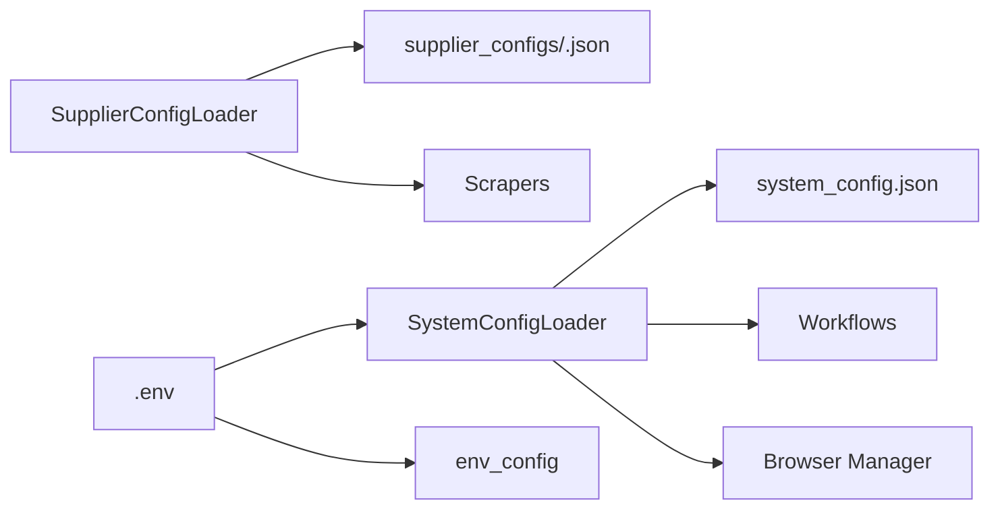

# Configuration Management

<cite>
**Referenced Files in This Document**
- [system_config.json](file://config/system_config.json)
- [system_config_loader.py](file://config/system_config_loader.py)
- [supplier_config_loader.py](file://config/supplier_config_loader.py)
- [poundwholesale.co.uk.json](file://config/supplier_configs/poundwholesale.co.uk.json)
- [clearance-king.co.uk.json](file://config/supplier_configs/clearance-king.co.uk.json)
- [CONFIGURATION_GUIDE.md](file://docs/CONFIGURATION_GUIDE.md)
- [SUPPLIER_CONFIG_ONBOARDING_PLAN.md](file://walkthrough/SUPPLIER_CONFIG_ONBOARDING_PLAN.md)
- [NEW_SUPPLIER_WORKFLOW_GUIDE.md](file://docs/NEW_SUPPLIER_WORKFLOW_GUIDE.md)
- [env_config.py](file://control_plane/env_config.py)
- [system_config.json.bak3](file://config/system_config.json.bak3)
- [full-first.json](file://config/full-first.json)
</cite>

## Table of Contents
1. [Introduction](#introduction)
2. [Project Structure](#project-structure)
3. [Core Components](#core-components)
4. [Architecture Overview](#architecture-overview)
5. [Detailed Component Analysis](#detailed-component-analysis)
6. [Dependency Analysis](#dependency-analysis)
7. [Performance Considerations](#performance-considerations)
8. [Troubleshooting Guide](#troubleshooting-guide)
9. [Conclusion](#conclusion)
10. [Appendices](#appendices)

## Introduction
This document explains the configuration management system used by the Amazon FBA Agent System v3.7+. It focuses on:
- The central system configuration structure in system_config.json, including performance limits, processing parameters, and Chrome settings
- The supplier-specific configuration system and how to onboard new suppliers via JSON
- The configuration loading mechanism and environment variable support
- Practical examples for tuning system parameters, adding suppliers, and optimizing performance
- The relationship between configuration and component behavior, plus troubleshooting guidance

## Project Structure
The configuration system comprises three layers:
- Central system configuration: config/system_config.json
- Supplier-specific selectors: config/supplier_configs/<domain>.json
- Environment variables: .env and runtime environment overrides

**Diagram sources**
- [system_config_loader.py](file://config/system_config_loader.py#L16-L27)
- [supplier_config_loader.py](file://config/supplier_config_loader.py#L23-L56)
- [system_config.json](file://config/system_config.json#L1-L384)

**Section sources**
- [system_config.json](file://config/system_config.json#L1-L384)
- [system_config_loader.py](file://config/system_config_loader.py#L1-L87)
- [supplier_config_loader.py](file://config/supplier_config_loader.py#L1-L187)

## Core Components
- System configuration loader: centralizes access to system_config.json with environment override support
- Supplier configuration loader: loads domain-specific CSS selectors and navigation hints
- Environment configuration: normalizes and harmonizes LLM/provider settings from environment variables

Key responsibilities:
- SystemConfigLoader: resolves config path (env override or default), loads JSON, exposes typed getters
- SupplierConfigLoader: resolves domain from URL, loads domain-specific or default selector config
- env_config: ensures consistent LLM provider/environment variables across control plane

**Section sources**
- [system_config_loader.py](file://config/system_config_loader.py#L16-L87)
- [supplier_config_loader.py](file://config/supplier_config_loader.py#L23-L187)
- [env_config.py](file://control_plane/env_config.py#L26-L45)

## Architecture Overview
The configuration architecture separates concerns:
- Global system behavior is defined in system_config.json
- Supplier-specific scraping behavior is defined in domain selector JSON files
- Environment variables override defaults at runtime

**Diagram sources**
- [system_config.json](file://config/system_config.json#L1-L384)
- [system_config_loader.py](file://config/system_config_loader.py#L16-L87)
- [supplier_config_loader.py](file://config/supplier_config_loader.py#L23-L187)
- [env_config.py](file://control_plane/env_config.py#L26-L45)

## Detailed Component Analysis

### System Configuration (system_config.json)
The central configuration defines:
- System-wide settings: environment, test mode, output roots, batch sizes, tabs, and reuse behavior
- Processing limits: per-category and per-run caps, price filters, and category validation
- Performance: concurrency, timeouts, retries, rate limiting, and batch sizing
- Chrome settings: debug port, headless mode, and required extensions
- Authentication: thresholds, intervals, and circuit breaker behavior
- Analysis: profitability criteria and target categories
- Workflows: per-supplier workflow entries with URLs, category paths, and flags
- Integrations: Keepa/OpenAI toggles and credentials
- Monitoring: metrics intervals, health checks, and alert thresholds
- Cache: TTL, size limits, and selective clearing policies
- Hybrid processing: chunked/balanced modes, memory management, and synchronization

Practical examples:
- To increase throughput: adjust system.supplier_extraction_batch_size, performance.batch_size, and performance.max_concurrent_requests
- To constrain cost: tighten processing_limits.min_price_gbp/max_price_gbp and processing_limits.max_products_per_category
- To optimize memory: tune hybrid_processing.memory_management.max_memory_threshold_mb and cache.max_size_mb
- To enable AI features: set ai_features.category_selection.enabled and integrations.openai.enabled

**Section sources**
- [system_config.json](file://config/system_config.json#L11-L384)
- [CONFIGURATION_GUIDE.md](file://docs/CONFIGURATION_GUIDE.md#L30-L749)

### Supplier-Specific Configuration (supplier_configs/<domain>.json)
Supplier selector configuration includes:
- Field mappings: selectors for product_item, title, price, url, image, EAN/Barcode, SKU, availability
- Pagination: next-button selectors, URL patterns, and page limits
- Navigation configuration: category navigation hints and exclusions
- Optional authentication and API configuration for certain suppliers

Examples:
- Poundwholesale: extensive field mappings, predefined categories, and page limiter
- Clearance King: login configuration, API base URL, scraping rate limits, and authentication selectors

Onboarding a new supplier:
- Create config/supplier_configs/<domain>.json with field_mappings, pagination, and navigation_configuration
- Ensure selectors are robust and cover edge cases (login-required pricing, out-of-stock states)
- Verify pagination and category navigation work end-to-end

**Section sources**
- [poundwholesale.co.uk.json](file://config/supplier_configs/poundwholesale.co.uk.json#L1-L137)
- [clearance-king.co.uk.json](file://config/supplier_configs/clearance-king.co.uk.json#L1-L159)
- [SUPPLIER_CONFIG_ONBOARDING_PLAN.md](file://walkthrough/SUPPLIER_CONFIG_ONBOARDING_PLAN.md#L151-L180)

### Configuration Loading Mechanism
SystemConfigLoader:
- Resolves config path via environment override (FBA_SYSTEM_CONFIG_PATH) or default location
- Loads JSON safely with error handling and graceful fallback to empty config
- Provides typed getters for system, amazon, supplier, credentials, and workflow sections

SupplierConfigLoader:
- Extracts domain from URL or uses provided domain
- Loads domain-specific JSON or falls back to default.json
- Supports saving and updating selector configurations

Environment variable support:
- .env and OS environment variables override defaults
- env_config ensures consistent LLM/provider environment variables

**Diagram sources**
- [system_config_loader.py](file://config/system_config_loader.py#L16-L87)

**Section sources**
- [system_config_loader.py](file://config/system_config_loader.py#L16-L87)
- [supplier_config_loader.py](file://config/supplier_config_loader.py#L23-L187)
- [env_config.py](file://control_plane/env_config.py#L26-L45)

### Relationship Between Configuration and Component Behavior
- System settings drive workflow orchestration, batching, and resource limits
- Chrome settings control browser behavior and debugging capabilities
- Processing limits enforce safety caps and price filters
- Supplier selector configs define extraction behavior per site
- Authentication settings govern login frequency and failure handling
- Monitoring and cache settings influence observability and persistence

Practical impact examples:
- Increasing system.max_products_per_cycle increases workload per cycle
- Enabling hybrid_processing.chunked alternates supplier extraction with Amazon analysis
- Tightening performance.timeouts reduces risk on slow sites but may increase retries
- Adding new supplier selectors unlocks new sites without code changes

**Section sources**
- [system_config.json](file://config/system_config.json#L11-L384)
- [poundwholesale.co.uk.json](file://config/supplier_configs/poundwholesale.co.uk.json#L1-L137)
- [clearance-king.co.uk.json](file://config/supplier_configs/clearance-king.co.uk.json#L1-L159)

## Dependency Analysis
Configuration dependencies:
- SystemConfigLoader depends on filesystem and environment variables
- SupplierConfigLoader depends on supplier_configs directory layout and JSON schema
- Components depend on loader outputs for runtime behavior

**Diagram sources**
- [system_config_loader.py](file://config/system_config_loader.py#L16-L87)
- [supplier_config_loader.py](file://config/supplier_config_loader.py#L23-L187)
- [system_config.json](file://config/system_config.json#L1-L384)

**Section sources**
- [system_config_loader.py](file://config/system_config_loader.py#L16-L87)
- [supplier_config_loader.py](file://config/supplier_config_loader.py#L23-L187)

## Performance Considerations
- Concurrency and batching: Tune performance.max_concurrent_requests and system.supplier_extraction_batch_size for throughput vs stability
- Timeouts: Increase performance.timeouts.page_load_timeout_ms for slower suppliers
- Rate limiting: Adjust performance.rate_limiting and supplier scraping rate limits to avoid blocks
- Memory: Set hybrid_processing.memory_management.max_memory_threshold_mb and cache.max_size_mb according to host capacity
- Recovery: Use supplier_extraction_progress.recovery_mode and state persistence to resume efficiently after interruptions

[No sources needed since this section provides general guidance]

## Troubleshooting Guide
Common issues and resolutions:
- Configuration file errors: Validate JSON syntax and required sections using the validation script from CONFIGURATION_GUIDE.md
- Environment validation: Ensure Chrome debug port accessibility and dependencies installation
- Chrome debug port conflicts: Kill existing Chrome processes and restart with the expected port
- Memory configuration problems: Adjust thresholds based on available RAM and monitor logs for memory alerts
- Supplier selector failures: Verify selectors in domain JSON and ensure they match current site markup

Operational checks:
- Use validation scripts and environment checks from CONFIGURATION_GUIDE.md
- Tail logs for configuration usage and memory thresholds
- Confirm workflow keys and supplier URLs via loader accessors

**Section sources**
- [CONFIGURATION_GUIDE.md](file://docs/CONFIGURATION_GUIDE.md#L500-L749)

## Conclusion
The configuration management system provides a robust, extensible foundation for the Amazon FBA Agent System:
- Centralized system configuration controls behavior and performance
- Supplier-specific selector JSON enables rapid onboarding without code changes
- Environment variables allow safe overrides for different environments
- Clear separation of concerns simplifies maintenance and troubleshooting

Adopting the documented patterns ensures reliable operation and scalability across suppliers and environments.

[No sources needed since this section summarizes without analyzing specific files]

## Appendices

### Practical Examples

- Modifying system parameters
  - Increase batch size: set system.supplier_extraction_batch_size to 200
  - Tighten price filters: set processing_limits.min_price_gbp to 0.50 and max_price_gbp to 50.00
  - Enable hybrid processing: set hybrid_processing.enabled to true and processing_modes.chunked.enabled to true
  - Increase timeouts: set performance.timeouts.page_load_timeout_ms to 40000

- Adding a new supplier
  - Create config/supplier_configs/<domain>.json with field_mappings, pagination, and navigation_configuration
  - Add a workflow entry in system_config.json.workflows with supplier_name, supplier_url, categories_config_path, and authentication flags
  - Provide credentials in system_config.json.credentials if required

- Optimizing performance settings
  - For high-volume processing: increase performance.max_concurrent_requests to 12 and performance.batch_size to 200
  - For memory-constrained systems: decrease performance.max_concurrent_requests to 4 and cache.max_size_mb to 500

**Section sources**
- [system_config.json](file://config/system_config.json#L48-L163)
- [poundwholesale.co.uk.json](file://config/supplier_configs/poundwholesale.co.uk.json#L1-L137)
- [clearance-king.co.uk.json](file://config/supplier_configs/clearance-king.co.uk.json#L1-L159)
- [CONFIGURATION_GUIDE.md](file://docs/CONFIGURATION_GUIDE.md#L630-L670)

### Configuration Profiles
- Development profile: lower limits, headless=false, log_level=DEBUG
- Production profile: higher limits, headless=false, log_level=INFO
- Testing profile: smallest limits, headless=true, log_level=DEBUG

**Section sources**
- [CONFIGURATION_GUIDE.md](file://docs/CONFIGURATION_GUIDE.md#L440-L495)

### Supplier Onboarding Workflow
- Prepare selector JSON with robust field_mappings and pagination
- Add workflow entry in system_config.json
- Parameterize login helper and runners to read supplier config
- Verify linking map directory creation and atomic save behavior

**Section sources**
- [SUPPLIER_CONFIG_ONBOARDING_PLAN.md](file://walkthrough/SUPPLIER_CONFIG_ONBOARDING_PLAN.md#L146-L214)
- [NEW_SUPPLIER_WORKFLOW_GUIDE.md](file://docs/NEW_SUPPLIER_WORKFLOW_GUIDE.md#L70-L90)