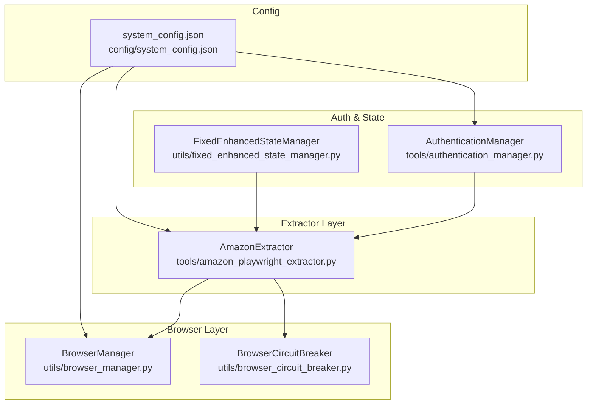
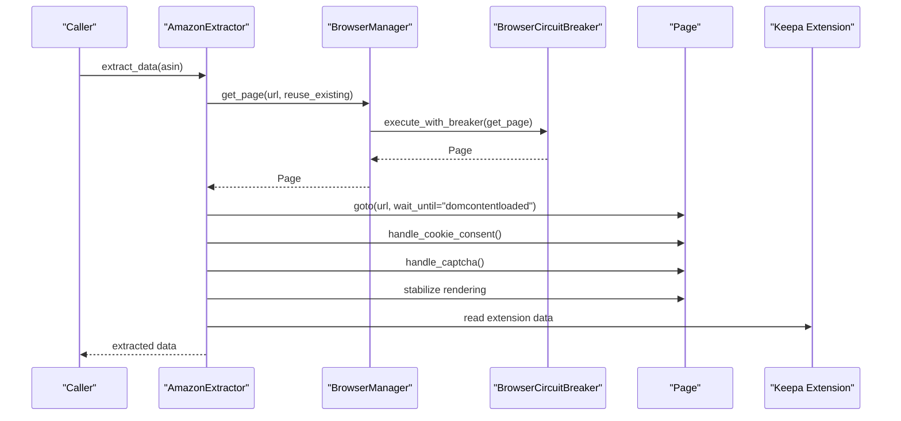
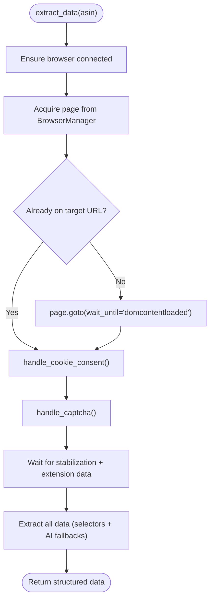
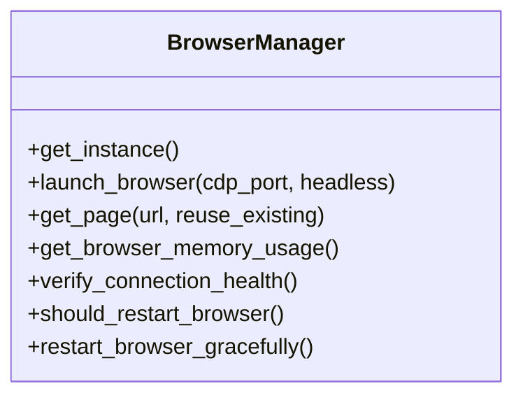
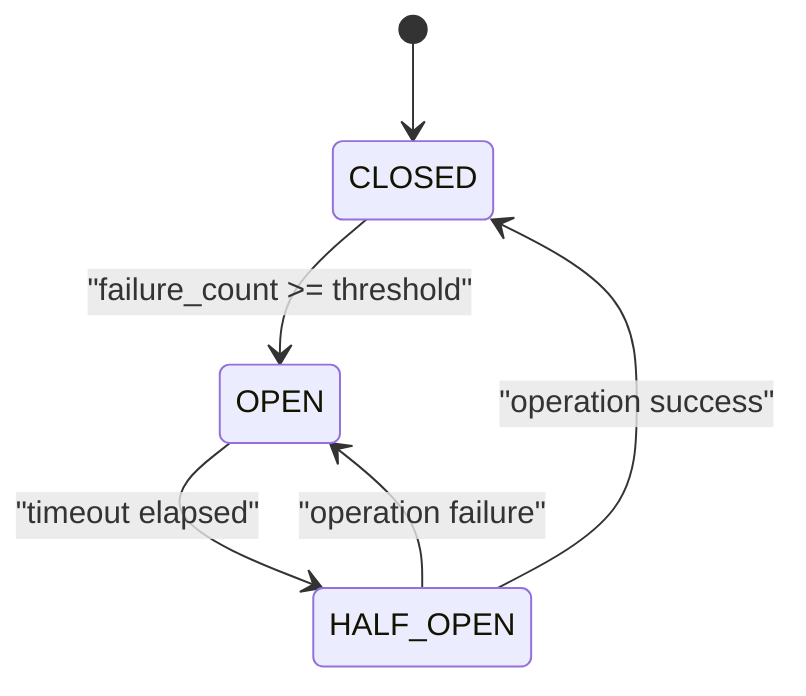
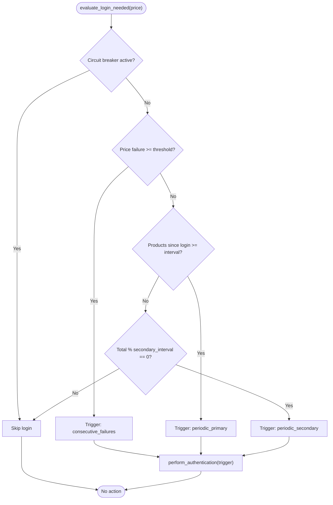
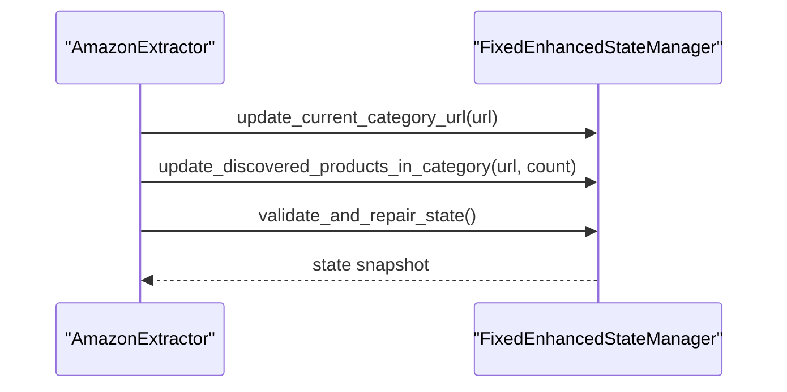
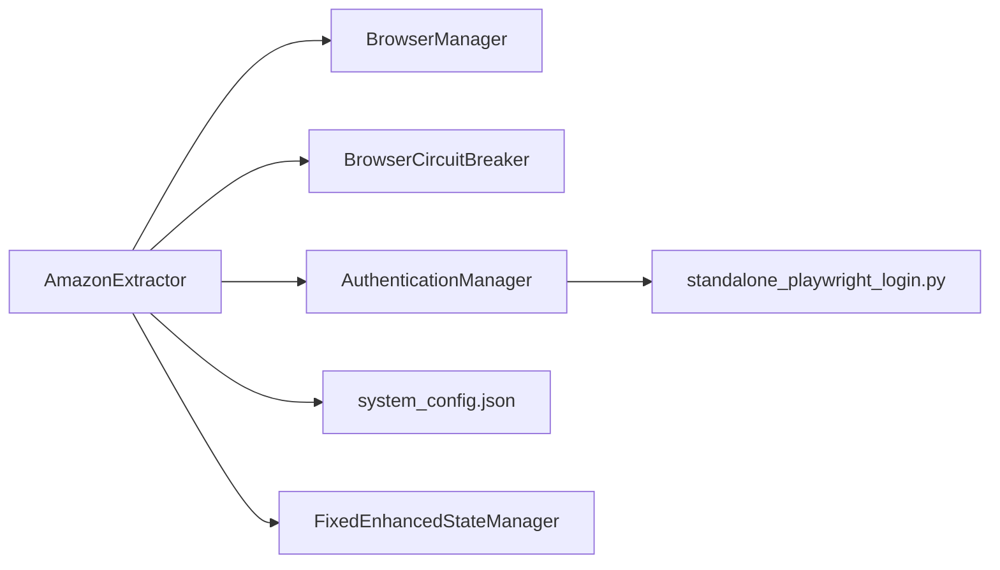

# Amazon Data Extractor

<cite>
**Referenced Files in This Document**
- [amazon_playwright_extractor.py](file://tools/amazon_playwright_extractor.py)
- [browser_manager.py](file://utils/browser_manager.py)
- [browser_circuit_breaker.py](file://utils/browser_circuit_breaker.py)
- [authentication_manager.py](file://tools/authentication_manager.py)
- [system_config.json](file://config/system_config.json)
- [fixed_enhanced_state_manager.py](file://utils/fixed_enhanced_state_manager.py)
- [standalone_playwright_login.py](file://tools/standalone_playwright_login.py)
</cite>

## Table of Contents
1. [Introduction](#introduction)
2. [Project Structure](#project-structure)
3. [Core Components](#core-components)
4. [Architecture Overview](#architecture-overview)
5. [Detailed Component Analysis](#detailed-component-analysis)
6. [Dependency Analysis](#dependency-analysis)
7. [Performance Considerations](#performance-considerations)
8. [Troubleshooting Guide](#troubleshooting-guide)
9. [Conclusion](#conclusion)
10. [Appendices](#appendices)

## Introduction
This document describes the Amazon Data Extractor component that automates product data retrieval from Amazon using Playwright and Chrome DevTools Protocol (CDP). It integrates browser lifecycle management, page caching, circuit breaker protection, authentication orchestration, and state management to support long-running, resilient extractions. The extractor focuses on robust selector-based extraction, with optional AI fallbacks, and leverages the Keepa extension for historical pricing and ranking signals.

## Project Structure
The Amazon Data Extractor is implemented as a cohesive unit with supporting utilities:
- Extractor: Central extraction logic and Chrome/CDP integration
- Browser Manager: Singleton browser and page lifecycle management with LRU caching
- Circuit Breaker: Protection against cascading failures during extended sessions
- Authentication Manager: Multi-tier authentication triggers and circuit breaker
- State Manager: Thread-safe, atomic state persistence for progress tracking
- System Configuration: Global settings for browser, timeouts, and operational toggles

**Diagram sources**
- [amazon_playwright_extractor.py](file://tools/amazon_playwright_extractor.py#L63-L122)
- [browser_manager.py](file://utils/browser_manager.py#L35-L120)
- [browser_circuit_breaker.py](file://utils/browser_circuit_breaker.py#L37-L110)
- [authentication_manager.py](file://tools/authentication_manager.py#L48-L145)
- [fixed_enhanced_state_manager.py](file://utils/fixed_enhanced_state_manager.py#L86-L120)
- [system_config.json](file://config/system_config.json#L200-L207)

**Section sources**
- [amazon_playwright_extractor.py](file://tools/amazon_playwright_extractor.py#L63-L122)
- [browser_manager.py](file://utils/browser_manager.py#L35-L120)
- [browser_circuit_breaker.py](file://utils/browser_circuit_breaker.py#L37-L110)
- [authentication_manager.py](file://tools/authentication_manager.py#L48-L145)
- [fixed_enhanced_state_manager.py](file://utils/fixed_enhanced_state_manager.py#L86-L120)
- [system_config.json](file://config/system_config.json#L200-L207)

## Core Components
- AmazonExtractor: Orchestrates Chrome/CDP connection, page acquisition, navigation, cookie consent, CAPTCHA handling, and data extraction. It integrates with BrowserManager and BrowserCircuitBreaker for resilience and with AuthenticationManager for session recovery.
- BrowserManager: Singleton managing a persistent Chrome instance via CDP, with LRU page caching and health monitoring. It connects to an existing Chrome debug instance and supports fallbacks.
- BrowserCircuitBreaker: Protects browser operations with tri-state failure handling and recovery timing.
- AuthenticationManager: Triggers authentication based on startup, consecutive failures, periodic cadence, and circuit breaker logic, integrating with a dedicated login routine.
- FixedEnhancedStateManager: Thread-safe state persistence for progress tracking, category indexing, and gap processing with atomic writes.
- System Configuration: Defines Chrome debug port, extension preferences, timeouts, and toggles for resilient operation.

**Section sources**
- [amazon_playwright_extractor.py](file://tools/amazon_playwright_extractor.py#L63-L122)
- [browser_manager.py](file://utils/browser_manager.py#L35-L120)
- [browser_circuit_breaker.py](file://utils/browser_circuit_breaker.py#L37-L110)
- [authentication_manager.py](file://tools/authentication_manager.py#L48-L145)
- [fixed_enhanced_state_manager.py](file://utils/fixed_enhanced_state_manager.py#L86-L120)
- [system_config.json](file://config/system_config.json#L200-L207)

## Architecture Overview
The extractor follows a layered design:
- Connection Layer: Uses BrowserManager to connect to an existing Chrome instance via CDP
- Page Lifecycle: Acquires pages from BrowserManager with LRU caching and circuit breaker protection
- Extraction Pipeline: Navigates to product pages, handles consent and CAPTCHA, stabilizes rendering, and extracts structured data
- Extension Integration: Reads Keepa extension data for sales rank and pricing history
- Resilience: Circuit breaker guards operations; authentication manager ensures session validity
- Persistence: State manager tracks progress and enables recovery

**Diagram sources**
- [amazon_playwright_extractor.py](file://tools/amazon_playwright_extractor.py#L317-L465)
- [browser_manager.py](file://utils/browser_manager.py#L141-L198)
- [browser_circuit_breaker.py](file://utils/browser_circuit_breaker.py#L72-L110)

## Detailed Component Analysis

### AmazonExtractor
Responsibilities:
- Connect to Chrome via BrowserManager and CDP
- Manage page lifecycle with background-mode prevention and dead-page detection
- Navigate to product pages with retries and stabilization
- Handle cookie consent and CAPTCHA (with optional AI assistance)
- Extract product details, prices, images, sales rank, ratings, features, descriptions, specifications, and extension data
- Integrate Keepa data for BSR, pricing history, and product details
- Provide AI diagnostics for navigation and extraction failures

Key behaviors:
- Background-mode prevention: Injects scripts to suppress focus and moves window off-screen
- Dead page detection: Tests responsiveness without bringing page to front
- Circuit breaker integration: Wraps navigation and page operations
- Extension data: Reads Keepa frames and parses AG Grid product details

**Diagram sources**
- [amazon_playwright_extractor.py](file://tools/amazon_playwright_extractor.py#L317-L465)

**Section sources**
- [amazon_playwright_extractor.py](file://tools/amazon_playwright_extractor.py#L97-L122)
- [amazon_playwright_extractor.py](file://tools/amazon_playwright_extractor.py#L317-L465)
- [amazon_playwright_extractor.py](file://tools/amazon_playwright_extractor.py#L1383-L1515)

### BrowserManager
Responsibilities:
- Singleton browser management via CDP
- LRU page caching with controlled cache size
- Health monitoring: memory usage, restart intervals, and connection stability
- IPv6/IPv4 endpoint detection for Chrome 139+ compatibility
- Fallback strategies: bundled Chromium when Chrome debug is unavailable
- Background window minimization guard

Operational highlights:
- Connects to existing Chrome debug instance only
- Validates CDP endpoint and protocol compatibility
- Tracks memory usage and enforces restart policies
- Provides page navigation with circuit breaker

**Diagram sources**
- [browser_manager.py](file://utils/browser_manager.py#L35-L120)

**Section sources**
- [browser_manager.py](file://utils/browser_manager.py#L77-L140)
- [browser_manager.py](file://utils/browser_manager.py#L141-L198)
- [browser_manager.py](file://utils/browser_manager.py#L658-L719)

### BrowserCircuitBreaker
Responsibilities:
- Enforces tri-state operation (CLOSED, OPEN, HALF_OPEN)
- Counts failures and applies recovery timeouts
- Integrates with async operations via execute_with_breaker

Behavior:
- On threshold failures, transitions to OPEN and blocks operations
- After timeout, transitions to HALF_OPEN to test recovery
- Resets to CLOSED on success in HALF_OPEN

**Diagram sources**
- [browser_circuit_breaker.py](file://utils/browser_circuit_breaker.py#L37-L110)

**Section sources**
- [browser_circuit_breaker.py](file://utils/browser_circuit_breaker.py#L72-L110)

### AuthenticationManager
Responsibilities:
- Multi-tier authentication triggers:
  - Startup verification
  - Consecutive price failure detection
  - Periodic maintenance (primary and secondary intervals)
- Circuit breaker for repeated auth failures
- Statistics tracking and session summaries

Integration:
- Calls a dedicated login routine to refresh session state
- Coordinates with extractor to ensure price access verification

**Diagram sources**
- [authentication_manager.py](file://tools/authentication_manager.py#L97-L144)
- [authentication_manager.py](file://tools/authentication_manager.py#L146-L238)

**Section sources**
- [authentication_manager.py](file://tools/authentication_manager.py#L97-L144)
- [authentication_manager.py](file://tools/authentication_manager.py#L146-L238)
- [standalone_playwright_login.py](file://tools/standalone_playwright_login.py#L1-L50)

### State Management Integration
The FixedEnhancedStateManager provides:
- Thread-safe, atomic state persistence
- Authoritative resume pointers and cross-run monotonicity
- Real-time category product count updates
- Gap processing and reverse-gap heuristics
- Metrics emission and validation

Integration points:
- Extractor and authentication manager coordinate around state boundaries
- System configuration toggles influence behavior (e.g., frozen denominators, memory management)

**Diagram sources**
- [fixed_enhanced_state_manager.py](file://utils/fixed_enhanced_state_manager.py#L788-L800)
- [fixed_enhanced_state_manager.py](file://utils/fixed_enhanced_state_manager.py#L737-L787)
- [fixed_enhanced_state_manager.py](file://utils/fixed_enhanced_state_manager.py#L665-L735)

**Section sources**
- [fixed_enhanced_state_manager.py](file://utils/fixed_enhanced_state_manager.py#L737-L787)
- [fixed_enhanced_state_manager.py](file://utils/fixed_enhanced_state_manager.py#L788-L800)
- [fixed_enhanced_state_manager.py](file://utils/fixed_enhanced_state_manager.py#L665-L735)

## Dependency Analysis
Key dependencies and relationships:
- AmazonExtractor depends on BrowserManager for page acquisition and BrowserCircuitBreaker for operation protection
- AuthenticationManager coordinates with extractor to maintain session validity
- System configuration defines Chrome debug port, extension preferences, and operational timeouts
- State manager persists progress and enables recovery across interruptions

**Diagram sources**
- [amazon_playwright_extractor.py](file://tools/amazon_playwright_extractor.py#L21-L29)
- [browser_manager.py](file://utils/browser_manager.py#L22-L23)
- [browser_circuit_breaker.py](file://utils/browser_circuit_breaker.py#L25-L26)
- [authentication_manager.py](file://tools/authentication_manager.py#L174-L178)
- [system_config.json](file://config/system_config.json#L200-L207)
- [fixed_enhanced_state_manager.py](file://utils/fixed_enhanced_state_manager.py#L103-L147)
- [standalone_playwright_login.py](file://tools/standalone_playwright_login.py#L1-L50)

**Section sources**
- [amazon_playwright_extractor.py](file://tools/amazon_playwright_extractor.py#L21-L29)
- [browser_manager.py](file://utils/browser_manager.py#L22-L23)
- [browser_circuit_breaker.py](file://utils/browser_circuit_breaker.py#L25-L26)
- [authentication_manager.py](file://tools/authentication_manager.py#L174-L178)
- [system_config.json](file://config/system_config.json#L200-L207)
- [fixed_enhanced_state_manager.py](file://utils/fixed_enhanced_state_manager.py#L103-L147)
- [standalone_playwright_login.py](file://tools/standalone_playwright_login.py#L1-L50)

## Performance Considerations
- Browser lifecycle: Reuse pages via BrowserManager to avoid extension reload overhead; keep extensions loaded by avoiding page closure
- Circuit breaker: Prevents cascading failures during extended sessions; tune thresholds based on observed failure rates
- Memory management: Monitor Chrome memory via BrowserManager; schedule restarts to mitigate connection drift
- Timeouts: Adjust navigation and stabilization timeouts per site behavior; reduce extension wait when not needed
- Authentication cadence: Balance periodic logins against session stability; avoid redundant logins within configured thresholds

[No sources needed since this section provides general guidance]

## Troubleshooting Guide
Common issues and resolutions:
- Chrome debug connectivity
  - Ensure Chrome is launched with the correct debug flags and port
  - Verify IPv6/IPv4 endpoint detection and protocol compatibility
  - Use provided troubleshooting steps to diagnose port conflicts and process status
- Page focus and visibility
  - Background-mode prevention scripts suppress focus; avoid bringing pages to front
  - Dead page detection replaces unresponsive pages without forcing visibility
- CAPTCHA handling
  - Manual resolution with extended wait; AI-assisted solving when available
- Extension data
  - Keepa panel detection and AG Grid parsing with fallbacks; AI vision for tables when selectors fail
- Authentication failures
  - Circuit breaker activates after repeated failures; cooldown period required before re-attempts
  - Use authentication manager’s statistics to identify trigger patterns

**Section sources**
- [browser_manager.py](file://utils/browser_manager.py#L302-L314)
- [browser_manager.py](file://utils/browser_manager.py#L566-L621)
- [browser_manager.py](file://utils/browser_manager.py#L623-L656)
- [amazon_playwright_extractor.py](file://tools/amazon_playwright_extractor.py#L163-L224)
- [amazon_playwright_extractor.py](file://tools/amazon_playwright_extractor.py#L1011-L1265)
- [authentication_manager.py](file://tools/authentication_manager.py#L240-L258)

## Conclusion
The Amazon Data Extractor combines robust browser lifecycle management, page caching, circuit breaker protection, and state persistence to deliver reliable, long-running product data extraction. Its integration with authentication and state management ensures session recovery and progress continuity, while selector-based extraction with AI fallbacks provides resilience against site changes.

[No sources needed since this section summarizes without analyzing specific files]

## Appendices

### Practical Examples

- Browser configuration
  - Chrome debug port and extensions are configured centrally
  - Use the system configuration to define ports and extension preferences

- Memory management for long-running sessions
  - Monitor Chrome memory via the browser manager
  - Schedule restarts based on thresholds and intervals

- Troubleshooting browser connectivity
  - Follow the documented steps to verify debug port accessibility and process status
  - Use IPv6/IPv4 endpoint detection and protocol compatibility checks

**Section sources**
- [system_config.json](file://config/system_config.json#L200-L207)
- [browser_manager.py](file://utils/browser_manager.py#L658-L719)
- [browser_manager.py](file://utils/browser_manager.py#L242-L300)
- [browser_manager.py](file://utils/browser_manager.py#L566-L621)