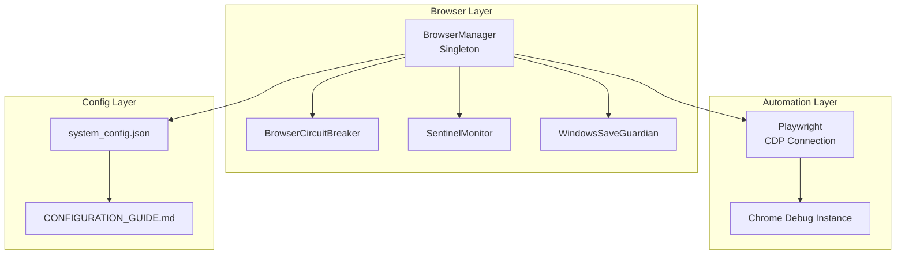
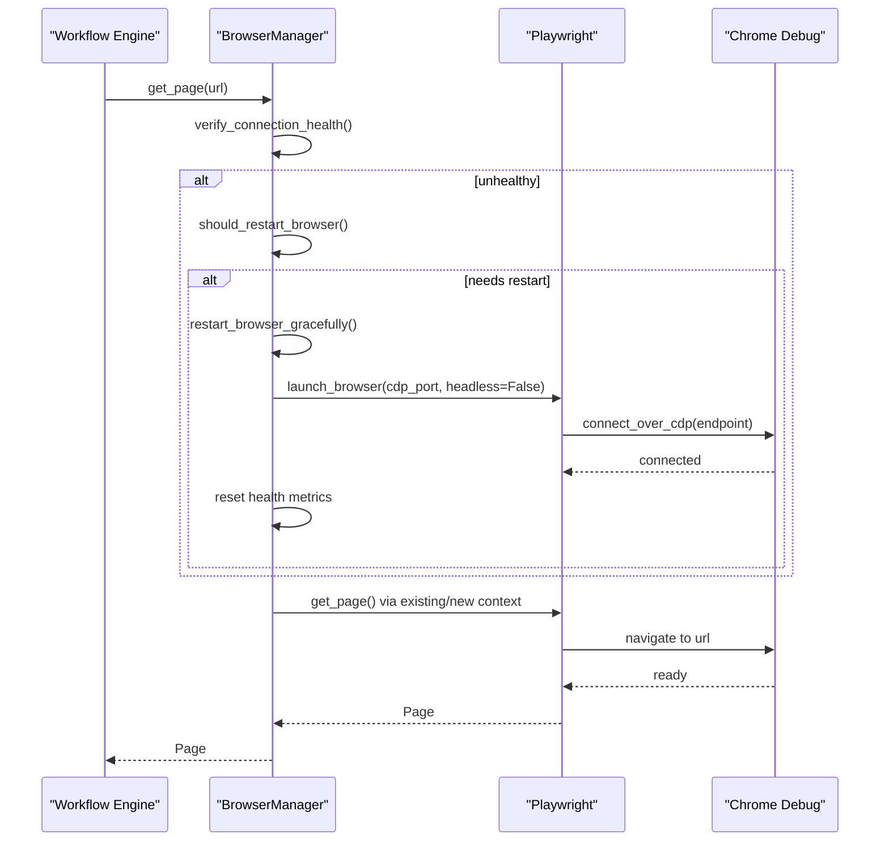
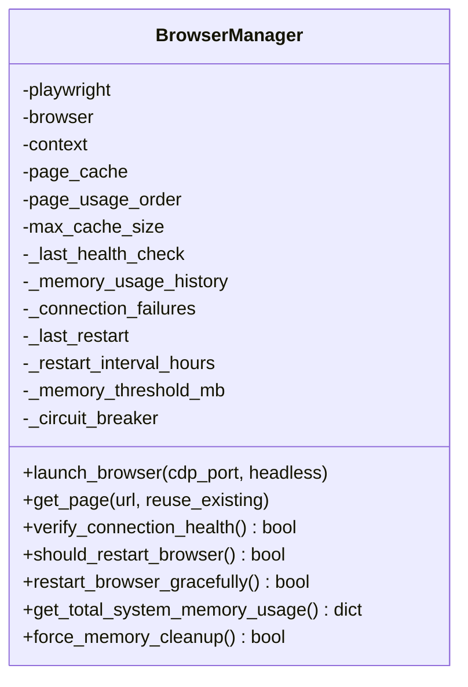
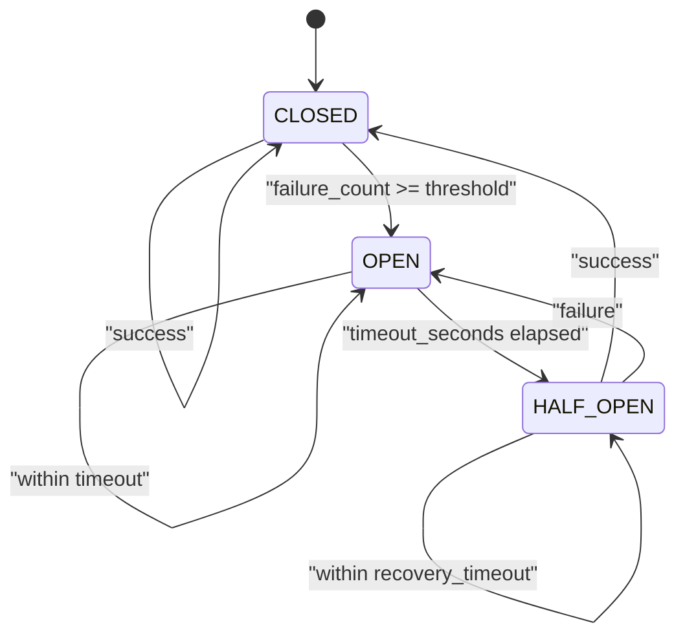
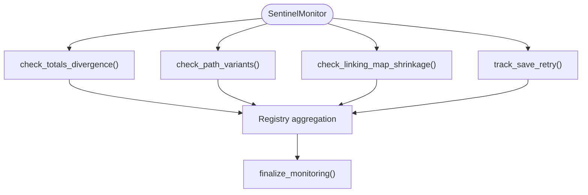
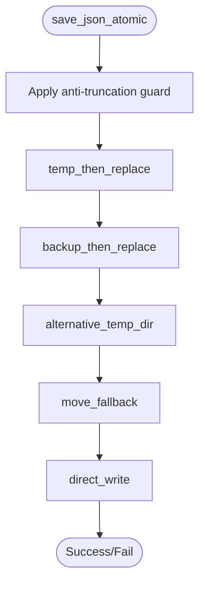
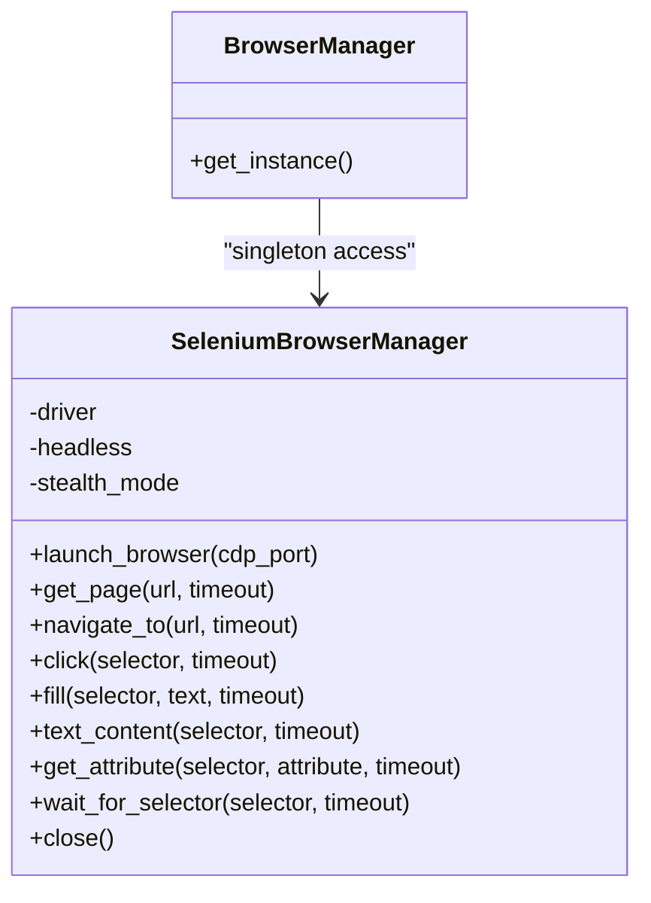
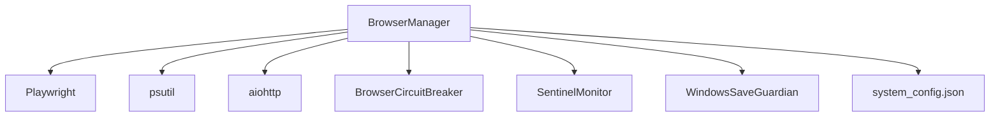

# Browser Manager

<cite>
**Referenced Files in This Document**
- [browser_manager.py](file://utils/browser_manager.py)
- [browser_circuit_breaker.py](file://utils/browser_circuit_breaker.py)
- [sentinel_monitor.py](file://utils/sentinel_monitor.py)
- [windows_save_guardian.py](file://utils/windows_save_guardian.py)
- [selenium_browser_manager.py](file://tools/selenium_browser_manager.py)
- [system_config.json](file://config/system_config.json)
- [CONFIGURATION_GUIDE.md](file://docs/CONFIGURATION_GUIDE.md)
- [TROUBLESHOOTING.md](file://docs/TROUBLESHOOTING.md)
- [browser_manager_chrome_cdp_comprehensive_fixes.md](file://memories/browser_manager_chrome_cdp_comprehensive_fixes.md)
- [chrome_browser_management_status_prompt.md](file://chrome_browser_management_status_prompt.md)
</cite>

## Table of Contents
1. [Introduction](#introduction)
2. [Project Structure](#project-structure)
3. [Core Components](#core-components)
4. [Architecture Overview](#architecture-overview)
5. [Detailed Component Analysis](#detailed-component-analysis)
6. [Dependency Analysis](#dependency-analysis)
7. [Performance Considerations](#performance-considerations)
8. [Troubleshooting Guide](#troubleshooting-guide)
9. [Conclusion](#conclusion)
10. [Appendices](#appendices)

## Introduction
This document provides comprehensive technical documentation for the Browser Manager component responsible for Chrome automation health and stability in the Amazon FBA Agent System. It explains the circuit breaker protection system, automatic restart capabilities, memory monitoring for long-running sessions, Windows-native memory management integration, Chrome process control, and WebSocket connection stability. It also details the sentinel monitoring system for detecting and recovering from browser failures, and provides practical examples of browser configuration, memory optimization techniques, and troubleshooting browser connectivity issues. Finally, it describes how browser health directly impacts overall system reliability and performance and how the Browser Manager integrates with the workflow engine.

## Project Structure
The Browser Manager is implemented as a singleton utility that centralizes browser lifecycle management and provides health monitoring, memory management, and restart capabilities. It integrates with:
- Playwright for Chrome automation via CDP (Chrome DevTools Protocol)
- A circuit breaker for operation resilience
- A sentinel monitor for workflow-level anomaly detection
- Windows-specific atomic save utilities for robust persistence
- Configuration-driven settings for Chrome behavior and timeouts

**Diagram sources**
- [browser_manager.py](file://utils/browser_manager.py#L35-L120)
- [browser_circuit_breaker.py](file://utils/browser_circuit_breaker.py#L37-L70)
- [sentinel_monitor.py](file://utils/sentinel_monitor.py#L63-L90)
- [windows_save_guardian.py](file://utils/windows_save_guardian.py#L26-L44)
- [system_config.json](file://config/system_config.json#L200-L207)
- [CONFIGURATION_GUIDE.md](file://docs/CONFIGURATION_GUIDE.md#L130-L143)

**Section sources**
- [browser_manager.py](file://utils/browser_manager.py#L1-L120)
- [system_config.json](file://config/system_config.json#L200-L207)

## Core Components
- BrowserManager: Centralized singleton managing a persistent Chrome instance via CDP, with LRU page caching, health checks, memory monitoring, and graceful restarts.
- BrowserCircuitBreaker: Implements circuit breaker pattern to prevent cascading failures during extended sessions.
- SentinelMonitor: Lightweight runtime monitor surfacing suspicious state transitions for workflow integrity.
- WindowsSaveGuardian: Atomic persistence layer for Windows environments to avoid WinError 5 and file locking issues.
- SeleniumBrowserManager (tools): Alternative browser manager for environments where Playwright/Codex is not used.

Key responsibilities:
- Maintain a single Chrome instance across the workflow
- Detect and recover from connection instability
- Enforce memory thresholds and trigger cleanup/restarts
- Provide diagnostic and troubleshooting hooks
- Integrate with configuration and environment variables

**Section sources**
- [browser_manager.py](file://utils/browser_manager.py#L35-L120)
- [browser_circuit_breaker.py](file://utils/browser_circuit_breaker.py#L37-L70)
- [sentinel_monitor.py](file://utils/sentinel_monitor.py#L63-L90)
- [windows_save_guardian.py](file://utils/windows_save_guardian.py#L26-L44)
- [selenium_browser_manager.py](file://tools/selenium_browser_manager.py#L17-L25)

## Architecture Overview
The Browser Manager orchestrates Chrome automation with resilience and observability. It connects to an existing Chrome debug instance (preferred) or falls back to a bundled Chromium instance. It monitors health, enforces restart policies, and coordinates with the workflow engine through a singleton interface.

**Diagram sources**
- [browser_manager.py](file://utils/browser_manager.py#L141-L198)
- [browser_manager.py](file://utils/browser_manager.py#L885-L938)
- [browser_manager.py](file://utils/browser_manager.py#L985-L1018)

## Detailed Component Analysis

### BrowserManager
The BrowserManager is a singleton that:
- Connects to an existing Chrome debug instance via CDP (preferred) or launches a bundled Chromium instance
- Manages a persistent context and page lifecycle with LRU caching
- Performs health checks, memory monitoring, and automatic restarts
- Integrates with the circuit breaker for operation safety

Key methods and behaviors:
- launch_browser(cdp_port, headless): Validates debug port accessibility, selects IPv6/IPv4 endpoints, and connects to Chrome
- get_page(url, reuse_existing): Returns cached or existing page; applies circuit breaker to navigation
- verify_connection_health(): Lightweight check to ensure CDP connection stability
- should_restart_browser(): Decision logic based on time intervals, memory thresholds, and connection failures
- restart_browser_gracefully(): Graceful restart preserving session state
- get_total_system_memory_usage(): Windows-aware memory reporting for Chrome, Python, and Node.js
- force_memory_cleanup(): Aggressive cleanup for supplier scraping operations

**Diagram sources**
- [browser_manager.py](file://utils/browser_manager.py#L35-L120)
- [browser_manager.py](file://utils/browser_manager.py#L848-L938)

**Section sources**
- [browser_manager.py](file://utils/browser_manager.py#L77-L140)
- [browser_manager.py](file://utils/browser_manager.py#L141-L198)
- [browser_manager.py](file://utils/browser_manager.py#L848-L938)
- [browser_manager.py](file://utils/browser_manager.py#L985-L1018)
- [browser_manager.py](file://utils/browser_manager.py#L1020-L1068)

### BrowserCircuitBreaker
The circuit breaker protects operations from unstable browser states:
- States: CLOSED (normal), OPEN (blocked), HALF_OPEN (testing recovery)
- Thresholds: failure_threshold, timeout_seconds, recovery_timeout
- Integration: execute_with_breaker wraps navigation and other operations

**Diagram sources**
- [browser_circuit_breaker.py](file://utils/browser_circuit_breaker.py#L104-L129)

**Section sources**
- [browser_circuit_breaker.py](file://utils/browser_circuit_breaker.py#L37-L70)
- [browser_circuit_breaker.py](file://utils/browser_circuit_breaker.py#L72-L111)
- [browser_circuit_breaker.py](file://utils/browser_circuit_breaker.py#L112-L173)

### SentinelMonitor
The sentinel monitor tracks workflow-level anomalies:
- Totals divergence checks
- Path variant tracking
- Linking map shrinkage detection
- Save retry tracking
- Thread-safe aggregation across sessions

**Diagram sources**
- [sentinel_monitor.py](file://utils/sentinel_monitor.py#L79-L110)
- [sentinel_monitor.py](file://utils/sentinel_monitor.py#L112-L132)
- [sentinel_monitor.py](file://utils/sentinel_monitor.py#L134-L155)
- [sentinel_monitor.py](file://utils/sentinel_monitor.py#L158-L177)
- [sentinel_monitor.py](file://utils/sentinel_monitor.py#L180-L191)

**Section sources**
- [sentinel_monitor.py](file://utils/sentinel_monitor.py#L34-L77)
- [sentinel_monitor.py](file://utils/sentinel_monitor.py#L79-L110)
- [sentinel_monitor.py](file://utils/sentinel_monitor.py#L112-L155)
- [sentinel_monitor.py](file://utils/sentinel_monitor.py#L158-L177)
- [sentinel_monitor.py](file://utils/sentinel_monitor.py#L180-L191)

### WindowsSaveGuardian
Windows-specific atomic persistence with multiple fallback strategies:
- Anti-truncation guard for small writes to large files
- Strategy prioritization: temp_then_replace, backup_then_replace, alternative_temp_dir, move_fallback, direct_write
- Telemetry logging for diagnostics

**Diagram sources**
- [windows_save_guardian.py](file://utils/windows_save_guardian.py#L86-L182)
- [windows_save_guardian.py](file://utils/windows_save_guardian.py#L266-L317)
- [windows_save_guardian.py](file://utils/windows_save_guardian.py#L319-L370)
- [windows_save_guardian.py](file://utils/windows_save_guardian.py#L371-L408)
- [windows_save_guardian.py](file://utils/windows_save_guardian.py#L410-L446)
- [windows_save_guardian.py](file://utils/windows_save_guardian.py#L448-L479)

**Section sources**
- [windows_save_guardian.py](file://utils/windows_save_guardian.py#L86-L182)
- [windows_save_guardian.py](file://utils/windows_save_guardian.py#L266-L317)
- [windows_save_guardian.py](file://utils/windows_save_guardian.py#L319-L370)
- [windows_save_guardian.py](file://utils/windows_save_guardian.py#L371-L408)
- [windows_save_guardian.py](file://utils/windows_save_guardian.py#L410-L446)
- [windows_save_guardian.py](file://utils/windows_save_guardian.py#L448-L479)

### SeleniumBrowserManager (tools)
An alternative browser manager for environments where Playwright/Codex is not used:
- Headless/new headless mode, stealth options, and driver management
- Navigation, clicks, fills, and element interactions
- Singleton-like access pattern

**Diagram sources**
- [selenium_browser_manager.py](file://tools/selenium_browser_manager.py#L17-L25)
- [selenium_browser_manager.py](file://tools/selenium_browser_manager.py#L169-L176)

**Section sources**
- [selenium_browser_manager.py](file://tools/selenium_browser_manager.py#L17-L25)
- [selenium_browser_manager.py](file://tools/selenium_browser_manager.py#L26-L79)
- [selenium_browser_manager.py](file://tools/selenium_browser_manager.py#L80-L101)
- [selenium_browser_manager.py](file://tools/selenium_browser_manager.py#L169-L176)

## Dependency Analysis
The Browser Manager integrates with configuration, logging, and external libraries. Key dependencies:
- Playwright for CDP connections and page management
- psutil for Windows-aware memory monitoring
- aiohttp for Chrome debug port verification
- requests for synchronous fallback detection
- Circuit breaker for operation safety
- Sentinel monitor for workflow integrity
- WindowsSaveGuardian for robust persistence

**Diagram sources**
- [browser_manager.py](file://utils/browser_manager.py#L19-L26)
- [browser_manager.py](file://utils/browser_manager.py#L658-L720)
- [browser_manager.py](file://utils/browser_manager.py#L242-L272)
- [browser_circuit_breaker.py](file://utils/browser_circuit_breaker.py#L25-L32)
- [sentinel_monitor.py](file://utils/sentinel_monitor.py#L11-L16)
- [windows_save_guardian.py](file://utils/windows_save_guardian.py#L14-L23)
- [system_config.json](file://config/system_config.json#L200-L207)

**Section sources**
- [browser_manager.py](file://utils/browser_manager.py#L19-L26)
- [browser_manager.py](file://utils/browser_manager.py#L658-L720)
- [browser_manager.py](file://utils/browser_manager.py#L242-L272)
- [browser_circuit_breaker.py](file://utils/browser_circuit_breaker.py#L25-L32)
- [sentinel_monitor.py](file://utils/sentinel_monitor.py#L11-L16)
- [windows_save_guardian.py](file://utils/windows_save_guardian.py#L14-L23)
- [system_config.json](file://config/system_config.json#L200-L207)

## Performance Considerations
- Long-running sessions: Restart every 2.5 hours to prevent connection issues; memory monitoring is enabled but restarts are time-based only
- Memory thresholds: Chrome memory > 2GB triggers monitoring; Python memory > 3GB triggers GC; Node.js memory > 2GB is monitored
- Page caching: LRU cache with max 10 pages; navigation guarded by circuit breaker
- Connection stability: IPv6/IPv4 dual-stack endpoint selection; enhanced compatibility mode for Chrome 139.x
- Windows-specific optimizations: Enhanced Chrome process detection and telemetry

[No sources needed since this section provides general guidance]

## Troubleshooting Guide
Common issues and resolutions:
- Chrome debug port not accessible: Ensure Chrome is launched with debug flags and verify port availability
- Connection failures: Circuit breaker activation indicates unstable state; wait for automatic recovery
- Memory pressure: Use memory_check_with_cleanup to trigger cleanup; adjust thresholds in configuration
- Windows file save errors: Use WindowsSaveGuardian strategies to avoid WinError 5

Practical commands and checks:
- Manual restart: Invoke graceful restart via BrowserManager singleton
- Circuit breaker status: Monitor logs for breaker state transitions
- Chrome debug verification: Curl endpoints and process checks

**Section sources**
- [TROUBLESHOOTING.md](file://docs/TROUBLESHOOTING.md#L111-L145)
- [browser_manager_chrome_cdp_comprehensive_fixes.md](file://memories/browser_manager_chrome_cdp_comprehensive_fixes.md#L1-L30)
- [browser_manager_chrome_cdp_comprehensive_fixes.md](file://memories/browser_manager_chrome_cdp_comprehensive_fixes.md#L228-L231)
- [chrome_browser_management_status_prompt.md](file://chrome_browser_management_status_prompt.md#L132-L175)

## Conclusion
The Browser Manager provides resilient Chrome automation through persistent connections, health monitoring, circuit breaker protection, and automatic restart mechanisms. Its integration with configuration, memory management, and Windows-specific persistence ensures stability for long-running supplier scraping workflows. The sentinel monitor further strengthens reliability by surfacing anomalies. Together, these components maintain system reliability and performance across extended processing sessions.

[No sources needed since this section summarizes without analyzing specific files]

## Appendices

### Browser Configuration Examples
- Chrome debug port and headless mode: Defined in system configuration and environment variables
- Extensions: Keepa and SellerAmp configured for enhanced automation
- Timeouts: Navigation and page load timeouts configured for stability

**Section sources**
- [system_config.json](file://config/system_config.json#L200-L207)
- [CONFIGURATION_GUIDE.md](file://docs/CONFIGURATION_GUIDE.md#L130-L143)
- [CONFIGURATION_GUIDE.md](file://docs/CONFIGURATION_GUIDE.md#L255-L283)

### Memory Optimization Techniques
- Time-based restarts: Every 2.5 hours to prevent resource drift
- Aggressive cleanup: Clear caches and force garbage collection
- Threshold monitoring: Chrome, Python, and system memory percent thresholds
- Anti-truncation guard: Prevents data loss during incremental writes

**Section sources**
- [browser_manager.py](file://utils/browser_manager.py#L885-L938)
- [browser_manager.py](file://utils/browser_manager.py#L940-L977)
- [windows_save_guardian.py](file://utils/windows_save_guardian.py#L183-L219)

### Integration with Workflow Engine
- Singleton access: BrowserManager.get_instance() ensures shared state
- Page reuse: LRU caching reduces overhead and improves throughput
- Health gating: Operations are gated by health checks and circuit breaker
- Graceful restarts: Preserve session state while refreshing connections

**Section sources**
- [browser_manager.py](file://utils/browser_manager.py#L71-L76)
- [browser_manager.py](file://utils/browser_manager.py#L141-L198)
- [browser_manager.py](file://utils/browser_manager.py#L985-L1018)