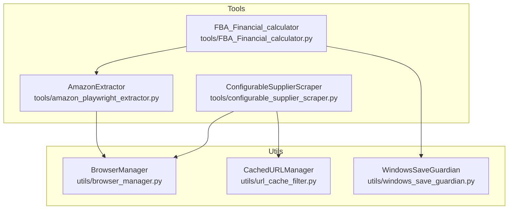
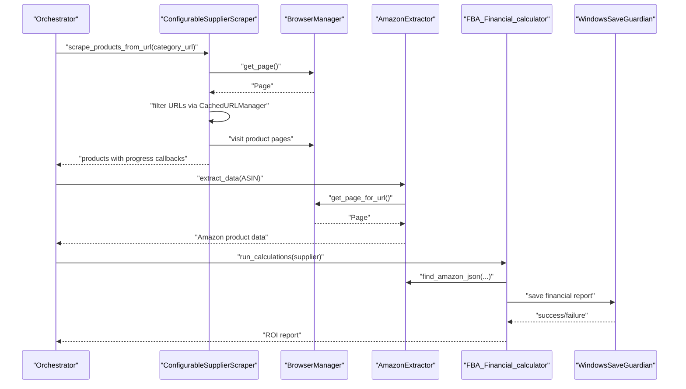
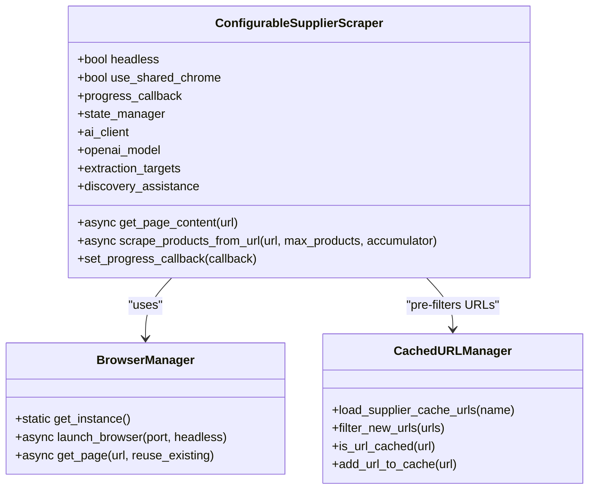
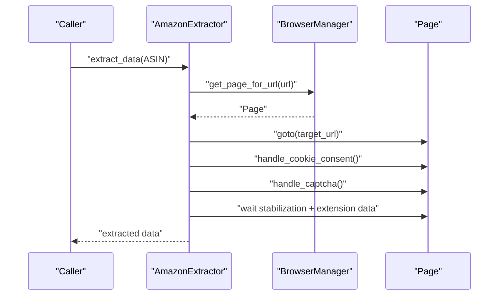
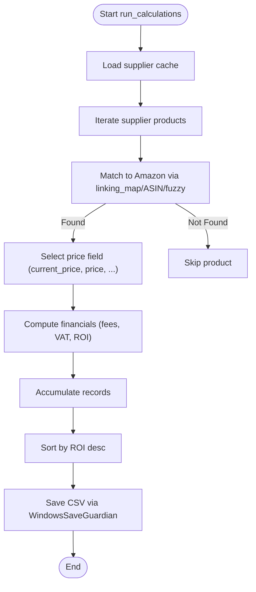
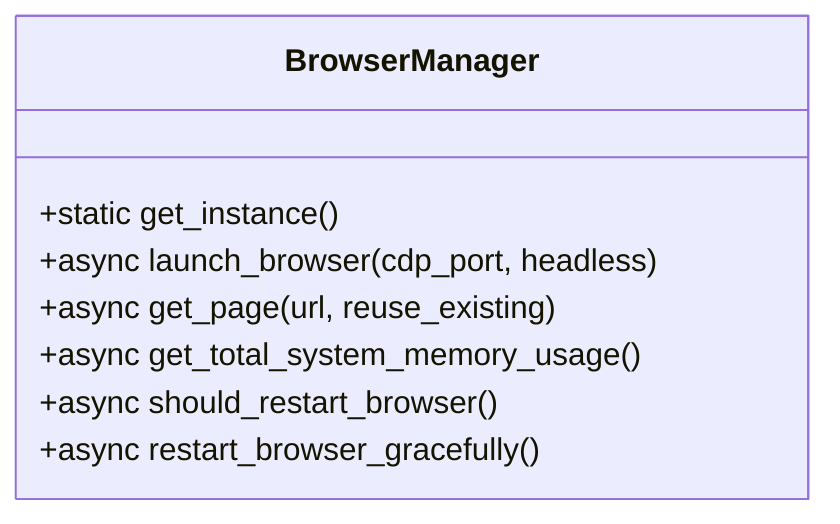
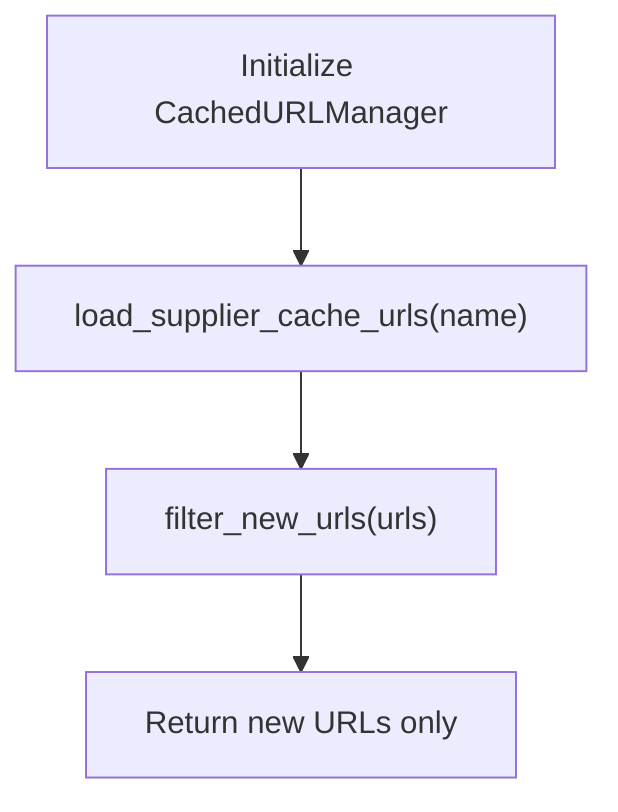
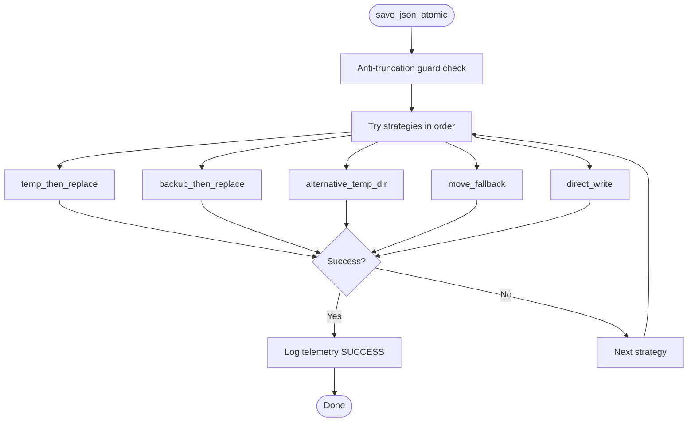
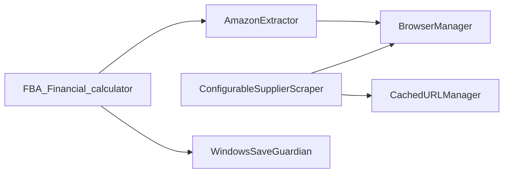

# Core Components

<cite>
**Referenced Files in This Document**
- [configurable_supplier_scraper.py](file://tools/configurable_supplier_scraper.py)
- [amazon_playwright_extractor.py](file://tools/amazon_playwright_extractor.py)
- [FBA_Financial_calculator.py](file://tools/FBA_Financial_calculator.py)
- [browser_manager.py](file://utils/browser_manager.py)
- [url_cache_filter.py](file://utils/url_cache_filter.py)
- [windows_save_guardian.py](file://utils/windows_save_guardian.py)
</cite>

## Table of Contents
1. [Introduction](#introduction)
2. [Project Structure](#project-structure)
3. [Core Components](#core-components)
4. [Architecture Overview](#architecture-overview)
5. [Detailed Component Analysis](#detailed-component-analysis)
6. [Dependency Analysis](#dependency-analysis)
7. [Performance Considerations](#performance-considerations)
8. [Troubleshooting Guide](#troubleshooting-guide)
9. [Conclusion](#conclusion)

## Introduction
This document explains the core components of the Amazon FBA Agent System v3.7+ with a focus on the workflow execution chain, supplier scraper with URL filtering, Amazon data extractor with Playwright automation, financial calculator for ROI analysis, and the browser manager for Chrome health management. It also covers smart memory management, file-based progress tracking, and Windows-native support features. Practical usage guidance, configuration options, and troubleshooting tips are included for each component.

## Project Structure
The system is organized around modular tools and utilities:
- tools: Orchestration scripts for supplier scraping, Amazon extraction, and financial analysis
- utils: Shared utilities for browser management, URL filtering, and Windows-safe file persistence

**Diagram sources**
- [configurable_supplier_scraper.py](file://tools/configurable_supplier_scraper.py#L82-L167)
- [amazon_playwright_extractor.py](file://tools/amazon_playwright_extractor.py#L63-L122)
- [FBA_Financial_calculator.py](file://tools/FBA_Financial_calculator.py#L1-L712)
- [browser_manager.py](file://utils/browser_manager.py#L35-L75)
- [url_cache_filter.py](file://utils/url_cache_filter.py#L31-L48)
- [windows_save_guardian.py](file://utils/windows_save_guardian.py#L26-L44)

**Section sources**
- [configurable_supplier_scraper.py](file://tools/configurable_supplier_scraper.py#L1-L175)
- [amazon_playwright_extractor.py](file://tools/amazon_playwright_extractor.py#L1-L122)
- [FBA_Financial_calculator.py](file://tools/FBA_Financial_calculator.py#L1-L70)
- [browser_manager.py](file://utils/browser_manager.py#L1-L75)
- [url_cache_filter.py](file://utils/url_cache_filter.py#L1-L48)
- [windows_save_guardian.py](file://utils/windows_save_guardian.py#L1-L44)

## Core Components
- ConfigurableSupplierScraper: Robust supplier site scraping with Playwright, selector-driven extraction, AI fallbacks, and integrated URL filtering/cache.
- AmazonExtractor: Playwright-based Amazon data extraction with cookie consent handling, CAPTCHA resolution pathways, and extension data retrieval.
- FBA_Financial_calculator: ROI and profitability analysis using Amazon scrape data, linking map lookups, and configurable fee/VAT settings.
- BrowserManager: Centralized Chrome management with LRU page caching, health monitoring, and compatibility modes for Chrome 139+.
- CachedURLManager: High-performance URL pre-filtering to avoid redundant scraping using in-memory sets.
- WindowsSaveGuardian: Atomic file persistence with multiple fallback strategies to resolve WinError 5 and truncation risks on Windows.

**Section sources**
- [configurable_supplier_scraper.py](file://tools/configurable_supplier_scraper.py#L82-L167)
- [amazon_playwright_extractor.py](file://tools/amazon_playwright_extractor.py#L63-L122)
- [FBA_Financial_calculator.py](file://tools/FBA_Financial_calculator.py#L16-L75)
- [browser_manager.py](file://utils/browser_manager.py#L35-L75)
- [url_cache_filter.py](file://utils/url_cache_filter.py#L31-L48)
- [windows_save_guardian.py](file://utils/windows_save_guardian.py#L26-L44)

## Architecture Overview
The system integrates supplier scraping, Amazon data extraction, and financial analysis through a shared browser manager and common output directories. Smart memory management and URL filtering optimize throughput and reduce redundant work. Windows-specific safeguards protect file integrity during concurrent writes.

**Diagram sources**
- [configurable_supplier_scraper.py](file://tools/configurable_supplier_scraper.py#L477-L771)
- [amazon_playwright_extractor.py](file://tools/amazon_playwright_extractor.py#L317-L466)
- [FBA_Financial_calculator.py](file://tools/FBA_Financial_calculator.py#L472-L664)
- [browser_manager.py](file://utils/browser_manager.py#L141-L198)
- [windows_save_guardian.py](file://utils/windows_save_guardian.py#L86-L182)

## Detailed Component Analysis

### ConfigurableSupplierScraper
Role:
- Scrapes supplier sites using Playwright with anti-bot evasion and dynamic content handling.
- Integrates selector-driven extraction with AI fallbacks and authentication callbacks.
- Implements URL pre-filtering and memory-conscious processing for long-running runs.

Key behaviors:
- Centralized browser management via BrowserManager singleton.
- URL classification using CachedURLManager to distinguish new vs cached/processed URLs.
- Real-time progress reporting via callback and periodic memory cleanup.
- Price filtering and normalization, with debounced state updates.

**Diagram sources**
- [configurable_supplier_scraper.py](file://tools/configurable_supplier_scraper.py#L82-L167)
- [browser_manager.py](file://utils/browser_manager.py#L35-L75)
- [url_cache_filter.py](file://utils/url_cache_filter.py#L31-L48)

Practical usage:
- Initialize with headless mode, shared Chrome, and optional AI client.
- Provide progress_callback to integrate with workflow dashboards.
- Use scrape_products_from_url with max_products and an accumulator list for live updates.

Configuration options:
- system_config.json controls AI model, extraction targets, discovery assistance, and processing limits (e.g., max_price_gbp).
- Environment variables for Playwright and OpenAI models.

Memory and performance:
- Periodic forced cleanup and local list trimming to prevent memory accumulation.
- Background-friendly navigation and page reuse to reduce overhead.

**Section sources**
- [configurable_supplier_scraper.py](file://tools/configurable_supplier_scraper.py#L90-L167)
- [configurable_supplier_scraper.py](file://tools/configurable_supplier_scraper.py#L477-L771)
- [configurable_supplier_scraper.py](file://tools/configurable_supplier_scraper.py#L772-L800)

### AmazonExtractor
Role:
- Extracts comprehensive Amazon product data using Playwright and a shared Chrome instance.
- Handles cookie consent, CAPTCHA (manual and AI-assisted), and extension data (SellerAmp/Keepa).

Key behaviors:
- Connects via BrowserManager singleton and applies background-mode navigation to avoid focus issues.
- Validates ASIN format, navigates to product pages, and stabilizes post-navigation.
- Extracts title, price, images, sales rank, ratings, features, description, specifications, and extension data.
- Integrates Keepa/SellerAmp fallbacks for EAN, BSR, and price.

**Diagram sources**
- [amazon_playwright_extractor.py](file://tools/amazon_playwright_extractor.py#L317-L466)
- [browser_manager.py](file://utils/browser_manager.py#L141-L198)

Practical usage:
- Provide ASIN; optionally supply a page object for reuse.
- Enable DEBUG_SCREENSHOTS via environment variable for diagnostics.

Configuration options:
- OPENAI_API_KEY and OPENAI_MODEL_AMAZON_EXTRACTOR environment variables.
- Output directory for debug artifacts controlled by file manager or fallback path.

**Section sources**
- [amazon_playwright_extractor.py](file://tools/amazon_playwright_extractor.py#L63-L122)
- [amazon_playwright_extractor.py](file://tools/amazon_playwright_extractor.py#L317-L466)

### FBA_Financial_calculator
Role:
- Computes ROI and profitability using Amazon scrape data and supplier caches.
- Integrates linking maps for robust supplier-to-Amazon matching.

Key behaviors:
- Loads system configuration (VAT, fees) and supplier-specific paths.
- Finds Amazon JSON via linking map, ASIN, or fuzzy matching.
- Calculates net proceeds, net profit, ROI, breakeven, and profit margin.
- Generates CSV reports sorted by ROI and computes profitability counts.

**Diagram sources**
- [FBA_Financial_calculator.py](file://tools/FBA_Financial_calculator.py#L472-L664)
- [windows_save_guardian.py](file://utils/windows_save_guardian.py#L86-L182)

Practical usage:
- Call run_calculations with supplier_name and optional paths.
- Review statistics and top-5 by ROI in console output.

Configuration options:
- system_config.json for VAT rates, referral fee rate, fulfillment fee, prep house fee.
- analysis.min_roi_percent for profitability thresholds.

**Section sources**
- [FBA_Financial_calculator.py](file://tools/FBA_Financial_calculator.py#L44-L75)
- [FBA_Financial_calculator.py](file://tools/FBA_Financial_calculator.py#L472-L664)

### BrowserManager
Role:
- Singleton browser manager coordinating a shared Chrome instance via CDP.
- Provides LRU page caching, health monitoring, and compatibility modes for Chrome 139+.

Key behaviors:
- Connects to existing Chrome debug instance (IPv6/IPv4 dual-stack).
- Enforces background-friendly navigation and page reuse.
- Monitors memory usage and schedules periodic restarts to prevent connection issues.
- Offers fallbacks to bundled Chromium when user Chrome is unavailable.

**Diagram sources**
- [browser_manager.py](file://utils/browser_manager.py#L35-L75)

Practical usage:
- Use get_instance() to obtain the singleton and call launch_browser with the debug port.
- Retrieve pages via get_page() for scrapers and extractors.

Configuration options:
- Chrome debug port (default 9222) and user data directory as per documentation.
- Health thresholds and restart intervals are internal defaults.

**Section sources**
- [browser_manager.py](file://utils/browser_manager.py#L77-L140)
- [browser_manager.py](file://utils/browser_manager.py#L141-L198)
- [browser_manager.py](file://utils/browser_manager.py#L658-L800)

### CachedURLManager
Role:
- Efficiently filters URLs to avoid redundant scraping using in-memory sets.
- Loads supplier cache files and linking maps for comprehensive pre-filtering.

Key behaviors:
- O(1) URL lookup via hash-based sets.
- Real-time cache updates and statistics.
- Integration with supplier cache and linking map paths.

**Diagram sources**
- [url_cache_filter.py](file://utils/url_cache_filter.py#L31-L48)
- [url_cache_filter.py](file://utils/url_cache_filter.py#L153-L171)

Practical usage:
- Obtain manager via get_cached_url_manager(output_root).
- Load supplier cache and filter product URLs before scraping.

**Section sources**
- [url_cache_filter.py](file://utils/url_cache_filter.py#L49-L103)
- [url_cache_filter.py](file://utils/url_cache_filter.py#L153-L171)

### WindowsSaveGuardian
Role:
- Ensures atomic, safe file persistence on Windows to avoid WinError 5 and truncation.
- Implements multiple fallback strategies with telemetry logging.

Key behaviors:
- Anti-truncation guard merges new data with existing large files.
- Strategies: temp_then_replace, backup_then_replace, alternative_temp_dir, move_fallback, direct_write.
- Telemetry logs per strategy outcomes for diagnostics.

**Diagram sources**
- [windows_save_guardian.py](file://utils/windows_save_guardian.py#L86-L182)

Practical usage:
- Use save_json_atomic(path, data) for robust file writes.
- Review telemetry logs in OUTPUTS/DIAGNOSTICS/save_telemetry.log.

**Section sources**
- [windows_save_guardian.py](file://utils/windows_save_guardian.py#L86-L182)
- [windows_save_guardian.py](file://utils/windows_save_guardian.py#L515-L609)

## Dependency Analysis
The components are loosely coupled through shared utilities and common output directories. The workflow relies on BrowserManager for Chrome coordination and CachedURLManager for efficiency.

**Diagram sources**
- [configurable_supplier_scraper.py](file://tools/configurable_supplier_scraper.py#L32-L42)
- [amazon_playwright_extractor.py](file://tools/amazon_playwright_extractor.py#L21-L30)
- [FBA_Financial_calculator.py](file://tools/FBA_Financial_calculator.py#L10-L14)
- [browser_manager.py](file://utils/browser_manager.py#L23-L24)
- [url_cache_filter.py](file://utils/url_cache_filter.py#L22-L27)
- [windows_save_guardian.py](file://utils/windows_save_guardian.py#L14-L24)

**Section sources**
- [configurable_supplier_scraper.py](file://tools/configurable_supplier_scraper.py#L32-L42)
- [amazon_playwright_extractor.py](file://tools/amazon_playwright_extractor.py#L21-L30)
- [FBA_Financial_calculator.py](file://tools/FBA_Financial_calculator.py#L10-L14)
- [browser_manager.py](file://utils/browser_manager.py#L23-L24)
- [url_cache_filter.py](file://utils/url_cache_filter.py#L22-L27)
- [windows_save_guardian.py](file://utils/windows_save_guardian.py#L14-L24)

## Performance Considerations
- BrowserManager enforces a single-page model and LRU caching to reduce overhead and extension-related instability.
- ConfigurableSupplierScraper performs periodic memory cleanup and local list trimming to mitigate memory growth during long runs.
- CachedURLManager uses hash-based sets for O(1) duplicate detection, dramatically reducing unnecessary page visits.
- WindowsSaveGuardian’s anti-truncation guard prevents partial writes and merges data safely for large files.

[No sources needed since this section provides general guidance]

## Troubleshooting Guide
Common issues and resolutions:
- Chrome debug port accessibility:
  - Ensure Chrome is launched with --remote-debugging-port and --user-data-dir as documented.
  - Use BrowserManager’s built-in verification and troubleshooting steps.
- WinError 5 on Windows:
  - Use WindowsSaveGuardian.save_json_atomic to apply atomic write strategies.
  - Review telemetry logs for strategy outcomes.
- Supplier scraping hangs or slow progress:
  - Confirm BrowserManager health checks and restarts are occurring.
  - Verify URL pre-filtering is active via CachedURLManager.
- Amazon extraction CAPTCHA or cookie consent:
  - Manual resolution is supported; AI-assisted CAPTCHA solving is available when configured.

**Section sources**
- [browser_manager.py](file://utils/browser_manager.py#L302-L315)
- [browser_manager.py](file://utils/browser_manager.py#L623-L657)
- [windows_save_guardian.py](file://utils/windows_save_guardian.py#L86-L182)
- [amazon_playwright_extractor.py](file://tools/amazon_playwright_extractor.py#L123-L161)
- [configurable_supplier_scraper.py](file://tools/configurable_supplier_scraper.py#L514-L575)

## Conclusion
The Amazon FBA Agent System v3.7+ integrates robust browser management, efficient URL filtering, Playwright-powered extraction, and Windows-safe persistence to deliver scalable supplier-to-Amazon analysis. The components collaborate through shared utilities and configuration, enabling reliable ROI computations and resilient file handling even under heavy loads.

[No sources needed since this section summarizes without analyzing specific files]