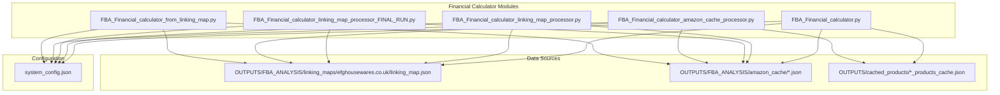
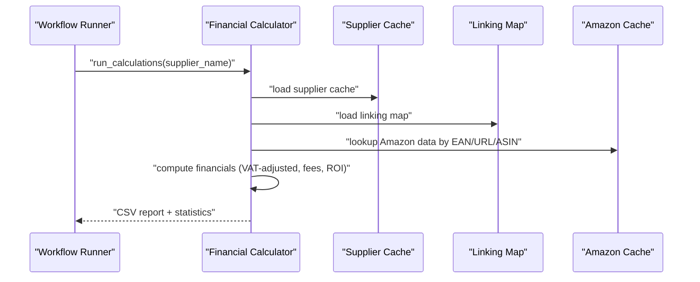
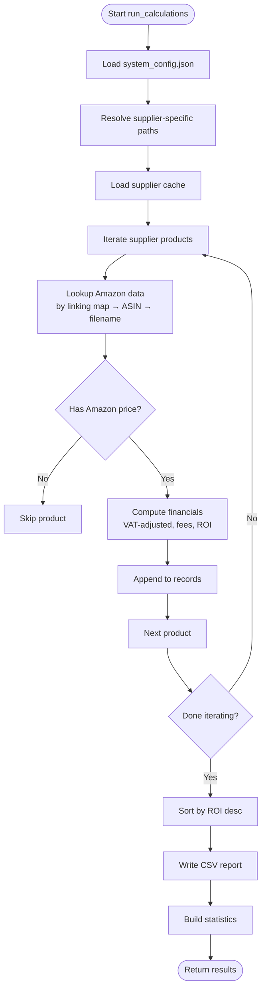
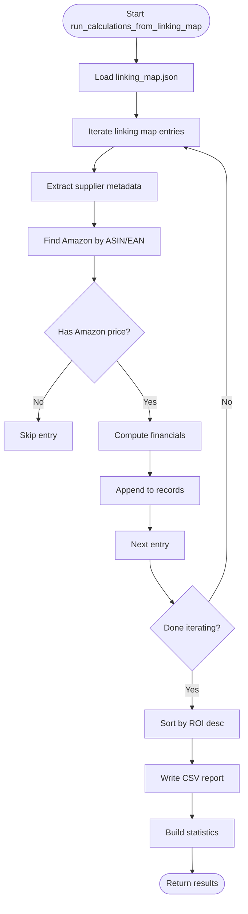
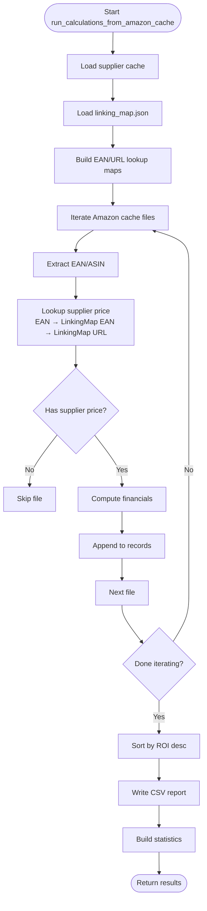
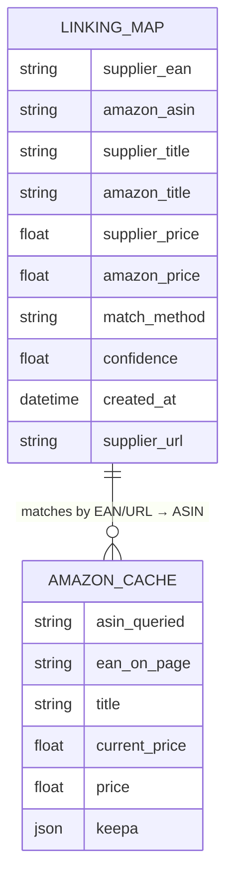
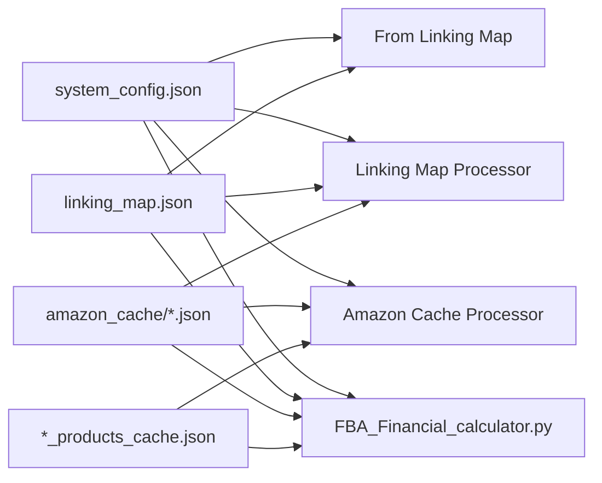

# Financial Calculator

<cite>
**Referenced Files in This Document**
- [FBA_Financial_calculator.py](file://tools/FBA_Financial_calculator.py)
- [FBA_Financial_calculator_linking_map_processor.py](file://tools/FBA_Financial_calculator_linking_map_processor.py)
- [FBA_Financial_calculator_from_linking_map.py](file://tools/FBA_Financial_calculator_from_linking_map.py)
- [FBA_Financial_calculator_amazon_cache_processor.py](file://tools/FBA_Financial_calculator_amazon_cache_processor.py)
- [FBA_Financial_calculator_linking_map_processor_FINAL_RUN.py](file://tools/FBA_Financial_calculator_linking_map_processor_FINAL_RUN.py)
- [system_config.json](file://config/system_config.json)
- [linking_map.json](file://OUTPUTS/FBA_ANALYSIS/linking_maps/efghousewares.co.uk/linking_map.json)
</cite>

## Table of Contents
1. [Introduction](#introduction)
2. [Project Structure](#project-structure)
3. [Core Components](#core-components)
4. [Architecture Overview](#architecture-overview)
5. [Detailed Component Analysis](#detailed-component-analysis)
6. [Dependency Analysis](#dependency-analysis)
7. [Performance Considerations](#performance-considerations)
8. [Troubleshooting Guide](#troubleshooting-guide)
9. [Conclusion](#conclusion)
10. [Appendices](#appendices)

## Introduction
This document describes the Financial Calculator component responsible for FBA profitability analysis and ROI calculations. It explains fee structure computations, cost analysis algorithms, automated report generation, integration with linking maps for supplier–Amazon product matching, VAT adjustment calculations, and investment screening criteria. It also documents configurable financial report generation and how financial calculations integrate with the broader workflow execution.

## Project Structure
The Financial Calculator comprises several specialized processors that operate on different data sources:
- Central calculator engine that orchestrates supplier cache, linking map, and Amazon cache integration
- Linking map processor that generates reports directly from linking map entries
- Linking map processor (final run) variant for complete linking map datasets
- Amazon cache processor that matches all cached Amazon files against supplier data
- Configuration loader that supplies VAT rates, fee defaults, and analysis thresholds

**Diagram sources**
- [FBA_Financial_calculator.py](file://tools/FBA_Financial_calculator.py#L1-L712)
- [FBA_Financial_calculator_linking_map_processor.py](file://tools/FBA_Financial_calculator_linking_map_processor.py#L1-L429)
- [FBA_Financial_calculator_linking_map_processor_FINAL_RUN.py](file://tools/FBA_Financial_calculator_linking_map_processor_FINAL_RUN.py#L1-L436)
- [FBA_Financial_calculator_amazon_cache_processor.py](file://tools/FBA_Financial_calculator_amazon_cache_processor.py#L1-L455)
- [FBA_Financial_calculator_from_linking_map.py](file://tools/FBA_Financial_calculator_from_linking_map.py#L1-L408)
- [system_config.json](file://config/system_config.json#L208-L246)
- [linking_map.json](file://OUTPUTS/FBA_ANALYSIS/linking_maps/efghousewares.co.uk/linking_map.json#L1-L38)

**Section sources**
- [FBA_Financial_calculator.py](file://tools/FBA_Financial_calculator.py#L1-L712)
- [system_config.json](file://config/system_config.json#L208-L246)

## Core Components
- Central Financial Calculator Engine
  - Loads system configuration (VAT rate, fee defaults, analysis thresholds)
  - Integrates supplier cache, linking map, and Amazon cache
  - Computes profitability metrics and generates CSV reports
  - Provides statistics and top performers by ROI

- Linking Map Processors
  - Process linking map entries directly to produce financial reports
  - Support variants for standard linking map and complete dataset
  - Extract enhanced metrics and compute ROI without supplier cache dependency

- Amazon Cache Processor
  - Matches all Amazon cache files against supplier cache and linking map
  - Builds supplier–Amazon associations via EAN and URL mappings
  - Generates comprehensive financial reports across cached Amazon data

- Configuration and Thresholds
  - System configuration defines VAT rate, referral fee rate, fulfillment fee minimum, prep house fee, and analysis thresholds
  - Analysis thresholds drive investment screening (e.g., minimum ROI percent)

**Section sources**
- [FBA_Financial_calculator.py](file://tools/FBA_Financial_calculator.py#L44-L712)
- [FBA_Financial_calculator_linking_map_processor.py](file://tools/FBA_Financial_calculator_linking_map_processor.py#L227-L382)
- [FBA_Financial_calculator_from_linking_map.py](file://tools/FBA_Financial_calculator_from_linking_map.py#L219-L360)
- [FBA_Financial_calculator_amazon_cache_processor.py](file://tools/FBA_Financial_calculator_amazon_cache_processor.py#L191-L409)
- [system_config.json](file://config/system_config.json#L208-L246)

## Architecture Overview
The Financial Calculator integrates three data streams:
- Supplier cache: provides supplier product pricing and metadata
- Linking map: persistent supplier–Amazon associations with EAN/URL and match metadata
- Amazon cache: scraped product data including pricing and Keepa-derived fees

**Diagram sources**
- [FBA_Financial_calculator.py](file://tools/FBA_Financial_calculator.py#L472-L664)
- [system_config.json](file://config/system_config.json#L208-L246)

## Detailed Component Analysis

### Central Financial Calculator Engine
Responsibilities:
- Load system configuration (VAT, referral fee rate, fulfillment fee minimum, prep house fee)
- Resolve Amazon data via linking map (preferred), ASIN, or legacy filename matching
- Compute VAT-adjusted costs and profitability metrics
- Generate CSV reports sorted by ROI and provide statistics

Key algorithms:
- Fee extraction from Keepa product details tab
- Enhanced metrics extraction (monthly sales badge, offer counts, seller counts)
- Financial computation:
  - Convert prices to ex-VAT for economic consistency
  - Compute net proceeds, net profit, ROI, profit margin, and breakeven
  - Apply VAT adjustments for input/output VAT and HMRC considerations

Integration points:
- Supplier cache path resolution per supplier
- Linking map path resolution per supplier
- Amazon cache directory scanning and filename parsing

**Diagram sources**
- [FBA_Financial_calculator.py](file://tools/FBA_Financial_calculator.py#L472-L664)

**Section sources**
- [FBA_Financial_calculator.py](file://tools/FBA_Financial_calculator.py#L44-L712)

### Linking Map Processor
Responsibilities:
- Generate financial reports using linking map as the primary data source
- Extract supplier metadata directly from linking map entries
- Locate Amazon data by ASIN with EAN-enhanced filename matching
- Compute financial metrics and produce CSV with statistics

Processing logic:
- Load linking map and iterate entries
- Extract supplier price, title, URL from linking map
- Find Amazon JSON by ASIN and EAN
- Compute financials and append to records
- Sort by ROI and write CSV

**Diagram sources**
- [FBA_Financial_calculator_linking_map_processor.py](file://tools/FBA_Financial_calculator_linking_map_processor.py#L227-L382)

**Section sources**
- [FBA_Financial_calculator_linking_map_processor.py](file://tools/FBA_Financial_calculator_linking_map_processor.py#L227-L382)

### Linking Map Processor (Final Run Variant)
Highlights:
- Uses a complete linking map dataset file path
- Operates similarly to standard linking map processor but targets a consolidated dataset
- Emphasizes processing all linking map entries regardless of current cache state

**Section sources**
- [FBA_Financial_calculator_linking_map_processor_FINAL_RUN.py](file://tools/FBA_Financial_calculator_linking_map_processor_FINAL_RUN.py#L233-L389)

### Amazon Cache Processor
Responsibilities:
- Process all Amazon cache files and match them with supplier data
- Build supplier–Amazon associations via EAN and URL mappings from linking map and supplier cache
- Generate comprehensive financial reports across cached Amazon data

Processing logic:
- Load supplier cache and linking map
- Build EAN and URL lookup maps
- Iterate Amazon cache files, extract EAN and ASIN
- Attempt supplier price lookup via EAN, linking map EAN, or linking map URL
- Compute financials and append to records
- Write CSV and statistics

**Diagram sources**
- [FBA_Financial_calculator_amazon_cache_processor.py](file://tools/FBA_Financial_calculator_amazon_cache_processor.py#L191-L409)

**Section sources**
- [FBA_Financial_calculator_amazon_cache_processor.py](file://tools/FBA_Financial_calculator_amazon_cache_processor.py#L191-L409)

### Financial Computation and Metrics
Core computations:
- VAT-adjusted pricing:
  - Supplier price ex-VAT and inc-VAT based on configuration flag
  - Amazon price ex-VAT for economic consistency
- Fees:
  - Referral fee computed from Amazon price and referral fee rate
  - FBA fee from Keepa data if available, otherwise default
  - Prep house fee and shipping cost defaults
- Profitability:
  - Net proceeds = Amazon ex-VAT price minus referral fee minus FBA fee minus supplier ex-VAT price
  - Net profit = Net proceeds minus prep house fee minus shipping cost
  - ROI = (Net profit / Total cost ex-VAT) × 100
  - Profit margin = (Net profit / Amazon ex-VAT price) × 100
  - Breakeven = (1 + VAT rate) × (Supplier ex-VAT + Fees + Prep + Ship)

Enhanced metrics:
- Monthly sales badge
- Offer counts and seller counts from Keepa product details

**Section sources**
- [FBA_Financial_calculator.py](file://tools/FBA_Financial_calculator.py#L375-L470)
- [FBA_Financial_calculator_linking_map_processor.py](file://tools/FBA_Financial_calculator_linking_map_processor.py#L157-L226)
- [FBA_Financial_calculator_from_linking_map.py](file://tools/FBA_Financial_calculator_from_linking_map.py#L150-L218)
- [FBA_Financial_calculator_amazon_cache_processor.py](file://tools/FBA_Financial_calculator_amazon_cache_processor.py#L122-L189)

### Integration with Linking Maps and Supplier Matching
- Primary matching via linking map:
  - Search by EAN or supplier URL within linking map entries
  - Retrieve ASIN and locate corresponding Amazon JSON
- Secondary matching via ASIN:
  - Use EAN-enhanced filename pattern when available
  - Fallback to standard ASIN filename and broad ASIN substring search
- Enhanced metrics extraction:
  - Monthly sales badge
  - Offer counts and seller counts from Keepa product details

**Diagram sources**
- [linking_map.json](file://OUTPUTS/FBA_ANALYSIS/linking_maps/efghousewares.co.uk/linking_map.json#L1-L38)
- [FBA_Financial_calculator.py](file://tools/FBA_Financial_calculator.py#L135-L262)

**Section sources**
- [FBA_Financial_calculator.py](file://tools/FBA_Financial_calculator.py#L135-L262)
- [linking_map.json](file://OUTPUTS/FBA_ANALYSIS/linking_maps/efghousewares.co.uk/linking_map.json#L1-L38)

### Configurable Financial Report Generation and Investment Screening
Configuration-driven behavior:
- Analysis thresholds (e.g., minimum ROI percent) define investment screening criteria
- Financial report batch size controls processing cadence
- Supplier-specific paths ensure reports are organized per supplier

Investment screening:
- Profitable: ROI > configured threshold
- Marginal: 0% < ROI ≤ configured threshold
- Unprofitable: ROI ≤ 0%
- Top 5 by ROI highlighted for executive summaries

**Section sources**
- [system_config.json](file://config/system_config.json#L208-L232)
- [system_config.json](file://config/system_config.json#L29-L30)
- [FBA_Financial_calculator.py](file://tools/FBA_Financial_calculator.py#L641-L664)
- [FBA_Financial_calculator_linking_map_processor.py](file://tools/FBA_Financial_calculator_linking_map_processor.py#L370-L382)
- [FBA_Financial_calculator_from_linking_map.py](file://tools/FBA_Financial_calculator_from_linking_map.py#L348-L360)
- [FBA_Financial_calculator_amazon_cache_processor.py](file://tools/FBA_Financial_calculator_amazon_cache_processor.py#L397-L409)

## Dependency Analysis
Module-level dependencies:
- All processors depend on system configuration for VAT and fee parameters
- Central calculator depends on linking map and Amazon cache for product matching
- Linking map processors depend on linking map and Amazon cache
- Amazon cache processor depends on supplier cache, linking map, and Amazon cache

**Diagram sources**
- [system_config.json](file://config/system_config.json#L208-L246)
- [FBA_Financial_calculator.py](file://tools/FBA_Financial_calculator.py#L44-L712)
- [FBA_Financial_calculator_linking_map_processor.py](file://tools/FBA_Financial_calculator_linking_map_processor.py#L30-L42)
- [FBA_Financial_calculator_amazon_cache_processor.py](file://tools/FBA_Financial_calculator_amazon_cache_processor.py#L30-L42)
- [FBA_Financial_calculator_from_linking_map.py](file://tools/FBA_Financial_calculator_from_linking_map.py#L29-L46)

**Section sources**
- [FBA_Financial_calculator.py](file://tools/FBA_Financial_calculator.py#L44-L712)
- [FBA_Financial_calculator_linking_map_processor.py](file://tools/FBA_Financial_calculator_linking_map_processor.py#L30-L42)
- [FBA_Financial_calculator_amazon_cache_processor.py](file://tools/FBA_Financial_calculator_amazon_cache_processor.py#L30-L42)
- [FBA_Financial_calculator_from_linking_map.py](file://tools/FBA_Financial_calculator_from_linking_map.py#L29-L46)

## Performance Considerations
- Filesystem scanning:
  - Amazon cache processor iterates all JSON files; consider batching and early exits
- Price field probing:
  - Multiple candidate fields are checked; short-circuit on first valid numeric value
- Sorting:
  - DataFrames are sorted by ROI; sorting cost scales with number of records
- Logging:
  - Extensive logging aids observability but can impact performance under heavy loads
- Memory management:
  - Large linking maps and Amazon caches can increase memory usage; consider streaming or chunked processing for very large datasets

[No sources needed since this section provides general guidance]

## Troubleshooting Guide
Common issues and resolutions:
- Missing Amazon data:
  - Verify linking map entries contain valid ASIN and EAN
  - Confirm Amazon cache files exist and are readable
- No price data:
  - Check candidate price fields in Amazon JSON
  - Validate supplier cache contains supplier price for matched products
- Configuration errors:
  - Ensure system_config.json is present and contains required fields
  - Validate VAT rate, fee defaults, and analysis thresholds
- File path errors:
  - Confirm supplier-specific directories exist and are writable
  - Validate linking map and Amazon cache paths

**Section sources**
- [FBA_Financial_calculator.py](file://tools/FBA_Financial_calculator.py#L518-L527)
- [FBA_Financial_calculator_linking_map_processor.py](file://tools/FBA_Financial_calculator_linking_map_processor.py#L254-L259)
- [FBA_Financial_calculator_amazon_cache_processor.py](file://tools/FBA_Financial_calculator_amazon_cache_processor.py#L220-L226)

## Conclusion
The Financial Calculator provides robust FBA profitability analysis by integrating supplier pricing, linking map associations, and Amazon market data. Its configurable thresholds enable investment screening, while automated report generation delivers actionable insights. The modular design supports multiple processing modes—from supplier cache-centric to linking map–driven to full Amazon cache coverage—ensuring flexibility across varied operational needs.

[No sources needed since this section summarizes without analyzing specific files]

## Appendices

### Practical Examples

- Financial analysis configuration
  - Adjust VAT rate, referral fee rate, fulfillment fee minimum, and prep house fee in system configuration
  - Set minimum ROI percent for investment screening

- Report customization
  - Modify financial report batch size to control processing cadence
  - Customize output directory structure via supplier-specific paths

- Interpretation of profitability metrics
  - ROI indicates return relative to ex-VAT capital tied up
  - Profit margin reflects profitability relative to Amazon ex-VAT revenue
  - Breakeven shows the price point at which input VAT can be recovered

**Section sources**
- [system_config.json](file://config/system_config.json#L208-L246)
- [system_config.json](file://config/system_config.json#L29-L30)
- [FBA_Financial_calculator.py](file://tools/FBA_Financial_calculator.py#L441-L454)