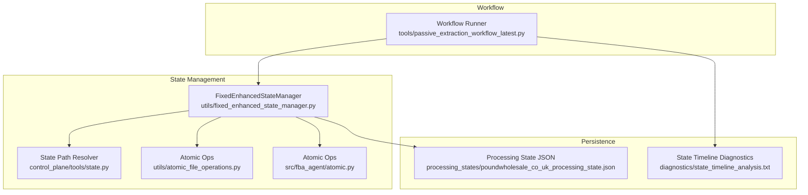
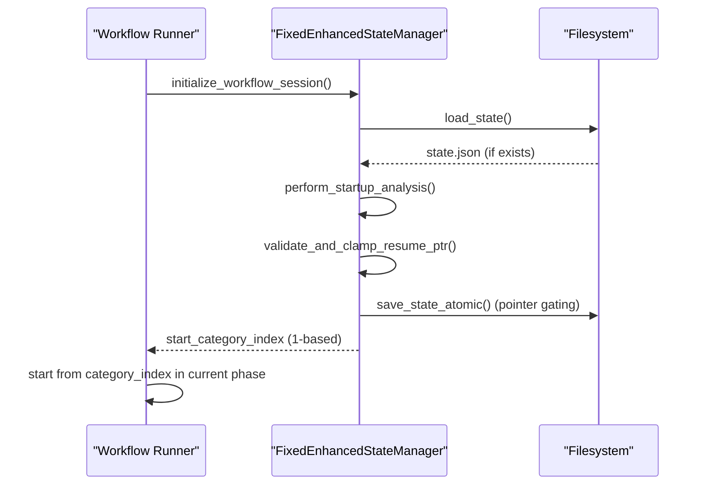
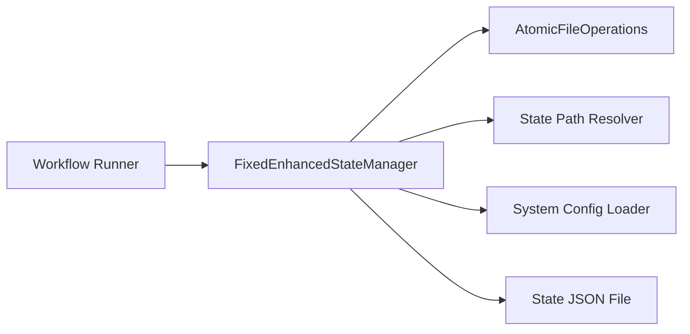
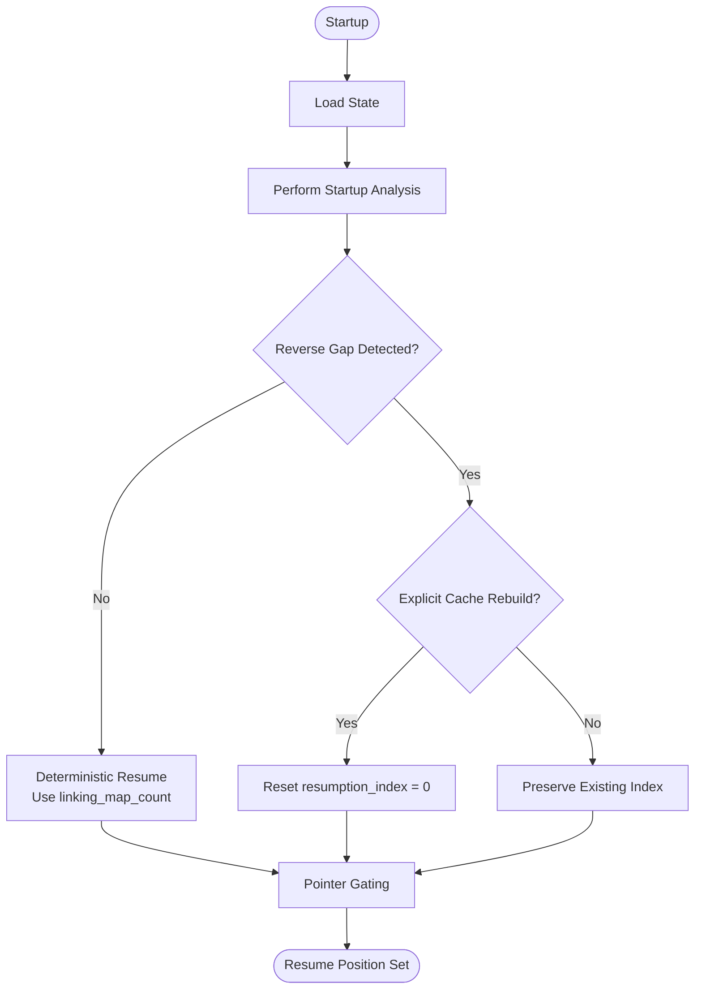

# State Management System

<cite>
**Referenced Files in This Document**
- [fixed_enhanced_state_manager.py](file://utils/fixed_enhanced_state_manager.py)
- [state.py](file://control_plane/tools/state.py)
- [poundwholesale_co_uk_processing_state.json](file://processing_states/poundwholesale_co_uk_processing_state.json)
- [atomic_file_operations.py](file://utils/atomic_file_operations.py)
- [atomic.py](file://src/fba_agent/atomic.py)
- [passive_extraction_workflow_latest.py](file://tools/passive_extraction_workflow_latest.py)
- [state_timeline_analysis.txt](file://diagnostics/state_timeline_analysis.txt)
- [Resumption Failures.md](file://WIKI REPO SEPT17/11. Troubleshooting Guide/11.3. State Management Issues/11.3.2. Resumption Failures.md)
- [State Validation and Integrity.md](file://WIKI REPO SEPT17/6. State Management System/6.4. State Validation And Integrity.md)
</cite>

## Table of Contents
1. [Introduction](#introduction)
2. [Project Structure](#project-structure)
3. [Core Components](#core-components)
4. [Architecture Overview](#architecture-overview)
5. [Detailed Component Analysis](#detailed-component-analysis)
6. [Dependency Analysis](#dependency-analysis)
7. [Performance Considerations](#performance-considerations)
8. [Troubleshooting Guide](#troubleshooting-guide)
9. [Conclusion](#conclusion)

## Introduction
This document describes the State Management System responsible for zero-risk progress tracking and resumption in long-running workflows. It explains file-based state persistence, the seven zero-risk methods for accurate progress counting, integration with the workflow execution chain, processing state tracking, resumption logic, recovery procedures for interrupted runs, state validation and integrity checking, progress calculation algorithms, and compatibility with the broader workflow engine. Practical examples demonstrate state configuration, progress monitoring, and troubleshooting state corruption issues, along with the relationship to the cache management system and how state tracking enables marathon session support.

## Project Structure
The State Management System spans several modules:
- State persistence and management: `utils/fixed_enhanced_state_manager.py`
- Path resolution for state files: `control_plane/tools/state.py`
- Atomic file operations: `utils/atomic_file_operations.py` and `src/fba_agent/atomic.py`
- Example state file: `processing_states/poundwholesale_co_uk_processing_state.json`
- Workflow integration: `tools/passive_extraction_workflow_latest.py`
- Diagnostics and troubleshooting: `diagnostics/state_timeline_analysis.txt` and wiki troubleshooting documents

**Diagram sources**
- [fixed_enhanced_state_manager.py](file://utils/fixed_enhanced_state_manager.py#L86-L238)
- [state.py](file://control_plane/tools/state.py#L10-L21)
- [atomic_file_operations.py](file://utils/atomic_file_operations.py#L17-L154)
- [atomic.py](file://src/fba_agent/atomic.py#L10-L50)
- [passive_extraction_workflow_latest.py](file://tools/passive_extraction_workflow_latest.py#L2270-L2293)
- [poundwholesale_co_uk_processing_state.json](file://processing_states/poundwholesale_co_uk_processing_state.json#L1-L120)
- [state_timeline_analysis.txt](file://diagnostics/state_timeline_analysis.txt#L1-L330)

**Section sources**
- [fixed_enhanced_state_manager.py](file://utils/fixed_enhanced_state_manager.py#L86-L238)
- [state.py](file://control_plane/tools/state.py#L10-L21)
- [atomic_file_operations.py](file://utils/atomic_file_operations.py#L17-L154)
- [atomic.py](file://src/fba_agent/atomic.py#L10-L50)
- [passive_extraction_workflow_latest.py](file://tools/passive_extraction_workflow_latest.py#L2270-L2293)
- [poundwholesale_co_uk_processing_state.json](file://processing_states/poundwholesale_co_uk_processing_state.json#L1-L120)
- [state_timeline_analysis.txt](file://diagnostics/state_timeline_analysis.txt#L1-L330)

## Core Components
- FixedEnhancedStateManager: Central state manager providing thread-safe, atomic state persistence, startup analysis, resumption logic, and integrity validation.
- State Path Resolver: Utility to compute state file paths per supplier domain.
- Atomic File Operations: Cross-platform atomic write/read with file locking and JSON validation.
- Workflow Integration: Workflow runner delegates authoritative startup and resumption decisions to the state manager.
- Example State File: Demonstrates persisted state structure and progress markers.

Key responsibilities:
- Authoritative startup and resumption via a single entry point
- File-grounded progress reconciliation using linking map and cache
- Monotonic progress guarantees and cross-run monotonicity checks
- Real-time category product updates and gap detection policies
- Thread-safe atomic writes with fallbacks and validation

**Section sources**
- [fixed_enhanced_state_manager.py](file://utils/fixed_enhanced_state_manager.py#L86-L238)
- [state.py](file://control_plane/tools/state.py#L10-L21)
- [atomic_file_operations.py](file://utils/atomic_file_operations.py#L17-L154)
- [atomic.py](file://src/fba_agent/atomic.py#L10-L50)
- [passive_extraction_workflow_latest.py](file://tools/passive_extraction_workflow_latest.py#L2270-L2293)

## Architecture Overview
The system enforces a single, authoritative startup path that loads state, performs startup analysis once, and returns the correct resumption position. The workflow runner calls the state manager’s initialization method, which blocks pointer writes until analysis completes, ensuring consistency.

**Diagram sources**
- [fixed_enhanced_state_manager.py](file://utils/fixed_enhanced_state_manager.py#L247-L283)
- [passive_extraction_workflow_latest.py](file://tools/passive_extraction_workflow_latest.py#L2270-L2293)

**Section sources**
- [fixed_enhanced_state_manager.py](file://utils/fixed_enhanced_state_manager.py#L247-L283)
- [passive_extraction_workflow_latest.py](file://tools/passive_extraction_workflow_latest.py#L2270-L2293)

## Detailed Component Analysis

### FixedEnhancedStateManager
The state manager centralizes all resumption logic and progress tracking. It separates resumption index from progress tracking, performs reverse gap detection only at startup, updates category totals with real-time discoveries, and preserves interruption state correctly.

Key methods and behaviors:
- initialize_workflow_session(): Authoritative startup entry point; loads state, performs startup analysis, and returns start category index.
- load_state(): Loads persisted state with backward compatibility and sets authoritative is_fresh_start flag.
- perform_startup_analysis(): One-time analysis at startup; reconciles counters using linking map as single source of truth; determines resumption policy (reverse gap vs deterministic).
- validate_and_clamp_resume_ptr(): Clamps progress values to be within bounds of work denominator.
- update_discovered_products_in_category(): Updates category totals with real-time scraping discoveries.
- validate_and_repair_state(): Validates and repairs state inconsistencies.
- force_cache_rebuild(): Explicitly forces cache rebuild and resets resume index.

Thread safety and atomicity:
- Uses RLock for re-entrant locks and optional ThreadSafeStateWriter for atomic commits.
- Integrates atomic file operations for safe writes.

Progress reconciliation and gap handling:
- Uses file-grounded data (linking map and cache) to reconcile counters.
- Supports deterministic resume or reverse gap detection depending on configuration.

Monotonicity and integrity:
- Cross-run monotonicity checks prevent regressions.
- Pointer gating ensures pointer fields are only persisted after startup analysis.

**Section sources**
- [fixed_enhanced_state_manager.py](file://utils/fixed_enhanced_state_manager.py#L86-L238)
- [fixed_enhanced_state_manager.py](file://utils/fixed_enhanced_state_manager.py#L247-L283)
- [fixed_enhanced_state_manager.py](file://utils/fixed_enhanced_state_manager.py#L469-L645)
- [fixed_enhanced_state_manager.py](file://utils/fixed_enhanced_state_manager.py#L665-L735)
- [fixed_enhanced_state_manager.py](file://utils/fixed_enhanced_state_manager.py#L737-L807)

### Atomic File Operations
Provides cross-platform atomic JSON read/write with file locking and JSON integrity validation. Ensures safe concurrent access and prevents partial writes.

Capabilities:
- Atomic JSON write/read with locking
- Safe backup creation
- JSON integrity validation
- Cross-platform file locking (Windows and Unix)

Fallbacks:
- If atomic operations are unavailable, the state manager gracefully degrades and continues with non-atomic operations.

**Section sources**
- [atomic_file_operations.py](file://utils/atomic_file_operations.py#L17-L154)

### State Path Resolution
Computes the processing state file path for a given supplier domain under the OUTPUTS/CACHE/processing_states directory.

**Section sources**
- [state.py](file://control_plane/tools/state.py#L10-L21)

### Workflow Integration
The workflow runner delegates to the state manager for authoritative startup and resumption. It binds the start category index using a monotonic MAX between persistent category index and computed session cursor, ensuring progress never moves backward.

**Section sources**
- [passive_extraction_workflow_latest.py](file://tools/passive_extraction_workflow_latest.py#L2270-L2293)

### Example State File
The example processing state file demonstrates persisted progress markers, category completion status, and metadata. It shows how progress is tracked across categories and phases, and how completion lists are maintained.

**Section sources**
- [poundwholesale_co_uk_processing_state.json](file://processing_states/poundwholesale_co_uk_processing_state.json#L1-L120)

## Dependency Analysis
The state manager depends on:
- Atomic file operations for safe persistence
- Path resolver for state file location
- System configuration for toggles (e.g., reverse gap heuristic)
- Workflow runner for authoritative startup coordination

**Diagram sources**
- [fixed_enhanced_state_manager.py](file://utils/fixed_enhanced_state_manager.py#L140-L147)
- [state.py](file://control_plane/tools/state.py#L10-L21)
- [atomic_file_operations.py](file://utils/atomic_file_operations.py#L17-L154)
- [passive_extraction_workflow_latest.py](file://tools/passive_extraction_workflow_latest.py#L2270-L2293)

**Section sources**
- [fixed_enhanced_state_manager.py](file://utils/fixed_enhanced_state_manager.py#L140-L147)
- [state.py](file://control_plane/tools/state.py#L10-L21)
- [atomic_file_operations.py](file://utils/atomic_file_operations.py#L17-L154)
- [passive_extraction_workflow_latest.py](file://tools/passive_extraction_workflow_latest.py#L2270-L2293)

## Performance Considerations
- Tiered validation strategy: Comprehensive startup and completion validation, lightweight runtime checks.
- Atomic operations minimize contention and ensure durability.
- Cross-run monotonicity checks prevent redundant work and maintain progress integrity.
- Real-time category updates avoid unnecessary rescans by updating denominators on discovery.

[No sources needed since this section provides general guidance]

## Troubleshooting Guide

### Resumption Failures and Timeline Analysis
Root cause: Automatic reverse gap reset in save_state() was triggering startup analysis on every save rather than once at session start. This caused resumption index resets and progress regression.

Evidence: State timeline shows fixed resumption_index values alternating with fluctuating last_processed_index, indicating interrupted resumes and resets.

**Diagram sources**
- [fixed_enhanced_state_manager.py](file://utils/fixed_enhanced_state_manager.py#L469-L645)
- [state_timeline_analysis.txt](file://diagnostics/state_timeline_analysis.txt#L1-L330)

**Section sources**
- [Resumption Failures.md](file://WIKI REPO SEPT17/11. Troubleshooting Guide/11.3. State Management Issues/11.3.2. Resumption Failures.md#L21-L27)
- [state_timeline_analysis.txt](file://diagnostics/state_timeline_analysis.txt#L1-L330)

### State Validation and Integrity
The system performs integrity checks to detect impossible index states, phase semantic mixing, and resumption pointer validity. Validation frequency varies by phase to balance thoroughness and performance.

Best practices:
- Regular monitoring of state file health
- Automated alerts for low disk capacity
- Appropriate file permissions for state directories
- Regular backups of critical state files

**Section sources**
- [State Validation and Integrity.md](file://WIKI REPO SEPT17/6. State Management System/6.4. State Validation And Integrity.md#L297-L326)

### Practical Examples

#### State Configuration
- Fresh start seeding: When no state file exists, defaults include persistent_category_index set to 1 and current_phase set to "supplier".
- System progression structure: Tracks current_phase, persistent_category_index, current_category_url, and product completion counters for both supplier and Amazon phases.

**Section sources**
- [fixed_enhanced_state_manager.py](file://utils/fixed_enhanced_state_manager.py#L194-L238)
- [poundwholesale_co_uk_processing_state.json](file://processing_states/poundwholesale_co_uk_processing_state.json#L1-L120)

#### Progress Monitoring
- Use summarized processing state to monitor current phase, category index, and product completion counters.
- Monitor category completion status for partial vs fully processed categories.

**Section sources**
- [state.py](file://control_plane/tools/state.py#L23-L42)
- [poundwholesale_co_uk_processing_state.json](file://processing_states/poundwholesale_co_uk_processing_state.json#L384-L800)

#### Troubleshooting State Corruption
- Use validate_and_repair_state() to detect and repair missing keys, out-of-bounds indices, and inconsistent structures.
- Apply cross-run monotonicity checks to prevent regressions.
- Review state timeline patterns to identify resumption anomalies.

**Section sources**
- [fixed_enhanced_state_manager.py](file://utils/fixed_enhanced_state_manager.py#L665-L735)
- [state_timeline_analysis.txt](file://diagnostics/state_timeline_analysis.txt#L1-L330)

## Conclusion
The State Management System provides robust, zero-risk progress tracking and resumption through centralized startup analysis, file-grounded reconciliation, atomic persistence, and integrity validation. Its integration with the workflow engine ensures monotonic progress, supports marathon sessions, and recovers reliably from interruptions. The seven zero-risk methods—authoritative startup, reverse gap policy, monotonic pointers, real-time updates, cross-run checks, validated repairs, and atomic operations—combine to deliver a resilient state management solution compatible with the broader workflow engine and cache management system.