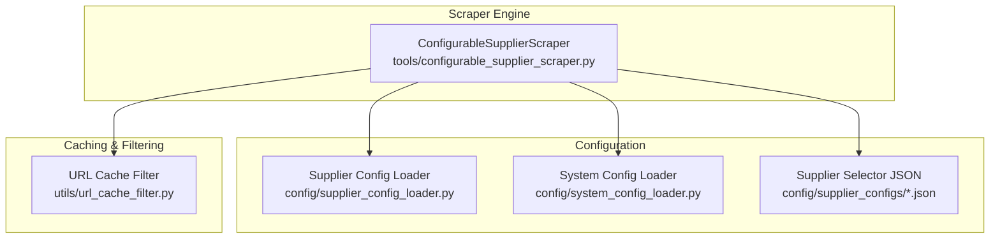
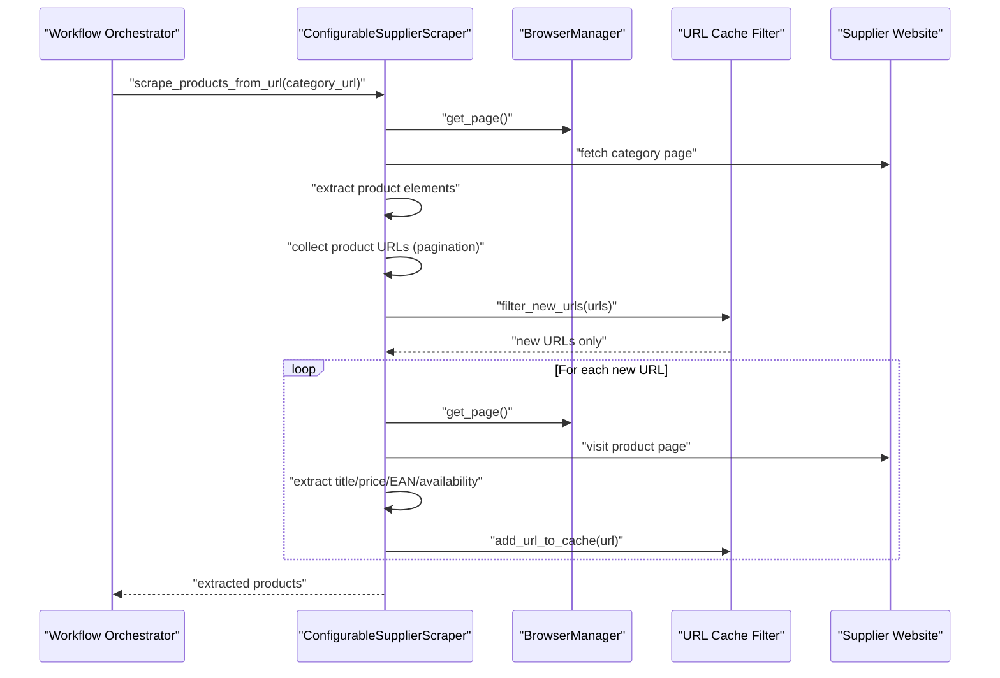
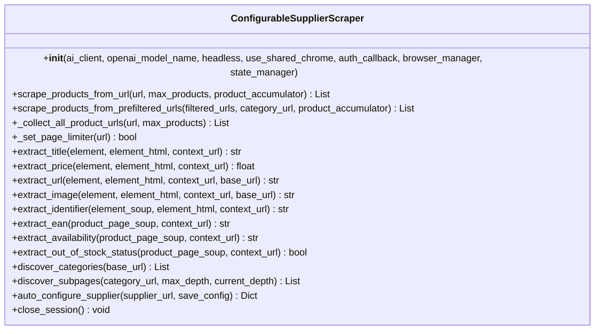
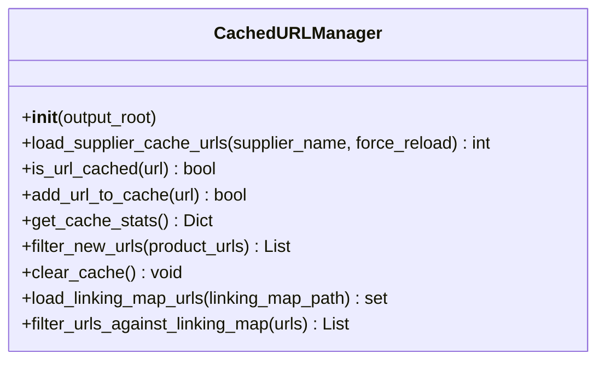
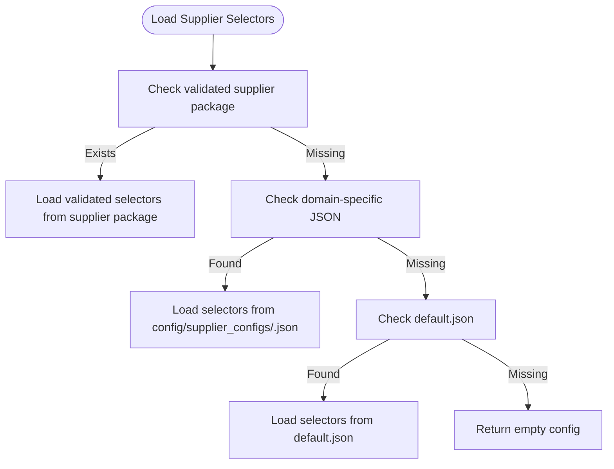
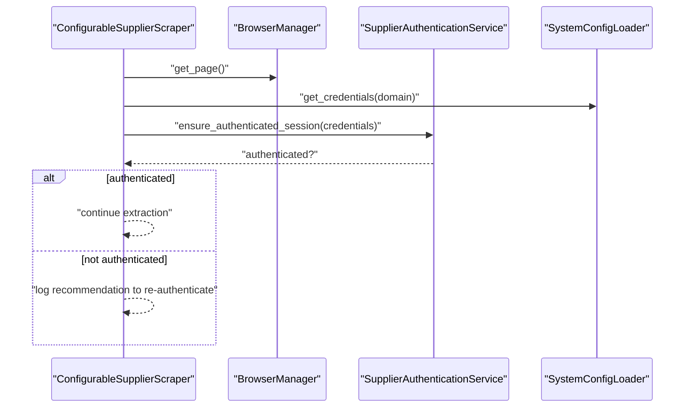
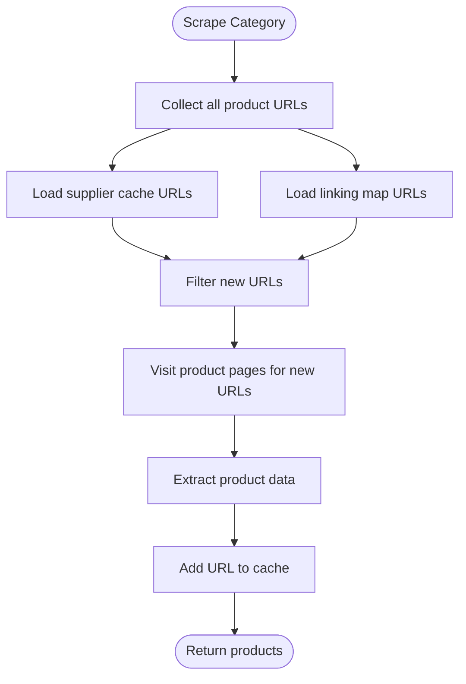
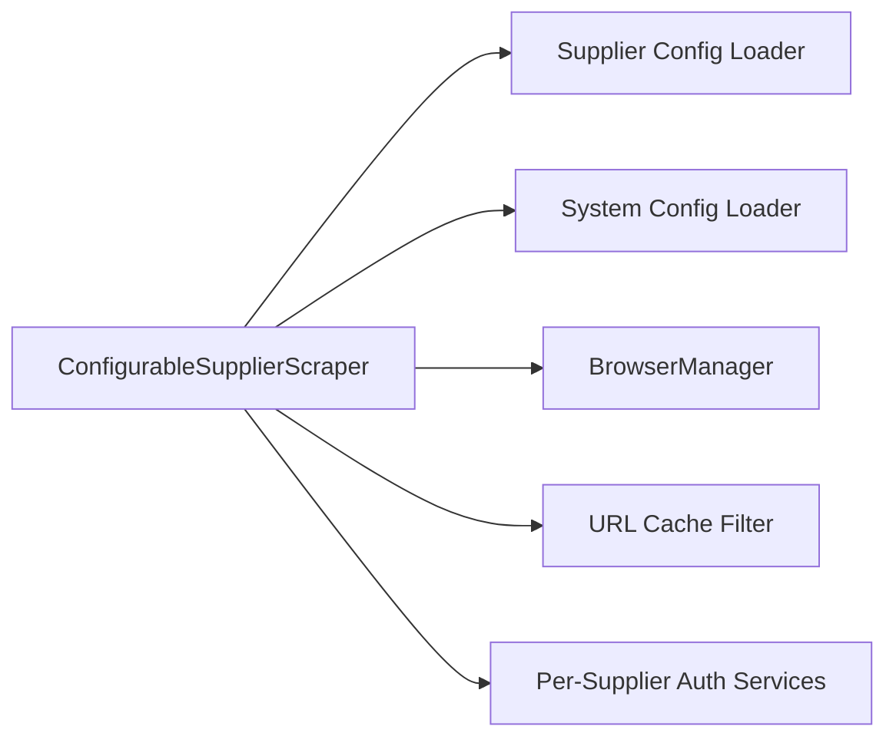

# Supplier Scraper

<cite>
**Referenced Files in This Document**
- [configurable_supplier_scraper.py](file://tools/configurable_supplier_scraper.py)
- [url_cache_filter.py](file://utils/url_cache_filter.py)
- [supplier_config_loader.py](file://config/supplier_config_loader.py)
- [system_config_loader.py](file://config/system_config_loader.py)
- [poundwholesale.co.uk.json](file://config/supplier_configs/poundwholesale.co.uk.json)
</cite>

## Table of Contents
1. [Introduction](#introduction)
2. [Project Structure](#project-structure)
3. [Core Components](#core-components)
4. [Architecture Overview](#architecture-overview)
5. [Detailed Component Analysis](#detailed-component-analysis)
6. [Dependency Analysis](#dependency-analysis)
7. [Performance Considerations](#performance-considerations)
8. [Troubleshooting Guide](#troubleshooting-guide)
9. [Conclusion](#conclusion)

## Introduction
This document explains the Supplier Scraper component that extracts product data from supplier websites. It covers the configurable scraping architecture with dynamic selector support, URL filtering mechanisms, multi-category deduplication logic, supplier configuration system, authentication handling, and batch processing capabilities. It also documents the URL cache filter implementation that prevents duplicate processing of the same product URLs across categories, and integrates the scraper with the caching system to maintain consistency with the overall workflow execution.

## Project Structure
The Supplier Scraper is implemented as a configurable, Playwright-backed web scraper with externalized selector configuration and integrated caching and deduplication. Key elements:
- Scraper engine: tools/configurable_supplier_scraper.py
- URL cache filter: utils/url_cache_filter.py
- Supplier configuration loader: config/supplier_config_loader.py
- System configuration loader: config/system_config_loader.py
- Supplier selector configuration examples: config/supplier_configs/*.json

**Diagram sources**
- [configurable_supplier_scraper.py](file://tools/configurable_supplier_scraper.py#L82-L167)
- [url_cache_filter.py](file://utils/url_cache_filter.py#L31-L47)
- [supplier_config_loader.py](file://config/supplier_config_loader.py#L23-L69)
- [system_config_loader.py](file://config/system_config_loader.py#L9-L27)
- [poundwholesale.co.uk.json](file://config/supplier_configs/poundwholesale.co.uk.json#L1-L137)

**Section sources**
- [configurable_supplier_scraper.py](file://tools/configurable_supplier_scraper.py#L1-L100)
- [url_cache_filter.py](file://utils/url_cache_filter.py#L1-L50)
- [supplier_config_loader.py](file://config/supplier_config_loader.py#L1-L40)
- [system_config_loader.py](file://config/system_config_loader.py#L1-L30)
- [poundwholesale.co.uk.json](file://config/supplier_configs/poundwholesale.co.uk.json#L1-L40)

## Core Components
- ConfigurableSupplierScraper: Orchestrates scraping with Playwright, loads supplier-specific selectors, handles pagination, filters URLs, and performs extraction with AI fallbacks.
- URL Cache Filter: Provides fast, in-memory duplicate detection for product URLs across suppliers and categories.
- Supplier Config Loader: Loads domain-specific selector configurations from JSON files and provides helper utilities.
- System Config Loader: Loads system-wide configuration (e.g., processing limits, batch sizes) used by the scraper.
- Supplier Selector JSON: Per-domain configuration files defining selectors, pagination, and navigation settings.

**Section sources**
- [configurable_supplier_scraper.py](file://tools/configurable_supplier_scraper.py#L82-L167)
- [url_cache_filter.py](file://utils/url_cache_filter.py#L31-L98)
- [supplier_config_loader.py](file://config/supplier_config_loader.py#L23-L69)
- [system_config_loader.py](file://config/system_config_loader.py#L9-L27)
- [poundwholesale.co.uk.json](file://config/supplier_configs/poundwholesale.co.uk.json#L1-L137)

## Architecture Overview
The Supplier Scraper follows a layered architecture:
- Configuration Layer: Loads supplier and system configuration.
- Selector Resolution: Resolves domain-specific selectors from JSON or validated supplier packages.
- Browser Layer: Uses Playwright via a centralized BrowserManager for robust, anti-detection navigation.
- Extraction Layer: Extracts product data from category and product pages using selectors and AI fallbacks.
- Caching & Deduplication: Filters URLs against cached and linking-map URLs to avoid redundant processing.
- Authentication: Integrates with per-supplier authentication services to maintain session validity.

**Diagram sources**
- [configurable_supplier_scraper.py](file://tools/configurable_supplier_scraper.py#L477-L880)
- [url_cache_filter.py](file://utils/url_cache_filter.py#L153-L171)

**Section sources**
- [configurable_supplier_scraper.py](file://tools/configurable_supplier_scraper.py#L477-L880)
- [url_cache_filter.py](file://utils/url_cache_filter.py#L153-L171)

## Detailed Component Analysis

### ConfigurableSupplierScraper
The scraper encapsulates:
- Initialization and configuration loading (system and AI settings).
- Browser management via BrowserManager (Playwright).
- Category and product page navigation, pagination (URL and button-based).
- Dynamic selector resolution from supplier JSON or validated supplier packages.
- Extraction helpers for title, price, URL, image, EAN/identifier, availability.
- AI-assisted selector discovery and field extraction.
- URL filtering and caching integration.
- Authentication integration hooks for per-supplier services.
- Batch processing and progress callbacks for workflow integration.

Key behaviors:
- Selector loading prioritizes validated supplier packages, then legacy JSON files, then filesystem fallbacks.
- Pagination supports URL-based patterns and button-based “Load More” interactions with JavaScript or CSS selectors.
- URL filtering uses CachedURLManager to pre-filter URLs against cached product lists and linking maps.
- Memory management and cleanup are built-in to prevent leaks during long-running extractions.

**Diagram sources**
- [configurable_supplier_scraper.py](file://tools/configurable_supplier_scraper.py#L82-L167)
- [configurable_supplier_scraper.py](file://tools/configurable_supplier_scraper.py#L1327-L1387)
- [configurable_supplier_scraper.py](file://tools/configurable_supplier_scraper.py#L2355-L2410)
- [configurable_supplier_scraper.py](file://tools/configurable_supplier_scraper.py#L2412-L2430)
- [configurable_supplier_scraper.py](file://tools/configurable_supplier_scraper.py#L2432-L2449)
- [configurable_supplier_scraper.py](file://tools/configurable_supplier_scraper.py#L2495-L2514)
- [configurable_supplier_scraper.py](file://tools/configurable_supplier_scraper.py#L2516-L2717)
- [configurable_supplier_scraper.py](file://tools/configurable_supplier_scraper.py#L3470-L3550)
- [configurable_supplier_scraper.py](file://tools/configurable_supplier_scraper.py#L3573-L3599)
- [configurable_supplier_scraper.py](file://tools/configurable_supplier_scraper.py#L3601-L3639)

**Section sources**
- [configurable_supplier_scraper.py](file://tools/configurable_supplier_scraper.py#L82-L167)
- [configurable_supplier_scraper.py](file://tools/configurable_supplier_scraper.py#L1327-L1387)
- [configurable_supplier_scraper.py](file://tools/configurable_supplier_scraper.py#L2355-L2410)
- [configurable_supplier_scraper.py](file://tools/configurable_supplier_scraper.py#L2412-L2430)
- [configurable_supplier_scraper.py](file://tools/configurable_supplier_scraper.py#L2432-L2449)
- [configurable_supplier_scraper.py](file://tools/configurable_supplier_scraper.py#L2495-L2514)
- [configurable_supplier_scraper.py](file://tools/configurable_supplier_scraper.py#L2516-L2717)
- [configurable_supplier_scraper.py](file://tools/configurable_supplier_scraper.py#L3470-L3550)
- [configurable_supplier_scraper.py](file://tools/configurable_supplier_scraper.py#L3573-L3599)
- [configurable_supplier_scraper.py](file://tools/configurable_supplier_scraper.py#L3601-L3639)

### URL Cache Filter
The URL Cache Filter provides:
- In-memory set-based lookup for O(1) duplicate detection.
- Loading cached URLs from supplier product cache files.
- Loading URLs from linking maps to prevent reprocessing already linked entries.
- Real-time updates to cache during extraction.
- Statistics and logging for monitoring.

**Diagram sources**
- [url_cache_filter.py](file://utils/url_cache_filter.py#L31-L47)
- [url_cache_filter.py](file://utils/url_cache_filter.py#L49-L98)
- [url_cache_filter.py](file://utils/url_cache_filter.py#L104-L138)
- [url_cache_filter.py](file://utils/url_cache_filter.py#L140-L151)
- [url_cache_filter.py](file://utils/url_cache_filter.py#L153-L171)
- [url_cache_filter.py](file://utils/url_cache_filter.py#L179-L206)

**Section sources**
- [url_cache_filter.py](file://utils/url_cache_filter.py#L31-L98)
- [url_cache_filter.py](file://utils/url_cache_filter.py#L140-L171)
- [url_cache_filter.py](file://utils/url_cache_filter.py#L179-L206)

### Supplier Configuration System
The configuration system supports:
- Domain-specific selector JSON files under config/supplier_configs/.
- Default fallback selector JSON.
- Validation of supplier packages with a .supplier_ready marker and validated product_selectors.json.
- Helper functions to load selectors, derive domains from URLs, and save configurations.

**Diagram sources**
- [supplier_config_loader.py](file://config/supplier_config_loader.py#L23-L69)
- [configurable_supplier_scraper.py](file://tools/configurable_supplier_scraper.py#L1897-L2003)

**Section sources**
- [supplier_config_loader.py](file://config/supplier_config_loader.py#L23-L69)
- [configurable_supplier_scraper.py](file://tools/configurable_supplier_scraper.py#L1897-L2003)

### Authentication Handling
The scraper integrates with per-supplier authentication services:
- Dynamically imports supplier-specific authentication modules.
- Periodically verifies authentication during extraction.
- Supports credential retrieval from system configuration for login checks.
- Logs actionable messages when authentication fails.

**Diagram sources**
- [configurable_supplier_scraper.py](file://tools/configurable_supplier_scraper.py#L800-L842)
- [configurable_supplier_scraper.py](file://tools/configurable_supplier_scraper.py#L1114-L1176)

**Section sources**
- [configurable_supplier_scraper.py](file://tools/configurable_supplier_scraper.py#L800-L842)
- [configurable_supplier_scraper.py](file://tools/configurable_supplier_scraper.py#L1114-L1176)

### Batch Processing and Progress Tracking
The scraper supports:
- Real-time progress updates via a progress callback.
- Debounced state persistence through a state manager.
- Accumulation of extracted products into a shared list for live reporting.
- Price filtering based on system configuration limits.

**Section sources**
- [configurable_supplier_scraper.py](file://tools/configurable_supplier_scraper.py#L705-L767)
- [configurable_supplier_scraper.py](file://tools/configurable_supplier_scraper.py#L1061-L1101)

### Multi-Category Deduplication Logic
The scraper implements multi-category deduplication by:
- Pre-loading cached URLs from supplier product cache files.
- Loading URLs from linking maps to exclude already-processed entries.
- Classifying discovered URLs into new vs known, returning “stub” products for known URLs to maintain list length consistency.
- Updating the cache incrementally during extraction.

**Diagram sources**
- [configurable_supplier_scraper.py](file://tools/configurable_supplier_scraper.py#L513-L575)
- [configurable_supplier_scraper.py](file://tools/configurable_supplier_scraper.py#L582-L591)
- [url_cache_filter.py](file://utils/url_cache_filter.py#L49-L98)
- [url_cache_filter.py](file://utils/url_cache_filter.py#L179-L196)

**Section sources**
- [configurable_supplier_scraper.py](file://tools/configurable_supplier_scraper.py#L513-L575)
- [configurable_supplier_scraper.py](file://tools/configurable_supplier_scraper.py#L582-L591)
- [url_cache_filter.py](file://utils/url_cache_filter.py#L49-L98)
- [url_cache_filter.py](file://utils/url_cache_filter.py#L179-L196)

### Practical Examples

#### Supplier Configuration Setup
- Place a domain-specific JSON file in config/supplier_configs/<domain>.json.
- Define field_mappings for product_item, title, price, url, image, ean, barcode, product_code, sku, out_of_stock, stock_status.
- Configure pagination with pattern and next_button_selector or next_button_javascript for button-based pagination.
- Optionally enable page_limiter to increase products per page.

Example reference:
- [poundwholesale.co.uk.json](file://config/supplier_configs/poundwholesale.co.uk.json#L1-L137)

**Section sources**
- [poundwholesale.co.uk.json](file://config/supplier_configs/poundwholesale.co.uk.json#L1-L137)

#### Custom Selector Creation
- Use auto_configure_supplier to discover selectors from a supplier homepage.
- Review and refine discovered selectors in the generated configuration.
- Save the configuration for reuse.

**Section sources**
- [configurable_supplier_scraper.py](file://tools/configurable_supplier_scraper.py#L2269-L2331)

#### Troubleshooting Scraping Issues
Common issues and resolutions:
- Navigation failures: Check rate limits and bot detection responses; the scraper includes retry logic and delays.
- Missing prices: The scraper triggers authentication checks and falls back to AI extraction.
- Memory pressure: Built-in memory checks and forced cleanup are executed periodically.
- Duplicate processing: Ensure URL cache and linking map are loaded and updated during extraction.

**Section sources**
- [configurable_supplier_scraper.py](file://tools/configurable_supplier_scraper.py#L338-L467)
- [configurable_supplier_scraper.py](file://tools/configurable_supplier_scraper.py#L772-L845)
- [configurable_supplier_scraper.py](file://tools/configurable_supplier_scraper.py#L857-L862)

## Dependency Analysis
The Supplier Scraper depends on:
- Configuration loaders for supplier and system settings.
- Centralized BrowserManager for Playwright instances.
- URL Cache Filter for efficient duplicate detection.
- Per-supplier authentication services for session maintenance.

**Diagram sources**
- [configurable_supplier_scraper.py](file://tools/configurable_supplier_scraper.py#L58-L68)
- [configurable_supplier_scraper.py](file://tools/configurable_supplier_scraper.py#L243-L283)
- [configurable_supplier_scraper.py](file://tools/configurable_supplier_scraper.py#L515-L552)
- [configurable_supplier_scraper.py](file://tools/configurable_supplier_scraper.py#L942-L985)

**Section sources**
- [configurable_supplier_scraper.py](file://tools/configurable_supplier_scraper.py#L58-L68)
- [configurable_supplier_scraper.py](file://tools/configurable_supplier_scraper.py#L243-L283)
- [configurable_supplier_scraper.py](file://tools/configurable_supplier_scraper.py#L515-L552)
- [configurable_supplier_scraper.py](file://tools/configurable_supplier_scraper.py#L942-L985)

## Performance Considerations
- Efficient URL filtering reduces unnecessary page visits and speeds up extraction.
- Memory management includes periodic garbage collection and forced cleanup to prevent leaks.
- Browser reuse via BrowserManager minimizes startup overhead.
- Pagination safety limits prevent excessive resource consumption.

[No sources needed since this section provides general guidance]

## Troubleshooting Guide
- Rate limiting and bot detection: The scraper includes retry logic and delays; monitor logs for 429/403 responses.
- Authentication failures: The scraper proactively checks authentication and logs recommendations.
- Selector mismatches: Use AI-assisted discovery and refine selector configurations.
- Cache inconsistencies: Verify cache file paths and linking map locations; ensure cache updates occur during extraction.

**Section sources**
- [configurable_supplier_scraper.py](file://tools/configurable_supplier_scraper.py#L395-L410)
- [configurable_supplier_scraper.py](file://tools/configurable_supplier_scraper.py#L818-L828)
- [configurable_supplier_scraper.py](file://tools/configurable_supplier_scraper.py#L2171-L2267)
- [url_cache_filter.py](file://utils/url_cache_filter.py#L60-L102)

## Conclusion
The Supplier Scraper provides a robust, configurable, and efficient solution for extracting product data from supplier websites. Its dynamic selector system, URL caching and deduplication, authentication integration, and batch processing capabilities ensure reliable operation across diverse supplier environments while maintaining consistency with the broader workflow.